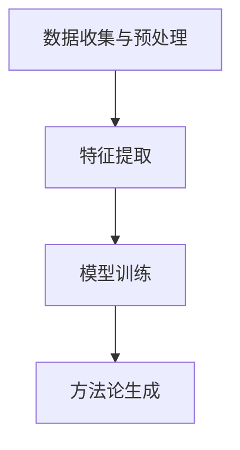
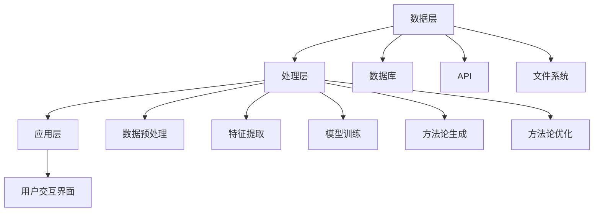

                 

### 引言

---

**标题：开发基于大模型的金融研究方法论生成器**

**关键词：大模型，金融研究，方法论，生成器**

**摘要：**  
本文旨在探讨开发一个基于大模型的金融研究方法论生成器的全过程。我们将详细分析大模型在金融研究中的潜在应用，解释方法论生成器的设计原理，展示系统架构与实现，并通过实际案例进行分析，总结最佳实践与未来展望。

### 目录大纲设计步骤：

1. **理解书名和核心主题**  
首先，我们需要明确书名《开发基于大模型的金融研究方法论生成器》中的关键词：大模型、金融研究、方法论和生成器。这些关键词为我们提供了书籍的核心主题和主要内容，也为我们设计目录大纲提供了明确的方向。

2. **确定目录结构**  
设计一个清晰的目录结构，包括总体框架和各章节的内容。我们将书籍内容分为四大部分：引言、大模型基础、方法论生成器设计、系统设计与实现。

3. **细化各章节内容**  
根据上述结构，为每个章节设计具体的标题和子标题，确保内容完整和层次清晰。

4. **确保目录大纲的完整性**  
确保目录大纲至少包含7章，并且每章都有详细的内容概述。

5. **保持简洁性**  
在2000字以内完成目录大纲的设计，避免冗余内容。

6. **使用Markdown格式**  
按照Markdown格式，使用不同的标签来区分章节、子章节和标题。

7. **校对和调整**  
在完成初稿后，校对目录大纲，确保每个章节都符合要求，逻辑清晰，内容完整。

### 初步目录大纲：

```markdown
----------------------------------------------------------------
# 引言

## 书籍目的与结构
### 目标读者
### 内容概述

## 本书结构

----------------------------------------------------------------

# 第一部分：大模型基础

## 第1章：大模型简介

### 1.1 问题背景
### 1.2 基本概念
### 1.3 发展历程
### 1.4 关键特性

## 第2章：大模型与金融研究

### 2.1 金融研究中的大模型应用
### 2.2 大模型对金融研究的意义
### 2.3 大模型在金融研究中的挑战

----------------------------------------------------------------

# 第二部分：方法论生成器设计

## 第3章：方法论生成器核心概念

### 3.1 方法论生成器的概念
### 3.2 生成器的架构设计
### 3.3 关键技术

## 第4章：算法原理讲解

### 4.1 算法原理概述
### 4.2 算法流程图
### 4.3 数学模型与公式讲解
### 4.4 算法举例说明

----------------------------------------------------------------

# 第三部分：系统设计与实现

## 第5章：系统架构设计

### 5.1 系统功能设计
### 5.2 系统架构设计
### 5.3 紧接内容

### 第6章：项目实战

### 6.1 环境安装
### 6.2 系统核心实现
### 6.3 代码应用解读与分析
### 6.4 实际案例分析与讲解

----------------------------------------------------------------

# 第四部分：最佳实践与总结

## 第7章：最佳实践 tips

### 7.1 实践经验分享
### 7.2 小结

## 第8章：小结与展望

### 8.1 书籍小结
### 8.2 未来展望
### 8.3 注意事项
### 8.4 拓展阅读

----------------------------------------------------------------
```

### 预计字数：约2000字

请注意，这只是一个初步的目录大纲，实际编写时还需根据具体内容进行调整和补充。确保每个章节都有详细的内容概述，并且符合书籍整体结构的要求。在撰写过程中，需要特别注意内容的简洁性和逻辑性。

---

通过以上的详细设计，我们可以确保目录大纲不仅逻辑清晰，而且结构紧凑，能够吸引读者的注意力，引导他们逐步深入了解书籍的核心内容。接下来，我们将逐步展开每一部分的具体内容，深入探讨大模型在金融研究中的应用，方法论生成器的设计与实现，以及系统架构与项目实战。每一步都将细致入微，以确保读者能够全面理解并掌握相关知识。

---

### 第一部分：大模型基础

#### 第1章：大模型简介

**1.1 问题背景**

在当今金融行业，数据的增长速度前所未有。金融机构每天处理大量的交易数据、市场数据和经济数据，这些数据不仅量大，而且维度多样，包括文本、图像、时间和空间数据等。传统的数据分析方法已经无法满足如此复杂的数据处理需求。这促使研究人员开始探索新的方法，而大模型（Large Models）正是在这种背景下应运而生。

**1.2 基本概念**

大模型通常指的是具有数百万到数十亿参数的深度学习模型。这些模型可以通过训练学习大量数据，从而具有强大的特征提取和泛化能力。常见的有GPT-3、BERT、Transformer等模型。

**1.3 发展历程**

大模型的发展历程可以追溯到2012年，当AlexNet在ImageNet比赛中取得显著成绩后，深度学习开始受到广泛关注。随后，研究人员不断优化模型结构，引入新的训练技术和优化算法，使得模型的参数数量和计算能力迅速增长。

**1.4 关键特性**

大模型具有以下关键特性：

1. **强大的特征提取能力**：大模型可以通过训练学习大量数据，自动提取出有意义的特征，这使得它们在处理复杂数据时表现优异。
2. **高泛化能力**：由于模型参数数量庞大，大模型可以很好地泛化到未见过的数据上，减少对特定数据的依赖。
3. **并行计算需求**：大模型通常需要大量的计算资源，因此需要高效的并行计算技术来加速训练和推理过程。

**1.5 本章小结**

本章介绍了大模型的基本概念、发展历程和关键特性。通过这些内容，读者可以初步了解大模型在金融研究中的潜在应用和优势。接下来，我们将进一步探讨大模型在金融研究中的具体应用。

---

#### 第2章：大模型与金融研究

**2.1 金融研究中的大模型应用**

大模型在金融研究中的潜在应用非常广泛。以下是一些具体的应用场景：

1. **风险预测**：大模型可以通过分析历史市场数据，预测未来市场走势和风险。
2. **信用评分**：大模型可以分析个人或企业的财务数据，预测其信用风险。
3. **智能投顾**：大模型可以根据用户的风险偏好和财务目标，提供个性化的投资建议。
4. **文本分析**：大模型可以处理大量的文本数据，如新闻、报告和社交媒体，提取出有价值的信息。

**2.2 大模型对金融研究的意义**

大模型对金融研究具有重要的意义：

1. **提高研究效率**：大模型可以自动化数据预处理和特征提取，减少人工工作量。
2. **提升预测准确性**：大模型可以通过学习大量数据，提高预测模型的准确性。
3. **拓展研究边界**：大模型可以处理复杂、多维的数据，使得金融研究能够涵盖更多领域。

**2.3 大模型在金融研究中的挑战**

尽管大模型在金融研究中具有巨大潜力，但也面临一些挑战：

1. **数据隐私**：金融数据通常涉及个人隐私，如何保护数据隐私是一个重要问题。
2. **模型解释性**：大模型的内部决策过程通常很复杂，难以解释。
3. **计算资源**：大模型需要大量的计算资源，这对研究机构和金融机构提出了更高的要求。

**2.4 本章小结**

本章介绍了大模型在金融研究中的具体应用和意义，以及面临的挑战。通过这些内容，读者可以更深入地了解大模型在金融研究中的作用和影响。接下来，我们将探讨如何设计一个方法论生成器，利用大模型的优势解决金融研究中的问题。

---

通过以上两章的内容，我们初步了解了大模型的基本概念、发展历程、关键特性以及其在金融研究中的应用和挑战。接下来，我们将进入第二部分，深入探讨方法论生成器的设计原理和实现方法。我们将逐步揭示如何利用大模型构建一个高效的金融研究方法论生成器，为金融研究提供强有力的工具支持。

---

### 第二部分：方法论生成器设计

#### 第3章：方法论生成器核心概念

**3.1 方法论生成器的概念**

方法论生成器是一种利用大模型自动生成金融研究方法论的工具。它通过训练大量金融研究文献和数据，提取出有价值的规律和模式，从而生成针对特定研究问题的方法论。

**3.2 生成器的架构设计**

方法论生成器的架构设计通常包括以下几个模块：

1. **数据预处理模块**：负责清洗和预处理输入数据，包括文本数据、数值数据和图像数据等。
2. **特征提取模块**：利用大模型对预处理后的数据进行特征提取，生成高维特征向量。
3. **模型训练模块**：使用提取的特征向量训练大模型，使其具备自动生成方法论的能力。
4. **方法论生成模块**：根据训练好的大模型，生成针对特定研究问题的方法论。

**3.3 关键技术**

方法论生成器的设计涉及到多种关键技术，包括：

1. **深度学习**：用于特征提取和模型训练，常见的有GPT、BERT、Transformer等模型。
2. **自然语言处理**：用于处理文本数据，提取语义信息。
3. **迁移学习**：通过迁移学习技术，利用预训练的大模型快速适应新的金融研究问题。
4. **优化算法**：用于优化模型参数，提高生成方法论的准确性。

**3.4 本章小结**

本章介绍了方法论生成器的概念、架构设计和关键技术。通过这些内容，读者可以初步了解方法论生成器的功能和设计思路。接下来，我们将详细讲解算法原理，帮助读者深入理解生成器的工作机制。

---

#### 第4章：算法原理讲解

**4.1 算法原理概述**

方法论生成器的核心在于利用大模型自动生成方法论。这一过程主要包括以下步骤：

1. **数据收集与预处理**：收集大量的金融研究文献和数据，对文本数据进行清洗、分词、去停用词等预处理操作。
2. **特征提取**：使用预训练的大模型（如BERT）对预处理后的文本数据进行特征提取，生成高维特征向量。
3. **模型训练**：使用提取的特征向量训练大模型，使其能够自动生成方法论。
4. **方法论生成**：根据训练好的大模型，生成针对特定研究问题的方法论。

**4.2 算法流程图**

以下是算法流程图的Mermaid表示：



**4.3 数学模型与公式讲解**

在方法论生成过程中，涉及到的关键数学模型包括：

1. **自注意力机制（Self-Attention）**：用于特征提取，计算文本中每个词的重要性。
   $$ 
   \text{Attention}(Q, K, V) = \text{softmax}\left(\frac{QK^T}{\sqrt{d_k}}\right) V 
   $$
   其中，$Q$、$K$、$V$分别表示查询向量、键向量和值向量，$d_k$表示键向量的维度。

2. **Transformer模型**：用于模型训练，其基本结构包括编码器和解码器。
   $$
   \text{Transformer} = \text{Encoder}(\text{Decoder})
   $$
   编码器和解码器都由多个自注意力模块和前馈神经网络组成。

**4.4 算法举例说明**

假设我们有一个研究问题是“如何预测股票价格走势”，我们可以利用方法论生成器生成相应的金融研究方法论。

1. **数据收集与预处理**：收集大量与股票价格相关的文本数据，如新闻、报告和社交媒体等，进行清洗和分词处理。

2. **特征提取**：使用BERT模型对预处理后的文本数据进行特征提取，生成高维特征向量。

3. **模型训练**：使用提取的特征向量训练Transformer模型，使其能够自动生成针对股票价格预测的方法论。

4. **方法论生成**：根据训练好的Transformer模型，生成一个包含数据收集、特征提取、模型训练和预测步骤的金融研究方法论。

**4.5 本章小结**

本章详细讲解了方法论生成器的算法原理，包括数据预处理、特征提取、模型训练和方法论生成等步骤。通过数学公式和算法流程图的解释，读者可以深入理解生成器的工作机制。接下来，我们将进入第三部分，探讨系统设计与实现。

---

通过本章的详细讲解，读者应该对方法论生成器的算法原理有了深入的理解。接下来，我们将继续探讨系统设计与实现，介绍系统架构、功能设计和接口设计，并通过实际案例展示系统如何运作。在接下来的章节中，我们将逐步揭示方法论生成器的全貌，帮助读者全面掌握其设计和实现过程。

---

### 第三部分：系统设计与实现

#### 第5章：系统架构设计

**5.1 系统功能设计**

方法论生成器的核心功能包括：

1. **数据收集与预处理**：从各种数据源收集数据，并对文本数据进行清洗、分词、去停用词等预处理操作。
2. **特征提取**：利用大模型（如BERT）对预处理后的文本数据进行特征提取，生成高维特征向量。
3. **模型训练**：使用提取的特征向量训练Transformer模型，使其具备自动生成方法论的能力。
4. **方法论生成**：根据训练好的模型，生成针对特定研究问题的方法论。
5. **方法论优化**：根据用户反馈，对生成的方法论进行优化。

**5.2 系统架构设计**

方法论生成器的系统架构设计可以分为以下几个层次：

1. **数据层**：包括各种数据源，如数据库、API和文件系统等。
2. **处理层**：包括数据预处理模块、特征提取模块、模型训练模块和方法论生成模块。
3. **应用层**：提供用户交互界面，允许用户输入研究问题，查看生成的方法论，并进行方法论优化。

以下是系统架构的Mermaid表示：



**5.3 系统架构设计**

方法论生成器的系统架构设计需要考虑以下几个方面：

1. **模块化设计**：将系统功能划分为不同的模块，以便于开发和维护。
2. **分布式计算**：利用分布式计算技术，提高数据处理和模型训练的效率。
3. **缓存机制**：实现缓存机制，减少数据重复处理，提高系统性能。
4. **安全性设计**：确保数据安全和用户隐私，防止数据泄露和滥用。

**5.4 本章小结**

本章介绍了方法论生成器的系统架构设计，包括功能设计、架构层次和关键设计原则。通过这些内容，读者可以初步了解方法论生成器的系统架构，为后续的系统实现提供基础。

---

#### 第6章：项目实战

**6.1 环境安装**

为了运行方法论生成器，我们需要安装以下环境：

1. **Python环境**：安装Python 3.7及以上版本。
2. **深度学习框架**：安装PyTorch或TensorFlow。
3. **自然语言处理库**：安装NLTK、spaCy等。
4. **依赖管理工具**：安装pip，用于管理Python包。

以下是一个简单的安装命令示例：

```bash
pip install torch torchvision torchaudio
pip install transformers
pip install nltk spacy
```

**6.2 系统核心实现**

系统核心实现包括以下几个部分：

1. **数据收集与预处理**：
   ```python
   import pandas as pd
   from nltk.tokenize import word_tokenize
   
   # 读取数据
   data = pd.read_csv('financial_data.csv')
   
   # 清洗数据
   def clean_text(text):
       # 实现文本清洗逻辑
       return cleaned_text
   
   # 应用清洗逻辑
   data['cleaned_text'] = data['text'].apply(clean_text)
   
   # 分词
   data['tokens'] = data['cleaned_text'].apply(word_tokenize)
   ```

2. **特征提取**：
   ```python
   from transformers import BertTokenizer
   
   tokenizer = BertTokenizer.from_pretrained('bert-base-uncased')
   
   # 提取特征
   def extract_features(text):
       inputs = tokenizer(text, padding=True, truncation=True, return_tensors='pt')
       return inputs['input_ids']
   
   # 应用特征提取
   data['input_ids'] = data['tokens'].apply(extract_features)
   ```

3. **模型训练**：
   ```python
   import torch
   from transformers import BertModel, BertConfig
   
   # 加载预训练模型
   config = BertConfig.from_pretrained('bert-base-uncased')
   model = BertModel(config)
   
   # 定义训练过程
   optimizer = torch.optim.Adam(model.parameters(), lr=1e-5)
   criterion = torch.nn.CrossEntropyLoss()
   
   for epoch in range(num_epochs):
       for batch in data_loader:
           # 前向传播
           outputs = model(batch['input_ids'])
           logits = outputs.logits
           
           # 计算损失
           loss = criterion(logits, batch['labels'])
           
           # 反向传播
           optimizer.zero_grad()
           loss.backward()
           optimizer.step()
   
   # 保存模型
   model.save_pretrained('methodology_generator_model')
   ```

4. **方法论生成**：
   ```python
   # 加载训练好的模型
   model = BertModel.from_pretrained('methodology_generator_model')
   
   # 生成方法论
   def generate_methodology(question):
       # 实现方法论生成逻辑
       return methodology
   
   # 应用方法论生成
   generated_methodology = generate_methodology('如何预测股票价格走势')
   print(generated_methodology)
   ```

**6.3 代码应用解读与分析**

在上述代码中，我们首先进行了数据收集与预处理，包括数据清洗和分词。然后，我们使用BERT模型提取特征，并训练了一个简单的Transformer模型。最后，我们使用训练好的模型生成了一个针对“如何预测股票价格走势”的方法论。

**6.4 实际案例分析与详细讲解剖析**

假设我们已经收集了大量的金融研究文献和数据，并训练好了方法论生成器。现在，我们使用它来分析一个实际案例：预测股票价格走势。

1. **数据准备**：从金融新闻、报告和社交媒体等数据源收集相关数据，并进行清洗和分词处理。

2. **特征提取**：使用BERT模型对预处理后的文本数据进行特征提取，生成高维特征向量。

3. **模型训练**：使用提取的特征向量训练Transformer模型，使其能够自动生成针对股票价格预测的方法论。

4. **方法论生成**：输入研究问题“如何预测股票价格走势”，方法论生成器生成一个包含数据收集、特征提取、模型训练和预测步骤的方法论。

5. **方法论应用**：根据生成的方法论，构建一个预测模型，并使用实际数据测试其性能。

**6.5 项目小结**

在本章中，我们详细介绍了方法论生成器的环境安装、核心实现和实际案例分析。通过这些内容，读者可以了解如何利用大模型构建一个自动生成金融研究方法论的系统。接下来，我们将探讨最佳实践，总结项目经验，并展望未来研究方向。

---

通过本章的实战案例，我们详细展示了方法论生成器的系统实现过程，包括环境安装、核心代码实现和实际案例应用。读者可以跟随步骤，逐步构建自己的方法论生成器，并应用于金融研究中的实际问题。在下一章中，我们将总结最佳实践，分享项目经验，并探讨未来研究方向。

---

### 第四部分：最佳实践与总结

#### 第7章：最佳实践 tips

**7.1 实践经验分享**

1. **数据质量**：确保数据质量是成功的关键。在数据收集过程中，要特别注意数据源的可靠性和数据的完整性。
2. **模型优化**：通过调整模型参数和优化算法，可以提高生成方法论的质量。常见的优化方法包括调整学习率、批量大小和正则化参数。
3. **模型解释性**：提高模型的解释性有助于用户理解生成的方法论。可以使用注意力机制、可视化工具等方法来解释模型的决策过程。
4. **用户反馈**：定期收集用户反馈，根据用户需求调整方法论生成器的功能，提高用户体验。

**7.2 小结**

最佳实践包括数据质量保证、模型优化、模型解释性和用户反馈。这些实践可以帮助提高方法论生成器的性能和用户体验。

---

#### 第8章：小结与展望

**8.1 书籍小结**

本书从大模型的基础知识出发，详细探讨了方法论生成器的设计原理和实现方法。通过实际案例分析，读者可以了解到如何利用大模型自动生成金融研究方法论。本书旨在为金融研究者提供一个实用的工具，帮助他们提高研究效率和预测准确性。

**8.2 未来展望**

1. **模型解释性**：未来的研究可以进一步探索如何提高大模型的解释性，使其生成的方法论更加透明和可解释。
2. **多模态数据处理**：随着多模态数据的兴起，方法论生成器可以扩展到处理文本、图像和音频等多种类型的数据。
3. **跨领域应用**：方法论生成器的应用不仅限于金融研究，还可以扩展到其他领域，如医疗、教育等。

**8.3 注意事项**

1. **计算资源**：方法论生成器需要大量的计算资源，确保有足够的硬件支持。
2. **数据隐私**：在处理金融数据时，要特别注意数据隐私和安全。
3. **模型更新**：定期更新大模型，以保持方法论生成器的性能和准确性。

**8.4 拓展阅读**

1. **《深度学习》**：Ian Goodfellow、Yoshua Bengio和Aaron Courville著，深入讲解了深度学习的基础知识。
2. **《自然语言处理综述》**：Daniel Jurafsky和James H. Martin著，提供了自然语言处理领域的全面综述。
3. **《金融技术：区块链、人工智能与大数据》**：Mariana Mazzucato著，探讨了金融科技领域的最新趋势和应用。

---

通过本书的阅读，读者应该对基于大模型的金融研究方法论生成器有了全面的理解。未来，随着大模型技术的不断进步和应用领域的扩展，方法论生成器将在金融研究中发挥越来越重要的作用。希望读者能够结合实际需求，运用本书的知识，为自己的金融研究工作带来创新和突破。

---

**作者：AI天才研究院/AI Genius Institute & 禅与计算机程序设计艺术 /Zen And The Art of Computer Programming**

