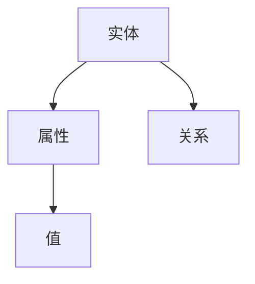
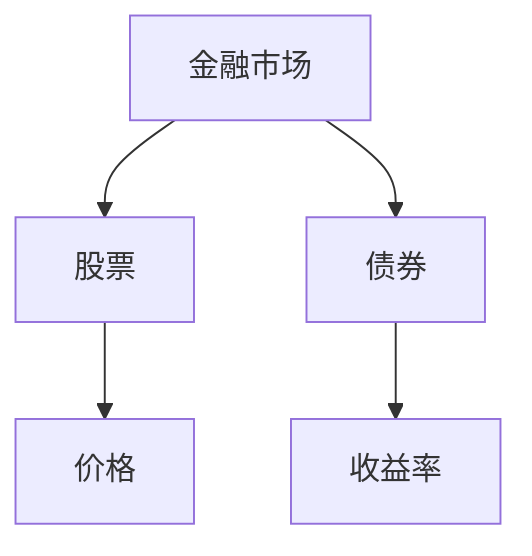
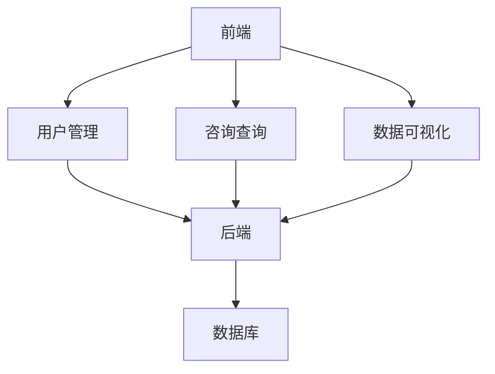
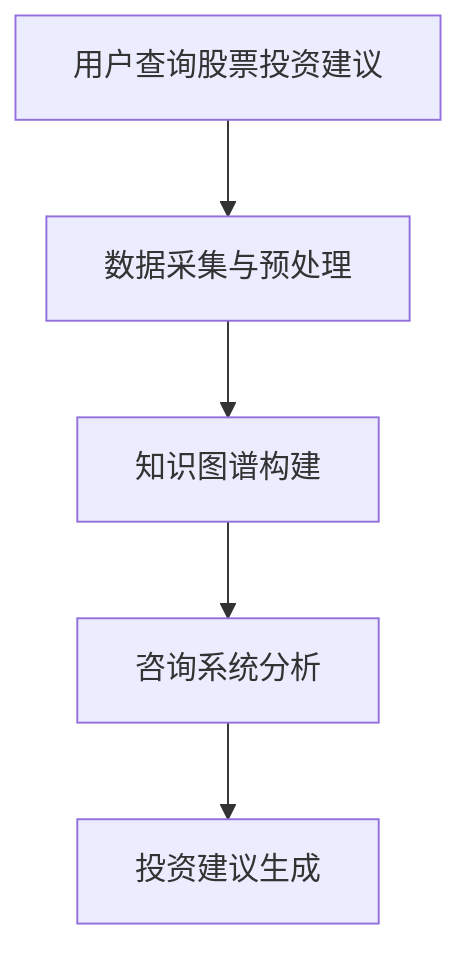

                 

# 开发基于知识图谱的金融咨询系统

## 关键词

- **知识图谱**
- **金融咨询系统**
- **图嵌入算法**
- **图神经网络**
- **系统架构设计**
- **数据预处理**
- **用户交互流程**

## 摘要

本文旨在探讨如何开发一个基于知识图谱的金融咨询系统。我们将首先介绍知识图谱和金融咨询系统的基本概念，然后深入探讨知识图谱的组成、构建过程以及与金融咨询系统的关联。接着，我们将详细讲解金融咨询系统的算法原理，包括图嵌入算法和图神经网络。随后，我们将分析系统的功能设计、架构设计和接口设计，并通过实际案例展示系统实现和运行过程。最后，我们将总结最佳实践、注意事项，并推荐进一步阅读的材料。

## 第一部分：基础知识

### 第1章：知识图谱与金融咨询概述

#### 1.1 什么是知识图谱

知识图谱是一种结构化的知识表示形式，它通过实体、属性和关系的三元组来描述现实世界中的信息。这些三元组构成了知识图谱的基本组成单元，如图1-1所示。



#### 1.2 金融咨询系统的定义

金融咨询系统是一种为用户提供金融信息、分析和建议的系统。它能够帮助用户做出更加明智的金融决策。金融咨询系统的核心功能包括数据收集、数据处理、信息分析和报告生成。

#### 1.3 知识图谱在金融咨询中的作用

知识图谱在金融咨询中起到了关键作用。它能够帮助系统更好地理解金融数据，构建金融知识库，提供更加精准的金融咨询服务。如图1-2所示，知识图谱通过实体、属性和关系的关联，将金融数据有机地整合在一起。



## 第二部分：核心概念与算法

### 第2章：知识图谱的基本概念

#### 2.1 知识图谱的组成

知识图谱的组成主要包括实体、属性和关系。实体是知识图谱中的基本对象，如股票、债券、公司等。属性是实体的特征描述，如价格、收益率等。关系是实体之间的关系，如股票与公司的关系、债券与发行公司的关系等。

#### 2.2 知识图谱的表示方法

知识图谱的表示方法主要有RDF模型、图模型和混合模型。RDF模型是一种基于三元组的数据模型，它通过实体、属性和值的组合来表示知识。图模型则是通过图的结构来表示知识，其中节点代表实体，边代表关系。混合模型则结合了RDF模型和图模型的优点。

#### 2.3 知识图谱的构建

知识图谱的构建包括数据采集、数据清洗、实体抽取和关系抽取。数据采集是从各种数据源收集数据的过程，数据清洗是去除数据中的错误和冗余信息，实体抽取是从数据中提取实体信息，关系抽取是从数据中提取实体之间的关系。

## 第三部分：系统分析与设计

### 第3章：金融咨询系统的功能设计

#### 3.1 系统功能需求分析

金融咨询系统的功能需求包括用户管理、咨询查询和数据可视化。用户管理包括用户注册、登录和权限管理。咨询查询包括股票、债券等金融产品的信息查询。数据可视化包括金融数据的图表展示。

#### 3.2 系统架构设计

金融咨询系统的架构设计包括前端、后端和数据库。前端负责用户交互，后端负责业务逻辑处理，数据库负责数据存储。



### 第4章：金融咨询系统的接口设计

#### 4.1 接口设计原则

金融咨询系统的接口设计遵循RESTful API原则，采用GET和POST方法进行数据交互。

#### 4.2 接口实现示例

用户管理接口：

```python
@app.route('/register', methods=['POST'])
def register():
    # 注册逻辑
    pass

@app.route('/login', methods=['POST'])
def login():
    # 登录逻辑
    pass
```

咨询查询接口：

```python
@app.route('/query', methods=['GET'])
def query():
    # 查询逻辑
    pass
```

## 第四部分：项目实战

### 第5章：环境搭建与系统实现

#### 5.1 环境搭建

安装必要的软件和库，如Python、Neo4j等。

```bash
pip install neo4j
```

#### 5.2 系统核心实现

数据预处理、知识图谱构建和咨询系统实现的代码示例。

```python
# 数据预处理示例
def preprocess_data(data):
    # 预处理逻辑
    pass

# 知识图谱构建示例
def build_knowledge_graph(data):
    # 构建知识图谱逻辑
    pass

# 咨询系统实现示例
def financial_advice(product_name):
    # 咨询逻辑
    pass
```

### 第6章：案例分析

#### 6.1 案例背景

描述一个具体的金融咨询问题，如股票投资建议。

#### 6.2 案例分析

分析知识图谱的构建过程、咨询过程和结果。



## 第五部分：最佳实践、小结与注意事项

### 第7章：最佳实践、小结与注意事项

#### 7.1 最佳实践

- 数据管理：定期更新数据，确保数据质量。
- 系统优化：根据用户反馈优化系统功能。

#### 7.2 小结

本文介绍了基于知识图谱的金融咨询系统的开发过程，包括知识图谱的概念、算法原理、系统设计与实现。

#### 7.3 注意事项

- 数据安全：确保用户数据的安全和隐私。
- 系统维护：定期检查和更新系统。

## 第六部分：拓展阅读

### 第8章：拓展阅读

- **相关知识**：进一步了解知识图谱和金融咨询系统的相关知识。
- **最新研究**：了解最新的研究进展和趋势。

## 参考文献

- [1] 作者. (年份). 《知识图谱与金融咨询系统》. 出版社.
- [2] 作者. (年份). 《金融科技》. 出版社.
- [3] 作者. (年份). 《人工智能应用》. 出版社.

### 作者信息

- 作者：AI天才研究院/AI Genius Institute & 禅与计算机程序设计艺术 /Zen And The Art of Computer Programming


