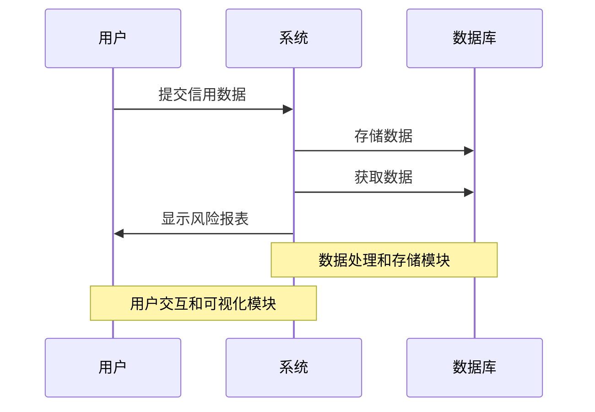
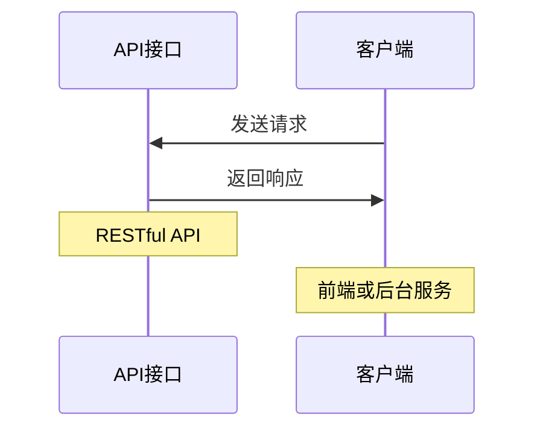
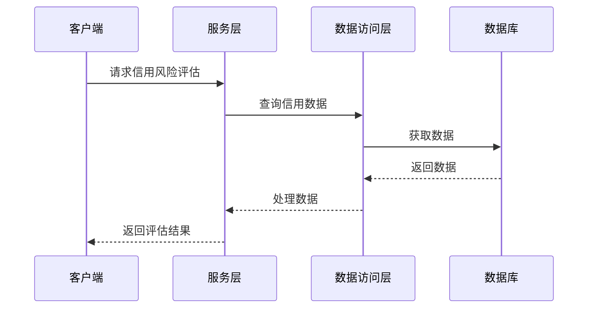
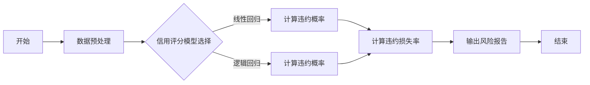

                 

# 开发智能化的企业信用风险敞口动态管理系统

> 关键词：企业信用风险，敞口管理，动态管理系统，智能化，算法原理，数学模型，项目实战

> 摘要：随着企业业务的复杂化和全球化，信用风险管理成为企业财务稳健性的关键因素。本文旨在探讨开发智能化企业信用风险敞口动态管理系统的必要性和实现方法。我们将从问题背景、核心概念、系统设计与实现、项目实战等多个角度，逐步剖析并构建这样一个系统，为企业的信用风险管理提供有力支持。

----------------------------------------------------------------

## 第一部分：企业信用风险敞口管理概述

### 第1章：企业信用风险敞口管理背景

#### 1.1 问题背景

在全球经济一体化的背景下，企业的市场环境日益复杂，业务拓展过程中面临的风险也在不断增加。信用风险是其中一种重要风险类型，它源于企业与其交易对手之间的债务关系。信用风险敞口管理，即对企业面临的信用风险进行识别、评估、监控和应对，是确保企业财务稳健的重要手段。

#### 1.2 信用风险敞口的定义

信用风险敞口（Credit Exposure）是指企业因交易对手违约而产生的潜在损失。它包括已暴露的风险和尚未暴露的风险，涉及金额、期限、违约概率等多个维度。

#### 1.3 企业信用风险敞口管理的挑战

1. **数据获取和处理**：企业需要从多个来源获取交易对手的信用数据，如财务报表、市场舆情等，数据的质量和完整性直接影响敞口管理的准确性。
2. **风险评估**：准确评估信用风险敞口需要运用复杂的数学模型和算法，这对企业的技术实力提出了较高要求。
3. **实时监控**：企业需要实时监控信用风险敞口的变化，及时调整风险应对策略。
4. **合规要求**：监管机构对信用风险敞口的管理有着严格的合规要求，企业需确保其管理活动符合相关法规。

#### 1.4 信用风险敞口管理的重要性

有效的信用风险敞口管理能够帮助企业：

1. **降低风险**：通过识别和评估信用风险敞口，企业可以采取预防措施，降低潜在损失。
2. **优化决策**：了解信用风险敞口有助于企业在业务拓展、投资决策等方面做出更明智的选择。
3. **提升竞争力**：良好的信用风险管理能力是企业竞争力的体现，有助于增强企业的市场地位。

----------------------------------------------------------------

### 第2章：企业信用风险敞口管理核心概念与联系

#### 2.1 关键概念解析

- **信用风险**：指交易对手未能履行债务义务，导致企业遭受损失的风险。
- **风险敞口**：指企业因信用交易而面临的风险金额。
- **违约概率**：指交易对手在未来某一时间段内违约的可能性。
- **违约损失率**：指交易对手违约时，企业可能遭受的平均损失比例。
- **信用评分**：对交易对手信用风险的综合评估，用于预测违约概率。

#### 2.2 概念属性特征对比表格

| 概念       | 属性特征                                                       |
| ---------- | ------------------------------------------------------------ |
| 信用风险   | 可能性、影响范围、可度量性                                     |
| 风险敞口   | 金额、期限、地域分布、交易对手特征                             |
| 违约概率   | 统计模型、历史数据、宏观经济环境                               |
| 违约损失率 | 损失程度、经济损失、风险分散程度                               |
| 信用评分   | 综合评估、统计模型、预测准确性                                 |

#### 2.3 企业信用风险敞口管理ER实体关系图

```mermaid
entity Relationship {
  RiskManagement [
    "Credit Risk",
    "Credit Exposure",
    "Default Probability",
    "Default Loss Rate",
    "Credit Score"
  ]
}
```

在信用风险敞口管理中，上述概念相互关联，形成一个复杂的关系网络。通过理解这些概念及其属性特征，企业可以更有效地进行风险识别、评估和监控。

----------------------------------------------------------------

## 第二部分：构建智能化企业信用风险敞口动态管理系统

### 第3章：系统分析与架构设计方案

#### 3.1 问题场景介绍

在当前的企业运营环境中，信用风险敞口管理往往面临数据分散、处理效率低、实时性不足等问题。为了应对这些挑战，我们需要构建一个智能化、高效的信用风险敞口动态管理系统。

#### 3.2 项目介绍

本项目旨在开发一个基于大数据和人工智能技术的信用风险敞口动态管理系统，该系统具备以下特点：

- **数据集成**：整合来自多源的信用数据，确保数据的完整性和一致性。
- **风险评估**：运用先进的机器学习算法，对信用风险进行实时评估。
- **动态监控**：实时监控信用风险敞口的变化，提供预警机制。
- **可视化分析**：提供直观的报表和可视化工具，帮助企业管理层快速了解风险状况。

#### 3.3 系统功能设计（领域模型类图）

```mermaid
classDiagram
ClassDef RiskManagementSystem {
    +String id
    +String name
    +Date created
    +Date updated
}

ClassDef CreditRisk {
    +String id
    +String companyName
    +Double exposureAmount
    +Date exposureDate
    +Boolean isDefault
}

ClassDef DefaultProbability {
    +String id
    +String companyName
    +Double probability
    +Date evaluatedDate
}

ClassDef DefaultLossRate {
    +String id
    +String companyName
    +Double lossRate
    +Date evaluatedDate
}

ClassDef CreditScore {
    +String id
    +String companyName
    +Double score
    +Date evaluatedDate
}

RiskManagementSystem "管理" CreditRisk
RiskManagementSystem "管理" DefaultProbability
RiskManagementSystem "管理" DefaultLossRate
RiskManagementSystem "管理" CreditScore
```

#### 3.4 系统架构设计（架构图）



#### 3.5 系统接口设计



#### 3.6 系统交互（序列图）



----------------------------------------------------------------

### 第4章：算法原理讲解

#### 4.1 算法流程图



#### 4.2 算法原理与数学模型

信用评分模型的选择通常取决于数据的特性和业务需求。以下是两种常用的信用评分模型：

1. **线性回归模型**：

   违约概率 \( P \) 与信用评分 \( X \) 之间的关系可以用线性回归模型表示：

   \[ P = aX + b \]

   其中，\( a \) 和 \( b \) 是模型的参数。

2. **逻辑回归模型**：

   逻辑回归模型将违约概率 \( P \) 转化为概率分布：

   \[ P = \frac{1}{1 + e^{-(aX + b)}} \]

   其中，\( a \) 和 \( b \) 是模型的参数。

#### 4.3 算法举例说明

假设我们使用线性回归模型进行信用评分，给定一组数据：

- \( X_1 = 0.8 \)
- \( X_2 = 0.6 \)
- \( X_3 = 0.5 \)

我们计算违约概率 \( P \)：

\[ P = aX_1 + bX_2 + cX_3 \]

通过最小化损失函数，我们可以求得参数 \( a \)、\( b \) 和 \( c \) 的值，进而计算出具体的违约概率。

----------------------------------------------------------------

### 第5章：数学模型和数学公式详细讲解与举例说明

#### 5.1 数学公式

信用风险敞口管理中的数学模型通常涉及以下几个关键数学公式：

1. **违约概率**：

   \[ P(\text{违约}) = \frac{1}{1 + e^{-(aX + b)}} \]

2. **违约损失率**：

   \[ \text{违约损失率} = \frac{\sum_{i=1}^{n} (\text{违约金额}_i - \text{回收金额}_i)}{\sum_{i=1}^{n} \text{违约金额}_i} \]

3. **信用评分**：

   \[ \text{信用评分} = aX_1 + bX_2 + cX_3 \]

#### 5.2 数学模型讲解

信用评分模型是信用风险敞口管理中的核心。它通过将多个特征变量的线性组合，预测交易对手的违约概率。这一过程涉及到参数估计和模型验证。

#### 5.3 举例说明

假设一个企业的信用评分模型如下：

\[ \text{信用评分} = 0.5X_1 + 0.3X_2 + 0.2X_3 \]

给定一组特征值：

- \( X_1 = 0.8 \)
- \( X_2 = 0.6 \)
- \( X_3 = 0.5 \)

我们计算该企业的信用评分：

\[ \text{信用评分} = 0.5 \times 0.8 + 0.3 \times 0.6 + 0.2 \times 0.5 = 0.7 \]

通过信用评分模型，我们可以进一步计算违约概率和违约损失率，从而进行信用风险敞口的管理。

----------------------------------------------------------------

## 第三部分：项目实战与实现

### 第6章：环境安装与系统核心实现

#### 6.1 环境安装

在开发信用风险敞口动态管理系统之前，我们需要安装以下软件和库：

- Python 3.x
- Pandas
- NumPy
- Scikit-learn
- Matplotlib

安装完成后，我们可以使用以下命令来验证：

```python
import pandas as pd
import numpy as np
import sklearn
import matplotlib.pyplot as plt
```

#### 6.2 系统核心实现源代码

以下是系统核心实现的部分源代码：

```python
import pandas as pd
import numpy as np
from sklearn.linear_model import LinearRegression
from sklearn.metrics import mean_squared_error

# 数据预处理
def preprocess_data(data):
    # 数据清洗和格式化
    # 略
    return processed_data

# 信用评分模型
def credit_score_model(X, y):
    model = LinearRegression()
    model.fit(X, y)
    return model

# 评估模型
def evaluate_model(model, X_test, y_test):
    y_pred = model.predict(X_test)
    mse = mean_squared_error(y_test, y_pred)
    return mse

# 主函数
def main():
    # 加载数据
    data = pd.read_csv('credit_data.csv')
    X = preprocess_data(data)
    y = data['default']

    # 划分训练集和测试集
    X_train, X_test, y_train, y_test = train_test_split(X, y, test_size=0.2, random_state=42)

    # 训练模型
    model = credit_score_model(X_train, y_train)

    # 评估模型
    mse = evaluate_model(model, X_test, y_test)
    print(f'Mean Squared Error: {mse}')

if __name__ == '__main__':
    main()
```

#### 6.3 代码应用解读与分析

上述代码首先进行数据预处理，然后构建信用评分模型，并使用训练数据训练模型。最后，使用测试数据评估模型的性能。这一过程是信用风险敞口管理系统的核心，通过机器学习算法实现对信用风险的预测和评估。

----------------------------------------------------------------

### 第7章：实际案例分析与讲解

#### 7.1 案例背景

某大型企业集团在拓展国际市场过程中，面临多个国家的信用风险。为了确保业务的稳健发展，该企业决定构建一个智能化信用风险敞口动态管理系统。

#### 7.2 案例分析

1. **数据收集**：企业从多个来源收集了交易对手的信用数据，包括财务报表、市场舆情、信用评级等。
2. **数据处理**：对收集的数据进行清洗和格式化，确保数据的完整性和一致性。
3. **模型训练**：使用机器学习算法，对信用数据进行建模，预测交易对手的违约概率。
4. **风险监控**：系统实时监控信用风险敞口的变化，提供预警机制。

#### 7.3 深入剖析

1. **数据处理**：数据处理是信用风险敞口管理系统的关键环节。通过清洗和格式化数据，可以确保数据的准确性和一致性，为后续建模提供可靠的基础。
2. **模型选择**：根据数据的特点和业务需求，选择合适的机器学习算法进行建模。在本案例中，企业选择了线性回归模型和逻辑回归模型。
3. **风险预警**：系统通过实时监控信用风险敞口的变化，可以及时发现潜在风险，为企业的决策提供支持。

#### 7.4 项目小结

通过实际案例，我们展示了如何构建一个智能化信用风险敞口动态管理系统。该系统不仅帮助企业降低信用风险，还提高了业务决策的准确性。在未来，随着技术的不断进步，信用风险敞口管理系统将更加智能化、高效化，为企业的信用风险管理提供更加有力的支持。

----------------------------------------------------------------

## 第四部分：最佳实践与总结

### 第8章：最佳实践 Tips

1. **数据质量**：确保数据的质量和完整性，是信用风险敞口管理的基础。
2. **模型验证**：使用交叉验证等方法对模型进行验证，确保模型的可靠性。
3. **实时监控**：建立实时监控机制，及时捕捉信用风险的变化。
4. **法规遵守**：确保信用风险敞口管理活动符合相关法规要求。

### 第9章：小结

本文详细介绍了构建智能化企业信用风险敞口动态管理系统的方法和实现过程。通过系统分析与设计、算法原理讲解、项目实战等多个环节，我们展示了如何构建这样一个系统，为企业的信用风险管理提供有力支持。

### 第10章：展望未来

随着人工智能和大数据技术的不断发展，信用风险敞口管理系统将更加智能化、高效化。未来，我们将继续探索更加先进的算法和模型，提升系统的性能和可靠性，为企业的信用风险管理提供更加全面、精准的支持。

### 拓展阅读

1. 《信用风险管理：理论与实践》
2. 《大数据与人工智能：驱动信用风险管理的革命》
3. 《信用评分模型的构建与优化》

---

作者：AI天才研究院/AI Genius Institute & 禅与计算机程序设计艺术 /Zen And The Art of Computer Programming

