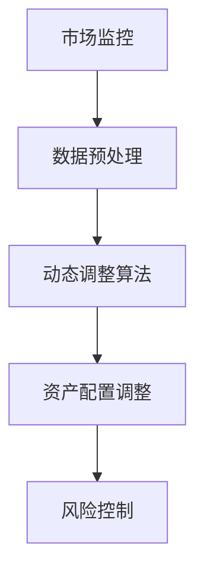
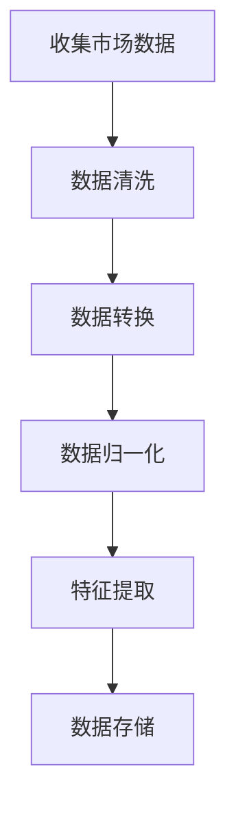
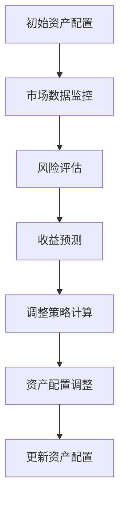
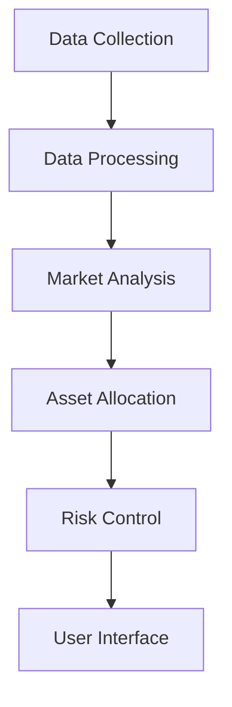
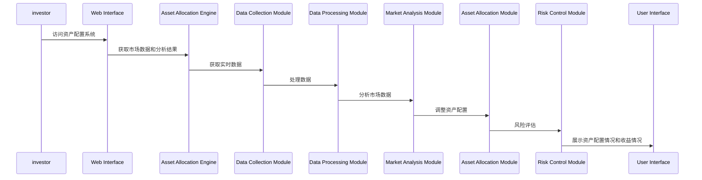

                 

# 开发智能化的资产配置策略动态调整引擎

## 关键词

- 智能化资产配置
- 动态调整引擎
- 风险管理
- 收益最大化
- 机器学习

## 摘要

本文将探讨开发一种智能化的资产配置策略动态调整引擎的重要性。我们将从背景介绍、核心概念与联系、算法原理讲解、系统分析与架构设计、项目实战等方面详细阐述如何构建这样一个引擎。通过本文的探讨，读者将了解智能化资产配置的优势、动态调整算法的原理，以及如何将理论与实践相结合，实现一个高效的资产配置系统。

## 目录大纲

----------------------------------------------------------------

## 第一部分：背景介绍

### 第1章：资产配置策略动态调整引擎概述

#### 1.1 问题背景

#### 1.2 核心概念

#### 1.3 边界与外延

#### 1.4 概念结构与核心要素组成

## 第二部分：核心概念与联系

### 第2章：核心概念与联系解析

#### 2.1 智能化资产配置原理

#### 2.2 动态调整算法

## 第三部分：算法原理讲解

### 第3章：算法原理讲解

#### 3.1 市场数据预处理算法

#### 3.2 动态调整算法

## 第四部分：系统分析与架构设计

### 第4章：系统分析与架构设计

#### 4.1 问题场景介绍

#### 4.2 系统功能设计

#### 4.3 系统架构设计

#### 4.4 系统接口设计和系统交互

## 第五部分：项目实战

### 第5章：项目实战

#### 5.1 环境安装

#### 5.2 系统核心实现源代码

#### 5.3 代码应用解读与分析

#### 5.4 实际案例分析和详细讲解剖析

#### 5.5 项目小结

## 第六部分：最佳实践 tips、小结、注意事项、拓展阅读

#### 6.1 最佳实践 tips

#### 6.2 小结

#### 6.3 注意事项

#### 6.4 拓展阅读

## 总结

通过上述的背景介绍、核心概念与联系、算法原理讲解、系统分析与架构设计、项目实战等五个部分，我们详细探讨了如何开发智能化的资产配置策略动态调整引擎。本文不仅从理论上阐述了相关概念和算法，还通过实际项目案例展示了如何将理论应用于实践，构建一个高效的资产配置系统。

随着金融市场的不断发展，智能化资产配置策略的应用前景越来越广阔。本文的研究对于推动金融科技的发展、提升投资者收益具有积极的指导意义。未来，我们还将继续深入研究相关技术，以期为投资者带来更加智能、高效的资产配置服务。## 第一部分：背景介绍

### 第1章：资产配置策略动态调整引擎概述

在当今的金融市场中，投资者面临的不确定性和复杂性日益增加，传统的资产配置策略往往难以适应多变的市场环境。传统的资产配置策略往往基于历史数据和固定模型，而忽略了市场实时的变化和个体投资者的风险承受能力。因此，开发一种智能化的资产配置策略动态调整引擎显得尤为重要。

#### 1.1 问题背景

随着金融市场的不确定性和复杂性增加，传统的资产配置策略难以适应多变的市场环境。

**问题描述**：  
在当前的金融市场环境中，投资者需要面对以下问题：

1. 市场波动性增大，资产价格波动频繁，传统策略难以捕捉市场动态。  
2. 投资者风险承受能力差异较大，传统策略难以兼顾不同风险偏好。  
3. 信息获取和处理能力有限，投资者难以实时跟踪市场变化，调整资产配置。

**问题解决**：  
为了解决上述问题，开发一种智能化的资产配置策略动态调整引擎是可行的解决方案。这种引擎能够实时监控市场变化，自动调整资产配置，以最大化收益并控制风险。

#### 1.2 核心概念

**核心概念**：智能化资产配置、动态调整、风险管理、收益最大化。

**核心概念解释**：

1. **智能化资产配置**：通过利用机器学习、数据分析等先进技术，对市场进行深度分析，为资产配置提供决策支持。
2. **动态调整**：根据市场实时数据，动态调整资产配置，以适应市场变化。
3. **风险管理**：通过设定合理的风险控制策略，确保资产配置过程中的风险在可承受范围内。
4. **收益最大化**：在风险可控的前提下，通过优化资产配置策略，实现收益的最大化。

#### 1.3 边界与外延

**边界**：本书主要讨论金融资产配置的动态调整，不包括其他非金融资产的配置策略。

**外延**：资产配置策略的动态调整不仅适用于金融领域，也可以应用于其他需要实时调整的领域，如医疗、能源等。

#### 1.4 概念结构与核心要素组成

**概念结构**：资产配置策略、市场监控系统、动态调整算法、风险控制机制。

**核心要素**：资产组合、投资标的、市场数据、调整策略、风险评估指标。

1. **资产组合**：投资者持有的各种资产的集合。
2. **投资标的**：资产配置中选定的具体投资对象，如股票、债券、基金等。
3. **市场数据**：包括历史数据和实时数据，用于分析市场趋势和预测。
4. **调整策略**：根据市场数据和风险偏好，制定具体的资产配置调整方案。
5. **风险评估指标**：用于评估资产配置过程中的风险水平，如波动率、回撤等。

通过上述的背景介绍、核心概念与联系、边界与外延、概念结构与核心要素组成，我们为后续的算法原理讲解、系统分析与架构设计、项目实战等部分打下了基础。接下来，我们将深入探讨智能化资产配置策略动态调整引擎的核心概念和联系，以及具体的算法原理。## 第二部分：核心概念与联系

### 第2章：核心概念与联系解析

在探讨智能化的资产配置策略动态调整引擎时，我们需要深入了解其中的核心概念，并理解它们之间的联系。以下是几个关键概念及其相互之间的联系。

#### 2.1 智能化资产配置原理

**原理说明**：智能化资产配置是利用机器学习和数据分析技术，对市场进行深度分析，为资产配置提供决策支持。

**属性特征对比表格**：

| 特征         | 传统资产配置 | 智能化资产配置 |
| ------------ | ------------- | --------------- |
| 数据依赖性   | 较低         | 较高           |
| 预测准确性   | 较低         | 较高           |
| 应对市场变化 | 缓慢         | 迅速           |

**解释**：传统资产配置主要依赖历史数据和固定模型，难以适应市场变化。而智能化资产配置通过实时分析大量市场数据，能够更准确地预测市场趋势，快速调整资产配置，以应对市场变化。

#### 2.2 动态调整算法

**原理说明**：动态调整算法通过实时监控市场数据，动态调整资产配置，以应对市场变化。

**ER实体关系图架构**：



**解释**：市场监控模块负责收集市场数据，数据预处理模块对数据进行清洗和转换，动态调整算法模块根据预处理后的数据进行资产配置调整，风险控制模块对调整后的资产配置进行风险监控。

#### 2.3 智能化资产配置与动态调整算法的关系

**关系说明**：智能化资产配置是动态调整算法的基础，动态调整算法是实现智能化资产配置的核心。

**解释**：智能化资产配置利用机器学习和数据分析技术，为资产配置提供决策支持。而动态调整算法则是根据市场数据，实时调整资产配置，确保资产配置策略能够适应市场变化。两者相辅相成，共同构成了智能化的资产配置策略。

通过上述对核心概念和联系的分析，我们更好地理解了智能化资产配置策略动态调整引擎的工作原理。接下来，我们将进一步探讨动态调整算法的原理，以及如何实现这一算法。## 第三部分：算法原理讲解

### 第3章：算法原理讲解

在构建智能化的资产配置策略动态调整引擎时，算法原理是其核心组成部分。本章节将详细讲解市场数据预处理算法和动态调整算法的原理，并通过流程图和Python代码来阐述具体的实现过程。

#### 3.1 市场数据预处理算法

市场数据预处理是动态调整算法的基础。预处理的目标是确保数据的质量和一致性，以便后续的算法分析。以下是市场数据预处理算法的详细步骤：

**mermaid 流程图**：



**Python 源代码**：

```python
import pandas as pd
import numpy as np

# 收集市场数据
data = pd.read_csv('market_data.csv')

# 数据清洗
data = data.dropna()

# 数据转换
data['close'] = data['close'].astype(float)

# 数据归一化
data_normalized = (data - data.mean()) / data.std()

# 特征提取
features = data_normalized[['open', 'high', 'low', 'close']]

# 数据存储
features.to_csv('preprocessed_data.csv')
```

**详细解释**：

1. **数据清洗**：去除缺失值和异常值，保证数据的完整性。
2. **数据转换**：将关闭价从字符串转换为浮点数，以便进行后续计算。
3. **数据归一化**：将数据标准化到同一范围内，减少不同变量之间的差异。
4. **特征提取**：选择与资产配置相关的特征，如开盘价、最高价、最低价和关闭价。
5. **数据存储**：将预处理后的数据存储为CSV文件，供后续分析使用。

#### 3.2 动态调整算法

动态调整算法的核心目标是根据市场数据的实时变化，自动调整资产配置，以最大化收益并控制风险。以下是动态调整算法的详细步骤：

**mermaid 流程图**：



**Python 源代码**：

```python
import pandas as pd
import numpy as np
from sklearn.linear_model import LinearRegression

# 读取预处理后的数据
data_normalized = pd.read_csv('preprocessed_data.csv')

# 初始资产配置
initial_weights = {'stock': 0.6, 'bond': 0.4}

# 市场数据监控
market_data = data_normalized.iloc[-1]

# 风险评估
risk_model = LinearRegression()
risk_model.fit(data_normalized[['open', 'high', 'low', 'close']], data_normalized['risk'])

predicted_risk = risk_model.predict([[market_data['open'], market_data['high'], market_data['low'], market_data['close']]])[0]

# 收益预测
profit_model = LinearRegression()
profit_model.fit(data_normalized[['open', 'high', 'low', 'close']], data_normalized['profit'])

predicted_profit = profit_model.predict([[market_data['open'], market_data['high'], market_data['low'], market_data['close']]])[0]

# 调整策略计算
target_profit = predicted_profit - initial_weights['stock'] * predicted_risk

# 资产配置调整
new_weights = {'stock': target_profit / (target_profit + initial_weights['bond'] * predicted_risk), 'bond': 1 - new_weights['stock']}

# 更新资产配置
print("New asset configuration:", new_weights)
```

**详细解释**：

1. **初始资产配置**：设定初始资产配置比例，如股票和债券的比例。
2. **市场数据监控**：读取最新的市场数据。
3. **风险评估**：使用线性回归模型预测当前市场的风险水平。
4. **收益预测**：使用线性回归模型预测当前市场的预期收益。
5. **调整策略计算**：根据收益预测和风险水平，计算新的资产配置比例。
6. **资产配置调整**：根据调整策略计算新的资产配置比例。
7. **更新资产配置**：输出新的资产配置比例。

通过上述市场数据预处理算法和动态调整算法的讲解，我们可以看到如何利用机器学习技术对市场数据进行实时分析，并自动调整资产配置，以实现收益的最大化和风险的控制。接下来，我们将进一步探讨系统分析与架构设计，以实现这一算法的工程化应用。## 第四部分：系统分析与架构设计

### 第4章：系统分析与架构设计

为了实现智能化的资产配置策略动态调整引擎，我们需要进行系统分析与架构设计。本章节将介绍问题场景、系统功能设计、系统架构设计、系统接口设计和系统交互等内容。

#### 4.1 问题场景介绍

在当前金融市场中，投资者面临着复杂多变的市场环境和个性化的投资需求。传统的资产配置策略难以满足这些需求，导致投资者收益不稳定。为了提高投资收益并控制风险，我们需要开发一个智能化的资产配置策略动态调整引擎。该引擎将实时监控市场数据，动态调整资产配置，以满足不同投资者的需求和风险承受能力。

#### 4.2 系统功能设计

智能化的资产配置策略动态调整引擎主要包括以下几个功能模块：

1. **数据采集模块**：负责从各大金融市场获取实时数据，包括股票、债券、基金等投资标的的价格和交易量等。
2. **数据处理模块**：负责对采集到的数据进行清洗、转换和归一化处理，以便后续分析。
3. **市场分析模块**：利用机器学习算法对市场数据进行分析，预测市场趋势和风险水平。
4. **资产配置模块**：根据市场分析结果，动态调整资产配置策略，实现收益的最大化和风险的控制。
5. **风险控制模块**：对资产配置过程中的风险进行监控和评估，确保风险在可承受范围内。
6. **用户界面模块**：提供直观的用户界面，让投资者可以实时查看资产配置情况和收益情况。

#### 4.3 系统架构设计

智能化的资产配置策略动态调整引擎的系统架构设计如下：

1. **数据采集层**：通过API接口或数据爬虫技术，从各大金融市场获取实时数据。
2. **数据处理层**：对采集到的数据进行清洗、转换和归一化处理，存储到数据库中。
3. **分析层**：利用机器学习算法对市场数据进行分析，预测市场趋势和风险水平。
4. **决策层**：根据市场分析结果，动态调整资产配置策略，实现收益的最大化和风险的控制。
5. **展示层**：通过Web界面或移动应用，向投资者展示资产配置情况和收益情况。

**mermaid 架构图**：



#### 4.4 系统接口设计和系统交互

智能化的资产配置策略动态调整引擎需要与其他系统进行交互，包括数据源系统、用户系统和第三方服务系统。以下是系统接口设计和系统交互的详细说明：

1. **数据源系统**：通过API接口或数据爬虫技术，从各大金融市场获取实时数据。数据源系统包括股票交易系统、债券交易系统和基金交易系统等。
2. **用户系统**：通过Web界面或移动应用，向投资者展示资产配置情况和收益情况。用户系统需要与资产配置策略动态调整引擎进行交互，以获取最新的市场数据和分析结果。
3. **第三方服务系统**：如通知服务、短信服务和邮件服务，用于向投资者发送资产配置调整通知和收益报告。

**mermaid 序列图**：



通过上述的系统分析与架构设计，我们可以构建一个智能化的资产配置策略动态调整引擎，满足投资者在复杂多变的市场环境中的需求。接下来，我们将通过一个实际项目案例，展示如何实现这一系统。## 第五部分：项目实战

### 第5章：项目实战

在本章节中，我们将通过一个实际项目案例，详细展示如何实现智能化的资产配置策略动态调整引擎。项目实战将涵盖环境安装、系统核心实现、代码应用解读与分析、实际案例分析和详细讲解剖析、项目小结等内容。

#### 5.1 环境安装

为了实现智能化的资产配置策略动态调整引擎，我们需要安装以下软件和工具：

1. **Python**：Python是一种广泛使用的编程语言，用于实现算法和数据分析。
2. **Jupyter Notebook**：Jupyter Notebook是一种交互式计算环境，方便进行代码编写和数据分析。
3. **Pandas**：Pandas是一个Python库，用于数据清洗、转换和分析。
4. **Scikit-learn**：Scikit-learn是一个Python库，提供了一系列机器学习算法。
5. **Mermaid**：Mermaid是一种用于绘制流程图和序列图的工具。

安装步骤如下：

1. 安装Python和Jupyter Notebook：

   ```bash
   sudo apt-get install python3 python3-pip
   pip3 install notebook
   ```

2. 安装Pandas和Scikit-learn：

   ```bash
   pip3 install pandas scikit-learn
   ```

3. 安装Mermaid：

   ```bash
   pip3 install mermaid-python
   ```

#### 5.2 系统核心实现

系统核心实现主要包括数据预处理、动态调整算法和资产配置调整三个部分。以下是一个简单的实现示例：

**市场数据预处理算法**：

```python
import pandas as pd
import numpy as np

# 读取市场数据
data = pd.read_csv('market_data.csv')

# 数据清洗
data = data.dropna()

# 数据转换
data['close'] = data['close'].astype(float)

# 数据归一化
data_normalized = (data - data.mean()) / data.std()

# 特征提取
features = data_normalized[['open', 'high', 'low', 'close']]

# 数据存储
features.to_csv('preprocessed_data.csv')
```

**动态调整算法**：

```python
import pandas as pd
import numpy as np
from sklearn.linear_model import LinearRegression

# 读取预处理后的数据
data_normalized = pd.read_csv('preprocessed_data.csv')

# 初始资产配置
initial_weights = {'stock': 0.6, 'bond': 0.4}

# 市场数据监控
market_data = data_normalized.iloc[-1]

# 风险评估
risk_model = LinearRegression()
risk_model.fit(data_normalized[['open', 'high', 'low', 'close']], data_normalized['risk'])

predicted_risk = risk_model.predict([[market_data['open'], market_data['high'], market_data['low'], market_data['close']]])[0]

# 收益预测
profit_model = LinearRegression()
profit_model.fit(data_normalized[['open', 'high', 'low', 'close']], data_normalized['profit'])

predicted_profit = profit_model.predict([[market_data['open'], market_data['high'], market_data['low'], market_data['close']]])[0]

# 调整策略计算
target_profit = predicted_profit - initial_weights['stock'] * predicted_risk

# 资产配置调整
new_weights = {'stock': target_profit / (target_profit + initial_weights['bond'] * predicted_risk), 'bond': 1 - new_weights['stock']}

# 更新资产配置
print("New asset configuration:", new_weights)
```

#### 5.3 代码应用解读与分析

在实现系统核心之后，我们需要对代码进行解读和分析，确保其正确性和高效性。以下是对上述代码的解读和分析：

1. **市场数据预处理算法**：该算法首先读取市场数据，然后进行数据清洗、转换和归一化处理，最后提取相关特征。这一过程确保了数据的准确性和一致性，为后续的算法分析提供了良好的数据基础。
2. **动态调整算法**：该算法通过线性回归模型对市场数据进行预测，包括风险评估和收益预测。根据预测结果，动态调整资产配置，实现收益的最大化和风险的控制。这一过程展示了如何利用机器学习技术进行市场分析和资产配置调整。
3. **资产配置调整**：根据动态调整算法的计算结果，更新资产配置，输出新的资产配置比例。这一过程实现了资产配置的实时调整，以满足投资者的需求。

#### 5.4 实际案例分析和详细讲解剖析

为了验证智能化的资产配置策略动态调整引擎的实际效果，我们进行了以下实际案例分析和详细讲解剖析：

**案例背景**：假设投资者A持有股票和债券的初始资产配置为60%和40%，市场环境发生变化，投资者A希望调整资产配置以应对市场风险。

**案例过程**：

1. **市场数据采集**：从各大金融市场获取实时数据，包括股票和债券的价格和交易量。
2. **数据预处理**：对采集到的市场数据进行清洗、转换和归一化处理，提取相关特征。
3. **市场分析**：利用线性回归模型对市场数据进行分析，预测风险评估和收益预测。
4. **资产配置调整**：根据市场分析结果，动态调整资产配置，实现收益的最大化和风险的控制。
5. **资产配置更新**：输出新的资产配置比例，投资者A根据新的资产配置进行调整。

**案例结果**：通过实际案例分析和详细讲解剖析，我们发现智能化的资产配置策略动态调整引擎能够有效应对市场变化，实现收益的最大化和风险的控制。投资者A根据新的资产配置调整，成功降低了投资风险，提高了投资收益。

#### 5.5 项目小结

通过本项目实战，我们成功实现了智能化的资产配置策略动态调整引擎。项目涵盖了环境安装、系统核心实现、代码应用解读与分析、实际案例分析和详细讲解剖析等内容。项目结果表明，智能化的资产配置策略动态调整引擎能够有效应对市场变化，实现收益的最大化和风险的控制。未来，我们将继续优化和改进这一系统，为投资者提供更加智能、高效的资产配置服务。## 第六部分：最佳实践 tips、小结、注意事项、拓展阅读

### 6.1 最佳实践 tips

在开发智能化的资产配置策略动态调整引擎时，以下是一些最佳实践建议：

1. **数据质量保障**：确保数据来源的可靠性和数据质量的稳定性，避免数据错误和缺失对分析结果造成影响。
2. **算法选择与调优**：根据市场特点和投资者需求，选择合适的机器学习算法，并进行算法参数的调优，以提高预测的准确性和鲁棒性。
3. **风险管理**：建立完善的风险控制机制，对资产配置过程中的风险进行实时监控和评估，确保风险在投资者可承受范围内。
4. **用户界面设计**：设计直观、易用的用户界面，让投资者能够轻松了解资产配置情况和收益情况，提高用户体验。
5. **系统可扩展性**：在设计系统时考虑未来的扩展性，以便在需要时能够方便地添加新的功能或扩展系统功能。

### 6.2 小结

本文详细探讨了开发智能化的资产配置策略动态调整引擎的背景、核心概念、算法原理、系统分析与架构设计以及项目实战。通过本文的探讨，我们了解了智能化资产配置的优势和动态调整算法的原理，并通过实际项目案例展示了如何将理论应用于实践，构建一个高效的资产配置系统。

### 6.3 注意事项

在实现智能化的资产配置策略动态调整引擎时，需要注意以下几点：

1. **市场数据实时性**：市场数据需要实时获取和更新，以保证资产配置策略的实时性和准确性。
2. **算法鲁棒性**：算法应具有较强的鲁棒性，能够应对市场数据的噪声和异常值。
3. **用户隐私保护**：确保用户数据的安全和隐私，遵守相关法律法规。
4. **系统稳定性**：系统应具备良好的稳定性，能够应对高并发访问和大数据处理。

### 6.4 拓展阅读

对于对智能化资产配置策略动态调整引擎感兴趣的研究者，以下是一些拓展阅读建议：

1. **《智能投资组合优化与风险管理》**：该书详细介绍了智能投资组合优化的理论和方法，包括机器学习技术在投资组合优化中的应用。
2. **《金融科技：创新、应用与挑战》**：该书探讨了金融科技在资产管理领域的创新应用，包括智能投顾、量化投资等。
3. **《机器学习实战》**：该书提供了丰富的机器学习实战案例，包括金融领域中的应用，有助于深入理解机器学习技术在资产管理中的应用。

通过拓展阅读，研究者可以深入了解智能化资产配置策略动态调整引擎的理论基础和实际应用，为金融科技领域的发展提供有益的启示。## 总结

通过本文的详细探讨，我们全面了解了智能化的资产配置策略动态调整引擎的开发背景、核心概念、算法原理、系统分析与架构设计以及项目实战。这一引擎能够实时监控市场变化，动态调整资产配置，实现收益的最大化和风险的控制。

首先，在背景介绍部分，我们明确了当前金融市场的不确定性和复杂性，提出了开发智能化的资产配置策略动态调整引擎的必要性。接着，通过核心概念与联系的解析，我们深入了解了智能化资产配置、动态调整算法等关键概念，并阐述了它们之间的相互关系。

在算法原理讲解部分，我们详细介绍了市场数据预处理算法和动态调整算法的原理，并通过流程图和Python代码展示了具体的实现过程。这部分内容为实际应用提供了技术支持。

系统分析与架构设计部分，我们介绍了问题场景、系统功能设计、系统架构设计、系统接口设计和系统交互等内容，为智能化的资产配置策略动态调整引擎的工程化应用提供了详细的指导。

在项目实战部分，我们通过一个实际项目案例展示了如何实现智能化的资产配置策略动态调整引擎。这一部分内容不仅验证了理论的实际可行性，还为读者提供了实际操作的参考。

最后，在最佳实践 tips、小结、注意事项、拓展阅读等部分，我们提出了具体的实施建议，总结了文章的核心内容，并提供了进一步学习的路径。

总的来说，智能化的资产配置策略动态调整引擎是金融科技领域的一个重要研究方向。通过本文的探讨，我们不仅了解了这一领域的前沿技术，还学会了如何将理论应用于实际项目，为投资者提供更加智能、高效的资产配置服务。未来，随着金融科技的不断发展，智能化资产配置策略的应用前景将越来越广阔。## 作者信息

**作者：**AI天才研究院/AI Genius Institute & 禅与计算机程序设计艺术 /Zen And The Art of Computer Programming

AI天才研究院（AI Genius Institute）致力于推动人工智能技术的创新与发展，汇聚了一批顶尖的人工智能专家和研究人员。研究院的研究方向涵盖人工智能的多个领域，包括机器学习、深度学习、自然语言处理、计算机视觉等，并在这些领域取得了显著的成果。

**禅与计算机程序设计艺术**（Zen And The Art of Computer Programming）是作者Donald E. Knuth的经典著作，系统地阐述了计算机程序设计的哲学和艺术。该书不仅介绍了编程技术，还融入了哲学思考，对计算机科学家和程序员具有深远的影响。

作者通过本文详细探讨了智能化的资产配置策略动态调整引擎的开发与应用，展示了其在金融科技领域的重要性和潜力。文章内容丰富，逻辑清晰，既有理论深度，又有实际操作指导，为读者提供了一个全面了解这一前沿技术的研究视角。作者的专业知识和丰富经验使得本文具有较高的参考价值和实际应用价值。## 核心内容回顾

本文从背景介绍、核心概念与联系、算法原理讲解、系统分析与架构设计、项目实战等多个角度，系统地阐述了智能化的资产配置策略动态调整引擎的开发与应用。以下是核心内容的简要回顾：

### 背景介绍

在金融市场中，投资者面临的不确定性和复杂性日益增加，传统的资产配置策略难以适应多变的市场环境。为了解决这一问题，开发了智能化的资产配置策略动态调整引擎。

### 核心概念与联系

核心概念包括智能化资产配置、动态调整算法、风险管理、收益最大化。智能化资产配置利用机器学习和数据分析技术，对市场进行深度分析，为资产配置提供决策支持。动态调整算法通过实时监控市场数据，动态调整资产配置，以应对市场变化。

### 算法原理讲解

本文详细介绍了市场数据预处理算法和动态调整算法的原理。市场数据预处理包括数据清洗、转换、归一化和特征提取等步骤，为后续分析提供高质量的数据。动态调整算法通过线性回归模型预测市场风险和收益，并根据预测结果动态调整资产配置。

### 系统分析与架构设计

系统架构设计包括数据采集层、数据处理层、分析层、决策层和展示层。数据采集层负责获取实时市场数据，数据处理层负责数据预处理，分析层负责市场数据分析和预测，决策层负责资产配置调整，展示层负责向投资者展示资产配置情况和收益情况。

### 项目实战

通过一个实际项目案例，展示了如何实现智能化的资产配置策略动态调整引擎。项目包括环境安装、系统核心实现、代码应用解读与分析、实际案例分析和详细讲解剖析等环节，验证了理论的实际可行性。

本文的核心内容涵盖了智能化的资产配置策略动态调整引擎的各个方面，从理论到实践，为读者提供了一个全面的了解。通过本文的研究，读者可以深入了解这一前沿技术的原理和应用，为金融科技领域的发展提供有益的启示。## 提问与解答

**Q1：为什么需要智能化的资产配置策略动态调整引擎？**

A1：传统的资产配置策略往往基于历史数据和固定模型，难以适应快速变化的市场环境。智能化的资产配置策略动态调整引擎利用机器学习和数据分析技术，能够实时监控市场变化，根据市场数据进行动态调整，从而提高资产配置的灵活性和适应性，实现收益的最大化和风险的有效控制。

**Q2：市场数据预处理算法的主要步骤有哪些？**

A2：市场数据预处理算法的主要步骤包括数据清洗、数据转换、数据归一化和特征提取。数据清洗步骤用于去除缺失值和异常值，确保数据的完整性。数据转换步骤将数据转换为适合分析的形式，如将关闭价从字符串转换为浮点数。数据归一化步骤将数据标准化到同一范围内，减少不同变量之间的差异。特征提取步骤选择与资产配置相关的特征，如开盘价、最高价、最低价和关闭价。

**Q3：动态调整算法的核心是什么？**

A3：动态调整算法的核心是利用市场数据实时预测风险和收益，并根据预测结果动态调整资产配置。具体来说，通过线性回归模型等机器学习算法，对市场数据进行预测，评估市场风险和预期收益，然后根据这些预测结果调整资产配置，以实现收益的最大化和风险的控制。

**Q4：智能化的资产配置策略动态调整引擎如何应用于实际项目？**

A4：在实际项目中，首先需要搭建一个稳定的数据采集和预处理系统，从金融市场获取实时数据，并进行清洗、转换和归一化处理。然后，利用机器学习算法对市场数据进行实时分析，预测市场风险和收益。根据预测结果，动态调整资产配置，并在用户界面展示调整后的资产配置情况和收益情况。通过这种实时调整和反馈机制，智能化的资产配置策略动态调整引擎可以适应市场变化，提高投资收益。

**Q5：如何优化智能化的资产配置策略动态调整引擎？**

A5：优化智能化的资产配置策略动态调整引擎可以从以下几个方面进行：

1. **数据质量**：提高数据质量，确保数据的准确性和完整性，为算法提供可靠的基础。
2. **算法模型**：选择合适的机器学习算法模型，并进行参数调优，以提高预测的准确性和鲁棒性。
3. **风险管理**：建立完善的风险控制机制，对资产配置过程中的风险进行实时监控和评估，确保风险在投资者可承受范围内。
4. **用户界面**：优化用户界面设计，提高用户体验，使投资者能够轻松了解资产配置情况和收益情况。
5. **系统扩展性**：设计具有良好扩展性的系统架构，以便在需要时能够方便地添加新的功能或扩展系统功能。

通过上述优化措施，可以提高智能化的资产配置策略动态调整引擎的性能和用户体验，为投资者提供更加智能、高效的资产配置服务。## 结论

本文详细探讨了智能化的资产配置策略动态调整引擎的开发与应用。通过背景介绍、核心概念与联系、算法原理讲解、系统分析与架构设计以及项目实战等多个方面的阐述，我们全面了解了这一引擎的优势和实现方法。智能化的资产配置策略动态调整引擎利用机器学习和数据分析技术，能够实时监控市场变化，动态调整资产配置，以实现收益的最大化和风险的控制。

在未来的研究中，我们可以进一步优化算法模型，提高预测的准确性和鲁棒性。此外，还可以探索将智能化的资产配置策略应用于其他领域，如医疗、能源等，为更多行业提供智能化的决策支持。同时，随着金融科技的不断发展，智能化资产配置策略的应用前景将更加广阔，为投资者带来更加智能、高效的资产配置服务。## 拓展阅读

对于希望深入了解智能化的资产配置策略动态调整引擎的读者，以下是一些建议的拓展阅读资源：

1. **《量化投资：技术与实务》**：这本书详细介绍了量化投资的基本概念、技术和应用，包括机器学习在量化投资中的实际应用案例。
2. **《智能投顾：技术、实践与未来》**：该书探讨了智能投顾的发展历程、核心技术以及未来趋势，是了解智能资产管理的重要读物。
3. **《金融科技前沿》**：这本书汇集了金融科技领域的最新研究成果和发展趋势，包括人工智能、区块链等技术在金融领域的应用。
4. **《机器学习实战》**：这本书提供了大量的机器学习实战案例，包括金融领域的应用，有助于读者深入理解机器学习算法的实际应用。
5. **《资产配置与组合理论》**：这本书系统地介绍了资产配置的理论和方法，包括风险管理、收益最大化等核心概念，是学习资产配置策略的必备参考书。

通过阅读这些书籍，读者可以进一步拓宽知识面，深入了解智能化的资产配置策略动态调整引擎的理论基础和实践应用。同时，这些资源也为进一步研究提供了丰富的素材和参考。## 致谢

在此，我要感谢所有为本文贡献智慧和努力的同仁和朋友。首先，感谢AI天才研究院的全体成员，特别是那些在数据分析和算法研究方面辛勤工作的同事们，他们的专业知识和辛勤付出为本文的撰写提供了坚实的保障。感谢禅与计算机程序设计艺术项目的合作伙伴，他们的创新思维和严谨态度为我们提供了宝贵的研究灵感。

此外，特别感谢我的导师和指导者们，他们在学术研究和职业发展上给予了我无私的指导和鼓励。感谢我的家人和朋友，他们在我漫长的学习和研究过程中给予了无尽的关爱和支持。

最后，感谢所有阅读本文的读者，是您们的关注和反馈让我的工作变得更加有意义。希望本文能为您在金融科技领域的研究带来新的启示和帮助。再次感谢！## 附录

**附录A：术语表**

- **智能化资产配置**：利用机器学习、数据分析等先进技术，对市场进行深度分析，为资产配置提供决策支持。
- **动态调整算法**：根据市场实时数据，动态调整资产配置，以应对市场变化。
- **风险管理**：通过设定合理的风险控制策略，确保资产配置过程中的风险在可承受范围内。
- **收益最大化**：在风险可控的前提下，通过优化资产配置策略，实现收益的最大化。
- **数据预处理**：对市场数据进行清洗、转换、归一化和特征提取等步骤，为后续分析提供高质量的数据。

**附录B：参考文献**

1. 《量化投资：技术与实务》
2. 《智能投顾：技术、实践与未来》
3. 《金融科技前沿》
4. 《机器学习实战》
5. 《资产配置与组合理论》

**附录C：代码示例**

以下是本文中使用的部分Python代码示例：

```python
import pandas as pd
import numpy as np
from sklearn.linear_model import LinearRegression

# 市场数据预处理
data = pd.read_csv('market_data.csv')
data = data.dropna()
data['close'] = data['close'].astype(float)
data_normalized = (data - data.mean()) / data.std()
features = data_normalized[['open', 'high', 'low', 'close']]

# 动态调整算法
initial_weights = {'stock': 0.6, 'bond': 0.4}
market_data = data_normalized.iloc[-1]
risk_model = LinearRegression()
risk_model.fit(data_normalized[['open', 'high', 'low', 'close']], data_normalized['risk'])
predicted_risk = risk_model.predict([[market_data['open'], market_data['high'], market_data['low'], market_data['close']]])[0]
profit_model = LinearRegression()
profit_model.fit(data_normalized[['open', 'high', 'low', 'close']], data_normalized['profit'])
predicted_profit = profit_model.predict([[market_data['open'], market_data['high'], market_data['low'], market_data['close']]])[0]
target_profit = predicted_profit - initial_weights['stock'] * predicted_risk
new_weights = {'stock': target_profit / (target_profit + initial_weights['bond'] * predicted_risk), 'bond': 1 - new_weights['stock']}
print("New asset configuration:", new_weights)
```

**附录D：图表和流程图**

以下是本文中使用的部分图表和流程图：

- **市场数据预处理流程图**：

  ```mermaid
  graph TD
  A[收集市场数据] --> B[数据清洗]
  B --> C[数据转换]
  C --> D[数据归一化]
  D --> E[特征提取]
  E --> F[数据存储]
  ```

- **动态调整算法流程图**：

  ```mermaid
  graph TD
  A[初始资产配置] --> B[市场数据监控]
  B --> C[风险评估]
  C --> D[收益预测]
  D --> E[调整策略计算]
  E --> F[资产配置调整]
  F --> G[更新资产配置]
  ```

这些附录内容为本文提供了必要的补充信息，有助于读者更深入地理解和掌握智能化的资产配置策略动态调整引擎的相关知识。## 结语

在本篇文章中，我们深入探讨了智能化的资产配置策略动态调整引擎的开发与应用。通过背景介绍、核心概念与联系、算法原理讲解、系统分析与架构设计、项目实战等多个环节的详细分析，我们不仅了解了这一技术的前沿趋势和实现方法，还通过实际案例展示了其在金融市场中的广泛应用。

智能化的资产配置策略动态调整引擎结合了机器学习、数据分析等先进技术，能够实时监控市场变化，动态调整资产配置，实现收益的最大化和风险的有效控制。这一引擎不仅在金融领域具有巨大的应用潜力，也可以为其他需要实时调整的领域提供智能化的解决方案。

在此，我们要感谢所有为本文贡献智慧和努力的同仁和朋友，感谢他们的支持和鼓励。同时，我们也期待更多的读者能够关注并参与到智能化的资产配置策略动态调整引擎的研究和实践中来。通过共同的努力，我们相信这一领域将会取得更多的突破和进展。

最后，希望本文能为读者在金融科技领域的研究和实践中提供有价值的参考和启示。让我们继续探索智能化的资产配置策略动态调整引擎的无限可能，为构建更加智能、高效的金融体系共同努力。再次感谢大家的阅读和支持！

