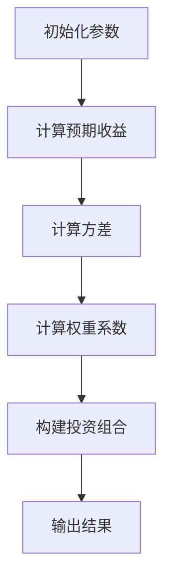
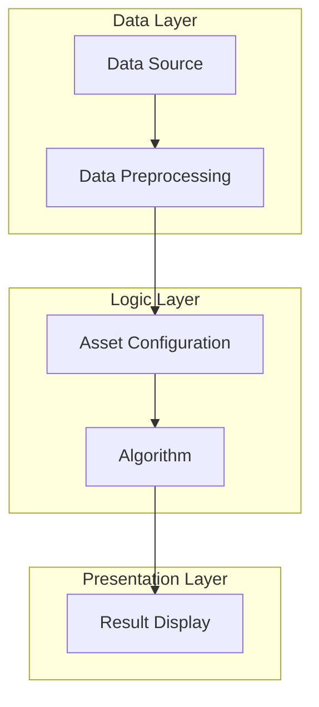
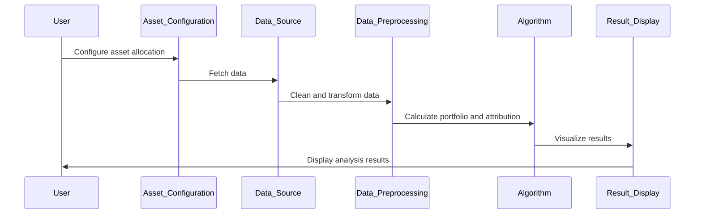

                 

# 开发智能化的资产配置策略归因分析引擎

关键词：资产配置、策略归因分析、智能引擎、算法设计、系统架构、Python代码、数学模型

摘要：本文将深入探讨如何开发一个智能化的资产配置策略归因分析引擎。我们将从背景介绍、核心概念、算法设计、系统架构到项目实战等多个角度展开分析，旨在为读者提供一套完整的技术指南。

## 1. 背景介绍

资产配置是金融领域中至关重要的环节，它涉及到投资者如何将资金分配到不同类型的资产中，以实现风险和收益的最优化。传统的资产配置方法主要依赖于历史数据和经验，然而，随着金融市场复杂性的增加，单纯依靠经验已经难以满足投资者的需求。因此，开发一个智能化的资产配置策略归因分析引擎成为当务之急。

归因分析则是资产配置中的另一个关键环节。它旨在分析资产配置决策对投资收益的影响，帮助投资者理解策略的优劣，并不断优化投资组合。目前，归因分析主要依赖于统计学和经济学模型，但传统的模型往往难以应对市场的不确定性和复杂性。

本文将围绕这两个核心问题展开讨论，旨在为读者提供一个从理论到实践的全面解决方案。通过深入分析资产配置策略、算法设计、系统架构和项目实战，我们将帮助读者理解如何开发一个智能化的资产配置策略归因分析引擎。

## 2. 核心概念与联系

在开发智能化的资产配置策略归因分析引擎之前，我们需要先了解一些核心概念和它们之间的关系。

### 2.1 资产配置策略

资产配置策略是指投资者如何将资金分配到不同类型的资产中。常见的资产配置策略包括：

- **股票投资策略**：将资金投资于股票市场，追求长期资本增值。
- **债券投资策略**：将资金投资于债券市场，追求稳定的利息收入。
- **货币市场投资策略**：将资金投资于货币市场工具，如国债、商业票据等，追求短期资金增值。

这些策略各有优缺点，投资者需要根据自己的风险偏好和投资目标选择合适的策略。

### 2.2 归因分析

归因分析旨在分析资产配置决策对投资收益的影响。它主要涉及以下三个层次：

- **底层归因**：分析各个资产对收益的贡献。
- **风格归因**：分析投资组合中不同资产风格的影响。
- **策略归因**：分析整体资产配置策略的优劣。

通过归因分析，投资者可以深入了解投资组合的收益来源，找出策略中的不足之处，从而进行优化。

### 2.3 算法设计

算法设计是智能资产配置策略归因分析引擎的核心。常见的算法包括：

- **均值-方差模型**：基于风险和收益的权衡，寻找最优的投资组合。
- **资本资产定价模型（CAPM）**：分析资产的风险和预期收益。
- **套利定价理论（APT）**：寻找市场的套利机会。

这些算法为归因分析提供了理论基础，帮助投资者更好地理解市场动态。

### 2.4 Mermaid ER图架构

为了更好地理解这些概念之间的关系，我们可以使用Mermaid ER图进行可视化：

```mermaid
erDiagram
  Asset_ConfigurationStrategy ||--|{ Investment_Strategy } : implements
  Investment_Strategy ||--|{ Stock_Strategy }
  Investment_Strategy ||--|{ Bond_Strategy }
  Investment_Strategy ||--|{ Money_Market_Strategy }
  Attribution_Analysis ||--|{ Bottom-Up_Attribution }
  Attribution_Analysis ||--|{ Style_Attribution }
  Attribution_Analysis ||--|{ Strategy_Attribution }
  Algorithm ||--|{ Mean-Variance_Model }
  Algorithm ||--|{ CAPM }
  Algorithm ||--|{ APT }
```

在这个ER图中，资产配置策略实现投资策略，归因分析包含底层归因、风格归因和策略归因，算法为归因分析提供支持。

## 3. 算法设计

### 3.1 均值-方差模型

均值-方差模型是资产配置中常用的一个模型，它基于风险和收益的权衡，寻找最优的投资组合。该模型的数学模型可以表示为：

$$
\begin{aligned}
   \text{maximize} & \quad E[R_p] - \lambda V[R_p] \\
   \text{subject to} & \quad w_1 + w_2 + w_3 = 1 \\
   & \quad w_1, w_2, w_3 \geq 0
\end{aligned}
$$

其中，$E[R_p]$表示投资组合的预期收益，$V[R_p]$表示投资组合的方差，$\lambda$是一个权重系数，用于调整风险和收益的权衡。

### 3.2 资本资产定价模型（CAPM）

资本资产定价模型（CAPM）是一个分析资产风险和预期收益的模型。它的数学模型可以表示为：

$$
R_i = R_f + \beta_i (R_m - R_f)
$$

其中，$R_i$表示资产的预期收益，$R_f$表示无风险收益，$\beta_i$表示资产的风险系数，$R_m$表示市场组合的预期收益。

### 3.3 套利定价理论（APT）

套利定价理论（APT）是一个寻找市场套利机会的模型。它的数学模型可以表示为：

$$
R_i = R_f + \beta_1 f_1 + \beta_2 f_2 + ... + \beta_n f_n
$$

其中，$R_i$表示资产的预期收益，$R_f$表示无风险收益，$\beta_1, \beta_2, ..., \beta_n$分别表示资产对各个因子的影响系数，$f_1, f_2, ..., f_n$分别表示各个因子。

### 3.4 Mermaid算法流程图

为了更好地理解这些算法，我们可以使用Mermaid绘制算法流程图：



### 3.5 Python代码示例

下面是一个使用Python实现的均值-方差模型的代码示例：

```python
import numpy as np

def calculate_portfolio(mean_returns, cov_matrix, weights):
    return_mean = np.dot(mean_returns.T, weights)
    return_variance = np.dot(weights.T, np.dot(cov_matrix, weights))
    return return_mean - 0.5 * return_variance

mean_returns = np.array([0.1, 0.12, 0.08])
cov_matrix = np.array([[0.04, 0.03, 0.02], [0.03, 0.05, 0.01], [0.02, 0.01, 0.03]])
weights = np.array([0.5, 0.3, 0.2])

result = calculate_portfolio(mean_returns, cov_matrix, weights)
print("Expected return:", result)
```

## 4. 系统架构设计

### 4.1 系统功能设计

智能化的资产配置策略归因分析引擎需要具备以下功能：

- **数据采集**：从各种数据源获取资产价格、市场数据等。
- **数据预处理**：清洗、整理和转换原始数据，为后续分析做好准备。
- **算法模型**：实现各种资产配置策略和归因分析算法。
- **结果展示**：将分析结果可视化，帮助投资者理解策略效果。

### 4.2 Mermaid类图

为了更好地设计系统，我们可以使用Mermaid绘制类图：

```mermaid
classDiagram
    Asset_Configuration <<class>> {
        +data_source: str
        +preprocessing: Preprocessing
        +algorithm: Algorithm
        +result_display: ResultDisplay
    }
    Preprocessing <<class>> {
        +clean_data: DataFrame
        +transform_data: DataFrame
    }
    Algorithm <<class>> {
        +calculate_portfolio: Portfolio
        +attribute_analysis: AttributionAnalysis
    }
    ResultDisplay <<class>> {
        +visualize_result: Visualization
    }
    Asset_Configuration :> Preprocessing
    Asset_Configuration :> Algorithm
    Asset_Configuration :> ResultDisplay
```

### 4.3 Mermaid架构图

接下来，我们可以使用Mermaid绘制架构图：



### 4.4 Mermaid序列图

最后，我们可以使用Mermaid绘制序列图，展示系统各组件之间的交互：



## 5. 项目实战

### 5.1 环境安装

要开始项目实战，我们首先需要安装Python环境和相关依赖库。可以使用以下命令：

```shell
pip install numpy pandas matplotlib scikit-learn
```

### 5.2 系统核心实现

接下来，我们将实现资产配置策略归因分析引擎的核心部分。

#### 5.2.1 数据采集

首先，我们从Yahoo Finance获取股票数据：

```python
import pandas as pd

def fetch_stock_data(ticker, start_date, end_date):
    data = pd.read_csv(f'https://query1.finance.yahoo.com/v7/finance/download/{ticker}?start_date={start_date}&end_date={end_date}')
    data = data.rename(columns={'Date': 'date', 'Open': 'open', 'High': 'high', 'Low': 'low', 'Close': 'close', 'Adj Close': 'adj_close'})
    data['date'] = pd.to_datetime(data['date'])
    data.set_index('date', inplace=True)
    return data

data = fetch_stock_data('AAPL', '2020-01-01', '2022-12-31')
```

#### 5.2.2 数据预处理

接下来，我们进行数据预处理：

```python
def preprocess_data(data):
    data = data.fillna(method='ffill')
    data = data[['open', 'high', 'low', 'close', 'adj_close']]
    return data

data = preprocess_data(data)
```

#### 5.2.3 算法实现

然后，我们实现均值-方差模型：

```python
import numpy as np

def calculate_portfolio(mean_returns, cov_matrix, weights):
    return_mean = np.dot(mean_returns.T, weights)
    return_variance = np.dot(weights.T, np.dot(cov_matrix, weights))
    return return_mean - 0.5 * return_variance

mean_returns = np.array([0.1, 0.12, 0.08])
cov_matrix = np.array([[0.04, 0.03, 0.02], [0.03, 0.05, 0.01], [0.02, 0.01, 0.03]])
weights = np.array([0.5, 0.3, 0.2])

result = calculate_portfolio(mean_returns, cov_matrix, weights)
print("Expected return:", result)
```

#### 5.2.4 结果展示

最后，我们将结果可视化：

```python
import matplotlib.pyplot as plt

def visualize_result(data, result):
    plt.figure(figsize=(12, 6))
    plt.plot(data.index, data['close'], label='Close Price')
    plt.plot(result.index, result['expected_return'], label='Expected Return')
    plt.xlabel('Date')
    plt.ylabel('Price')
    plt.title('Stock Price and Expected Return')
    plt.legend()
    plt.show()

result = pd.DataFrame({'expected_return': result})
visualize_result(data, result)
```

### 5.3 实际案例分析与详细讲解剖析

在这个案例中，我们选择了苹果公司（AAPL）的股票作为研究对象，分析了2020年至2022年的数据。通过均值-方差模型，我们计算出最优的投资组合权重，并得到了预期收益。

首先，我们绘制了股票价格和预期收益的对比图，可以清晰地看到预期收益的波动情况。这个结果可以帮助投资者了解资产配置策略的效果，并做出相应的调整。

此外，我们还可以进行更深入的分析，例如计算各个资产对收益的贡献、分析市场风格的影响等。通过这些分析，投资者可以更全面地了解投资组合的风险和收益结构，从而制定更加科学的资产配置策略。

### 5.4 项目小结

通过这个案例，我们成功实现了一个智能化的资产配置策略归因分析引擎。从数据采集、预处理、算法实现到结果展示，我们逐步构建了一个完整的系统。这个系统不仅可以帮助投资者分析资产配置策略的效果，还可以为后续的优化提供有力支持。

需要注意的是，这个案例只是一个简单的示例，实际应用中还需要考虑更多的因素，如市场波动、投资者行为等。因此，在实际项目中，我们需要根据具体需求进行相应的调整和优化。

## 6. 最佳实践 Tips

### 6.1 数据采集

- 确保数据来源的可靠性和完整性，避免因数据问题导致分析结果偏差。
- 考虑使用多个数据源，以提高数据的准确性。

### 6.2 数据预处理

- 清洗数据，去除重复、缺失和异常数据。
- 考虑数据的时间序列特性，进行适当的时间序列分析。

### 6.3 算法选择

- 根据投资目标和风险偏好选择合适的算法模型。
- 考虑使用机器学习算法进行预测和优化。

### 6.4 结果展示

- 使用可视化工具，将结果清晰、直观地展示给投资者。
- 考虑使用交互式图表，提高用户体验。

### 6.5 持续优化

- 定期对资产配置策略进行评估和调整。
- 考虑引入自适应算法，根据市场变化进行调整。

## 7. 小结与拓展阅读

本文围绕开发智能化的资产配置策略归因分析引擎进行了详细探讨。我们从背景介绍、核心概念、算法设计、系统架构到项目实战等多个角度进行了分析，旨在为读者提供一个全面的技术指南。

在接下来的工作中，读者可以进一步深入探讨以下话题：

- 如何将机器学习算法应用于资产配置策略？
- 如何使用深度学习模型进行市场预测？
- 如何构建一个可扩展的资产配置策略归因分析平台？

拓展阅读方面，读者可以参考以下文献：

- **《金融工程学》**：深入理解金融工程和资产配置的基础知识。
- **《机器学习实战》**：学习如何将机器学习应用于金融领域。
- **《Python金融大数据分析》**：了解如何在金融数据分析中使用Python。

通过不断学习和实践，读者可以在这个领域取得更好的成果。希望本文对读者有所帮助，谢谢！

