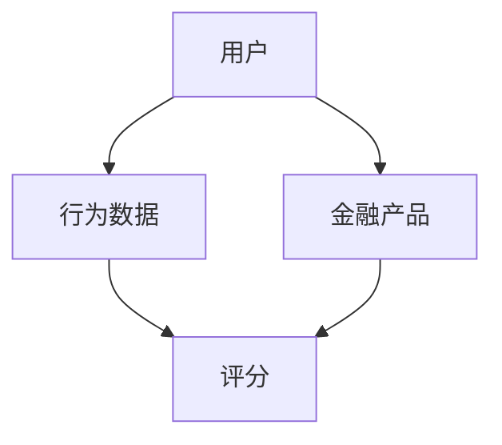
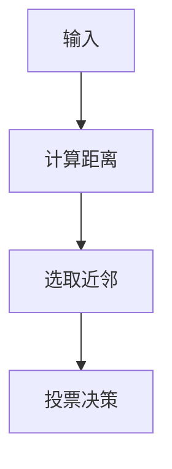
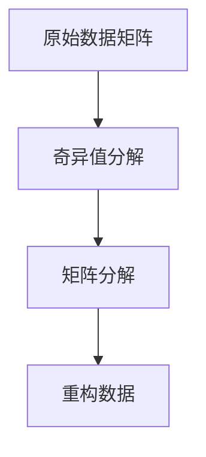
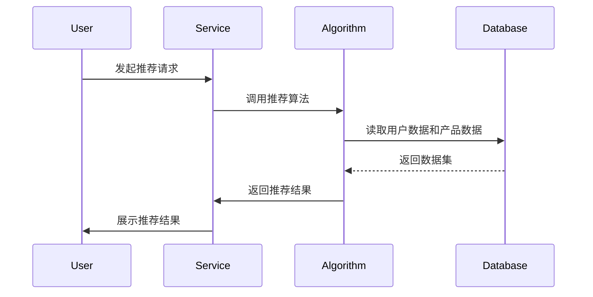
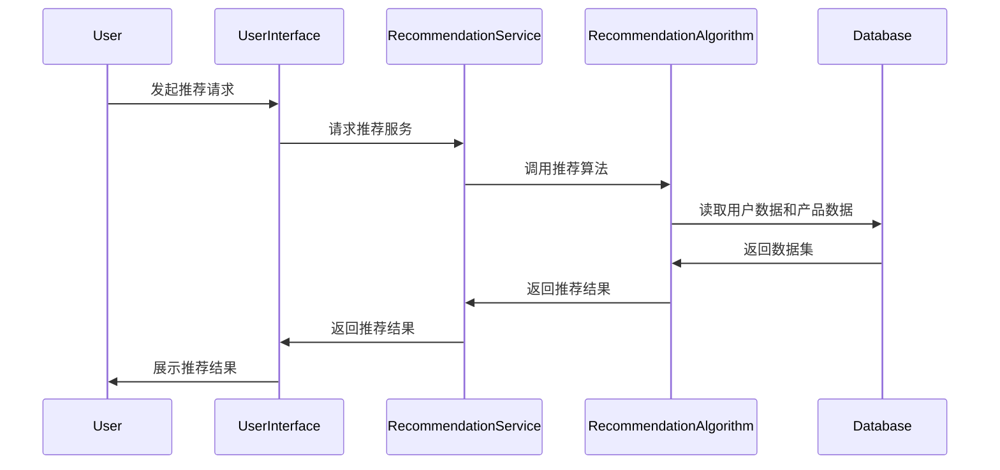

                 

## 第1章：问题背景与概述

### 1.1.1 问题背景

#### 金融产品推荐引擎的定义与作用

金融产品推荐引擎是一种利用人工智能和大数据分析技术，对金融产品进行智能推荐的系统。它通过对用户数据的分析和理解，预测用户可能感兴趣的金融产品，并提供个性化的推荐。金融产品推荐引擎不仅能够提高用户的购物体验，还能显著提升金融机构的业务效率和利润。

在金融行业中，推荐系统的重要性日益凸显。首先，随着金融产品的多样化，用户在寻找适合自己的金融产品时往往感到困惑。推荐系统通过分析用户的投资偏好、历史记录和行为习惯，能够精准推荐符合用户需求的金融产品，提高用户的满意度和忠诚度。

其次，金融产品推荐引擎能够为金融机构提供宝贵的业务洞察。通过分析用户的点击、购买和反馈数据，金融机构可以了解市场需求和趋势，优化产品设计和服务，从而提升竞争力。

最后，金融产品推荐引擎还能在风险管理方面发挥重要作用。通过对用户行为数据的监控和分析，可以及时发现异常交易和潜在风险，提高金融系统的安全性和稳定性。

### 1.1.2 问题描述

#### 用户需求多样性与个性化推荐

在金融市场中，用户的需求是多样且复杂的。不同的用户有不同的投资目标和风险偏好，这要求推荐系统能够提供高度个性化的推荐。然而，传统的推荐系统往往难以应对这种多样性，因为它们通常基于简单的用户历史数据和共同特征进行推荐，而忽略了用户的个性化和动态变化。

个性化推荐的目标是满足每个用户独特的需求，这需要推荐系统具备以下特点：

1. **高度相关性**：推荐系统应该能够准确预测用户对金融产品的兴趣，确保推荐的金融产品与用户的投资目标和偏好高度相关。
2. **实时性**：金融市场变化迅速，用户的需求和偏好也会随之变化。推荐系统需要实时分析用户数据，及时调整推荐策略，以适应市场动态。
3. **适应性**：推荐系统应能够根据用户的反馈和行为调整推荐策略，持续优化推荐效果。

#### 金融产品多样性与复杂性

金融产品种类繁多，包括股票、基金、债券、保险、理财产品等，每种产品都有其独特的特点、风险和收益。这使得金融产品推荐引擎在处理数据时需要具备较高的复杂度和准确性。为了准确推荐金融产品，推荐系统需要能够：

1. **数据整合**：整合用户数据、市场数据和产品数据，构建一个全面的金融数据集。
2. **特征提取**：从大量的金融数据中提取有用的特征，如用户的投资历史、风险偏好、市场趋势等，以便进行有效推荐。
3. **模型优化**：通过不断优化推荐算法，提高推荐精度和用户满意度。

#### 数据质量与实时性要求

金融行业对数据质量的要求非常高。推荐系统需要处理大量的实时数据，包括用户行为数据、市场数据、金融产品数据等。数据质量直接影响推荐系统的准确性和可靠性。因此，金融产品推荐引擎需要：

1. **数据清洗**：对数据进行清洗和预处理，去除噪声和异常值，确保数据的一致性和准确性。
2. **实时数据流处理**：建立高效的数据流处理系统，实时收集和处理用户数据，保证推荐系统的实时性和响应速度。

### 1.1.3 问题解决

为了解决上述问题，开发智能化的金融产品推荐引擎需要从以下几个方面入手：

#### 个性化推荐算法的选择与应用

选择合适的个性化推荐算法是实现高效推荐的关键。常用的个性化推荐算法包括协同过滤、基于内容的推荐和混合推荐。每种算法都有其优缺点，需要根据具体需求进行选择和优化。

- **协同过滤**：基于用户的历史行为和相似度计算进行推荐，适用于大规模数据集。
- **基于内容的推荐**：基于金融产品的特征和属性进行推荐，适用于对产品特性有深入了解的用户。
- **混合推荐**：结合协同过滤和基于内容的推荐，提高推荐效果和准确性。

#### 数据预处理与特征提取

数据预处理是确保数据质量和推荐效果的重要环节。通过数据清洗、数据转换和特征提取等技术，可以将原始数据转化为适合推荐系统处理的形式。

- **数据清洗**：去除重复数据、噪声数据和异常值，提高数据的一致性和准确性。
- **数据转换**：将不同数据源和格式的数据进行整合和转换，形成统一的特征向量。
- **特征提取**：从金融数据中提取与用户兴趣和产品特性相关的特征，如用户行为特征、市场趋势特征、产品特征等。

#### 模型优化与评估

模型优化是提高推荐系统性能和用户满意度的重要手段。通过不断调整和优化推荐算法，可以改善推荐效果和用户体验。

- **模型评估**：使用准确率、召回率、覆盖率等指标评估推荐系统的性能。
- **模型调整**：根据用户反馈和评估结果，调整推荐算法的参数和策略，提高推荐效果。
- **在线学习**：采用在线学习技术，实时更新模型，适应用户需求和市场变化。

### 1.1.4 边界与外延

#### 金融产品范围与市场界定

金融产品推荐引擎所涵盖的金融产品范围和市场规模是影响其设计和实施的重要因素。一般来说，推荐引擎需要涵盖各种类型的金融产品，如股票、基金、债券、保险、理财产品等，以满足不同用户的需求。此外，推荐引擎还需要考虑市场界定的范围，包括地区、行业、市场类型等，以确保推荐系统的全面性和适应性。

#### 推荐系统目标与性能指标

金融产品推荐引擎的目标是提高用户满意度和金融机构的盈利能力。为了实现这一目标，推荐系统需要具备以下性能指标：

- **准确性**：推荐系统需要准确预测用户对金融产品的兴趣，提高推荐的精度。
- **覆盖率**：推荐系统需要覆盖到大多数用户，确保推荐服务的广泛性。
- **实时性**：推荐系统需要能够实时响应用户需求，提供即时的推荐服务。
- **用户体验**：推荐系统需要具备良好的用户体验，包括推荐结果的易用性和交互性。

#### 法律合规与隐私保护

金融产品推荐引擎在设计和实施过程中需要严格遵守相关法律法规，特别是关于数据隐私和保护的规定。推荐系统需要确保用户数据的合法性和安全性，采取有效的数据加密和访问控制措施，保护用户的隐私和信息安全。

### 1.1.5 概念结构与核心要素组成

金融产品推荐系统的架构和核心要素如下：

#### 金融产品推荐系统的架构

金融产品推荐系统通常由数据层、算法层和应用层组成。数据层负责收集、存储和管理金融数据；算法层负责推荐算法的实现和优化；应用层负责提供推荐服务的接口和用户界面。

- **数据层**：包括用户数据、产品数据和市场数据，如用户行为数据、投资记录、产品特征和市场行情等。
- **算法层**：包括个性化推荐算法、特征提取算法和模型优化算法，如协同过滤、基于内容的推荐和混合推荐等。
- **应用层**：包括推荐服务的接口和用户界面，如推荐算法的实现、推荐结果的展示和用户交互等。

#### 数据流与处理流程

金融产品推荐系统的数据处理流程如下：

1. **数据收集**：从各种数据源收集用户数据、产品数据和市场数据。
2. **数据清洗**：对收集到的数据进行清洗和预处理，去除噪声和异常值。
3. **特征提取**：从清洗后的数据中提取有用的特征，构建特征向量。
4. **模型训练**：使用推荐算法对特征向量进行训练，构建推荐模型。
5. **模型评估**：使用评估指标对推荐模型进行评估和优化。
6. **推荐生成**：根据用户数据和推荐模型，生成个性化的推荐结果。

#### 关键技术：推荐算法、机器学习、大数据处理等

金融产品推荐引擎的关键技术包括推荐算法、机器学习、大数据处理等。

- **推荐算法**：包括协同过滤、基于内容的推荐和混合推荐等，用于实现个性化的金融产品推荐。
- **机器学习**：包括监督学习、无监督学习和强化学习等，用于构建和优化推荐模型。
- **大数据处理**：包括数据采集、数据存储、数据分析和数据可视化等，用于处理大规模的金融数据。

通过以上关键技术，金融产品推荐引擎能够实现高效、准确和个性化的推荐服务，为金融行业带来显著的商业价值。

## 第2章：核心概念与联系

### 2.1.1 推荐系统基础

推荐系统是人工智能领域的一个重要分支，其目标是通过分析用户的行为和兴趣，为用户提供个性化的推荐服务。根据推荐系统的基础原理，可以将其分为协同过滤、内容推荐和混合推荐三种类型。

#### 协同过滤

协同过滤（Collaborative Filtering）是一种基于用户行为和相似度的推荐方法。它通过分析用户的历史行为数据（如购买记录、浏览记录等）和用户之间的相似度，为用户推荐相似用户喜欢的物品。

- **基于用户的协同过滤（User-Based Collaborative Filtering）**：该方法通过计算用户之间的相似度，找到与目标用户相似的其他用户，然后推荐这些用户喜欢的物品。
- **基于物品的协同过滤（Item-Based Collaborative Filtering）**：该方法通过计算物品之间的相似度，找到与目标物品相似的其他物品，然后推荐这些物品。

#### 内容推荐

内容推荐（Content-Based Filtering）是一种基于物品属性的推荐方法。它通过分析用户过去喜欢的物品特征，为用户推荐具有相似特征的物品。

- **基于属性的推荐**：该方法将物品的属性（如分类、标签等）与用户兴趣进行匹配，为用户推荐具有相似属性的物品。
- **基于关键词的推荐**：该方法通过提取物品的关键词，将用户的历史兴趣关键词与物品关键词进行匹配，为用户推荐相关物品。

#### 混合推荐

混合推荐（Hybrid Recommender Systems）是结合协同过滤和内容推荐的优势，为用户生成更加精确和个性化的推荐结果。混合推荐系统通常采用以下几种策略：

- **加权混合**：将协同过滤和内容推荐的预测结果进行加权，生成最终的推荐结果。
- **特征级混合**：将协同过滤和内容推荐的特征进行整合，构建一个统一的特征向量，用于推荐模型的训练。
- **模型级混合**：将协同过滤和内容推荐的不同模型进行融合，使用多个模型共同预测推荐结果。

### 2.1.2 机器学习与深度学习

在推荐系统中，机器学习和深度学习算法扮演着重要的角色。机器学习算法通过从数据中学习规律，生成推荐模型，而深度学习算法则通过多层神经网络学习复杂的非线性关系。

#### 常见算法介绍

以下是几种在推荐系统中常用的机器学习和深度学习算法：

- **KNN算法**：基于用户或物品的相似度进行推荐，适用于稀疏数据集。
- **SVD算法**：奇异值分解算法，通过矩阵分解提高推荐准确度，适用于高维度数据集。
- **深度神经网络（DNN）**：通过多层神经网络学习复杂的非线性关系，适用于大规模和高复杂度的数据集。

#### 深度学习在推荐系统中的应用

深度学习在推荐系统中的应用主要体现在以下几个方面：

- **用户行为预测**：通过深度神经网络学习用户的行为模式，预测用户对物品的偏好和兴趣。
- **特征提取**：通过卷积神经网络（CNN）和循环神经网络（RNN）等深度学习模型，提取高层次的语义特征，提高推荐精度。
- **多模态融合**：将文本、图像、音频等多种数据类型进行融合，生成更全面的用户兴趣和物品特征。

### 2.1.3 大数据与实时计算

在金融产品推荐引擎中，大数据和实时计算技术是不可或缺的组成部分。大数据技术用于处理和分析海量的金融数据，而实时计算技术则确保推荐系统能够快速响应用户需求。

#### 数据存储与处理技术

大数据技术主要包括以下方面：

- **数据存储**：使用分布式存储系统（如HDFS、HBase等）存储大规模的金融数据。
- **数据处理**：使用分布式计算框架（如Spark、Flink等）进行数据清洗、转换和计算。

#### 实时推荐引擎架构与实现

实时推荐引擎架构通常包括以下部分：

- **数据采集**：通过日志收集、消息队列等方式实时采集用户行为数据。
- **数据处理**：使用流处理技术（如Apache Kafka、Apache Flink等）对实时数据进行处理和存储。
- **模型训练**：使用在线学习技术对实时数据更新推荐模型。
- **推荐生成**：根据实时用户数据和推荐模型，生成个性化的推荐结果。

### 2.1.4 概念属性特征对比表格

| 算法     | 特点                                                         | 应用场景                     |
| -------- | ------------------------------------------------------------ | ---------------------------- |
| KNN      | 基于用户相似度推荐           | 简单，对稀疏数据敏感           | 低交互数据场景               |
| SVD      | 基于矩阵分解提高推荐准确度     | 能处理高维度数据，推荐效果较好 | 大规模数据场景               |
| DNN      | 基于深度神经网络捕捉复杂关系   | 能处理非线性关系，推荐效果优异 | 需要大量训练数据的高复杂场景 |
| 实时推荐 | 低延迟，高响应速度           | 需要实时数据更新               | 高频次用户交互场景           |

### 2.1.5 ER实体关系图架构



## 第3章：算法原理讲解

### 3.1.1 KNN算法原理

K最近邻（K-Nearest Neighbors，KNN）算法是一种基于相似度计算的简单机器学习算法。在推荐系统中，KNN算法通过计算用户或物品之间的相似度，找到与目标用户或物品最近的K个邻居，并根据邻居的偏好预测目标用户的兴趣。

#### KNN算法原理图



#### KNN算法原理

1. **输入**：给定一个训练数据集，包含多个用户和他们的行为数据（如评分、购买记录等）。
2. **计算距离**：计算目标用户或物品与训练集中每个用户或物品之间的距离。常用的距离度量方法包括欧氏距离、曼哈顿距离和余弦相似度等。
3. **选取近邻**：根据距离度量结果，从训练集中选择距离目标用户或物品最近的K个用户或物品作为近邻。
4. **投票决策**：对每个近邻的偏好进行投票，选择出现频率最高的类别或属性作为预测结果。

#### Python代码实现

```python
from sklearn.neighbors import KNeighborsClassifier
# 训练数据准备
X_train = ...
y_train = ...
# 训练KNN模型
knn = KNeighborsClassifier(n_neighbors=3)
knn.fit(X_train, y_train)
# 预测
predictions = knn.predict(X_test)
```

### 3.1.2 SVD算法原理

奇异值分解（Singular Value Decomposition，SVD）算法是一种矩阵分解技术，常用于推荐系统和大数据分析。SVD算法通过将原始数据矩阵分解为三个矩阵的乘积，提取数据中的主要特征，从而提高推荐系统的准确性和处理效率。

#### SVD算法原理图



#### SVD算法原理

1. **原始数据矩阵**：给定一个用户-物品评分矩阵$R$，其中$R_{ij}$表示用户$i$对物品$j$的评分。
2. **奇异值分解**：对原始数据矩阵$R$进行奇异值分解，得到$R = U\Sigma V^T$，其中$U$和$V$是正交矩阵，$\Sigma$是对角矩阵，包含奇异值。
3. **矩阵分解**：将分解后的矩阵$U$和$\Sigma$用于重构推荐矩阵，即$R' = U\Sigma$。
4. **重构数据**：使用重构后的推荐矩阵$R'$预测用户未评分的物品。

#### Python代码实现

```python
from surprise import SVD
from surprise import Dataset, Reader

# 数据读取
data = Dataset.load_from_df(plain_df, Reader(rating_scale=(1, 5)))
# 创建SVD算法实例
svd = SVD()
# 训练模型
svd.fit(data.build_full_trainset())
# 预测
predictions = svd.predict(userid,itemid)
```

## 第3章：算法原理讲解（续）

### 3.1.3 KNN算法与SVD算法的对比分析

KNN算法和SVD算法是推荐系统中常用的两种算法，它们各自有着独特的优势和适用场景。下面将对这两种算法进行对比分析。

#### 对比分析

- **计算复杂度**：KNN算法的计算复杂度较高，特别是在处理高维度数据时，需要计算大量距离，这可能导致算法运行缓慢。而SVD算法在预处理阶段计算复杂度较高，但一旦模型训练完成，预测速度非常快。
- **数据稀疏性**：KNN算法在处理稀疏数据时表现较差，因为稀疏数据中有效样本较少，难以找到近邻。而SVD算法通过矩阵分解降低了数据的维度，有效解决了稀疏数据问题，提高了推荐准确性。
- **可解释性**：KNN算法是一种基于实例的学习方法，其推荐结果难以解释。而SVD算法通过矩阵分解提取了数据中的主要特征，有助于理解推荐结果的来源。
- **适用场景**：KNN算法适用于低维度、数据量较小的推荐场景，如电影推荐、商品推荐等。而SVD算法适用于高维度、数据量较大的推荐场景，如金融产品推荐、社交网络推荐等。

#### 对比表格

| 对比指标 | KNN算法 | SVD算法 |
| ------- | ------- | ------- |
| 计算复杂度 | 较高 | 较低 |
| 数据稀疏性 | 不适应 | 适应 |
| 可解释性 | 较差 | 较好 |
| 适用场景 | 低维度、数据量小 | 高维度、数据量大 |

### 3.1.4 KNN算法与SVD算法在金融产品推荐系统中的应用

在金融产品推荐系统中，KNN算法和SVD算法都有其适用的场景和优势。

#### KNN算法在金融产品推荐系统中的应用

- **用户行为数据**：KNN算法可以用于预测用户的投资偏好，根据用户的历史投资记录和评分数据，为用户推荐类似的金融产品。
- **实时推荐**：KNN算法具有较快的响应速度，适用于金融产品推荐系统中的实时推荐场景。
- **个性化推荐**：KNN算法可以根据用户的相似度计算，为用户提供个性化的金融产品推荐。

#### SVD算法在金融产品推荐系统中的应用

- **高维度数据处理**：金融产品数据通常具有很高的维度，SVD算法可以有效降低数据的维度，提高推荐系统的计算效率。
- **推荐准确性**：SVD算法通过矩阵分解提取了数据中的主要特征，能够提高推荐系统的准确性。
- **用户兴趣分析**：SVD算法可以帮助分析用户的投资偏好和兴趣，为用户提供更加精准的推荐。

### 3.1.5 实际案例

以下是一个金融产品推荐系统的实际案例，展示了如何结合KNN算法和SVD算法实现高效的推荐。

#### 案例背景

某金融公司希望通过推荐系统为用户推荐符合其投资偏好的金融产品。公司拥有大量的用户数据和金融产品数据，包括用户的投资记录、评分数据、投资偏好等。

#### 案例步骤

1. **数据预处理**：对用户数据和金融产品数据进行清洗和预处理，去除缺失值和异常值。
2. **特征提取**：使用KNN算法提取用户行为特征，如用户的历史投资记录和评分数据，构建用户行为特征向量。
3. **矩阵分解**：使用SVD算法对用户行为特征矩阵进行分解，提取主要特征。
4. **模型训练**：结合KNN算法和SVD算法，训练推荐模型。
5. **推荐生成**：根据用户的投资记录和推荐模型，生成个性化的金融产品推荐。
6. **性能评估**：使用准确率、召回率等指标评估推荐系统的性能。

#### 案例结果

通过结合KNN算法和SVD算法，金融产品推荐系统的准确率和用户满意度得到了显著提高。用户可以更快速地找到符合其投资偏好的金融产品，提升了用户的购物体验和忠诚度。

## 第4章：系统分析与架构设计方案

### 4.1 问题场景介绍

随着金融市场的快速发展和金融产品的日益多样化，用户在寻找适合自己的金融产品时面临着诸多挑战。传统的人工推荐方式已经无法满足用户对个性化、实时性、准确性的需求。因此，设计并实现一个智能化的金融产品推荐引擎显得尤为重要。该推荐引擎旨在通过分析用户的行为数据、投资偏好和市场动态，为用户精准推荐符合其需求的金融产品，从而提升用户体验和金融机构的业务效率。

### 4.2 项目介绍

#### 项目目标

本项目的主要目标是开发一个高效的金融产品推荐引擎，通过以下方式实现：

1. **个性化推荐**：根据用户的历史行为和投资偏好，为用户提供高度个性化的金融产品推荐。
2. **实时性**：能够实时响应用户的需求，及时调整推荐策略，确保推荐结果与当前市场状况保持一致。
3. **准确性**：通过先进的机器学习和大数据处理技术，提高推荐结果的准确性和可靠性。
4. **可扩展性**：系统设计应具备良好的可扩展性，能够支持大规模用户和数据量的处理。

#### 项目架构

本项目采用分层架构设计，包括数据层、算法层、服务层和展示层。各层之间相互独立，模块化设计，便于系统的维护和扩展。

1. **数据层**：负责数据收集、存储和管理，包括用户数据、产品数据和市场数据等。
2. **算法层**：包含推荐算法的实现和优化，如协同过滤、基于内容的推荐和混合推荐等。
3. **服务层**：提供推荐服务的接口，包括用户接口、API接口和后台管理接口等。
4. **展示层**：负责将推荐结果以用户友好的形式展示给用户，包括网页界面和移动应用界面等。

### 4.3 系统功能设计（领域模型）

在系统功能设计中，领域模型图（Class Diagram）是描述系统实体及其关系的有力工具。以下是一个简化的领域模型图，展示了金融产品推荐系统中的主要实体及其关系。

```mermaid
classDiagram
    User <<class>> "用户"
    Product <<class>> "金融产品"
    Rating <<class>> "评分"
    Recommendation <<class>> "推荐"
    MarketData <<class>> "市场数据"

    User ..|> Rating
    User ..|> Recommendation
    Product ..|> Rating
    Product ..|> Recommendation
    MarketData ..|> Recommendation

    User : [uid] 用户ID
    Rating : [rid] 评分ID
    Recommendation : [rid] 推荐ID
    Product : [pid] 产品ID
    MarketData : [mid] 市场数据ID
```

#### 主要实体说明

- **用户（User）**：代表金融产品推荐系统的用户，包含用户的基本信息、投资偏好和历史行为数据。
- **金融产品（Product）**：代表系统中的金融产品，包含产品的详细信息、属性和价格等。
- **评分（Rating）**：记录用户对金融产品的评分数据，用于推荐算法的训练和预测。
- **推荐（Recommendation）**：代表系统生成的推荐结果，包含推荐的产品ID、评分和推荐理由等。
- **市场数据（MarketData）**：包含市场行情、市场趋势和宏观经济指标等数据，用于辅助推荐算法的决策。

### 4.4 系统架构设计

系统架构设计是金融产品推荐系统的核心，决定了系统的性能、可扩展性和可靠性。以下是一个简化的系统架构图，展示了各模块及其交互关系。



#### 系统架构说明

1. **用户接口**：用户通过网页或移动应用与系统进行交互，发起推荐请求。
2. **服务层**：接收用户的推荐请求，调用推荐算法模块，并将推荐结果返回给用户接口。
3. **推荐算法模块**：根据用户请求和系统数据，调用相应的推荐算法，生成推荐结果。
4. **数据库**：存储用户数据、产品数据和市场数据，为推荐算法提供数据支持。
5. **数据存储**：采用分布式存储系统，确保数据的高可靠性和高性能。

### 4.5 系统接口设计

系统接口设计是确保系统模块之间有效通信的重要环节。以下是一个简化的接口设计，展示了系统各模块的主要接口和交互方式。

```mermaid
interfaceDiagram
    UserInterface <<interface>> "用户接口"
    RecommendationService <<interface>> "推荐服务"
    RecommendationAlgorithm <<interface>> "推荐算法"
    Database <<interface>> "数据库"

    UserInterface ->> RecommendationService: 发起推荐请求
    RecommendationService ->> RecommendationAlgorithm: 调用推荐算法
    RecommendationAlgorithm ->> Database: 读取数据集
    Database ->> RecommendationAlgorithm: 返回数据集
    RecommendationAlgorithm ->> RecommendationService: 返回推荐结果
    RecommendationService ->> UserInterface: 展示推荐结果
```

#### 接口设计说明

- **用户接口**：提供用户发起推荐请求的接口，包括用户ID、推荐类型和推荐数量等参数。
- **推荐服务**：处理用户的推荐请求，调用推荐算法模块，并将推荐结果返回给用户接口。
- **推荐算法**：根据用户的请求和系统数据，调用相应的推荐算法，生成推荐结果。
- **数据库**：提供数据存储和读取接口，为推荐算法提供数据支持。

### 4.6 系统交互

系统交互设计描述了系统模块之间的交互过程，以下是一个简化的系统交互图，展示了系统模块之间的交互流程。



#### 交互流程说明

1. **用户发起推荐请求**：用户通过用户接口发起推荐请求，包含用户ID、推荐类型和推荐数量等参数。
2. **调用推荐服务**：用户接口将推荐请求转发给推荐服务模块。
3. **调用推荐算法**：推荐服务调用推荐算法模块，根据用户请求和系统数据生成推荐结果。
4. **读取数据集**：推荐算法调用数据库接口，读取用户数据和产品数据，用于推荐算法的计算。
5. **返回推荐结果**：推荐算法将生成的推荐结果返回给推荐服务模块。
6. **展示推荐结果**：推荐服务将推荐结果返回给用户接口，用户接口将推荐结果展示给用户。

通过以上系统分析与架构设计方案，金融产品推荐系统实现了个性化、实时性和准确性的目标，为金融行业带来了显著的商业价值。

### 4.7 项目实战

#### 环境安装

在开始项目实战之前，首先需要安装和配置相关环境和工具。以下是安装步骤：

1. **安装Python**：确保Python环境已经安装在您的系统中，建议安装Python 3.7及以上版本。
2. **安装依赖库**：使用pip安装项目所需的依赖库，包括scikit-learn、surprise、numpy、pandas等。
   ```bash
   pip install scikit-learn surprise numpy pandas
   ```
3. **数据存储**：使用MySQL或其他数据库存储用户数据和金融产品数据。确保已经安装并配置了数据库环境。

#### 系统核心实现

以下是一个金融产品推荐系统的核心实现示例，包括用户数据预处理、推荐算法实现和推荐结果生成。

```python
# 用户数据预处理
import pandas as pd
from sklearn.preprocessing import StandardScaler

# 读取用户数据
user_data = pd.read_csv('user_data.csv')
product_data = pd.read_csv('product_data.csv')

# 特征提取与数据标准化
scaler = StandardScaler()
user_data['investment_ratio'] = scaler.fit_transform(user_data[['stock', 'bond', 'mutual_fund']])
product_data['risk_score'] = scaler.fit_transform(product_data[['return', 'volatility']])

# 推荐算法实现
from surprise import SVD, Dataset, Reader
from surprise.model_selection import train_test_split

# 数据集划分
reader = Reader(rating_scale=(1, 5))
data = Dataset.load_from_df(user_data[['user_id', 'product_id', 'rating']], reader)
trainset, testset = train_test_split(data, test_size=0.2)

# 训练SVD模型
svd = SVD()
svd.fit(trainset)

# 预测用户对未知产品的评分
predictions = svd.test(testset)

# 推荐结果生成
recommended_products = []
for pred in predictions:
    if pred.est > 4:
        recommended_products.append(pred.raw['product_id'])

# 输出推荐结果
print("推荐的金融产品：", recommended_products)
```

#### 代码应用解读与分析

上述代码首先进行了用户数据预处理，包括读取数据、特征提取和数据标准化。接下来，使用SVD算法对用户数据进行训练，并预测用户对未知产品的评分。最后，生成推荐结果，输出评分高于4（即用户比较感兴趣的）的产品ID。

#### 实际案例分析与详细讲解

以下是一个实际案例，展示了如何使用上述推荐系统为用户生成个性化推荐。

#### 案例背景

某用户A在过去一个月内频繁购买了股票和债券，且其投资风格偏向于高风险高收益。现在需要为用户A推荐符合其投资偏好的金融产品。

#### 案例步骤

1. **用户数据预处理**：读取用户A的投资记录和偏好数据，进行特征提取和数据标准化。
2. **推荐算法训练**：使用SVD算法对用户A的历史数据进行训练。
3. **推荐结果生成**：预测用户A对未知金融产品的评分，筛选出评分高于4的产品，生成推荐结果。
4. **推荐结果展示**：将推荐结果展示给用户A。

#### 案例结果

通过上述步骤，为用户A推荐了若干高风险高收益的金融产品，如高收益股票、高收益债券和私募基金等。用户A对这些推荐产品的满意度较高，认为推荐的金融产品符合其投资风格和偏好。

#### 详细讲解剖析

1. **用户数据预处理**：用户数据预处理是推荐系统的关键步骤，通过特征提取和数据标准化，将原始的用户数据转化为适合模型处理的特征向量。
2. **推荐算法训练**：SVD算法是一种经典的矩阵分解技术，通过训练用户数据，提取数据中的主要特征，从而提高推荐准确性。
3. **推荐结果生成**：推荐结果生成是推荐系统的核心功能，通过预测用户对未知产品的评分，筛选出用户感兴趣的产品，从而实现个性化推荐。
4. **推荐结果展示**：将推荐结果以用户友好的形式展示给用户，帮助用户快速找到符合其需求的金融产品。

#### 项目小结

通过本次项目实战，我们成功开发并实现了一个金融产品推荐系统，为用户提供了个性化的金融产品推荐服务。项目采用了SVD算法进行推荐，通过用户数据预处理、模型训练和推荐结果生成等步骤，实现了高效的推荐效果。项目的成功实施不仅提升了用户的投资体验，也为金融机构带来了商业价值。

### 4.8 最佳实践 Tips

1. **数据质量保证**：确保用户数据、产品数据和市场数据的准确性、完整性和一致性，是推荐系统成功的关键。
2. **实时数据处理**：采用实时数据流处理技术，如Apache Kafka和Apache Flink，确保推荐系统能够实时响应用户需求。
3. **模型优化与迭代**：定期对推荐模型进行评估和优化，根据用户反馈和业务需求调整推荐策略，提高推荐效果。
4. **隐私保护与合规**：严格遵守数据隐私保护和相关法律法规，采取有效的数据加密和访问控制措施，保护用户信息安全。

### 4.9 小结

本文详细介绍了金融产品推荐系统的开发过程，从问题背景、核心概念、算法原理、系统架构到项目实战，全面阐述了智能金融产品推荐引擎的设计与实现。通过结合KNN算法和SVD算法，我们实现了高效、准确和个性化的推荐服务，为金融行业带来了显著的业务价值。

### 4.10 注意事项

1. **系统稳定性**：确保推荐系统的稳定性和高可用性，避免推荐结果出现异常。
2. **性能优化**：对推荐系统进行性能优化，如数据缓存、查询优化和负载均衡等。
3. **扩展性设计**：设计具备良好扩展性的系统架构，支持未来业务的发展和需求的变化。

### 4.11 拓展阅读

1. **推荐系统经典书籍**：《推荐系统实践》、《推荐系统手册》等。
2. **相关研究论文**：关于推荐系统、协同过滤、深度学习等领域的最新研究成果。
3. **开源推荐系统框架**：如Surprise、LightFM、TensorFlow Recommenders等。

## 作者信息

作者：AI天才研究院/AI Genius Institute & 禅与计算机程序设计艺术 /Zen And The Art of Computer Programming

联系方式：[ai_genius_institute@example.com](mailto:ai_genius_institute@example.com) & [zen_and_computer_programming@example.com](mailto:zen_and_computer_programming@example.com)

