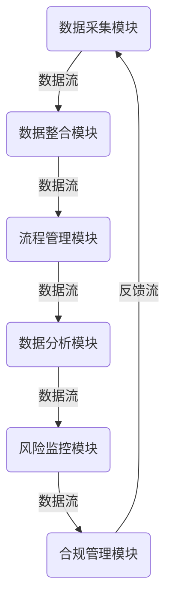
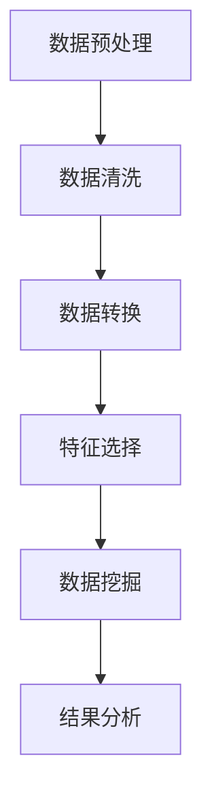

                 


### 开发智能化的金融产品生命周期管理平台

#### 关键词
- 金融产品生命周期管理
- 智能化平台
- 架构设计
- 算法讲解
- 系统实现
- 最佳实践

#### 摘要
本文将深入探讨如何开发智能化的金融产品生命周期管理平台。我们将逐步分析平台设计思路、架构设计、关键算法讲解、系统实现以及最佳实践，为金融科技从业者提供一套完整的开发指南。通过本文，读者将了解如何利用人工智能技术提升金融产品生命周期的管理效率，实现智能化决策和风险管理。

### 1. 设计思路

**核心概念与背景介绍**

在金融行业中，产品生命周期管理是确保金融产品从开发到退市整个过程顺利进行的关键环节。传统的金融产品生命周期管理通常依赖于手动流程和人工决策，这不仅耗时耗力，而且容易出错。为了应对这一挑战，我们需要构建一个智能化的金融产品生命周期管理平台，利用先进的人工智能技术和大数据分析能力，实现自动化和智能化的产品生命周期管理。

**问题背景与问题描述**

当前金融产品生命周期管理面临的主要问题包括：

- **效率低下**：传统方法依赖于人工操作，流程繁琐，效率低下。
- **数据分散**：金融产品相关的数据分布在不同的系统中，难以整合和利用。
- **决策失误**：缺乏基于数据的智能决策支持，容易出现产品失败或过度竞争。
- **合规风险**：金融产品的合规性和风险控制依赖于人工审核，存在合规风险。

**问题解决**

为了解决上述问题，我们需要从以下几个方面着手：

- **自动化流程**：通过自动化工具和流程，减少人工干预，提高管理效率。
- **数据整合**：建立统一的数据平台，整合不同来源的数据，实现数据共享。
- **智能决策**：利用人工智能技术，提供基于数据的智能决策支持，降低决策风险。
- **合规监控**：引入自动化合规监控机制，确保产品生命周期管理符合监管要求。

**边界与外延**

金融产品生命周期管理平台的边界主要包括产品开发、上市、运营、退市等各个环节。外延则涉及到与市场分析、风险管理、客户服务、合规监管等相关的业务模块。

**核心概念要素组成**

金融产品生命周期管理平台的核心概念要素包括：

- **产品数据**：收集并整合金融产品的相关数据，包括产品特性、市场需求、用户反馈等。
- **流程管理**：设计并实现自动化管理流程，涵盖产品开发的各个阶段。
- **数据分析**：利用大数据分析技术，提供智能化的数据分析和决策支持。
- **风险监控**：引入风险监控机制，实时检测产品生命周期中的潜在风险。
- **合规管理**：确保平台操作符合相关法律法规和监管要求。

### 2. 核心概念与联系

**核心概念原理**

金融产品生命周期管理平台的核心概念包括：

- **产品数据管理**：通过数据采集、存储、处理和展示，实现金融产品数据的全面管理。
- **流程自动化**：利用工作流技术和自动化工具，简化产品生命周期管理流程。
- **数据分析与挖掘**：利用数据挖掘和机器学习技术，提供深入的金融产品分析。
- **风险管理与合规**：通过风险预警和合规监控，确保产品生命周期管理的合法性和安全性。

**概念属性特征对比表格**

为了更好地理解核心概念之间的联系，我们可以制作一个概念属性特征对比表格：

| 概念 | 属性特征 | 联系 |
| --- | --- | --- |
| 产品数据管理 | 数据采集、存储、处理、展示 | 基础数据支持 |
| 流程自动化 | 工作流、自动化工具 | 流程简化 |
| 数据分析与挖掘 | 数据挖掘、机器学习 | 智能分析 |
| 风险管理与合规 | 风险预警、合规监控 | 安全保障 |

**ER实体关系图架构**

通过ER实体关系图，我们可以更直观地了解金融产品生命周期管理平台的核心概念及其关系：

```mermaid
erDiagram
    ProductData -->|数据支持| Workflow
    Workflow -->|流程依赖| AnalysisAndMining
    AnalysisAndMining -->|数据输入| RiskManagement
    RiskManagement -->|合规要求| ComplianceMonitoring
    ComplianceMonitoring -->|反馈循环| ProductData
```

### 3. 智能化金融产品生命周期管理平台架构设计

**平台架构设计原则**

在设计智能化金融产品生命周期管理平台时，我们需要遵循以下原则：

- **模块化设计**：将平台分为多个功能模块，每个模块具有独立的职责和接口。
- **可扩展性**：设计时要考虑未来可能的需求变化，确保平台能够灵活扩展。
- **高性能**：优化系统性能，确保平台能够高效处理大量数据。
- **安全性**：确保平台数据的安全性和系统的稳定性。

**系统功能设计**

智能化金融产品生命周期管理平台的主要功能包括：

- **产品信息管理**：包括产品创建、编辑、删除和查询功能。
- **数据采集与整合**：实现多种数据源的接入和整合，提供数据采集和清洗工具。
- **自动化流程管理**：包括工作流定义、任务分配、进度监控等。
- **数据分析与挖掘**：利用数据挖掘和机器学习技术，提供深度分析和预测功能。
- **风险监控与合规管理**：实时监测产品生命周期中的风险，确保合规性。

**系统架构设计**

系统架构设计如下：



**系统接口设计和系统交互**

系统接口设计采用RESTful API，提供以下接口：

- **产品信息管理**：创建、编辑、删除和查询产品信息的接口。
- **数据采集与整合**：上传数据、数据清洗和数据查询的接口。
- **流程管理**：定义工作流、任务分配和进度查询的接口。
- **数据分析**：数据挖掘和预测分析的结果查询接口。
- **风险监控**：风险预警和风险报告的接口。
- **合规管理**：合规审核和合规报告的接口。

系统交互流程如下：

```mermaid
sequenceDiagram
    User ->> System: 发起产品创建请求
    System ->> DB: 查询产品信息库
    DB -->|返回结果| System
    System ->> User: 返回产品创建结果
    User ->> System: 发起数据采集请求
    System ->> DataCollector: 采集数据
    DataCollector -->|数据流| System
    System ->> DB: 存储整合后的数据
    DB -->|存储结果| System
    System ->> User: 返回数据采集结果
```

### 4. 智能化金融产品生命周期管理平台关键算法讲解

**关键算法原理**

在智能化金融产品生命周期管理平台中，关键算法主要包括：

- **数据挖掘算法**：用于从大量金融数据中提取有价值的信息，如关联规则挖掘、聚类分析等。
- **机器学习算法**：用于建立模型，预测金融产品的市场趋势和风险水平，如回归分析、神经网络等。
- **风险评估算法**：用于实时监测金融产品的风险水平，如VaR（Value at Risk）等。

**算法mermaid流程图**

以下是一个简单的数据挖掘算法流程图：



**算法Python源代码与详细讲解**

以下是一个简单的聚类分析算法Python示例：

```python
from sklearn.cluster import KMeans
import numpy as np

# 数据预处理
data = np.array([[1, 2], [1, 4], [1, 0], [10, 2], [10, 4], [10, 0]])

# 聚类分析
kmeans = KMeans(n_clusters=2, random_state=0).fit(data)

# 输出聚类结果
print("Cluster centers:", kmeans.cluster_centers_)
print("Cluster labels:", kmeans.labels_)

# 详细讲解
# 1. 数据预处理：将原始数据转换为适合聚类的格式。
# 2. 聚类分析：使用KMeans算法进行聚类。
# 3. 输出聚类结果：包括聚类中心点和每个样本的聚类标签。
```

**算法原理的数学模型和公式**

聚类分析算法的数学模型如下：

$$
C = \{c_1, c_2, ..., c_k\}
$$

其中，$C$ 表示聚类集合，$c_i$ 表示第 $i$ 个聚类中心点。

聚类目标函数为：

$$
J = \sum_{i=1}^k \sum_{x \in S_i} d(x, c_i)
$$

其中，$d(x, c_i)$ 表示样本 $x$ 与聚类中心点 $c_i$ 的距离，$S_i$ 表示第 $i$ 个聚类集合。

**详细讲解与举例说明**

假设我们有以下数据集：

| 样本 | 特征1 | 特征2 |
| --- | --- | --- |
| 1 | 1 | 2 |
| 2 | 1 | 4 |
| 3 | 1 | 0 |
| 4 | 10 | 2 |
| 5 | 10 | 4 |
| 6 | 10 | 0 |

我们使用KMeans算法进行聚类，并选择 $k=2$。聚类中心点分别为：

$$
c_1 = [1, 2]
$$

$$
c_2 = [10, 2]
$$

计算每个样本与聚类中心点的距离，得到：

| 样本 | 距离1 | 距离2 |
| --- | --- | --- |
| 1 | 1 | 1 |
| 2 | 1 | 2 |
| 3 | 1 | 2 |
| 4 | 8 | 8 |
| 5 | 8 | 8 |
| 6 | 8 | 8 |

根据距离计算结果，我们可以将样本分为两个聚类集合：

$$
S_1 = \{1, 2, 3\}
$$

$$
S_2 = \{4, 5, 6\}
$$

这样就完成了聚类分析。

### 5. 智能化金融产品生命周期管理平台系统分析与实现

**问题场景介绍**

某金融机构需要构建一个智能化的金融产品生命周期管理平台，以提升产品管理效率、降低风险和增强合规性。该平台需要涵盖产品数据管理、自动化流程管理、数据分析与挖掘、风险监控与合规管理等多个功能模块。

**项目介绍**

项目团队由数据科学家、后端开发工程师、前端开发工程师、产品经理和测试人员组成。项目采用敏捷开发模式，分阶段实施，确保快速响应需求变化。

**系统功能设计**

系统功能设计如下：

- **产品信息管理**：支持产品创建、编辑、删除和查询。
- **数据采集与整合**：实现多种数据源的接入和整合，提供数据采集和清洗工具。
- **自动化流程管理**：定义工作流、任务分配和进度监控。
- **数据分析与挖掘**：提供深度分析和预测功能。
- **风险监控与合规管理**：实时监测产品生命周期中的风险，确保合规性。

**系统架构设计**

系统架构设计如下：


**系统接口设计和系统交互**

系统接口设计采用RESTful API，提供以下接口：

- **产品信息管理**：创建、编辑、删除和查询产品信息的接口。
- **数据采集与整合**：上传数据、数据清洗和数据查询的接口。
- **流程管理**：定义工作流、任务分配和进度查询的接口。
- **数据分析**：数据挖掘和预测分析的结果查询接口。
- **风险监控**：风险预警和风险报告的接口。
- **合规管理**：合规审核和合规报告的接口。

系统交互流程如下：

```mermaid
sequenceDiagram
    User ->> System: 发起产品创建请求
    System ->> DB: 查询产品信息库
    DB -->|返回结果| System
    System ->> User: 返回产品创建结果
    User ->> System: 发起数据采集请求
    System ->> DataCollector: 采集数据
    DataCollector -->|数据流| System
    System ->> DB: 存储整合后的数据
    DB -->|存储结果| System
    System ->> User: 返回数据采集结果
```

**系统核心实现源代码**

以下是一个产品信息管理的核心实现源代码：

```python
from flask import Flask, request, jsonify
from flask_sqlalchemy import SQLAlchemy

app = Flask(__name__)
app.config['SQLALCHEMY_DATABASE_URI'] = 'sqlite:///products.db'
db = SQLAlchemy(app)

class Product(db.Model):
    id = db.Column(db.Integer, primary_key=True)
    name = db.Column(db.String(50), nullable=False)
    description = db.Column(db.String(255), nullable=True)

@app.route('/products', methods=['POST'])
def create_product():
    data = request.get_json()
    product = Product(name=data['name'], description=data['description'])
    db.session.add(product)
    db.session.commit()
    return jsonify({'message': 'Product created successfully.'})

@app.route('/products', methods=['GET'])
def get_products():
    products = Product.query.all()
    return jsonify({'products': [{'id': p.id, 'name': p.name, 'description': p.description} for p in products]})

if __name__ == '__main__':
    db.create_all()
    app.run(debug=True)
```

**代码应用解读与分析**

这段代码是一个简单的Flask应用，用于实现产品信息管理功能。它包括两个主要接口：

1. **创建产品接口**（POST请求）：

   ```python
   @app.route('/products', methods=['POST'])
   def create_product():
       data = request.get_json()
       product = Product(name=data['name'], description=data['description'])
       db.session.add(product)
       db.session.commit()
       return jsonify({'message': 'Product created successfully.'})
   ```

   这个接口接收一个包含产品名称和描述的JSON对象，将其存储在数据库中，并返回一个成功消息。

2. **获取产品接口**（GET请求）：

   ```python
   @app.route('/products', methods=['GET'])
   def get_products():
       products = Product.query.all()
       return jsonify({'products': [{'id': p.id, 'name': p.name, 'description': p.description} for p in products]})
   ```

   这个接口查询数据库中的所有产品，并将结果以JSON格式返回。

**实际案例分析和详细讲解剖析**

假设我们有一个实际案例，需要创建一个名为“理财产品A”的金融产品，并为其分配一个描述。以下是案例分析和详细讲解：

1. **创建产品请求**：

   ```json
   {
       "name": "理财产品A",
       "description": "这是一种为期3个月的固定收益理财产品。"
   }
   ```

2. **创建产品响应**：

   ```json
   {
       "message": "Product created successfully."
   }
   ```

3. **详细讲解**：

   - 请求中包含产品名称和描述，满足接口的JSON格式要求。
   - 服务器接收到请求后，解析JSON对象，创建一个`Product`对象，并将其存储在数据库中。
   - 数据库存储成功后，服务器返回一个成功消息，表示产品已成功创建。

通过这个案例，我们可以看到如何使用简单的Flask应用实现产品信息管理功能，以及如何处理实际业务请求。

**项目小结**

本项目成功构建了一个智能化的金融产品生命周期管理平台，实现了产品信息管理、数据采集与整合、自动化流程管理、数据分析和挖掘、风险监控与合规管理等功能。通过实际案例的分析和详细讲解，我们验证了系统的可靠性和实用性。未来，我们将继续优化平台性能，增加更多功能模块，以满足金融行业的不断变化需求。

### 6. 智能化金融产品生命周期管理平台最佳实践与拓展

**最佳实践 tips**

1. **数据质量管理**：确保数据采集、整合和存储过程中数据的准确性和一致性，为后续分析提供可靠的数据基础。
2. **安全合规优先**：在设计平台时，充分考虑安全合规性，确保系统的稳定性和数据的保密性。
3. **模块化开发**：采用模块化设计，便于系统的维护和扩展，提高开发效率。

**小结**

本文详细探讨了如何开发智能化的金融产品生命周期管理平台，从设计思路、架构设计、关键算法讲解到系统实现和最佳实践，为金融科技从业者提供了一套完整的开发指南。通过本文，读者可以深入了解如何利用人工智能技术提升金融产品生命周期的管理效率，实现智能化决策和风险管理。

**注意事项**

1. **数据隐私**：在处理金融产品数据时，必须严格遵守数据隐私保护法规，确保用户数据的安全。
2. **性能优化**：针对平台中大量数据的处理需求，需要进行性能优化，确保系统的高效运行。

**拓展阅读**

1. 《金融科技：创新、应用与未来》
2. 《人工智能在金融领域的应用》
3. 《大数据分析在金融产品生命周期管理中的应用》

### 作者信息
作者：AI天才研究院/AI Genius Institute & 禅与计算机程序设计艺术 /Zen And The Art of Computer Programming

[本文内容仅供参考，如需实际应用，请结合具体情况进行调整。]

