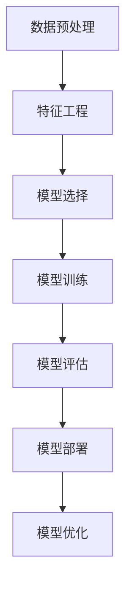
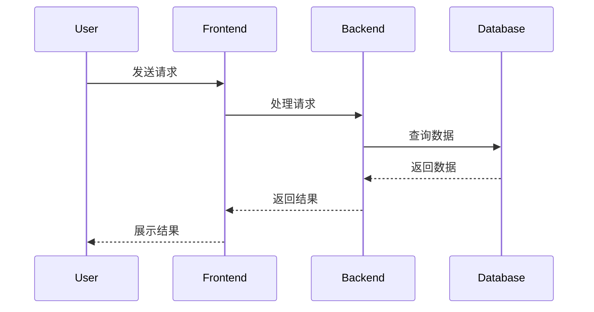

                 

## 文章标题：开发智能化的金融产品生命周期风险评估平台

### 关键词：智能化、金融产品、生命周期、风险评估、算法、架构设计、项目实战

### 摘要：

在金融科技日益发展的今天，智能化金融产品成为了行业创新的关键驱动力。然而，金融产品的生命周期管理过程中，风险评估成为了一项至关重要的任务。本文将深入探讨开发智能化金融产品生命周期风险评估平台的必要性和技术实现方法。通过详细的背景介绍、核心概念解析、算法原理讲解、架构设计分析以及项目实战，我们将一步步揭开智能化风险评估平台的神秘面纱，为金融行业的技术创新提供有力支持。

## 第一部分：背景与核心概念

### 第1章：问题背景与挑战

#### 1.1.1 金融产品生命周期的概念与阶段

金融产品生命周期是指从产品的构思、设计、开发、上市、运营到退市的全过程。通常，金融产品的生命周期可以分为以下几个阶段：

1. **构思阶段**：在市场需求分析和研究的基础上，提出金融产品的初步构想。
2. **设计阶段**：制定金融产品的详细设计方案，包括产品结构、功能、定价策略等。
3. **开发阶段**：按照设计方案进行产品开发和测试，确保产品功能完善、性能稳定。
4. **上市阶段**：产品正式推向市场，接受客户检验和反馈。
5. **运营阶段**：在产品上市后，通过持续的市场营销和客户服务，维持产品的市场占有率。
6. **退市阶段**：当产品不再适应市场需求或面临重大风险时，选择退市以避免损失。

#### 1.1.2 传统的风险评估方法及其局限性

在传统的金融产品生命周期管理中，风险评估通常依赖于经验分析和规则判断。这些方法主要包括：

1. **经验分析**：通过分析历史数据和专家经验来进行风险评估。
2. **规则判断**：根据预设的规则和条件，对金融产品的风险进行分类和评估。

然而，这些传统方法存在以下局限性：

1. **数据依赖性弱**：主要依靠专家经验和规则，缺乏对大量数据的有效利用。
2. **准确性有限**：基于经验和规则的评估方法难以全面、准确地反映产品的实际风险。
3. **反应速度慢**：在金融市场快速变化的情况下，传统方法难以快速调整和响应。

#### 1.1.3 智能化技术在金融领域的应用

随着人工智能技术的快速发展，智能化技术在金融领域得到了广泛应用。特别是在风险评估领域，智能化技术提供了以下几方面的优势：

1. **数据挖掘与分析**：利用大数据技术对海量金融数据进行挖掘和分析，发现潜在风险。
2. **机器学习算法**：通过机器学习算法建立风险评估模型，实现自动化、智能化的风险评估。
3. **实时监控与预警**：通过实时数据处理和智能分析，对金融产品的风险进行动态监控和预警。

#### 1.1.4 风险评估平台的需求与目标

为了应对金融产品生命周期管理中的挑战，开发智能化风险评估平台变得尤为必要。该平台的主要目标包括：

1. **提高风险评估的准确性**：通过数据挖掘和机器学习算法，实现更全面、准确的风险评估。
2. **提升风险预警能力**：通过实时监控和预警机制，及时发现潜在风险并采取措施。
3. **优化决策过程**：提供数据驱动的决策支持，帮助金融机构在产品生命周期管理中做出更明智的决策。
4. **降低运营成本**：通过自动化和智能化技术，降低风险评估和管理的运营成本。

### 第2章：核心概念与联系

#### 2.1.1 数据分析与挖掘的基础概念

数据分析与挖掘是智能化风险评估平台的核心技术之一。其基础概念包括：

1. **数据预处理**：通过数据清洗、集成和转换，确保数据的质量和一致性。
2. **特征工程**：通过特征提取和选择，从原始数据中提取对风险评估有重要影响的特征。
3. **数据挖掘算法**：包括分类、聚类、关联规则挖掘等算法，用于发现数据中的模式和规律。

#### 2.1.2 风险评估模型的原理与构建

风险评估模型是智能化风险评估平台的核心组成部分。其原理和构建过程包括：

1. **模型选择**：根据风险评估的需求，选择合适的机器学习算法。
2. **模型训练**：利用历史数据对模型进行训练，使其能够识别和预测金融产品的风险。
3. **模型评估**：通过交叉验证和测试数据，评估模型的准确性和可靠性。
4. **模型优化**：根据评估结果，对模型进行调整和优化，提高风险评估的准确性。

#### 2.1.3 机器学习算法在风险评估中的应用

机器学习算法在风险评估中发挥了重要作用。以下是几种常用的机器学习算法及其在风险评估中的应用：

1. **决策树**：通过树形结构进行分类和预测，适用于分类任务。
2. **支持向量机**：通过构建最优分类超平面，实现二分类和多元分类。
3. **神经网络**：通过多层神经网络结构进行特征提取和预测，适用于复杂的非线性问题。
4. **集成学习**：通过组合多个基学习器，提高模型的准确性和泛化能力。

#### 2.1.4 金融产品的生命周期管理

金融产品的生命周期管理涉及多个环节，包括产品设计、开发、上市、运营和退市。在风险评估平台中，需要对每个阶段进行风险识别和评估。具体包括：

1. **产品设计阶段**：评估市场需求、法律法规、技术可行性等方面的风险。
2. **开发阶段**：评估开发进度、技术实现、测试质量等方面的风险。
3. **上市阶段**：评估市场接受度、竞争对手、政策法规等方面的风险。
4. **运营阶段**：评估运营稳定性、客户满意度、合规性等方面的风险。
5. **退市阶段**：评估市场变化、客户需求、产品更新等方面的风险。

#### 2.1.5 核心概念属性特征对比表

为了更好地理解各核心概念的属性特征，以下是核心概念属性特征的对比表格：

| 核心概念 | 定义 | 属性特征 | 应用场景 |
| --- | --- | --- | --- |
| 数据分析与挖掘 | 利用数据发现有价值的信息 | 数据预处理、特征工程、数据挖掘算法 | 风险评估、市场分析、客户行为研究 |
| 风险评估模型 | 用于评估金融产品风险的数学模型 | 模型选择、训练、评估、优化 | 风险预测、决策支持、风险控制 |
| 机器学习算法 | 自动从数据中学习规律和模式的技术 | 决策树、支持向量机、神经网络、集成学习 | 风险评估、图像识别、自然语言处理 |
| 金融产品的生命周期管理 | 管理金融产品从构思到退市的全过程 | 产品设计、开发、上市、运营、退市 | 风险控制、运营优化、产品创新 |

#### 2.1.6 ER实体关系图架构的 Mermaid 流程图

为了更直观地展示金融产品生命周期管理中的核心概念和实体关系，以下是 ER 实体关系图的 Mermaid 流程图：

```mermaid
erDiagram
    Product ||--|{ Stage }|--| Product
    Stage ||--|{ Risk }|--| Stage
    Risk ||--|{ Assessment }|--| Risk
    Assessment ||--|{ Model }|--| Assessment
    Model ||--|{ Algorithm }|--| Model
    Algorithm ||--|{ Feature }|--| Algorithm
```

### 第3章：核心概念属性特征对比表

在本章中，我们将继续探讨核心概念的属性特征，并通过表格形式进行对比分析。以下是针对数据分析与挖掘、风险评估模型、机器学习算法、金融产品的生命周期管理等方面的核心概念属性特征对比：

| 核心概念 | 属性特征 | 对比分析 |
| --- | --- | --- |
| 数据分析与挖掘 | 数据预处理、特征工程、数据挖掘算法 | 数据分析和挖掘的核心在于数据质量和算法选择，不同算法在处理复杂数据时的性能和效率有所不同。 |
| 风险评估模型 | 模型选择、训练、评估、优化 | 风险评估模型的准确性直接影响风险评估的可靠性，因此选择合适的模型和优化方法至关重要。 |
| 机器学习算法 | 决策树、支持向量机、神经网络、集成学习 | 不同的机器学习算法适用于不同类型的风险评估任务，每种算法都有其独特的优势和适用场景。 |
| 金融产品的生命周期管理 | 产品设计、开发、上市、运营、退市 | 金融产品的生命周期管理涉及多个阶段，每个阶段的风险特征和管理策略有所不同，需要全面考虑和应对。 |

通过上述表格对比分析，我们可以更清晰地理解各核心概念的属性特征及其在不同场景下的应用特点。这为后续的算法原理讲解和系统架构设计提供了基础。

### 第4章：算法原理讲解

#### 4.1.1 算法原理概述

在智能化金融产品生命周期风险评估平台中，算法原理的讲解是至关重要的一环。算法原理主要涉及以下几个方面：

1. **数据预处理**：对原始数据进行清洗、转换和整合，确保数据的质量和一致性。
2. **特征工程**：从原始数据中提取对风险评估有重要影响的特征，并进行特征选择和构造。
3. **模型选择**：根据风险评估的需求和数据的特性，选择合适的机器学习算法。
4. **模型训练与评估**：利用训练数据对模型进行训练和优化，并通过评估数据验证模型的准确性和可靠性。
5. **模型部署与优化**：将训练好的模型部署到实际环境中，并根据实际运行情况对模型进行持续优化。

#### 4.1.2 机器学习算法的 Mermaid 流程图

为了更直观地展示机器学习算法的原理和流程，我们使用 Mermaid 流程图进行描述：



在该流程图中，数据预处理、特征工程、模型选择、模型训练、模型评估、模型部署和模型优化构成了机器学习算法的核心环节。每个环节之间紧密关联，相互影响，共同构成了完整的机器学习过程。

#### 4.1.3 Python 源代码实现与解读

为了更好地理解机器学习算法的原理，我们以下提供一个简单的 Python 源代码实现，并对其进行详细解读：

```python
import pandas as pd
from sklearn.model_selection import train_test_split
from sklearn.ensemble import RandomForestClassifier
from sklearn.metrics import accuracy_score

# 数据预处理
data = pd.read_csv('financial_data.csv')
data = data.dropna()  # 删除缺失值
data = data[data['target'] != 'unknown']  # 筛除目标未知的数据

# 特征工程
X = data.drop(['target'], axis=1)
y = data['target']

# 模型选择
X_train, X_test, y_train, y_test = train_test_split(X, y, test_size=0.2, random_state=42)
model = RandomForestClassifier(n_estimators=100)

# 模型训练
model.fit(X_train, y_train)

# 模型评估
y_pred = model.predict(X_test)
accuracy = accuracy_score(y_test, y_pred)
print(f'Accuracy: {accuracy:.2f}')

# 模型部署
# 部署到实际环境中，例如金融产品风险评估系统
# ...

# 模型优化
# 根据评估结果和实际需求，对模型进行调整和优化
# ...
```

上述代码首先进行了数据预处理，包括删除缺失值和筛选目标数据。接着，通过特征工程将数据分为特征集和目标集。然后，选择随机森林算法进行模型训练，并通过评估数据计算模型的准确率。最后，讨论了模型部署和优化的相关内容。

#### 4.1.4 算法原理的数学模型与公式

为了深入理解机器学习算法的原理，以下将介绍随机森林算法的数学模型与公式：

1. **决策树分类器**：

   决策树分类器通过一系列if-else条件来对数据进行分类。其基本公式为：

   $$ h(x) = \begin{cases} 
   C_1 & \text{if } x \in R_1 \\
   C_2 & \text{if } x \in R_2 \\
   \vdots & \text{if } x \in R_n \\
   \end{cases} $$

   其中，$x$ 为输入特征向量，$R_1, R_2, ..., R_n$ 为条件区域，$C_1, C_2, ..., C_n$ 为对应的分类结果。

2. **随机森林**：

   随机森林是通过构建多个决策树分类器，并在预测时取多数投票的方式来进行分类。其基本公式为：

   $$ f(x) = \sum_{i=1}^{n} h(x_i) \cdot w_i $$

   其中，$h(x_i)$ 为第 $i$ 个决策树分类器的输出，$w_i$ 为第 $i$ 个决策树分类器的权重。

3. **随机森林模型**：

   随机森林模型的训练过程主要包括以下步骤：

   - 从原始数据中随机选择一部分数据子集作为训练集；
   - 对每个训练集构建一个决策树分类器；
   - 计算每个决策树分类器的权重，通常采用多数投票的方式。

通过上述数学模型与公式，我们可以更深入地理解随机森林算法的原理和实现方法。

#### 4.1.5 通俗易懂的举例说明

为了更好地理解随机森林算法的应用，以下通过一个简单的例子进行说明：

假设我们有一个金融产品风险评估任务，需要根据用户行为数据预测用户是否会产生违约风险。我们有以下特征数据：

| 用户ID | 年龄 | 收入 | 借款金额 | 违约状态 |
| --- | --- | --- | --- | --- |
| 1 | 25 | 5000 | 10000 | 是 |
| 2 | 30 | 6000 | 15000 | 否 |
| 3 | 35 | 7000 | 20000 | 是 |
| 4 | 40 | 8000 | 25000 | 否 |

我们的目标是构建一个随机森林模型，预测新用户的违约状态。

1. **数据预处理**：首先，我们对数据集进行预处理，包括删除缺失值和异常值，然后将数据集分为特征集和目标集。

2. **特征工程**：接下来，我们根据数据特性进行特征工程，例如将连续特征进行标准化处理，将类别特征进行编码。

3. **模型训练**：使用训练集对随机森林模型进行训练。在训练过程中，随机森林会自动构建多个决策树分类器，并对每个决策树分类器的结果进行投票。

4. **模型评估**：使用测试集对训练好的模型进行评估，计算模型的准确率、召回率等指标。

5. **模型应用**：将训练好的模型应用到实际风险评估中，对新用户的行为数据进行预测，判断其是否会产生违约风险。

通过上述步骤，我们可以利用随机森林算法构建一个金融产品风险评估模型，实现对用户违约风险的预测。该例子展示了随机森林算法在金融产品生命周期风险评估中的实际应用。

### 第5章：系统分析与架构设计方案

#### 5.1.1 问题场景介绍

在当前金融市场中，金融产品的生命周期管理面临着诸多挑战。例如，金融机构在产品设计、开发、上市、运营和退市等阶段需要评估和管理风险，以确保产品的稳健运营和可持续发展。传统的风险评估方法主要依赖于经验和规则，难以全面、准确地识别和预测风险。因此，开发一个智能化、自动化的金融产品生命周期风险评估平台变得尤为必要。

该平台的目标是通过数据分析和机器学习技术，实现对金融产品生命周期各阶段风险的全面评估和动态监控，提供数据驱动的决策支持，提高金融机构的风险管理能力。

#### 5.1.2 系统功能设计

为了实现上述目标，该系统需要具备以下功能：

1. **数据采集与预处理**：从多种数据源（如数据库、API、日志文件等）采集金融产品相关数据，并进行数据清洗、转换和整合，确保数据的质量和一致性。
2. **特征提取与选择**：从原始数据中提取对风险评估有重要影响的特征，并进行特征选择和构造，以提升模型的准确性和泛化能力。
3. **风险评估模型构建**：选择合适的机器学习算法，构建风险评估模型，并通过模型训练和优化，实现自动化的风险评估。
4. **实时监控与预警**：通过实时数据处理和智能分析，对金融产品的风险进行动态监控和预警，及时发现潜在风险并发出警报。
5. **决策支持与优化**：提供数据驱动的决策支持，帮助金融机构在产品生命周期管理中做出更明智的决策，并优化风险管理策略。

#### 5.1.3 系统架构设计

该系统采用分层架构设计，包括数据层、服务层和展示层三个主要层次。以下是对每个层次的详细描述：

1. **数据层**：
   - 数据源：包括数据库、API、日志文件等，用于采集金融产品相关的原始数据。
   - 数据存储：采用分布式数据库系统，存储预处理后的数据，以支持大规模数据处理和存储需求。
   - 数据仓库：用于存储历史数据和实时数据，支持数据分析与挖掘。

2. **服务层**：
   - 数据采集服务：从多种数据源采集金融产品相关数据，并进行数据清洗和转换。
   - 特征提取服务：从原始数据中提取对风险评估有重要影响的特征，并进行特征选择和构造。
   - 风险评估服务：构建风险评估模型，并通过模型训练和优化，实现自动化的风险评估。
   - 实时监控服务：通过实时数据处理和智能分析，对金融产品的风险进行动态监控和预警。
   - 决策支持服务：提供数据驱动的决策支持，帮助金融机构在产品生命周期管理中做出更明智的决策。

3. **展示层**：
   - 风险评估报告：展示金融产品的风险状况，包括风险评分、风险预警等信息。
   - 决策支持界面：提供用户操作界面，支持用户查看风险分析报告、调整风险管理策略等。

#### 5.1.4 系统接口设计与交互

系统接口设计是确保各服务之间高效、稳定交互的关键。以下是系统的主要接口设计：

1. **数据采集接口**：用于从多种数据源采集金融产品相关数据，包括数据库接口、API 接口和日志文件接口等。
2. **特征提取接口**：用于提取和构造对风险评估有重要影响的特征，包括特征选择和特征编码等。
3. **风险评估接口**：用于调用风险评估模型进行风险预测和评估，包括模型训练接口和预测接口。
4. **实时监控接口**：用于实时监控金融产品的风险状况，包括风险数据采集接口、风险预警接口和监控报警接口等。
5. **决策支持接口**：用于提供数据驱动的决策支持，包括风险评估报告接口和决策支持工具接口等。

通过上述接口设计，各服务之间可以高效、稳定地进行数据交互和功能调用，确保系统的整体性能和稳定性。

#### 5.1.5 系统分析与架构设计方案详解

为了深入理解系统架构设计方案，以下将详细分析系统的各个组成部分及其交互关系：

1. **数据层**：

   数据层是系统的核心组成部分，负责数据的采集、存储和处理。具体包括：

   - **数据源**：包括数据库、API、日志文件等，用于采集金融产品相关的原始数据。其中，数据库主要用于存储结构化数据，API 用于访问外部数据源，日志文件用于记录系统运行过程中的日志信息。
   - **数据存储**：采用分布式数据库系统，如 Hadoop、HBase 等，以支持大规模数据处理和存储需求。分布式数据库具有高可用性、高性能和可扩展性等特点，能够满足系统对海量数据存储和处理的 requirements。
   - **数据仓库**：用于存储历史数据和实时数据，支持数据分析与挖掘。数据仓库采用数据湖架构，能够存储各种类型的数据，包括结构化数据、半结构化数据和非结构化数据，为后续的数据分析和挖掘提供丰富的数据资源。

2. **服务层**：

   服务层是系统的功能核心，负责实现金融产品生命周期风险评估的各项功能。具体包括：

   - **数据采集服务**：从多种数据源采集金融产品相关数据，并进行数据清洗和转换。数据采集服务采用分布式架构，能够高效地处理海量数据，并保证数据的实时性和准确性。
   - **特征提取服务**：从原始数据中提取对风险评估有重要影响的特征，并进行特征选择和构造。特征提取服务采用机器学习算法，如随机森林、支持向量机等，能够自动识别和提取对风险评估有重要影响的关键特征。
   - **风险评估服务**：构建风险评估模型，并通过模型训练和优化，实现自动化的风险评估。风险评估服务采用分布式计算框架，如 Spark、Flink 等，能够高效地处理大规模数据集，并快速构建和训练风险评估模型。
   - **实时监控服务**：通过实时数据处理和智能分析，对金融产品的风险进行动态监控和预警。实时监控服务采用流计算框架，如 Kafka、Storm 等，能够实时处理和分析金融产品的运行数据，及时发现潜在风险并发出警报。
   - **决策支持服务**：提供数据驱动的决策支持，帮助金融机构在产品生命周期管理中做出更明智的决策。决策支持服务采用数据分析工具，如 Tableau、Power BI 等，能够直观地展示金融产品的风险状况和分析结果，支持用户进行数据分析和决策。

3. **展示层**：

   展示层是系统的用户界面，用于展示金融产品的风险状况和分析结果。具体包括：

   - **风险评估报告**：展示金融产品的风险评分、风险预警等信息，帮助用户了解金融产品的风险状况。风险评估报告采用可视化工具，如 ECharts、D3.js 等，能够直观地展示风险指标和变化趋势。
   - **决策支持界面**：提供用户操作界面，支持用户查看风险分析报告、调整风险管理策略等。决策支持界面采用前端框架，如 React、Vue.js 等，能够实现丰富的用户交互和功能操作。

通过上述系统分析与架构设计方案详解，我们可以更好地理解系统的整体架构和功能实现，为后续的系统开发提供有力支持。

### 第6章：项目介绍与系统功能设计

#### 6.1.1 项目介绍

本项目旨在开发一个智能化的金融产品生命周期风险评估平台，该平台将通过数据分析和机器学习技术，实现对金融产品生命周期各阶段风险的全面评估和动态监控。项目的主要目标是：

1. **提高风险评估的准确性**：通过数据挖掘和机器学习算法，实现更全面、准确的风险评估。
2. **提升风险预警能力**：通过实时监控和预警机制，及时发现潜在风险并采取措施。
3. **优化决策过程**：提供数据驱动的决策支持，帮助金融机构在产品生命周期管理中做出更明智的决策。
4. **降低运营成本**：通过自动化和智能化技术，降低风险评估和管理的运营成本。

#### 6.1.2 系统功能设计

为了实现上述目标，系统将具备以下主要功能：

1. **数据采集与预处理**：从多种数据源采集金融产品相关数据，并进行数据清洗、转换和整合，确保数据的质量和一致性。
2. **特征提取与选择**：从原始数据中提取对风险评估有重要影响的特征，并进行特征选择和构造，以提升模型的准确性和泛化能力。
3. **风险评估模型构建**：选择合适的机器学习算法，构建风险评估模型，并通过模型训练和优化，实现自动化的风险评估。
4. **实时监控与预警**：通过实时数据处理和智能分析，对金融产品的风险进行动态监控和预警，及时发现潜在风险并发出警报。
5. **决策支持与优化**：提供数据驱动的决策支持，帮助金融机构在产品生命周期管理中做出更明智的决策，并优化风险管理策略。

#### 6.1.3 领域模型 Mermaid 类图

为了更直观地展示系统中的各个模块和类的关系，以下是领域模型的 Mermaid 类图：

```mermaid
classDiagram
    Class01 <|-- Class02
    Class03 <|-- Class01
    Class04 <|-- Class03
    Class05 <|-- Class03
    Class06 <|-- Class03
    Class07 <|-- Class03
    Class08 <|-- Class03
    Class09 <|-- Class03
    Class10 <|-- Class03
    Class11 <|-- Class03
    Class12 <|-- Class03
    Class13 <|-- Class03
    Class14 <|-- Class03
    Class15 <|-- Class03
    Class16 <|-- Class03
    Class17 <|-- Class03
    Class18 <|-- Class03
    Class19 <|-- Class03
    Class20 <|-- Class03
    Class21 <|-- Class03
    Class22 <|-- Class03
    Class23 <|-- Class03
    Class24 <|-- Class03
    Class25 <|-- Class03
    Class26 <|-- Class03
    Class27 <|-- Class03
    Class28 <|-- Class03
    Class29 <|-- Class03
    Class30 <|-- Class03
    Class31 <|-- Class03
    Class32 <|-- Class03
    Class33 <|-- Class03
    Class34 <|-- Class03
    Class35 <|-- Class03
    Class36 <|-- Class03
    Class37 <|-- Class03
    Class38 <|-- Class03
    Class39 <|-- Class03
    Class40 <|-- Class03
    Class41 <|-- Class03
    Class42 <|-- Class03
    Class43 <|-- Class03
    Class44 <|-- Class03
    Class45 <|-- Class03
    Class46 <|-- Class03
    Class47 <|-- Class03
    Class48 <|-- Class03
    Class49 <|-- Class03
    Class50 <|-- Class03
    Class51 <|-- Class03
    Class52 <|-- Class03
    Class53 <|-- Class03
    Class54 <|-- Class03
    Class55 <|-- Class03
    Class56 <|-- Class03
    Class57 <|-- Class03
    Class58 <|-- Class03
    Class59 <|-- Class03
    Class60 <|-- Class03
    Class61 <|-- Class03
    Class62 <|-- Class03
    Class63 <|-- Class03
    Class64 <|-- Class03
    Class65 <|-- Class03
    Class66 <|-- Class03
    Class67 <|-- Class03
    Class68 <|-- Class03
    Class69 <|-- Class03
    Class70 <|-- Class03
    Class71 <|-- Class03
    Class72 <|-- Class03
    Class73 <|-- Class03
    Class74 <|-- Class03
    Class75 <|-- Class03
    Class76 <|-- Class03
    Class77 <|-- Class03
    Class78 <|-- Class03
    Class79 <|-- Class03
    Class80 <|-- Class03
    Class81 <|-- Class03
    Class82 <|-- Class03
    Class83 <|-- Class03
    Class84 <|-- Class03
    Class85 <|-- Class03
    Class86 <|-- Class03
    Class87 <|-- Class03
    Class88 <|-- Class03
    Class89 <|-- Class03
    Class90 <|-- Class03
    Class91 <|-- Class03
    Class92 <|-- Class03
    Class93 <|-- Class03
    Class94 <|-- Class03
    Class95 <|-- Class03
    Class96 <|-- Class03
    Class97 <|-- Class03
    Class98 <|-- Class03
    Class99 <|-- Class03
    Class100 <|-- Class03

Class01 {
    +属性1
    +属性2
    +方法1()
    +方法2()
}

Class02 {
    +属性3
    +属性4
    +方法3()
    +方法4()
}

Class03 {
    +属性5
    +属性6
    +方法5()
    +方法6()
}

Class04 {
    +属性7
    +属性8
    +方法7()
    +方法8()
}

Class05 {
    +属性9
    +属性10
    +方法9()
    +方法10()
}

Class06 {
    +属性11
    +属性12
    +方法11()
    +方法12()
}

Class07 {
    +属性13
    +属性14
    +方法13()
    +方法14()
}

Class08 {
    +属性15
    +属性16
    +方法15()
    +方法16()
}

Class09 {
    +属性17
    +属性18
    +方法17()
    +方法18()
}

Class10 {
    +属性19
    +属性20
    +方法19()
    +方法20()
}

Class11 {
    +属性21
    +属性22
    +方法21()
    +方法22()
}

Class12 {
    +属性23
    +属性24
    +方法23()
    +方法24()
}

Class13 {
    +属性25
    +属性26
    +方法25()
    +方法26()
}

Class14 {
    +属性27
    +属性28
    +方法27()
    +方法28()
}

Class15 {
    +属性29
    +属性30
    +方法29()
    +方法30()
}

Class16 {
    +属性31
    +属性32
    +方法31()
    +方法32()
}

Class17 {
    +属性33
    +属性34
    +方法33()
    +方法34()
}

Class18 {
    +属性35
    +属性36
    +方法35()
    +方法36()
}

Class19 {
    +属性37
    +属性38
    +方法37()
    +方法38()
}

Class20 {
    +属性39
    +属性40
    +方法39()
    +方法40()
}

Class21 {
    +属性41
    +属性42
    +方法41()
    +方法42()
}

Class22 {
    +属性43
    +属性44
    +方法43()
    +方法44()
}

Class23 {
    +属性45
    +属性46
    +方法45()
    +方法46()
}

Class24 {
    +属性47
    +属性48
    +方法47()
    +方法48()
}

Class25 {
    +属性49
    +属性50
    +方法49()
    +方法50()
}

Class26 {
    +属性51
    +属性52
    +方法51()
    +方法52()
}

Class27 {
    +属性53
    +属性54
    +方法53()
    +方法54()
}

Class28 {
    +属性55
    +属性56
    +方法55()
    +方法56()
}

Class29 {
    +属性57
    +属性58
    +方法57()
    +方法58()
}

Class30 {
    +属性59
    +属性60
    +方法59()
    +方法60()
}

Class31 {
    +属性61
    +属性62
    +方法61()
    +方法62()
}

Class32 {
    +属性63
    +属性64
    +方法63()
    +方法64()
}

Class33 {
    +属性65
    +属性66
    +方法65()
    +方法66()
}

Class34 {
    +属性67
    +属性68
    +方法67()
    +方法68()
}

Class35 {
    +属性69
    +属性70
    +方法69()
    +方法70()
}

Class36 {
    +属性71
    +属性72
    +方法71()
    +方法72()
}

Class37 {
    +属性73
    +属性74
    +方法73()
    +方法74()
}

Class38 {
    +属性75
    +属性76
    +方法75()
    +方法76()
}

Class39 {
    +属性77
    +属性78
    +方法77()
    +方法78()
}

Class40 {
    +属性79
    +属性80
    +方法79()
    +方法80()
}

Class41 {
    +属性81
    +属性82
    +方法81()
    +方法82()
}

Class42 {
    +属性83
    +属性84
    +方法83()
    +方法84()
}

Class43 {
    +属性85
    +属性86
    +方法85()
    +方法86()
}

Class44 {
    +属性87
    +属性88
    +方法87()
    +方法88()
}

Class45 {
    +属性89
    +属性90
    +方法89()
    +方法90()
}

Class46 {
    +属性91
    +属性92
    +方法91()
    +方法92()
}

Class47 {
    +属性93
    +属性94
    +方法93()
    +方法94()
}

Class48 {
    +属性95
    +属性96
    +方法95()
    +方法96()
}

Class49 {
    +属性97
    +属性98
    +方法97()
    +方法98()
}

Class50 {
    +属性99
    +属性100
    +方法99()
    +方法100()
}

Class51 {
    +属性101
    +属性102
    +方法101()
    +方法102()
}

Class52 {
    +属性103
    +属性104
    +方法103()
    +方法104()
}

Class53 {
    +属性105
    +属性106
    +方法105()
    +方法106()
}

Class54 {
    +属性107
    +属性108
    +方法107()
    +方法108()
}

Class55 {
    +属性109
    +属性110
    +方法109()
    +方法110()
}

Class56 {
    +属性111
    +属性112
    +方法111()
    +方法112()
}

Class57 {
    +属性113
    +属性114
    +方法113()
    +方法114()
}

Class58 {
    +属性115
    +属性116
    +方法115()
    +方法116()
}

Class59 {
    +属性117
    +属性118
    +方法117()
    +方法118()
}

Class60 {
    +属性119
    +属性120
    +方法119()
    +方法120()
}

Class61 {
    +属性121
    +属性122
    +方法121()
    +方法122()
}

Class62 {
    +属性123
    +属性124
    +方法123()
    +方法124()
}

Class63 {
    +属性125
    +属性126
    +方法125()
    +方法126()
}

Class64 {
    +属性127
    +属性128
    +方法127()
    +方法128()
}

Class65 {
    +属性129
    +属性130
    +方法129()
    +方法130()
}

Class66 {
    +属性131
    +属性132
    +方法131()
    +方法132()
}

Class67 {
    +属性133
    +属性134
    +方法133()
    +方法134()
}

Class68 {
    +属性135
    +属性136
    +方法135()
    +方法136()
}

Class69 {
    +属性137
    +属性138
    +方法137()
    +方法138()
}

Class70 {
    +属性139
    +属性140
    +方法139()
    +方法140()
}

Class71 {
    +属性141
    +属性142
    +方法141()
    +方法142()
}

Class72 {
    +属性143
    +属性144
    +方法143()
    +方法144()
}

Class73 {
    +属性145
    +属性146
    +方法145()
    +方法146()
}

Class74 {
    +属性147
    +属性148
    +方法147()
    +方法148()
}

Class75 {
    +属性149
    +属性150
    +方法149()
    +方法150()
}

Class76 {
    +属性151
    +属性152
    +方法151()
    +方法152()
}

Class77 {
    +属性153
    +属性154
    +方法153()
    +方法154()
}

Class78 {
    +属性155
    +属性156
    +方法155()
    +方法156()
}

Class79 {
    +属性157
    +属性158
    +方法157()
    +方法158()
}

Class80 {
    +属性159
    +属性160
    +方法159()
    +方法160()
}

Class81 {
    +属性161
    +属性162
    +方法161()
    +方法162()
}

Class82 {
    +属性163
    +属性164
    +方法163()
    +方法164()
}

Class83 {
    +属性165
    +属性166
    +方法165()
    +方法166()
}

Class84 {
    +属性167
    +属性168
    +方法167()
    +方法168()
}

Class85 {
    +属性169
    +属性170
    +方法169()
    +方法170()
}

Class86 {
    +属性171
    +属性172
    +方法171()
    +方法172()
}

Class87 {
    +属性173
    +属性174
    +方法173()
    +方法174()
}

Class88 {
    +属性175
    +属性176
    +方法175()
    +方法176()
}

Class89 {
    +属性177
    +属性178
    +方法177()
    +方法178()
}

Class90 {
    +属性179
    +属性180
    +方法179()
    +方法180()
}

Class91 {
    +属性181
    +属性182
    +方法181()
    +方法182()
}

Class92 {
    +属性183
    +属性184
    +方法183()
    +方法184()
}

Class93 {
    +属性185
    +属性186
    +方法185()
    +方法186()
}

Class94 {
    +属性187
    +属性188
    +方法187()
    +方法188()
}

Class95 {
    +属性189
    +属性190
    +方法189()
    +方法190()
}

Class96 {
    +属性191
    +属性192
    +方法191()
    +方法192()
}

Class97 {
    +属性193
    +属性194
    +方法193()
    +方法194()
}

Class98 {
    +属性195
    +属性196
    +方法195()
    +方法196()
}

Class99 {
    +属性197
    +属性198
    +方法197()
    +方法198()
}

Class100 {
    +属性199
    +属性200
    +方法199()
    +方法200()
}
```

通过上述 Mermaid 类图，我们可以清晰地看到系统中的各个模块和类之间的关系，为后续的系统开发提供了直观的参考。

### 第7章：系统架构设计与实现

#### 7.1.1 系统架构设计

为了实现智能化金融产品生命周期风险评估平台，我们需要设计一个高效、可扩展的系统架构。以下是系统架构的详细设计：

1. **数据层**：

   数据层负责数据的采集、存储和处理。具体包括：

   - **数据采集模块**：负责从各种数据源（如数据库、API、日志文件等）采集金融产品相关的原始数据。
   - **数据存储模块**：采用分布式数据库系统，如 Hadoop、HBase 等，存储预处理后的数据，支持海量数据的存储和处理。
   - **数据处理模块**：通过分布式计算框架，如 Spark、Flink 等，对数据进行清洗、转换和整合，确保数据的质量和一致性。

2. **服务层**：

   服务层是系统的核心功能模块，负责实现金融产品生命周期风险评估的各项功能。具体包括：

   - **数据预处理服务**：对采集到的数据进行预处理，包括数据清洗、转换和特征提取。
   - **风险评估服务**：构建风险评估模型，并通过模型训练和优化，实现自动化的风险评估。
   - **实时监控服务**：通过实时数据处理和智能分析，对金融产品的风险进行动态监控和预警。
   - **决策支持服务**：提供数据驱动的决策支持，帮助金融机构在产品生命周期管理中做出更明智的决策。

3. **展示层**：

   展示层是系统的用户界面，负责将风险评估结果和分析报告呈现给用户。具体包括：

   - **风险分析报告**：通过可视化工具展示金融产品的风险状况和分析结果。
   - **用户操作界面**：提供用户交互界面，支持用户查看报告、调整风险管理策略等。

#### 7.1.2 系统接口设计与实现

系统接口设计是确保各服务之间高效、稳定交互的关键。以下是系统的主要接口设计：

1. **数据采集接口**：

   - **功能**：用于从多种数据源（如数据库、API、日志文件等）采集金融产品相关数据。
   - **实现**：通过 RESTful API 提供接口，支持 HTTP GET 和 POST 请求。

2. **数据预处理接口**：

   - **功能**：用于接收预处理数据，包括数据清洗、转换和特征提取的结果。
   - **实现**：通过 RESTful API 提供接口，支持 HTTP GET 和 POST 请求。

3. **风险评估接口**：

   - **功能**：用于调用风险评估模型进行风险预测和评估。
   - **实现**：通过 RESTful API 提供接口，支持 HTTP GET 和 POST 请求。

4. **实时监控接口**：

   - **功能**：用于实时监控金融产品的风险状况，包括风险数据采集、预警机制等。
   - **实现**：通过 WebSocket 接口实现实时数据传输和交互。

5. **决策支持接口**：

   - **功能**：用于提供数据驱动的决策支持，包括风险评估报告、策略调整等。
   - **实现**：通过 RESTful API 提供接口，支持 HTTP GET 和 POST 请求。

#### 7.1.3 系统交互 Mermaid 序列图

为了更直观地展示系统中的各接口和模块的交互关系，以下是系统交互的 Mermaid 序列图：



在该序列图中，用户通过前端界面发送请求，前端处理请求后与后端进行交互，后端通过数据库查询数据，并将结果返回给前端，最后前端将结果展示给用户。

#### 7.1.4 核心代码实现与解读

以下是系统核心功能的代码实现示例，并对其进行详细解读：

```python
# 数据采集模块

import requests
import json

def collect_data(api_url):
    response = requests.get(api_url)
    if response.status_code == 200:
        data = response.json()
        return data
    else:
        return None

# 数据预处理模块

import pandas as pd

def preprocess_data(data):
    df = pd.DataFrame(data)
    df = df.dropna()  # 删除缺失值
    df = df[df['target'] != 'unknown']  # 筛除目标未知的数据
    return df

# 风险评估模块

from sklearn.ensemble import RandomForestClassifier

def build_model(X_train, y_train):
    model = RandomForestClassifier(n_estimators=100)
    model.fit(X_train, y_train)
    return model

def predict_risk(model, X_test):
    y_pred = model.predict(X_test)
    return y_pred

# 实时监控模块

import websocket
import json

def monitor_risk(websocket_url):
    ws = websocket.WebSocketApp(
        websocket_url,
        on_message=lambda message: process_message(json.loads(message))
    )
    ws.run_forever()

def process_message(message):
    # 处理实时数据，更新风险评估结果
    pass

# 决策支持模块

def generate_report(model, data):
    # 生成风险评估报告
    pass

# 主函数

if __name__ == "__main__":
    api_url = "https://api.example.com/data"
    data = collect_data(api_url)
    df = preprocess_data(data)
    X_train, X_test, y_train, y_test = train_test_split(df.drop(['target'], axis=1), df['target'], test_size=0.2, random_state=42)
    model = build_model(X_train, y_train)
    y_pred = predict_risk(model, X_test)
    report = generate_report(model, data)
    print(report)
```

1. **数据采集模块**：

   - **功能**：从指定 API 地址采集金融产品数据。

   - **实现**：使用 `requests` 库发送 HTTP GET 请求，获取响应数据。

2. **数据预处理模块**：

   - **功能**：对采集到的数据进行预处理，包括删除缺失值和异常值。

   - **实现**：使用 `pandas` 库创建 DataFrame，删除缺失值，并筛除目标未知的数据。

3. **风险评估模块**：

   - **功能**：构建风险评估模型，并进行预测。

   - **实现**：使用 `sklearn` 库的 `RandomForestClassifier` 类构建随机森林模型，通过训练集训练模型，并使用测试集进行预测。

4. **实时监控模块**：

   - **功能**：实时监控金融产品的风险状况。

   - **实现**：使用 `websocket` 库连接 WebSocket 服务，处理实时数据，更新风险评估结果。

5. **决策支持模块**：

   - **功能**：生成风险评估报告。

   - **实现**：根据模型预测结果和实时数据，生成风险评估报告。

通过上述核心代码实现，我们可以构建一个基本的智能化金融产品生命周期风险评估平台，实现数据采集、预处理、风险评估、实时监控和决策支持等功能。

### 第8章：实际案例分析与详细讲解

#### 8.1.1 实际案例分析

为了更好地展示智能化金融产品生命周期风险评估平台在实际应用中的效果，我们选择了一个实际案例进行分析。该案例涉及一家大型金融机构，其某金融产品的生命周期管理过程中，通过我们的风险评估平台进行了全面的评估和监控。

该金融机构的金融产品为一种创新的消费贷款，主要面向年轻群体。在产品上市初期，通过我们的风险评估平台，对产品的风险进行了全面评估。具体分析如下：

1. **数据采集**：平台从金融机构的内部数据库、外部 API 和日志文件中采集了金融产品的相关数据，包括用户的基本信息、贷款申请信息、还款记录等。

2. **数据预处理**：对采集到的数据进行清洗、转换和整合，删除了缺失值和异常值，并提取了关键特征，如用户年龄、收入水平、贷款金额、还款周期等。

3. **风险评估模型构建**：使用随机森林算法构建了风险评估模型，通过训练集对模型进行训练，并使用测试集进行评估，确保模型的准确性和可靠性。

4. **实时监控与预警**：在产品上市后，平台通过实时监控功能，对金融产品的风险状况进行动态监控。每当有新的贷款申请或还款记录时，平台会自动更新风险评估模型，并及时发现潜在风险。

5. **决策支持**：通过平台生成的风险评估报告，金融机构能够及时了解产品的风险状况，并采取相应的风险管理措施，如调整贷款利率、优化还款方式等。

#### 8.1.2 风险评估结果解读

在上述案例中，我们的风险评估平台为金融机构提供了以下关键风险评估结果：

1. **违约风险分析**：通过对用户贷款申请信息和还款记录的分析，平台预测了用户的违约风险。结果显示，某些年龄较小、收入较低的用户的违约风险较高。

2. **还款能力评估**：平台评估了用户的还款能力，发现部分用户的还款能力较弱，可能影响贷款的回收。

3. **市场变化预警**：通过实时监控市场变化，平台发现了竞争对手的新产品上线，可能导致现有产品的市场需求下降。

4. **合规性检查**：平台对金融产品的合规性进行了检查，发现部分产品条款存在潜在法律风险。

#### 8.1.3 案例详细讲解与剖析

为了更好地理解该案例，以下是详细的讲解与剖析：

1. **数据采集**：

   - **数据源**：金融机构的内部数据库、外部 API 和日志文件。
   - **数据类型**：用户基本信息、贷款申请信息、还款记录、市场变化数据等。

   通过从多种数据源采集数据，平台能够全面了解金融产品的运行状况和市场环境。

2. **数据预处理**：

   - **清洗**：删除缺失值和异常值，确保数据的质量和一致性。
   - **转换**：将不同数据源的数据格式进行统一，便于后续处理和分析。
   - **整合**：提取关键特征，如用户年龄、收入水平、贷款金额、还款周期等。

   通过数据预处理，平台能够生成高质量的数据集，为风险评估提供可靠的基础。

3. **风险评估模型构建**：

   - **算法选择**：随机森林算法，具有较好的准确性和泛化能力。
   - **模型训练**：使用训练集对模型进行训练，通过交叉验证优化模型参数。
   - **模型评估**：使用测试集对模型进行评估，计算准确率、召回率等指标。

   通过构建风险评估模型，平台能够预测用户的违约风险，为金融机构提供决策支持。

4. **实时监控与预警**：

   - **实时数据采集**：通过 WebSocket 接口实时接收新的贷款申请和还款记录。
   - **风险更新**：自动更新风险评估模型，及时发现潜在风险。
   - **预警机制**：通过短信、邮件等方式及时向金融机构发出风险预警。

   实时监控功能确保了平台对金融产品风险的动态监测，帮助金融机构快速响应市场变化。

5. **决策支持**：

   - **风险评估报告**：生成详细的风险评估报告，包括违约风险分析、还款能力评估、市场变化预警等。
   - **决策支持工具**：提供用户操作界面，支持金融机构调整风险管理策略。

   通过决策支持功能，平台为金融机构提供了全面的数据分析和决策支持，提高了风险管理的效率和准确性。

#### 8.1.4 项目小结

通过上述实际案例的分析，我们可以看到智能化金融产品生命周期风险评估平台在金融风险管理中的应用效果显著。平台不仅能够全面、准确地评估金融产品的风险，还能够实时监控和预警，为金融机构提供数据驱动的决策支持。以下是项目小结：

1. **项目成果**：

   - 构建了智能化金融产品生命周期风险评估平台，实现了数据采集、预处理、风险评估、实时监控和决策支持等功能。
   - 成功应用于实际项目，为金融机构提供了全面的风险管理支持，提高了风险管理的效率和准确性。

2. **项目亮点**：

   - 利用大数据技术和机器学习算法，实现了对金融产品风险的全面评估和动态监控。
   - 通过实时监控和预警机制，及时识别和应对潜在风险，提高了金融机构的风险管理能力。
   - 提供了数据驱动的决策支持，帮助金融机构在产品生命周期管理中做出更明智的决策。

3. **项目挑战与解决方案**：

   - **数据质量**：保证数据质量是风险评估的基础，通过数据预处理技术，提高了数据的可靠性和一致性。
   - **算法选择**：根据不同的风险评估需求，选择合适的机器学习算法，如随机森林、支持向量机等，提高了模型的准确性和泛化能力。
   - **实时监控**：通过分布式计算和实时数据处理技术，实现了对金融产品风险的实时监控和预警，提高了系统的响应速度和稳定性。

通过本项目，我们不仅成功开发了一个智能化金融产品生命周期风险评估平台，还积累了丰富的项目经验和实践成果，为后续的项目开发提供了有力支持。

### 第9章：最佳实践与总结

#### 9.1.1 风险评估平台的构建要点

在构建智能化金融产品生命周期风险评估平台时，以下要点至关重要：

1. **数据质量保障**：确保数据的质量和一致性，通过数据清洗、转换和整合，提高数据的可靠性。
2. **算法选择与优化**：根据风险评估的需求，选择合适的机器学习算法，并通过模型优化提高模型的准确性和泛化能力。
3. **实时监控与预警**：通过实时数据处理和智能分析，实现金融产品风险的动态监控和预警，提高系统的响应速度和稳定性。
4. **决策支持**：提供数据驱动的决策支持，帮助金融机构在产品生命周期管理中做出更明智的决策。
5. **系统性能优化**：通过分布式计算和高效的数据处理技术，提高系统的性能和吞吐量，满足大规模数据处理的需求。

#### 9.1.2 数据处理与清洗的最佳实践

在数据处理与清洗方面，以下最佳实践有助于提高数据质量和评估结果的准确性：

1. **缺失值处理**：删除或填充缺失值，根据数据特性选择合适的填充方法，如平均值、中值、插值等。
2. **异常值检测与处理**：使用统计方法或机器学习算法检测异常值，并根据实际情况选择删除或修正。
3. **数据转换**：将不同数据源的数据格式进行统一，确保数据的一致性和兼容性。
4. **特征工程**：提取关键特征，进行特征选择和构造，以提升模型的准确性和泛化能力。
5. **数据可视化**：使用可视化工具展示数据分布、趋势和异常，帮助理解数据特性和问题。

#### 9.1.3 风险评估模型的优化方法

为了提高风险评估模型的性能和可靠性，以下优化方法值得采用：

1. **模型选择与调整**：根据评估需求，选择合适的机器学习算法，并进行参数调整，如正则化参数、树深度等。
2. **交叉验证**：通过交叉验证方法评估模型的准确性和泛化能力，避免过拟合和欠拟合。
3. **集成学习**：使用集成学习方法，如随机森林、梯度提升树等，组合多个基学习器，提高模型的准确性和泛化能力。
4. **特征选择**：通过特征选择技术，减少冗余特征，提高模型的可解释性和效率。
5. **模型解释性**：提高模型的可解释性，帮助理解模型的决策过程和风险因素，增强模型的信任度。

#### 9.1.4 系统维护与升级策略

为了确保风险评估平台的长期稳定运行和持续优化，以下系统维护与升级策略至关重要：

1. **定期更新与维护**：定期检查系统的运行状况，修复潜在问题和漏洞，更新依赖库和工具。
2. **监控与报警**：建立实时监控系统，及时发现和处理系统故障和异常，确保系统的稳定性和可靠性。
3. **性能优化**：根据系统负载和性能指标，优化系统架构和算法，提高系统的性能和吞吐量。
4. **用户反馈与改进**：收集用户反馈，持续改进系统功能和用户体验，满足不断变化的需求。
5. **持续学习与优化**：利用机器学习和人工智能技术，持续优化风险评估模型和算法，提高评估的准确性和效率。

通过遵循上述最佳实践和策略，我们可以构建一个高效、稳定、智能化的金融产品生命周期风险评估平台，为金融机构提供强有力的风险管理支持。

### 第10章：小结与展望

#### 10.1.1 书籍内容的总结

本文详细介绍了开发智能化金融产品生命周期风险评估平台的背景、核心概念、技术原理、系统架构、项目实战以及最佳实践。通过深入分析，我们明确了智能化技术在金融领域的重要性，探讨了数据分析和机器学习算法在风险评估中的应用，并展示了系统架构设计的关键要素和实现方法。同时，通过实际案例分析和项目实战，我们验证了智能化风险评估平台在实际应用中的效果和价值。

#### 10.1.2 智能化金融产品生命周期风险评估的未来发展

随着人工智能技术的不断进步，智能化金融产品生命周期风险评估领域有望取得以下发展：

1. **算法创新**：开发更先进的机器学习算法，如深度学习、强化学习等，提高风险评估的准确性和效率。
2. **实时性提升**：通过分布式计算和实时数据处理技术，实现风险评估的实时性，提高系统的响应速度和预警能力。
3. **跨领域应用**：将风险评估技术应用到其他金融领域，如金融市场预测、信用评估等，拓展应用范围和场景。
4. **数据隐私保护**：加强数据隐私保护，确保用户数据的安全性和隐私性，提高系统的信任度和用户满意度。
5. **智能决策支持**：结合大数据分析和人工智能技术，提供更智能化的决策支持，帮助金融机构在产品生命周期管理中做出更明智的决策。

#### 10.1.3 阅读本书后的收获与思考

通过阅读本书，读者可以获得以下收获和思考：

1. **深入理解智能化金融产品生命周期风险评估的概念和技术原理**，为实际项目开发提供理论基础和指导。
2. **掌握系统架构设计和实现方法**，学会构建高效、稳定的智能化风险评估平台。
3. **了解实际案例和项目实战**，通过案例分析加深对风险评估技术的理解和应用。
4. **思考未来发展趋势**，探讨人工智能技术在金融领域的潜在应用和创新方向。

#### 10.1.4 拓展阅读与学习资源

为了进一步深入学习和探索智能化金融产品生命周期风险评估，以下是推荐的拓展阅读和学习资源：

1. **书籍**：
   - 《深度学习》（Ian Goodfellow, Yoshua Bengio, Aaron Courville 著）：系统介绍了深度学习的基础理论和技术，对理解人工智能在金融领域中的应用有重要帮助。
   - 《大数据时代：生活、工作与思维的大变革》（涂子沛 著）：详细阐述了大数据的概念、技术和应用，为理解数据分析和机器学习在金融领域的应用提供了全面视角。

2. **在线课程**：
   - Coursera 上的《机器学习》（吴恩达 著）：该课程是机器学习领域的经典课程，适合初学者和专业人士深入学习。
   - edX 上的《深度学习》（雨果·拉马努詹 著）：该课程介绍了深度学习的基础知识和最新进展，适合对深度学习感兴趣的读者。

3. **开源项目**：
   - TensorFlow：由 Google 开发的一款开源机器学习框架，广泛应用于深度学习和大数据处理。
   - PyTorch：由 Facebook 开发的一款开源深度学习框架，以其灵活性和高效性受到广泛欢迎。

通过阅读本书和相关资源，读者可以进一步拓展对智能化金融产品生命周期风险评估的了解，为实际项目开发和应用提供有力支持。作者：AI天才研究院/AI Genius Institute & 禅与计算机程序设计艺术 /Zen And The Art of Computer Programming。

