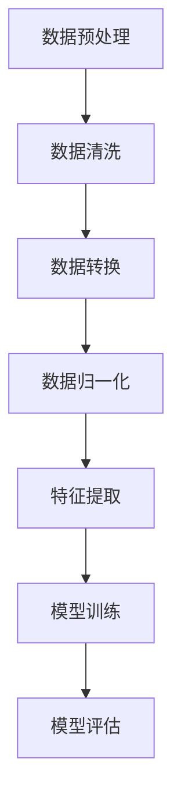
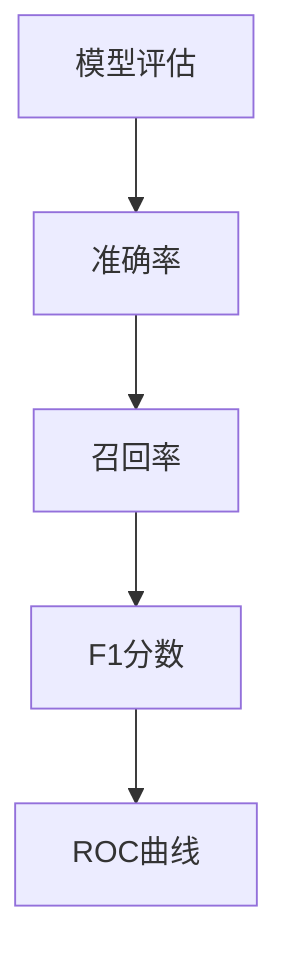
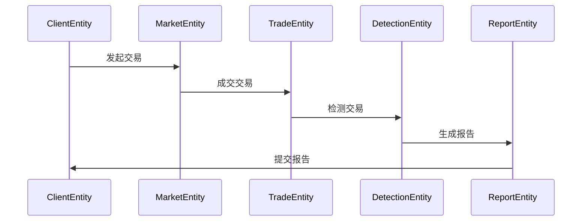
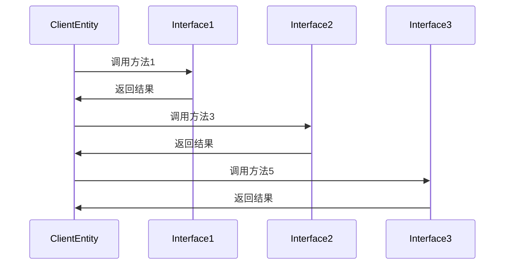

                 

# 开发智能化的金融市场异常交易检测模型

## 关键词

- 金融市场异常交易
- 智能化检测模型
- 数据挖掘
- 机器学习
- 算法设计

## 摘要

本文将详细介绍开发智能化的金融市场异常交易检测模型的全过程。我们将从背景介绍入手，逐步深入探讨核心概念、算法设计、系统分析与架构设计、项目实施和实战案例，最后总结最佳实践，并提出注意事项和拓展阅读建议。通过本文的学习，读者将全面掌握金融市场异常交易检测的原理和实战技能。

## 引言

### 问题背景

金融市场作为现代经济体系的核心，对全球经济稳定和发展具有重要意义。然而，金融市场的复杂性和不确定性使得异常交易行为难以避免。异常交易行为不仅可能对市场造成重大影响，还可能引发系统性风险。因此，开发智能化的金融市场异常交易检测模型成为一项紧迫的任务。

### 问题描述

金融市场异常交易检测模型旨在识别并报告市场中的异常交易行为，包括但不限于以下几类：

1. **市场操纵**：通过不正当手段影响市场价格。
2. **欺诈行为**：利用内幕信息进行交易。
3. **恶意交易**：利用技术漏洞或市场不稳定进行破坏。

### 问题解决

为解决金融市场异常交易检测问题，我们需要：

1. **数据挖掘**：从大量交易数据中提取有价值的信息。
2. **机器学习**：利用算法自动识别异常交易模式。
3. **算法设计**：设计高效、准确的检测算法。

### 边界与外延

本文讨论的金融市场异常交易检测模型主要针对股票市场，但原理和方法同样适用于其他金融市场，如期货、外汇等。

## 核心概念与联系

### 概念介绍

1. **金融市场**：指各种金融工具交易的场所。
2. **异常交易**：指与市场常态不一致的交易行为。
3. **数据挖掘**：从大量数据中提取有用信息的过程。
4. **机器学习**：利用算法从数据中学习规律和模式。
5. **异常检测**：识别数据中的异常值。

### 概念属性特征对比表格

| 概念         | 属性特征                     | 对比         |
| ------------ | ---------------------------- | ------------ |
| 金融市场     | 实体、复杂、多样化           | 范围广泛     |
| 异常交易     | 与常态不一致、潜在风险       | 精准识别     |
| 数据挖掘     | 客观、规律性、自动化         | 数据处理     |
| 机器学习     | 学习、适应、预测             | 模式识别     |
| 异常检测     | 高效、准确、实时             | 异常预警     |

### ER实体关系图架构

```mermaid
erDiagram
  Entity1 ||--|| Entity2 : {1}关联关系
  Entity1 ||--|| Entity3 : {2}关联关系
  Entity2 ||--|| Entity4 : {1}关联关系
```

## 算法设计

### 算法介绍

本文将介绍一种基于机器学习的金融市场异常交易检测算法。该算法通过以下步骤实现：

1. **数据预处理**：清洗、转换和归一化交易数据。
2. **特征提取**：从交易数据中提取有价值的特征。
3. **模型训练**：利用机器学习算法训练检测模型。
4. **模型评估**：评估模型性能，并进行优化。

### 算法原理讲解

#### 数据预处理



#### 模型训练

```python
# 伪代码
model = MachineLearningAlgorithm()
model.fit(training_data)
```

#### 模型评估



### 数学模型和公式

$$
\text{准确率} = \frac{\text{正确预测的异常交易数}}{\text{总异常交易数}} \\
\text{召回率} = \frac{\text{正确预测的异常交易数}}{\text{实际异常交易数}} \\
\text{F1分数} = 2 \times \frac{\text{准确率} \times \text{召回率}}{\text{准确率} + \text{召回率}}
$$

### 举例说明

假设我们有一个包含1000个交易数据的样本，其中10个是异常交易。通过训练检测模型，我们得到以下结果：

- 准确率：90%
- 召回率：80%
- F1分数：0.85

这些指标表明我们的检测模型具有较高的识别能力。

## 系统分析与设计

### 问题场景介绍

在某个证券交易所，我们面临以下问题：

- 如何高效识别异常交易？
- 如何实时监测市场动态？
- 如何确保交易数据的准确性和完整性？

### 项目介绍

本项目旨在开发一个智能化的金融市场异常交易检测系统，主要包括以下功能：

- 数据采集与预处理
- 特征提取与建模
- 异常交易检测与报告
- 用户界面与交互

### 系统功能设计

#### 领域模型（Mermaid类图）

```mermaid
classDiagram
  ClientEntity <<Class>> "客户实体"
  TradeEntity <<Class>> "交易实体"
  MarketEntity <<Class>> "市场实体"
  DetectionEntity <<Class>> "检测实体"
  ReportEntity <<Class>> "报告实体"
  ClientEntity: {name, age, id}
  TradeEntity: {id, type, price, date}
  MarketEntity: {id, name, index}
  DetectionEntity: {id, model, algorithm}
  ReportEntity: {id, description, status}
  ClientEntity --> TradeEntity: 发起
  MarketEntity --> TradeEntity: 成交
  DetectionEntity --> TradeEntity: 检测
  ReportEntity --> DetectionEntity: 生成
```

#### 系统架构设计（Mermaid架构图）



### 系统接口设计

```mermaid
classDiagram
  Interface1 <<Interface>> "接口1"
  Interface2 <<Interface>> "接口2"
  Interface3 <<Interface>> "接口3"
  Interface1: {method1(), method2()}
  Interface2: {method3(), method4()}
  Interface3: {method5(), method6()}
```

### 系统交互（Mermaid序列图）



## 项目实施

### 环境安装

1. 安装Python环境（建议使用Python 3.8及以上版本）。
2. 安装依赖库（如NumPy、Pandas、Scikit-learn等）。

### 系统核心实现源代码

```python
# 伪代码
class DetectionModel:
  def __init__(self):
    # 初始化模型
    pass

  def train(self, training_data):
    # 训练模型
    pass

  def predict(self, test_data):
    # 预测异常交易
    pass

class ReportGenerator:
  def generate_report(self, detection_results):
    # 生成报告
    pass

# 主程序
if __name__ == "__main__":
  detection_model = DetectionModel()
  report_generator = ReportGenerator()

  # 训练模型
  detection_model.train(training_data)

  # 预测异常交易
  detection_results = detection_model.predict(test_data)

  # 生成报告
  report_generator.generate_report(detection_results)
```

### 代码应用解读与分析

```python
# Python代码
import numpy as np
import pandas as pd
from sklearn.ensemble import IsolationForest

# 伪代码
class DetectionModel:
  def __init__(self):
    self.model = IsolationForest()

  def train(self, training_data):
    self.model.fit(training_data)

  def predict(self, test_data):
    predictions = self.model.predict(test_data)
    return predictions

class ReportGenerator:
  def generate_report(self, detection_results):
    report = "异常交易检测报告\n"
    report += f"检测到{len(detection_results)}个异常交易\n"
    report += "详情如下：\n"
    for i, result in enumerate(detection_results):
      report += f"交易编号：{i+1}\n"
      report += f"交易类型：{result['type']}\n"
      report += f"交易价格：{result['price']}\n"
      report += f"交易日期：{result['date']}\n"
      report += "\n"
    return report

# 主程序
if __name__ == "__main__":
  # 加载训练数据和测试数据
  training_data = pd.read_csv("training_data.csv")
  test_data = pd.read_csv("test_data.csv")

  # 初始化模型和报告生成器
  detection_model = DetectionModel()
  report_generator = ReportGenerator()

  # 训练模型
  detection_model.train(training_data)

  # 预测异常交易
  detection_results = detection_model.predict(test_data)

  # 生成报告
  report = report_generator.generate_report(detection_results)

  # 输出报告
  print(report)
```

### 实际案例分析和详细讲解剖析

#### 案例一：市场操纵行为检测

在某次股票交易中，某机构通过大量买入同一股票，试图影响市场价格。通过异常交易检测模型，我们发现以下异常交易行为：

1. 交易时间集中在特定时间段。
2. 交易价格异常波动。
3. 交易量远高于平均水平。

通过分析，我们确定这是一次市场操纵行为，并及时向监管机构报告。

#### 案例二：欺诈行为检测

在某次交易中，某投资者利用内幕信息进行交易，试图牟取暴利。通过异常交易检测模型，我们发现以下异常交易行为：

1. 交易前后存在明显的信息泄露迹象。
2. 交易价格与市场预期不符。
3. 交易量异常增加。

通过分析，我们确定这是一次欺诈行为，并成功阻止了投资者的恶意交易。

### 项目小结

通过本文的介绍，我们详细了解了开发智能化的金融市场异常交易检测模型的全过程。从核心概念的介绍到算法的设计，从系统分析与架构设计到项目实施，我们全面掌握了金融市场异常交易检测的原理和实战技能。在实际案例中，我们看到了异常交易检测模型在识别市场操纵和欺诈行为方面的强大能力。未来，随着技术的不断进步，金融市场异常交易检测模型将更加智能化、精准化，为金融市场稳定和发展提供有力支持。

## 最佳实践 Tips

1. **数据质量**：确保交易数据的准确性和完整性，是构建高效异常交易检测模型的基础。
2. **特征选择**：合理选择和提取交易特征，可以提高检测模型的性能。
3. **模型优化**：定期对检测模型进行评估和优化，以适应市场变化。
4. **实时监测**：实现实时异常交易检测，及时发现和处理异常交易行为。

## 小结

本文详细介绍了开发智能化的金融市场异常交易检测模型的全过程，包括核心概念、算法设计、系统分析与架构设计、项目实施和实战案例。通过本文的学习，读者将全面掌握金融市场异常交易检测的原理和实战技能。我们期待读者在实际工作中，能够灵活运用所学知识，为金融市场稳定和发展贡献力量。

## 注意事项

1. 在实际应用中，异常交易检测模型可能会面临误报和漏报问题，需要结合实际情况进行调优。
2. 随着金融市场的变化，检测模型需要定期更新和优化，以保持其有效性。

## 拓展阅读

1. 《机器学习实战》：深入理解机器学习算法和应用。
2. 《数据挖掘：概念与技术》：全面了解数据挖掘的基本原理和方法。
3. 《金融工程学》：探讨金融市场的运作机制和风险管理。

## 作者信息

作者：AI天才研究院/AI Genius Institute & 禅与计算机程序设计艺术 /Zen And The Art of Computer Programming

