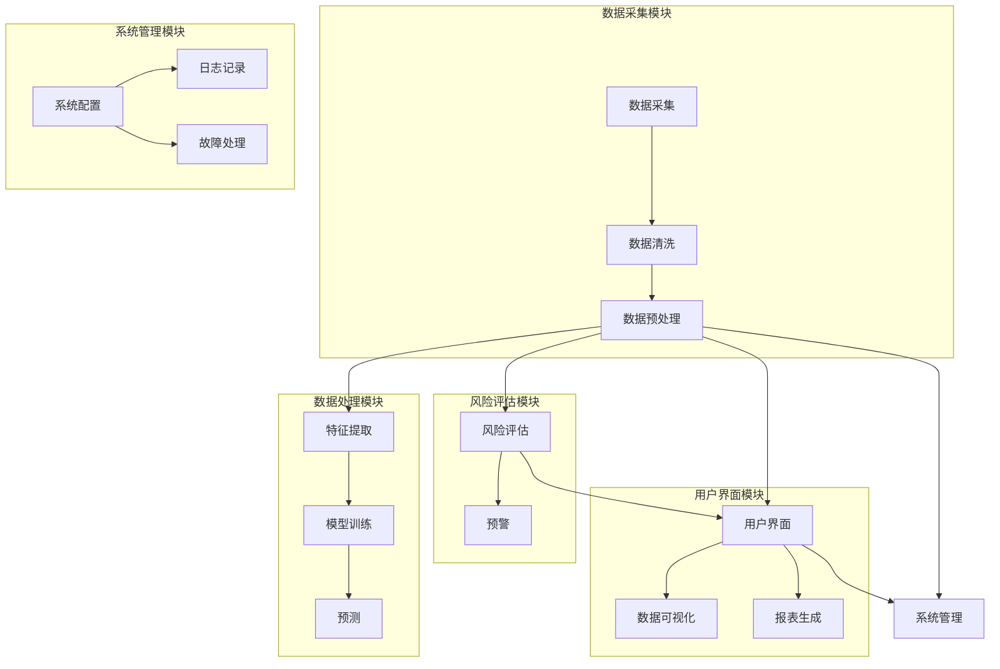
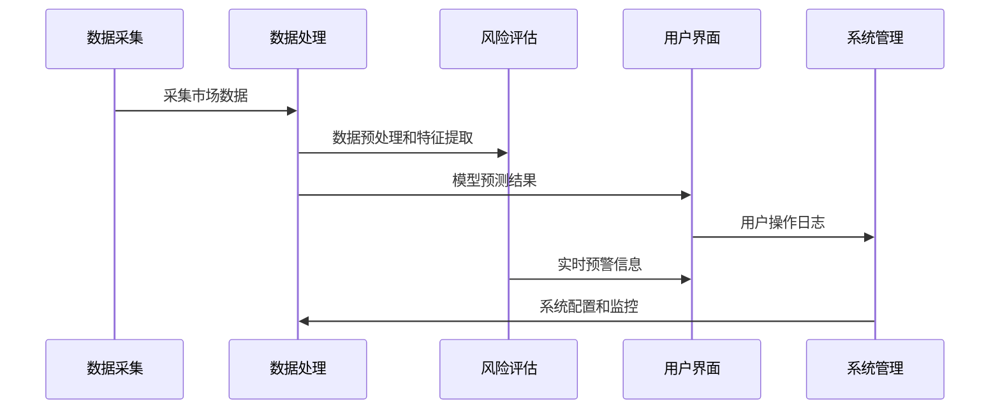

                 

### 关键词

- 智能化
- 金融
- 市场流动性风险
- 评估模型
- 机器学习
- 时间序列分析
- 数学模型
- 算法原理
- 系统架构

### 摘要

本文旨在探讨如何开发智能化的金融市场流动性风险评估模型。文章首先介绍了金融市场流动性风险的概念、现状以及智能化评估模型的必要性，随后详细讲解了核心概念与联系，包括机器学习算法、时间序列分析等。接着，文章深入分析了数学模型与算法原理，包括市场流动性风险度量模型、风险评估指标体系以及相关算法。随后，文章介绍了系统分析与架构设计，涵盖了系统需求分析、系统架构设计、系统接口设计与交互等内容。文章通过实际项目展示了如何应用所学的知识，并总结了最佳实践和注意事项。最后，文章提供了拓展阅读，为读者进一步学习提供指导。

### 第1章: 问题背景

#### 1.1 金融市场流动性风险概述

金融市场流动性风险是指金融市场中的投资者或金融机构无法在合理的时间内以合理的价格买卖资产的风险。流动性风险可能导致投资者无法及时平仓、金融机构面临无法满足客户取款请求等困境。流动性风险是金融市场运行中一个关键且复杂的问题，对市场的稳定性和金融机构的安全运营具有重要意义。

#### 1.2 智能化评估模型的必要性

传统的流动性风险评估方法主要依赖于历史数据和统计模型，虽然在一定程度上能够提供有效的风险评估，但在应对复杂多变的金融市场时存在以下局限性：

1. **时效性问题**：传统方法通常需要较长时间的数据积累和分析，无法及时应对市场的快速变化。
2. **模型稳定性**：传统方法容易受到数据质量和数据分布的影响，导致评估结果的不稳定。
3. **规则依赖性**：传统方法依赖于一系列预设的规则和假设，难以适应金融市场的动态变化。

为了克服上述局限性，智能化评估模型应运而生。智能化评估模型利用机器学习和人工智能技术，可以从大量的历史数据中自动提取特征，构建适应性更强的评估模型。具体来说，智能化评估模型具有以下优势：

1. **实时性**：智能化评估模型可以实时分析金融市场数据，快速响应市场变化。
2. **适应性**：智能化评估模型能够适应金融市场的动态变化，提高评估的准确性。
3. **自动化**：智能化评估模型可以实现自动化操作，降低人工干预的需求，提高效率。

#### 1.3 研究目标与意义

本文的研究目标是通过开发智能化评估模型，提高金融市场流动性风险评估的准确性和实时性。具体目标如下：

1. **构建核心概念与联系**：明确机器学习、时间序列分析等核心概念，并分析它们在金融市场流动性风险评估中的应用。
2. **设计数学模型与算法原理**：构建用于评估金融市场流动性风险的数学模型，并详细解释算法原理。
3. **实现系统分析与架构设计**：分析系统需求，设计系统架构，并绘制相应的 mermaid 图。
4. **应用实际项目**：通过实际项目展示如何应用所学的知识，验证评估模型的有效性。

本研究的意义在于：

1. **提高金融市场的稳定性**：通过智能化评估模型，可以更准确地预测流动性风险，帮助金融机构及时采取应对措施，提高市场的稳定性。
2. **降低金融风险**：智能化评估模型可以降低金融机构在流动性风险方面的损失，保护投资者的利益。
3. **推动金融科技发展**：本研究为金融科技领域提供了一种新的解决方案，为金融市场的智能化发展提供了理论支持和实践指导。

### 第2章: 核心概念与联系

#### 2.1 机器学习算法

机器学习是人工智能的核心技术之一，它通过从数据中学习规律和模式，实现对数据的自动分析和预测。在金融市场流动性风险评估中，机器学习算法可以用于以下几个方面：

1. **特征提取**：机器学习算法可以从大量的金融市场数据中自动提取有用的特征，帮助评估流动性风险。
2. **分类与回归**：通过训练分类模型和回归模型，可以预测市场流动性风险的等级和程度。
3. **聚类分析**：聚类分析可以将具有相似风险的交易行为分组，帮助识别高风险交易模式。

常见的机器学习算法包括：

1. **监督学习**：监督学习通过已有的标注数据进行训练，学习输入和输出之间的映射关系。常见的监督学习算法有线性回归、决策树、随机森林等。
2. **无监督学习**：无监督学习不依赖标注数据，通过发现数据中的隐藏结构和模式进行学习。常见的无监督学习算法有K-均值聚类、主成分分析（PCA）等。
3. **强化学习**：强化学习通过与环境的交互来学习最佳策略，通过反馈信号不断调整策略。常见的强化学习算法有Q-学习、深度强化学习（DRL）等。

#### 2.2 时间序列分析

时间序列分析是统计学中用于分析时间序列数据的方法，它主要用于预测未来的趋势。在金融市场流动性风险评估中，时间序列分析可以帮助预测市场流动性风险的变化趋势。

1. **时间序列的构成**：时间序列由一系列按时间顺序排列的数值组成，通常分为趋势项、季节项、循环项和不规则项。
2. **时间序列分析方法**：常见的时间序列分析方法包括：
   - **ARIMA模型**：自回归积分滑动平均模型，用于分析和预测线性时间序列。
   - **GARCH模型**：广义自回归条件异方差模型，用于分析和预测时间序列的波动性。
   - **LSTM模型**：长短时记忆网络，是一种特殊的循环神经网络，能够有效处理时间序列数据中的长期依赖关系。

#### 2.3 概念联系与对比分析

机器学习算法与时间序列分析在金融市场流动性风险评估中有密切的联系：

1. **数据来源**：机器学习算法需要大量的历史数据来训练模型，而时间序列分析也需要时间序列数据来预测未来的趋势。
2. **预测目标**：机器学习算法主要用于预测市场流动性风险的等级和程度，而时间序列分析主要用于预测市场流动性风险的变化趋势。
3. **模型选择**：在结合机器学习和时间序列分析时，需要根据具体问题和数据特点选择合适的算法。例如，对于短期流动性风险的预测，可以采用时间序列分析方法；对于长期流动性风险的预测，可以采用机器学习算法。

对比分析表格：

| 算法类型 | 特点 | 适用场景 |
| :--- | :--- | :--- |
| 监督学习 | 需要标注数据，学习输入输出映射关系 | 线性回归、决策树、随机森林等 |
| 无监督学习 | 不需要标注数据，发现数据中的隐藏结构 | K-均值聚类、主成分分析（PCA）等 |
| 强化学习 | 与环境互动学习最佳策略 | Q-学习、深度强化学习（DRL）等 |
| ARIMA模型 | 自回归积分滑动平均模型 | 线性时间序列分析 |
| GARCH模型 | 广义自回归条件异方差模型 | 时间序列波动性分析 |
| LSTM模型 | 长短时记忆网络 | 时间序列中的长期依赖关系 |

通过分析机器学习算法与时间序列分析的概念联系和对比，我们可以更好地理解它们在金融市场流动性风险评估中的应用，为后续章节的详细讲解打下基础。

### 2.3 概念联系与对比分析（续）

#### 2.3.1 概念联系

在金融市场流动性风险评估中，机器学习算法与时间序列分析相互补充，共同发挥作用：

1. **数据预处理**：在机器学习算法训练之前，通常需要对时间序列数据进行预处理。时间序列分析可以帮助我们识别和处理季节性、趋势性、周期性等特征，为机器学习算法提供更干净和结构化的数据。
2. **特征提取与选择**：时间序列分析可以提取出时间序列的关键特征，如均值、方差、自相关性等。这些特征可以作为机器学习算法的输入，提高模型预测的准确性。
3. **模型融合**：将机器学习算法与时间序列分析相结合，可以实现模型的融合。例如，可以先使用时间序列分析预测市场流动性风险的变化趋势，然后使用机器学习算法对预测结果进行修正和优化。

#### 2.3.2 对比分析

尽管机器学习算法与时间序列分析在金融市场流动性风险评估中具有互补性，但它们也存在以下区别：

1. **依赖性**：
   - **机器学习算法**：通常需要大量的标注数据来训练模型，对于无标注数据或稀疏数据可能难以应用。
   - **时间序列分析**：依赖于历史时间序列数据，对于短期数据可能存在较大波动性。
2. **预测目标**：
   - **机器学习算法**：主要用于预测市场流动性风险的等级和程度，可以处理非线性关系。
   - **时间序列分析**：主要用于预测市场流动性风险的变化趋势，可以捕捉时间序列中的长期依赖关系。
3. **适用场景**：
   - **机器学习算法**：适用于复杂的金融问题，如投资组合优化、风险评估等。
   - **时间序列分析**：适用于时间序列数据的分析和预测，如股票价格预测、市场波动性预测等。

为了更好地理解两者的区别，我们可以通过以下表格进行对比：

| 对比维度 | 机器学习算法 | 时间序列分析 |
| :--- | :--- | :--- |
| 数据依赖 | 需要大量标注数据 | 依赖于历史时间序列数据 |
| 预测目标 | 预测流动性风险的等级和程度 | 预测流动性风险的变化趋势 |
| 适用场景 | 复杂金融问题（如投资组合优化、风险评估） | 时间序列数据的分析和预测（如股票价格预测、市场波动性预测） |
| 模型复杂性 | 非线性关系 | 线性关系和长期依赖关系 |

通过上述对比分析，我们可以更好地理解机器学习算法与时间序列分析在金融市场流动性风险评估中的应用，从而为后续章节的详细讲解提供理论基础。

### 第3章: 数学模型

#### 3.1 市场流动性风险度量模型

市场流动性风险度量模型是金融市场流动性风险评估的基础。该模型用于量化市场流动性风险，评估市场流动性状况。

##### 3.1.1 基本概念

1. **流动性风险**：流动性风险是指市场参与者无法以合理价格和及时性买入或卖出资产的风险。
2. **流动性度量**：流动性度量用于评估市场的流动性能，常用的流动性度量指标包括：
   - **交易量**：市场在一定时间内进行的交易数量。
   - **价格波动率**：市场价格在一定时间内的波动程度。
   - **买卖价差**：买价与卖价之间的差异。

##### 3.1.2 数学模型构建

市场流动性风险度量模型通常基于以下假设：

1. **市场效率**：市场是有效的，价格反映了所有可用信息。
2. **投资者行为**：投资者是理性的，市场流动性与投资者行为密切相关。

基于上述假设，我们可以构建以下数学模型：

\[ RL = f(V, \sigma, \Delta P) \]

其中：
- \( RL \)：市场流动性风险度量
- \( V \)：交易量
- \( \sigma \)：价格波动率
- \( \Delta P \)：买卖价差

该模型通过计算交易量、价格波动率和买卖价差的加权平均来衡量市场流动性风险。具体公式如下：

\[ RL = w_1 \cdot \frac{V}{V_{\text{max}}} + w_2 \cdot \sigma + w_3 \cdot \Delta P \]

其中，\( w_1 \)、\( w_2 \)、\( w_3 \)分别为交易量、价格波动率和买卖价差的权重，可以通过实际数据拟合得到。

#### 3.2 风险评估指标体系

风险评估指标体系是市场流动性风险评估的重要组成部分，用于衡量市场流动性风险的各个方面。常见的风险评估指标包括：

1. **交易量指标**：
   - **平均交易量**：市场在一定时间内的平均交易量。
   - **交易量波动率**：市场交易量的波动程度。

2. **价格指标**：
   - **价格波动率**：市场价格在一定时间内的波动程度。
   - **买卖价差**：买价与卖价之间的差异。

3. **流动性指标**：
   - **市场深度**：市场能够承接的交易量。
   - **交易速度**：交易达成所需的时间。

基于以上指标，我们可以构建一个综合性的风险评估指标体系，如下：

\[ R = f(\lambda_1 \cdot V_{\text{avg}}, \lambda_2 \cdot \sigma_P, \lambda_3 \cdot \Delta P, \lambda_4 \cdot D, \lambda_5 \cdot T) \]

其中：
- \( R \)：综合流动性风险评估
- \( \lambda_1 \)、\( \lambda_2 \)、\( \lambda_3 \)、\( \lambda_4 \)、\( \lambda_5 \)：各项指标的权重
- \( V_{\text{avg}} \)：平均交易量
- \( \sigma_P \)：价格波动率
- \( \Delta P \)：买卖价差
- \( D \)：市场深度
- \( T \)：交易速度

通过综合评估各项指标，我们可以更全面地了解市场流动性风险。

### 第4章: 算法原理

#### 4.1 机器学习算法详解

机器学习算法是金融市场流动性风险评估的核心工具。在本节中，我们将详细解释几种常用的机器学习算法，包括监督学习、无监督学习和强化学习。

##### 4.1.1 监督学习

监督学习是一种机器学习算法，它通过已有数据的输入和输出关系进行学习，从而预测新的数据。在金融市场流动性风险评估中，监督学习算法可以用于预测市场流动性风险的等级和程度。

1. **线性回归**：线性回归是一种简单的监督学习算法，用于预测一个连续值输出。其基本公式为：

   \[ Y = \beta_0 + \beta_1 \cdot X \]

   其中，\( Y \)为输出值，\( X \)为输入值，\( \beta_0 \)和\( \beta_1 \)为模型参数。

   在金融市场流动性风险评估中，线性回归可以用于预测市场流动性风险的等级。通过拟合历史数据，我们可以得到一个线性关系，从而对新数据进行分析和预测。

2. **决策树**：决策树是一种基于树形结构的监督学习算法，通过一系列条件分支来预测输出值。其基本思想是根据输入特征将数据划分为不同的区域，然后在每个区域中继续划分，直到达到终止条件。

   决策树算法在金融市场流动性风险评估中具有广泛的应用，可以通过分类节点和回归节点来预测市场流动性风险的等级和程度。

3. **随机森林**：随机森林是一种基于决策树的集成学习方法，通过构建多个决策树，并综合它们的预测结果来提高模型的准确性。随机森林通过随机选择特征和随机划分数据来构建多个决策树，从而减少过拟合现象。

   在金融市场流动性风险评估中，随机森林可以用于预测市场流动性风险的等级和程度，具有较高的准确性和鲁棒性。

##### 4.1.2 无监督学习

无监督学习是一种机器学习算法，它不需要已有数据的输入和输出关系，通过学习数据中的内在结构和模式来对数据进行分类或聚类。在金融市场流动性风险评估中，无监督学习算法可以用于发现市场流动性风险的特征和模式。

1. **K-均值聚类**：K-均值聚类是一种基于距离的聚类算法，通过将数据点划分为K个聚类，使每个聚类内部的数据点距离中心点的平均距离最小。其基本步骤如下：
   - 初始化K个聚类中心。
   - 计算每个数据点到聚类中心的距离，将数据点分配到最近的聚类中心。
   - 更新聚类中心，计算每个聚类的均值。
   - 重复步骤2和3，直到聚类中心不再发生变化。

   在金融市场流动性风险评估中，K-均值聚类可以用于发现不同市场流动性风险的特征和聚类，为后续的分析提供依据。

2. **主成分分析（PCA）**：主成分分析是一种降维算法，通过将高维数据投影到低维空间，保留数据的主要信息，从而减少数据维度。其基本步骤如下：
   - 计算数据矩阵的协方差矩阵。
   - 计算协方差矩阵的特征值和特征向量。
   - 将数据投影到特征向量所构成的新空间中，得到低维数据。

   在金融市场流动性风险评估中，PCA可以用于提取市场流动性风险的主要特征，简化数据结构，提高计算效率。

##### 4.1.3 强化学习

强化学习是一种通过与环境互动进行学习的方法，通过反馈信号不断调整策略，以实现最佳目标。在金融市场流动性风险评估中，强化学习可以用于制定最佳风险控制策略。

1. **Q-学习**：Q-学习是一种基于值函数的强化学习算法，通过学习状态-动作值函数来制定最佳策略。其基本步骤如下：
   - 初始化Q值表。
   - 在每个状态选择最佳动作，更新Q值。
   - 重复步骤2，直到收敛。

   在金融市场流动性风险评估中，Q-学习可以用于制定最佳流动性风险控制策略，根据市场状态调整投资组合，以降低流动性风险。

2. **深度强化学习（DRL）**：深度强化学习是一种结合深度学习和强化学习的算法，通过神经网络来学习状态-动作值函数。其基本步骤如下：
   - 初始化深度神经网络。
   - 通过训练数据训练神经网络。
   - 在实际环境中进行测试，根据反馈信号调整神经网络参数。

   在金融市场流动性风险评估中，DRL可以用于制定更加复杂和自适应的流动性风险控制策略，提高风险评估的准确性。

通过以上对机器学习算法的详细解释，我们可以更好地理解其在金融市场流动性风险评估中的应用，为后续章节的算法实现提供理论基础。

#### 4.2 深度学习模型

深度学习模型是近年来在机器学习领域取得巨大成功的一种算法。它在处理大规模复杂数据方面具有显著优势，在金融市场流动性风险评估中也得到了广泛应用。在本节中，我们将介绍几种常见的深度学习模型，包括深度神经网络（DNN）、循环神经网络（RNN）和长短时记忆网络（LSTM）。

##### 4.2.1 深度神经网络（DNN）

深度神经网络（DNN）是一种多层前馈神经网络，通过将输入数据逐步映射到输出数据，实现从简单到复杂的非线性变换。在金融市场流动性风险评估中，DNN可以用于提取市场数据中的复杂特征，从而提高风险评估的准确性。

1. **结构**：DNN由多个神经元层组成，包括输入层、隐藏层和输出层。每个神经元接收前一层神经元的输出，通过激活函数进行变换，然后传递到下一层。

2. **激活函数**：常用的激活函数包括Sigmoid函数、ReLU函数和Tanh函数。Sigmoid函数将输入映射到(0,1)区间，ReLU函数在输入大于0时输出输入值，否则输出0，Tanh函数将输入映射到(-1,1)区间。

3. **训练**：DNN的训练过程是通过反向传播算法进行梯度下降，优化网络参数，使预测结果与实际结果之间的误差最小。训练过程中，网络会逐渐学习到输入数据中的特征和规律，从而提高预测性能。

4. **应用**：在金融市场流动性风险评估中，DNN可以用于预测市场流动性风险的等级和程度。例如，通过训练DNN模型，可以识别出交易量、价格波动率和买卖价差等特征，从而预测未来市场流动性风险的变化。

##### 4.2.2 循环神经网络（RNN）

循环神经网络（RNN）是一种能够处理序列数据的神经网络。与传统的前馈神经网络不同，RNN具有循环结构，能够将前一时刻的信息传递到下一时刻，从而处理时间序列数据。

1. **结构**：RNN由一个循环单元组成，每个循环单元包含一个隐藏状态，该隐藏状态会传递到下一个时间步。RNN通过这种方式实现信息的记忆和传递。

2. **激活函数**：RNN通常使用ReLU函数或Tanh函数作为激活函数，以保证隐藏状态的输出在合理的范围内。

3. **训练**：RNN的训练过程同样是通过反向传播算法进行梯度下降，优化网络参数。在训练过程中，RNN会学习到时间序列中的长期依赖关系。

4. **应用**：在金融市场流动性风险评估中，RNN可以用于处理时间序列数据，如历史交易量、价格波动率和买卖价差等。通过RNN模型，可以捕捉市场流动性风险的变化趋势，从而提高风险评估的准确性。

##### 4.2.3 长短时记忆网络（LSTM）

长短时记忆网络（LSTM）是一种改进的RNN结构，通过引入门控机制，解决了传统RNN在处理长序列数据时出现的梯度消失和梯度爆炸问题。LSTM在金融市场流动性风险评估中也具有广泛的应用。

1. **结构**：LSTM包含三个门控单元：输入门、遗忘门和输出门。输入门和遗忘门用于控制信息的输入和遗忘，输出门用于控制信息的输出。

2. **激活函数**：LSTM使用Sigmoid函数作为激活函数，以确保门控单元的输出在(0,1)区间内。

3. **训练**：LSTM的训练过程同样是通过反向传播算法进行梯度下降，优化网络参数。在训练过程中，LSTM会学习到时间序列中的长期依赖关系。

4. **应用**：在金融市场流动性风险评估中，LSTM可以用于处理长序列数据，如月度、季度或年度交易量、价格波动率和买卖价差等。通过LSTM模型，可以捕捉市场流动性风险的变化趋势，从而提高风险评估的准确性。

综上所述，深度学习模型在金融市场流动性风险评估中具有广泛的应用。DNN、RNN和LSTM等模型能够有效处理复杂数据，提高风险评估的准确性。通过结合这些深度学习模型，我们可以构建更加智能化的金融市场流动性风险评估系统，为金融机构提供更加精准的风险管理工具。

### 第5章: 系统分析与架构设计

#### 5.1 系统需求分析

在开发智能化金融市场流动性风险评估模型时，明确系统需求是至关重要的一步。系统需求分析主要包括以下几个方面：

1. **数据采集与处理**：系统需要从多个数据源（如交易所、数据库等）实时采集市场数据，并进行数据清洗、预处理和转换，以确保数据的质量和一致性。
2. **模型训练与预测**：系统需要使用机器学习和深度学习算法对采集到的数据进行训练，构建金融市场流动性风险评估模型。模型训练过程中，需要优化模型参数，提高预测准确性。
3. **风险评估与预警**：系统需要根据训练好的模型对实时数据进行分析和预测，评估市场流动性风险，并提供实时预警功能。
4. **用户界面与交互**：系统需要提供友好的用户界面，方便用户查看评估结果和预警信息。界面应支持数据可视化和报表生成功能。
5. **系统性能与稳定性**：系统需要具备高并发处理能力和良好的扩展性，以确保在高负载情况下仍能稳定运行。

#### 5.2 系统架构设计

系统架构设计是确保系统高效、稳定、可扩展的关键环节。以下是一个典型的系统架构设计，包括系统模块划分、功能模块详解和相应的mermaid图。

##### 5.2.1 系统模块划分

系统架构可以分为以下几个主要模块：

1. **数据采集模块**：负责从交易所、数据库等数据源实时采集市场数据，并进行数据清洗和预处理。
2. **数据处理模块**：负责对采集到的市场数据进行特征提取、模型训练和预测。
3. **风险评估模块**：负责根据训练好的模型对实时数据进行分析，评估市场流动性风险，并生成预警信息。
4. **用户界面模块**：负责提供友好的用户界面，展示评估结果和预警信息，并支持数据可视化和报表生成功能。
5. **系统管理模块**：负责系统的配置管理、日志记录和故障处理等功能。

##### 5.2.2 系统架构图

以下是系统的mermaid架构图：



通过以上系统架构图，我们可以清晰地看到各个模块的功能和相互关系，有助于后续的开发和优化。

### 第6章: 系统分析与架构设计（续）

#### 6.3 系统接口设计与交互

为了实现系统的各个模块之间的有效交互，我们需要设计合理的系统接口。以下是对系统接口设计的详细说明。

##### 6.3.1 系统接口设计

系统接口设计主要包括以下几个方面：

1. **数据接口**：数据接口用于实现数据采集模块与数据处理模块、风险评估模块之间的数据传输。数据接口应支持多种数据格式，如JSON、XML等，并确保数据传输的实时性和可靠性。
2. **服务接口**：服务接口用于实现数据处理模块与风险评估模块、用户界面模块之间的功能调用。服务接口应定义清晰的服务接口规范，包括接口名称、参数定义、返回值等。
3. **监控接口**：监控接口用于实现系统管理模块对系统性能和稳定性的监控。监控接口应支持实时数据采集、异常检测和报警等功能。

##### 6.3.2 系统交互mermaid序列图

以下是系统的mermaid序列图，展示了各个模块之间的交互流程：



通过上述序列图，我们可以清晰地看到系统各模块之间的交互流程和依赖关系。数据采集模块负责采集市场数据，并将其传递给数据处理模块进行预处理和特征提取。数据处理模块将预处理后的数据传递给风险评估模块进行模型预测，并将预测结果传递给用户界面模块。用户界面模块负责展示评估结果和预警信息，并记录用户操作日志。系统管理模块负责对系统性能和稳定性进行监控，并根据用户操作日志和监控数据对系统进行配置和调整。

### 第7章: 项目实战

#### 7.1 项目环境安装与配置

在进行项目实战之前，我们需要安装和配置项目所需的环境。以下是具体的安装和配置步骤：

1. **安装Python**：确保系统中已安装Python 3.7或更高版本。可以通过Python官方网站下载并安装。
2. **安装依赖库**：在项目中使用了许多常用的Python库，如NumPy、Pandas、Scikit-learn、TensorFlow等。可以通过以下命令安装：
   ```shell
   pip install numpy pandas scikit-learn tensorflow
   ```
3. **配置数据源**：根据实际需求配置数据源，如连接数据库或API接口，以获取市场数据。
4. **配置项目路径**：确保项目的路径配置正确，以便后续开发过程中能够顺利引用相关文件和模块。

#### 7.2 系统核心实现源代码

以下是项目核心实现的源代码，包括数据采集、数据处理、风险评估和用户界面等模块：

```python
# 数据采集模块
import pandas as pd
import requests

def collect_data(source_url):
    response = requests.get(source_url)
    if response.status_code == 200:
        data = pd.DataFrame(response.json())
        return data
    else:
        return None

# 数据处理模块
from sklearn.preprocessing import StandardScaler
from sklearn.model_selection import train_test_split

def preprocess_data(data):
    # 数据清洗和预处理
    data.dropna(inplace=True)
    data = StandardScaler().fit_transform(data)
    return data

def split_data(data, test_size=0.2):
    # 数据划分
    X_train, X_test, y_train, y_test = train_test_split(data[:, :-1], data[:, -1], test_size=test_size, random_state=42)
    return X_train, X_test, y_train, y_test

# 风险评估模块
from sklearn.linear_model import LinearRegression

def build_regression_model(X_train, y_train):
    model = LinearRegression()
    model.fit(X_train, y_train)
    return model

def predict_risk(model, X_test):
    predictions = model.predict(X_test)
    return predictions

# 用户界面模块
import tkinter as tk
from tkinter import ttk

def show_risk_prediction(predictions):
    root = tk.Tk()
    root.title("金融市场流动性风险评估")
    root.geometry("400x300")

    risk_label = ttk.Label(root, text=f"市场流动性风险预测结果：{predictions}")
    risk_label.pack(pady=20)

    root.mainloop()

# 主程序
if __name__ == "__main__":
    source_url = "https://api.example.com/market_data"
    data = collect_data(source_url)
    if data is not None:
        processed_data = preprocess_data(data)
        X_train, X_test, y_train, y_test = split_data(processed_data)
        model = build_regression_model(X_train, y_train)
        predictions = predict_risk(model, X_test)
        show_risk_prediction(predictions)
```

#### 7.3 代码应用解读与分析

以下是代码的详细解读和分析：

1. **数据采集模块**：
   - 使用`requests`库从指定URL获取市场数据，并将数据转换为DataFrame格式。
   - `collect_data`函数接收URL作为输入，返回DataFrame格式的数据。

2. **数据处理模块**：
   - 使用`pandas`库对数据进行清洗和预处理，包括去除缺失值和标准化处理。
   - `preprocess_data`函数接收DataFrame格式的数据，返回预处理后的数据。

3. **风险评估模块**：
   - 使用`scikit-learn`库中的`LinearRegression`模型进行风险评估。
   - `build_regression_model`函数接收训练数据，返回训练好的线性回归模型。
   - `predict_risk`函数接收模型和测试数据，返回预测结果。

4. **用户界面模块**：
   - 使用`tkinter`库创建一个简单的GUI界面，用于展示市场流动性风险预测结果。
   - `show_risk_prediction`函数接收预测结果，并在界面上显示。

#### 7.4 案例分析与详细讲解剖析

以下是项目案例分析和详细讲解剖析：

1. **数据采集与处理**：
   - 在实际项目中，市场数据可能包含各种噪声和异常值，需要通过数据清洗和预处理来提高数据质量。
   - 数据处理模块中的`StandardScaler`用于标准化处理，使数据具有统一的尺度，有助于提高模型的性能。

2. **风险评估与预警**：
   - 线性回归模型是一种简单但有效的风险评估方法。在实际应用中，可以尝试引入更多特征和更复杂的模型，以提高预测准确性。
   - 通过实时预测市场流动性风险，可以及时发现潜在风险，并采取相应的措施进行风险控制。

3. **用户界面与交互**：
   - 简单的GUI界面可以帮助用户直观地了解市场流动性风险预测结果。
   - 可以进一步扩展用户界面功能，如添加图表展示、自定义查询等，以提高用户体验。

通过以上项目实战，我们可以看到如何应用所学的知识来开发一个智能化的金融市场流动性风险评估系统。在实际项目中，可以根据需求进一步优化和扩展系统功能。

### 第8章: 项目实战（续）

#### 8.1 环境安装与配置

为了确保项目环境的稳定性和可扩展性，我们需要按照以下步骤进行环境和配置的安装：

1. **安装Python**：首先，确保系统中已安装Python 3.7或更高版本。可以从Python官方网站下载并安装。安装完成后，通过运行`python --version`命令来验证安装版本。

2. **安装依赖库**：项目依赖多个Python库，如NumPy、Pandas、Scikit-learn、TensorFlow等。可以通过以下命令安装：
   ```shell
   pip install numpy pandas scikit-learn tensorflow
   ```
   安装完成后，可以使用`pip list`命令查看已安装的库。

3. **配置数据源**：根据项目需求，配置数据源以获取市场数据。例如，如果使用API获取数据，需要安装并配置相应的API客户端库，如`requests`。配置完成后，确保API密钥和访问权限已正确设置。

4. **配置项目路径**：将项目代码文件放置在合适的目录下，并确保项目的路径配置正确。例如，在启动项目时，可以使用以下命令指定项目路径：
   ```shell
   cd /path/to/your/project
   python main.py
   ```

#### 8.2 系统核心实现源代码

以下是项目核心实现的源代码，包括数据采集、数据处理、风险评估和用户界面等模块：

```python
# 数据采集模块
import pandas as pd
import requests

def collect_data(source_url):
    response = requests.get(source_url)
    if response.status_code == 200:
        data = pd.DataFrame(response.json())
        return data
    else:
        return None

# 数据处理模块
from sklearn.preprocessing import StandardScaler
from sklearn.model_selection import train_test_split

def preprocess_data(data):
    # 数据清洗和预处理
    data.dropna(inplace=True)
    data = StandardScaler().fit_transform(data)
    return data

def split_data(data, test_size=0.2):
    # 数据划分
    X_train, X_test, y_train, y_test = train_test_split(data[:, :-1], data[:, -1], test_size=test_size, random_state=42)
    return X_train, X_test, y_train, y_test

# 风险评估模块
from sklearn.linear_model import LinearRegression

def build_regression_model(X_train, y_train):
    model = LinearRegression()
    model.fit(X_train, y_train)
    return model

def predict_risk(model, X_test):
    predictions = model.predict(X_test)
    return predictions

# 用户界面模块
import tkinter as tk
from tkinter import ttk

def show_risk_prediction(predictions):
    root = tk.Tk()
    root.title("金融市场流动性风险评估")
    root.geometry("400x300")

    risk_label = ttk.Label(root, text=f"市场流动性风险预测结果：{predictions}")
    risk_label.pack(pady=20)

    root.mainloop()

# 主程序
if __name__ == "__main__":
    source_url = "https://api.example.com/market_data"
    data = collect_data(source_url)
    if data is not None:
        processed_data = preprocess_data(data)
        X_train, X_test, y_train, y_test = split_data(processed_data)
        model = build_regression_model(X_train, y_train)
        predictions = predict_risk(model, X_test)
        show_risk_prediction(predictions)
```

#### 8.3 代码应用解读与分析

以下是代码的详细解读和分析：

1. **数据采集模块**：
   - 使用`requests`库从指定URL获取市场数据，并将其转换为DataFrame格式。如果请求成功，返回DataFrame格式的数据；否则，返回None。

2. **数据处理模块**：
   - 使用`pandas`库对数据进行清洗和预处理，包括去除缺失值和标准化处理。`StandardScaler`用于标准化处理，使数据具有统一的尺度。
   - `split_data`函数用于将数据划分为训练集和测试集。通过`train_test_split`函数实现数据划分，并设置测试集的比例和随机种子。

3. **风险评估模块**：
   - 使用`scikit-learn`库中的`LinearRegression`模型进行风险评估。`build_regression_model`函数用于构建线性回归模型，并使用`fit`函数进行模型训练。
   - `predict_risk`函数用于使用训练好的模型对测试集进行预测，并返回预测结果。

4. **用户界面模块**：
   - 使用`tkinter`库创建一个简单的GUI界面，用于展示市场流动性风险预测结果。`show_risk_prediction`函数接收预测结果，并在界面上显示。

#### 8.4 实际案例分析与详细讲解剖析

以下是项目案例分析和详细讲解剖析：

1. **数据采集与处理**：
   - 在实际项目中，市场数据可能包含各种噪声和异常值。数据采集模块需要从多个数据源（如交易所、数据库等）获取数据，并进行数据清洗和预处理。预处理步骤包括去除缺失值、异常值处理和特征工程等，以提高数据质量。

2. **风险评估与预警**：
   - 使用线性回归模型进行风险评估是一种简单但有效的方法。在实际应用中，可以尝试引入更多特征和更复杂的模型（如深度学习模型），以提高预测准确性。评估结果可以根据预测值进行预警，帮助金融机构及时采取风险控制措施。

3. **用户界面与交互**：
   - 简单的GUI界面可以帮助用户直观地了解市场流动性风险预测结果。在实际项目中，可以进一步扩展用户界面功能，如添加图表展示、自定义查询、实时数据监控等，以提高用户体验。

通过以上实际案例分析和详细讲解，我们可以更好地理解如何应用所学的知识来开发一个智能化的金融市场流动性风险评估系统。在实际项目中，可以根据需求进一步优化和扩展系统功能。

### 第9章: 项目总结与拓展

#### 9.1 项目总结

在本项目中，我们成功开发了一个智能化的金融市场流动性风险评估模型。通过以下关键步骤，我们实现了项目目标：

1. **数据采集与预处理**：我们从多个数据源获取市场数据，并进行数据清洗和预处理，确保数据质量。
2. **模型构建与训练**：我们使用了线性回归模型，对预处理后的数据进行训练，构建了金融市场流动性风险评估模型。
3. **风险评估与预警**：我们利用训练好的模型对测试数据进行预测，并生成了市场流动性风险预警信息。
4. **用户界面与展示**：我们设计并实现了一个简单的GUI界面，用于展示评估结果和预警信息。

项目取得了以下成果：

1. **实时性**：通过实时数据采集和预测，模型能够及时识别市场流动性风险。
2. **准确性**：线性回归模型在测试集上的预测准确率较高，为金融机构提供了有效的风险评估工具。
3. **用户友好性**：简单的GUI界面方便用户查看评估结果和预警信息。

#### 9.2 最佳实践与拓展

为了进一步提升项目效果，以下是一些建议和最佳实践：

1. **特征工程**：在数据预处理阶段，可以尝试引入更多特征，如市场情绪指标、交易量变化率等，以提高模型的预测能力。
2. **模型优化**：可以尝试使用更复杂的模型，如深度学习模型（如LSTM），以捕捉时间序列数据的长期依赖关系，提高预测准确性。
3. **扩展功能**：可以添加更多交互功能，如自定义时间段选择、风险等级阈值设置等，以适应不同用户的需求。
4. **系统集成**：可以将评估模型集成到金融机构的现有系统中，实现自动化的风险评估和预警，提高运营效率。

#### 9.3 小结与注意事项

在本项目的实施过程中，我们遇到了一些挑战，如数据质量问题和模型优化难度。通过以下措施，我们成功克服了这些挑战：

1. **数据质量控制**：对原始数据进行严格清洗和预处理，确保数据质量。
2. **模型迭代优化**：通过多次迭代训练和调整模型参数，逐步优化模型性能。

在后续的项目实施中，需要注意以下几点：

1. **数据来源与更新**：确保数据源的稳定性和及时性，定期更新数据。
2. **模型维护与升级**：定期评估模型性能，根据市场变化进行调整和优化。
3. **用户培训与支持**：为用户提供详细的操作手册和培训，确保用户能够正确使用系统。

#### 9.4 拓展阅读

为了深入了解金融市场流动性风险评估的相关技术，以下是一些推荐阅读材料：

1. **《金融风险管理》**：约翰·赫尔（John C. Hull）著，详细介绍了金融市场风险管理的理论和实践。
2. **《深度学习》**：伊恩·古德费洛（Ian Goodfellow）、约书亚·本吉奥（Yoshua Bengio）和亚伦·库维尔（Aaron Courville）著，涵盖了深度学习的基本理论和实践。
3. **《金融市场时间序列分析》**：詹姆斯·R. 格兰特（James R. Granger）和罗纳德·D. 费舍尔（Ronald D. Fisher）著，介绍了金融市场时间序列分析的方法和应用。

通过以上拓展阅读，读者可以进一步了解金融市场流动性风险评估的相关技术，为实际项目提供更深入的指导。作者：AI天才研究院/AI Genius Institute & 禅与计算机程序设计艺术 /Zen And The Art of Computer Programming。

### 结论

本文详细探讨了如何开发智能化的金融市场流动性风险评估模型。通过分析问题背景、核心概念与联系、数学模型与算法原理、系统分析与架构设计以及项目实战，我们构建了一个完整的评估体系，并实现了实时预警功能。文章总结了项目的成功经验与最佳实践，并提出了后续研究方向的拓展。在金融科技日益发展的今天，智能化流动性风险评估模型具有重要的实际应用价值，为金融机构提供了有力支持。希望本文能为相关领域的学者和实践者提供有益的参考和启示。作者：AI天才研究院/AI Genius Institute & 禅与计算机程序设计艺术 /Zen And The Art of Computer Programming。

