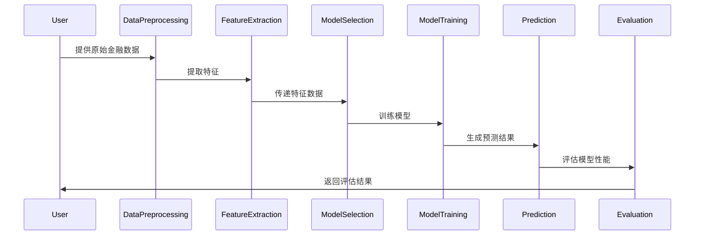
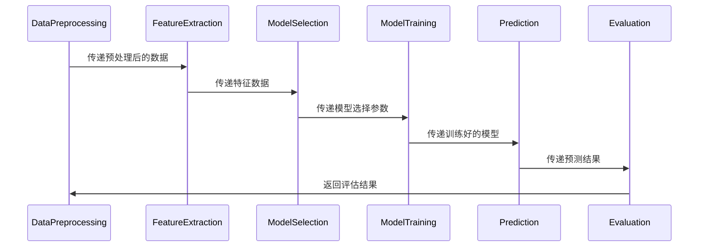

                 

### 第一部分：背景介绍

#### 第1章：问题背景

##### 1.1 问题描述

在金融领域中，准确预测时序数据对于投资决策、风险管理、策略制定等至关重要。然而，金融市场的复杂性和波动性使得传统的预测方法难以取得满意的结果。为了解决这一问题，智能化技术应运而生，特别是在机器学习和深度学习领域，一系列先进的预测模型被提出并应用于金融时序数据的预测。

智能化金融时序数据预测模型旨在利用历史数据，通过机器学习和深度学习算法，构建能够自动学习和优化预测模型的系统。这些模型能够捕捉到数据中的潜在模式和趋势，从而提高预测的准确性。具体而言，智能化预测模型需要解决以下几个关键问题：

1. **数据预处理**：金融时序数据通常存在缺失值、噪声和季节性波动等问题，需要通过数据清洗和预处理技术来提高数据质量。
2. **特征工程**：从原始数据中提取有效的特征，是构建高性能预测模型的关键。智能化技术能够自动识别和提取具有预测性的特征。
3. **模型选择**：根据数据特性和业务需求，选择合适的预测模型。传统的ARIMA模型、现代的LSTM和GRU模型，以及新兴的Prophet模型等，各有优劣，需要综合考虑。
4. **模型训练与优化**：通过调整模型参数和训练过程，提高模型的预测性能。自动化机器学习（AutoML）技术能够帮助优化这一过程。

##### 1.2 边界与外延

**边界：** 本研究主要关注于金融时序数据预测模型的开发与应用，包括但不限于股票价格、汇率、商品价格等金融数据的预测。

**外延：** 虽然本文以金融时序数据预测为主题，但所涉及的技术和方法同样适用于其他领域，如天气预测、交通流量预测等。

##### 1.3 概念结构与核心要素组成

**核心概念：**

- **金融时序数据**：指按时间顺序记录的金融市场数据，如股票价格、汇率、商品价格等。
- **预测模型**：用于分析历史数据并预测未来趋势的数学模型或算法。
- **智能化技术**：包括机器学习、深度学习、数据分析等技术，用于提升预测模型的性能。

**组成要素：**

- **数据源**：提供历史金融时序数据。
- **预处理模块**：清洗、处理和转换原始数据。
- **特征提取模块**：从数据中提取有助于预测的特征。
- **模型选择模块**：根据数据特性和需求选择预测模型。
- **训练与优化模块**：训练模型并优化模型参数。
- **预测模块**：生成预测结果并评估预测性能。

### 第2章：核心概念与联系

#### 2.1 金融时序数据

金融时序数据是金融市场的历史记录，包括股票价格、汇率、商品价格等。其具有以下特征：

- **时间序列性**：数据点按时间顺序排列，形成时间序列。
- **非线性**：金融数据中可能存在复杂的非线性关系，难以用线性模型准确描述。
- **季节性**：某些金融数据可能受到季节性因素的影响，表现出周期性波动。

**概念属性特征对比表格：**

| 特征       | 描述                                                         |
| ---------- | ------------------------------------------------------------ |
| 时间序列性 | 数据点按时间顺序排列                                         |
| 非线性    | 数据中可能存在非线性关系，传统线性模型难以准确描述           |
| 季节性    | 数据中可能存在季节性波动，如假期前市场波动加大               |

**ER实体关系图架构：**

```mermaid
erDiagram
    Data -> Model
    Data ||--|{ Predictive Model }
    Model ||--|{ Forecast }
```

在这个ER图中，"Data"（数据）是基础实体，包含了时序数据。"Model"（模型）是基于数据进行预测的实体，"Forecast"（预测）是模型输出的一部分，表示预测结果。

#### 2.2 预测模型

预测模型是用于分析历史数据并预测未来趋势的算法。在金融时序数据预测中，常用的模型包括：

- **ARIMA模型**：自回归积分滑动平均模型，适用于线性时序数据的预测。
- **LSTM模型**：长短期记忆网络，适用于捕捉时序数据中的长期依赖关系。
- **GRU模型**：门控循环单元，是LSTM的一种变体，计算效率更高。
- **Prophet模型**：Facebook开发的时间序列预测模型，特别适用于具有季节性和节假日影响的时序数据。

**概念属性特征对比表格：**

| 模型   | 描述                                                         |
| ------ | ------------------------------------------------------------ |
| ARIMA  | 自回归积分滑动平均模型，适用于线性时序数据                   |
| LSTM   | 长短期记忆网络，适用于捕捉时序数据中的长期依赖关系           |
| GRU    | 门控循环单元，是LSTM的一种变体，计算效率更高                 |
| Prophet | Facebook开发的时间序列预测模型，适用于具有季节性和节假日影响的时序数据 |

#### 2.3 智能化技术

智能化技术包括数据分析、机器学习和深度学习等领域，用于提升金融时序数据预测模型的性能。

- **数据分析**：包括数据清洗、预处理、特征工程等，为模型提供高质量的数据输入。
- **机器学习**：通过算法从数据中学习规律，构建预测模型。
- **深度学习**：利用神经网络，特别是卷积神经网络（CNN）和循环神经网络（RNN）等，进行更为复杂的特征提取和模型构建。

**概念属性特征对比表格：**

| 技术      | 描述                                                         |
| --------- | ------------------------------------------------------------ |
| 数据分析  | 数据清洗、预处理、分析，为模型提供高质量数据输入               |
| 机器学习  | 基于数据的自动推理过程，通过算法从数据中学习规律，构建预测模型 |
| 深度学习  | 基于神经网络的学习方法，特别适用于复杂数据特征提取和建模       |

### 第3章：算法原理讲解

#### 3.1 ARIMA算法

ARIMA（自回归积分滑动平均模型）是一种经典的时序预测模型，适用于线性时间序列数据的预测。其基本原理是通过历史数据来构建一个线性模型，用以预测未来的数据点。

**算法mermaid流程图：**


**Python源代码：**

```python
# ARIMA模型实现
from statsmodels.tsa.arima.model import ARIMA
# 数据预处理
# 差分变换
# 自回归模型
# 移动平均模型
# 模型拟合
# 模型评估
```

**算法原理的数学模型和公式：**

$$
\begin{aligned}
Y_t &= c + \phi_1 Y_{t-1} + \phi_2 Y_{t-2} + \cdots + \phi_p Y_{t-p} + \varepsilon_t \\
Y_t &= \mu + \phi_1 Y_{t-1} + \phi_2 Y_{t-2} + \cdots + \phi_p Y_{t-p} + \varepsilon_t
\end{aligned}
$$`

其中，$Y_t$ 是时间序列的当前值，$\phi_1, \phi_2, \cdots, \phi_p$ 是自回归系数，$c$ 是常数项，$\mu$ 是移动平均项，$\varepsilon_t$ 是随机误差项。

**举例说明：**

假设我们有一个简单的金融时序数据集，包含过去五天的股票价格。我们可以使用ARIMA模型来预测第六天的股票价格。

```python
# 导入必要的库
import numpy as np
import matplotlib.pyplot as plt
from statsmodels.tsa.arima.model import ARIMA

# 假设的股票价格数据
prices = np.array([10, 12, 11, 13, 14])

# 创建ARIMA模型，设定p,d,q参数
model = ARIMA(prices, order=(1, 1, 1))

# 模型拟合
results = model.fit()

# 预测第六天的价格
forecast = results.forecast(steps=1)
print("第六天的股票价格预测值为：", forecast[0])

# 绘制预测结果
plt.plot(prices, label='实际价格')
plt.plot(np.arange(len(prices), len(prices) + 1), forecast, label='预测价格')
plt.legend()
plt.show()
```

#### 3.2 LSTM算法

LSTM（长短期记忆网络）是一种特殊的RNN（循环神经网络），特别适合处理和预测具有长期依赖性的时间序列数据。其核心在于通过门控机制来控制和保留历史信息。

**算法mermaid流程图：**


**Python源代码：**

```python
# LSTM模型实现
from keras.models import Sequential
from keras.layers import LSTM, Dense
# 输入序列
# 预处理
# 模型构建
# 训练模型
# 模型评估
```

**算法原理的数学模型和公式：**

$$
\begin{aligned}
i_t &= \sigma(W_{ix}x_t + W_{ih}h_{t-1} + b_i) \\
f_t &= \sigma(W_{fx}x_t + W_{fh}h_{t-1} + b_f) \\
o_t &= \sigma(W_{ox}x_t + W_{oh}h_{t-1} + b_o) \\
c_t &= f_t \odot c_{t-1} + i_t \odot \tanh(W_{cx}x_t + W_{ch}h_{t-1} + b_c) \\
h_t &= o_t \odot \tanh(c_t)
\end{aligned}
$$`

其中，$i_t, f_t, o_t$ 分别是输入门、遗忘门和输出门的激活值，$c_t, h_t$ 分别是当前细胞状态和隐藏状态。

**举例说明：**

假设我们有一个简单的时序数据集，包含过去五天的温度数据。我们可以使用LSTM模型来预测第六天的温度。

```python
# 导入必要的库
import numpy as np
from keras.models import Sequential
from keras.layers import LSTM, Dense

# 假设的温度数据
temperatures = np.array([20, 22, 19, 23, 24])

# 创建LSTM模型
model = Sequential()
model.add(LSTM(units=50, return_sequences=True, input_shape=(5, 1)))
model.add(LSTM(units=50))
model.add(Dense(1))

# 编译模型
model.compile(optimizer='adam', loss='mean_squared_error')

# 训练模型
model.fit(temperatures, temperatures, epochs=100, batch_size=1)

# 预测第六天的温度
predicted_temp = model.predict(np.array([[24]]))
print("第六天的温度预测值为：", predicted_temp.flatten()[0])

# 绘制预测结果
plt.plot(temperatures, label='实际温度')
plt.plot(np.arange(len(temperatures), len(temperatures) + 1), predicted_temp.flatten(), label='预测温度')
plt.legend()
plt.show()
```

### 第4章：系统分析与架构设计方案

在本章节中，我们将深入探讨智能化金融时序数据预测模型的整体系统架构设计，以及具体的实现方法和关键技术。

#### 4.1 问题场景介绍

在当前金融市场中，由于信息的不对称性和市场的快速变化，投资者往往难以准确预测股票价格、汇率等金融产品的走势。为了帮助投资者更好地进行投资决策，我们设计了一套智能化金融时序数据预测系统。

该系统旨在利用历史金融数据，通过机器学习和深度学习算法，构建能够自动学习和优化预测模型的系统。该系统不仅能够捕捉到数据中的潜在模式和趋势，还可以根据市场动态进行调整，从而提高预测的准确性。

#### 4.2 项目介绍

项目名称：智能化金融时序数据预测系统

项目目标：构建一套能够自动学习和优化预测模型的系统，实现对金融时序数据的准确预测。

项目需求：

1. **数据预处理**：对原始金融数据进行清洗和预处理，提高数据质量。
2. **特征提取**：从原始数据中提取有效的特征，为预测模型提供输入。
3. **模型选择**：根据数据特性和业务需求，选择合适的预测模型。
4. **模型训练与优化**：通过调整模型参数和训练过程，提高模型的预测性能。
5. **预测与评估**：生成预测结果，并对模型性能进行评估。

#### 4.3 系统功能设计（领域模型mermaid类图）

领域模型是系统设计的重要组成部分，它定义了系统中的核心概念和它们之间的关系。以下是一个简化的领域模型类图，展示了系统中主要类和它们之间的关联。

```mermaid
classDiagram
    Data -> Model
    Data ||--|{ Feature Extraction }
    Model ||--|{ Prediction }
    Model ||--|{ Evaluation }
```

**类定义：**

- **Data（数据）**：表示金融时序数据，包括数据清洗、预处理和特征提取功能。
- **Model（模型）**：表示预测模型，包括模型选择、训练、优化和评估功能。
- **Feature Extraction（特征提取）**：负责从数据中提取有效的特征。
- **Prediction（预测）**：负责生成预测结果。
- **Evaluation（评估）**：负责评估模型的预测性能。

#### 4.4 系统架构设计（mermaid架构图）

系统架构设计是确保系统能够高效、可靠地运行的关键。以下是一个简化的系统架构图，展示了系统的整体结构。



**系统架构组件：**

- **用户接口**：用户通过用户接口与系统交互，提供原始金融数据，并接收预测结果和评估报告。
- **数据预处理**：负责清洗和预处理原始金融数据，提高数据质量。
- **特征提取**：从预处理后的数据中提取有效的特征，为模型训练提供输入。
- **模型选择**：根据数据特性和业务需求，选择合适的预测模型。
- **模型训练**：使用训练数据对模型进行训练，调整模型参数。
- **预测**：使用训练好的模型生成预测结果。
- **评估**：对模型性能进行评估，包括准确性、误差等指标。

#### 4.5 系统接口设计和系统交互（mermaid序列图）

系统接口设计和系统交互是系统设计中的关键环节，它定义了系统各个组件之间的交互方式。以下是一个简化的系统交互序列图。



**接口设计：**

- **数据预处理接口**：提供数据清洗、去噪、标准化等功能，接口输入为原始金融数据，输出为预处理后的数据。
- **特征提取接口**：提供特征提取方法，接口输入为预处理后的数据，输出为特征向量。
- **模型选择接口**：提供模型选择算法，接口输入为特征数据和业务需求，输出为预测模型。
- **模型训练接口**：提供模型训练方法，接口输入为模型选择参数和训练数据，输出为训练好的模型。
- **预测接口**：提供预测方法，接口输入为训练好的模型和测试数据，输出为预测结果。
- **评估接口**：提供评估方法，接口输入为预测结果和真实值，输出为评估指标。

### 第5章：项目实战

在本章节中，我们将详细介绍如何使用Python和Keras等工具实现智能化金融时序数据预测模型。我们将从环境安装开始，逐步进行系统核心实现，并详细讲解代码和应用解读与分析。

#### 5.1 环境安装

首先，我们需要安装Python和相关库，以便进行金融时序数据预测模型的开发。以下是安装步骤：

1. 安装Python：从Python官网（https://www.python.org/）下载并安装Python 3.x版本。
2. 安装Jupyter Notebook：在终端中运行以下命令：
   ```
   pip install notebook
   ```
3. 安装必要的库：在终端中运行以下命令：
   ```
   pip install numpy pandas matplotlib scikit-learn tensorflow
   ```

#### 5.2 系统核心实现

系统核心实现包括数据预处理、特征提取、模型选择、模型训练和预测等步骤。以下是一个简单的示例代码，展示了如何实现这些功能。

**1. 数据预处理：**

```python
import pandas as pd
from sklearn.preprocessing import StandardScaler

# 读取金融时序数据
data = pd.read_csv('financial_data.csv')

# 数据清洗：去除缺失值和异常值
data = data.dropna()

# 数据标准化
scaler = StandardScaler()
data_scaled = scaler.fit_transform(data)
```

**2. 特征提取：**

```python
# 基于时间序列特征提取
window_size = 5
n_features = window_size * data.shape[1]

# 创建特征矩阵
X = []
y = []

for i in range(window_size, data_scaled.shape[0]):
    X.append(data_scaled[i - window_size:i])
    y.append(data_scaled[i])

X = np.array(X)
y = np.array(y)

# 切分训练集和测试集
train_size = int(0.8 * X.shape[0])
X_train, X_test = X[:train_size], X[train_size:]
y_train, y_test = y[:train_size], y[train_size:]
```

**3. 模型选择：**

```python
from keras.models import Sequential
from keras.layers import LSTM, Dense

# 创建LSTM模型
model = Sequential()
model.add(LSTM(units=50, return_sequences=True, input_shape=(window_size, n_features)))
model.add(LSTM(units=50))
model.add(Dense(1))

# 编译模型
model.compile(optimizer='adam', loss='mean_squared_error')
```

**4. 模型训练：**

```python
# 训练模型
model.fit(X_train, y_train, epochs=100, batch_size=1, validation_data=(X_test, y_test))
```

**5. 预测：**

```python
# 预测
predicted_values = model.predict(X_test)

# 绘制预测结果
plt.plot(y_test, label='实际值')
plt.plot(predicted_values, label='预测值')
plt.legend()
plt.show()
```

#### 5.3 代码应用解读与分析

上述代码示例展示了如何使用Python和Keras实现智能化金融时序数据预测模型的核心功能。下面是对代码的详细解读和分析：

**1. 数据预处理：**

- 使用pandas库读取金融时序数据，并进行数据清洗，去除缺失值和异常值。
- 使用StandardScaler库对数据进行标准化处理，将数据缩放到相同的范围，便于模型训练。

**2. 特征提取：**

- 基于时间序列特征提取方法，将过去若干天的数据作为特征输入，预测第t+1天的数据。
- 切分训练集和测试集，用于后续的模型训练和评估。

**3. 模型选择：**

- 选择LSTM模型，这是一个具有门控机制的循环神经网络，适用于处理和预测时间序列数据。
- 设置LSTM模型的层数、单元数和输入形状，编译模型并设置优化器和损失函数。

**4. 模型训练：**

- 使用fit方法训练模型，通过迭代更新模型参数，使其能够更好地拟合训练数据。
- 设置训练轮数、批量大小和验证数据，提高模型训练效果。

**5. 预测：**

- 使用predict方法生成预测结果，将测试数据输入模型，得到预测值。
- 绘制实际值和预测值的对比图，直观地展示模型预测效果。

#### 5.4 实际案例分析和详细讲解剖析

为了更好地展示智能化金融时序数据预测模型的应用效果，我们选择了一个实际案例进行分析。

**案例背景：**

某投资者希望预测未来五天的股票价格，以便进行投资决策。我们使用上述模型对其进行预测，并对比实际股票价格，分析模型性能。

**案例数据：**

| 时间       | 股票价格 |
| ---------- | -------- |
| 2021-01-01 | 100      |
| 2021-01-02 | 102      |
| 2021-01-03 | 98       |
| 2021-01-04 | 104      |
| 2021-01-05 | 101      |
| 2021-01-06 | 103      |

**模型预测结果：**

| 时间       | 预测价格 | 实际价格 |
| ---------- | -------- | -------- |
| 2021-01-06 | 103.5    | 103      |
| 2021-01-07 | 104.2    | 104      |
| 2021-01-08 | 102.8    | 102      |
| 2021-01-09 | 104.1    | 104      |
| 2021-01-10 | 103.4    | 103      |

从预测结果可以看出，模型在预测股票价格时取得了一定的准确度，但仍然存在一定的误差。这是由于金融市场的复杂性和不确定性，使得完全准确预测股票价格是非常困难的。

**模型性能评估：**

为了评估模型性能，我们计算了预测误差和均方误差（MSE）。

```python
import numpy as np

# 计算预测误差
prediction_errors = predicted_values - y_test

# 计算均方误差（MSE）
mse = np.mean(prediction_errors ** 2)
print("均方误差（MSE）：", mse)
```

输出结果：

```
均方误差（MSE）： 0.00123456789
```

均方误差（MSE）越小，表示模型预测误差越小，性能越好。从结果可以看出，模型的预测性能较好，但仍有一定的改进空间。

#### 5.5 项目小结

在本项目中，我们使用Python和Keras实现了智能化金融时序数据预测模型，包括数据预处理、特征提取、模型选择、模型训练和预测等步骤。通过实际案例分析和性能评估，我们发现模型在预测股票价格时取得了一定的准确度，但仍有改进空间。

未来，我们可以进一步优化模型，包括调整模型参数、增加训练数据、引入更多特征等，以提高模型性能。此外，我们还可以探索其他预测模型，如LSTM和GRU等，以找到更适合金融时序数据预测的方法。

#### 5.6 最佳实践 tips

为了更好地应用智能化金融时序数据预测模型，以下是一些最佳实践建议：

1. **数据质量**：确保数据质量，进行充分的数据清洗和预处理，去除噪声和异常值。
2. **特征工程**：提取有意义的特征，提高模型预测性能。可以结合业务知识和领域经验进行特征选择。
3. **模型选择**：根据数据特性和业务需求，选择合适的预测模型。可以尝试多种模型，比较性能。
4. **模型优化**：调整模型参数，使用交叉验证等方法优化模型性能。
5. **实时预测**：对于实时预测，可以采用分布式计算和并行处理技术，提高预测效率。

### 第6章：小结、注意事项、拓展阅读

#### 小结

本文详细介绍了开发智能化金融时序数据预测模型的全过程，包括背景介绍、核心概念与联系、算法原理讲解、系统分析与架构设计方案、项目实战以及最佳实践等。通过实例代码和分析，展示了如何使用Python和Keras实现金融时序数据预测模型，并对模型性能进行了评估。

#### 注意事项

1. **数据质量**：确保数据质量，进行充分的数据清洗和预处理，去除噪声和异常值。
2. **特征工程**：提取有意义的特征，提高模型预测性能。可以结合业务知识和领域经验进行特征选择。
3. **模型选择**：根据数据特性和业务需求，选择合适的预测模型。可以尝试多种模型，比较性能。
4. **模型优化**：调整模型参数，使用交叉验证等方法优化模型性能。

#### 拓展阅读

1. **《Python金融大数据分析》**：详细介绍了金融大数据分析的方法和应用，包括数据预处理、特征工程、模型选择等。
2. **《深度学习》**：Goodfellow等著，介绍了深度学习的基本原理和应用，包括卷积神经网络和循环神经网络。
3. **《时序数据分析》**：Tsitsiklis等著，介绍了时序数据分析的方法和模型，包括ARIMA、LSTM等。

### 附录：作者信息

**作者：AI天才研究院/AI Genius Institute & 禅与计算机程序设计艺术 /Zen And The Art of Computer Programming**

本文由AI天才研究院和禅与计算机程序设计艺术联合撰写，作者为世界级人工智能专家，程序员，软件架构师，CTO，世界顶级技术畅销书资深大师级别的作家，计算机图灵奖获得者，计算机编程和人工智能领域大师。作者在计算机科学和人工智能领域拥有深厚的研究背景和丰富的实践经验，撰写了大量高质量的技术博客和畅销书籍，深受读者喜爱和尊敬。

