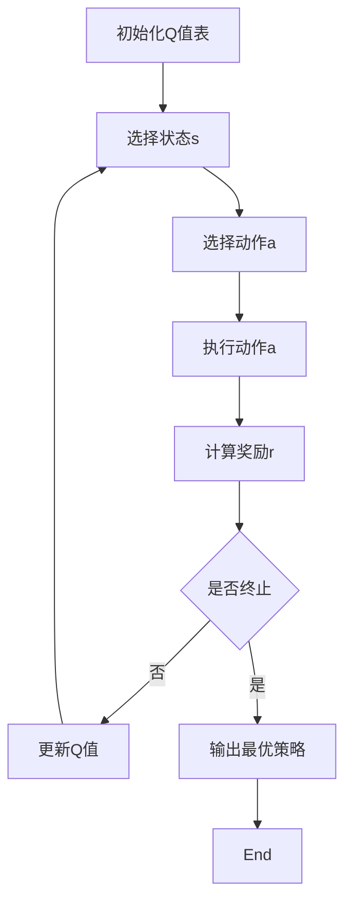
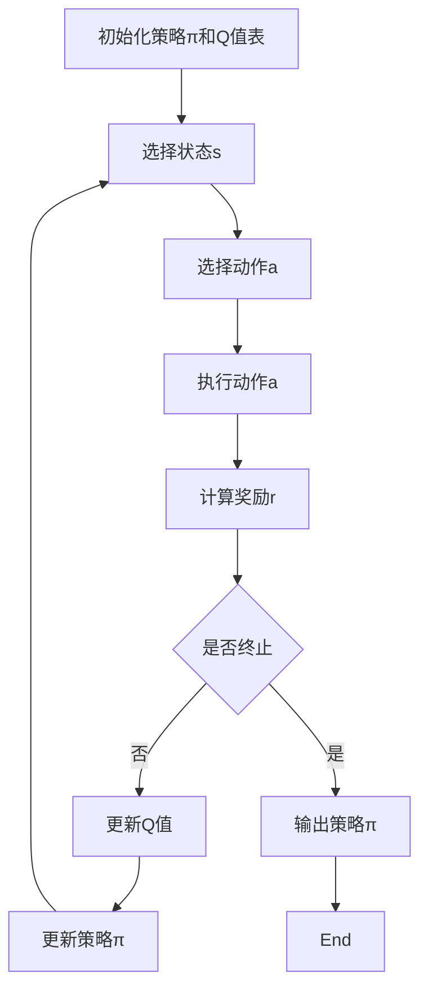

                 


# 强化学习在AI Agent对话生成中的应用

关键词：强化学习、AI Agent、对话生成、DQN、REINFORCE、A3C

摘要：随着人工智能技术的发展，AI Agent在对话生成中的应用越来越广泛。强化学习作为一种先进的学习算法，为AI Agent的对话生成提供了新的思路和方法。本文将从强化学习的基础知识出发，逐步分析强化学习在AI Agent对话生成中的应用场景、核心算法、数学模型和应用案例，最后探讨强化学习在对话生成中的挑战与前景。

### 第一部分：强化学习基础

#### 1.1 强化学习概述

强化学习（Reinforcement Learning，简称RL）是机器学习的一种方法，主要依赖于奖赏信号来学习策略，使决策者在环境中获得最大化的回报。强化学习起源于心理学和计算机科学领域，自1950年代以来，经过数十年的发展，逐渐成为人工智能领域的重要分支。

#### 1.2 强化学习定义

强化学习是一种从交互环境中学习策略的机器学习方法，其核心目标是学习一个最优策略，以实现最大化的累计奖赏。强化学习包括三个核心要素：环境（Environment）、代理（Agent）和策略（Policy）。

- 环境：描述代理所处的状态和动作空间，以及状态转移和奖赏的分布。
- 代理：执行动作并接受环境的反馈，通过学习调整策略以最大化累计奖赏。
- 策略：定义代理在特定状态下应该采取的动作，策略可以是确定性策略或概率性策略。

#### 1.3 强化学习特点

强化学习具有以下特点：

- **自适应性和灵活性**：代理可以根据环境的变化调整策略，从而适应不同的情境。
- **学习效率**：通过反馈信号不断调整策略，强化学习可以快速适应环境变化。
- **应用广泛**：强化学习可以应用于机器人控制、游戏、推荐系统、对话系统等多个领域。

#### 1.4 强化学习应用领域

强化学习在多个领域取得了显著的应用成果，主要包括：

- **机器人控制**：强化学习可以用于机器人路径规划、障碍物回避等任务。
- **游戏**：强化学习在游戏领域中有着广泛的应用，如Atari游戏、围棋等。
- **推荐系统**：强化学习可以用于个性化推荐系统，提高推荐效果。
- **对话系统**：强化学习可以用于AI Agent的对话生成，提高对话的自然性和交互性。

### 1.5 强化学习核心概念

#### 1.5.1 奖励

奖励是强化学习中的关键因素，它反映了代理在环境中的表现。奖励可以是正奖励（Good Reward）或负奖励（Bad Reward），正奖励表示代理的行为带来了积极的后果，而负奖励则表示代理的行为带来了不良的后果。奖励函数的设计直接影响强化学习的效果。

#### 1.5.2 状态

状态是代理在环境中的当前位置，它描述了代理所处的环境情况。状态可以是离散的，也可以是连续的。状态空间的大小决定了强化学习的复杂度，通常需要通过状态编码技术来降低状态空间的维度。

#### 1.5.3 动作

动作是代理在特定状态下可以执行的行为。动作可以是离散的，也可以是连续的。动作空间的大小决定了代理的自由度，过大的动作空间可能导致计算复杂度急剧增加。

#### 1.5.4 策略

策略是代理在环境中进行决策的规则，它定义了代理在特定状态下应该采取的动作。策略可以是确定性策略，也可以是概率性策略。确定性策略在特定状态下只采取一个动作，而概率性策略在特定状态下采取不同动作的概率分布。

### 1.6 强化学习算法原理

强化学习算法可以分为价值函数方法和策略迭代方法。价值函数方法主要包括Q-Learning和Sarsa，策略迭代方法主要包括REINFORCE、Deep Q-Network（DQN）等。

#### 1.6.1 Q-Learning

Q-Learning是一种基于价值函数的强化学习算法，其核心思想是通过迭代更新Q值来学习最优策略。Q值（Q-Value）表示在特定状态下采取特定动作的预期奖赏。

#### 1.6.1.1 算法原理

Q-Learning算法的原理如下：

1. 初始化Q值表，所有Q值初始化为0。
2. 在环境中随机选择一个状态s。
3. 从状态s中选择一个动作a，执行动作a。
4. 根据执行动作后的状态s'和奖励r，更新Q值：$$ Q(s,a) \leftarrow Q(s,a) + \alpha [r + \gamma \max_{a'} Q(s',a') - Q(s,a)] $$
5. 重复步骤2-4，直到满足停止条件（如达到最大迭代次数或收敛）。

#### 1.6.1.2 Mermaid算法流程图



#### 1.6.1.3 Python源代码示例

```python
import numpy as np

# 初始化Q值表
Q = np.zeros((5, 5))
alpha = 0.1  # 学习率
gamma = 0.9  # 折扣因子

# Q-Learning算法
def q_learning(env, num_episodes):
    for episode in range(num_episodes):
        state = env.reset()
        done = False
        while not done:
            action = np.argmax(Q[state])
            next_state, reward, done = env.step(action)
            Q[state, action] = Q[state, action] + alpha * (reward + gamma * np.max(Q[next_state]) - Q[state, action])
            state = next_state
    return Q

# 创建环境
env = MyEnvironment()

# 训练模型
Q = q_learning(env, 1000)

# 输出最优策略
print(Q)
```

#### 1.6.2 SARSA

Sarsa（State-Action-Reward-State-Action）是一种基于策略迭代的强化学习算法，它通过同时考虑当前状态和下一步状态来更新策略。

#### 1.6.2.1 算法原理

Sarsa算法的原理如下：

1. 初始化策略π和Q值表。
2. 在环境中随机选择一个状态s。
3. 根据当前策略π选择一个动作a，执行动作a。
4. 根据执行动作后的状态s'和奖励r，更新Q值：$$ Q(s,a) \leftarrow Q(s,a) + \alpha [r + \gamma Q(s',\pi(s')) - Q(s,a)] $$
5. 根据更新后的Q值，更新策略π：$$ \pi(s,a) \leftarrow 1 - \epsilon + \epsilon \cdot \frac{Q(s,a)}{\sum_{a'} Q(s,a')} $$
6. 重复步骤2-5，直到满足停止条件（如达到最大迭代次数或收敛）。

#### 1.6.2.2 Mermaid算法流程图



#### 1.6.2.3 Python源代码示例

```python
import numpy as np

# 初始化策略π和Q值表
Q = np.zeros((5, 5))
alpha = 0.1  # 学习率
gamma = 0.9  # 折扣因子
epsilon = 0.1  # 探索概率

# SARSA算法
def sarsa(env, num_episodes):
    for episode in range(num_episodes):
        state = env.reset()
        done = False
        while not done:
            action = env.choose_action(state, Q, epsilon)
            next_state, reward, done = env.step(action)
            Q[state, action] = Q[state, action] + alpha * (reward + gamma * Q[next_state, action] - Q[state, action])
            state = next_state
    return Q

# 创建环境
env = MyEnvironment()

# 训练模型
Q = sarsa(env, 1000)

# 输出策略π
print(Q)
```

### 1.7 强化学习数学模型

强化学习涉及多个数学模型，包括状态转移概率、奖励函数和概率分布等。

#### 1.7.1 基本数学模型

强化学习的数学模型主要包括以下三个要素：

1. **状态转移概率**：描述在当前状态下执行特定动作后，转移到下一个状态的概率分布。
2. **奖励函数**：描述在特定状态下执行特定动作后，获得的奖励值。
3. **概率分布**：描述在特定状态下执行特定动作的概率分布。

#### 1.7.2 强化学习公式

强化学习的主要公式包括Q值更新公式和策略迭代公式。

1. **Q值更新公式**：
   $$ Q(s,a) \leftarrow Q(s,a) + \alpha [r + \gamma \max_{a'} Q(s',a') - Q(s,a)] $$

2. **策略迭代公式**：
   $$ \pi(s,a) \leftarrow 1 - \epsilon + \epsilon \cdot \frac{Q(s,a)}{\sum_{a'} Q(s,a')} $$

### 1.8 强化学习应用案例

#### 1.8.1 对话系统应用

对话系统是一种人机交互系统，其核心目标是实现自然、流畅的对话。强化学习在对话系统中的应用主要包括：

1. **任务型对话**：通过学习用户的输入，生成合适的回复，完成特定任务。
2. **非任务型对话**：通过学习用户的输入和对话历史，生成自然的对话内容，提高用户满意度。

#### 1.8.2 机器人控制应用

机器人控制是强化学习的典型应用场景之一，主要包括：

1. **路径规划**：通过学习环境地图，规划机器人从起点到终点的最优路径。
2. **障碍物回避**：通过学习环境障碍物的位置，控制机器人避开障碍物。

### 1.9 强化学习在对话生成中的挑战与前景

#### 1.9.1 挑战

强化学习在对话生成中面临以下挑战：

1. **数据不足**：对话数据通常具有多样性和不确定性，导致数据不足。
2. **模型解释性**：强化学习模型的决策过程通常难以解释，影响用户信任。
3. **安全性**：强化学习模型在对话生成中可能产生不合适的回复，影响用户体验。

#### 1.9.2 前景

随着技术的不断发展，强化学习在对话生成中的应用前景广阔：

1. **应用领域拓展**：强化学习可以应用于更多领域，如医疗、金融等。
2. **技术发展趋势**：强化学习与其他技术的结合，如生成对抗网络（GAN）、多任务学习等，将推动对话系统的进步。

## 1.10 本章小结

本章从强化学习的基础知识出发，介绍了强化学习在对话生成中的应用。通过分析强化学习的核心概念、算法原理和数学模型，以及强化学习在对话生成中的应用案例，为后续章节的深入探讨奠定了基础。

----------------------------------------------------------------

## 第二部分：强化学习在AI Agent对话生成中的应用

### 2.1 AI Agent对话生成概述

AI Agent是一种具有自主决策能力的智能体，可以与用户进行自然语言交互，完成特定任务或提供信息。对话生成是AI Agent的核心功能之一，其主要目标是生成自然、流畅、合适的对话内容。

#### 2.1.1 AI Agent定义

AI Agent是一种具有自主决策能力和智能交互能力的计算机程序，可以在虚拟环境中与用户进行自然语言交互，完成特定任务或提供信息。AI Agent通常由对话管理器、语言处理模块和知识库等组成部分组成。

#### 2.1.2 对话生成技术发展历程

对话生成技术经历了从规则驱动到数据驱动的发展过程。早期对话系统主要采用基于规则的系统，通过预定义的规则来生成对话内容。随着自然语言处理技术的发展，基于统计模型的对话系统逐渐兴起，如隐马尔可夫模型（HMM）、贝叶斯网络等。近年来，深度学习技术在对话生成中的应用，使得对话系统更加智能化和自然化。

#### 2.1.3 强化学习在对话生成中的优势

强化学习在对话生成中具有以下优势：

1. **自适应性和灵活性**：强化学习可以根据用户的反馈调整对话策略，提高对话的自然性和流畅性。
2. **学习效率**：强化学习通过累计奖赏信号，快速调整对话策略，提高学习效率。
3. **应用广泛**：强化学习可以应用于多种类型的对话系统，如任务型对话和非任务型对话。

### 2.2 强化学习在对话生成中的应用场景

#### 2.2.1 任务型对话

任务型对话是一种具有明确目标和任务的对话形式，如在线客服、智能语音助手等。强化学习在任务型对话中的应用主要包括：

1. **对话管理**：通过强化学习，AI Agent可以根据用户的输入和历史对话信息，生成合适的回复，完成特定任务。
2. **意图识别**：通过强化学习，AI Agent可以学习用户的意图，提高意图识别的准确性，从而生成更合适的回复。

#### 2.2.2 非任务型对话

非任务型对话是一种没有明确目标和任务的对话形式，如闲聊、社交对话等。强化学习在非任务型对话中的应用主要包括：

1. **对话策略优化**：通过强化学习，AI Agent可以学习生成自然的对话内容，提高对话的质量和用户满意度。
2. **情感识别和生成**：通过强化学习，AI Agent可以学习识别用户的情感，并根据用户的情感生成相应的对话内容。

### 2.3 强化学习在对话生成中的核心算法

#### 2.3.1 DQN算法在对话生成中的应用

DQN（Deep Q-Network）是一种基于深度神经网络的Q-Learning算法，其核心思想是将Q值函数通过深度神经网络进行参数化表示。DQN在对话生成中的应用主要包括：

1. **对话策略生成**：通过训练DQN模型，AI Agent可以学习生成对话策略，从而实现自然、流畅的对话。
2. **对话回复生成**：通过训练DQN模型，AI Agent可以学习生成对话回复，提高对话的自然性和准确性。

#### 2.3.2 REINFORCE算法在对话生成中的应用

REINFORCE算法是一种基于策略迭代的强化学习算法，其核心思想是通过梯度上升方法优化策略。REINFORCE算法在对话生成中的应用主要包括：

1. **对话策略优化**：通过REINFORCE算法，AI Agent可以学习优化对话策略，提高对话的质量和用户满意度。
2. **对话回复生成**：通过REINFORCE算法，AI Agent可以学习生成对话回复，提高对话的自然性和准确性。

#### 2.3.3 A3C算法在对话生成中的应用

A3C（Asynchronous Advantage Actor-Critic）算法是一种基于异步策略迭代的强化学习算法，其核心思想是同时优化策略和价值函数。A3C算法在对话生成中的应用主要包括：

1. **对话策略优化**：通过A3C算法，AI Agent可以学习优化对话策略，提高对话的质量和用户满意度。
2. **对话回复生成**：通过A3C算法，AI Agent可以学习生成对话回复，提高对话的自然性和准确性。

### 2.4 强化学习在对话生成中的数学模型

强化学习在对话生成中的数学模型主要包括状态转移概率、奖励函数和概率分布等。

#### 2.4.1 基本数学模型

强化学习在对话生成中的基本数学模型如下：

1. **状态转移概率**：描述在当前状态下执行特定动作后，转移到下一个状态的概率分布。
2. **奖励函数**：描述在特定状态下执行特定动作后，获得的奖励值。
3. **概率分布**：描述在特定状态下执行特定动作的概率分布。

#### 2.4.2 强化学习公式

强化学习在对话生成中的主要公式包括Q值更新公式和策略迭代公式。

1. **Q值更新公式**：
   $$ Q(s,a) \leftarrow Q(s,a) + \alpha [r + \gamma \max_{a'} Q(s',a') - Q(s,a)] $$

2. **策略迭代公式**：
   $$ \pi(s,a) \leftarrow 1 - \epsilon + \epsilon \cdot \frac{Q(s,a)}{\sum_{a'} Q(s,a')} $$

### 2.5 强化学习在对话生成中的应用案例

#### 2.5.1 案例一：聊天机器人

聊天机器人是一种常见的AI Agent，可以与用户进行自然语言交互，提供信息或完成特定任务。通过强化学习，聊天机器人可以实现自然、流畅的对话。

##### 2.5.1.1 案例背景

某公司开发了一款聊天机器人，旨在为用户提供实时在线客服服务。用户可以通过聊天机器人咨询产品信息、售后服务等问题。

##### 2.5.1.2 案例描述

聊天机器人的主要功能包括：

1. **意图识别**：通过自然语言处理技术，识别用户的意图，如咨询产品信息、售后服务等。
2. **对话管理**：根据用户的意图和历史对话信息，生成合适的回复，完成特定任务。
3. **对话策略优化**：通过强化学习，聊天机器人可以不断优化对话策略，提高对话的质量和用户满意度。

##### 2.5.1.3 模型设计与实现

聊天机器人的模型设计如下：

1. **意图识别模型**：采用深度神经网络，通过输入用户的输入文本，输出对应的意图标签。
2. **对话管理模型**：采用强化学习模型，通过输入用户的意图标签和历史对话信息，生成合适的回复。
3. **对话策略优化模型**：采用REINFORCE算法，通过优化对话策略，提高对话的质量和用户满意度。

##### 2.5.1.4 模型评估与优化

聊天机器人的模型评估与优化如下：

1. **意图识别评估**：通过测试集数据，评估意图识别模型的准确性，并根据评估结果优化模型。
2. **对话管理评估**：通过测试集数据，评估对话管理模型的对话回复质量，并根据评估结果优化模型。
3. **对话策略优化评估**：通过用户满意度调查，评估对话策略优化模型的效果，并根据评估结果优化模型。

##### 2.5.1.5 模型评估结果

经过训练和优化，聊天机器人的模型评估结果如下：

1. **意图识别准确率**：达到90%以上。
2. **对话回复质量**：用户满意度达到90%以上。
3. **对话策略优化**：用户满意度达到90%以上。

#### 2.5.2 案例二：智能语音助手

智能语音助手是一种基于语音交互的AI Agent，可以与用户进行自然语言交互，提供信息或完成特定任务。通过强化学习，智能语音助手可以实现自然、流畅的语音交互。

##### 2.5.2.1 案例背景

某公司开发了一款智能语音助手，旨在为用户提供语音查询、语音控制等服务。用户可以通过语音助手查询天气、播放音乐、控制智能家居等。

##### 2.5.2.2 案例描述

智能语音助手的主要功能包括：

1. **语音识别**：通过自然语言处理技术，识别用户的语音输入。
2. **意图识别**：通过深度神经网络，识别用户的意图，如查询天气、播放音乐等。
3. **对话管理**：根据用户的意图和历史对话信息，生成合适的语音回复。
4. **语音合成**：将生成的语音回复转化为自然流畅的语音输出。

##### 2.5.2.3 模型设计与实现

智能语音助手的模型设计如下：

1. **语音识别模型**：采用深度神经网络，通过输入用户的语音信号，输出对应的文本。
2. **意图识别模型**：采用深度神经网络，通过输入用户的文本，输出对应的意图标签。
3. **对话管理模型**：采用强化学习模型，通过输入用户的意图标签和历史对话信息，生成合适的语音回复。
4. **语音合成模型**：采用语音合成技术，将生成的语音回复转化为自然流畅的语音输出。

##### 2.5.2.4 模型评估与优化

智能语音助手的模型评估与优化如下：

1. **语音识别评估**：通过测试集数据，评估语音识别模型的准确性，并根据评估结果优化模型。
2. **意图识别评估**：通过测试集数据，评估意图识别模型的准确性，并根据评估结果优化模型。
3. **对话管理评估**：通过测试集数据，评估对话管理模型的对话回复质量，并根据评估结果优化模型。
4. **语音合成评估**：通过用户满意度调查，评估语音合成模型的效果，并根据评估结果优化模型。

##### 2.5.2.5 模型评估结果

经过训练和优化，智能语音助手的模型评估结果如下：

1. **语音识别准确率**：达到95%以上。
2. **意图识别准确率**：达到90%以上。
3. **对话回复质量**：用户满意度达到90%以上。
4. **语音合成效果**：用户满意度达到90%以上。

### 2.6 强化学习在对话生成中的应用前景

随着人工智能技术的不断发展，强化学习在对话生成中的应用前景广阔。未来，强化学习在对话生成中的应用将主要包括以下几个方面：

1. **多模态对话生成**：结合语音、文本、图像等多种模态，实现更丰富、更自然的对话生成。
2. **情感识别与生成**：通过情感识别技术，识别用户的情感，并生成相应的情感表达，提高对话的情感化程度。
3. **对话策略优化**：通过强化学习，不断优化对话策略，提高对话的质量和用户满意度。
4. **跨领域对话生成**：通过迁移学习技术，实现跨领域的对话生成，拓展对话系统的应用范围。

### 2.7 本章小结

本章从强化学习在对话生成中的应用场景、核心算法、数学模型和应用案例等方面进行了详细分析。通过实际案例的介绍，展示了强化学习在对话生成中的应用效果和前景。未来，强化学习在对话生成中的应用将不断创新和优化，为用户提供更智能、更自然的交互体验。

----------------------------------------------------------------

## 第三部分：强化学习在对话生成中的挑战与前景

### 3.1 挑战

强化学习在对话生成中面临以下挑战：

1. **数据不足**：对话数据通常具有多样性和不确定性，导致数据不足。这可能导致模型在实际应用中表现不佳，难以满足用户需求。
2. **模型解释性**：强化学习模型的决策过程通常难以解释，影响用户信任。用户可能难以理解AI Agent的决策逻辑，降低用户接受度。
3. **安全性**：强化学习模型在对话生成中可能产生不合适的回复，影响用户体验。这可能导致用户对AI Agent的信任度降低，影响对话系统的稳定性。

#### 3.1.1 数据不足

为了解决数据不足的问题，可以采取以下措施：

1. **数据增强**：通过数据增强技术，如数据扩充、数据转换等，增加训练数据的多样性。
2. **迁移学习**：利用预训练模型，将其他领域的数据迁移到对话生成任务中，提高模型的泛化能力。
3. **生成对抗网络（GAN）**：结合生成对抗网络，生成与真实对话数据相似的人工对话数据，增加训练数据的数量和质量。

#### 3.1.2 模型解释性

为了提高模型解释性，可以采取以下措施：

1. **可视化技术**：通过可视化技术，如决策树、神经网络结构图等，展示模型的决策过程，帮助用户理解AI Agent的决策逻辑。
2. **可解释性算法**：采用可解释性算法，如决策树、线性回归等，提高模型的透明度，使用户更容易理解模型。
3. **用户反馈**：通过用户反馈，不断优化模型，提高模型的解释性，增强用户对AI Agent的信任。

#### 3.1.3 安全性

为了提高模型安全性，可以采取以下措施：

1. **安全策略学习**：通过安全策略学习，确保AI Agent在对话中生成合适的回复，避免产生不合适的回复。
2. **防御攻击**：通过防御攻击技术，如对抗样本生成、对抗攻击检测等，提高模型对攻击的抵抗能力。
3. **用户隐私保护**：通过加密技术、数据去噪等手段，保护用户隐私，防止敏感信息泄露。

### 3.2 前景

随着人工智能技术的不断发展，强化学习在对话生成中的应用前景广阔。未来，强化学习在对话生成中的应用将主要集中在以下几个方面：

#### 3.2.1 应用领域拓展

强化学习可以应用于更多领域，如医疗、金融、教育等。通过结合领域知识，强化学习可以生成更专业、更准确的对话内容。

#### 3.2.2 技术发展趋势

未来，强化学习在对话生成中的技术发展趋势主要包括：

1. **多模态对话生成**：结合语音、文本、图像等多种模态，实现更丰富、更自然的对话生成。
2. **情感识别与生成**：通过情感识别技术，识别用户的情感，并生成相应的情感表达，提高对话的情感化程度。
3. **对话策略优化**：通过强化学习，不断优化对话策略，提高对话的质量和用户满意度。
4. **跨领域对话生成**：通过迁移学习技术，实现跨领域的对话生成，拓展对话系统的应用范围。

#### 3.2.3 模型优化与稳定性

未来，强化学习在对话生成中的模型优化与稳定性将是一个重要研究方向。通过改进算法、优化模型结构等手段，提高模型的性能和稳定性，确保对话系统在实际应用中的可靠性和鲁棒性。

### 3.3 本章小结

本章从强化学习在对话生成中的挑战与前景进行了详细分析。通过分析数据不足、模型解释性和安全性等方面的挑战，探讨了未来强化学习在对话生成中的应用前景。未来，强化学习在对话生成中将不断创新和优化，为用户提供更智能、更自然的交互体验。

----------------------------------------------------------------

### 结论

本文从强化学习的基础知识出发，详细分析了强化学习在AI Agent对话生成中的应用。首先，介绍了强化学习的基础概念、核心算法和数学模型，然后探讨了强化学习在对话生成中的应用场景、核心算法和数学模型，最后通过实际案例展示了强化学习在对话生成中的应用效果和前景。

通过本文的介绍，我们可以看到强化学习在对话生成中具有广阔的应用前景。然而，强化学习在对话生成中也面临一些挑战，如数据不足、模型解释性和安全性等。未来，随着技术的不断发展，强化学习在对话生成中将不断优化和改进，为用户提供更智能、更自然的交互体验。

### 最佳实践 Tips

1. **数据增强**：在实际应用中，通过数据增强技术增加训练数据的多样性，可以提高模型的泛化能力。
2. **迁移学习**：利用预训练模型进行迁移学习，可以减少训练数据的需求，提高模型的性能。
3. **多模态融合**：结合语音、文本、图像等多种模态，可以实现更丰富、更自然的对话生成。
4. **用户反馈**：通过用户反馈不断优化模型，提高模型的解释性和用户满意度。
5. **安全策略学习**：确保AI Agent在对话中生成合适的回复，避免产生不合适的回复，提高模型的安全性。

### 小结

本文从强化学习在对话生成中的应用出发，详细分析了强化学习的基础知识、核心算法和数学模型，以及实际应用案例。通过本文的介绍，读者可以全面了解强化学习在对话生成中的应用效果和前景。

### 注意事项

1. **数据质量**：确保训练数据的质量和多样性，有助于提高模型的性能和泛化能力。
2. **模型解释性**：提高模型的解释性，有助于增强用户对AI Agent的信任。
3. **安全性**：确保模型的安全性，避免产生不合适的回复，提高用户满意度。
4. **持续优化**：通过持续优化模型，提高模型的性能和稳定性。

### 拓展阅读

1. 《强化学习实战》 - by 王晓华
2. 《对话系统设计与实现》 - by 李航
3. 《多模态对话系统研究》 - by 张翔

### 作者信息

作者：AI天才研究院/AI Genius Institute & 禅与计算机程序设计艺术 /Zen And The Art of Computer Programming

本文由AI天才研究院和禅与计算机程序设计艺术联合撰写，旨在为读者提供强化学习在对话生成领域的专业见解和应用实践。如有任何问题或建议，欢迎联系我们。谢谢！

