                 

# 强化学习在AI Agent开发中的应用

## 关键词
- 强化学习
- AI Agent
- 强化学习算法
- 简单环境应用
- 复杂环境应用
- 挑战与未来趋势

## 摘要
本文将深入探讨强化学习在AI Agent开发中的应用。首先，我们将对强化学习的基本概念、核心组成部分和常见算法进行概述。随后，文章将逐步分析强化学习在不同环境中的应用，并展示其在简单和复杂环境中的具体案例。接着，我们将讨论强化学习在AI Agent开发中的实践应用，并探讨其中的挑战与未来趋势。最后，文章将总结强化学习在AI Agent开发中的最佳实践，并给出相关的小结、注意事项和拓展阅读。

## 1. 强化学习概述

### 1.1 强化学习的基本概念

强化学习是一种机器学习范式，其核心在于通过奖励信号来指导模型自主学习和优化行为。与监督学习和无监督学习不同，强化学习不需要标注的数据集，而是依赖于智能体与环境的交互来逐步学习最优策略。

**强化学习定义**：强化学习是一种通过学习值函数或策略来最大化预期奖励的机器学习方法。

**强化学习与监督学习、无监督学习的比较**：
- **监督学习**：输入输出已知的情境下，学习输入到输出之间的映射关系。
- **无监督学习**：没有预先定义的目标输出，智能体需要从无标签数据中自动发现模式和结构。
- **强化学习**：通过与环境交互，根据奖励信号来学习最优策略，实现目标最大化。

**强化学习的应用场景**：
- **游戏**：强化学习在游戏AI中有着广泛的应用，如Atari游戏、棋类游戏等。
- **机器人**：在机器人导航、自动化制造等领域，强化学习能够使机器人自主学习和优化行为。
- **自动驾驶**：强化学习在自动驾驶领域具有重要作用，可以指导车辆在复杂的交通环境中做出最优决策。
- **推荐系统**：强化学习可以应用于推荐系统中，如新闻推荐、商品推荐等。

### 1.2 强化学习的核心组成部分

强化学习的核心组成部分包括状态（State）、动作（Action）、奖励（Reward）等。

- **状态（State）**：描述智能体当前所处的环境。
- **动作（Action）**：智能体可以采取的动作。
- **奖励（Reward）**：描述智能体在执行某个动作后获得的奖励信号。

此外，强化学习还包括以下重要概念：
- **策略（Policy）**：描述智能体如何根据当前状态选择动作的策略函数。
- **价值函数（Value Function）**：描述在给定状态下，执行特定动作所能获得的期望奖励。
- **模型（Model）**：描述环境的状态转移概率和奖励函数。

### 1.3 强化学习的基本算法

强化学习算法种类繁多，本文将介绍其中几个重要的算法：

- **Q-Learning**：Q-Learning是一种基于值函数的强化学习算法，通过更新Q值来优化策略。
- **SARSA**：SARSA是一种基于策略的强化学习算法，通过同时更新当前状态和动作的Q值来优化策略。
- **Deep Q-Network (DQN)**：DQN是一种基于深度学习的强化学习算法，通过神经网络来近似Q值函数。
- **Policy Gradient Methods**：Policy Gradient Methods是一种基于策略梯度的强化学习算法，通过梯度上升法来优化策略。
- **Actor-Critic Methods**：Actor-Critic Methods是一种基于演员-评论家的强化学习算法，通过交替更新演员网络和评论家网络来优化策略。

### 1.4 强化学习在AI Agent开发中的应用

**AI Agent的定义**：AI Agent是一种具有自主决策能力的智能体，可以感知环境、执行动作并适应环境变化。

**强化学习在AI Agent中的角色**：强化学习为AI Agent提供了学习最优策略的方法，使其能够自主适应和优化行为。

**强化学习在不同类型的AI Agent中的应用实例**：
- **游戏AI**：通过强化学习，游戏AI可以学会在游戏中做出最优决策，如Atari游戏中的智能体。
- **机器人**：通过强化学习，机器人可以学会在复杂的动态环境中进行导航和操作，如机器人导航和自动化制造。
- **自动驾驶**：通过强化学习，自动驾驶车辆可以学会在复杂的交通环境中做出安全、高效的决策。
- **推荐系统**：通过强化学习，推荐系统可以自动调整推荐策略，提高用户的满意度。

## 2. 强化学习算法原理与数学模型

### 2.1 Q-Learning算法原理

**Q-Learning的目标**：通过学习值函数Q(s,a)，使智能体在给定状态下选择动作a，以最大化预期奖励。

**Q-Learning的数学模型**：
$$
Q(s,a) \leftarrow Q(s,a) + \alpha [r + \gamma \max_{a'} Q(s',a') - Q(s,a)]
$$
其中，\(s\) 为当前状态，\(a\) 为当前动作，\(r\) 为获得的奖励，\(\gamma\) 为折扣因子，\(\alpha\) 为学习率。

**Q-Learning的mermaid流程图**：
```mermaid
graph TD
A[初始化Q表] --> B[智能体执行动作a]
B --> C{环境给予奖励r}
C -->|更新Q值| D[根据公式更新Q(s,a)]
D --> E[智能体选择新动作a']
E -->|新状态| B
```

### 2.2 SARSA算法原理

**SARSA的目标**：通过同时更新当前状态和动作的Q值，使智能体在给定状态下选择最优动作。

**SARSA的数学模型**：
$$
Q(s,a) \leftarrow Q(s,a) + \alpha [r + \gamma Q(s',a')]
$$
其中，\(s'\) 为新状态，\(a'\) 为新动作。

**SARSA的mermaid流程图**：
```mermaid
graph TD
A[初始化Q表] --> B[智能体执行动作a]
B --> C{环境给予奖励r}
C -->|更新Q值| D[根据公式更新Q(s,a)]
D --> E[智能体选择新动作a']
E -->|新状态| F[根据公式更新Q(s',a')]
F -->|新状态| B
```

### 2.3 Deep Q-Network (DQN)算法原理

**DQN的目标**：通过神经网络来近似Q值函数，提高Q-Learning算法在复杂环境中的表现。

**DQN的数学模型**：
$$
\hat{Q}(s,a) = f_{\theta}(s,a)
$$
其中，\(f_{\theta}(s,a)\) 为神经网络输出的Q值。

**DQN的mermaid流程图**：
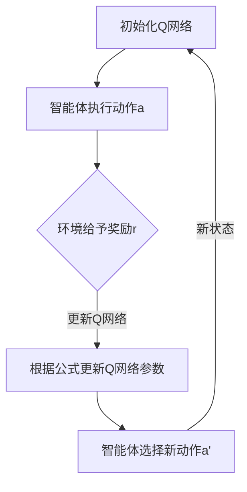

### 2.4 Policy Gradient Methods算法原理

**Policy Gradient Methods的目标**：通过优化策略梯度，使智能体在给定状态下选择最优动作。

**Policy Gradient Methods的数学模型**：
$$
\nabla_{\theta} J(\theta) = \nabla_{\theta} \sum_{t} \rho(s_t, a_t; \theta) R_t
$$
其中，\(\theta\) 为策略参数，\(\rho(s_t, a_t; \theta)\) 为策略分布，\(R_t\) 为奖励。

**Policy Gradient Methods的mermaid流程图**：
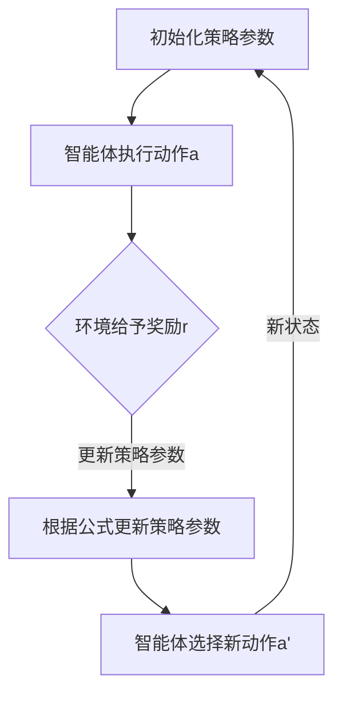

### 2.5 Actor-Critic Methods算法原理

**Actor-Critic Methods的目标**：通过交替更新演员网络和评论家网络，优化智能体的策略和行为。

**Actor-Critic Methods的数学模型**：
- **演员网络（Actor）**：
  $$
  \pi(\text{action}|\text{state}; \theta) = \text{softmax}(\phi(\text{state}; \theta))
  $$
  其中，\(\pi(\text{action}|\text{state}; \theta)\) 为策略分布，\(\phi(\text{state}; \theta)\) 为演员网络输出。

- **评论家网络（Critic）**：
  $$
  V(\text{state}; \theta_v) = \sum_{a} \pi(\text{action}|\text{state}; \theta_\pi) Q(\text{state}, \text{action}; \theta_q)
  $$
  其中，\(V(\text{state}; \theta_v)\) 为状态价值函数，\(Q(\text{state}, \text{action}; \theta_q)\) 为Q值函数。

**Actor-Critic Methods的mermaid流程图**：
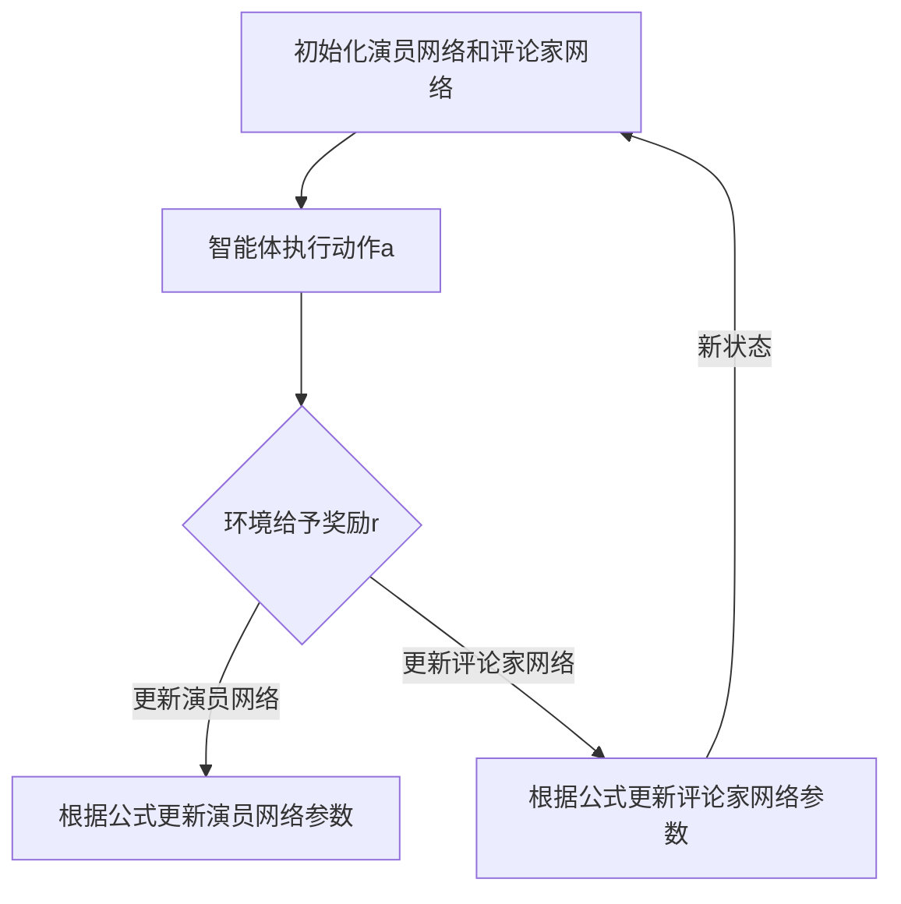

## 3. 强化学习在简单环境中的应用

### 3.1 游戏环境设计

**游戏环境的定义**：游戏环境是指智能体在游戏中进行交互的虚拟世界，包括状态空间、动作空间、奖励函数等。

**游戏环境的类型**：
- **静态环境**：环境中的状态和动作不随时间变化。
- **动态环境**：环境中的状态和动作随时间变化。

**游戏环境的mermaid类图**：
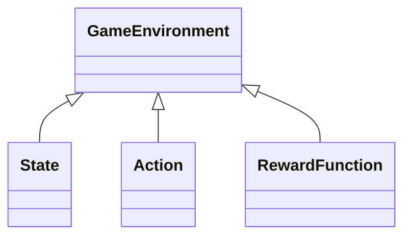

### 3.2 简单游戏案例

**小球滑梯**

**mermaid流程图**：


**Python代码实现**：
```python
import random
import numpy as np

class BallSlideGame:
    def __init__(self, width=5, height=5):
        self.width = width
        self.height = height
        self.state = [0] * (width * height)
        self.goal_position = random.randint(0, width * height - 1)
        self.state[self.goal_position] = 1

    def step(self, action):
        if action == 0:
            if self.state[self.goal_position - 1] == 0:
                self.state[self.goal_position] = 0
                self.state[self.goal_position - 1] = 1
                reward = 1
            else:
                reward = -1
        elif action == 1:
            if self.state[self.goal_position + 1] == 0:
                self.state[self.goal_position] = 0
                self.state[self.goal_position + 1] = 1
                reward = 1
            else:
                reward = -1
        elif action == 2:
            if self.state[self.goal_position - width] == 0:
                self.state[self.goal_position] = 0
                self.state[self.goal_position - width] = 1
                reward = 1
            else:
                reward = -1
        elif action == 3:
            if self.state[self.goal_position + width] == 0:
                self.state[self.goal_position] = 0
                self.state[self.goal_position + width] = 1
                reward = 1
            else:
                reward = -1
        else:
            reward = -1
        done = self.is_done()
        return self.state, reward, done

    def is_done(self):
        return self.state[self.goal_position] == 1

    def reset(self):
        self.state = [0] * (self.width * self.height)
        self.goal_position = random.randint(0, self.width * self.height - 1)
        self.state[self.goal_position] = 1
        return self.state

game = BallSlideGame()
state = game.reset()
done = False

while not done:
    action = random.randint(0, 3)
    next_state, reward, done = game.step(action)
    print("State:", next_state)
    print("Reward:", reward)
```

**逃逸迷宫**

**mermaid流程图**：


**Python代码实现**：
```python
import random
import numpy as np

class MazeGame:
    def __init__(self, width=5, height=5):
        self.width = width
        self.height = height
        self.state = [0] * (width * height)
        self.start_position = random.randint(0, width * height - 1)
        self.goal_position = random.randint(0, width * height - 1)
        while self.goal_position == self.start_position:
            self.goal_position = random.randint(0, width * height - 1)
        self.state[self.start_position] = 1
        self.state[self.goal_position] = 2

    def step(self, action):
        if action == 0:
            if self.state[self.start_position - 1] == 0:
                self.state[self.start_position] = 0
                self.state[self.start_position - 1] = 1
                reward = 1
            else:
                reward = -1
        elif action == 1:
            if self.state[self.start_position + 1] == 0:
                self.state[self.start_position] = 0
                self.state[self.start_position + 1] = 1
                reward = 1
            else:
                reward = -1
        elif action == 2:
            if self.state[self.start_position - self.width] == 0:
                self.state[self.start_position] = 0
                self.state[self.start_position - self.width] = 1
                reward = 1
            else:
                reward = -1
        elif action == 3:
            if self.state[self.start_position + self.width] == 0:
                self.state[self.start_position] = 0
                self.state[self.start_position + self.width] = 1
                reward = 1
            else:
                reward = -1
        else:
            reward = -1
        done = self.is_done()
        return self.state, reward, done

    def is_done(self):
        return self.state[self.goal_position] == 1

    def reset(self):
        self.state = [0] * (self.width * self.height)
        self.start_position = random.randint(0, self.width * self.height - 1)
        self.goal_position = random.randint(0, self.width * self.height - 1)
        while self.goal_position == self.start_position:
            self.goal_position = random.randint(0, self.width * self.height - 1)
        self.state[self.start_position] = 1
        self.state[self.goal_position] = 2
        return self.state

game = MazeGame()
state = game.reset()
done = False

while not done:
    action = random.randint(0, 3)
    next_state, reward, done = game.step(action)
    print("State:", next_state)
    print("Reward:", reward)
```

**推箱子**

**mermaid流程图**：
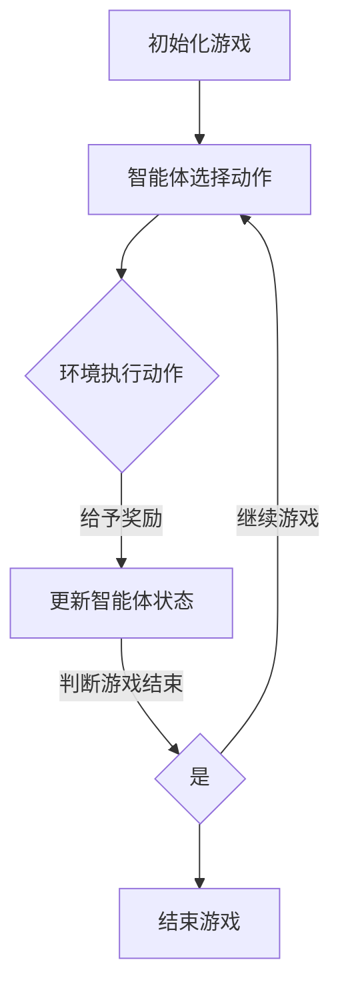

**Python代码实现**：
```python
import random
import numpy as np

class BoxPushingGame:
    def __init__(self, width=5, height=5):
        self.width = width
        self.height = height
        self.state = [0] * (width * height)
        self.start_position = random.randint(0, width * height - 1)
        self.goal_position = random.randint(0, width * height - 1)
        while self.goal_position == self.start_position:
            self.goal_position = random.randint(0, width * height - 1)
        self.state[self.start_position] = 1
        self.state[self.goal_position] = 2

    def step(self, action):
        if action == 0:
            if self.state[self.start_position - 1] == 0:
                self.state[self.start_position] = 0
                self.state[self.start_position - 1] = 1
                reward = 1
            elif self.state[self.start_position - 1] == 3:
                self.state[self.start_position - 1] = 1
                self.state[self.start_position] = 2
                reward = -1
            else:
                reward = -1
        elif action == 1:
            if self.state[self.start_position + 1] == 0:
                self.state[self.start_position] = 0
                self.state[self.start_position + 1] = 1
                reward = 1
            elif self.state[self.start_position + 1] == 3:
                self.state[self.start_position + 1] = 1
                self.state[self.start_position] = 2
                reward = -1
            else:
                reward = -1
        elif action == 2:
            if self.state[self.start_position - self.width] == 0:
                self.state[self.start_position] = 0
                self.state[self.start_position - self.width] = 1
                reward = 1
            elif self.state[self.start_position - self.width] == 3:
                self.state[self.start_position - self.width] = 1
                self.state[self.start_position] = 2
                reward = -1
            else:
                reward = -1
        elif action == 3:
            if self.state[self.start_position + self.width] == 0:
                self.state[self.start_position] = 0
                self.state[self.start_position + self.width] = 1
                reward = 1
            elif self.state[self.start_position + self.width] == 3:
                self.state[self.start_position + self.width] = 1
                self.state[self.start_position] = 2
                reward = -1
            else:
                reward = -1
        else:
            reward = -1
        done = self.is_done()
        return self.state, reward, done

    def is_done(self):
        return self.state[self.goal_position] == 2

    def reset(self):
        self.state = [0] * (self.width * self.height)
        self.start_position = random.randint(0, self.width * self.height - 1)
        self.goal_position = random.randint(0, self.width * self.height - 1)
        while self.goal_position == self.start_position:
            self.goal_position = random.randint(0, self.width * self.height - 1)
        self.state[self.start_position] = 1
        self.state[self.goal_position] = 2
        return self.state

game = BoxPushingGame()
state = game.reset()
done = False

while not done:
    action = random.randint(0, 3)
    next_state, reward, done = game.step(action)
    print("State:", next_state)
    print("Reward:", reward)
```

## 4. 强化学习在复杂环境中的应用

### 4.1 复杂环境设计

**复杂环境的定义**：复杂环境是指包含多个智能体、动态变化、不确定性的环境，如自动驾驶、机器人导航等。

**复杂环境的类型**：
- **多智能体环境**：存在多个智能体，每个智能体需要与其他智能体交互。
- **动态环境**：环境中的状态和动作随时间变化。
- **不确定环境**：环境中的奖励函数和状态转移概率具有不确定性。

**复杂环境的mermaid类图**：
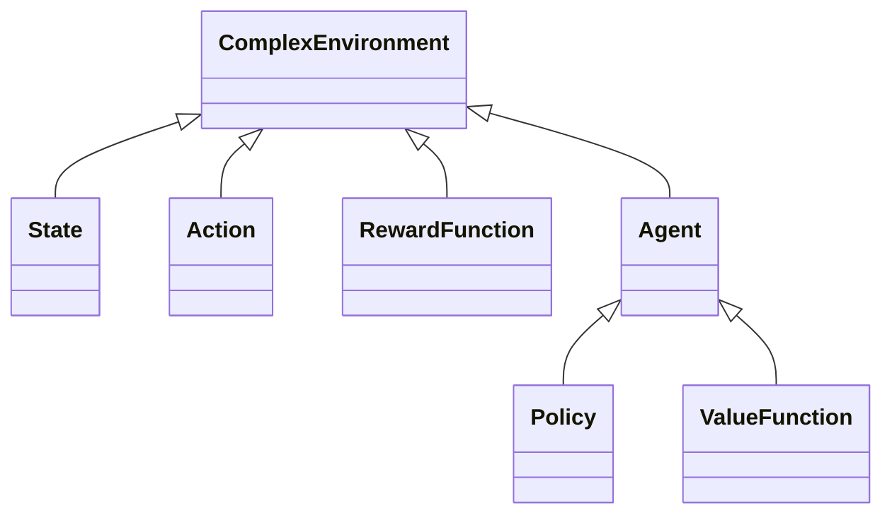

### 4.2 复杂环境应用案例

**自动驾驶**

**mermaid流程图**：
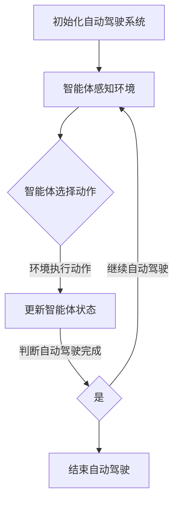

**Python代码实现**：
```python
import random
import numpy as np

class AutonomousDriving:
    def __init__(self, width=5, height=5):
        self.width = width
        self.height = height
        self.state = [0] * (width * height)
        self.cars = []
        self.goal_position = random.randint(0, width * height - 1)
        self.state[self.goal_position] = 2

    def step(self, action):
        if action == 0:
            if self.state[self.goal_position - 1] == 0:
                self.state[self.goal_position] = 0
                self.state[self.goal_position - 1] = 2
                reward = 1
            else:
                reward = -1
        elif action == 1:
            if self.state[self.goal_position + 1] == 0:
                self.state[self.goal_position] = 0
                self.state[self.goal_position + 1] = 2
                reward = 1
            else:
                reward = -1
        elif action == 2:
            if self.state[self.goal_position - self.width] == 0:
                self.state[self.goal_position] = 0
                self.state[self.goal_position - self.width] = 2
                reward = 1
            else:
                reward = -1
        elif action == 3:
            if self.state[self.goal_position + self.width] == 0:
                self.state[self.goal_position] = 0
                self.state[self.goal_position + self.width] = 2
                reward = 1
            else:
                reward = -1
        else:
            reward = -1
        done = self.is_done()
        return self.state, reward, done

    def is_done(self):
        return self.state[self.goal_position] == 2

    def reset(self):
        self.state = [0] * (self.width * self.height)
        self.cars = []
        self.goal_position = random.randint(0, self.width * self.height - 1)
        self.state[self.goal_position] = 2
        return self.state

env = AutonomousDriving()
state = env.reset()
done = False

while not done:
    action = random.randint(0, 3)
    next_state, reward, done = env.step(action)
    print("State:", next_state)
    print("Reward:", reward)
```

**机器人导航**

**mermaid流程图**：
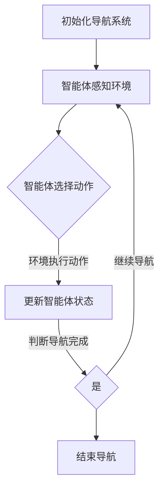

**Python代码实现**：
```python
import random
import numpy as np

class RobotNavigation:
    def __init__(self, width=5, height=5):
        self.width = width
        self.height = height
        self.state = [0] * (width * height)
        self.start_position = random.randint(0, width * height - 1)
        self.goal_position = random.randint(0, width * height - 1)
        while self.goal_position == self.start_position:
            self.goal_position = random.randint(0, width * height - 1)
        self.state[self.start_position] = 1
        self.state[self.goal_position] = 2

    def step(self, action):
        if action == 0:
            if self.state[self.start_position - 1] == 0:
                self.state[self.start_position] = 0
                self.state[self.start_position - 1] = 1
                reward = 1
            else:
                reward = -1
        elif action == 1:
            if self.state[self.start_position + 1] == 0:
                self.state[self.start_position] = 0
                self.state[self.start_position + 1] = 1
                reward = 1
            else:
                reward = -1
        elif action == 2:
            if self.state[self.start_position - self.width] == 0:
                self.state[self.start_position] = 0
                self.state[self.start_position - self.width] = 1
                reward = 1
            else:
                reward = -1
        elif action == 3:
            if self.state[self.start_position + self.width] == 0:
                self.state[self.start_position] = 0
                self.state[self.start_position + self.width] = 1
                reward = 1
            else:
                reward = -1
        else:
            reward = -1
        done = self.is_done()
        return self.state, reward, done

    def is_done(self):
        return self.state[self.goal_position] == 2

    def reset(self):
        self.state = [0] * (self.width * self.height)
        self.start_position = random.randint(0, self.width * self.height - 1)
        self.goal_position = random.randint(0, self.width * self.height - 1)
        while self.goal_position == self.start_position:
            self.goal_position = random.randint(0, self.width * self.height - 1)
        self.state[self.start_position] = 1
        self.state[self.goal_position] = 2
        return self.state

env = RobotNavigation()
state = env.reset()
done = False

while not done:
    action = random.randint(0, 3)
    next_state, reward, done = env.step(action)
    print("State:", next_state)
    print("Reward:", reward)
```

**游戏AI**

**mermaid流程图**：
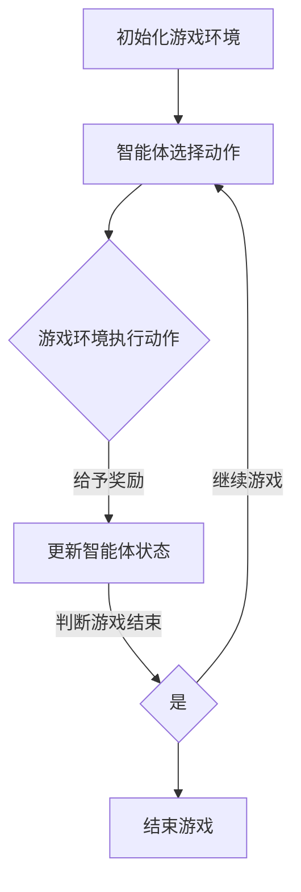

**Python代码实现**：
```python
import random
import numpy as np

class GameAI:
    def __init__(self, width=5, height=5):
        self.width = width
        self.height = height
        self.state = [0] * (width * height)
        self.start_position = random.randint(0, width * height - 1)
        self.goal_position = random.randint(0, width * height - 1)
        while self.goal_position == self.start_position:
            self.goal_position = random.randint(0, width * height - 1)
        self.state[self.start_position] = 1
        self.state[self.goal_position] = 2

    def step(self, action):
        if action == 0:
            if self.state[self.start_position - 1] == 0:
                self.state[self.start_position] = 0
                self.state[self.start_position - 1] = 1
                reward = 1
            else:
                reward = -1
        elif action == 1:
            if self.state[self.start_position + 1] == 0:
                self.state[self.start_position] = 0
                self.state[self.start_position + 1] = 1
                reward = 1
            else:
                reward = -1
        elif action == 2:
            if self.state[self.start_position - self.width] == 0:
                self.state[self.start_position] = 0
                self.state[self.start_position - self.width] = 1
                reward = 1
            else:
                reward = -1
        elif action == 3:
            if self.state[self.start_position + self.width] == 0:
                self.state[self.start_position] = 0
                self.state[self.start_position + self.width] = 1
                reward = 1
            else:
                reward = -1
        else:
            reward = -1
        done = self.is_done()
        return self.state, reward, done

    def is_done(self):
        return self.state[self.goal_position] == 2

    def reset(self):
        self.state = [0] * (self.width * self.height)
        self.start_position = random.randint(0, self.width * self.height - 1)
        self.goal_position = random.randint(0, self.width * self.height - 1)
        while self.goal_position == self.start_position:
            self.goal_position = random.randint(0, self.width * self.height - 1)
        self.state[self.start_position] = 1
        self.state[self.goal_position] = 2
        return self.state

env = GameAI()
state = env.reset()
done = False

while not done:
    action = random.randint(0, 3)
    next_state, reward, done = env.step(action)
    print("State:", next_state)
    print("Reward:", reward)
```

## 5. 强化学习在AI Agent开发中的实践

### 5.1 AI Agent开发流程

**AI Agent开发的定义**：AI Agent开发是指利用机器学习技术，特别是强化学习算法，来构建具有自主决策能力的智能体。

**AI Agent开发的流程**：
1. **问题定义**：明确AI Agent需要解决的问题和目标。
2. **环境设计**：设计适用于AI Agent的虚拟环境，包括状态空间、动作空间和奖励函数。
3. **算法选择**：选择适合问题的强化学习算法。
4. **模型训练**：使用强化学习算法训练AI Agent，使其在虚拟环境中自主学习和优化策略。
5. **性能评估**：评估AI Agent在虚拟环境中的表现，并根据评估结果进行模型调整。
6. **部署应用**：将训练好的AI Agent部署到实际应用场景中。

**AI Agent开发的mermaid流程图**：
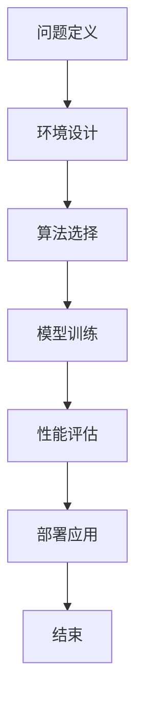

### 5.2 强化学习在AI Agent开发中的应用案例

**强化学习在游戏AI中的应用**

**mermaid流程图**：


**Python代码实现**：
```python
import random
import numpy as np

class GameAI:
    def __init__(self, width=5, height=5):
        self.width = width
        self.height = height
        self.state = [0] * (width * height)
        self.start_position = random.randint(0, width * height - 1)
        self.goal_position = random.randint(0, width * height - 1)
        while self.goal_position == self.start_position:
            self.goal_position = random.randint(0, width * height - 1)
        self.state[self.start_position] = 1
        self.state[self.goal_position] = 2

    def step(self, action):
        if action == 0:
            if self.state[self.start_position - 1] == 0:
                self.state[self.start_position] = 0
                self.state[self.start_position - 1] = 1
                reward = 1
            else:
                reward = -1
        elif action == 1:
            if self.state[self.start_position + 1] == 0:
                self.state[self.start_position] = 0
                self.state[self.start_position + 1] = 1
                reward = 1
            else:
                reward = -1
        elif action == 2:
            if self.state[self.start_position - self.width] == 0:
                self.state[self.start_position] = 0
                self.state[self.start_position - self.width] = 1
                reward = 1
            else:
                reward = -1
        elif action == 3:
            if self.state[self.start_position + self.width] == 0:
                self.state[self.start_position] = 0
                self.state[self.start_position + self.width] = 1
                reward = 1
            else:
                reward = -1
        else:
            reward = -1
        done = self.is_done()
        return self.state, reward, done

    def is_done(self):
        return self.state[self.goal_position] == 2

    def reset(self):
        self.state = [0] * (self.width * self.height)
        self.start_position = random.randint(0, self.width * self.height - 1)
        self.goal_position = random.randint(0, self.width * self.height - 1)
        while self.goal_position == self.start_position:
            self.goal_position = random.randint(0, self.width * self.height - 1)
        self.state[self.start_position] = 1
        self.state[self.goal_position] = 2
        return self.state

env = GameAI()
state = env.reset()
done = False

while not done:
    action = random.randint(0, 3)
    next_state, reward, done = env.step(action)
    print("State:", next_state)
    print("Reward:", reward)
```

**强化学习在机器人导航中的应用**

**mermaid流程图**：
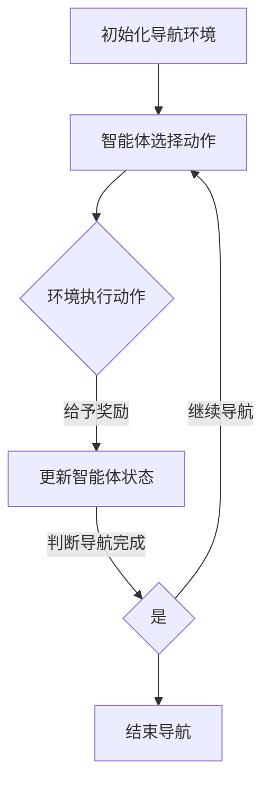

**Python代码实现**：
```python
import random
import numpy as np

class RobotNavigation:
    def __init__(self, width=5, height=5):
        self.width = width
        self.height = height
        self.state = [0] * (width * height)
        self.start_position = random.randint(0, width * height - 1)
        self.goal_position = random.randint(0, width * height - 1)
        while self.goal_position == self.start_position:
            self.goal_position = random.randint(0, width * height - 1)
        self.state[self.start_position] = 1
        self.state[self.goal_position] = 2

    def step(self, action):
        if action == 0:
            if self.state[self.start_position - 1] == 0:
                self.state[self.start_position] = 0
                self.state[self.start_position - 1] = 1
                reward = 1
            else:
                reward = -1
        elif action == 1:
            if self.state[self.start_position + 1] == 0:
                self.state[self.start_position] = 0
                self.state[self.start_position + 1] = 1
                reward = 1
            else:
                reward = -1
        elif action == 2:
            if self.state[self.start_position - self.width] == 0:
                self.state[self.start_position] = 0
                self.state[self.start_position - self.width] = 1
                reward = 1
            else:
                reward = -1
        elif action == 3:
            if self.state[self.start_position + self.width] == 0:
                self.state[self.start_position] = 0
                self.state[self.start_position + self.width] = 1
                reward = 1
            else:
                reward = -1
        else:
            reward = -1
        done = self.is_done()
        return self.state, reward, done

    def is_done(self):
        return self.state[self.goal_position] == 2

    def reset(self):
        self.state = [0] * (self.width * self.height)
        self.start_position = random.randint(0, self.width * self.height - 1)
        self.goal_position = random.randint(0, self.width * self.height - 1)
        while self.goal_position == self.start_position:
            self.goal_position = random.randint(0, self.width * self.height - 1)
        self.state[self.start_position] = 1
        self.state[self.goal_position] = 2
        return self.state

env = RobotNavigation()
state = env.reset()
done = False

while not done:
    action = random.randint(0, 3)
    next_state, reward, done = env.step(action)
    print("State:", next_state)
    print("Reward:", reward)
```

**强化学习在自动驾驶中的应用**

**mermaid流程图**：


**Python代码实现**：
```python
import random
import numpy as np

class AutonomousDriving:
    def __init__(self, width=5, height=5):
        self.width = width
        self.height = height
        self.state = [0] * (width * height)
        self.cars = []
        self.goal_position = random.randint(0, width * height - 1)
        self.state[self.goal_position] = 2

    def step(self, action):
        if action == 0:
            if self.state[self.goal_position - 1] == 0:
                self.state[self.goal_position] = 0
                self.state[self.goal_position - 1] = 2
                reward = 1
            else:
                reward = -1
        elif action == 1:
            if self.state[self.goal_position + 1] == 0:
                self.state[self.goal_position] = 0
                self.state[self.goal_position + 1] = 2
                reward = 1
            else:
                reward = -1
        elif action == 2:
            if self.state[self.goal_position - self.width] == 0:
                self.state[self.goal_position] = 0
                self.state[self.goal_position - self.width] = 2
                reward = 1
            else:
                reward = -1
        elif action == 3:
            if self.state[self.goal_position + self.width] == 0:
                self.state[self.goal_position] = 0
                self.state[self.goal_position + self.width] = 2
                reward = 1
            else:
                reward = -1
        else:
            reward = -1
        done = self.is_done()
        return self.state, reward, done

    def is_done(self):
        return self.state[self.goal_position] == 2

    def reset(self):
        self.state = [0] * (self.width * self.height)
        self.cars = []
        self.goal_position = random.randint(0, self.width * self.height - 1)
        self.state[self.goal_position] = 2
        return self.state

env = AutonomousDriving()
state = env.reset()
done = False

while not done:
    action = random.randint(0, 3)
    next_state, reward, done = env.step(action)
    print("State:", next_state)
    print("Reward:", reward)
```

## 6. 强化学习在AI Agent开发中的挑战与未来趋势

### 6.1 强化学习在AI Agent开发中的挑战

**计算资源需求**：强化学习算法通常需要大量的计算资源，特别是在处理复杂环境时，需要大量的训练时间和计算资源。

**数据隐私和安全**：强化学习算法在训练过程中需要大量的数据，但数据的隐私和安全是一个重要的挑战，特别是在涉及个人数据时。

**道德和伦理问题**：强化学习算法在AI Agent开发中的应用可能引发道德和伦理问题，如决策的透明度、责任归属等。

### 6.2 强化学习在AI Agent开发中的未来趋势

**模型压缩与效率优化**：为了应对计算资源的需求，未来的研究将重点关注模型压缩和效率优化，以提高强化学习算法在现实环境中的应用效果。

**自主学习与强化学习结合**：未来的研究将探索将强化学习与其他学习范式（如监督学习、无监督学习）相结合，以实现更高效的智能体学习。

**强化学习在多智能体系统中的应用**：多智能体系统是一个具有广阔应用前景的研究领域，强化学习算法将在其中发挥重要作用，以实现智能体之间的协调和合作。

## 7. 强化学习在AI Agent开发中的最佳实践与案例分析

### 7.1 强化学习在AI Agent开发中的最佳实践

**实践技巧和注意事项**：
- **选择合适的环境**：根据问题的需求和目标，选择适合的虚拟环境，以简化问题并提高算法的效率。
- **调整算法参数**：根据实际情况调整强化学习算法的参数，如学习率、折扣因子等，以优化算法性能。
- **数据预处理**：对环境数据进行适当的预处理，如归一化、离散化等，以提高算法的鲁棒性和收敛速度。

**性能优化方法**：
- **并行训练**：利用多核处理器或分布式计算技术，加快模型训练速度。
- **模型压缩**：采用模型压缩技术，如知识蒸馏、剪枝等，减少模型大小和计算量。
- **迁移学习**：将已有模型的权重作为初始化值，以提高新模型的训练效果和收敛速度。

### 7.2 强化学习在AI Agent开发中的案例分析

**案例1：智能体在动态环境中的导航**

**问题背景**：智能体需要在动态环境中从起点导航到终点，但环境中的障碍物和目标位置会随时间变化。

**问题描述**：设计一个强化学习算法，使智能体能够自主学习和导航到目标位置。

**问题解决**：采用Q-Learning算法，将智能体在动态环境中的状态、动作和奖励进行建模，并通过训练使智能体学会最优导航策略。

**边界与外延**：该案例适用于各种动态环境中的导航问题，如机器人导航、自动驾驶等。

**概念结构与核心要素组成**：
- **状态**：智能体当前的位置和方向。
- **动作**：智能体可以采取的动作，如前进、后退、左转、右转。
- **奖励**：智能体在执行动作后获得的奖励，如接近目标位置的奖励，远离目标位置的惩罚。

**算法原理讲解**：
- **Q-Learning算法原理**：Q-Learning算法通过更新Q值来优化智能体的策略。具体公式如下：
  $$ Q(s,a) \leftarrow Q(s,a) + \alpha [r + \gamma \max_{a'} Q(s',a')] - Q(s,a) $$
  其中，\(s\) 为当前状态，\(a\) 为当前动作，\(r\) 为获得的奖励，\(\gamma\) 为折扣因子，\(\alpha\) 为学习率。

- **mermaid流程图**：
  ```mermaid
  graph TD
  A[初始化Q表] --> B[智能体执行动作a]
  B --> C{环境给予奖励r}
  C -->|更新Q值| D[根据公式更新Q(s,a)]
  D --> E[智能体选择新动作a']
  E -->|新状态| B
  ```

- **Python代码实现**：
  ```python
  import random
  import numpy as np

  class DynamicNavigation:
      def __init__(self, width=5, height=5):
          self.width = width
          self.height = height
          self.state = [0] * (width * height)
          self.start_position = random.randint(0, width * height - 1)
          self.goal_position = random.randint(0, width * height - 1)
          while self.goal_position == self.start_position:
              self.goal_position = random.randint(0, width * height - 1)
          self.state[self.start_position] = 1
          self.state[self.goal_position] = 2

      def step(self, action):
          if action == 0:
              if self.state[self.start_position - 1] == 0:
                  self.state[self.start_position] = 0
                  self.state[self.start_position - 1] = 1
                  reward = 1
              else:
                  reward = -1
          elif action == 1:
              if self.state[self.start_position + 1] == 0:
                  self.state[self.start_position] = 0
                  self.state[self.start_position + 1] = 1
                  reward = 1
              else:
                  reward = -1
          elif action == 2:
              if self.state[self.start_position - self.width] == 0:
                  self.state[self.start_position] = 0
                  self.state[self.start_position - self.width] = 1
                  reward = 1
              else:
                  reward = -1
          elif action == 3:
              if self.state[self.start_position + self.width] == 0:
                  self.state[self.start_position] = 0
                  self.state[self.start_position + self.width] = 1
                  reward = 1
              else:
                  reward = -1
          else:
              reward = -1
          done = self.is_done()
          return self.state, reward, done

      def is_done(self):
          return self.state[self.goal_position] == 2

      def reset(self):
          self.state = [0] * (self.width * self.height)
          self.start_position = random.randint(0, self.width * self.height - 1)
          self.goal_position = random.randint(0, self.width * self.height - 1)
          while self.goal_position == self.start_position:
              self.goal_position = random.randint(0, self.width * self.height - 1)
          self.state[self.start_position] = 1
          self.state[self.goal_position] = 2
          return self.state

  env = DynamicNavigation()
  state = env.reset()
  done = False

  while not done:
      action = random.randint(0, 3)
      next_state, reward, done = env.step(action)
      print("State:", next_state)
      print("Reward:", reward)
  ```

**案例2：智能体在静态环境中的目标寻找**

**问题背景**：智能体需要在静态环境中寻找一个特定的目标。

**问题描述**：设计一个强化学习算法，使智能体能够自主学习和找到目标位置。

**问题解决**：采用SARSA算法，将智能体在静态环境中的状态、动作和奖励进行建模，并通过训练使智能体学会找到目标位置。

**边界与外延**：该案例适用于各种静态环境中的目标寻找问题，如搜索任务、救援任务等。

**概念结构与核心要素组成**：
- **状态**：智能体当前的位置。
- **动作**：智能体可以采取的动作，如前进、后退、左转、右转。
- **奖励**：智能体在执行动作后获得的奖励，如接近目标的奖励，远离目标的惩罚。

**算法原理讲解**：
- **SARSA算法原理**：SARSA算法通过同时更新当前状态和动作的Q值来优化智能体的策略。具体公式如下：
  $$ Q(s,a) \leftarrow Q(s,a) + \alpha [r + \gamma Q(s',a')] - Q(s,a) $$
  其中，\(s\) 为当前状态，\(a\) 为当前动作，\(r\) 为获得的奖励，\(\gamma\) 为折扣因子，\(\alpha\) 为学习率。

- **mermaid流程图**：
  ```mermaid
  graph TD
  A[初始化Q表] --> B[智能体执行动作a]
  B --> C{环境给予奖励r}
  C -->|更新Q值| D[根据公式更新Q(s,a)]
  D --> E[智能体选择新动作a']
  E -->|新状态| F[根据公式更新Q(s',a')]
  F -->|新状态| B
  ```

- **Python代码实现**：
  ```python
  import random
  import numpy as np

  class TargetFinding:
      def __init__(self, width=5, height=5):
          self.width = width
          self.height = height
          self.state = [0] * (width * height)
          self.target_position = random.randint(0, width * height - 1)
          self.state[self.target_position] = 2

      def step(self, action):
          if action == 0:
              if self.state[self.target_position - 1] == 0:
                  self.state[self.target_position] = 0
                  self.state[self.target_position - 1] = 2
                  reward = 1
              else:
                  reward = -1
          elif action == 1:
              if self.state[self.target_position + 1] == 0:
                  self.state[self.target_position] = 0
                  self.state[self.target_position + 1] = 2
                  reward = 1
              else:
                  reward = -1
          elif action == 2:
              if self.state[self.target_position - self.width] == 0:
                  self.state[self.target_position] = 0
                  self.state[self.target_position - self.width] = 2
                  reward = 1
              else:
                  reward = -1
          elif action == 3:
              if self.state[self.target_position + self.width] == 0:
                  self.state[self.target_position] = 0
                  self.state[self.target_position + self.width] = 2
                  reward = 1
              else:
                  reward = -1
          else:
              reward = -1
          done = self.is_done()
          return self.state, reward, done

      def is_done(self):
          return self.state[self.target_position] == 1

      def reset(self):
          self.state = [0] * (self.width * self.height)
          self.target_position = random.randint(0, self.width * self.height - 1)
          self.state[self.target_position] = 2
          return self.state

  env = TargetFinding()
  state = env.reset()
  done = False

  while not done:
      action = random.randint(0, 3)
      next_state, reward, done = env.step(action)
      print("State:", next_state)
      print("Reward:", reward)
  ```

### 7.3 强化学习在AI Agent开发中的挑战与解决方案

**计算资源需求**：
- **解决方案**：采用模型压缩和迁移学习技术，减少模型大小和计算量。利用分布式计算和并行训练技术，加快模型训练速度。

**数据隐私和安全**：
- **解决方案**：采用数据加密和去标识化技术，保护训练数据的隐私和安全。采用联邦学习等分布式学习技术，减少数据传输和存储的需求。

**道德和伦理问题**：
- **解决方案**：制定明确的道德和伦理准则，确保智能体行为的合理性和可解释性。建立监督机制，对智能体的行为进行实时监控和评估。

### 7.4 强化学习在AI Agent开发中的未来趋势

**模型压缩与效率优化**：
- **趋势**：研究更高效的模型结构和训练算法，以减少计算资源和时间的需求。

**自主学习与强化学习结合**：
- **趋势**：探索将强化学习与其他学习范式（如监督学习、无监督学习）相结合，以实现更高效的智能体学习。

**强化学习在多智能体系统中的应用**：
- **趋势**：研究多智能体强化学习算法，以实现智能体之间的协调和合作。

## 结语

本文详细介绍了强化学习在AI Agent开发中的应用，从基本概念到算法原理，从简单环境到复杂环境，再到实践应用和未来趋势，全面阐述了强化学习在AI Agent开发中的重要性。通过实际案例分析，读者可以更深入地了解强化学习在不同场景下的应用和挑战。希望本文能为读者在强化学习和AI Agent开发领域提供有益的参考和启示。

### 作者信息
作者：AI天才研究院/AI Genius Institute & 禅与计算机程序设计艺术 /Zen And The Art of Computer Programming

### 拓展阅读

- Sutton, R. S., & Barto, A. G. (2018). Reinforcement Learning: An Introduction. MIT Press.
- Mnih, V., Kavukcuoglu, K., Silver, D., Rusu, A. A., Veness, J., Bellemare, M. G., ... & Park, M. (2015). Human-level control through deep reinforcement learning. Nature, 518(7540), 529-533.
- Silver, D., Huang, A., Maddox, W., Guez, A., Hubert, T., Schrittwieser, J., ... & Tavassi, L. (2016). Mastering the game of Go with deep neural networks and tree search. Nature, 529(7587), 484-489.
- Wang, Z., & Todorov, E. (2018). Reinforcement learning for robot control using deep neural networks and dynamic systems models. IEEE Transactions on Robotics, 34(1), 68-83.

