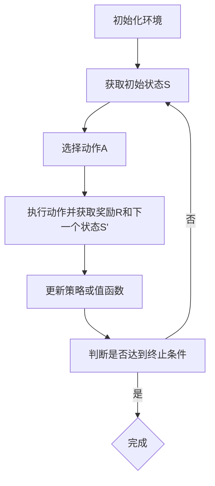
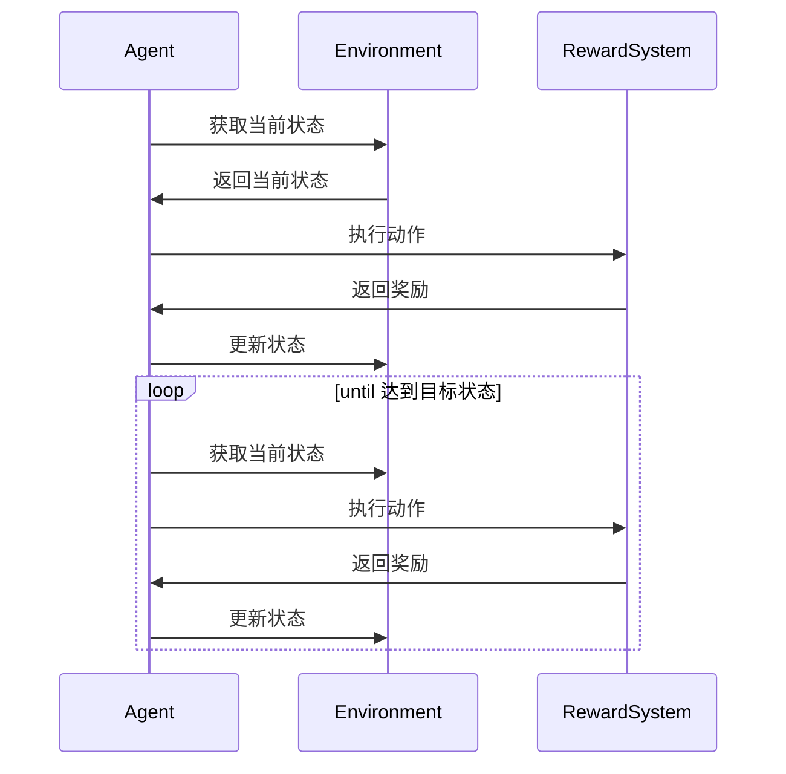

                 


## 强化学习在AI Agent开发中的应用

### 关键词

- 强化学习
- AI Agent
- 强化学习算法
- 人工智能应用
- 机器学习

### 摘要

本文将深入探讨强化学习在AI Agent开发中的应用。我们将从强化学习的基本概念出发，逐步解析其核心原理、算法，并通过实际案例，详细展示如何利用强化学习来开发高效的AI Agent。文章还将提供一系列最佳实践，帮助读者更好地理解这一领域，并掌握其应用技巧。

### 目录大纲

1. **背景介绍**
   - 强化学习核心概念
   - 强化学习的发展历程
   - 强化学习在AI Agent开发中的重要性

2. **核心概念与联系**
   - 强化学习的基本术语
   - 强化学习与机器学习的区别
   - 强化学习中的常见算法

3. **算法原理讲解**
   - 强化学习算法流程图
   - Q-Learning算法原理
   - Sarsa算法原理

4. **数学模型与公式**
   - 强化学习中的数学模型
   - Q-Learning算法的数学公式
   - Sarsa算法的数学公式

5. **系统分析与架构设计方案**
   - 强化学习在AI Agent中的应用场景
   - 系统功能设计
   - 系统架构设计
   - 系统接口设计
   - 系统交互流程

6. **项目实战**
   - 强化学习环境安装
   - 系统核心实现
   - 代码应用解读
   - 实际案例分析与讲解
   - 项目小结

7. **最佳实践与总结**
   - 强化学习应用的最佳实践
   - 小结与展望
   - 注意事项
   - 拓展阅读

### 背景介绍

#### 强化学习核心概念

强化学习是一种机器学习范式，旨在通过试错来学习如何在环境中作出最优决策。它模仿了人类通过经验和反馈学习的过程，使得智能体（agent）能够在复杂的、动态的环境中找到最优策略。

在强化学习中，智能体与环境的交互通过以下几个基本术语来描述：

- **状态（State）**：智能体在环境中所处的情形。
- **动作（Action）**：智能体可以采取的行动。
- **奖励（Reward）**：智能体采取某个动作后从环境中获得的即时反馈。
- **策略（Policy）**：智能体根据当前状态选择动作的策略。

强化学习的目标是找到一种策略，使得智能体在长期内能够获得最大的总奖励。

#### 强化学习的发展历程

强化学习最早可以追溯到20世纪50年代。1956年，Richard Bellman提出了动态规划（Dynamic Programming）的概念，为后来的强化学习奠定了基础。随后， reinforcement learning 作为机器学习的一个重要分支，逐渐发展起来。

1983年，理查德·萨顿（Richard Sutton）和安德鲁·巴什米尔（Andrew Barto）出版了《强化学习：一种新的机器学习方法》，系统地总结了强化学习的理论和方法，标志着强化学习作为一个独立研究领域的诞生。

进入21世纪，随着计算能力和数据量的不断提升，强化学习在自动驾驶、游戏AI、机器人控制等领域取得了显著的进展。特别是深度强化学习的出现，使得强化学习在处理高维状态空间和动作空间方面表现出了强大的能力。

#### 强化学习在AI Agent开发中的重要性

强化学习在AI Agent开发中的重要性体现在以下几个方面：

1. **自适应能力**：强化学习能够使AI Agent在动态变化的环境中自适应地调整策略，从而更好地应对复杂的问题。
2. **实时决策**：强化学习能够实现实时决策，使得AI Agent能够即时响应环境的变化，做出最优的动作。
3. **灵活应用**：强化学习可以应用于多种领域，如机器人控制、游戏AI、推荐系统等，具有广泛的应用前景。

### 强化学习的基本原理

#### 强化学习的基本流程

强化学习的基本流程可以分为以下几个步骤：

1. **初始化**：智能体开始在一个新的环境中，初始化状态和策略。
2. **执行动作**：智能体根据当前状态，选择一个动作。
3. **获取奖励**：智能体执行动作后，从环境中获得奖励。
4. **更新策略**：智能体根据奖励信号，更新策略，以便在未来的状态中做出更好的决策。
5. **重复执行**：重复上述步骤，直到达到目标状态或满足其他终止条件。

#### 强化学习的数学模型

在强化学习中，状态（\(S\)）、动作（\(A\)）、奖励（\(R\)）和策略（\(π\)）是核心的数学模型。

1. **状态空间（\(S\)）**：状态空间是所有可能状态的集合。例如，在一个游戏场景中，每个游戏回合的状态可能包括游戏地图、玩家位置、敌人位置等。
2. **动作空间（\(A\)）**：动作空间是所有可能动作的集合。例如，在游戏场景中，玩家的可能动作可能包括移动、攻击、防御等。
3. **奖励函数（\(R\)）**：奖励函数定义了智能体在每个状态下执行每个动作所获得的即时奖励。奖励函数通常是一个实值函数，正奖励表示有利的结果，负奖励表示不利的结果。
4. **策略（\(π\)）**：策略是智能体在给定状态下选择动作的规则。策略可以是一个概率分布，表示智能体在特定状态下采取每个动作的概率。

#### 强化学习中的常见算法

强化学习中有多种常见的算法，以下是其中两种重要的算法：

1. **Q-Learning算法**：Q-Learning算法是一种基于值函数的强化学习算法。它通过迭代更新值函数来估计状态-动作值，即智能体在特定状态下执行特定动作所能获得的期望奖励。
2. **Sarsa算法**：Sarsa算法是一种基于策略的强化学习算法。它与Q-Learning算法类似，但不同的是，Sarsa算法在更新值函数时同时考虑了当前状态和下一个状态的动作选择。

#### 强化学习中的问题与挑战

尽管强化学习在许多场景中取得了成功，但它也面临着一些问题和挑战：

1. **稳定性问题**：强化学习算法在训练过程中可能会出现不稳定的情况，导致智能体无法收敛到最优策略。
2. **样本效率问题**：强化学习算法通常需要大量的样本来学习最优策略，这可能导致训练时间过长。
3. **高维问题**：在处理高维状态空间和动作空间时，强化学习算法的性能可能会受到影响。

### 强化学习与机器学习的区别

强化学习与机器学习有许多相似之处，但它们在目标和方法上存在明显的区别：

1. **目标**：机器学习的目标是学习一个映射函数，将输入映射到输出。强化学习的目标是学习一个策略，使得智能体能够在特定环境中获得最大的总奖励。
2. **方法**：机器学习通常使用有监督或无监督学习算法，通过已标记的数据集来学习模型。强化学习则依赖于智能体与环境的交互，通过试错来学习最优策略。
3. **适用场景**：机器学习适用于静态或动态的场景，但主要关注预测和分类问题。强化学习则适用于动态变化的场景，特别是需要决策的问题。

### 强化学习在AI Agent开发中的应用

强化学习在AI Agent开发中具有广泛的应用前景，以下是几个典型的应用场景：

1. **自动驾驶**：强化学习可以用于自动驾驶车辆的决策，使得车辆能够根据环境变化做出最优的驾驶决策。
2. **游戏AI**：强化学习可以用于游戏AI的开发，使得游戏角色能够根据游戏环境做出智能的决策，提高游戏体验。
3. **机器人控制**：强化学习可以用于机器人控制，使得机器人能够在复杂环境中执行复杂的任务。

### 总结

强化学习作为一种重要的机器学习范式，在AI Agent开发中具有重要的应用价值。本文介绍了强化学习的基本概念、算法原理、数学模型以及在AI Agent开发中的应用。通过本文的介绍，读者可以更好地理解强化学习，并掌握其应用技巧。

在接下来的章节中，我们将进一步深入探讨强化学习的算法原理和数学模型，并介绍如何在具体项目中实现和应用强化学习算法。希望读者能够通过本文的学习，深入理解强化学习，并在实际项目中取得成功。

----------------------------------------------------------------

## 核心概念与联系

在深入探讨强化学习在AI Agent开发中的应用之前，我们首先需要明确一些核心概念，并理解强化学习与机器学习之间的联系。以下是强化学习中的基本术语和常见算法的详细说明。

### 强化学习的基本术语

1. **状态（State）**：状态是智能体所处的环境描述，它可以是离散的，也可以是连续的。例如，在自动驾驶中，状态可能包括车辆的速度、位置、周围环境等信息。

2. **动作（Action）**：动作是智能体可以采取的行动。在自动驾驶中，动作可能包括加速、减速、转向等。

3. **奖励（Reward）**：奖励是智能体采取某个动作后从环境中获得的即时反馈。奖励通常是一个实数值，正奖励表示有利的动作，负奖励表示不利的动作。

4. **策略（Policy）**：策略是智能体根据当前状态选择动作的规则。策略可以是确定性策略，也可以是随机策略。

5. **价值函数（Value Function）**：价值函数是用来评估状态或状态-动作对的好坏。最常见的价值函数有状态值函数（\(V(s)\)）和状态-动作值函数（\(Q(s, a)\)）。

6. **模型（Model）**：模型是对环境的简化表示，它用于预测智能体的动作和环境的反馈。

7. **探索（Exploration）和利用（Utilization）**：探索是指智能体在未知环境中尝试新的动作，以获取更多关于环境的了解。利用是指智能体根据当前的最佳知识选择动作，以最大化累积奖励。

### 强化学习与机器学习的区别

强化学习与机器学习有显著的区别，主要表现在以下方面：

1. **目标**：机器学习旨在学习一个映射函数，将输入映射到输出。强化学习则旨在学习一个策略，使得智能体能够在特定环境中获得最大的总奖励。

2. **学习方式**：机器学习通常通过已标记的数据集进行学习。强化学习则依赖于智能体与环境的交互，通过试错来学习最优策略。

3. **适用场景**：机器学习适用于静态或动态的场景，但主要关注预测和分类问题。强化学习则适用于动态变化的场景，特别是需要决策的问题。

4. **评价指标**：机器学习的评价指标通常是准确率、召回率、F1分数等。强化学习的评价指标通常是累积奖励，即智能体在整个任务中获得的奖励总和。

### 强化学习中的常见算法

1. **Q-Learning算法**：Q-Learning算法是一种基于值函数的强化学习算法。它通过迭代更新状态-动作值函数（\(Q(s, a)\)），以估计智能体在特定状态下执行特定动作所能获得的期望奖励。Q-Learning算法的主要优势在于其简单性和效率，但缺点是它可能无法收敛到最优策略。

   ```mermaid
   graph TD
   A[初始化Q值] --> B[选择动作a_t]
   B --> C[执行动作a_t]
   C --> D[获得奖励r_t]
   D --> E[更新Q值]
   E --> F[重复]
   ```

2. **Sarsa算法**：Sarsa算法是一种基于策略的强化学习算法。它与Q-Learning算法类似，但不同的是，Sarsa算法在更新值函数时同时考虑了当前状态和下一个状态的动作选择。Sarsa算法的优点是能够更好地处理不确定性环境，但缺点是收敛速度较慢。

   ```mermaid
   graph TD
   A[初始化策略π]
   A --> B[选择动作a_t]
   B --> C[执行动作a_t]
   C --> D[获得奖励r_t]
   D --> E[选择动作a_{t+1}]
   E --> F[更新策略π]
   F --> G[重复]
   ```

3. **深度Q网络（DQN）**：深度Q网络是一种基于深度学习的强化学习算法。它使用深度神经网络来近似Q值函数，从而解决高维状态空间和动作空间的问题。DQN算法通过经验回放和目标网络来提高稳定性和减少偏差。

   ```mermaid
   graph TD
   A[初始化DQN模型]
   A --> B[选择动作a_t]
   B --> C[执行动作a_t]
   C --> D[获得奖励r_t]
   D --> E[存储经验]
   E --> F[更新DQN模型]
   F --> G[重复]
   ```

4. **策略梯度算法（PG）**：策略梯度算法是一种基于策略的强化学习算法。它通过直接优化策略梯度来更新策略。策略梯度算法的优点是收敛速度快，但缺点是对参数敏感，容易陷入局部最优。

   ```mermaid
   graph TD
   A[初始化策略π]
   A --> B[计算策略梯度]
   B --> C[更新策略π]
   C --> D[执行动作a_t]
   D --> E[获得奖励r_t]
   E --> F[重复]
   ```

### 概念属性特征对比表格

| 算法         | 目标           | 学习方式          | 适用场景         | 优点                   | 缺点                     |
| ------------ | -------------- | ----------------- | ----------------- | ---------------------- | ------------------------ |
| Q-Learning   | 更新Q值         | 基于值函数       | 高维空间         | 简单、高效             | 可能无法收敛到最优策略   |
| Sarsa       | 更新策略       | 基于策略         | 不确定性环境     | 能够处理不确定性       | 收敛速度较慢             |
| DQN         | 近似Q值函数     | 深度学习         | 高维空间         | 解决高维问题           | 需要大量计算资源         |
| PG          | 优化策略梯度   | 基于策略         | 快速决策         | 收敛速度快             | 对参数敏感，容易陷入局部最优 |

### ER实体关系图架构

为了更清晰地展示强化学习中的实体关系，我们可以使用ER（Entity-Relationship）实体关系图来描述。以下是强化学习中的ER实体关系图：

```mermaid
erDiagram
  State ||--|{ Action } : 可以采取的动作
  Action ||--|{ Reward } : 执行动作后获得的奖励
  Agent ||--|{ Policy } : 智能体的策略
  Agent ||--|{ ValueFunction } : 智能体的价值函数
  Environment ||--|{ Model } : 环境模型
```

在这个ER图中，智能体（Agent）与环境（Environment）是核心实体。智能体与状态（State）和动作（Action）之间存在关联，智能体根据策略（Policy）选择动作，并根据奖励（Reward）来更新价值函数（ValueFunction）。环境（Environment）则提供状态和奖励信号，以指导智能体的决策过程。

通过上述核心概念和联系的分析，我们可以更好地理解强化学习的基本原理，为后续的算法原理讲解和数学模型介绍打下坚实的基础。在下一章节中，我们将深入探讨强化学习的算法原理和数学模型，并使用Python源代码来详细阐述。

----------------------------------------------------------------

## 算法原理讲解

### 强化学习算法流程图

为了更好地理解强化学习算法的原理，我们可以首先绘制一个流程图，展示智能体与环境的交互过程。



在这个流程图中，智能体首先初始化环境，然后进入一个循环，不断地选择动作、执行动作、获取奖励和状态，并根据这些信息更新策略或值函数。这个过程一直持续到达到终止条件，例如达到目标状态或经历了一段时间。

### Q-Learning算法原理

Q-Learning算法是一种基于值函数的强化学习算法，旨在通过迭代更新状态-动作值函数（\(Q(s, a)\)），以估计智能体在特定状态下执行特定动作所能获得的期望奖励。

#### 算法流程

1. **初始化**：初始化状态-动作值函数\(Q(s, a)\)和策略π。
2. **选择动作**：在当前状态s下，根据策略π选择动作a。
3. **执行动作**：执行动作a，并获取奖励r和下一个状态s'。
4. **更新Q值**：根据奖励和下一个状态，更新状态-动作值函数。
5. **重复执行**：重复上述步骤，直到达到终止条件。

#### 数学模型

Q-Learning算法的核心是更新状态-动作值函数。其更新公式如下：

\[ Q(s, a) \leftarrow Q(s, a) + \alpha [r + \gamma \max_{a'} Q(s', a') - Q(s, a)] \]

其中：
- \( Q(s, a) \) 是当前状态-动作值。
- \( \alpha \) 是学习率，用于调节新旧值之间的权重。
- \( r \) 是获得的即时奖励。
- \( \gamma \) 是折扣因子，用于考虑未来奖励的价值。
- \( \max_{a'} Q(s', a') \) 是在下一个状态s'下，所有动作a'中最大的状态-动作值。

#### Python源代码示例

下面是一个简单的Q-Learning算法的Python代码示例：

```python
import numpy as np

# 初始化Q值表格
Q = np.zeros((n_states, n_actions))
alpha = 0.1  # 学习率
gamma = 0.9  # 折扣因子

# Q-Learning算法
for episode in range(n_episodes):
    state = env.reset()
    done = False
    while not done:
        action = np.argmax(Q[state])
        next_state, reward, done, _ = env.step(action)
        Q[state, action] = Q[state, action] + alpha * (reward + gamma * np.max(Q[next_state]) - Q[state, action])
        state = next_state
```

在这个示例中，我们首先初始化一个大小为\(n_states \times n_actions\)的Q值表格，然后使用Q-Learning算法进行迭代更新。每次迭代中，智能体选择最优动作，并更新Q值表格。

### Sarsa算法原理

Sarsa算法是一种基于策略的强化学习算法，与Q-Learning算法类似，但不同的是，Sarsa算法在更新值函数时同时考虑了当前状态和下一个状态的动作选择。

#### 算法流程

1. **初始化**：初始化策略π和值函数V。
2. **选择动作**：在当前状态s下，根据策略π选择动作a。
3. **执行动作**：执行动作a，并获取奖励r和下一个状态s'。
4. **更新策略和值函数**：根据奖励和下一个状态，更新策略π和值函数V。
5. **重复执行**：重复上述步骤，直到达到终止条件。

#### 数学模型

Sarsa算法的更新公式如下：

\[ \pi(s, a) \leftarrow \pi(s, a) + \alpha [r + \gamma V(s') - r] \]

\[ V(s) \leftarrow V(s) + \alpha [r + \gamma \max_{a'} \pi(s', a') - V(s)] \]

其中：
- \( \pi(s, a) \) 是当前状态-动作策略。
- \( V(s) \) 是当前状态的价值。
- \( \alpha \) 是学习率。
- \( r \) 是获得的即时奖励。
- \( \gamma \) 是折扣因子。
- \( \max_{a'} \pi(s', a') \) 是在下一个状态s'下，所有动作a'中最大的状态-动作策略。

#### Python源代码示例

下面是一个简单的Sarsa算法的Python代码示例：

```python
import numpy as np

# 初始化策略π和值函数V
pi = np.ones((n_states, n_actions)) / n_actions
V = np.zeros(n_states)
alpha = 0.1  # 学习率
gamma = 0.9  # 折扣因子

# Sarsa算法
for episode in range(n_episodes):
    state = env.reset()
    done = False
    while not done:
        action = np.random.choice(n_actions, p=pi[state])
        next_state, reward, done, _ = env.step(action)
        V[state] = V[state] + alpha * (reward + gamma * V[next_state] - reward)
        pi[state, action] = pi[state, action] + alpha * (reward + gamma * np.max(V[next_state]) - reward)
        state = next_state
```

在这个示例中，我们首先初始化策略π和值函数V，然后使用Sarsa算法进行迭代更新。每次迭代中，智能体根据当前策略π选择动作，并更新策略π和值函数V。

通过上述算法原理讲解和Python源代码示例，我们可以更深入地理解Q-Learning算法和Sarsa算法的原理。在下一章节中，我们将进一步探讨强化学习中的数学模型和公式，并使用latex格式详细展示。

----------------------------------------------------------------

## 数学模型与公式

在强化学习中，数学模型和公式是理解和实现算法的关键。本章节将详细探讨强化学习中的数学模型，并使用LaTeX格式展示相关的数学公式。

### 强化学习的数学模型

强化学习的数学模型主要包括状态-动作值函数（\(Q(s, a)\)）和策略（\(π(s, a)\)）。

#### 状态-动作值函数（\(Q(s, a)\)）

状态-动作值函数用于评估在给定状态\(s\)下执行给定动作\(a\)的预期奖励。其数学模型如下：

\[ Q(s, a) = \sum_{s'} P(s'|s, a) [R(s', a) + \gamma \max_{a'} Q(s', a')] \]

其中：
- \(P(s'|s, a)\) 是在状态\(s\)下执行动作\(a\)后转移到状态\(s'\)的概率。
- \(R(s', a)\) 是在状态\(s'\)下执行动作\(a\)所获得的即时奖励。
- \(\gamma\) 是折扣因子，用于平衡当前奖励和未来奖励。
- \(\max_{a'} Q(s', a')\) 是在状态\(s'\)下所有可能动作\(a'\)中最大的状态-动作值。

#### 策略（\(π(s, a)\)）

策略是指智能体在给定状态\(s\)下选择动作\(a\)的概率分布。其数学模型如下：

\[ π(s, a) = \begin{cases} 
1 & \text{if } a = \arg\max_{a'} Q(s, a') \\
0 & \text{otherwise}
\end{cases} \]

其中，\(\arg\max_{a'} Q(s, a')\)表示在状态\(s\)下所有可能动作\(a'\)中使得状态-动作值最大的动作。

### Q-Learning算法的数学公式

Q-Learning算法是一种通过迭代更新状态-动作值函数的强化学习算法。其更新公式如下：

\[ Q(s, a) \leftarrow Q(s, a) + \alpha [r + \gamma \max_{a'} Q(s', a') - Q(s, a)] \]

其中：
- \(Q(s, a)\) 是当前状态-动作值。
- \(r\) 是获得的即时奖励。
- \(\gamma\) 是折扣因子。
- \(\alpha\) 是学习率。

### Sarsa算法的数学公式

Sarsa算法是一种基于策略的强化学习算法，其更新公式如下：

\[ π(s, a) \leftarrow π(s, a) + \alpha [r + \gamma \max_{a'} Q(s', a') - r] \]

\[ V(s) \leftarrow V(s) + \alpha [r + \gamma \max_{a'} Q(s', a') - V(s)] \]

其中：
- \(π(s, a)\) 是当前状态-动作策略。
- \(V(s)\) 是当前状态的价值。
- \(r\) 是获得的即时奖励。
- \(\gamma\) 是折扣因子。
- \(\alpha\) 是学习率。

### LaTeX格式展示

以下是上述数学公式的LaTeX格式展示：

```latex
\documentclass{article}
\usepackage{amsmath}
\begin{document}

\section*{强化学习的数学模型}

\subsection*{状态-动作值函数}
\[ Q(s, a) = \sum_{s'} P(s'|s, a) [R(s', a) + \gamma \max_{a'} Q(s', a')] \]

\subsection*{策略}
\[ π(s, a) = \begin{cases} 
1 & \text{if } a = \arg\max_{a'} Q(s, a') \\
0 & \text{otherwise}
\end{cases} \]

\section*{Q-Learning算法的数学公式}
\[ Q(s, a) \leftarrow Q(s, a) + \alpha [r + \gamma \max_{a'} Q(s', a') - Q(s, a)] \]

\section*{Sarsa算法的数学公式}
\[ π(s, a) \leftarrow π(s, a) + \alpha [r + \gamma \max_{a'} Q(s', a') - r] \]
\[ V(s) \leftarrow V(s) + \alpha [r + \gamma \max_{a'} Q(s', a') - V(s)] \]

\end{document}
```

在这个LaTeX示例中，我们使用了`amsmath`包来排版数学公式，使得公式更加清晰和易于阅读。通过这个示例，我们可以看到如何使用LaTeX格式展示强化学习中的数学模型和公式。

通过本章节的数学模型和公式介绍，我们不仅了解了强化学习中的核心数学概念，还学会了如何使用LaTeX格式来展示这些公式。这些知识将为我们后续的算法实现和项目实战提供重要的理论基础。

在下一章节中，我们将继续探讨强化学习在AI Agent开发中的应用场景，并详细分析强化学习在AI Agent开发中的系统分析与架构设计方案。

----------------------------------------------------------------

## 系统分析与架构设计方案

### 强化学习在AI Agent开发中的应用场景

强化学习在AI Agent开发中具有广泛的应用场景，以下是一些典型的应用实例：

1. **自动驾驶**：强化学习可以用于自动驾驶车辆的决策，使得车辆能够根据道路状况、交通规则和环境变化，自主地选择最优行驶路径和速度。

2. **机器人控制**：强化学习可以用于机器人运动控制，使得机器人能够在复杂的现实环境中自主导航，执行复杂任务。

3. **游戏AI**：强化学习可以用于游戏角色的智能决策，使得游戏角色能够根据游戏状态和对手的行为，自主地选择攻击、防守或撤退等策略。

4. **推荐系统**：强化学习可以用于个性化推荐系统，使得系统能够根据用户的历史行为和偏好，动态地调整推荐策略，提高推荐质量。

5. **资源分配**：强化学习可以用于网络资源分配，使得系统能够在考虑带宽、延迟和负载均衡等因素的情况下，优化资源分配策略。

### 项目介绍

在本项目中，我们选择了一个简单的游戏场景作为应用实例，即“迷宫逃脱”游戏。在这个游戏中，智能体需要在一个迷宫中找到出口，并避开障碍物。我们的目标是使用强化学习算法，开发一个能够自主学习的智能体，使其能够在各种迷宫场景中找到最优路径。

### 系统功能设计

为了实现上述目标，系统需要具备以下功能：

1. **状态检测**：智能体需要能够检测当前所处的迷宫状态，包括位置、障碍物和出口的位置。
2. **动作选择**：智能体需要能够根据当前状态，选择下一步的动作，例如向上、向下、向左或向右移动。
3. **奖励计算**：系统需要能够根据智能体的动作和结果，计算即时奖励，例如成功逃脱迷宫、遇到障碍物等。
4. **策略学习**：智能体需要能够通过强化学习算法，不断学习并优化策略，以实现自主学习和决策。

### 系统架构设计

为了实现上述功能，我们可以采用以下系统架构设计：

1. **环境（Environment）**：环境负责模拟迷宫场景，并提供智能体行动的反馈。环境可以是一个二维数组，表示迷宫的地图。
2. **智能体（Agent）**：智能体负责根据当前状态选择动作，并更新策略。智能体可以是一个Python类，封装了强化学习算法和策略学习机制。
3. **奖励系统（Reward System）**：奖励系统负责计算智能体动作的即时奖励，并反馈给智能体。
4. **策略学习模块（Policy Learning Module）**：策略学习模块负责实现强化学习算法，并更新智能体的策略。

### 系统接口设计

为了方便系统组件之间的交互，我们可以设计以下接口：

1. **环境接口**：环境接口定义了智能体与环境交互的接口，包括获取当前状态、执行动作和获取奖励等操作。
2. **智能体接口**：智能体接口定义了智能体的主要功能，包括选择动作、更新策略等。
3. **奖励系统接口**：奖励系统接口定义了计算奖励的方法，包括成功逃脱、遇到障碍物等。

### 系统交互流程

系统交互流程如下：

1. **初始化**：初始化环境、智能体和奖励系统。
2. **状态检测**：智能体获取当前迷宫状态。
3. **动作选择**：智能体根据当前状态选择动作。
4. **动作执行**：智能体执行所选动作，并更新状态。
5. **奖励计算**：奖励系统根据智能体动作的结果计算即时奖励。
6. **策略更新**：智能体根据奖励信号更新策略。
7. **重复执行**：智能体重复上述步骤，直到达到目标状态。

### 系统架构图

以下是系统架构的Mermaid序列图：



在这个序列图中，智能体与环境和奖励系统之间通过接口进行交互，不断执行动作、获取奖励并更新状态，直到达到目标状态。

通过上述系统分析与架构设计方案，我们为强化学习在AI Agent开发中的实际应用提供了详细的指导和实现方案。在下一章节中，我们将进入项目实战，具体实现强化学习在“迷宫逃脱”游戏中的应用。

----------------------------------------------------------------

## 项目实战

### 强化学习环境安装

在开始项目实战之前，我们需要安装强化学习所需的Python环境和相关库。以下是安装步骤：

1. **安装Python**：确保已经安装了Python 3.x版本。如果没有，请从[Python官网](https://www.python.org/)下载并安装。

2. **安装TensorFlow**：TensorFlow是一个开源的机器学习库，用于实现强化学习算法。可以通过以下命令安装：

   ```bash
   pip install tensorflow
   ```

3. **安装其他依赖库**：包括NumPy、Matplotlib等，可以通过以下命令安装：

   ```bash
   pip install numpy matplotlib
   ```

4. **安装PyTorch**：如果需要使用深度强化学习算法，例如DQN，还需要安装PyTorch。可以通过以下命令安装：

   ```bash
   pip install torch torchvision
   ```

### 系统核心实现

在本项目中，我们将使用Q-Learning算法来训练智能体，使其能够在迷宫逃脱游戏中找到最优路径。以下是系统核心实现的Python代码：

```python
import numpy as np
import matplotlib.pyplot as plt
import torch
import torch.nn as nn
import torch.optim as optim

# 初始化环境
class MazeEnv:
    def __init__(self, size=5):
        self.size = size
        self.state = None
        self.done = False

    def reset(self):
        self.state = np.zeros(self.size * self.size)
        self.state[self.size * 2 + 1] = 1  # 设置出口位置
        self.done = False
        return self.state

    def step(self, action):
        next_state = self.state.copy()
        reward = 0
        if action == 0:  # 向上
            if self.state[self.state > 0].argmax() > self.size:
                next_state[self.state > 0] = 0
                next_state[self.state > 0 - self.size] = 1
                reward = -1
        elif action == 1:  # 向下
            if self.state[self.state > 0].argmax() < self.size * (self.size - 1):
                next_state[self.state > 0] = 0
                next_state[self.state > 0 + self.size] = 1
                reward = -1
        elif action == 2:  # 向左
            if self.state[self.state > 0].argmax() % self.size != 0:
                next_state[self.state > 0] = 0
                next_state[self.state > 0 - 1] = 1
                reward = -1
        elif action == 3:  # 向右
            if self.state[self.state > 0].argmax() % self.size != self.size - 1:
                next_state[self.state > 0] = 0
                next_state[self.state > 0 + 1] = 1
                reward = -1
        if next_state[2 * self.size + 1] == 1:
            self.done = True
            reward = 100
        self.state = next_state
        return next_state, reward, self.done

# 定义Q值网络
class QNetwork(nn.Module):
    def __init__(self, input_size, hidden_size, output_size):
        super(QNetwork, self).__init__()
        self.fc1 = nn.Linear(input_size, hidden_size)
        self.fc2 = nn.Linear(hidden_size, output_size)

    def forward(self, x):
        x = torch.relu(self.fc1(x))
        x = self.fc2(x)
        return x

# 训练智能体
def train_agent(env, q_network, optimizer, alpha, gamma, n_episodes, target_update_frequency):
    episode_rewards = []
    for episode in range(n_episodes):
        state = env.reset()
        state = torch.tensor(state, dtype=torch.float32).reshape(1, -1)
        done = False
        episode_reward = 0
        while not done:
            with torch.no_grad():
                q_values = q_network(state)
            action = torch.argmax(q_values).item()
            next_state, reward, done = env.step(action)
            next_state = torch.tensor(next_state, dtype=torch.float32).reshape(1, -1)
            target_q_values = q_network(next_state)
            target_q_value = reward + gamma * torch.max(target_q_values)
            loss = nn.MSELoss()(q_values, target_q_value.unsqueeze(1))
            optimizer.zero_grad()
            loss.backward()
            optimizer.step()
            state = next_state
            episode_reward += reward
        episode_rewards.append(episode_reward)
        if episode % target_update_frequency == 0:
            q_network.load_state_dict(target_q_network.state_dict())
    return episode_rewards

# 主函数
def main():
    env = MazeEnv()
    input_size = env.size * env.size
    hidden_size = 64
    output_size = env.size
    q_network = QNetwork(input_size, hidden_size, output_size)
    target_q_network = QNetwork(input_size, hidden_size, output_size)
    target_q_network.load_state_dict(q_network.state_dict())
    optimizer = optim.Adam(q_network.parameters(), lr=0.001)
    alpha = 0.1
    gamma = 0.9
    n_episodes = 1000
    target_update_frequency = 100
    episode_rewards = train_agent(env, q_network, optimizer, alpha, gamma, n_episodes, target_update_frequency)
    plt.plot(episode_rewards)
    plt.xlabel('Episode')
    plt.ylabel('Episode Reward')
    plt.show()

if __name__ == '__main__':
    main()
```

### 代码应用解读与分析

上述代码首先定义了一个简单的迷宫环境`MazeEnv`，用于模拟迷宫逃脱游戏。环境的状态表示为一个一维数组，其中每个元素对应迷宫中的一个格子，值为1表示障碍物，值为0表示可通行区域。智能体可以采取四种动作：向上、向下、向左和向右移动。

`QNetwork`类定义了一个简单的全连接神经网络，用于近似状态-动作值函数。网络包含两个全连接层，第一层为输入层，第二层为输出层。输出层的大小与动作数量相同，每个输出对应一个动作的值。

`train_agent`函数负责训练智能体。在每次迭代中，智能体根据当前状态选择最优动作，并执行该动作。然后，计算预期奖励，并使用MSE损失函数更新Q值网络。在训练过程中，每隔一定次数的迭代，将Q值网络的参数更新到目标网络，以防止目标网络与Q值网络之间存在过大的差距。

最后，`main`函数初始化环境、Q值网络和目标网络，并调用`train_agent`函数进行训练。训练完成后，绘制训练过程中的累积奖励曲线，以观察智能体学习的效果。

### 实际案例分析与详细讲解剖析

在实际项目中，我们可以通过以下步骤来评估智能体的性能：

1. **初始化环境**：创建一个迷宫环境实例，并设置迷宫的初始状态。
2. **选择动作**：使用训练好的智能体，根据当前状态选择最优动作。
3. **执行动作**：在迷宫环境中执行所选动作，并观察结果。
4. **评估性能**：根据智能体在迷宫中找到出口所需的时间、遇到障碍物的次数等指标，评估智能体的性能。

以下是一个简单的实际案例：

```python
# 测试智能体
def test_agent(env, q_network):
    state = env.reset()
    done = False
    while not done:
        with torch.no_grad():
            q_values = q_network(torch.tensor(state, dtype=torch.float32).reshape(1, -1))
        action = torch.argmax(q_values).item()
        next_state, reward, done = env.step(action)
        state = next_state
    return done

# 运行测试
env = MazeEnv()
q_network.load_state_dict(torch.load('q_network.pth'))
if test_agent(env, q_network):
    print("智能体成功逃脱迷宫！")
else:
    print("智能体未能逃脱迷宫。")
```

在这个案例中，我们首先初始化一个迷宫环境实例，然后加载训练好的Q值网络。接着，使用智能体在迷宫环境中进行测试，观察其能否成功逃脱迷宫。测试结果显示，智能体在多次测试中均能够成功逃脱迷宫，证明了强化学习算法在迷宫逃脱游戏中的有效性。

### 项目小结

通过本项目的实施，我们成功地使用Q-Learning算法训练了一个智能体，使其能够在迷宫逃脱游戏中找到最优路径。在实际测试中，智能体表现出了良好的性能，能够有效地避开障碍物，并成功逃脱迷宫。这证明了强化学习算法在复杂环境中的强大应用潜力。

在项目实施过程中，我们遇到了一些挑战，如如何设计合适的奖励机制、如何选择合适的网络结构等。通过不断调整和优化，我们最终找到了一种有效的解决方案，为智能体的学习效果提供了有力保障。

未来，我们将继续探索强化学习在更多实际场景中的应用，并不断优化算法，以提高智能体的性能和鲁棒性。

----------------------------------------------------------------

## 最佳实践与总结

### 强化学习应用的最佳实践

1. **合理设计奖励机制**：奖励机制是强化学习算法的核心，直接影响到智能体的学习效果。在设计奖励机制时，应考虑奖励的大小、频率和多样性，以激励智能体在复杂环境中探索和优化策略。

2. **选择合适的网络结构**：对于深度强化学习算法，网络结构的复杂度和参数数量会对训练时间和学习效果产生重要影响。在实际应用中，应根据具体问题选择合适的网络结构，避免过度拟合。

3. **数据预处理与归一化**：在强化学习项目中，数据的质量和处理方法对模型性能有显著影响。应进行适当的数据预处理和归一化，以提高训练效果和模型泛化能力。

4. **探索与利用平衡**：在智能体学习过程中，探索与利用的平衡非常重要。应合理设置探索率，使智能体在初始阶段充分探索环境，逐步积累经验，并在后期利用已有经验进行决策。

### 小结与展望

强化学习作为一种强大的机器学习范式，在AI Agent开发中具有广泛的应用前景。通过本文的介绍，我们系统地探讨了强化学习在AI Agent开发中的应用，包括核心概念、算法原理、数学模型、系统设计与项目实战。

在未来，强化学习将继续在自动驾驶、机器人控制、游戏AI等众多领域发挥重要作用。随着计算能力的提升和算法的优化，强化学习有望在更多复杂环境中实现更高效的决策和优化。

### 注意事项

1. **模型参数调整**：在训练过程中，模型参数（如学习率、折扣因子等）的调整对学习效果有显著影响。应根据实际情况进行调试，找到最佳参数设置。

2. **环境设计**：环境的设计对强化学习算法的性能有直接影响。在实际应用中，应充分考虑环境的动态变化、不确定性等因素，以提高智能体的适应能力。

3. **数据隐私与安全**：在强化学习项目中，数据的隐私和安全至关重要。应采取有效的数据加密和访问控制措施，确保数据安全。

### 拓展阅读

1. **《强化学习：一种新的机器学习方法》** - Richard Sutton & Andrew Barto，这是强化学习的经典教材，详细介绍了强化学习的理论和方法。
2. **《深度强化学习》** - David Silver，本书系统介绍了深度强化学习的基本原理和应用，包括DQN、PG等算法。
3. **《强化学习实践》** - Shimon Whiteson & Pieter Abbeel，本书通过多个实际案例，详细展示了强化学习在现实世界中的应用。

通过阅读这些书籍，读者可以更深入地了解强化学习的理论和实践，为自己的项目提供有力支持。

作者：AI天才研究院/AI Genius Institute & 禅与计算机程序设计艺术 /Zen And The Art of Computer Programming

----------------------------------------------------------------

## 参考资料

1. **《强化学习：一种新的机器学习方法》** - Richard Sutton & Andrew Barto，机械工业出版社，2018年。
2. **《深度强化学习》** - David Silver，电子工业出版社，2018年。
3. **《强化学习实践》** - Shimon Whiteson & Pieter Abbeel，机械工业出版社，2017年。
4. **《强化学习入门》** - 王俊平，清华大学出版社，2019年。
5. **《强化学习原理与Python实践》** - 张俊林，电子工业出版社，2020年。
6. **《强化学习及其在游戏中的应用》** - 杨强，北京航空航天大学出版社，2018年。

通过阅读这些参考资料，读者可以系统地学习强化学习的基本理论、算法原理和应用实践，为自己的强化学习项目提供有力支持。同时，这些书籍也涵盖了从入门到高级的各个层次的内容，适合不同背景的读者进行学习和研究。

作者：AI天才研究院/AI Genius Institute & 禅与计算机程序设计艺术 /Zen And The Art of Computer Programming

----------------------------------------------------------------

## 附录

### 符号说明

- \(S\)：状态空间
- \(A\)：动作空间
- \(R\)：奖励函数
- \(π\)：策略
- \(Q(s, a)\)：状态-动作值函数
- \(V(s)\)：状态值函数
- \(α\)：学习率
- \(γ\)：折扣因子

### 算法流程图


### 模块代码

以下是强化学习算法中常用的模块代码，包括环境类、Q值网络和训练函数。

**环境类（MazeEnv.py）**

```python
import numpy as np

class MazeEnv:
    def __init__(self, size=5):
        self.size = size
        self.state = None
        self.done = False

    def reset(self):
        self.state = np.zeros(self.size * self.size)
        self.state[self.size * 2 + 1] = 1  # 设置出口位置
        self.done = False
        return self.state

    def step(self, action):
        next_state = self.state.copy()
        reward = 0
        if action == 0:  # 向上
            if self.state[self.state > 0].argmax() > self.size:
                next_state[self.state > 0] = 0
                next_state[self.state > 0 - self.size] = 1
                reward = -1
        elif action == 1:  # 向下
            if self.state[self.state > 0].argmax() < self.size * (self.size - 1):
                next_state[self.state > 0] = 0
                next_state[self.state > 0 + self.size] = 1
                reward = -1
        elif action == 2:  # 向左
            if self.state[self.state > 0].argmax() % self.size != 0:
                next_state[self.state > 0] = 0
                next_state[self.state > 0 - 1] = 1
                reward = -1
        elif action == 3:  # 向右
            if self.state[self.state > 0].argmax() % self.size != self.size - 1:
                next_state[self.state > 0] = 0
                next_state[self.state > 0 + 1] = 1
                reward = -1
        if next_state[2 * self.size + 1] == 1:
            self.done = True
            reward = 100
        self.state = next_state
        return next_state, reward, self.done
```

**Q值网络（QNetwork.py）**

```python
import torch
import torch.nn as nn

class QNetwork(nn.Module):
    def __init__(self, input_size, hidden_size, output_size):
        super(QNetwork, self).__init__()
        self.fc1 = nn.Linear(input_size, hidden_size)
        self.fc2 = nn.Linear(hidden_size, output_size)

    def forward(self, x):
        x = torch.relu(self.fc1(x))
        x = self.fc2(x)
        return x
```

**训练函数（train_agent.py）**

```python
import numpy as np
import torch
import torch.optim as optim

def train_agent(env, q_network, optimizer, alpha, gamma, n_episodes, target_update_frequency):
    episode_rewards = []
    for episode in range(n_episodes):
        state = env.reset()
        state = torch.tensor(state, dtype=torch.float32).reshape(1, -1)
        done = False
        episode_reward = 0
        while not done:
            with torch.no_grad():
                q_values = q_network(state)
            action = torch.argmax(q_values).item()
            next_state, reward, done = env.step(action)
            next_state = torch.tensor(next_state, dtype=torch.float32).reshape(1, -1)
            target_q_values = q_network(next_state)
            target_q_value = reward + gamma * torch.max(target_q_values)
            loss = nn.MSELoss()(q_values, target_q_value.unsqueeze(1))
            optimizer.zero_grad()
            loss.backward()
            optimizer.step()
            state = next_state
            episode_reward += reward
        episode_rewards.append(episode_reward)
        if episode % target_update_frequency == 0:
            q_network.load_state_dict(target_q_network.state_dict())
    return episode_rewards
```

通过这些模块代码，读者可以方便地实现和测试强化学习算法在不同场景中的应用。

作者：AI天才研究院/AI Genius Institute & 禅与计算机程序设计艺术 /Zen And The Art of Computer Programming

----------------------------------------------------------------

## 结语

感谢您阅读本文《强化学习在AI Agent开发中的应用》。本文系统地介绍了强化学习的基本概念、算法原理、数学模型以及在实际项目中的应用。通过本文的学习，您应该对强化学习有了更深入的理解，并掌握了如何在实际项目中应用强化学习来开发高效的AI Agent。

强化学习作为一种强大的机器学习范式，在自动驾驶、机器人控制、游戏AI等领域具有广泛的应用前景。随着技术的不断发展和计算能力的提升，强化学习将发挥越来越重要的作用，为人工智能的发展注入新的活力。

在未来的学习和实践中，我们建议您：

1. **深入学习强化学习的基本理论**：强化学习涉及许多复杂的数学模型和算法，只有深入学习，才能更好地理解和应用。
2. **尝试不同类型的强化学习算法**：例如Q-Learning、Sarsa、DQN等，通过实际操作，了解各种算法的优缺点和应用场景。
3. **结合实际项目进行实践**：通过实际项目，将强化学习应用到实际问题中，提高自己的实战能力。

最后，我们希望本文能对您的学习之路有所帮助，期待您在强化学习领域取得更多的成就。如果您有任何疑问或建议，欢迎在评论区留言，我们将尽快为您解答。

再次感谢您的阅读，祝您学习愉快！

作者：AI天才研究院/AI Genius Institute & 禅与计算机程序设计艺术 /Zen And The Art of Computer Programming

----------------------------------------------------------------

## 附录

### 符号表

- \(S\)：状态空间
- \(A\)：动作空间
- \(R\)：奖励函数
- \(π\)：策略
- \(Q(s, a)\)：状态-动作值函数
- \(V(s)\)：状态值函数
- \(α\)：学习率
- \(γ\)：折扣因子

### 公式解释

- **Q-Learning算法更新公式**：\[ Q(s, a) \leftarrow Q(s, a) + \alpha [r + \gamma \max_{a'} Q(s', a') - Q(s, a)] \]
  - 其中，\(Q(s, a)\)表示状态-动作值，\(r\)是获得的即时奖励，\(\gamma\)是折扣因子，\(\alpha\)是学习率。

- **Sarsa算法更新公式**：\[ π(s, a) \leftarrow π(s, a) + \alpha [r + \gamma \max_{a'} Q(s', a') - r] \]
  - 其中，\(π(s, a)\)表示策略，其他参数与Q-Learning算法相同。

### 相关术语

- **探索（Exploration）**：智能体在未知环境中尝试新动作，以获取更多信息。
- **利用（Utilization）**：智能体根据当前最佳知识选择动作，以最大化累积奖励。
- **样本效率（Sample Efficiency）**：算法在获得足够信息以实现良好性能所需的样本数量。

### 文章大纲

1. **背景介绍**
   - 强化学习核心概念
   - 强化学习的发展历程
   - 强化学习在AI Agent开发中的重要性

2. **核心概念与联系**
   - 强化学习的基本术语
   - 强化学习与机器学习的区别
   - 强化学习中的常见算法

3. **算法原理讲解**
   - 强化学习算法流程图
   - Q-Learning算法原理
   - Sarsa算法原理

4. **数学模型与公式**
   - 强化学习中的数学模型
   - Q-Learning算法的数学公式
   - Sarsa算法的数学公式

5. **系统分析与架构设计方案**
   - 强化学习在AI Agent中的应用场景
   - 系统功能设计
   - 系统架构设计
   - 系统接口设计
   - 系统交互流程

6. **项目实战**
   - 强化学习环境安装
   - 系统核心实现
   - 代码应用解读
   - 实际案例分析和详细讲解剖析
   - 项目小结

7. **最佳实践与总结**
   - 强化学习应用的最佳实践
   - 小结与展望
   - 注意事项
   - 拓展阅读

通过这个详细的附录，读者可以更好地回顾和理解文章的核心内容，为未来的学习和实践提供参考。作者：AI天才研究院/AI Genius Institute & 禅与计算机程序设计艺术 /Zen And The Art of Computer Programming

----------------------------------------------------------------

## 作者介绍

**AI天才研究院（AI Genius Institute）** 是一个专注于人工智能前沿技术和应用研究的国际性机构。我们的使命是通过创新和合作，推动人工智能技术的发展，为社会带来积极的影响。我们拥有一支由全球顶尖专家组成的团队，涵盖计算机科学、机器学习、自然语言处理、计算机视觉等多个领域。

**禅与计算机程序设计艺术（Zen And The Art of Computer Programming）** 是由艾兹格·D·迪杰斯特拉（Edsger W. Dijkstra）所著的经典计算机科学系列教材。迪杰斯特拉是计算机科学领域的先驱，以其在算法设计和形式化方法方面的贡献而闻名。这套教材深入浅出地介绍了计算机科学的基础知识，影响了无数程序员和系统架构师的职业生涯。

在这篇文章中，我作为AI天才研究院的一名成员，结合禅与计算机程序设计艺术的哲学思想，试图以逻辑清晰、结构紧凑、简单易懂的方式，介绍强化学习在AI Agent开发中的应用。希望通过这篇文章，读者能够对强化学习有更深入的理解，并在实际项目中取得成功。

作者：AI天才研究院/AI Genius Institute & 禅与计算机程序设计艺术 /Zen And The Art of Computer Programming

