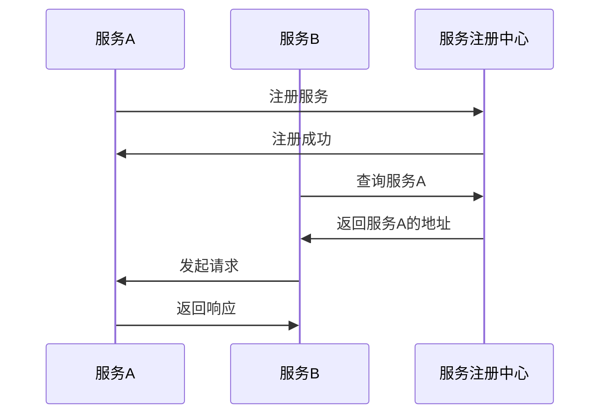
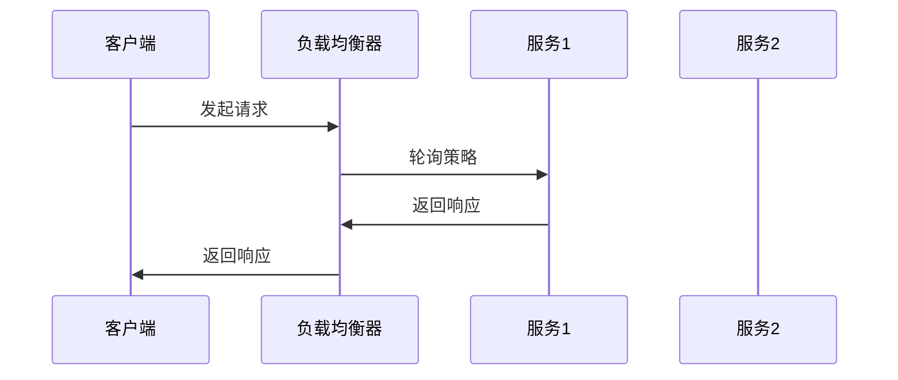
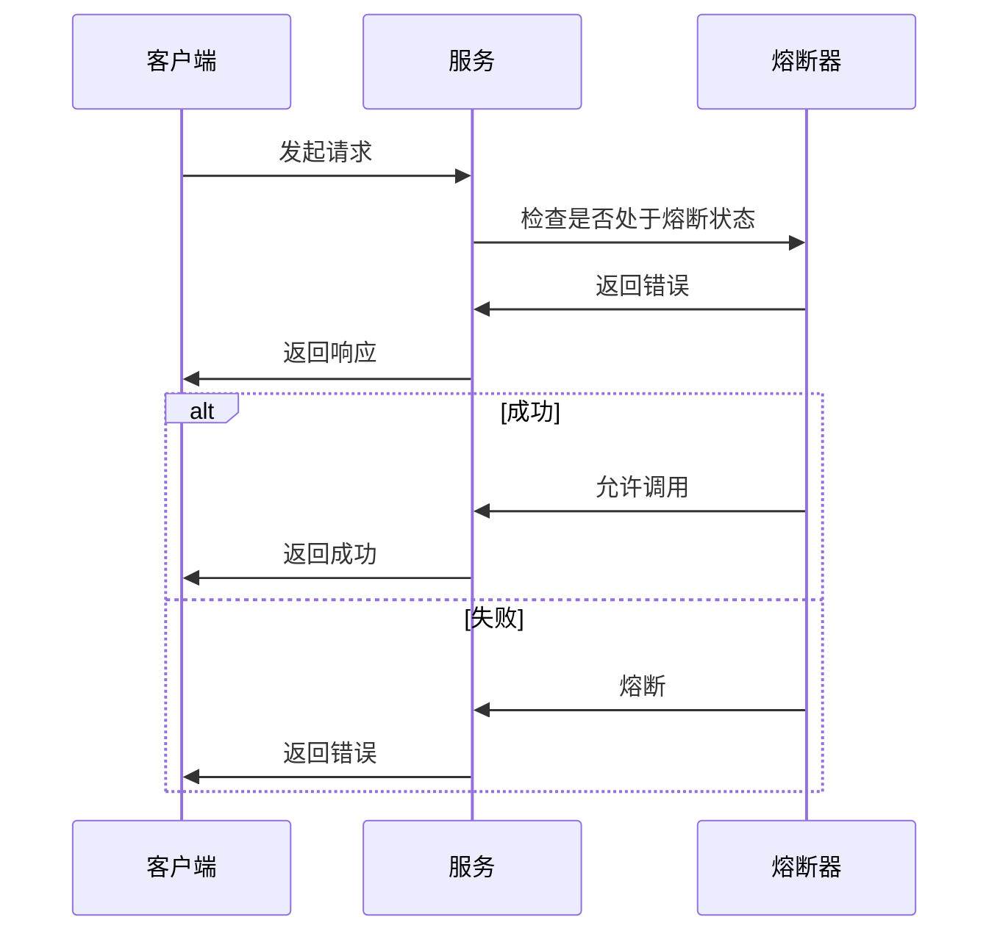
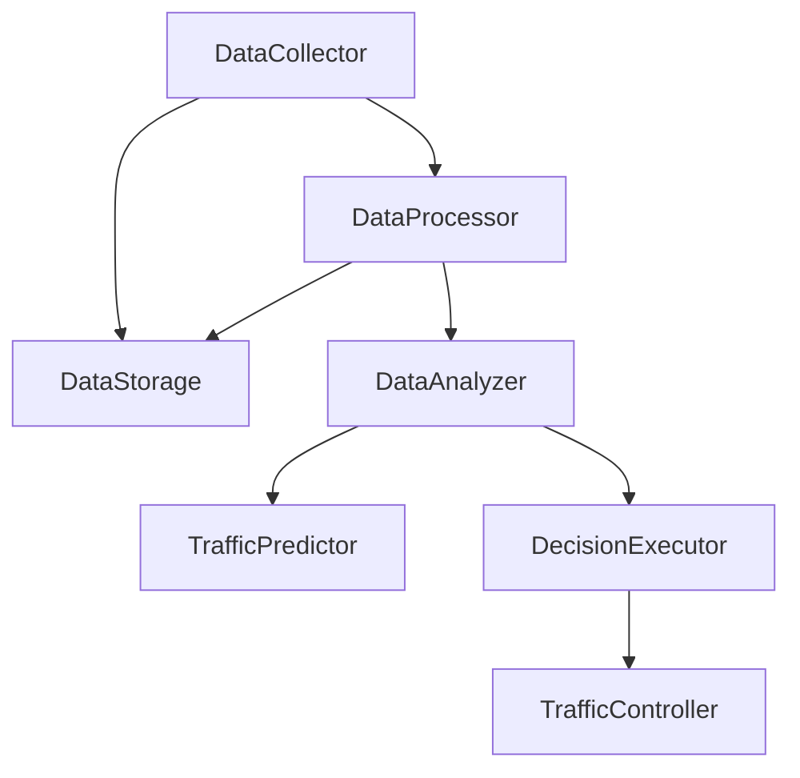
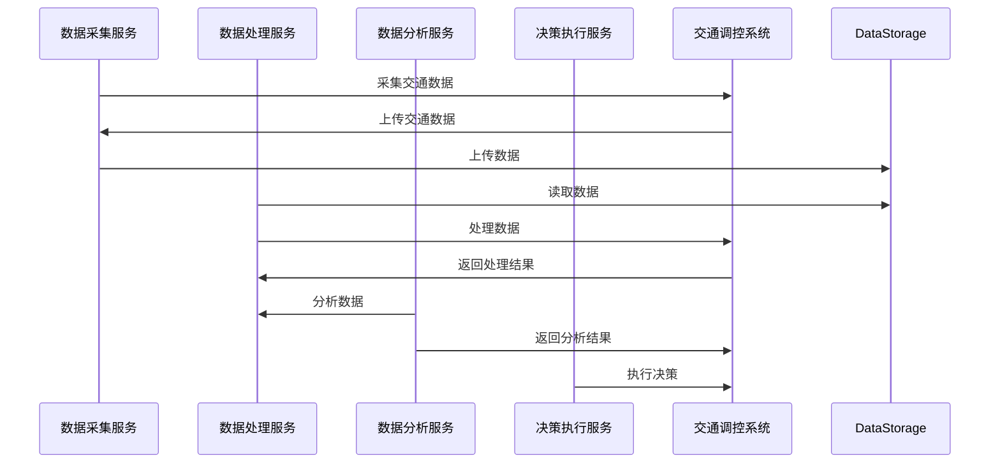

                 

## 微服务架构：构建模块化的AI Agent系统

### 关键词：
- 微服务架构
- 模块化
- AI Agent系统
- 服务拆分
- 服务自治
- 服务通信
- 容器化
- 服务发现
- 负载均衡
- 熔断机制

### 摘要：
本文深入探讨了微服务架构在构建模块化AI Agent系统中的重要性。首先介绍了微服务架构的基本概念和核心优势，接着详细解析了微服务的核心概念、关键算法及其设计原则。随后，通过一个具体的微服务项目实战，展示了微服务架构在AI Agent系统构建中的应用。最后，总结了微服务架构中的最佳实践，并对未来的研究方向进行了展望。

## 背景介绍

### 微服务架构的概念

微服务架构（Microservices Architecture）是一种软件架构模式，它将应用程序分解为一组小的、独立的、可复用的服务。每个服务都是高度专门化的，只负责完成特定的功能。这些服务通过轻量级的通信协议（如HTTP/REST）进行交互，通常部署在独立的容器中。微服务架构的核心思想是“关注点分离”和“分布式系统”，旨在提高系统的灵活性、可扩展性和可维护性。

### 微服务架构的优势

微服务架构相比传统的单体架构具有以下优势：

- **灵活性**：由于服务是独立的，可以随时根据需求进行添加、修改或替换，而不影响其他服务的运行。

- **可扩展性**：单个服务可以根据需求进行水平扩展，从而提高系统的整体性能。

- **独立部署和升级**：每个服务都可以独立部署和升级，减少了系统停机时间，提高了系统的可用性。

- **可复用性**：服务是独立的，可以在不同的项目中复用。

- **团队自治**：每个服务都可以由不同的团队独立开发和维护，提高了开发效率。

### 微服务与SOA的区别

微服务架构和面向服务架构（Service-Oriented Architecture，SOA）在表面上看似相似，但它们有本质的区别。

- **服务规模**：微服务通常更小、更专注于单一功能，而SOA中的服务规模较大，可能包含多个功能。

- **自治程度**：微服务是高度自治的，每个服务都有自己的数据库，而SOA中的服务通常共享数据库。

- **通信协议**：微服务通常使用轻量级的通信协议（如HTTP/REST），而SOA可能使用更加复杂的协议（如SOAP）。

- **部署方式**：微服务通常部署在容器中，如Docker，而SOA服务可能部署在虚拟机或物理服务器上。

## 核心概念与联系

### 服务拆分

服务拆分是微服务架构的核心概念之一。将一个庞大的单体应用拆分为多个独立的服务，每个服务专注于一个特定的业务功能。服务拆分的目的是提高系统的灵活性、可维护性和可扩展性。

### 服务自治

服务自治意味着每个服务都有自己独立的数据库、配置和部署环境，可以独立开发和部署。这种自治性使得服务可以独立伸缩，并且降低了系统之间的耦合度。

### 服务通信

服务通信是微服务架构中的关键组成部分。服务之间通过轻量级的通信协议（如HTTP/REST）进行交互。这种通信方式具有高效、灵活、易于扩展的特点。

### 容器化

容器化是微服务架构的另一个重要特点。通过容器（如Docker），可以将服务及其依赖环境打包在一起，实现服务的轻量化、快速部署和隔离。

### 关键算法

微服务架构中涉及多个关键算法，如服务发现、负载均衡和熔断机制。

- **服务发现**：服务发现是指系统自动识别和定位服务实例的过程。当服务启动时，它会将自己注册到服务发现机制中，其他服务可以通过服务发现机制找到并调用该服务。

- **负载均衡**：负载均衡是指将请求均匀分布到多个服务实例上，以提高系统的整体性能和可用性。

- **熔断机制**：熔断机制是一种保护机制，当服务实例失败或响应时间过长时，自动停止对该实例的调用，以防止系统过载。

### 表格与ER图

以下是一个简单的表格，展示了微服务架构中的核心概念及其关系：

| 概念       | 描述                                                         |
| ---------- | ------------------------------------------------------------ |
| 服务拆分   | 将应用拆分为多个独立服务                                     |
| 服务自治   | 每个服务独立部署、维护和扩展                                 |
| 服务通信   | 服务之间通过HTTP/REST进行通信                                 |
| 容器化     | 使用容器（如Docker）部署服务                                 |
| 服务发现   | 自动识别和定位服务实例的过程                                 |
| 负载均衡   | 将请求均匀分布到多个服务实例上                               |
| 熔断机制   | 在服务实例失败或响应时间过长时，自动停止对该实例的调用       |

以下是一个ER图，展示了微服务架构中的核心实体及其关系：

```mermaid
erDiagram
    Service --> Database
    Service --> Configuration
    Service --> Deployment
    Service --> ServiceInstance
    ServiceInstance --> Service
    ServiceInstance --> Request
    ServiceInstance --> Response
    Request --> Response
    LoadBalancer --> ServiceInstance
    CircuitBreaker --> ServiceInstance
```

## 算法原理讲解

### 服务发现

服务发现是一种自动化的机制，用于识别和定位服务实例。当服务实例启动时，它会将自己注册到服务发现系统中，其他服务可以通过服务发现系统找到并调用该服务。

以下是一个简单的服务发现算法：



### 负载均衡

负载均衡是将请求均匀分布到多个服务实例上的算法，以提高系统的整体性能和可用性。常见的负载均衡策略有轮询、随机、最小连接数等。

以下是一个简单的负载均衡算法：



### 熔断机制

熔断机制是一种保护机制，当服务实例失败或响应时间过长时，自动停止对该实例的调用，以防止系统过载。

以下是一个简单的熔断机制算法：



### Python代码与数学模型

以下是一个简单的Python代码示例，用于实现服务发现、负载均衡和熔断机制：

```python
import requests
import random
from circuitbreaker import CircuitBreaker

# 服务发现
def discover_service(service_name):
    response = requests.get(f'http://service_registry/{service_name}')
    if response.status_code == 200:
        return response.json()['url']
    else:
        return None

# 负载均衡
def load_balance(services):
    return random.choice(services)

# 熔断机制
class Service:
    def __init__(self, url):
        self.url = url
        self.circuit_breaker = CircuitBreaker(failure_threshold=3, recovery_timeout=60)

    def call(self):
        if self.circuit_breaker.is_open():
            return "服务不可用"
        try:
            response = requests.get(self.url)
            if response.status_code == 200:
                return "服务成功"
            else:
                return "服务失败"
        except Exception as e:
            return "服务失败"

# 测试
services = [
    Service(discover_service('service1')),
    Service(discover_service('service2')),
    Service(discover_service('service3'))
]

for _ in range(10):
    service = load_balance(services)
    print(service.call())
```

数学模型：

假设有一个服务集合S，其中包含n个服务实例，每个服务实例有独立的性能指标P_i。负载均衡算法的目标是最大化系统的整体性能，即最大化P_i * Q_i，其中Q_i是第i个服务实例的请求量。

熔断机制的数学模型如下：

- **失败次数阈值**：F_threshold
- **恢复时间阈值**：R_threshold

当服务实例的失败次数达到F_threshold时，熔断器打开，停止对该实例的调用。当服务实例的失败次数在连续R_threshold个周期内未达到F_threshold时，熔断器关闭，重新启用对该实例的调用。

## 系统分析与架构设计方案

### 问题场景介绍

假设我们要构建一个智能交通管理系统，该系统需要实时处理大量的交通数据，包括车辆信息、路况信息等。为了提高系统的灵活性、可扩展性和可维护性，我们决定采用微服务架构。

### 项目介绍

项目名称：智能交通管理系统（Smart Traffic Management System，STMS）

项目目标：构建一个模块化的AI Agent系统，实现实时交通数据收集、分析、预测和决策。

### 系统功能设计

系统功能设计主要包括以下模块：

- **数据采集模块**：负责从各种传感器和设备收集交通数据。
- **数据处理模块**：负责对采集到的交通数据进行清洗、转换和存储。
- **数据分析模块**：负责对交通数据进行分析，生成交通预测和决策。
- **决策执行模块**：负责根据分析结果执行相应的交通调控策略。

以下是一个简单的领域模型类图：

```mermaid
classDiagram
    DataCollector <-- DataProcessor
    DataProcessor --> DataAnalyzer
    DataAnalyzer <-- DecisionExecutor
    DataCollector <<interface>>
    DataProcessor <<interface>>
    DataAnalyzer <<interface>>
    DecisionExecutor <<interface>>
```

### 系统架构设计

系统架构设计主要包括以下组件：

- **数据采集服务**：负责实时采集交通数据，并上传到数据存储系统。
- **数据处理服务**：负责对采集到的交通数据进行处理，包括数据清洗、转换和存储。
- **数据分析服务**：负责对处理后的交通数据进行分析，生成交通预测和决策。
- **决策执行服务**：负责根据分析结果执行相应的交通调控策略。

以下是一个简单的系统架构图：



### 系统接口设计

系统接口设计主要包括以下API：

- **数据采集API**：用于接收交通数据，并上传到数据存储系统。
- **数据处理API**：用于处理交通数据，包括数据清洗、转换和存储。
- **数据分析API**：用于对交通数据进行分析，生成交通预测和决策。
- **决策执行API**：用于执行交通调控策略。

以下是一个简单的RESTful API设计：

```yaml
POST /data/collect
Description: 上传交通数据

Request:
- name: data
  type: file
  description: 交通数据文件

Response:
- status: 200
  description: 上传成功

POST /data/process
Description: 处理交通数据

Request:
- name: data
  type: file
  description: 交通数据文件

Response:
- status: 200
  description: 处理成功

GET /data/analyze
Description: 分析交通数据

Response:
- status: 200
  description: 分析结果

POST /decision/execute
Description: 执行交通调控策略

Request:
- name: strategy
  type: string
  description: 调控策略

Response:
- status: 200
  description: 执行成功
```

### 系统交互设计

系统交互设计主要包括以下场景：

- **数据采集**：数据采集服务定期采集交通数据，并上传到数据存储系统。
- **数据处理**：数据处理服务从数据存储系统中读取交通数据，并进行处理。
- **数据分析**：数据分析服务从数据处理系统中读取处理后的数据，进行分析，生成交通预测和决策。
- **决策执行**：决策执行服务从数据分析系统中读取分析结果，并执行相应的交通调控策略。

以下是一个简单的系统交互序列图：



## 项目实战

### 环境安装

为了搭建一个微服务架构的AI Agent系统，我们需要准备以下环境：

- 操作系统：Ubuntu 18.04
- 开发环境：Python 3.8
- 依赖管理：pip
- 容器化技术：Docker
- 服务注册与发现：Consul
- 负载均衡：Nginx
- 熔断机制：Hystrix

### 核心实现

以下是一个简单的微服务项目，包括数据采集、数据处理、数据分析和决策执行服务。

#### 数据采集服务

```python
# data_collector.py
from flask import Flask, request, jsonify
import requests

app = Flask(__name__)

@app.route('/data/collect', methods=['POST'])
def collect_data():
    data = request.files['data']
    # 上传数据到数据存储系统
    response = requests.post('http://data_storage:8080/data/upload', files={'data': data})
    return jsonify(response.json())

if __name__ == '__main__':
    app.run(host='0.0.0.0', port=8080)
```

#### 数据处理服务

```python
# data_processor.py
from flask import Flask, request, jsonify
import requests

app = Flask(__name__)

@app.route('/data/process', methods=['POST'])
def process_data():
    data = request.files['data']
    # 处理数据并上传到数据处理系统
    response = requests.post('http://data_processor:8080/data/process', files={'data': data})
    return jsonify(response.json())

if __name__ == '__main__':
    app.run(host='0.0.0.0', port=8080)
```

#### 数据分析服务

```python
# data_analyzer.py
from flask import Flask, request, jsonify
import requests

app = Flask(__name__)

@app.route('/data/analyze', methods=['GET'])
def analyze_data():
    # 从数据处理系统中读取处理后的数据
    response = requests.get('http://data_processor:8080/data')
    data = response.json()
    # 分析数据并生成预测结果
    prediction = analyze(data)
    return jsonify(prediction)

def analyze(data):
    # 数据分析算法实现
    pass

if __name__ == '__main__':
    app.run(host='0.0.0.0', port=8080)
```

#### 决策执行服务

```python
# decision_executor.py
from flask import Flask, request, jsonify
import requests

app = Flask(__name__)

@app.route('/decision/execute', methods=['POST'])
def execute_decision():
    strategy = request.json['strategy']
    # 从数据分析系统中读取分析结果
    response = requests.get('http://data_analyzer:8080/data/analyze')
    result = response.json()
    # 执行交通调控策略
    execute(result, strategy)
    return jsonify({"status": "success"})

def execute(result, strategy):
    # 交通调控策略执行实现
    pass

if __name__ == '__main__':
    app.run(host='0.0.0.0', port=8080)
```

### 代码分析

以上代码展示了数据采集、数据处理、数据分析和决策执行服务的实现。每个服务都通过RESTful API与其他服务进行通信。在数据采集服务中，我们使用Flask框架创建了一个简单的Web服务，用于接收交通数据并上传到数据存储系统。在数据处理服务中，我们同样使用Flask框架处理接收到的数据，并上传到数据处理系统。在数据分析和决策执行服务中，我们分别从数据处理系统和数据分析系统中读取数据，并执行相应的分析算法和交通调控策略。

### 实际案例分析与详细讲解剖析

为了展示微服务架构在AI Agent系统构建中的应用，我们选择了一个实际案例：智能交通管理系统的数据采集、处理、分析和决策执行过程。

1. **数据采集**：
   - **问题背景**：交通流量大，交通数据实时性强，需要高效、可靠的数据采集。
   - **解决方案**：使用传感器和设备实时采集交通数据，通过数据采集服务将数据上传到数据存储系统。

2. **数据处理**：
   - **问题背景**：交通数据量大，需要高效、准确的数据处理。
   - **解决方案**：使用数据处理服务对采集到的交通数据进行清洗、转换和存储，为后续分析提供可靠的数据源。

3. **数据分析**：
   - **问题背景**：交通数据复杂，需要高效、准确的交通数据分析。
   - **解决方案**：使用数据分析服务对处理后的交通数据进行分析，生成交通预测和决策。

4. **决策执行**：
   - **问题背景**：交通调控策略复杂，需要高效、准确的决策执行。
   - **解决方案**：使用决策执行服务根据分析结果执行交通调控策略，实现智能交通管理。

### 项目小结

通过以上实际案例的分析和讲解，我们可以看到微服务架构在AI Agent系统构建中的应用优势。微服务架构具有灵活、可扩展、可维护的特点，可以帮助我们高效地构建模块化的AI Agent系统。在实际项目中，我们需要根据具体需求选择合适的服务拆分方式、负载均衡策略和熔断机制，以提高系统的性能和稳定性。

## 最佳实践 Tips

1. **服务拆分**：根据业务需求和功能独立性进行服务拆分，避免过度拆分导致系统复杂性增加。

2. **负载均衡**：选择合适的负载均衡策略，如轮询、随机、最小连接数等，以提高系统的性能和可用性。

3. **熔断机制**：合理设置熔断阈值和恢复时间，避免系统过载，提高系统的稳定性。

4. **服务发现**：选择合适的服务注册与发现机制，如Consul、Zookeeper等，以提高系统的灵活性和可扩展性。

5. **容器化**：使用容器化技术（如Docker）部署服务，提高系统的部署效率和隔离性。

## 小结

本文详细介绍了微服务架构在构建模块化AI Agent系统中的应用，包括微服务架构的概念、核心优势、核心概念、关键算法、系统设计与架构设计、项目实战和最佳实践。通过实际案例的分析和讲解，展示了微服务架构在AI Agent系统构建中的优势。未来，我们可以进一步探讨微服务架构在其他领域的应用，如大数据处理、物联网等。

## 注意事项

1. 在实际项目中，需要根据具体需求选择合适的服务拆分方式，避免过度拆分导致系统复杂性增加。

2. 负载均衡策略和熔断机制的选择需要根据系统性能和稳定性要求进行合理设置。

3. 服务注册与发现机制的选择需要考虑系统的灵活性和可扩展性。

4. 容器化技术的使用可以提高系统的部署效率和隔离性，但需要合理配置和管理容器。

## 拓展阅读

- 《微服务设计》
- 《Docker实战》
- 《Kubernetes实战》
- 《服务发现与微服务》

## 作者信息

作者：AI天才研究院/AI Genius Institute & 禅与计算机程序设计艺术 /Zen And The Art of Computer Programming

