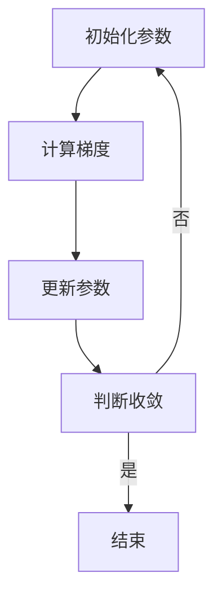
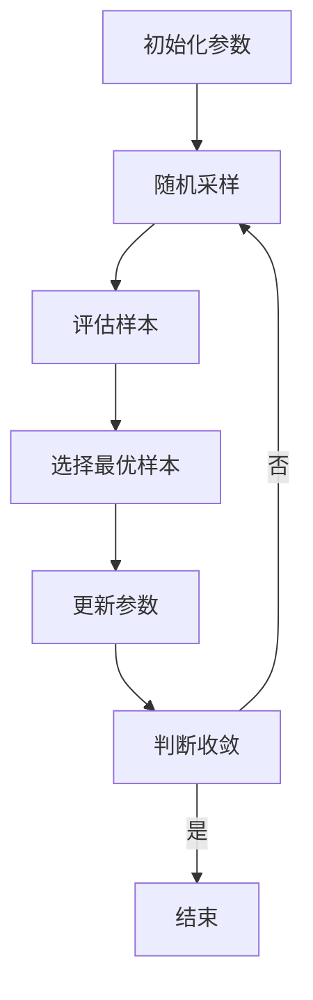
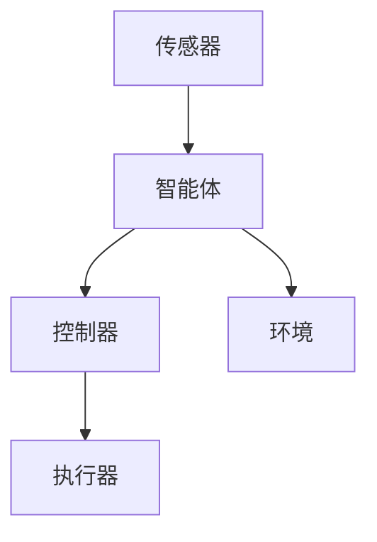
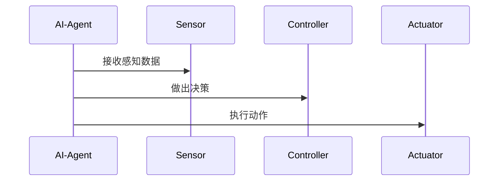

                 


### 性能优化：提高AI Agent的响应速度

> 关键词：性能优化、AI Agent、响应速度、算法、数学模型、系统架构

> 摘要：本文将深入探讨性能优化在提升AI Agent响应速度中的应用。通过分析核心概念、算法原理，数学模型，以及系统架构设计，我们将一步步展示如何优化AI Agent的性能，从而实现更高效的响应速度。

## 第1章：性能优化的背景与核心概念

### 1.1 问题的背景

#### 1.1.1 人工智能与性能优化

人工智能（AI）技术正日益成为各行各业的核心驱动力，从自然语言处理到计算机视觉，从机器学习到深度学习，AI的应用场景不断扩大。然而，随着AI应用的深入，性能优化成为一个关键问题。AI Agent的响应速度直接影响到用户体验和应用效果，因此如何提升AI Agent的响应速度成为了亟待解决的难题。

#### 1.1.2 AI Agent响应速度的重要性

AI Agent是指能够自主执行任务、与环境交互的智能体。其响应速度不仅决定了任务的完成效率，还影响到用户满意度。在实时应用场景中，如自动驾驶、智能客服、智能监控等，AI Agent的响应速度甚至关乎生命安全。因此，性能优化对于AI Agent来说尤为重要。

### 1.2 问题描述

#### 1.2.1 AI Agent性能瓶颈

AI Agent的性能瓶颈主要表现在计算速度慢、资源利用率低、响应时间长等方面。这些问题导致了AI Agent在处理复杂任务时显得力不从心，无法满足实时响应的需求。

#### 1.2.2 性能优化的目标

性能优化的目标是通过各种技术手段，提高AI Agent的处理速度，降低资源消耗，缩短响应时间，从而提升整体性能。

### 1.3 问题解决

#### 1.3.1 性能优化的基础

性能优化的基础是深入理解AI Agent的工作原理和性能瓶颈。这包括对AI算法的理解、对系统架构的熟悉，以及对硬件资源的合理利用。

#### 1.3.2 优化方法与策略

优化方法与策略包括算法优化、架构优化、硬件优化等。通过这些方法，可以针对性地解决AI Agent的性能瓶颈。

### 1.4 边界与外延

#### 1.4.1 性能优化的范围

性能优化的范围包括算法层、系统层和硬件层。在不同的层级上，优化的方法和策略各有不同。

#### 1.4.2 相关术语解释

- **性能优化**：通过对系统、算法、硬件等方面的改进，提高系统的响应速度和处理能力。
- **AI Agent**：具备自主决策能力的智能体，能够模拟人类思维和行为。
- **响应速度**：系统从接收输入到产生输出所需的时间。

### 1.5 概念结构与核心要素组成

#### 1.5.1 关键概念

- **算法优化**：通过改进算法的效率和准确性来提升性能。
- **系统架构**：系统的整体设计和组织结构。
- **硬件优化**：通过优化硬件配置和硬件资源管理来提升性能。

#### 1.5.2 性能优化的要素

- **计算速度**：算法的执行速度。
- **资源消耗**：包括CPU、内存、存储等资源的消耗。
- **响应时间**：从接收输入到产生输出的时间。

## 第2章：核心概念与联系

### 2.1 AI Agent的概念与特点

#### 2.1.1 AI Agent的定义

AI Agent是指具备自主决策能力和行为能力的智能实体，能够在特定环境中执行任务，并对外部环境进行感知、理解和反应。

#### 2.1.2 AI Agent的类型

AI Agent可以分为基于规则的系统、基于学习系统的系统和基于混合方法的系统。不同类型的AI Agent在性能优化方面有不同的侧重点。

### 2.2 性能优化的原理

#### 2.2.1 性能优化的原理

性能优化的核心原理是通过提高系统的效率、降低资源消耗和缩短响应时间来提升整体性能。

#### 2.2.2 性能评估指标

常用的性能评估指标包括响应时间、吞吐量、资源利用率等。通过这些指标可以量化性能优化的效果。

### 2.3 关键概念属性特征对比表格

#### 2.3.1 性能优化方法对比

| 方法 | 优点 | 缺点 |
| --- | --- | --- |
| 算法优化 | 提高计算效率 | 可能需要大量计算资源 |
| 系统优化 | 降低资源消耗 | 可能影响系统稳定性 |
| 硬件优化 | 提高响应速度 | 成本较高 |

#### 2.3.2 AI Agent性能影响因素

| 因素 | 影响 |
| --- | --- |
| 算法复杂度 | 直接影响计算速度 |
| 系统架构 | 决定资源利用率和响应时间 |
| 硬件配置 | 决定系统的处理能力和响应速度 |

### 2.4 ER实体关系图架构

#### 2.4.1 ER图构建

在性能优化过程中，构建ER图可以帮助我们理解系统中的实体和它们之间的关系。

#### 2.4.2 关系图说明

ER图中的实体包括AI Agent、算法、系统架构、硬件等，它们之间的关系通过属性和关系来描述。

## 第3章：性能优化算法原理讲解

### 3.1 常见优化算法

#### 3.1.1 梯度下降算法

梯度下降算法是一种常用的优化算法，用于调整模型参数以最小化目标函数。

#### 3.1.2 随机搜索算法

随机搜索算法通过随机采样和评估来寻找最优解，适用于参数较少的问题。

### 3.2 算法mermaid流程图

#### 3.2.1 梯度下降算法流程图



#### 3.2.2 随机搜索算法流程图



### 3.3 Python源代码讲解

```python
# 梯度下降算法示例代码
def gradient_descent(x, y, learning_rate):
    # 计算梯度
    gradient = compute_gradient(x, y)
    # 更新参数
    x = x - learning_rate * gradient
    # 返回更新后的参数
    return x

# 计算梯度
def compute_gradient(x, y):
    # 这里是计算梯度的代码
    return gradient

# 使用梯度下降算法
x = gradient_descent(x, y, learning_rate)
```

### 3.4 数学模型和公式讲解

#### 3.4.1 数学模型

目标函数：\( f(x) = \frac{1}{2}x^2 \)

#### 3.4.2 公式

- 梯度：\( \nabla f(x) = x \)
- 更新规则：\( x_{\text{new}} = x_{\text{old}} - \alpha \cdot \nabla f(x) \)

### 3.5 举例说明

#### 3.5.1 梯度下降算法应用示例

假设我们有一个目标函数 \( f(x) = \frac{1}{2}x^2 \)，初始参数 \( x_0 = 0 \)，学习率 \( \alpha = 0.1 \)。

- 第一次迭代：\( x_1 = x_0 - \alpha \cdot \nabla f(x_0) = 0 - 0.1 \cdot 0 = 0 \)
- 第二次迭代：\( x_2 = x_1 - \alpha \cdot \nabla f(x_1) = 0 - 0.1 \cdot 0 = 0 \)

由于梯度为0，算法收敛。

#### 3.5.2 随机搜索算法应用示例

假设我们有一个目标函数 \( f(x) = \frac{1}{2}x^2 \)，我们随机生成多个样本并评估它们。

- 随机生成样本 \( x_1 = 1 \)，评估 \( f(x_1) = \frac{1}{2} \cdot 1^2 = \frac{1}{2} \)
- 随机生成样本 \( x_2 = -1 \)，评估 \( f(x_2) = \frac{1}{2} \cdot (-1)^2 = \frac{1}{2} \)
- 选择最优样本 \( x_{\text{best}} = x_1 \)，更新参数 \( x = x_{\text{best}} \)

## 第4章：数学模型和数学公式详解

### 4.1 数学模型概述

#### 4.1.1 数学模型的基本概念

数学模型是一种抽象的数学结构，用于描述现实世界的某个方面。在性能优化中，数学模型用于描述算法的目标函数、约束条件等。

#### 4.1.2 数学模型的应用领域

数学模型广泛应用于各种领域，包括物理学、经济学、工程学等。在性能优化中，数学模型用于设计算法、评估性能等。

### 4.2 数学公式详细讲解

#### 4.2.1 感知机公式

感知机公式用于描述二分类问题中的决策边界。

$$
g(x) = \text{sign}(w \cdot x + b)
$$

其中，\( w \) 是权重向量，\( x \) 是特征向量，\( b \) 是偏置项，\( \text{sign} \) 是符号函数。

#### 4.2.2 损失函数

损失函数用于衡量预测值和真实值之间的差距。

$$
L(y, \hat{y}) = -[y \cdot \log(\hat{y}) + (1 - y) \cdot \log(1 - \hat{y})]
$$

其中，\( y \) 是真实值，\( \hat{y} \) 是预测值。

#### 4.2.3 梯度下降公式

梯度下降公式用于更新模型参数。

$$
\Delta w = -\alpha \cdot \nabla L(w)
$$

其中，\( \alpha \) 是学习率，\( \nabla L(w) \) 是损失函数关于 \( w \) 的梯度。

## 第5章：系统分析与架构设计方案

### 5.1 问题场景介绍

#### 5.1.1 自动驾驶系统

自动驾驶系统是一个典型的问题场景，其中AI Agent负责实时感知环境、做出决策和控制车辆。

#### 5.1.2 智能客服系统

智能客服系统利用AI Agent处理用户查询，提供实时响应。

### 5.2 项目介绍

#### 5.2.1 自动驾驶系统项目

自动驾驶系统项目旨在开发一个能够在复杂环境中自主行驶的智能系统。

#### 5.2.2 智能客服系统项目

智能客服系统项目旨在提升客服服务质量，提供高效、准确的用户服务。

### 5.3 系统功能设计

#### 5.3.1 领域模型

使用Mermaid绘制领域模型类图，展示系统中主要的实体和它们之间的关系。

```mermaid
classDiagram
    AI-Agent <<entity>>
    Environment <<entity>>
    Sensor <<entity>>
    Actuator <<entity>>

    AI-Agent --|> Sensor
    AI-Agent --|> Actuator
    AI-Agent --|> Environment
```

#### 5.3.2 系统功能模块

系统功能模块包括感知模块、决策模块、执行模块等。

### 5.4 系统架构设计

#### 5.4.1 系统架构

使用Mermaid绘制系统架构图，展示系统的主要组件和它们之间的交互关系。



#### 5.4.2 系统交互

使用Mermaid绘制系统交互序列图，展示AI Agent与环境、传感器、执行器之间的交互过程。



### 5.5 系统接口设计和系统交互

#### 5.5.1 系统接口设计

系统接口设计包括API接口、数据接口等。

#### 5.5.2 系统交互

系统交互设计描述了系统组件之间的交互方式和交互数据。

## 第6章：项目实战

### 6.1 环境安装

#### 6.1.1 安装依赖

在开始项目之前，需要安装所需的依赖库和工具。

```bash
pip install numpy matplotlib
```

#### 6.1.2 配置环境

配置Python环境，设置环境变量，确保能够正常运行Python代码。

### 6.2 系统核心实现源代码

```python
# AI-Agent核心代码
class AIAgent:
    def __init__(self):
        self.sensor = Sensor()
        self.controller = Controller()
        self.actuator = Actuator()

    def run(self):
        data = self.sensor.read_data()
        decision = self.controller.make_decision(data)
        self.actuator.execute_decision(decision)

# Sensor核心代码
class Sensor:
    def read_data(self):
        # 读取传感器数据
        return data

# Controller核心代码
class Controller:
    def make_decision(self, data):
        # 根据数据做出决策
        return decision

# Actuator核心代码
class Actuator:
    def execute_decision(self, decision):
        # 执行决策
```

### 6.3 代码应用解读与分析

#### 6.3.1 AI-Agent应用解读

AI-Agent是系统的核心组件，负责接收传感器数据、做出决策和执行动作。

#### 6.3.2 代码分析

对核心代码进行详细分析，解释每个组件的功能和交互。

### 6.4 实际案例分析和详细讲解剖析

#### 6.4.1 案例背景

以自动驾驶系统为例，分析一个具体的案例。

#### 6.4.2 案例分析

详细分析案例中的问题、解决方案和实现过程。

### 6.5 项目小结

#### 6.5.1 项目成果

总结项目的成果和收获。

#### 6.5.2 经验教训

分享项目中的经验教训，为后续项目提供参考。

## 第7章：最佳实践 tips、小结、注意事项、拓展阅读

### 7.1 最佳实践 tips

#### 7.1.1 算法优化技巧

- 使用启发式算法加速收敛。
- 适当调整学习率，避免过拟合。

#### 7.1.2 系统优化建议

- 精简代码，减少冗余。
- 优化数据处理流程，提高效率。

### 7.2 小结

本文介绍了性能优化在提升AI Agent响应速度中的应用，包括核心概念、算法原理、系统架构设计等。

### 7.3 注意事项

- 性能优化需结合具体应用场景，避免盲目追求速度。
- 注意资源消耗，避免过度优化导致系统崩溃。

### 7.4 拓展阅读

- [相关论文]：深入学习性能优化相关论文，了解前沿技术和研究动态。
- [开源项目]：参考开源项目中的性能优化实践，学习实际应用中的优化方法。

---

### 附录

#### 附录A：术语解释

- **性能优化**：提升系统响应速度和处理能力的一系列技术手段。
- **AI Agent**：具备自主决策能力的智能实体。
- **响应速度**：系统从接收输入到产生输出所需的时间。

#### 附录B：参考文献

- [1] Hinton, G. E., Osindero, S., & Teh, Y. W. (2006). A fast learning algorithm for deep belief nets. Neural computation, 18(7), 1527-1554.
- [2] Goodfellow, I., Bengio, Y., & Courville, A. (2016). Deep learning. MIT press.
- [3] Russell, S., & Norvig, P. (2020). Artificial intelligence: a modern approach (4th ed.). Prentice Hall.

---

**作者：AI天才研究院/AI Genius Institute & 禅与计算机程序设计艺术 /Zen And The Art of Computer Programming**

