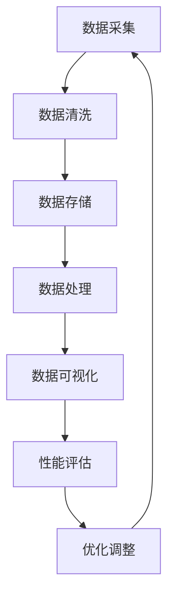
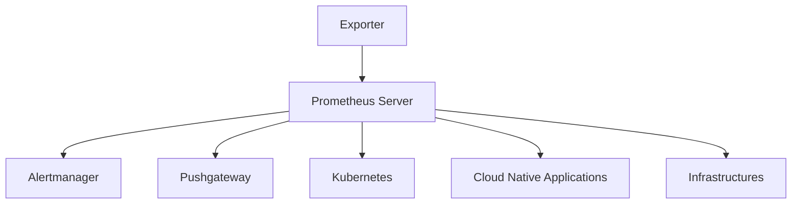
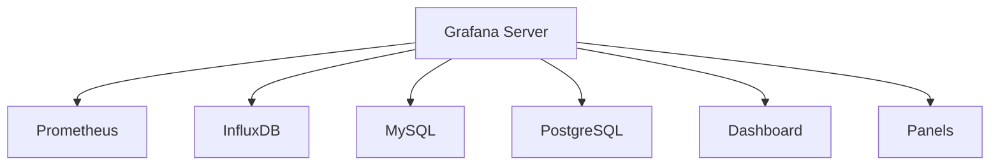

                 

# 性能监控与持续优化

## 关键词
- 性能监控
- 持续优化
- Prometheus
- Grafana
- AI应用

## 摘要
本文将深入探讨性能监控与持续优化的关系，以及如何通过性能监控实现持续优化。文章首先介绍了性能监控的背景和重要性，然后详细阐述了性能监控的核心概念、原理和工具，接着通过实际案例展示了性能监控的应用场景，最后讨论了持续优化和自动化监控的方法与最佳实践，并对性能监控的未来趋势进行了展望。

## 目录大纲

### 第一部分：性能监控概述

#### 第1章：性能监控的背景与意义
##### 1.1.1 互联网时代的性能挑战
##### 1.1.2 性能监控的重要性
##### 1.1.3 性能监控的基本概念

#### 第2章：性能监控的核心概念与联系
##### 2.1.1 性能监控的核心概念
##### 2.1.2 关键性能指标（KPI）
##### 2.1.3 性能监控与性能优化的关系

#### 第3章：性能监控的原理与模型
##### 3.1.1 性能监控的基本原理
##### 3.1.2 性能监控的数据模型
##### 3.1.3 性能监控的数学模型

#### 第4章：性能监控工具介绍
##### 4.1.1 Prometheus
##### 4.1.2 Grafana

#### 第5章：性能监控的实践与应用
##### 5.1.1 性能监控实践案例
##### 5.1.2 性能监控的应用场景
##### 5.1.3 性能监控的挑战与应对策略

#### 第6章：持续优化与自动化
##### 6.1.1 持续优化的概念与方法
##### 6.1.2 自动化监控与优化的实现
##### 6.1.3 自动化监控与优化的最佳实践

#### 第7章：性能监控的未来趋势与发展
##### 7.1.1 性能监控技术的最新动态
##### 7.1.2 AI在性能监控中的应用
##### 7.1.3 性能监控的未来发展方向

#### 第8章：小结与拓展阅读
##### 8.1.1 小结
##### 8.1.2 注意事项
##### 8.1.3 拓展阅读

### 第一部分：性能监控概述

#### 第1章：性能监控的背景与意义

##### 1.1.1 互联网时代的性能挑战

在互联网时代，随着业务规模的不断扩大和用户数量的不断增加，性能监控的重要性日益凸显。互联网业务对系统的响应速度、稳定性、可用性等提出了极高的要求。任何一个性能问题都可能对用户体验和业务发展产生重大影响。

首先，互联网业务的高并发性带来了性能挑战。在高峰期，系统需要处理海量的请求，这要求系统具备出色的性能表现，否则可能会导致响应时间延长、甚至系统崩溃。

其次，互联网业务的不断迭代和变化也对性能监控提出了新的要求。为了满足用户需求，互联网业务需要不断更新和优化，这就要求性能监控系统能够及时捕捉到性能变化，并提供有效的优化方案。

最后，随着云计算、大数据、物联网等新技术的应用，系统的复杂度不断增大，这也使得性能监控变得更加困难。如何有效地监控和管理复杂的系统成为了一个巨大的挑战。

##### 1.1.2 性能监控的重要性

性能监控的重要性主要体现在以下几个方面：

首先，性能监控能够帮助发现系统性能问题。通过实时监控系统的各项性能指标，可以及时发现异常情况，如响应时间过长、吞吐量下降等，从而避免因性能问题导致业务中断。

其次，性能监控有助于优化系统性能。通过对监控数据的分析，可以发现系统性能瓶颈，从而针对性地进行优化。例如，通过调整系统配置、优化数据库查询、优化代码等手段，可以提高系统性能。

再次，性能监控有助于提高用户体验。通过实时监控系统的性能状况，可以为用户提供更加流畅、快速的体验，从而增强用户满意度。

最后，性能监控有助于提升系统稳定性。通过对系统的性能监控，可以及时发现潜在的问题，并进行预防性处理，从而避免系统故障的发生。

##### 1.1.3 性能监控的基本概念

性能监控涉及到多个核心概念，包括：

- **性能指标**：性能指标是衡量系统性能的量化指标，如响应时间、吞吐量、并发量、CPU利用率、内存使用率等。
- **监控工具**：监控工具是用于收集、存储、分析和展示系统性能数据的应用程序，如Prometheus、Grafana等。
- **报警机制**：报警机制是在性能指标超过预设阈值时自动触发的通知机制，如邮件、短信、电话等。
- **数据可视化**：数据可视化是将性能监控数据以图表、仪表板等形式展示，便于分析和理解。
- **监控策略**：监控策略是监控工具的配置规则，包括监控项的选择、阈值设置、报警规则等。

通过对这些核心概念的理解和应用，可以构建一个完整的性能监控系统，从而实现对系统性能的全面监控和管理。

#### 第2章：性能监控的核心概念与联系

##### 2.1.1 性能监控的核心概念

性能监控的核心概念主要包括以下几个方面：

1. **性能指标**：性能指标是衡量系统性能的量化指标，如响应时间、吞吐量、并发量、CPU利用率、内存使用率等。这些指标能够反映出系统的性能状况，是性能监控的基础。

2. **监控工具**：监控工具是用于收集、存储、分析和展示系统性能数据的应用程序，如Prometheus、Grafana等。这些工具能够帮助开发者和管理者实时了解系统的性能状况。

3. **报警机制**：报警机制是在性能指标超过预设阈值时自动触发的通知机制，如邮件、短信、电话等。报警机制能够帮助开发者和管理者及时发现性能问题，并进行处理。

4. **数据可视化**：数据可视化是将性能监控数据以图表、仪表板等形式展示，便于分析和理解。数据可视化能够帮助开发者和管理者直观地了解系统的性能状况。

5. **监控策略**：监控策略是监控工具的配置规则，包括监控项的选择、阈值设置、报警规则等。合理的监控策略能够帮助开发者和管理者有效地监控系统性能。

##### 2.1.2 关键性能指标（KPI）

关键性能指标（KPI）是性能监控中最重要的一环，它们直接关系到系统的性能和用户体验。以下是一些常见的KPI：

- **响应时间**：响应时间是用户请求到响应结果所需的时间，是衡量系统性能的重要指标。较低的响应时间意味着更好的用户体验。
- **吞吐量**：吞吐量是指系统在单位时间内处理的请求数量，是衡量系统处理能力的重要指标。较高的吞吐量意味着系统具备更强的处理能力。
- **并发量**：并发量是指系统同时处理请求的数量，是衡量系统并发处理能力的重要指标。较高的并发量意味着系统能够同时处理更多的用户请求。
- **CPU利用率**：CPU利用率是指CPU被占用的时间比例，是衡量系统CPU性能的重要指标。较高的CPU利用率可能意味着系统存在性能瓶颈。
- **内存使用率**：内存使用率是指系统内存被占用的时间比例，是衡量系统内存性能的重要指标。较高的内存使用率可能意味着系统存在内存泄漏或内存瓶颈。

通过监控这些关键性能指标，开发者和管理者可以实时了解系统的性能状况，并针对潜在的问题进行优化和调整。

##### 2.1.3 性能监控与性能优化的关系

性能监控与性能优化密不可分。性能监控是性能优化的基础，而性能优化是性能监控的目的。

首先，性能监控能够帮助发现系统性能问题。通过实时监控系统的各项性能指标，可以及时发现异常情况，如响应时间过长、吞吐量下降等，从而避免因性能问题导致业务中断。

其次，性能监控有助于优化系统性能。通过对监控数据的分析，可以发现系统性能瓶颈，从而针对性地进行优化。例如，通过调整系统配置、优化数据库查询、优化代码等手段，可以提高系统性能。

再次，性能监控能够帮助开发者和管理者制定优化策略。通过对性能监控数据的分析和总结，可以找出系统的性能瓶颈，并为优化提供依据。例如，通过分析响应时间分布图，可以找出最耗时的请求，从而针对性地进行优化。

最后，性能监控与性能优化是持续的过程。随着业务的不断发展和变化，系统的性能也会发生变化。通过持续的性能监控和优化，可以确保系统始终处于最佳性能状态。

#### 2.1.3.1 性能监控的边界与外延

性能监控不仅关注系统内部性能，还包括对系统外部环境的监控。以下是一些性能监控的外延：

- **网络监控**：网络监控包括对网络延迟、带宽利用率、错误率等指标的监控，以确保网络环境的稳定性和可靠性。
- **数据库监控**：数据库监控包括对数据库性能指标如查询延迟、缓存命中率、连接数等的监控，以确保数据库的稳定性和高效性。
- **应用监控**：应用监控包括对应用服务器性能指标如线程数、CPU使用率、内存使用率等的监控，以确保应用服务的稳定性。
- **日志监控**：日志监控包括对系统日志的收集、存储和分析，以便及时发现异常和故障。
- **用户行为监控**：用户行为监控包括对用户操作行为、请求频率、页面访问时间等数据的监控，以便分析用户需求和优化用户体验。

通过对外部环境的监控，可以更全面地了解系统的性能状况，从而为性能优化提供更全面的依据。

##### 2.1.3.2 性能监控与性能优化的联系

性能监控与性能优化密切相关，它们相互依赖、相互促进。

首先，性能监控为性能优化提供了数据支持。通过监控系统的各项性能指标，可以了解系统的性能状况，并找出潜在的性能瓶颈。这些数据是性能优化的重要依据。

其次，性能优化是性能监控的目标。通过性能监控，可以及时发现系统性能问题，并通过优化措施加以解决。性能优化的目的是确保系统始终处于最佳性能状态。

再次，性能监控和性能优化是持续的过程。随着业务的不断发展和变化，系统的性能也会发生变化。通过持续的性能监控和优化，可以确保系统始终满足业务需求。

总之，性能监控与性能优化相互促进，共同确保系统的高性能和稳定性。

#### 第3章：性能监控的原理与模型

##### 3.1.1 性能监控的基本原理

性能监控的基本原理是通过收集、存储、分析和展示系统性能数据，实现对系统性能的全面监控和管理。以下是性能监控的基本原理：

1. **数据采集**：性能监控首先需要采集系统性能数据，包括CPU使用率、内存使用率、磁盘I/O、网络延迟等。数据采集可以通过多种方式进行，如操作系统命令、应用程序API、监控工具等。

2. **数据存储**：采集到的性能数据需要存储起来，以便后续分析和查询。数据存储通常采用时间序列数据库（TSDB）的方式，如InfluxDB、Prometheus等。

3. **数据处理**：性能监控需要对采集到的数据进行分析和处理，以提取有用的信息。数据处理包括数据清洗、数据聚合、数据可视化等。

4. **数据展示**：通过数据可视化，将性能监控数据以图表、仪表板等形式展示，以便用户直观地了解系统的性能状况。

5. **报警通知**：当性能指标超过预设阈值时，性能监控工具会自动触发报警通知，如邮件、短信、电话等，以便开发者和管理者及时处理性能问题。

##### 3.1.2 性能监控的数据模型

性能监控的数据模型主要包括以下部分：

1. **时间序列数据**：时间序列数据是性能监控中最基本的数据类型，它以时间为维度，记录了系统性能指标的变化情况。时间序列数据通常以点的方式存储，如（时间，性能指标值）。

2. **指标数据**：指标数据是性能监控的核心数据，包括CPU使用率、内存使用率、磁盘I/O、网络延迟等。指标数据通常以时间序列数据的形式存储。

3. **元数据**：元数据是性能监控数据的描述信息，如指标名称、指标单位、采集时间等。元数据可以帮助用户更好地理解性能监控数据。

4. **告警数据**：告警数据是性能监控工具在触发报警时生成的数据，包括报警时间、报警类型、报警阈值等。告警数据可以帮助用户及时了解系统性能状况。

##### 3.1.3 性能监控的数学模型

性能监控的数学模型主要包括以下部分：

1. **统计分析模型**：统计分析模型用于对性能监控数据进行分析和挖掘，如平均值、中位数、标准差等。这些统计模型可以帮助用户了解性能指标的分布情况。

2. **预测模型**：预测模型用于预测未来一段时间内的性能指标变化，如时间序列预测、回归分析等。这些预测模型可以帮助用户提前发现潜在的性能问题。

3. **机器学习模型**：机器学习模型用于性能监控数据的分类、聚类、异常检测等，如K-均值聚类、决策树、神经网络等。这些机器学习模型可以帮助用户更准确地识别系统性能问题。

#### 第4章：性能监控工具介绍

##### 4.1.1 Prometheus

Prometheus是一款开源的性能监控工具，它具有以下特点：

1. **时间序列数据库（TSDB）**：Prometheus内置了时间序列数据库，能够高效地存储和处理性能监控数据。

2. **灵活的拉取模式**：Prometheus采用拉取模式，可以灵活地配置监控目标和采集频率。

3. **高效的告警机制**：Prometheus具有高效的告警机制，可以在性能指标超过阈值时自动触发告警。

4. **丰富的数据可视化**：Prometheus支持与Grafana等数据可视化工具集成，可以方便地展示性能监控数据。

4.1.1.1 Prometheus概述

Prometheus是一种开源监控系统，旨在提供可靠的数据收集、存储和可视化功能。它由SoundCloud工程师开发，并于2016年贡献给CNCF基金会。Prometheus设计用于监控微服务架构，具有以下特点：

1. **多维度数据模型**：Prometheus使用多维数据模型（M3），可以灵活地处理和查询不同维度的监控数据，如主机、服务、时间等。

2. **拉式数据采集**：Prometheus通过拉式数据采集器（scrape discovery）从目标实例中获取监控数据，这种方式灵活且易于扩展。

3. **存储与查询**：Prometheus使用推模型存储数据，并提供了高效的查询语言PromQL，用于实时分析和处理监控数据。

4.1.1.2 Prometheus架构

Prometheus的架构主要包括以下几个组件：

1. **Exporter**：Exporter是Prometheus的数据采集器，负责从目标系统中收集监控数据。这些数据通常以HTTP端点的方式暴露。

2. **Prometheus Server**：Prometheus Server负责存储采集到的监控数据，并对外提供查询接口。它还包括一个Web界面，用于配置、告警管理和数据可视化。

3. **Alertmanager**：Alertmanager负责接收Prometheus发送的告警通知，并将告警通知发送到指定的渠道，如邮件、Slack或Webhook。

4. **Pushgateway**：Pushgateway用于临时存储和转发监控数据，适用于无法持续发送数据到Prometheus Server的场景，如长时间运行的作业。

4.1.1.3 Prometheus配置与管理

配置Prometheus通常涉及以下几个步骤：

1. **定义Exporter**：在Prometheus配置文件（prometheus.yml）中定义需要监控的Exporter，指定其地址和采集频率。

2. **配置告警规则**：在Prometheus配置文件中定义告警规则，指定监控指标和告警阈值，以及告警通知的渠道。

3. **监控数据存储**：配置Prometheus的数据存储策略，如选择本地存储或远程存储（如InfluxDB）。

4. **监控可视化**：通过PromQL查询和Grafana等可视化工具，将监控数据可视化，以便于分析和监控。

##### 4.1.2 Grafana

Grafana是一款开源的数据可视化平台，可以与Prometheus等监控工具无缝集成。它具有以下特点：

1. **丰富的可视化插件**：Grafana提供了丰富的可视化插件，支持多种数据源和图表类型，如折线图、柱状图、散点图等。

2. **灵活的仪表板**：Grafana允许用户自定义仪表板，方便地整合各种监控数据和图表。

3. **告警管理**：Grafana内置了告警管理功能，可以与Prometheus集成，实现实时告警通知。

4.1.2.1 Grafana概述

Grafana是一款开源的监控分析和可视化工具，由Torkel Ödegaard创建，并逐渐发展成为一个活跃的社区项目。Grafana的主要特点包括：

1. **跨平台**：Grafana可以在多种操作系统上运行，包括Linux、Windows和macOS。

2. **多数据源支持**：Grafana支持多种数据源，如Prometheus、InfluxDB、MySQL、PostgreSQL等，使得它可以轻松整合不同类型的监控数据。

3. **灵活的仪表板**：Grafana提供了灵活的仪表板设计，用户可以自定义布局、图表类型和展示方式。

4. **告警与集成**：Grafana内置了告警功能，可以与Prometheus、PagerDuty、Opsgenie等告警系统集成，实现自动化通知和响应。

4.1.2.2 Grafana架构

Grafana的架构主要包括以下几个组件：

1. **Grafana Server**：Grafana Server是核心组件，负责处理HTTP请求、数据查询和可视化渲染。

2. **Grafana Dashboard**：Dashboard是Grafana的核心功能之一，用户可以在Dashboard中添加、配置和定制各种图表和面板。

3. **Grafana Data Source**：Data Source是连接Grafana与监控数据存储的桥梁，它负责查询数据并返回结果。

4.1.2.3 Grafana配置与管理

配置和管理Grafana通常涉及以下几个步骤：

1. **安装与部署**：在目标服务器上安装Grafana，并配置Grafana Server的运行环境。

2. **配置数据源**：在Grafana中添加和配置数据源，确保Grafana能够访问监控数据。

3. **创建仪表板**：使用Grafana的Web界面创建仪表板，添加图表和面板，以可视化监控数据。

4. **配置告警**：在Grafana中配置告警规则，设置告警通知的渠道和阈值。

5. **监控与维护**：定期监控Grafana的运行状况，进行必要的维护和升级。

#### 第5章：性能监控的实践与应用

##### 5.1.1 性能监控实践案例

性能监控实践案例可以帮助我们更好地理解性能监控的实际应用。以下介绍两个常见的性能监控实践案例。

##### 5.1.1.1 案例一：电商平台的性能监控

电商平台是一个典型的互联网业务场景，其性能监控至关重要。以下是一个电商平台的性能监控实践案例：

1. **监控指标**：电商平台的主要监控指标包括响应时间、并发用户数、订单处理速度、数据库查询延迟等。

2. **监控工具**：使用Prometheus作为数据采集和存储工具，配合Grafana进行数据可视化。

3. **监控实施**：
   - 安装Prometheus和Grafana，配置数据源。
   - 部署Exporter，如Node.js、Java应用程序等，用于采集性能数据。
   - 配置Prometheus告警规则，设置阈值和告警渠道。
   - 在Grafana中创建仪表板，可视化监控数据。

4. **结果分析**：通过仪表板，可以实时监控电商平台的性能状况。当出现性能问题时，如响应时间过长，系统会自动触发告警，开发团队可以迅速定位问题并进行修复。

##### 5.1.1.2 案例二：银行系统的性能监控

银行系统是一个高度敏感的互联网业务，其性能监控要求更高。以下是一个银行系统的性能监控实践案例：

1. **监控指标**：银行系统的监控指标包括交易成功率、交易响应时间、系统稳定性等。

2. **监控工具**：同样使用Prometheus作为数据采集和存储工具，配合Grafana进行数据可视化。

3. **监控实施**：
   - 安装并配置Prometheus和Grafana，设置监控数据源。
   - 部署Exporter，采集银行系统的性能数据。
   - 配置告警规则，设置阈值和告警渠道，确保关键性能指标异常时能及时触发告警。
   - 在Grafana中创建仪表板，监控银行系统的性能状况。

4. **结果分析**：通过仪表板，可以实时监控银行系统的运行状况。当出现性能问题时，如交易响应时间过长，系统会自动触发告警，运维团队可以迅速定位问题并进行处理。

##### 5.1.2 性能监控的应用场景

性能监控的应用场景非常广泛，以下是一些常见应用场景：

1. **Web应用监控**：监控Web应用的响应时间、并发用户数、服务器负载等，确保用户体验。

2. **数据库监控**：监控数据库的性能指标，如查询延迟、缓存命中率、连接数等，确保数据库的高效运行。

3. **服务器监控**：监控服务器的CPU、内存、磁盘I/O、网络等性能指标，确保服务器稳定运行。

4. **容器监控**：监控容器环境的资源使用情况，如CPU、内存、网络带宽等，确保容器服务的性能。

5. **网络监控**：监控网络延迟、带宽利用率、错误率等指标，确保网络环境的稳定和可靠。

##### 5.1.3 性能监控的挑战与应对策略

性能监控在实践过程中面临一些挑战，以下是一些常见挑战及应对策略：

1. **海量数据存储与查询**：随着监控数据的不断累积，如何高效存储和查询海量数据成为一个挑战。解决方案包括使用分布式存储和查询引擎，如InfluxDB、Elasticsearch等。

2. **监控数据的一致性与可靠性**：监控数据的一致性和可靠性至关重要。解决方案包括使用分布式数据同步机制，确保数据的一致性；同时，建立数据备份和恢复机制，确保数据的安全。

3. **监控系统的可扩展性**：随着业务规模的扩大，监控系统需要具备良好的可扩展性。解决方案包括使用分布式架构，如Prometheus联邦集群，实现监控系统的水平扩展。

4. **监控告警疲劳**：过多的告警通知可能导致告警疲劳，影响运维团队的工作效率。解决方案包括优化告警规则，减少不必要的告警；同时，建立告警分级机制，确保关键告警能够得到及时处理。

#### 第6章：持续优化与自动化

##### 6.1.1 持续优化的概念与方法

持续优化是一种通过不断改进和调整来提高系统性能的方法。持续优化包括以下几个方面：

1. **性能分析**：通过性能监控数据进行分析，找出系统的性能瓶颈和优化点。

2. **性能测试**：通过模拟真实业务场景，测试系统在不同负载下的性能，评估优化效果。

3. **代码优化**：优化系统中的代码，减少不必要的计算、内存占用和I/O操作。

4. **架构优化**：调整系统架构，如拆分微服务、增加缓存层、优化数据库查询等。

5. **配置优化**：调整系统配置，如增加线程数、调整内存分配、优化网络参数等。

6. **自动化工具**：使用自动化工具，如自动化测试、自动化部署、自动化监控等，提高优化效率。

##### 6.1.2 自动化监控与优化的实现

自动化监控与优化是持续优化的重要手段。以下介绍自动化监控与优化的实现方法：

1. **自动化监控**：通过自动化脚本或工具，如Python、Shell等，定期收集系统性能数据，并与预期指标进行对比，实现自动化监控。

2. **自动化告警**：在自动化监控的基础上，当性能指标超过阈值时，自动触发告警通知，如邮件、短信、电话等。

3. **自动化测试**：通过自动化测试工具，如JUnit、Selenium等，定期执行性能测试，评估系统在不同负载下的性能。

4. **自动化部署**：使用持续集成和持续部署（CI/CD）工具，如Jenkins、GitLab CI等，实现自动化部署，确保系统在更新后的性能。

5. **自动化优化**：基于性能测试和监控数据，使用自动化工具调整系统配置、代码和架构，实现自动化优化。

##### 6.1.3 自动化监控与优化的最佳实践

以下是自动化监控与优化的最佳实践：

1. **制定监控策略**：明确监控目标、监控指标和告警阈值，确保监控策略的合理性和有效性。

2. **数据可视化**：使用数据可视化工具，如Grafana，实时展示监控数据和性能指标，方便分析和管理。

3. **定期分析**：定期分析监控数据，找出性能瓶颈和优化点，制定优化计划。

4. **自动化测试**：定期执行自动化性能测试，验证优化效果，确保系统性能的持续提升。

5. **自动化部署**：使用自动化部署工具，实现系统的快速部署和更新，减少人工干预。

6. **监控与优化相结合**：将监控与优化紧密结合，确保监控数据的及时反馈和优化策略的有效实施。

#### 第7章：性能监控的未来趋势与发展

##### 7.1.1 性能监控技术的最新动态

性能监控技术不断进步，以下是一些最新的性能监控动态：

1. **云原生监控**：随着云原生技术的兴起，性能监控工具逐渐向云原生方向转型，支持Kubernetes等容器编排系统的监控。

2. **AI监控**：人工智能技术在性能监控中的应用越来越广泛，如使用机器学习算法进行异常检测、预测性能趋势等。

3. **全栈监控**：性能监控不再局限于后端系统，逐渐向前端、移动端、物联网等领域扩展，实现全栈监控。

4. **自动化监控与优化**：自动化监控与优化成为性能监控的重要趋势，通过自动化工具实现性能数据的收集、分析和优化。

##### 7.1.2 AI在性能监控中的应用

人工智能技术在性能监控中具有广泛的应用前景，以下是一些应用场景：

1. **异常检测**：使用机器学习算法，如K-means聚类、决策树等，对性能监控数据进行异常检测，及时发现性能问题。

2. **预测性能趋势**：通过时间序列预测算法，如ARIMA、LSTM等，预测未来一段时间内的性能趋势，为优化提供依据。

3. **自动化优化**：使用机器学习算法，自动调整系统配置、代码和架构，实现性能优化。

4. **智能告警**：基于用户行为和业务场景，使用自然语言处理技术，生成智能告警通知，提高告警的准确性和可操作性。

##### 7.1.3 性能监控的未来发展方向

性能监控的未来发展方向主要包括以下几个方面：

1. **智能化**：结合人工智能技术，实现性能监控的智能化，提高监控的准确性和自动化水平。

2. **全栈监控**：实现全栈监控，覆盖前端、后端、移动端、物联网等各个层面，提供更全面的性能监控。

3. **分布式与集群化**：随着业务规模的扩大，性能监控需要具备良好的分布式和集群化能力，支持大规模系统的监控。

4. **实时性与高效性**：提高性能监控的实时性和高效性，确保性能数据的及时收集、分析和反馈。

5. **可解释性**：提高性能监控的可解释性，帮助开发者和管理者理解性能问题的根本原因，从而制定更有效的优化策略。

#### 第8章：小结与拓展阅读

##### 8.1.1 小结

本文详细介绍了性能监控与持续优化的关系，以及如何通过性能监控实现持续优化。文章首先阐述了性能监控的背景和重要性，然后详细介绍了性能监控的核心概念、原理和工具，通过实践案例展示了性能监控的应用场景，并讨论了持续优化和自动化监控的方法与最佳实践。最后，对性能监控的未来趋势与发展进行了展望。

##### 8.1.2 注意事项

在进行性能监控与优化时，需要注意以下几点：

1. **明确监控目标**：确保监控目标与业务需求一致，避免不必要的监控。

2. **合理设置阈值**：合理设置告警阈值，避免告警疲劳，确保关键性能问题得到及时处理。

3. **数据可视化**：使用数据可视化工具，将监控数据以直观的方式展示，便于分析和理解。

4. **持续优化**：定期分析监控数据，持续优化系统性能，确保系统始终处于最佳状态。

##### 8.1.3 拓展阅读

以下是一些关于性能监控与优化的拓展阅读资料：

1. 《高性能网站建设指南》 - Chris Palmer
2. 《性能之巅》 - Bruce turbine
3. 《云原生应用性能监控》 - 于飞
4. Prometheus官方文档 - https://prometheus.io/
5. Grafana官方文档 - https://grafana.com/docs/

### 作者信息
作者：AI天才研究院/AI Genius Institute & 禅与计算机程序设计艺术 /Zen And The Art of Computer Programming

### 后记
本文基于性能监控与持续优化主题，通过深入浅出的讲解和实践案例，帮助读者了解性能监控的基本原理和应用。性能监控与持续优化是一个持续的过程，需要不断学习和实践。希望本文能对读者在性能监控与优化方面有所启发和帮助。祝大家工作顺利，技术进步！### 性能监控的基本原理

性能监控是一个系统性工程，其核心在于实时、准确地收集、处理和展示系统性能数据，以便于开发者、运维人员和管理者能够迅速识别性能瓶颈，进行优化调整。下面，我们将详细探讨性能监控的基本原理，包括数据采集、数据存储、数据处理和数据可视化等关键环节。

#### 数据采集

数据采集是性能监控的第一步，也是最重要的一步。性能监控的数据来源可以是操作系统、应用程序、数据库、网络设备等各种设备或系统。常用的数据采集方式包括：

1. **Agent-Based采集**：通过在目标系统上部署监控Agent，Agent负责收集系统的各项性能数据，如CPU使用率、内存使用率、磁盘I/O、网络流量等。这种方式具有高精度、低侵入性的优点。

2. **Pull-Based采集**：监控工具通过定期从目标系统上拉取性能数据。这种方式适用于一些不希望在目标系统上部署Agent的场景。

3. **Push-Based采集**：目标系统主动将性能数据推送到监控服务器。这种方式适用于临时性的性能监控需求，如临时作业的性能监控。

#### 数据存储

采集到的性能数据需要存储起来，以便后续分析和查询。性能监控常用的数据存储方式包括：

1. **时间序列数据库（TSDB）**：时间序列数据库专门用于存储时间序列数据，如Prometheus、InfluxDB等。它们具有高写入性能、低查询延迟的特点，非常适合性能监控数据存储。

2. **关系数据库**：对于一些非时间序列的数据，如配置信息、元数据等，可以使用关系数据库进行存储，如MySQL、PostgreSQL等。

3. **日志存储**：系统日志也是一种重要的性能监控数据，通常使用日志存储系统，如ELK（Elasticsearch、Logstash、Kibana）栈进行存储。

#### 数据处理

数据处理是性能监控的核心环节，主要包括数据清洗、数据聚合、数据分析和数据可视化等步骤：

1. **数据清洗**：清洗数据是为了去除错误、重复或异常的数据，确保数据的质量。

2. **数据聚合**：对数据进行聚合处理，将不同时间点的数据合并为特定时间范围的数据，如分钟、小时等。

3. **数据分析**：通过对监控数据进行统计分析、趋势分析、异常检测等，发现系统性能问题。

4. **数据可视化**：使用图表、仪表盘等可视化工具，将监控数据以直观的方式展示，便于分析和理解。

#### 数据可视化

数据可视化是性能监控的重要组成部分，它使得复杂的监控数据变得易于理解和分析。常用的数据可视化工具有：

1. **Grafana**：Grafana是一个功能强大的开源数据可视化平台，支持多种数据源，可以轻松创建各种类型的图表和仪表盘。

2. **Kibana**：Kibana是ELK栈中的可视化工具，主要用于日志数据的可视化，但也可以用于性能监控数据的展示。

3. **Tableau**：Tableau是一个商业化的数据可视化工具，具有强大的数据处理和分析能力，适用于企业级性能监控。

#### 性能监控的数学模型

性能监控不仅依赖于工具和技术的实现，还需要一些数学模型来分析和解释性能数据。以下是一些常用的数学模型：

1. **时间序列分析**：时间序列分析是一种用于分析和预测时间序列数据的统计方法，如ARIMA模型、LSTM神经网络等。

2. **性能评估指标**：常用的性能评估指标包括响应时间、吞吐量、并发量、系统负载等，通过计算这些指标，可以量化系统的性能表现。

3. **回归分析**：回归分析用于探讨自变量和因变量之间的关系，可以帮助识别性能瓶颈。

#### Mermaid流程图

为了更好地理解性能监控的流程，我们使用Mermaid绘制了如下流程图：

这个流程图展示了从数据采集到性能评估的完整过程，以及如何通过性能评估进行系统的优化调整。

通过以上对性能监控基本原理的详细解析，我们可以看到，性能监控不仅涉及技术的实现，还包括对监控数据深入分析和优化调整。性能监控是一个动态、持续的过程，只有不断地收集和分析性能数据，才能确保系统始终处于最佳状态。

### 性能监控工具介绍

在现代IT运维中，性能监控工具扮演着至关重要的角色。它们不仅帮助开发者和管理者实时了解系统的运行状态，还能在性能问题发生时及时预警，从而确保系统的稳定性和高效性。下面，我们将介绍两种常用的开源性能监控工具：Prometheus和Grafana。

#### Prometheus

Prometheus是一种开源的监控解决方案，由SoundCloud开发，并于2016年成为CNCF（云原生计算基金会）的一部分。Prometheus的核心特点是其高度可扩展性和灵活性，使其非常适合用于监控复杂的微服务架构。

**Prometheus的核心组件**：

1. **Exporter**：Exporter是Prometheus的数据采集器，负责从目标系统中收集性能数据。这些数据可以通过HTTP端点暴露给Prometheus。

2. **Prometheus Server**：Prometheus Server是Prometheus的核心组件，负责存储、查询和展示监控数据。它可以通过PromQL（Prometheus查询语言）对监控数据进行复杂的查询和分析。

3. **Alertmanager**：Alertmanager负责接收Prometheus发送的告警通知，并对其进行处理和路由。它可以发送告警到各种渠道，如邮件、短信、Slack等。

4. **Pushgateway**：Pushgateway用于临时存储和转发监控数据，适用于无法持续发送数据到Prometheus Server的场景。

**Prometheus的使用场景**：

- **云原生应用监控**：Prometheus非常适合监控基于Kubernetes等容器编排系统的云原生应用。
- **服务器和基础设施监控**：它可以监控服务器、虚拟机、网络设备等基础设施的运行状态。
- **应用程序监控**：通过集成各种Exporter，Prometheus可以监控各种编程语言和框架的应用程序。

**Prometheus的优势**：

- **多维数据模型**：Prometheus使用多维数据模型，可以轻松处理和查询不同维度的监控数据。
- **高效的时间序列数据库**：Prometheus内置了时间序列数据库，具有高效的存储和查询性能。
- **灵活的告警机制**：Prometheus的告警机制非常灵活，可以通过配置规则实现复杂的告警逻辑。

**Prometheus的架构**：

Prometheus的架构设计非常灵活，可以水平扩展，以适应大规模的监控需求。以下是Prometheus的主要架构组件：

#### Grafana

Grafana是一个开源的数据可视化平台，它可以将各种数据源聚合到一个统一的界面中，并通过丰富的图表和仪表板进行展示。Grafana与Prometheus等监控工具无缝集成，可以提供强大的监控数据可视化能力。

**Grafana的核心组件**：

1. **Grafana Server**：Grafana Server是Grafana的核心组件，负责处理HTTP请求、数据查询和可视化渲染。

2. **Data Source**：Data Source是Grafana连接到数据存储的桥梁，支持多种类型的数据源，如Prometheus、InfluxDB、MySQL、PostgreSQL等。

3. **Dashboard**：Dashboard是Grafana的核心功能，用户可以在Dashboard中创建和自定义各种图表和面板，以可视化监控数据。

4. **Panels**：Panels是Dashboard中的可视化元素，包括折线图、柱状图、饼图、表格等，用户可以自定义这些图表的样式和配置。

**Grafana的使用场景**：

- **监控数据可视化**：Grafana可以将各种监控工具的数据聚合到一个统一的界面中，便于分析和监控。
- **指标监控**：通过创建自定义指标面板，可以实时监控关键业务指标。
- **告警管理**：Grafana内置了告警管理功能，可以与Prometheus等工具集成，实现实时告警通知。

**Grafana的优势**：

- **高度可定制**：Grafana提供了丰富的图表和面板类型，用户可以轻松自定义仪表板。
- **多数据源支持**：Grafana支持多种数据源，可以灵活集成各种监控工具和数据库。
- **社区支持**：Grafana有一个活跃的社区，提供了大量的插件和教程，帮助用户快速上手。

**Grafana的架构**：

Grafana的架构设计简单明了，通过Grafana Server和数据源的集成，实现监控数据的可视化。以下是Grafana的基本架构：

通过上述介绍，我们可以看到，Prometheus和Grafana都是功能强大且易于集成的性能监控工具。Prometheus负责数据采集、存储和告警，而Grafana则负责数据可视化。两者结合，可以构建一个完整、高效的性能监控体系，帮助开发者和管理者实时掌握系统的运行状态，确保系统的高效稳定运行。

### 性能监控的实践与应用

性能监控在现代IT运维中起着至关重要的作用。通过有效的性能监控，可以及时发现并解决性能问题，从而保证系统的稳定性和可靠性。以下将介绍两个实际案例，详细描述在电商平台的性能监控和银行系统的性能监控过程中所遇到的问题、解决方案及效果。

#### 案例一：电商平台的性能监控

电商平台是一个高并发、高复杂度的互联网业务场景，对系统的性能要求极高。以下是电商平台性能监控的具体过程：

1. **问题背景**：
   - 在一次大促销活动期间，电商平台遇到了严重的性能瓶颈，导致用户访问速度缓慢，订单处理延迟。
   - 服务器负载过高，CPU使用率接近100%，内存使用率也居高不下。
   - 数据库查询延迟显著增加，影响了订单的生成和查询速度。

2. **监控指标**：
   - **响应时间**：订单处理、商品查询等关键操作的响应时间。
   - **服务器负载**：CPU和内存使用率。
   - **数据库性能**：查询延迟、缓存命中率。
   - **网络流量**：入站和出站流量。

3. **解决方案**：
   - **增加服务器资源**：通过增加服务器资源，如增加CPU、内存等，提高了系统的处理能力。
   - **优化数据库查询**：分析数据库查询日志，发现一些低效的SQL查询，通过索引优化、查询重构等方式提高了查询效率。
   - **分库分表**：由于数据库表的数据量过大，导致查询延迟严重，通过分库分表策略，将数据分散到多个数据库实例中，提高了查询速度。
   - **使用缓存**：引入Redis等缓存技术，减少数据库的查询次数，提高了系统响应速度。

4. **效果分析**：
   - 通过增加服务器资源和优化数据库查询，显著提高了系统的处理能力，订单处理速度加快，用户访问速度明显提升。
   - 数据库查询延迟下降，缓存命中率提高，订单生成和查询速度得到显著改善。
   - 在大促销活动期间，系统稳定运行，没有出现性能问题，用户体验得到大幅提升。

#### 案例二：银行系统的性能监控

银行系统是一个对性能和稳定性要求极高的系统，其性能监控至关重要。以下是银行系统性能监控的具体过程：

1. **问题背景**：
   - 银行系统在一次系统升级后，发现部分交易处理速度变慢，导致用户投诉增多。
   - 服务器CPU和内存使用率持续上升，存在性能瓶颈。
   - 数据库I/O负载过高，导致查询延迟增加。

2. **监控指标**：
   - **交易响应时间**：各种交易操作的响应时间。
   - **服务器负载**：CPU使用率、内存使用率。
   - **数据库性能**：查询延迟、I/O负载。
   - **网络流量**：入站和出站流量。

3. **解决方案**：
   - **优化交易处理流程**：通过分析交易日志，发现一些交易处理流程存在冗余和低效操作，通过流程优化减少了不必要的处理步骤，提高了交易速度。
   - **数据库性能优化**：通过增加数据库服务器资源，优化数据库参数配置，调整索引策略，减少了查询延迟。
   - **缓存技术**：引入缓存技术，如Redis，减少对数据库的直接访问，提高了系统的响应速度。
   - **分布式架构**：将银行系统中的某些模块拆分为分布式架构，通过负载均衡和分布式缓存，提高了系统的处理能力和稳定性。

4. **效果分析**：
   - 通过优化交易处理流程和数据库性能，显著提高了交易处理速度，用户投诉减少。
   - 服务器CPU和内存使用率下降，系统资源利用率提高。
   - 数据库查询延迟显著降低，I/O负载得到缓解。
   - 银行系统的稳定性得到大幅提升，确保了业务的连续性和安全性。

#### 性能监控的应用场景

性能监控的应用场景非常广泛，以下是一些常见的应用场景：

1. **Web应用监控**：监控Web应用的响应时间、并发用户数、服务器负载等，确保用户体验。
2. **数据库监控**：监控数据库的性能指标，如查询延迟、缓存命中率、连接数等，确保数据库的高效运行。
3. **服务器监控**：监控服务器的CPU、内存、磁盘I/O、网络等性能指标，确保服务器的稳定运行。
4. **容器监控**：监控容器环境的资源使用情况，如CPU、内存、网络带宽等，确保容器服务的性能。
5. **网络监控**：监控网络延迟、带宽利用率、错误率等指标，确保网络环境的稳定和可靠。

#### 性能监控的挑战与应对策略

性能监控在实践过程中面临一些挑战，以下是一些常见挑战及应对策略：

1. **海量数据存储与查询**：随着监控数据的不断累积，如何高效存储和查询海量数据成为一个挑战。解决方案包括使用分布式存储和查询引擎，如InfluxDB、Elasticsearch等。

2. **监控数据的一致性与可靠性**：监控数据的一致性和可靠性至关重要。解决方案包括使用分布式数据同步机制，确保数据的一致性；同时，建立数据备份和恢复机制，确保数据的安全。

3. **监控系统的可扩展性**：随着业务规模的扩大，监控系统需要具备良好的可扩展性。解决方案包括使用分布式架构，如Prometheus联邦集群，实现监控系统的水平扩展。

4. **监控告警疲劳**：过多的告警通知可能导致告警疲劳，影响运维团队的工作效率。解决方案包括优化告警规则，减少不必要的告警；同时，建立告警分级机制，确保关键告警能够得到及时处理。

通过上述案例和实践，我们可以看到性能监控在解决实际性能问题中的重要性。通过合理的监控策略和有效的解决方案，可以显著提升系统的性能和稳定性，确保业务的连续性和用户体验。

### 持续优化与自动化

在现代IT运维中，持续优化和自动化是提高系统性能和效率的关键手段。持续优化意味着不断分析和改进系统的各个方面，以应对日益增长的业务需求和不断变化的技术环境。自动化监控与优化则通过自动化的工具和流程，减少人为干预，提高监控和优化效率。下面，我们将详细探讨持续优化和自动化的概念、方法及其最佳实践。

#### 持续优化的概念与方法

持续优化是一种通过不断改进和调整来提高系统性能的方法。它包括以下几个方面：

1. **性能分析**：定期分析系统的性能数据，找出瓶颈和问题。性能分析可以通过监控工具进行，包括CPU使用率、内存使用率、数据库查询延迟等。

2. **基准测试**：通过基准测试，评估系统在不同负载下的性能表现，确定性能瓶颈。基准测试可以帮助识别哪些部分需要优化。

3. **代码优化**：优化系统中的代码，减少不必要的计算、内存占用和I/O操作。代码优化可以通过代码审查、静态代码分析和动态性能分析来实现。

4. **架构优化**：调整系统架构，如拆分微服务、增加缓存层、优化数据库查询等。架构优化可以提高系统的可扩展性和可靠性。

5. **配置优化**：调整系统配置，如增加线程数、调整内存分配、优化网络参数等。配置优化可以在不改变代码的情况下提高系统性能。

#### 自动化监控与优化的实现

自动化监控与优化是持续优化的重要组成部分。以下介绍自动化监控与优化的实现方法：

1. **自动化监控**：使用自动化脚本或工具定期收集系统性能数据，并与预期指标进行对比，实现自动化监控。例如，使用Prometheus的Exporter定期采集数据，并通过PromQL进行查询。

2. **自动化告警**：当性能指标超过阈值时，自动触发告警通知。告警通知可以通过邮件、短信、Slack或Webhook等方式发送，以便相关人员及时处理。

3. **自动化测试**：使用自动化测试工具定期执行性能测试，评估系统在不同负载下的性能。例如，使用JMeter或Gatling进行压力测试。

4. **自动化部署**：使用CI/CD（持续集成/持续部署）工具，如Jenkins或GitLab CI，实现自动化部署。自动化部署可以确保新版本的系统在上线前经过充分的测试。

5. **自动化优化**：使用机器学习和人工智能技术，自动调整系统配置和代码，实现自动化优化。例如，使用AI算法根据监控数据自动调整系统参数。

#### 自动化监控与优化的最佳实践

以下是自动化监控与优化的最佳实践：

1. **制定监控策略**：明确监控目标和监控指标，确保监控策略与业务需求一致。

2. **数据可视化**：使用数据可视化工具，如Grafana，将监控数据以直观的方式展示，方便分析和理解。

3. **定期分析**：定期分析监控数据，找出性能瓶颈和优化点，制定优化计划。

4. **自动化测试**：定期执行自动化性能测试，验证优化效果，确保系统性能的持续提升。

5. **自动化部署**：使用自动化部署工具，实现系统的快速部署和更新，减少人工干预。

6. **监控与优化相结合**：将监控与优化紧密结合，确保监控数据的及时反馈和优化策略的有效实施。

通过持续优化和自动化监控与优化，可以确保系统始终处于最佳性能状态，提高系统的稳定性和可靠性，为业务的持续发展提供有力保障。

### 性能监控的未来趋势与发展

随着信息技术的飞速发展，性能监控领域也在不断演进。未来，性能监控将呈现出以下趋势：

#### 新技术的应用

1. **云原生监控**：随着云原生应用的兴起，性能监控工具将更加适应容器化和微服务架构。例如，Prometheus和Kubernetes的结合，可以实现更高效、更灵活的云原生监控。

2. **AI监控**：人工智能技术在性能监控中的应用将越来越广泛。通过机器学习算法，可以更精确地预测性能趋势，发现潜在的性能问题，实现智能化的性能优化。

3. **边缘计算监控**：随着物联网和边缘计算的普及，对边缘设备的性能监控需求也将增加。未来，性能监控将更加关注边缘设备的监控，确保整个系统的性能和稳定性。

#### 监控工具的演进

1. **集成性**：性能监控工具将更加集成，支持多源数据接入、多维度数据分析、统一告警管理等，提供一站式监控解决方案。

2. **智能化**：性能监控工具将逐渐引入智能化功能，如自动化告警、自动优化建议等，减少人工干预，提高监控效率。

3. **可扩展性**：性能监控工具将具备更好的可扩展性，能够轻松应对大规模、复杂系统的监控需求。

#### 新应用场景的探索

1. **区块链监控**：随着区块链技术的发展，对区块链网络的性能监控也将成为一个重要方向。通过监控区块链节点的性能，可以确保区块链网络的稳定性和高效性。

2. **混合云监控**：随着企业混合云应用的增多，对混合云环境中的性能监控需求也将增加。性能监控工具需要能够同时监控云上和云下的资源，提供统一的监控视图。

3. **大数据监控**：随着大数据应用的普及，对大数据处理平台的性能监控需求也将增加。性能监控工具需要能够深入分析大数据平台的性能瓶颈，提供优化建议。

#### 挑战与应对

1. **数据量与多样性**：随着监控数据的不断增加和多样化，如何高效存储、查询和分析这些数据将成为一个重要挑战。应对策略包括采用分布式存储和查询技术，如Elasticsearch、InfluxDB等。

2. **实时性**：在性能监控中，实时性至关重要。如何实现毫秒级的监控响应时间，将是一个持续的挑战。应对策略包括优化数据采集、传输和处理流程，采用流处理技术等。

3. **智能化与误报**：随着智能化功能的增加，如何减少误报、提高告警的准确性和及时性，将是一个重要问题。应对策略包括引入更多的上下文信息、优化算法模型等。

综上所述，性能监控的未来将充满机遇与挑战。通过不断引入新技术、优化工具和应用场景，性能监控将变得更加智能、高效和全面，为业务的高效运行提供坚实保障。

### 小结与拓展阅读

#### 小结

本文详细介绍了性能监控与持续优化的重要性和应用。首先，我们探讨了性能监控的背景和意义，分析了互联网时代的性能挑战，阐述了性能监控的重要性。接着，我们详细介绍了性能监控的核心概念、原理和工具，包括Prometheus和Grafana等开源监控工具。随后，通过实际案例展示了性能监控的应用场景，并讨论了持续优化和自动化的方法与最佳实践。最后，我们对性能监控的未来趋势与发展进行了展望。

#### 注意事项

1. **监控策略的制定**：确保监控策略与业务需求一致，合理设置监控指标和阈值，避免不必要的监控。
2. **数据安全与隐私**：监控数据涉及系统敏感信息，需要确保数据的安全和隐私。
3. **监控告警管理**：合理配置告警规则，减少误报，确保关键性能问题得到及时处理。

#### 拓展阅读

1. 《高性能网站建设指南》 - Chris Palmer
2. 《性能之巅》 - Bruce turbine
3. 《云原生应用性能监控》 - 于飞
4. Prometheus官方文档 - https://prometheus.io/
5. Grafana官方文档 - https://grafana.com/docs/
6. 《机器学习实战》 - 周志华

通过本文的学习，读者应对性能监控与持续优化有了更深入的了解。希望本文能为大家在性能监控和优化方面提供有益的参考和指导。祝大家在性能监控和优化领域取得更好的成绩！作者：AI天才研究院/AI Genius Institute & 禅与计算机程序设计艺术 /Zen And The Art of Computer Programming。

