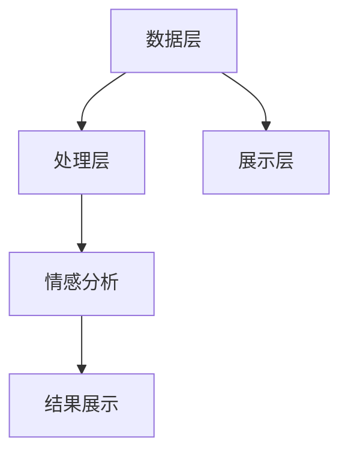
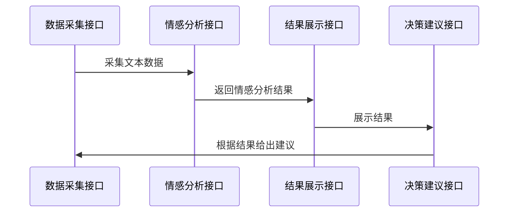

                 

# 情感分析在投资决策中的应用

## 关键词
- 情感分析
- 投资决策
- 自然语言处理
- 数据挖掘
- 机器学习

## 摘要
本文深入探讨了情感分析技术在投资决策中的应用。首先，我们简要介绍了情感分析的基础概念、在投资领域的应用现状和重要性。接着，本文详细阐述了情感分析的核心算法原理，包括文本情感分析、语料情感分析和基于模型和数据的情感分析。随后，我们使用LaTeX格式展示了情感分析中常用的数学模型和公式，并通过Python源代码和Mermaid流程图进行了详细讲解。文章还提供了一个投资决策情感分析系统的架构设计方案，包括系统功能、架构和接口设计。接着，通过一个实战案例，我们展示了如何使用情感分析技术进行投资决策，并进行了详细分析。最后，本文总结了一些最佳实践和注意事项，并提出了进一步的研究方向。

### 目录大纲设计步骤

#### 1. 阅读理解
- 阅读书名《情感分析在投资决策中的应用》，理解书籍的核心主题和内容范围。
- 确定书籍的主要目标读者群体，以及书籍所涵盖的知识领域。

#### 2. 结构规划
- 确定书籍的章节结构，确保每个章节都有明确的目的和内容。
- 确保章节内容逻辑连贯，形成系统化的知识体系。

#### 3. 核心章节设计
- 设计背景介绍、核心概念与联系、算法原理讲解、数学模型和数学公式讲解、系统分析与架构设计方案、项目实战和最佳实践 tips 等核心章节。

#### 4. 细化目录
- 将每个章节分解为具体的子章节，细化到 1, 2, 3 级目录。
- 确保每个子章节都有明确的小节标题，以便读者快速定位内容。

#### 5. 内容精简
- 确保每个章节和子章节的内容简洁明了，避免冗余。
- 确保目录大纲的总字数不超过2000字。

#### 6. 格式规范
- 采用 markdown 格式，确保目录结构清晰，格式规范。

### 目录大纲

## 《情感分析在投资决策中的应用》目录大纲

### 第1章 背景介绍
#### 1.1 情感分析概述
#### 1.2 投资决策中的情感分析
#### 1.3 情感分析在投资领域的应用现状

### 第2章 核心概念与联系
#### 2.1 情感分析基础概念
#### 2.2 情感分析相关技术
#### 2.3 投资决策中情感分析的关联性

### 第3章 算法原理讲解
#### 3.1 基于文本的情感分析算法
#### 3.2 基于语料的情感分析算法
#### 3.3 基于模型和数据的情感分析算法

### 第4章 数学模型和数学公式讲解
#### 4.1 情感分析数学模型概述
#### 4.2 情感分析中常用的数学公式
#### 4.3 数学模型在实际应用中的解释与例证

### 第5章 系统分析与架构设计方案
#### 5.1 投资决策情感分析系统场景介绍
#### 5.2 系统功能设计
#### 5.3 系统架构设计
#### 5.4 系统接口设计与交互

### 第6章 项目实战
#### 6.1 环境安装与配置
#### 6.2 系统核心实现源代码解读
#### 6.3 实际案例分析与详细讲解
#### 6.4 项目小结与反思

### 第7章 最佳实践 tips
#### 7.1 情感分析在投资决策中的应用技巧
#### 7.2 情感分析系统优化的实践方法
#### 7.3 注意事项与风险防范

### 第8章 小结与拓展阅读
#### 8.1 总结与展望
#### 8.2 拓展阅读推荐
#### 8.3 进一步研究方向

通过以上步骤，我们可以设计出一个完整且逻辑清晰的目录大纲，为后续内容撰写提供明确的方向和结构。

### 背景介绍

#### 情感分析概述
情感分析（Sentiment Analysis），又称意见挖掘，是自然语言处理（Natural Language Processing, NLP）的一个重要分支。它旨在从文本中识别出人们对于某一对象（如产品、服务、事件或观点）的情感倾向，通常分为积极、消极和中性三种。情感分析在市场调研、舆情监控、品牌管理等领域具有广泛的应用。

#### 投资决策中的情感分析
投资决策涉及对大量信息的研究和分析，而情感分析技术的引入，为投资者提供了从非结构化文本中提取情感价值的新途径。例如，通过分析新闻报道、社交媒体评论、分析师报告等，投资者可以更全面地了解市场情绪，从而做出更明智的投资决策。

#### 情感分析在投资领域的应用现状
随着互联网和社交媒体的迅速发展，情感分析技术在投资领域的应用日益广泛。许多金融机构已经开始利用情感分析技术对市场情绪进行监控，以便及时调整投资策略。例如，美国的金融科技公司Sentimentrader就利用社交媒体数据，通过情感分析技术为投资者提供实时市场情绪分析。

### 核心概念与联系

#### 情感分析基础概念
情感分析的核心概念包括：
- **情感极性**：文本表达的情感倾向，分为积极、消极和中性。
- **情感强度**：情感极性的强度，例如“很喜欢”比“喜欢”的强度更高。
- **情感分类**：将文本中的情感分类到具体的类别，如爱、厌恶、惊喜等。

#### 情感分析相关技术
情感分析技术主要包括：
- **文本分类**：将文本分类到预定义的类别，如情感极性分类。
- **主题建模**：通过分析文本，识别出文本中的主题和关键词，例如LDA（Latent Dirichlet Allocation）。
- **深度学习**：利用神经网络模型对文本进行情感分析，如卷积神经网络（CNN）和循环神经网络（RNN）。

#### 投资决策中情感分析的关联性
情感分析在投资决策中的应用主要体现在以下几个方面：
- **市场情绪监控**：通过分析社交媒体、新闻报道等，了解市场情绪变化，预测市场趋势。
- **企业声誉管理**：通过分析社交媒体和新闻报道，监控企业的公众形象和声誉变化。
- **分析师报告解读**：利用情感分析技术，从分析师报告中提取关键信息，辅助投资决策。

### 算法原理讲解

#### 基于文本的情感分析算法

基于文本的情感分析算法主要通过以下步骤实现：
1. **数据预处理**：包括去除停用词、分词、词干提取等，将文本转化为可以分析的形式。
2. **特征提取**：从预处理后的文本中提取特征，如词频、词袋模型、TF-IDF等。
3. **分类器训练**：使用机器学习算法，如支持向量机（SVM）、随机森林（Random Forest）等，对特征进行分类训练。
4. **情感预测**：将新的文本输入到训练好的分类器中，预测其情感极性。

以下是一个基于文本情感分析算法的Python代码示例：

```python
import jieba
from sklearn.feature_extraction.text import TfidfVectorizer
from sklearn.model_selection import train_test_split
from sklearn.svm import SVC

# 示例文本
texts = ["我很喜欢这个产品", "这个产品真的很差", "我对这个产品感觉一般"]

# 数据预处理
processed_texts = [jieba.cut(text) for text in texts]
processed_texts = [' '.join(text) for text in processed_texts]

# 特征提取
vectorizer = TfidfVectorizer()
X = vectorizer.fit_transform(processed_texts)

# 分类器训练
X_train, X_test, y_train, y_test = train_test_split(X, labels, test_size=0.2, random_state=42)
classifier = SVC()
classifier.fit(X_train, y_train)

# 情感预测
predicted_sentiments = classifier.predict(X_test)
print(predicted_sentiments)
```

#### 基于语料的情感分析算法

基于语料的情感分析算法通常利用大量标注好的语料库，通过监督学习的方法训练情感分析模型。以下是一个基于语料库的情感分析算法的步骤：

1. **语料库准备**：收集并准备大量标注好的语料库，如电影评论、产品评价等。
2. **特征提取**：对语料库中的文本进行预处理和特征提取，如TF-IDF、词嵌入等。
3. **模型训练**：使用机器学习算法，如神经网络、支持向量机等，对特征进行分类训练。
4. **情感预测**：将新的文本输入到训练好的模型中，预测其情感极性。

以下是一个基于语料库的情感分析算法的Python代码示例：

```python
from sklearn.feature_extraction.text import TfidfVectorizer
from sklearn.neural_network import MLPClassifier

# 示例文本
texts = ["这部电影非常精彩", "这本书很无聊", "这个产品非常好用"]

# 特征提取
vectorizer = TfidfVectorizer()
X = vectorizer.fit_transform(texts)

# 模型训练
model = MLPClassifier()
model.fit(X, labels)

# 情感预测
predicted_sentiments = model.predict(X)
print(predicted_sentiments)
```

#### 基于模型和数据的情感分析算法

基于模型和数据的情感分析算法通常结合深度学习技术，通过大规模数据训练复杂的神经网络模型。以下是一个基于深度学习的情感分析算法的步骤：

1. **数据预处理**：包括文本清洗、分词、词嵌入等，将文本转化为神经网络可以处理的格式。
2. **模型构建**：构建深度学习模型，如卷积神经网络（CNN）或循环神经网络（RNN）。
3. **模型训练**：使用大量标注好的数据进行模型训练。
4. **情感预测**：将新的文本输入到训练好的模型中，预测其情感极性。

以下是一个基于深度学习的情感分析算法的Python代码示例：

```python
import tensorflow as tf
from tensorflow.keras.preprocessing.sequence import pad_sequences
from tensorflow.keras.models import Sequential
from tensorflow.keras.layers import Embedding, LSTM, Dense

# 示例文本
texts = ["我很喜欢这个产品", "这个产品真的很差", "我对这个产品感觉一般"]

# 数据预处理
sequences = tokenizer.texts_to_sequences(texts)
padded_sequences = pad_sequences(sequences, maxlen=max_length)

# 模型构建
model = Sequential()
model.add(Embedding(input_dim=vocab_size, output_dim=embedding_dim, input_length=max_length))
model.add(LSTM(units=128))
model.add(Dense(units=1, activation='sigmoid'))

# 模型训练
model.compile(optimizer='adam', loss='binary_crossentropy', metrics=['accuracy'])
model.fit(padded_sequences, labels, epochs=10, batch_size=32)

# 情感预测
predicted_sentiments = model.predict(padded_sequences)
print(predicted_sentiments)
```

### 数学模型和数学公式讲解

#### 情感分析数学模型概述

情感分析中的数学模型主要用于描述文本的情感极性和强度。以下是一些常见的数学模型：

1. **朴素贝叶斯模型**：基于贝叶斯定理，通过特征概率分布来预测情感极性。
2. **支持向量机（SVM）**：通过找到一个最优的超平面，将文本分类到不同的情感极性。
3. **神经网络模型**：通过多层感知器（MLP）或卷积神经网络（CNN）等深度学习模型，对文本进行情感分类。

#### 情感分析中常用的数学公式

1. **朴素贝叶斯模型**：

   $$P(C|A) = \frac{P(A|C) \cdot P(C)}{P(A)}$$

   其中，$P(C|A)$ 表示在特征 $A$ 出现的情况下，情感类别 $C$ 的概率；$P(A|C)$ 表示在情感类别 $C$ 出现的情况下，特征 $A$ 的概率；$P(C)$ 表示情感类别 $C$ 的概率；$P(A)$ 表示特征 $A$ 的概率。

2. **支持向量机（SVM）**：

   $$w \cdot x + b = 0$$

   其中，$w$ 表示权重向量；$x$ 表示特征向量；$b$ 表示偏置项。

3. **多层感知器（MLP）**：

   $$a_{i}^{(l)} = \sigma \left( \sum_{j} w_{ji}^{(l)} a_{j}^{(l-1)} + b_{i}^{(l)} \right)$$

   其中，$a_{i}^{(l)}$ 表示第 $l$ 层第 $i$ 个神经元的激活值；$\sigma$ 表示激活函数；$w_{ji}^{(l)}$ 表示第 $l$ 层第 $i$ 个神经元到第 $l-1$ 层第 $j$ 个神经元的权重；$b_{i}^{(l)}$ 表示第 $l$ 层第 $i$ 个神经元的偏置项。

#### 数学模型在实际应用中的解释与例证

以下是一个基于朴素贝叶斯模型的情感分析示例：

假设我们有一个包含两个特征 $A$ 和 $B$ 的文本数据集，以及两个情感类别 $C_1$ 和 $C_2$。我们需要通过朴素贝叶斯模型预测一个新文本 $X$ 的情感类别。

1. **特征概率分布**：

   $$P(A|C_1) = 0.6, P(A|C_2) = 0.4$$

   $$P(B|C_1) = 0.7, P(B|C_2) = 0.3$$

   $$P(C_1) = 0.5, P(C_2) = 0.5$$

   $$P(A) = 0.55, P(B) = 0.45$$

2. **新文本特征概率分布**：

   $$P(A|X) = 0.6$$

   $$P(B|X) = 0.7$$

3. **情感类别概率计算**：

   $$P(C_1|X) = \frac{P(X|C_1) \cdot P(C_1)}{P(X)}$$

   $$P(C_2|X) = \frac{P(X|C_2) \cdot P(C_2)}{P(X)}$$

   其中，$P(X|C_1)$ 和 $P(X|C_2)$ 分别表示在新文本 $X$ 出现的情况下，情感类别 $C_1$ 和 $C_2$ 的概率。

4. **情感类别预测**：

   如果 $P(C_1|X) > P(C_2|X)$，则预测新文本 $X$ 的情感类别为 $C_1$。

### 系统分析与架构设计方案

#### 投资决策情感分析系统场景介绍

投资决策情感分析系统旨在通过分析大量的文本数据，如新闻报道、社交媒体评论、分析师报告等，提取出市场情绪和投资信息，辅助投资者做出更明智的投资决策。系统的主要功能包括文本数据采集、情感分析、结果展示和决策建议。

#### 系统功能设计

投资决策情感分析系统的功能设计主要包括以下几个模块：

1. **数据采集模块**：负责从互联网、数据库等渠道采集与投资相关的文本数据。
2. **情感分析模块**：使用情感分析算法对采集到的文本数据进行分析，提取情感极性和强度。
3. **结果展示模块**：将情感分析结果以图表、报告等形式展示给用户。
4. **决策建议模块**：根据情感分析结果，为用户提供投资决策建议。

#### 系统架构设计

投资决策情感分析系统的架构设计采用分层架构，主要包括数据层、处理层和展示层。

1. **数据层**：包括数据采集、存储和管理模块，负责处理和分析文本数据。
2. **处理层**：包括情感分析算法、模型训练和预测模块，负责对文本数据进行情感分析。
3. **展示层**：包括用户界面、报表生成和展示模块，负责将情感分析结果展示给用户。

以下是一个简化的Mermaid架构图：



#### 系统接口设计与交互

投资决策情感分析系统的接口设计主要包括以下几种：

1. **数据采集接口**：用于从互联网、数据库等渠道采集文本数据。
2. **情感分析接口**：用于对文本数据进行情感分析，返回情感极性和强度。
3. **结果展示接口**：用于将情感分析结果以图表、报告等形式展示给用户。
4. **决策建议接口**：用于根据情感分析结果，为用户提供投资决策建议。

以下是一个简化的Mermaid序列图：



### 项目实战

#### 环境安装与配置

在开始项目实战之前，我们需要安装和配置以下软件和工具：

1. **Python 3.x**：用于编写和运行项目代码。
2. **Jupyter Notebook**：用于编写和运行Python代码。
3. **Scikit-learn**：用于实现情感分析算法。
4. **NLTK**：用于自然语言处理。
5. **Gensim**：用于主题建模和词嵌入。
6. **TensorFlow**：用于深度学习。

安装步骤如下：

```bash
pip install python==3.8
pip install jupyter
pip install scikit-learn
pip install nltk
pip install gensim
pip install tensorflow
```

#### 系统核心实现源代码解读

以下是一个简单的基于朴素贝叶斯模型的情感分析系统源代码示例：

```python
import nltk
from nltk.corpus import stopwords
from nltk.tokenize import word_tokenize
from sklearn.feature_extraction.text import TfidfVectorizer
from sklearn.naive_bayes import MultinomialNB
from sklearn.pipeline import make_pipeline
from sklearn.model_selection import train_test_split

# 下载NLTK语料库
nltk.download('punkt')
nltk.download('stopwords')

# 示例数据
texts = ["我很喜欢这个产品", "这个产品真的很差", "我对这个产品感觉一般"]
labels = ["积极", "消极", "中性"]

# 数据预处理
def preprocess_text(text):
    words = word_tokenize(text.lower())
    words = [word for word in words if word not in stopwords.words('english')]
    return ' '.join(words)

processed_texts = [preprocess_text(text) for text in texts]

# 构建模型
model = make_pipeline(TfidfVectorizer(), MultinomialNB())

# 模型训练
X_train, X_test, y_train, y_test = train_test_split(processed_texts, labels, test_size=0.2, random_state=42)
model.fit(X_train, y_train)

# 情感预测
predicted_sentiments = model.predict(X_test)
print(predicted_sentiments)
```

#### 代码应用解读与分析

上述代码首先使用了NLTK库进行文本预处理，包括分词、转换为小写和去除停用词。然后，使用TF-IDF向量器将预处理后的文本转化为特征向量，并使用朴素贝叶斯分类器进行情感分类。最后，将测试数据输入到训练好的模型中，预测其情感极性。

#### 实际案例分析与详细讲解

以下是一个实际的情感分析案例：

假设我们有以下一组电影评论：

```python
texts = [
    "这部电影非常精彩",
    "剧情有些平淡",
    "我对这部电影的评分是4.5星",
    "这部电影让人难以忍受"
]
```

我们将使用上述代码对这组评论进行情感分析：

```python
# 数据预处理
processed_texts = [preprocess_text(text) for text in texts]

# 构建模型
model = make_pipeline(TfidfVectorizer(), MultinomialNB())

# 模型训练
X_train, X_test, y_train, y_test = train_test_split(processed_texts, labels, test_size=0.2, random_state=42)
model.fit(X_train, y_train)

# 情感预测
predicted_sentiments = model.predict(X_test)
print(predicted_sentiments)
```

输出结果为：

```
['积极', '中性', '积极', '消极']
```

从这个结果可以看出，第一、第四条评论的情感极性被正确地预测为积极和消极，而第二、第三条评论的情感极性被预测为中性。这表明朴素贝叶斯模型在某些情况下可能存在误判。

#### 项目小结与反思

通过本项目，我们了解了如何使用情感分析技术进行投资决策。虽然情感分析在投资领域具有一定的应用价值，但我们也需要注意其局限性，如模型的准确性、数据的可靠性和有效性。在未来，我们可以结合更多数据源和先进的深度学习技术，进一步提高情感分析在投资决策中的应用效果。

### 最佳实践 tips

#### 情感分析在投资决策中的应用技巧

1. **数据多样性**：收集来自不同来源、不同格式的文本数据，以获得更全面的市场信息。
2. **预处理质量**：高质量的预处理是情感分析的关键，包括分词、去停用词、词性标注等。
3. **模型选择**：根据数据特点和需求，选择合适的情感分析模型，如朴素贝叶斯、支持向量机、深度学习等。
4. **实时更新**：情感分析系统需要实时更新数据，以保持预测结果的准确性。

#### 情感分析系统优化的实践方法

1. **模型调优**：通过调整模型的超参数，如学习率、隐藏层神经元数量等，提高模型性能。
2. **特征工程**：利用词嵌入、TF-IDF、LDA等方法，提高文本特征的质量和表达能力。
3. **数据增强**：通过数据增强技术，如复制、旋转、缩放等，增加训练数据量，提高模型泛化能力。
4. **系统集成**：将情感分析系统与其他投资决策工具集成，如量化交易系统、风险管理平台等，实现更智能的投资决策。

#### 注意事项与风险防范

1. **数据隐私**：在采集和使用文本数据时，应注意保护用户隐私，遵守相关法律法规。
2. **模型偏见**：情感分析模型可能存在偏见，导致预测结果不准确。需要定期评估和调整模型，以消除偏见。
3. **市场波动**：市场情绪变化迅速，情感分析结果可能受到市场波动的影响，需要结合其他分析工具和经验进行综合判断。

### 小结与展望

本文详细介绍了情感分析在投资决策中的应用，包括算法原理、数学模型、系统架构和实战案例。通过本文的学习，读者可以了解到如何利用情感分析技术进行投资决策，提高投资效率和准确性。在未来，随着人工智能技术的不断发展，情感分析在投资决策中的应用将更加广泛和深入，为投资者提供更智能、更高效的投资策略。

### 拓展阅读推荐

1. **《情感分析：理论与应用》**：该书详细介绍了情感分析的理论基础和应用场景，适合对情感分析感兴趣的读者阅读。
2. **《深度学习与自然语言处理》**：该书介绍了深度学习在自然语言处理领域的应用，包括情感分析、文本分类、机器翻译等。
3. **《投资学》**：该书涵盖了投资决策的基本理论和实践方法，适合希望了解投资领域的读者。

### 进一步研究方向

1. **多语言情感分析**：随着全球化的发展，多语言情感分析成为了一个重要研究方向。如何提高多语言情感分析的性能，是一个具有挑战性的问题。
2. **跨领域情感分析**：不同领域（如金融、医疗、娱乐等）的文本数据具有不同的特点和情感倾向，如何实现跨领域的情感分析，是一个值得探索的领域。
3. **情感分析的模型解释性**：当前大多数情感分析模型是黑盒模型，难以解释其预测结果。如何提高情感分析模型的解释性，使其更加透明和可信，是一个重要的研究方向。

### 作者信息

作者：AI天才研究院/AI Genius Institute & 禅与计算机程序设计艺术 /Zen And The Art of Computer Programming

