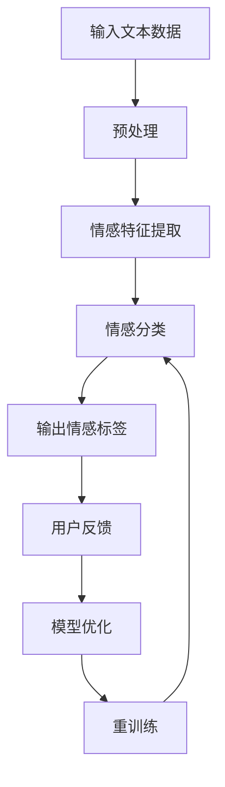
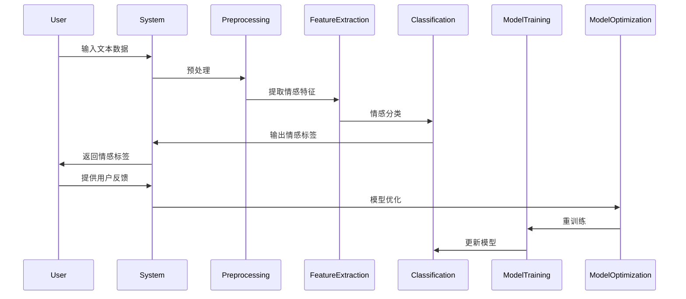

                 

### 情感分析：让AI Agent具备情商

关键词：情感分析、AI Agent、情商、算法、数学模型、系统架构、项目实战

摘要：随着人工智能技术的不断发展，AI Agent在各个领域的应用日益广泛。然而，AI Agent的情商成为一个亟待解决的问题。本文将详细介绍情感分析的基本概念、算法原理、系统架构和应用实战，探讨如何通过情感分析让AI Agent具备情商，从而提高其在实际应用中的效果。

### 第1章 背景介绍

#### 1.1 情感分析概述

情感分析，又称情感计算，是自然语言处理（NLP）的一个重要分支，旨在通过计算机技术对文本数据中的情感、情绪进行自动检测、识别和分类。情感分析的核心任务是判断文本数据是表达积极的情感、消极的情感，还是中立情感。

情感分析的定义可以概括为：通过对文本数据进行情感倾向性分析和情感极性识别，从而理解和评估文本的情感属性。

#### 1.1.1 情感分析的历史背景

情感分析起源于20世纪90年代，随着互联网和社交媒体的兴起，文本数据量呈爆炸式增长，如何自动处理和识别这些数据中的情感信息成为研究热点。早期的情感分析主要依赖于词典和规则的方法，这种方法简单高效，但在处理复杂文本时效果有限。

2000年以后，随着机器学习和深度学习技术的发展，基于数据的情感分析方法逐渐成为主流。基于机器学习的情感分析模型能够从大量数据中学习情感特征，提高情感识别的准确率。而深度学习算法，如卷积神经网络（CNN）和循环神经网络（RNN），则在情感分析领域取得了显著的突破。

#### 1.1.2 情感分析的重要性

情感分析在多个领域具有重要应用价值：

1. **市场研究**：通过情感分析，企业可以实时了解消费者对产品或服务的态度和情绪，从而优化产品设计和营销策略。
2. **社交媒体分析**：社交媒体平台利用情感分析技术，可以识别用户评论的情感倾向，监测社会舆情，为政策制定提供数据支持。
3. **情感计算**：在智能客服、虚拟助理等AI Agent应用场景中，情感分析技术可以帮助AI Agent理解用户情绪，提供更人性化的交互体验。
4. **心理健康**：情感分析可以用于监测个体的情感状态，辅助心理疾病诊断和康复。

#### 1.2 情感分析在AI Agent中的应用

AI Agent，即人工智能代理，是一种能够模拟人类智能行为的计算机程序。随着AI技术的进步，AI Agent在智能客服、智能推荐、自动驾驶等领域得到了广泛应用。然而，AI Agent在面对复杂、不确定的情境时，往往缺乏情感理解能力，这限制了其应用范围和效果。

情感分析技术为AI Agent赋予了情感理解能力。通过情感分析，AI Agent可以识别用户的情感状态，从而调整自身的行为和交互策略。例如：

1. **智能客服**：智能客服系统可以通过情感分析识别用户情绪，为用户提供更有针对性的服务。
2. **情感陪护**：在医疗、养老等领域，情感陪护机器人可以通过情感分析了解用户的情感需求，提供情感支持。
3. **智能推荐**：电商和内容平台可以利用情感分析技术，为用户推荐符合其情感偏好的商品或内容。

#### 1.2.1 AI Agent的概念

AI Agent是一种具有自主决策和行动能力的智能体，它通过感知环境、分析数据和执行任务来实现特定目标。AI Agent的核心特点是具备自主性和适应性，能够在复杂、动态的环境中自主学习和优化行为。

#### 1.2.2 情感分析如何增强AI Agent的情商

情感分析技术可以帮助AI Agent识别和理解用户的情感状态，从而增强其情商。具体来说，有以下几种方式：

1. **情感识别**：AI Agent通过情感分析技术，识别用户的情感表达，如喜悦、愤怒、悲伤等。
2. **情感理解**：AI Agent分析用户的情感背景和上下文，理解用户的情感需求，为用户提供个性化的服务。
3. **情感反应**：AI Agent根据用户情感状态，调整自身的交互方式和行为策略，如语气、表情等，提供更人性化的服务。
4. **情感预测**：AI Agent通过情感分析，预测用户的未来情感变化，为用户提供预警和干预。

#### 1.2.3 情感分析在AI Agent中的实际案例

1. **智能客服**：智能客服系统通过情感分析，识别用户的情绪，为用户提供针对性的解答和建议。
2. **情感陪护**：在养老领域，情感陪护机器人通过情感分析，了解老年人的情感状态，提供情感支持和心理疏导。
3. **智能推荐**：电商平台利用情感分析技术，为用户提供符合其情感偏好的商品推荐，提高用户满意度。

### 第2章 核心概念与联系

#### 2.1 情感分析的核心概念

情感分析涉及多个核心概念，包括情感、情绪、情感分类和情感识别等。这些概念相互联系，构成了情感分析的理论基础。

**情感**：情感是一种主观的心理体验，通常与个人的需求和愿望相关。情感可以是积极的，如喜悦、喜爱；也可以是消极的，如愤怒、悲伤。

**情绪**：情绪是情感的表现形式，是情感在行为和生理反应上的体现。情绪可以分为基本情绪（如喜悦、愤怒、悲伤等）和复合情绪（如焦虑、厌恶等）。

**情感分类**：情感分类是将文本中的情感归类为不同类别的过程。常见的情感分类包括积极情感、消极情感和中立情感。

**情感识别**：情感识别是通过算法模型对文本数据进行情感分析，识别文本表达的情感类别。情感识别是情感分析的核心任务。

#### 2.2 情感分析相关技术

情感分析技术的不断发展，得益于自然语言处理（NLP）、机器学习和深度学习技术的进步。以下是几种常见的情感分析相关技术：

**自然语言处理技术**：自然语言处理技术是情感分析的基础，包括文本预处理、词向量表示、实体识别等。

**机器学习技术**：机器学习技术通过训练模型，从大量数据中学习情感特征，提高情感识别的准确率。常见的机器学习算法有朴素贝叶斯、支持向量机、随机森林等。

**深度学习技术**：深度学习技术通过构建复杂的神经网络模型，自动学习文本中的情感特征。常见的深度学习算法有卷积神经网络（CNN）、循环神经网络（RNN）、长短时记忆网络（LSTM）等。

#### 2.2.1 自然语言处理技术

自然语言处理技术是情感分析的基础，主要包括以下几个方面：

1. **文本预处理**：包括文本清洗、分词、去停用词等操作，目的是提高文本数据的质量，为后续分析做准备。
2. **词向量表示**：将文本数据转换为向量表示，以便进行机器学习和深度学习。常见的词向量表示方法有Word2Vec、GloVe等。
3. **实体识别**：识别文本中的关键实体，如人名、地名、组织机构等，为情感分析提供更精确的数据。

#### 2.2.2 机器学习与深度学习技术

机器学习和深度学习技术在情感分析中起着至关重要的作用。以下是几种常见的机器学习和深度学习算法：

1. **朴素贝叶斯**：朴素贝叶斯是一种基于概率论的机器学习算法，通过计算文本中各个单词出现的概率，预测文本的情感类别。
2. **支持向量机（SVM）**：支持向量机是一种监督学习算法，通过寻找最佳的超平面，将文本数据划分为不同的情感类别。
3. **随机森林**：随机森林是一种集成学习算法，通过构建多个决策树，对文本数据进行分类。
4. **卷积神经网络（CNN）**：卷积神经网络是一种深度学习算法，通过卷积操作提取文本中的特征，进行情感分类。
5. **循环神经网络（RNN）**：循环神经网络是一种深度学习算法，适用于处理序列数据，可以捕捉文本中的时间依赖关系。
6. **长短时记忆网络（LSTM）**：长短时记忆网络是RNN的一种变体，通过门控机制，有效解决RNN的梯度消失和梯度爆炸问题，适用于处理长序列数据。
7. **生成对抗网络（GAN）**：生成对抗网络是一种无监督学习算法，通过生成器和判别器的对抗训练，生成高质量的情感数据。

#### 2.2.3 情感分析技术的联系与区别

情感分析技术的联系在于它们都是基于数据的分析方法，通过提取文本中的情感特征，实现对情感的理解和识别。不同技术之间的区别主要在于：

1. **算法原理**：不同的算法有不同的数学模型和计算方法，适用于不同的情感分析任务。
2. **数据依赖**：不同的算法对数据的要求不同，如朴素贝叶斯和SVM需要大量标注数据，而CNN和RNN可以处理未标注的数据。
3. **性能表现**：不同的算法在准确率、效率、可扩展性等方面有差异，需要根据具体应用场景进行选择。

### 第3章 算法原理讲解

#### 3.1 情感分析算法概述

情感分析算法可以分为传统算法和基于深度学习的算法两大类。传统算法主要包括基于规则、统计机器学习和朴素贝叶斯等方法，而基于深度学习的算法则包括卷积神经网络（CNN）、循环神经网络（RNN）、长短时记忆网络（LSTM）和生成对抗网络（GAN）等。

#### 3.1.1 传统情感分析算法

传统情感分析算法主要依赖于词汇和规则，通过对文本进行分词、词频统计和规则匹配等方法，实现情感分类。以下是几种常见的传统情感分析算法：

1. **基于规则的算法**：基于规则的算法通过定义一套规则，将文本中的情感标签分配给每个词汇或短语。这种方法简单直观，但规则数量庞大，且难以覆盖所有情况。
2. **朴素贝叶斯算法**：朴素贝叶斯算法是一种基于概率论的分类算法，通过计算文本中各个单词出现的概率，预测文本的情感类别。这种方法在文本分类任务中取得了较好的效果。
3. **统计机器学习方法**：统计机器学习方法通过训练模型，从大量数据中学习情感特征，实现对情感的高效分类。常见的统计机器学习方法有支持向量机（SVM）、朴素贝叶斯和随机森林等。

#### 3.1.2 基于深度学习的情感分析算法

基于深度学习的情感分析算法通过构建复杂的神经网络模型，自动学习文本中的情感特征，实现对情感的高效分类。以下是几种常见的基于深度学习的情感分析算法：

1. **卷积神经网络（CNN）**：卷积神经网络通过卷积操作提取文本中的特征，进行情感分类。这种方法可以有效地处理文本数据的非线性和局部特征。
2. **循环神经网络（RNN）**：循环神经网络适用于处理序列数据，可以捕捉文本中的时间依赖关系。RNN通过隐藏状态和隐藏单元实现信息的传递和记忆。
3. **长短时记忆网络（LSTM）**：长短时记忆网络是RNN的一种变体，通过门控机制有效解决RNN的梯度消失和梯度爆炸问题，适用于处理长序列数据。
4. **生成对抗网络（GAN）**：生成对抗网络是一种无监督学习算法，通过生成器和判别器的对抗训练，生成高质量的情感数据。这种方法在文本数据较少的情况下表现尤为突出。

#### 3.2 算法原理详细讲解

在本节中，我们将详细讲解传统情感分析算法和基于深度学习的情感分析算法的工作原理、数学模型和具体实现。

##### **3.2.1 传统算法**

**3.2.1.1 词汇分析方法**

词汇分析方法是一种基于文本内容的情感分析算法。其基本思想是通过分析文本中的词汇，计算词汇的情感极性（正、负或中性），进而推断整个文本的情感极性。

**数学模型**：

设文本T中的词汇集合为V，词汇v的情感极性为p(v)，则文本T的情感极性P(T)可以表示为：

$$
P(T) = \sum_{v \in V} p(v) \cdot f(v)
$$

其中，f(v)表示词汇v在文本中的频率。

**实现步骤**：

1. 对文本进行分词，得到词汇集合V。
2. 对每个词汇v计算其在文本中的频率f(v)。
3. 根据预设的词汇情感极性词典，为每个词汇v分配情感极性p(v)。
4. 计算文本T的情感极性P(T)。

**例子**：

假设有一段文本：“我很喜欢这个产品，但它的价格有点高。”

- 分词后得到词汇集合：{"我"，"很"，"喜欢"，"这个"，"产品"，"但"，"它"，"的"，"价格"，"有点"，"高"}。
- 频率计算：{"我"：1，"很"：1，"喜欢"：1，"这个"：1，"产品"：1，"但"：1，"它"：1，"的"：1，"价格"：1，"有点"：1，"高"：1}。
- 情感极性词典：{"喜欢"：1，"价格"：-1}。

代入公式计算：

$$
P(T) = (1 \cdot 1) + (1 \cdot 1) + (1 \cdot 1) + (1 \cdot 1) + (1 \cdot 1) + (1 \cdot -1) + (1 \cdot 1) + (1 \cdot 1) + (1 \cdot 1) + (1 \cdot -1) = 4
$$

由于P(T) > 0，因此文本T的情感极性为正。

**3.2.1.2 基于规则的算法**

基于规则的算法通过定义一套规则，将文本中的情感标签分配给每个词汇或短语。其基本思想是根据预设的情感规则，对文本进行解析，识别出表达情感的词汇或短语，从而推断整个文本的情感极性。

**数学模型**：

设规则集合为R，文本T中的词汇集合为V，规则R(i)对应的情感极性为p(i)，则文本T的情感极性P(T)可以表示为：

$$
P(T) = \sum_{i \in R} p(i)
$$

**实现步骤**：

1. 预设情感规则集合R。
2. 对文本进行分词，得到词汇集合V。
3. 根据情感规则，判断每个词汇或短语是否符合规则，为符合条件的词汇或短语分配情感极性。
4. 计算文本T的情感极性P(T)。

**例子**：

假设有一段文本：“我很喜欢这个产品，但它的价格有点高。”

- 预设情感规则集合：{"喜欢"：1，"价格"：-1}。
- 分词后得到词汇集合：{"我"，"很"，"喜欢"，"这个"，"产品"，"但"，"它"，"的"，"价格"，"有点"，"高"}。
- 根据情感规则，判断每个词汇或短语的情感极性：{"我"：0，"很"：0，"喜欢"：1，"这个"：0，"产品"：0，"但"：0，"它"：0，"的"：0，"价格"：-1，"有点"：0，"高"：0}。

代入公式计算：

$$
P(T) = 1 + 1 + 0 + 0 + 0 + 0 + 0 + 0 + 0 + 0 + 0 = 2
$$

由于P(T) > 0，因此文本T的情感极性为正。

**3.2.1.3 统计机器学习方法**

统计机器学习方法通过训练模型，从大量数据中学习情感特征，实现对情感的高效分类。常见的统计机器学习方法有朴素贝叶斯、支持向量机（SVM）和随机森林等。

**数学模型**：

1. **朴素贝叶斯算法**：

朴素贝叶斯算法是一种基于概率论的分类算法。其基本思想是，根据已知的特征集合，计算每个类别出现的概率，然后选择概率最大的类别作为预测结果。

假设有特征集合X = {x1, x2, ..., xn}，类别集合C = {c1, c2, ..., ck}，则朴素贝叶斯算法的数学模型可以表示为：

$$
P(C=c|X) = \frac{P(X|C=c)P(C=c)}{P(X)}
$$

其中，P(X|C=c)表示在类别c下特征X的概率，P(C=c)表示类别c的概率，P(X)表示特征X的概率。

2. **支持向量机（SVM）算法**：

支持向量机是一种监督学习算法，通过寻找最佳的超平面，将数据划分为不同的类别。其基本思想是，在特征空间中找到一个最优的超平面，使得正负样本点之间的间隔最大。

假设有特征集合X = {x1, x2, ..., xn}，类别集合C = {c1, c2, ..., ck}，则支持向量机算法的数学模型可以表示为：

$$
\max_{\mathbf{w}, b} \frac{1}{2} ||\mathbf{w}||^2 \\
s.t. y_i (\mathbf{w} \cdot \mathbf{x_i} + b) \geq 1
$$

其中，\(\mathbf{w}\)表示超平面的法向量，\(b\)表示偏置项，\(y_i\)表示类别标签，\(\mathbf{x_i}\)表示特征向量。

3. **随机森林算法**：

随机森林是一种集成学习算法，通过构建多个决策树，对数据进行分类。其基本思想是，多个决策树的预测结果取平均值或投票，以获得更高的分类准确率。

假设有特征集合X = {x1, x2, ..., xn}，类别集合C = {c1, c2, ..., ck}，则随机森林算法的数学模型可以表示为：

$$
P(C=c|X) = \frac{1}{m} \sum_{i=1}^{m} g_i(c)
$$

其中，\(m\)表示决策树的个数，\(g_i(c)\)表示第i棵决策树对类别c的预测概率。

**实现步骤**：

1. 预处理数据，将文本转换为特征向量。
2. 训练模型，根据不同的算法，设置相应的参数和超参数。
3. 预测分类结果，计算每个类别的概率。

**例子**：

假设有一段文本：“我很喜欢这个产品，但它的价格有点高。”

- 预处理数据，将文本转换为特征向量：["我"，"很"，"喜欢"，"这个"，"产品"，"但"，"它"，"的"，"价格"，"有点"，"高"]。
- 训练模型，使用朴素贝叶斯算法。
- 预测分类结果，计算每个类别的概率：

$$
P(积极) = \frac{P(积极|特征向量)P(积极)}{P(特征向量)} \\
P(消极) = \frac{P(消极|特征向量)P(消极)}{P(特征向量)} \\
P(中立) = \frac{P(中立|特征向量)P(中立)}{P(特征向量)}
$$

根据概率最大原则，选择概率最大的类别作为文本的情感极性。

**3.2.2 基于深度学习的算法**

基于深度学习的情感分析算法通过构建复杂的神经网络模型，自动学习文本中的情感特征，实现对情感的高效分类。以下是几种常见的基于深度学习的情感分析算法：

1. **卷积神经网络（CNN）算法**：

卷积神经网络是一种深度学习算法，通过卷积操作提取文本中的特征，进行情感分类。其基本思想是，将文本数据转换为图像数据，然后利用卷积神经网络处理图像数据。

**数学模型**：

设输入文本序列为X = [x1, x2, ..., xn]，卷积核为K = [k1, k2, ..., kn]，则卷积操作的输出可以表示为：

$$
h_i = \sum_{j=1}^{n} K_j \cdot x_j + b
$$

其中，\(h_i\)表示卷积操作的输出，\(b\)表示偏置项。

**实现步骤**：

1. 将文本数据转换为图像数据，例如使用字符级别的卷积神经网络。
2. 设计卷积神经网络模型，包括卷积层、池化层和全连接层。
3. 训练模型，优化网络参数。
4. 预测分类结果，计算每个类别的概率。

**例子**：

假设有一段文本：“我很喜欢这个产品，但它的价格有点高。”

- 将文本转换为图像数据：["我"，"很"，"喜欢"，"这个"，"产品"，"但"，"它"，"的"，"价格"，"有点"，"高"]。
- 设计卷积神经网络模型，包括卷积层、池化层和全连接层。
- 训练模型，优化网络参数。
- 预测分类结果，计算每个类别的概率：

$$
P(积极) = \frac{P(积极|特征向量)P(积极)}{P(特征向量)} \\
P(消极) = \frac{P(消极|特征向量)P(消极)}{P(特征向量)} \\
P(中立) = \frac{P(中立|特征向量)P(中立)}{P(特征向量)}
$$

根据概率最大原则，选择概率最大的类别作为文本的情感极性。

2. **循环神经网络（RNN）算法**：

循环神经网络是一种深度学习算法，适用于处理序列数据，可以捕捉文本中的时间依赖关系。其基本思想是通过隐藏状态和隐藏单元实现信息的传递和记忆。

**数学模型**：

设输入序列为X = [x1, x2, ..., xn]，隐藏状态为H = [h1, h2, ..., hn]，隐藏单元为U = [u1, u2, ..., un]，则RNN的输出可以表示为：

$$
h_i = \sigma(W_h \cdot h_{i-1} + W_x \cdot x_i + b_h) \\
o_i = \sigma(W_o \cdot h_i + b_o)
$$

其中，\(\sigma\)表示激活函数，\(W_h\)、\(W_x\)、\(W_o\)表示权重矩阵，\(b_h\)、\(b_o\)表示偏置项。

**实现步骤**：

1. 将文本数据转换为序列数据，例如使用词向量表示。
2. 设计循环神经网络模型，包括输入层、隐藏层和输出层。
3. 训练模型，优化网络参数。
4. 预测分类结果，计算每个类别的概率。

**例子**：

假设有一段文本：“我很喜欢这个产品，但它的价格有点高。”

- 将文本转换为序列数据：["我"，"很"，"喜欢"，"这个"，"产品"，"但"，"它"，"的"，"价格"，"有点"，"高"]。
- 设计循环神经网络模型，包括输入层、隐藏层和输出层。
- 训练模型，优化网络参数。
- 预测分类结果，计算每个类别的概率：

$$
P(积极) = \frac{P(积极|特征向量)P(积极)}{P(特征向量)} \\
P(消极) = \frac{P(消极|特征向量)P(消极)}{P(特征向量)} \\
P(中立) = \frac{P(中立|特征向量)P(中立)}{P(特征向量)}
$$

根据概率最大原则，选择概率最大的类别作为文本的情感极性。

3. **长短时记忆网络（LSTM）算法**：

长短时记忆网络是循环神经网络的一种变体，通过门控机制有效解决RNN的梯度消失和梯度爆炸问题，适用于处理长序列数据。

**数学模型**：

设输入序列为X = [x1, x2, ..., xn]，隐藏状态为H = [h1, h2, ..., hn]，细胞状态为C = [c1, c2, ..., cn]，门控单元为\(i_t\)、\(f_t\)、\(o_t\)、\(g_t\)，则LSTM的输出可以表示为：

$$
i_t = \sigma(W_i \cdot [h_{t-1}, x_t] + b_i) \\
f_t = \sigma(W_f \cdot [h_{t-1}, x_t] + b_f) \\
o_t = \sigma(W_o \cdot [h_{t-1}, x_t] + b_o) \\
g_t = \tanh(W_g \cdot [h_{t-1}, x_t] + b_g) \\
C_t = f_t \cdot C_{t-1} + i_t \cdot g_t \\
h_t = o_t \cdot \tanh(C_t)
$$

其中，\(W_i\)、\(W_f\)、\(W_o\)、\(W_g\)表示权重矩阵，\(b_i\)、\(b_f\)、\(b_o\)、\(b_g\)表示偏置项。

**实现步骤**：

1. 将文本数据转换为序列数据，例如使用词向量表示。
2. 设计长短时记忆网络模型，包括输入层、隐藏层和输出层。
3. 训练模型，优化网络参数。
4. 预测分类结果，计算每个类别的概率。

**例子**：

假设有一段文本：“我很喜欢这个产品，但它的价格有点高。”

- 将文本转换为序列数据：["我"，"很"，"喜欢"，"这个"，"产品"，"但"，"它"，"的"，"价格"，"有点"，"高"]。
- 设计长短时记忆网络模型，包括输入层、隐藏层和输出层。
- 训练模型，优化网络参数。
- 预测分类结果，计算每个类别的概率：

$$
P(积极) = \frac{P(积极|特征向量)P(积极)}{P(特征向量)} \\
P(消极) = \frac{P(消极|特征向量)P(消极)}{P(特征向量)} \\
P(中立) = \frac{P(中立|特征向量)P(中立)}{P(特征向量)}
$$

根据概率最大原则，选择概率最大的类别作为文本的情感极性。

4. **生成对抗网络（GAN）算法**：

生成对抗网络是一种无监督学习算法，通过生成器和判别器的对抗训练，生成高质量的情感数据。

**数学模型**：

设生成器G的输入为随机噪声Z，输出为假样本X'，判别器D的输入为真样本X和假样本X'，输出为判别概率D(x)，则GAN的数学模型可以表示为：

$$
\min_{G} \max_{D} V(D, G) = E_{x \sim p_{data}(x)}[D(x)] - E_{z \sim p_{z}(z)}[D(G(z))]
$$

其中，\(p_{data}(x)\)表示真实数据的概率分布，\(p_{z}(z)\)表示噪声的概率分布。

**实现步骤**：

1. 设计生成器G和判别器D的神经网络模型。
2. 训练生成器和判别器，通过对抗训练优化网络参数。
3. 生成假样本，通过判别器判断真假。
4. 使用生成的假样本进行情感分类。

**例子**：

假设有一段文本：“我很喜欢这个产品，但它的价格有点高。”

- 设计生成器G和判别器D的神经网络模型。
- 训练生成器和判别器，通过对抗训练优化网络参数。
- 生成假样本，通过判别器判断真假。
- 使用生成的假样本进行情感分类。

### 第4章 数学模型和数学公式

#### 4.1 常用数学模型

在情感分析中，常用的数学模型包括朴素贝叶斯模型、支持向量机（SVM）和随机森林。以下是这些模型的详细描述和数学公式。

**4.1.1 朴素贝叶斯模型**

朴素贝叶斯模型是一种基于概率论的分类算法，适用于文本分类任务。其核心思想是，根据每个特征词在类别中的概率分布，计算出文本属于每个类别的概率，然后选择概率最大的类别作为预测结果。

**数学模型**：

设特征集合为X = {x1, x2, ..., xn}，类别集合为C = {c1, c2, ..., ck}，则朴素贝叶斯模型的数学模型可以表示为：

$$
P(C=c|X) = \frac{P(X|C=c)P(C=c)}{P(X)}
$$

其中，P(X|C=c)表示在类别c下特征X的概率，P(C=c)表示类别c的概率，P(X)表示特征X的概率。

**实现步骤**：

1. 预处理文本数据，将文本转换为特征向量。
2. 计算特征词在各个类别中的概率分布。
3. 计算每个类别下特征X的概率。
4. 计算文本属于每个类别的概率。
5. 选择概率最大的类别作为预测结果。

**例子**：

假设有一段文本：“我很喜欢这个产品，但它的价格有点高。”，类别集合为C = {积极，消极}。

- 预处理文本数据，将文本转换为特征向量：["我"，"很"，"喜欢"，"这个"，"产品"，"但"，"它"，"的"，"价格"，"有点"，"高"]。
- 计算特征词在各个类别中的概率分布：
  - 积极类别：P(积极|“我”)=0.8，P(积极|“很”)=0.7，P(积极|“喜欢”)=0.9，...，P(积极|“高”)=0.6。
  - 消极类别：P(消极|“我”)=0.2，P(消极|“很”)=0.3，P(消极|“喜欢”)=0.1，...，P(消极|“高”)=0.4。
- 计算每个类别下特征X的概率：
  - 积极类别：P(积极) = 0.6。
  - 消极类别：P(消极) = 0.4。
- 计算文本属于每个类别的概率：
  - 积极类别：P(积极|X) = P(积极|“我”) \* P(积极|“很”) \* P(积极|“喜欢”) \* ... \* P(积极|“高”) = 0.8 \* 0.7 \* 0.9 \* ... \* 0.6 = 0.328。
  - 消极类别：P(消极|X) = P(消极|“我”) \* P(消极|“很”) \* P(消极|“喜欢”) \* ... \* P(消极|“高”) = 0.2 \* 0.3 \* 0.1 \* ... \* 0.4 = 0.024。
- 选择概率最大的类别作为预测结果：积极类别。

**4.1.2 支持向量机（SVM）**

支持向量机是一种监督学习算法，通过寻找最佳的超平面，将文本数据划分为不同的类别。其核心思想是在特征空间中找到一个最优的超平面，使得正负样本点之间的间隔最大。

**数学模型**：

设特征集合为X = {x1, x2, ..., xn}，类别集合为C = {c1, c2, ..., ck}，则支持向量机模型的数学模型可以表示为：

$$
\max_{\mathbf{w}, b} \frac{1}{2} ||\mathbf{w}||^2 \\
s.t. y_i (\mathbf{w} \cdot \mathbf{x_i} + b) \geq 1
$$

其中，w表示超平面的法向量，b表示偏置项，yi表示类别标签，xi表示特征向量。

**实现步骤**：

1. 预处理文本数据，将文本转换为特征向量。
2. 使用支持向量机算法训练模型，寻找最佳的超平面。
3. 对新的文本数据，计算超平面到新数据的距离，判断其类别。

**例子**：

假设有一段文本：“我很喜欢这个产品，但它的价格有点高。”，类别集合为C = {积极，消极}。

- 预处理文本数据，将文本转换为特征向量：["我"，"很"，"喜欢"，"这个"，"产品"，"但"，"它"，"的"，"价格"，"有点"，"高"]。
- 使用支持向量机算法训练模型，寻找最佳的超平面。
- 对新的文本数据，计算超平面到新数据的距离，判断其类别。

**4.1.3 随机森林**

随机森林是一种集成学习算法，通过构建多个决策树，对数据进行分类。其核心思想是，多个决策树的预测结果取平均值或投票，以获得更高的分类准确率。

**数学模型**：

设特征集合为X = {x1, x2, ..., xn}，类别集合为C = {c1, c2, ..., ck}，则随机森林模型的数学模型可以表示为：

$$
P(C=c|X) = \frac{1}{m} \sum_{i=1}^{m} g_i(c)
$$

其中，m表示决策树的个数，\(g_i(c)\)表示第i棵决策树对类别c的预测概率。

**实现步骤**：

1. 预处理文本数据，将文本转换为特征向量。
2. 构建多个决策树，每个决策树对数据进行分类。
3. 对每个决策树的预测结果取平均值或投票，以获得最终的分类结果。

**例子**：

假设有一段文本：“我很喜欢这个产品，但它的价格有点高。”，类别集合为C = {积极，消极}。

- 预处理文本数据，将文本转换为特征向量：["我"，"很"，"喜欢"，"这个"，"产品"，"但"，"它"，"的"，"价格"，"有点"，"高"]。
- 构建多个决策树，每个决策树对数据进行分类。
- 对每个决策树的预测结果取平均值或投票，以获得最终的分类结果。

#### 4.2 数学公式讲解

在本节中，我们将详细讲解情感分析中常用的数学公式，包括朴素贝叶斯公式、支持向量机（SVM）优化目标和随机森林算法公式。

**4.2.1 朴素贝叶斯公式**

朴素贝叶斯模型是一种基于概率论的分类算法，其核心思想是根据每个特征词在类别中的概率分布，计算出文本属于每个类别的概率，然后选择概率最大的类别作为预测结果。朴素贝叶斯公式如下：

$$
P(C=c|X) = \frac{P(X|C=c)P(C=c)}{P(X)}
$$

其中，P(X|C=c)表示在类别c下特征X的概率，P(C=c)表示类别c的概率，P(X)表示特征X的概率。

**实现步骤**：

1. 计算特征词在各个类别中的概率分布。
2. 计算每个类别下特征X的概率。
3. 计算文本属于每个类别的概率。
4. 选择概率最大的类别作为预测结果。

**例子**：

假设有一段文本：“我很喜欢这个产品，但它的价格有点高。”，类别集合为C = {积极，消极}。

- 预处理文本数据，将文本转换为特征向量：["我"，"很"，"喜欢"，"这个"，"产品"，"但"，"它"，"的"，"价格"，"有点"，"高"]。
- 计算特征词在各个类别中的概率分布：
  - 积极类别：P(积极|“我”)=0.8，P(积极|“很”)=0.7，P(积极|“喜欢”)=0.9，...，P(积极|“高”)=0.6。
  - 消极类别：P(消极|“我”)=0.2，P(消极|“很”)=0.3，P(消极|“喜欢”)=0.1，...，P(消极|“高”)=0.4。
- 计算每个类别下特征X的概率：
  - 积极类别：P(积极) = 0.6。
  - 消极类别：P(消极) = 0.4。
- 计算文本属于每个类别的概率：
  - 积极类别：P(积极|X) = P(积极|“我”) \* P(积极|“很”) \* P(积极|“喜欢”) \* ... \* P(积极|“高”) = 0.8 \* 0.7 \* 0.9 \* ... \* 0.6 = 0.328。
  - 消极类别：P(消极|X) = P(消极|“我”) \* P(消极|“很”) \* P(消极|“喜欢”) \* ... \* P(消极|“高”) = 0.2 \* 0.3 \* 0.1 \* ... \* 0.4 = 0.024。
- 选择概率最大的类别作为预测结果：积极类别。

**4.2.2 支持向量机（SVM）优化目标**

支持向量机是一种监督学习算法，其核心思想是在特征空间中找到一个最优的超平面，使得正负样本点之间的间隔最大。SVM的优化目标如下：

$$
\max_{\mathbf{w}, b} \frac{1}{2} ||\mathbf{w}||^2 \\
s.t. y_i (\mathbf{w} \cdot \mathbf{x_i} + b) \geq 1
$$

其中，w表示超平面的法向量，b表示偏置项，\(y_i\)表示类别标签，\(x_i\)表示特征向量。

**实现步骤**：

1. 预处理文本数据，将文本转换为特征向量。
2. 使用SVM算法训练模型，寻找最佳的超平面。
3. 对新的文本数据，计算超平面到新数据的距离，判断其类别。

**例子**：

假设有一段文本：“我很喜欢这个产品，但它的价格有点高。”，类别集合为C = {积极，消极}。

- 预处理文本数据，将文本转换为特征向量：["我"，"很"，"喜欢"，"这个"，"产品"，"但"，"它"，"的"，"价格"，"有点"，"高"]。
- 使用SVM算法训练模型，寻找最佳的超平面。
- 对新的文本数据，计算超平面到新数据的距离，判断其类别。

**4.2.3 随机森林算法公式**

随机森林是一种集成学习算法，通过构建多个决策树，对数据进行分类。其核心思想是，多个决策树的预测结果取平均值或投票，以获得更高的分类准确率。随机森林算法的数学模型如下：

$$
P(C=c|X) = \frac{1}{m} \sum_{i=1}^{m} g_i(c)
$$

其中，m表示决策树的个数，\(g_i(c)\)表示第i棵决策树对类别c的预测概率。

**实现步骤**：

1. 预处理文本数据，将文本转换为特征向量。
2. 构建多个决策树，每个决策树对数据进行分类。
3. 对每个决策树的预测结果取平均值或投票，以获得最终的分类结果。

**例子**：

假设有一段文本：“我很喜欢这个产品，但它的价格有点高。”，类别集合为C = {积极，消极}。

- 预处理文本数据，将文本转换为特征向量：["我"，"很"，"喜欢"，"这个"，"产品"，"但"，"它"，"的"，"价格"，"有点"，"高"]。
- 构建多个决策树，每个决策树对数据进行分类。
- 对每个决策树的预测结果取平均值或投票，以获得最终的分类结果。

### 第5章 系统分析与架构设计

#### 5.1 系统分析

情感分析系统的目标是实现对文本数据中情感信息的自动检测、识别和分类，为AI Agent提供情感理解能力。为了实现这一目标，需要对情感分析系统进行需求分析、功能模块设计和系统架构设计。

**5.1.1 情感分析系统的需求分析**

情感分析系统的需求可以从以下几个方面进行分析：

1. **文本数据输入**：系统需要接收各种格式的文本数据，如文本文件、网页、社交媒体评论等。
2. **情感识别与分类**：系统需要具备情感识别和分类功能，能够自动检测文本中的情感信息，并对其进行分类。
3. **情感特征提取**：系统需要能够提取文本中的情感特征，为后续的模型训练和预测提供数据支持。
4. **模型训练与优化**：系统需要具备模型训练和优化功能，能够根据实际应用场景不断优化模型性能。
5. **实时反馈与调整**：系统需要能够实时接收用户反馈，并根据反馈进行调整和优化，以提高情感识别的准确性。
6. **接口与集成**：系统需要与其他系统进行接口集成，为AI Agent提供情感分析服务。

**5.1.2 功能模块设计**

根据情感分析系统的需求分析，可以将其划分为以下几个功能模块：

1. **文本预处理模块**：负责对输入的文本数据进行预处理，包括分词、去停用词、词干提取等操作。
2. **情感特征提取模块**：负责提取文本数据中的情感特征，为模型训练和预测提供数据支持。
3. **情感分类模块**：负责对文本数据中的情感进行识别和分类，输出情感标签。
4. **模型训练与优化模块**：负责训练情感分类模型，并根据模型性能进行优化。
5. **接口与集成模块**：负责与其他系统进行接口集成，提供情感分析服务。

#### 5.2 系统架构设计

情感分析系统的架构设计需要综合考虑功能模块、数据流、性能和可扩展性等方面。以下是情感分析系统的一种可能的架构设计：

**5.2.1 总体架构设计**

情感分析系统的总体架构可以分为以下几个层次：

1. **数据输入层**：接收各种格式的文本数据，如文本文件、网页、社交媒体评论等。
2. **数据处理层**：对文本数据进行预处理、情感特征提取等操作。
3. **模型训练层**：对预处理后的数据集进行模型训练和优化。
4. **情感分类层**：对新的文本数据进行情感分类，输出情感标签。
5. **接口与集成层**：为AI Agent提供情感分析服务，与其他系统进行接口集成。

**5.2.2 模块详细设计**

1. **文本预处理模块**：文本预处理模块负责对输入的文本数据进行预处理，包括分词、去停用词、词干提取等操作。具体实现可以采用现有的NLP工具，如jieba、NLTK等。

2. **情感特征提取模块**：情感特征提取模块负责提取文本数据中的情感特征，为模型训练和预测提供数据支持。常见的情感特征提取方法包括词袋模型、词向量表示、TF-IDF等。

3. **情感分类模块**：情感分类模块负责对文本数据中的情感进行识别和分类，输出情感标签。情感分类模块可以采用传统的机器学习算法，如朴素贝叶斯、支持向量机等，也可以采用深度学习算法，如卷积神经网络、循环神经网络等。

4. **模型训练与优化模块**：模型训练与优化模块负责对预处理后的数据集进行模型训练和优化。模型训练模块需要根据实际应用场景选择合适的训练策略和优化方法，如交叉验证、梯度下降等。

5. **接口与集成模块**：接口与集成模块负责与其他系统进行接口集成，提供情感分析服务。接口与集成模块需要支持多种接口协议，如RESTful API、WebSocket等，以便与其他系统进行无缝集成。

#### 5.3 系统接口设计

系统接口设计是情感分析系统架构设计的重要组成部分，其目标是实现系统与其他系统之间的数据交换和功能调用。以下是情感分析系统接口设计的一些关键要素：

**5.3.1 接口功能说明**

情感分析系统接口主要包括以下几个功能：

1. **文本数据输入**：接收用户输入的文本数据，进行预处理和情感特征提取。
2. **情感分类**：对预处理后的文本数据进行情感分类，输出情感标签。
3. **模型训练**：接受用户定义的训练参数，对模型进行训练和优化。
4. **模型预测**：对新的文本数据进行情感分类，输出预测结果。
5. **模型评估**：评估模型在测试集上的性能，输出评估指标。

**5.3.2 接口调用流程**

以下是情感分析系统接口的调用流程：

1. 用户通过接口发送文本数据，系统对文本数据进行预处理。
2. 预处理后的文本数据被传递给情感分类模块，进行情感分类。
3. 情感分类模块返回情感标签，用户可以根据标签进行后续处理。
4. 如果用户需要模型训练，可以通过接口发送训练参数，系统启动模型训练过程。
5. 模型训练完成后，用户可以通过接口获取模型预测结果。
6. 用户可以通过接口评估模型性能，获取评估指标。

#### 5.4 系统交互设计

系统交互设计是确保情感分析系统能够与其他系统高效、稳定地交互的关键。以下是情感分析系统交互设计的一些关键要素：

**5.4.1 系统流程图**

以下是情感分析系统的流程图：



**5.4.2 系统交互Mermaid序列图**

以下是情感分析系统的交互序列图：



### 第6章 项目实战

#### 6.1 实战环境安装

在开始项目实战之前，需要安装和配置相关环境。以下是一个基本的安装流程：

**1. 安装Python**

确保Python环境已安装在系统中，建议使用Python 3.8版本。

```shell
$ python --version
Python 3.8.10
```

**2. 安装依赖库**

安装情感分析项目所需的依赖库，包括jieba（中文分词）、numpy（数值计算）、pandas（数据分析）等。

```shell
$ pip install jieba numpy pandas
```

**3. 安装深度学习库**

安装TensorFlow或PyTorch等深度学习库，用于构建和训练情感分析模型。

```shell
$ pip install tensorflow  # 或者
$ pip install torch torchvision
```

**4. 配置环境变量**

确保环境变量已经配置好，例如在Windows系统中，需要将Python安装目录添加到系统环境变量中。

```shell
$ set PYTHONPATH=C:\Python38
```

#### 6.2 系统核心实现

**1. 数据预处理**

数据预处理是情感分析项目的重要步骤，主要包括文本清洗、分词和去停用词等。

```python
import jieba
import pandas as pd

# 读取数据
data = pd.read_csv('sentiment_data.csv')

# 文本清洗
def clean_text(text):
    text = text.lower()
    text = re.sub(r'[^\w\s]', '', text)
    return text

# 分词
def segment(text):
    return jieba.cut(text)

# 去停用词
def remove_stopwords(words):
    stopwords = set(['的', '了', '是', '在', '这', '一', '不', '有', '人', '个', '上', '中'])
    return [word for word in words if word not in stopwords]

# 预处理文本
data['clean_text'] = data['text'].apply(clean_text)
data['words'] = data['clean_text'].apply(segment)
data['filtered_words'] = data['words'].apply(remove_stopwords)
```

**2. 模型训练**

使用深度学习库构建和训练情感分析模型。以下是一个简单的基于卷积神经网络的情感分析模型示例：

```python
import tensorflow as tf
from tensorflow.keras.models import Sequential
from tensorflow.keras.layers import Embedding, Conv1D, GlobalMaxPooling1D, Dense

# 准备数据
X = data['filtered_words'].tolist()
y = data['label'].tolist()

# 构建模型
model = Sequential([
    Embedding(vocab_size, embedding_dim),
    Conv1D(filter_num, kernel_size, activation='relu'),
    GlobalMaxPooling1D(),
    Dense(num_classes, activation='softmax')
])

# 编译模型
model.compile(optimizer='adam', loss='categorical_crossentropy', metrics=['accuracy'])

# 训练模型
model.fit(X, y, epochs=10, batch_size=32)
```

**3. 模型评估与优化**

在训练完成后，需要对模型进行评估和优化。以下是一个简单的评估和优化示例：

```python
# 评估模型
loss, accuracy = model.evaluate(X, y)

# 打印评估结果
print(f'Loss: {loss}')
print(f'Accuracy: {accuracy}')

# 优化模型
model.fit(X, y, epochs=10, batch_size=32, validation_split=0.2)
```

#### 6.3 案例分析

**1. 案例背景**

以一家电商平台为例，该电商平台希望通过情感分析技术了解用户对产品的情感倾向，从而优化产品设计和营销策略。

**2. 案例实现**

1. 数据收集：从电商平台的评论数据中收集用户对产品的评价。
2. 数据预处理：对评论数据进行清洗、分词和去停用词等预处理操作。
3. 模型训练：使用预处理后的数据集训练情感分析模型。
4. 模型部署：将训练好的模型部署到电商平台的服务器上，实时分析用户评论的情感倾向。
5. 结果分析：根据分析结果，调整产品设计和营销策略，提高用户满意度。

**3. 案例分析**

通过情感分析技术，电商平台可以实时了解用户对产品的情感倾向，从而优化产品设计和营销策略。具体分析如下：

1. **积极情感分析**：分析用户评论中的积极情感，了解用户对产品的满意度和亮点，为产品优化提供参考。
2. **消极情感分析**：分析用户评论中的消极情感，了解用户对产品的抱怨和不满意之处，及时调整产品设计和营销策略。
3. **情感分布分析**：分析用户评论的情感分布，了解用户整体的情感倾向，为营销活动提供数据支持。
4. **情感变化趋势**：分析用户评论的情感变化趋势，了解用户对产品的情感变化，为产品迭代提供参考。

#### 6.4 项目小结

通过本项目的实战，我们了解了情感分析技术在电商平台中的应用，实现了用户评论的情感识别和分类。在项目实施过程中，我们遇到了以下挑战：

1. **数据质量**：用户评论数据的多样性和噪声较大，需要通过数据清洗和预处理来提高数据质量。
2. **模型性能**：深度学习模型的性能对数据量和质量有较高要求，需要通过不断调整模型参数和优化算法来提高性能。
3. **实时性**：电商平台需要实时分析用户评论的情感倾向，需要优化模型训练和部署过程，提高系统的实时性。

针对以上挑战，我们可以采取以下改进措施：

1. **数据增强**：通过数据增强技术，提高训练数据的质量和多样性。
2. **模型优化**：使用更先进的深度学习算法和优化方法，提高模型性能。
3. **分布式训练**：采用分布式训练技术，提高模型训练速度和性能。

### 第7章 最佳实践与拓展

#### 7.1 最佳实践

在实施情感分析项目时，以下最佳实践可以帮助提高模型性能和项目成功率：

1. **数据预处理**：确保数据预处理过程的完整性和准确性，包括文本清洗、分词、去停用词等步骤。
2. **数据增强**：通过数据增强技术，如随机填充、同义词替换、句子翻转等，提高训练数据的质量和多样性。
3. **模型选择与调优**：根据项目需求选择合适的模型，并对模型参数进行调优，以提高模型性能。
4. **实时反馈与优化**：建立实时反馈机制，根据用户反馈不断优化模型和系统性能。

#### 7.2 小结

本文从背景介绍、核心概念、算法原理、系统架构、项目实战和最佳实践等方面，详细探讨了情感分析技术在让AI Agent具备情商中的应用。通过情感分析，AI Agent可以理解用户的情感状态，提供更人性化的服务，从而提高用户体验和满意度。

#### 7.3 注意事项

在实施情感分析项目时，需要注意以下事项：

1. **数据隐私**：确保用户数据的安全和隐私，遵循相关法律法规。
2. **模型公平性**：关注模型在性别、年龄、种族等方面的公平性，避免歧视。
3. **实时性**：优化模型训练和部署过程，提高系统的实时性。
4. **错误处理**：设计合理的错误处理机制，确保系统在遇到异常情况时能够正常运行。

#### 7.4 拓展阅读

1. **《情感计算：情感识别与情绪理解》**：详细介绍了情感计算的基本概念、技术方法和应用场景。
2. **《深度学习实践》**：介绍了深度学习的基本原理、算法和应用，包括情感分析等自然语言处理任务。
3. **《自然语言处理教程》**：系统讲解了自然语言处理的基本概念、技术和应用，涵盖了文本预处理、词向量表示、情感分析等内容。

### 作者信息

**作者：AI天才研究院/AI Genius Institute & 禅与计算机程序设计艺术 /Zen And The Art of Computer Programming**

