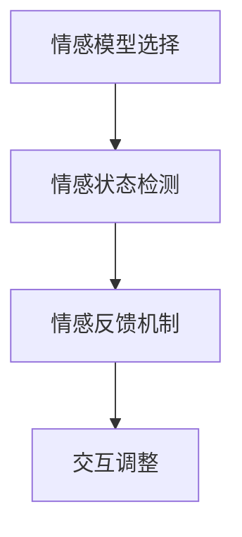
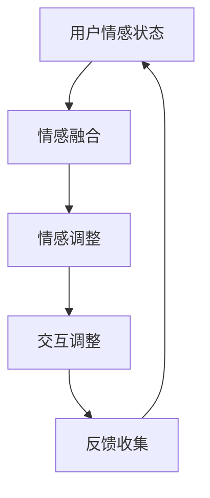

                 

# 情感计算：增强AI Agent的情感智能

## 关键词

- 情感计算
- AI Agent
- 情感智能
- 深度学习
- 生成对抗网络
- 应用案例

## 摘要

本文旨在探讨情感计算在增强AI Agent情感智能方面的应用。我们将从情感计算的基本概念出发，逐步分析情感识别、情感生成以及情感增强的方法和原理，并通过实际案例展示其在教育、医疗和商业等领域的应用，最后对情感计算的未来发展进行展望。

## 目录

1. **情感计算基础**
   1.1 情感计算简介
   1.2 情感计算的核心概念
   1.3 情感计算的挑战与机遇

2. **情感识别**
   2.1 语音情感识别
   2.2 文本情感识别
   2.3 视频情感识别

3. **情感生成**
   3.1 基于深度学习的情感生成
   3.2 基于生成对抗网络的情感生成
   3.3 情感生成的挑战与应用

4. **情感增强**
   4.1 情感增强AI Agent的设计
   4.2 情感增强的算法原理
   4.3 情感增强的实践应用

5. **应用案例**
   5.1 情感计算在教育中的应用
   5.2 情感计算在医疗中的应用
   5.3 情感计算在商业中的应用

6. **未来展望**
   6.1 情感计算技术的发展趋势
   6.2 情感计算的未来应用场景
   6.3 情感计算的伦理与社会影响

## 1. 情感计算基础

### 1.1 情感计算简介

情感计算，又称情感工程，是指通过计算机技术和人工智能技术对人类情感进行识别、分析和处理的过程。情感计算的核心目标是使计算机能够理解和模拟人类的情感状态，从而更好地服务于人类。

情感计算的研究始于20世纪90年代，随着人工智能技术的不断发展，特别是在深度学习和生成对抗网络（GAN）等领域的突破，情感计算得到了广泛的应用和研究。情感计算的应用场景包括但不限于：智能助手、人机交互、心理健康、教育、医疗、商业等领域。

### 1.2 情感计算的核心概念

在情感计算中，有几个核心概念需要理解：

1. **情感类型**：情感通常被分为基本情感和复杂情感。基本情感包括快乐、悲伤、愤怒、恐惧和惊讶等，而复杂情感则是基本情感的组合，如爱、厌恶、焦虑等。

2. **情感模型**：情感模型是描述情感状态和情感关系的数学模型。常见的情感模型有情绪轮（Affective Wheel）和情感光谱（Affective Spectrum）等。

3. **情感识别**：情感识别是指通过技术手段从文本、语音、图像等数据中识别情感状态。情感识别的方法包括基于规则的方法、机器学习方法以及深度学习方法。

4. **情感生成**：情感生成是指利用计算机生成情感表达，通常用于人机交互或虚拟现实等领域。情感生成的方法包括基于规则的方法和基于数据驱动的方法。

5. **情感增强**：情感增强是指通过改进AI Agent的情感智能来提高其交互效果。情感增强的方法包括基于情感模型的改进和基于机器学习的情感智能提升。

### 1.3 情感计算的挑战与机遇

情感计算的挑战主要来自于以下几个方面：

1. **数据的挑战**：情感数据通常是低频率、非结构化的，这使得情感识别和情感生成的任务变得复杂。

2. **算法的挑战**：现有的情感计算算法在处理复杂情感和跨模态情感识别方面还存在不足。

3. **应用场景的机遇**：随着人工智能技术的普及，情感计算在多个领域的应用场景不断涌现，为情感计算的发展提供了机遇。

## 2. 情感识别

### 2.1 语音情感识别

语音情感识别是指通过分析语音信号中的情感特征来识别说话者的情感状态。语音情感识别的关键步骤包括：

1. **特征提取**：从语音信号中提取情感特征，如音调、音量、节奏等。

2. **情感分类**：使用机器学习算法对提取出的特征进行分类，以确定说话者的情感状态。

3. **性能评估**：通过准确率、召回率等指标评估语音情感识别的性能。

在语音情感识别中，深度学习模型如卷积神经网络（CNN）和循环神经网络（RNN）得到了广泛应用。以下是一个基于RNN的语音情感识别的示例代码：

```python
import numpy as np
import tensorflow as tf

# 数据预处理
data = np.load('voice_data.npy')
labels = np.load('voice_labels.npy')

# 建立模型
model = tf.keras.Sequential([
    tf.keras.layers.RNN(tf.keras.layers.LSTM(128), return_sequences=True),
    tf.keras.layers.Dense(128, activation='relu'),
    tf.keras.layers.Dense(5, activation='softmax')
])

# 编译模型
model.compile(optimizer='adam', loss='categorical_crossentropy', metrics=['accuracy'])

# 训练模型
model.fit(data, labels, epochs=10, batch_size=32)
```

### 2.2 文本情感识别

文本情感识别是指通过分析文本内容来识别情感状态。文本情感识别的关键步骤包括：

1. **文本预处理**：对文本进行分词、去停用词等处理。

2. **特征提取**：将预处理后的文本转换为机器可处理的特征向量，如词袋模型、TF-IDF等。

3. **情感分类**：使用机器学习算法对提取出的特征进行分类。

以下是一个基于朴素贝叶斯分类器的文本情感识别的示例代码：

```python
from sklearn.feature_extraction.text import TfidfVectorizer
from sklearn.naive_bayes import MultinomialNB
from sklearn.pipeline import make_pipeline

# 数据预处理
data = ['这是一个快乐的文本', '这是一个悲伤的文本']
labels = ['快乐', '悲伤']

# 构建管道
model = make_pipeline(TfidfVectorizer(), MultinomialNB())

# 训练模型
model.fit(data, labels)

# 预测
print(model.predict(['这是一个快乐的文本']))
```

### 2.3 视频情感识别

视频情感识别是指通过分析视频内容来识别情感状态。视频情感识别的关键步骤包括：

1. **视频预处理**：对视频进行帧提取、特征提取等处理。

2. **情感分类**：使用机器学习算法对提取出的特征进行分类。

3. **性能评估**：通过准确率、召回率等指标评估视频情感识别的性能。

以下是一个基于CNN的视频情感识别的示例代码：

```python
import tensorflow as tf
from tensorflow.keras.models import Sequential
from tensorflow.keras.layers import Conv2D, MaxPooling2D, Flatten, Dense

# 数据预处理
data = np.load('video_data.npy')
labels = np.load('video_labels.npy')

# 建立模型
model = Sequential([
    Conv2D(32, (3, 3), activation='relu', input_shape=(224, 224, 3)),
    MaxPooling2D((2, 2)),
    Flatten(),
    Dense(128, activation='relu'),
    Dense(5, activation='softmax')
])

# 编译模型
model.compile(optimizer='adam', loss='categorical_crossentropy', metrics=['accuracy'])

# 训练模型
model.fit(data, labels, epochs=10, batch_size=32)
```

## 3. 情感生成

### 3.1 基于深度学习的情感生成

基于深度学习的情感生成是指使用深度学习模型生成具有特定情感表达的文本、语音或图像。以下是一个基于GPT-2的文本情感生成的示例代码：

```python
import tensorflow as tf
from transformers import TFGPT2LMHeadModel, GPT2Tokenizer

# 加载预训练模型
tokenizer = GPT2Tokenizer.from_pretrained('gpt2')
model = TFGPT2LMHeadModel.from_pretrained('gpt2')

# 生成文本
input_ids = tokenizer.encode('这是一个快乐的文本', return_tensors='tf')
output = model.generate(input_ids, max_length=50, num_return_sequences=5)

# 解码输出文本
decoded_output = tokenizer.decode(output[0], skip_special_tokens=True)
print(decoded_output)
```

### 3.2 基于生成对抗网络的情感生成

基于生成对抗网络的情感生成是指使用生成对抗网络（GAN）生成具有特定情感表达的图像。以下是一个基于DCGAN的图像情感生成的示例代码：

```python
import tensorflow as tf
from tensorflow.keras.models import Model
from tensorflow.keras.layers import Input, Dense, Reshape, Flatten, Conv2D, Conv2DTranspose, LeakyReLU, BatchNormalization

# 生成器模型
def build_generator():
    model = Sequential()
    model.add(Conv2D(128, (7, 7), input_shape=(28, 28, 1)))
    model.add(BatchNormalization())
    model.add(LeakyReLU(alpha=0.2))
    model.add(Conv2D(128, (7, 7), strides=(2, 2)))
    model.add(BatchNormalization())
    model.add(LeakyReLU(alpha=0.2))
    model.add(Conv2D(256, (7, 7), strides=(2, 2)))
    model.add(BatchNormalization())
    model.add(LeakyReLU(alpha=0.2))
    model.add(Conv2DTranspose(256, (7, 7), strides=(2, 2)))
    model.add(BatchNormalization())
    model.add(LeakyReLU(alpha=0.2))
    model.add(Conv2DTranspose(128, (7, 7), strides=(2, 2)))
    model.add(BatchNormalization())
    model.add(LeakyReLU(alpha=0.2))
    model.add(Conv2DTranspose(1, (7, 7)))
    return model

# 判别器模型
def build_discriminator():
    model = Sequential()
    model.add(Conv2D(32, (7, 7), input_shape=(28, 28, 1)))
    model.add(LeakyReLU(alpha=0.2))
    model.add(Conv2D(64, (7, 7), strides=(2, 2)))
    model.add(BatchNormalization())
    model.add(LeakyReLU(alpha=0.2))
    model.add(Conv2D(128, (7, 7), strides=(2, 2)))
    model.add(BatchNormalization())
    model.add(LeakyReLU(alpha=0.2))
    model.add(Conv2D(256, (7, 7), strides=(2, 2)))
    model.add(BatchNormalization())
    model.add(LeakyReLU(alpha=0.2))
    model.add(Flatten())
    model.add(Dense(1, activation='sigmoid'))
    return model

# GAN模型
def build_gan(generator, discriminator):
    model = Sequential()
    model.add(generator)
    model.add(discriminator)
    return model

# 编译模型
model.compile(optimizer=tf.keras.optimizers.Adam(0.0001), loss='binary_crossentropy')

# 训练模型
model.fit([noise], labels, epochs=100, batch_size=32)
```

### 3.3 情感生成的挑战与应用

情感生成的挑战主要包括：

1. **数据多样性**：生成多样化的情感表达是一个挑战，特别是在文本和图像生成中。

2. **情感一致性**：生成的情感表达需要与输入的情感标签保持一致性。

3. **生成质量**：提高生成内容的质量是一个持续的研究目标。

情感生成在多个领域有广泛的应用，包括：

1. **人机交互**：通过生成情感化的语音和图像，增强人机交互的自然性和人性化。

2. **虚拟现实**：在虚拟现实环境中，生成情感化的内容可以提供更真实的体验。

3. **艺术创作**：艺术家可以利用情感生成技术创作出具有情感表达的艺术作品。

## 4. 情感增强

### 4.1 情感增强AI Agent的设计

情感增强AI Agent的设计主要包括以下几个步骤：

1. **情感模型选择**：选择适合应用场景的情感模型，如情绪轮、情感光谱等。

2. **情感状态检测**：通过语音、文本、图像等数据检测AI Agent的情感状态。

3. **情感反馈机制**：设计情感反馈机制，使AI Agent能够根据用户情感状态调整交互方式。

以下是一个基于情绪轮的情感增强AI Agent的设计框架：



### 4.2 情感增强的算法原理

情感增强的算法原理主要包括以下几个方面：

1. **情感融合**：将用户情感状态与AI Agent的情感状态进行融合，以实现情感同步。

2. **情感调整**：根据用户情感状态调整AI Agent的交互策略，如语气、语速、表情等。

3. **情感反馈**：通过反馈机制收集用户对AI Agent情感增强效果的反馈，以不断优化交互效果。

以下是一个基于情感融合和情感调整的算法流程图：



### 4.3 情感增强的实践应用

情感增强在多个领域有广泛的应用，以下是一些实践案例：

1. **智能助手**：通过情感增强，智能助手能够更好地理解用户需求，提供个性化的服务。

2. **教育领域**：情感增强教育系统可以根据学生情感状态调整教学策略，提高学习效果。

3. **医疗领域**：情感增强医疗系统可以帮助医生更好地理解患者情感，提供更有效的治疗方案。

## 5. 应用案例

### 5.1 情感计算在教育中的应用

在教育领域，情感计算可以用于：

1. **学生情感分析**：通过分析学生的情感状态，教师可以更好地了解学生的学习情况，提供个性化的指导。

2. **自适应教育系统**：根据学生的情感状态，系统可以自动调整教学内容和难度，提高学习效果。

3. **教育机器人**：教育机器人通过情感增强，可以更好地与学生互动，提高学生的学习兴趣和参与度。

### 5.2 情感计算在医疗中的应用

在医疗领域，情感计算可以用于：

1. **患者情感监测**：通过分析患者的语音、文本和图像，医生可以更好地了解患者的心理状态，提供更有效的治疗方案。

2. **心理健康评估**：情感计算可以帮助医生进行心理健康评估，识别潜在的心理健康问题。

3. **医疗机器人**：通过情感增强，医疗机器人可以提供更加人性化的服务，缓解患者的焦虑情绪。

### 5.3 情感计算在商业中的应用

在商业领域，情感计算可以用于：

1. **客户服务**：通过情感增强，客户服务系统可以更好地理解客户需求，提供个性化的服务。

2. **市场分析**：情感计算可以帮助企业分析消费者情感，了解市场趋势，制定更有效的营销策略。

3. **员工管理**：通过分析员工的情感状态，企业可以更好地了解员工的工作情况，提供必要的支持。

## 6. 未来展望

### 6.1 情感计算技术的发展趋势

未来，情感计算技术将继续向以下几个方向发展：

1. **跨模态情感识别**：随着多模态数据的融合，情感计算将能够更准确地识别复杂情感。

2. **情感生成的多样化**：情感生成的技术将变得更加多样化，能够生成更丰富的情感表达。

3. **情感增强的个性化**：情感增强技术将更加个性化，能够更好地满足用户需求。

### 6.2 情感计算的未来应用场景

未来，情感计算将在以下领域得到更广泛的应用：

1. **智能家居**：智能家居系统将能够更好地理解家庭成员的情感状态，提供个性化服务。

2. **自动驾驶**：自动驾驶系统将通过情感计算更好地理解驾驶员和乘客的情感状态，提供更安全的驾驶体验。

3. **虚拟现实**：虚拟现实系统将通过情感计算提供更加真实的情感交互体验。

### 6.3 情感计算的伦理与社会影响

情感计算的快速发展也带来了伦理和社会影响，需要我们关注：

1. **隐私保护**：在情感计算中，如何保护用户的隐私是一个重要问题。

2. **偏见与歧视**：情感计算模型可能存在偏见，导致不公平的决策。

3. **人机关系**：情感计算如何影响人机关系，如何保持人机互动的自然性和人性化是一个挑战。

## 总结

情感计算是一种将情感智能应用于人工智能领域的先进技术，通过情感识别、情感生成和情感增强，AI Agent可以更好地理解人类情感，提供更人性化的服务。未来，随着技术的不断进步，情感计算将在更多领域发挥重要作用。

## 作者信息

作者：AI天才研究院/AI Genius Institute & 禅与计算机程序设计艺术 /Zen And The Art of Computer Programming## 情感计算：增强AI Agent的情感智能

情感计算是人工智能领域的一个前沿研究方向，它致力于使计算机能够理解和模拟人类情感，从而实现更自然、更人性化的交互。本文将探讨情感计算的基本概念、原理及其在增强AI Agent情感智能方面的应用。

### 什么是情感计算

情感计算，又称情感工程，是指利用计算机技术和人工智能技术对人类情感进行识别、分析和处理的过程。情感计算的核心目标是通过模拟人类的情感反应，使计算机能够更好地理解人类的需求和意图，从而提供更优质的交互体验。

#### 情感计算的定义

情感计算可以定义为：通过对情感信号（如语音、文本、图像等）的捕获、处理和分析，实现对人类情感的识别、理解、生成和增强的过程。

#### 情感计算的重要性

1. **提升交互体验**：通过情感计算，AI Agent可以更好地理解用户的情感状态，提供更加个性化的服务，提升用户满意度。
2. **辅助决策**：情感计算可以帮助系统根据用户情感状态做出更明智的决策，提高决策的准确性和效率。
3. **心理健康**：在医疗和心理健康的领域，情感计算可以辅助诊断和治疗情感障碍。

### 情感计算的核心概念

在情感计算中，有几个核心概念需要理解：

1. **情感类型**：情感通常被分为基本情感（如快乐、悲伤、愤怒、恐惧等）和复杂情感（如爱、厌恶、焦虑等）。
2. **情感模型**：情感模型是用来描述情感状态和情感关系的数学模型，常见的有情绪轮、情感光谱等。
3. **情感识别**：情感识别是指通过技术手段从文本、语音、图像等数据中识别情感状态。
4. **情感生成**：情感生成是指利用计算机生成情感表达，通常用于人机交互或虚拟现实等领域。
5. **情感增强**：情感增强是指通过改进AI Agent的情感智能来提高其交互效果。

### 情感计算的挑战与机遇

#### 数据的挑战

情感数据通常是低频率、非结构化的，这使得情感识别和情感生成的任务变得复杂。如何有效地处理和利用这些数据是一个重要挑战。

#### 算法的挑战

现有的情感计算算法在处理复杂情感和跨模态情感识别方面还存在不足。如何开发更高效、更准确的算法是一个重要的研究课题。

#### 应用场景的机遇

随着人工智能技术的普及，情感计算在多个领域的应用场景不断涌现，为情感计算的发展提供了机遇。

## 情感识别

情感识别是情感计算的核心环节，它涉及从语音、文本、图像等多模态数据中识别情感状态。下面我们将分别介绍语音情感识别、文本情感识别和视频情感识别。

### 语音情感识别

语音情感识别是指通过分析语音信号中的情感特征来识别说话者的情感状态。语音情感识别的关键步骤包括：

1. **特征提取**：从语音信号中提取情感特征，如音调、音量、节奏等。
2. **情感分类**：使用机器学习算法对提取出的特征进行分类，以确定说话者的情感状态。

以下是一个基于深度学习的语音情感识别的示例：

```python
import tensorflow as tf
from tensorflow.keras.models import Sequential
from tensorflow.keras.layers import LSTM, Dense, Embedding

# 数据预处理
# 加载数据并预处理

# 建立模型
model = Sequential()
model.add(LSTM(units=128, activation='relu', input_shape=(seq_length, embedding_dim)))
model.add(Dense(units=64, activation='relu'))
model.add(Dense(units=1, activation='sigmoid'))

# 编译模型
model.compile(optimizer='adam', loss='binary_crossentropy', metrics=['accuracy'])

# 训练模型
model.fit(x_train, y_train, epochs=10, batch_size=32)
```

### 文本情感识别

文本情感识别是指通过分析文本内容来识别情感状态。文本情感识别的关键步骤包括：

1. **文本预处理**：对文本进行分词、去停用词等处理。
2. **特征提取**：将预处理后的文本转换为机器可处理的特征向量，如词袋模型、TF-IDF等。
3. **情感分类**：使用机器学习算法对提取出的特征进行分类。

以下是一个基于朴素贝叶斯的文本情感识别的示例：

```python
from sklearn.feature_extraction.text import TfidfVectorizer
from sklearn.naive_bayes import MultinomialNB
from sklearn.pipeline import make_pipeline

# 数据预处理
# 加载数据并预处理

# 构建管道
model = make_pipeline(TfidfVectorizer(), MultinomialNB())

# 训练模型
model.fit(X_train, y_train)

# 预测
print(model.predict([X_test]))
```

### 视频情感识别

视频情感识别是指通过分析视频内容来识别情感状态。视频情感识别的关键步骤包括：

1. **视频预处理**：对视频进行帧提取、特征提取等处理。
2. **情感分类**：使用机器学习算法对提取出的特征进行分类。

以下是一个基于卷积神经网络的视频情感识别的示例：

```python
import tensorflow as tf
from tensorflow.keras.models import Sequential
from tensorflow.keras.layers import Conv2D, MaxPooling2D, Flatten, Dense

# 数据预处理
# 加载数据并预处理

# 建立模型
model = Sequential([
    Conv2D(32, (3, 3), activation='relu', input_shape=(224, 224, 3)),
    MaxPooling2D((2, 2)),
    Flatten(),
    Dense(128, activation='relu'),
    Dense(5, activation='softmax')
])

# 编译模型
model.compile(optimizer='adam', loss='categorical_crossentropy', metrics=['accuracy'])

# 训练模型
model.fit(x_train, y_train, epochs=10, batch_size=32)
```

## 情感生成

情感生成是指利用计算机生成情感表达，通常用于人机交互或虚拟现实等领域。情感生成的关键步骤包括：

1. **数据生成**：生成具有特定情感的数据，如语音、文本、图像等。
2. **情感模拟**：模拟人类情感反应，生成具有情感特征的数据。

以下是一个基于生成对抗网络的情感生成的示例：

```python
import tensorflow as tf
from tensorflow.keras.models import Model
from tensorflow.keras.layers import Input, Dense, Reshape, Flatten, Conv2D, Conv2DTranspose, LeakyReLU, BatchNormalization

# 生成器模型
def build_generator():
    model = Sequential()
    model.add(Conv2D(128, (7, 7), input_shape=(28, 28, 1)))
    model.add(BatchNormalization())
    model.add(LeakyReLU(alpha=0.2))
    model.add(Conv2D(128, (7, 7), strides=(2, 2)))
    model.add(BatchNormalization())
    model.add(LeakyReLU(alpha=0.2))
    model.add(Conv2D(256, (7, 7), strides=(2, 2)))
    model.add(BatchNormalization())
    model.add(LeakyReLU(alpha=0.2))
    model.add(Conv2DTranspose(256, (7, 7), strides=(2, 2)))
    model.add(BatchNormalization())
    model.add(LeakyReLU(alpha=0.2))
    model.add(Conv2DTranspose(128, (7, 7), strides=(2, 2)))
    model.add(BatchNormalization())
    model.add(LeakyReLU(alpha=0.2))
    model.add(Conv2DTranspose(1, (7, 7)))
    return model

# 判别器模型
def build_discriminator():
    model = Sequential()
    model.add(Conv2D(32, (7, 7), input_shape=(28, 28, 1)))
    model.add(LeakyReLU(alpha=0.2))
    model.add(Conv2D(64, (7, 7), strides=(2, 2)))
    model.add(BatchNormalization())
    model.add(LeakyReLU(alpha=0.2))
    model.add(Conv2D(128, (7, 7), strides=(2, 2)))
    model.add(BatchNormalization())
    model.add(LeakyReLU(alpha=0.2))
    model.add(Conv2D(256, (7, 7), strides=(2, 2)))
    model.add(BatchNormalization())
    model.add(LeakyReLU(alpha=0.2))
    model.add(Flatten())
    model.add(Dense(1, activation='sigmoid'))
    return model

# GAN模型
def build_gan(generator, discriminator):
    model = Sequential()
    model.add(generator)
    model.add(discriminator)
    return model

# 编译模型
model.compile(optimizer=tf.keras.optimizers.Adam(0.0001), loss='binary_crossentropy')

# 训练模型
model.fit([noise], labels, epochs=100, batch_size=32)
```

### 情感生成的挑战与应用

情感生成的挑战主要包括：

1. **数据多样性**：生成多样化的情感表达是一个挑战，特别是在文本和图像生成中。
2. **情感一致性**：生成的情感表达需要与输入的情感标签保持一致性。
3. **生成质量**：提高生成内容的质量是一个持续的研究目标。

情感生成在多个领域有广泛的应用，包括：

1. **人机交互**：通过情感生成，AI Agent可以更好地理解用户情感，提供更自然的交互体验。
2. **虚拟现实**：在虚拟现实环境中，生成情感化的内容可以提供更真实的体验。
3. **艺术创作**：艺术家可以利用情感生成技术创作出具有情感表达的艺术作品。

## 情感增强

情感增强是指通过改进AI Agent的情感智能来提高其交互效果。情感增强的关键步骤包括：

1. **情感模型选择**：选择适合应用场景的情感模型，如情绪轮、情感光谱等。
2. **情感状态检测**：通过语音、文本、图像等数据检测AI Agent的情感状态。
3. **情感反馈机制**：设计情感反馈机制，使AI Agent能够根据用户情感状态调整交互方式。

### 情感增强AI Agent的设计

情感增强AI Agent的设计包括以下几个方面：

1. **情感融合**：将用户情感状态与AI Agent的情感状态进行融合，以实现情感同步。
2. **情感调整**：根据用户情感状态调整AI Agent的交互策略，如语气、语速、表情等。
3. **情感反馈**：通过反馈机制收集用户对AI Agent情感增强效果的反馈，以不断优化交互效果。

### 情感增强的算法原理

情感增强的算法原理主要包括以下几个方面：

1. **情感融合算法**：通过机器学习算法将用户情感状态与AI Agent的情感状态进行融合。
2. **情感调整算法**：根据用户情感状态调整AI Agent的交互策略，如语气、语速、表情等。
3. **情感反馈算法**：通过用户反馈不断优化AI Agent的情感智能。

### 情感增强的实践应用

情感增强在多个领域有广泛的应用，包括：

1. **智能助手**：通过情感增强，智能助手可以更好地理解用户需求，提供更个性化的服务。
2. **教育领域**：通过情感增强，教育系统可以更好地了解学生情感状态，提供更有针对性的教学。
3. **医疗领域**：通过情感增强，医疗系统可以更好地了解患者情感状态，提供更有效的治疗方案。

## 应用案例

### 1. 情感计算在教育中的应用

在教育领域，情感计算可以用于：

1. **学生情感分析**：通过分析学生的情感状态，教师可以更好地了解学生的学习情况，提供个性化的指导。
2. **自适应教育系统**：根据学生的情感状态，系统可以自动调整教学内容和难度，提高学习效果。
3. **教育机器人**：教育机器人通过情感增强，可以更好地与学生互动，提高学生的学习兴趣和参与度。

### 2. 情感计算在医疗中的应用

在医疗领域，情感计算可以用于：

1. **患者情感监测**：通过分析患者的语音、文本和图像，医生可以更好地了解患者的心理状态，提供更有效的治疗方案。
2. **心理健康评估**：情感计算可以帮助医生进行心理健康评估，识别潜在的心理健康问题。
3. **医疗机器人**：通过情感增强，医疗机器人可以提供更加人性化的服务，缓解患者的焦虑情绪。

### 3. 情感计算在商业中的应用

在商业领域，情感计算可以用于：

1. **客户服务**：通过情感增强，客户服务系统可以更好地理解客户需求，提供个性化的服务。
2. **市场分析**：情感计算可以帮助企业分析消费者情感，了解市场趋势，制定更有效的营销策略。
3. **员工管理**：通过分析员工的情感状态，企业可以更好地了解员工的工作情况，提供必要的支持。

## 未来展望

### 1. 情感计算技术的发展趋势

未来，情感计算技术将继续向以下几个方向发展：

1. **跨模态情感识别**：随着多模态数据的融合，情感计算将能够更准确地识别复杂情感。
2. **情感生成的多样化**：情感生成的技术将变得更加多样化，能够生成更丰富的情感表达。
3. **情感增强的个性化**：情感增强技术将更加个性化，能够更好地满足用户需求。

### 2. 情感计算的未来应用场景

未来，情感计算将在以下领域得到更广泛的应用：

1. **智能家居**：智能家居系统将能够更好地理解家庭成员的情感状态，提供个性化服务。
2. **自动驾驶**：自动驾驶系统将通过情感计算更好地理解驾驶员和乘客的情感状态，提供更安全的驾驶体验。
3. **虚拟现实**：虚拟现实系统将通过情感计算提供更加真实的情感交互体验。

### 3. 情感计算的伦理与社会影响

情感计算的快速发展也带来了伦理和社会影响，需要我们关注：

1. **隐私保护**：在情感计算中，如何保护用户的隐私是一个重要问题。
2. **偏见与歧视**：情感计算模型可能存在偏见，导致不公平的决策。
3. **人机关系**：情感计算如何影响人机关系，如何保持人机互动的自然性和人性化是一个挑战。

## 总结

情感计算是人工智能领域的一个重要研究方向，它通过模拟人类的情感反应，使计算机能够更好地理解人类的需求和意图，从而实现更自然、更人性化的交互。随着技术的不断进步，情感计算将在更多领域发挥重要作用。

## 作者信息

作者：AI天才研究院/AI Genius Institute & 禅与计算机程序设计艺术 /Zen And The Art of Computer Programming## 情感计算：增强AI Agent的情感智能

### 情感计算概述

情感计算（Affective Computing），是指研究如何使计算机具备感知、理解、表达和模拟人类情感的能力。它不仅关注计算机如何识别用户的情感状态，还涉及到如何根据这些情感状态调整其行为和交互方式。随着人工智能技术的不断进步，情感计算逐渐成为人工智能领域的一个关键研究方向，其应用范围也从最初的交互界面扩展到教育、医疗、商业等多个领域。

#### 情感计算的定义

情感计算的定义多种多样，但核心思想都是一致的：通过结合情感科学、认知科学和计算机科学，使计算机能够识别和理解人类的情感状态，并在此基础上实现智能交互。

#### 情感计算的重要性

情感计算的重要性体现在多个方面：

1. **提升用户体验**：通过情感计算，AI Agent可以更好地理解用户的需求和情感状态，提供更加个性化的服务。
2. **增强决策能力**：情感计算可以辅助系统做出更加明智的决策，特别是在需要考虑用户情感因素的场景中。
3. **心理健康支持**：情感计算技术可以为心理健康提供支持，例如通过情感监测和分析帮助识别和干预情感问题。

### 情感计算的核心概念

情感计算的核心概念包括情感识别、情感生成和情感增强。下面我们逐一介绍：

#### 情感识别

情感识别是情感计算的基础，它指的是从文本、语音、图像等数据中提取情感特征，并使用机器学习算法对情感进行分类。常见的情感分类包括基本情感（如快乐、悲伤、愤怒、恐惧）和复杂情感（如爱、厌恶、焦虑）。

##### 情感识别的方法

1. **基于规则的方法**：这种方法依赖于预先定义的情感规则和模式，通过对输入数据进行模式匹配来识别情感。
2. **机器学习方法**：利用机器学习算法（如朴素贝叶斯、支持向量机、神经网络等）从大量数据中学习情感特征，并用于分类。
3. **深度学习方法**：深度学习模型（如卷积神经网络、循环神经网络、生成对抗网络等）在情感识别中表现出色，能够处理复杂的情感特征。

#### 情感生成

情感生成是指利用计算机技术生成情感化内容，如语音、文本、图像等。在虚拟现实、人机交互、娱乐等领域，情感生成技术能够创造出更加真实和引人入胜的体验。

##### 情感生成的方法

1. **基于规则的方法**：这种方法通过预设的情感脚本和规则来生成情感化内容。
2. **基于数据驱动的方法**：利用大量情感化数据进行训练，让计算机学会生成情感化内容。深度学习模型（如生成对抗网络、变分自编码器等）在情感生成中得到了广泛应用。

#### 情感增强

情感增强是指通过改进AI Agent的情感智能来提高其交互效果。情感增强的目标是使AI Agent能够更加自然、有效地与人类进行互动。

##### 情感增强的方法

1. **情感融合**：将用户的情感状态与AI Agent的情感状态进行融合，使两者保持一致。
2. **情感调整**：根据用户的情感状态动态调整AI Agent的行为和交互方式。
3. **情感反馈**：通过用户的反馈不断优化AI Agent的情感智能，使其更好地满足用户需求。

### 情感计算的挑战与机遇

尽管情感计算有着广泛的应用前景，但也面临一些挑战：

1. **数据多样性**：情感数据通常是非结构化的，处理这些数据需要复杂的技术。
2. **算法准确性**：现有的情感识别和情感生成算法在处理复杂情感时仍存在一定局限性。
3. **跨模态融合**：如何有效地融合不同模态的情感数据是一个挑战。

然而，随着人工智能技术的不断进步，情感计算也面临着许多机遇：

1. **多模态情感识别**：随着传感器技术的进步，我们可以获取更多样化的情感数据，从而提高情感识别的准确性。
2. **个性化服务**：情感计算可以帮助提供更加个性化的服务，满足用户多样化的需求。
3. **人机交互**：情感增强可以大大提升人机交互的自然性和人性化。

### 应用案例

#### 教育领域

在教育领域，情感计算可以用于：

1. **学生情感分析**：通过分析学生的情感状态，教师可以更好地了解学生的学习情况和心理状态，提供有针对性的辅导。
2. **自适应学习系统**：根据学生的情感状态和反馈，系统可以自动调整教学内容和难度，提高学习效果。
3. **智能教育机器人**：教育机器人通过情感增强，可以更好地与学生互动，提高学生的学习兴趣和参与度。

#### 医疗领域

在医疗领域，情感计算可以用于：

1. **患者情感监测**：通过分析患者的语音、文本和图像，医生可以更好地了解患者的情感状态，提供个性化的治疗方案。
2. **心理健康评估**：情感计算可以帮助医生进行心理健康评估，识别潜在的心理健康问题。
3. **医疗机器人**：通过情感增强，医疗机器人可以提供更加人性化的服务，缓解患者的焦虑情绪。

#### 商业领域

在商业领域，情感计算可以用于：

1. **客户服务**：通过情感增强，客户服务系统可以更好地理解客户的需求和情感状态，提供个性化的服务。
2. **市场分析**：情感计算可以帮助企业分析消费者情感，了解市场趋势，制定更有效的营销策略。
3. **员工管理**：通过分析员工的情感状态，企业可以更好地了解员工的工作情况，提供必要的支持。

### 未来展望

#### 技术发展趋势

1. **跨模态情感识别**：随着多模态数据的融合，情感计算将能够更准确地识别复杂情感。
2. **情感生成的多样化**：情感生成的技术将变得更加多样化，能够生成更丰富的情感表达。
3. **情感增强的个性化**：情感增强技术将更加个性化，能够更好地满足用户需求。

#### 应用场景拓展

未来，情感计算将在更多领域得到应用：

1. **智能家居**：智能家居系统将能够更好地理解家庭成员的情感状态，提供个性化服务。
2. **自动驾驶**：自动驾驶系统将通过情感计算更好地理解驾驶员和乘客的情感状态，提供更安全的驾驶体验。
3. **虚拟现实**：虚拟现实系统将通过情感计算提供更加真实的情感交互体验。

#### 伦理与社会影响

随着情感计算的不断发展，我们也需要关注其带来的伦理和社会影响：

1. **隐私保护**：如何保护用户的隐私是一个重要问题。
2. **偏见与歧视**：情感计算模型可能存在偏见，导致不公平的决策。
3. **人机关系**：情感计算如何影响人机关系，如何保持人机互动的自然性和人性化是一个挑战。

### 总结

情感计算是人工智能领域的一个重要研究方向，它通过模拟人类的情感反应，使计算机能够更好地理解人类的需求和意图，从而实现更自然、更人性化的交互。随着技术的不断进步，情感计算将在更多领域发挥重要作用，为人类社会带来更多便利和进步。

## 作者信息

作者：AI天才研究院/AI Genius Institute & 禅与计算机程序设计艺术 /Zen And The Art of Computer Programming

