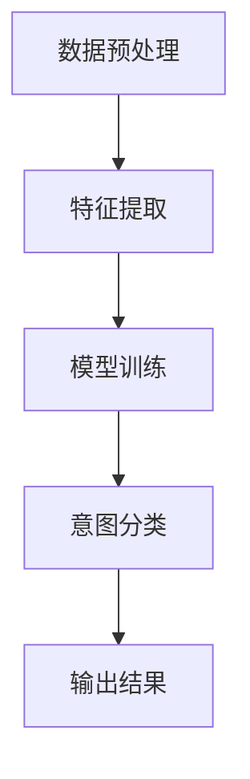
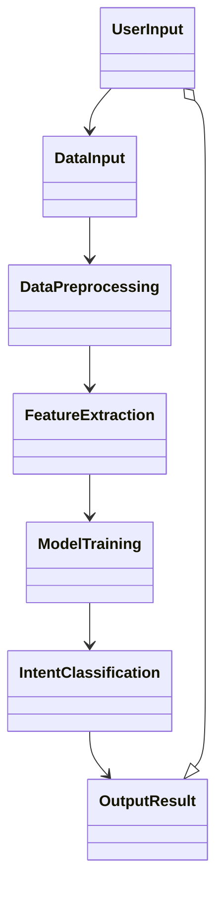
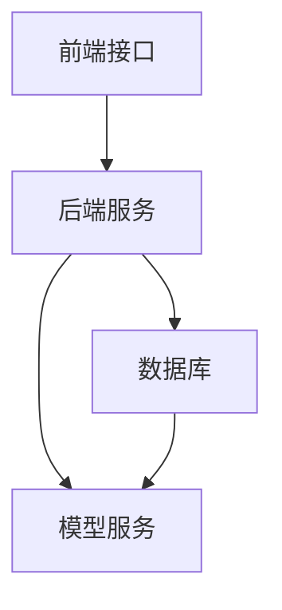
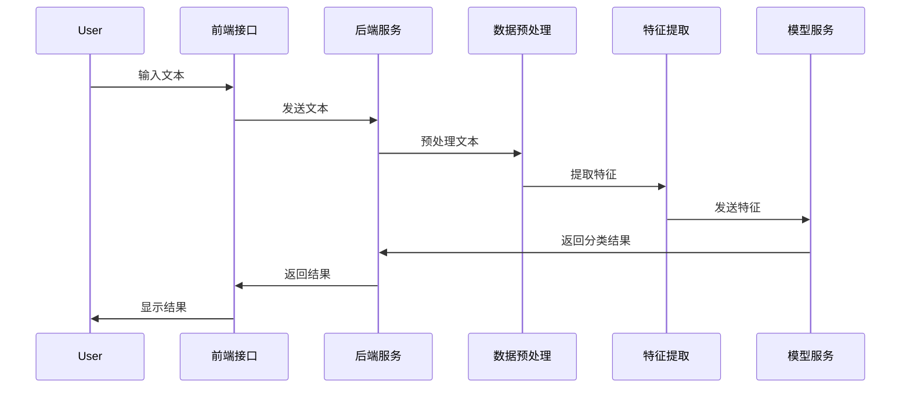

                 


### 第一部分：意图识别概述

#### 第1章：意图识别概述

##### 1.1 问题背景与描述

在当今快速发展的数字时代，用户需求的变化速度远远超过了传统的业务响应能力。用户在互联网上的行为越来越多样化，他们不仅仅是浏览信息，更是通过搜索、提问、互动等方式与系统进行交流。这种交流方式使得对用户意图的准确识别成为了一个关键的问题。

意图识别是自然语言处理（NLP）中的一个重要分支，旨在理解和解析用户的语言意图。无论是电子商务平台上的购买需求，还是社交媒体上的评论回复，用户的行为都可以被归类为某种意图。识别和理解这些意图对于提升用户体验、增强个性化推荐、自动化客服等方面都具有重要的意义。

当前，用户需求的理解存在一定的困难。一方面，用户的语言表达往往具有一定的模糊性和多义性，使得系统难以准确判断用户的真实意图。另一方面，用户的交互场景复杂多变，不同场景下的用户需求可能存在显著差异。这种复杂性增加了意图识别的难度，也要求系统具备更高的适应性。

##### 1.2 概念定义与边界

**意图识别**：意图识别是指从用户的语言输入中提取出其真实的意图，并将其转化为计算机可以理解和处理的形式。这个过程涉及自然语言的理解、语义分析以及机器学习等技术的综合运用。

**用户需求**：用户需求是指用户在特定情境下希望从系统获得的结果或服务。用户需求可以是明确的，例如购买某件商品；也可以是隐含的，例如在浏览商品时对某一类产品的偏好。

**目标需求**：目标需求是指用户在意图识别后，系统需要实现的具体目标。目标需求是意图识别结果的直接应用，例如根据用户的购物意图提供相应的商品推荐。

意图识别、用户需求与目标需求之间存在密切的联系。意图识别是理解用户需求的前提，而用户需求是意图识别的结果。目标需求则是用户需求的具体实现，是系统对意图识别结果的应用。

**边界与外延**：

- **边界**：意图识别主要关注的是用户语言输入的解析，不包括对用户行为的全面监控和理解。
- **外延**：意图识别的应用范围广泛，包括但不限于电商平台、社交媒体、智能客服、语音助手等领域。

##### 1.3 概念属性特征对比表格

为了更清晰地理解意图识别、用户需求与目标需求之间的关系，我们构建一个概念属性特征对比表格：

| 概念       | 定义                                     | 属性特征                                                                 | 举例                                      |
|------------|------------------------------------------|------------------------------------------------------------------------------------------------|-------------------------------------------|
| 意图识别   | 解析用户语言意图                         | 准确性、实时性、泛化能力                                                     | 智能助手识别用户询问的意图                 |
| 用户需求   | 用户在特定情境下的期望结果或服务         | 明确性、多样性、动态性                                                       | 购买商品、获取信息、寻求帮助               |
| 目标需求   | 实现用户需求的具体目标                   | 可行性、效果性、及时性                                                       | 提供商品推荐、展示相关信息、自动回复问题   |

通过上述表格，我们可以看到意图识别、用户需求与目标需求在属性特征上的差异和联系。意图识别的准确性直接影响用户需求的满足程度，而用户需求的实现效果则决定了目标需求的达成。

### 总结

意图识别作为准确把握用户需求的关键，其在现代数字系统中的应用越来越广泛。通过对意图识别的背景、问题、定义以及与用户需求和目标需求的关系进行深入分析，我们可以更好地理解其在实际应用中的重要性。接下来，我们将进一步探讨意图识别的核心概念与原理，以帮助我们更好地理解这一技术的本质。

## 第二部分：意图识别的核心概念与原理

### 第2章：意图识别的核心概念与原理

#### 2.1 意图识别的基本原理

意图识别的基本原理是基于自然语言处理（NLP）和机器学习（ML）技术，通过对用户输入的语言数据进行处理和分析，提取出其真实的意图。这一过程可以分为以下几个主要步骤：

1. **数据预处理**：
   数据预处理是意图识别的基础步骤。在这一阶段，需要对用户输入的文本数据进行清洗、分词、去除停用词等操作，以便于后续的分析。这一步骤的关键是确保输入数据的质量，从而影响后续识别的准确性。

2. **特征提取**：
   特征提取是将原始文本数据转换为机器学习模型可以处理的特征表示。常用的方法包括词袋模型（Bag of Words, BoW）、词嵌入（Word Embedding）和 TF-IDF（Term Frequency-Inverse Document Frequency）等。这些特征表示方法有助于模型更好地理解和学习文本数据中的语义信息。

3. **模型训练**：
   模型训练是意图识别的核心步骤。在这一阶段，使用机器学习算法（如决策树、支持向量机、神经网络等）对预处理后的特征数据进行训练，以建立意图识别模型。模型的性能直接影响意图识别的准确性。

4. **意图分类**：
   意图分类是将输入的文本数据映射到预定义的意图类别上。这一步骤通常采用分类算法（如朴素贝叶斯、随机森林、神经网络等）来实现。意图分类的准确性是衡量意图识别系统性能的关键指标。

#### 2.2 概念属性特征对比表格

为了更全面地理解意图识别、用户需求与目标需求之间的关系，我们构建一个概念属性特征对比表格：

| 概念       | 定义                                     | 属性特征                                                                 | 举例                                      |
|------------|------------------------------------------|------------------------------------------------------------------------------------------------|-------------------------------------------|
| 意图识别   | 解析用户语言意图                         | 准确性、实时性、泛化能力                                                     | 智能助手识别用户询问的意图                 |
| 用户需求   | 用户在特定情境下的期望结果或服务         | 明确性、多样性、动态性                                                       | 购买商品、获取信息、寻求帮助               |
| 目标需求   | 实现用户需求的具体目标                   | 可行性、效果性、及时性                                                       | 提供商品推荐、展示相关信息、自动回复问题   |

通过上述表格，我们可以看到意图识别、用户需求与目标需求在属性特征上的差异和联系。意图识别的准确性直接影响用户需求的满足程度，而用户需求的实现效果则决定了目标需求的达成。

#### 2.3 意图识别与用户需求、目标需求的关联分析

意图识别、用户需求与目标需求之间存在着紧密的关联。意图识别是理解用户需求的基础，用户需求是意图识别的结果，而目标需求则是用户需求的具体实现。

- **意图识别与用户需求的关联**：

  意图识别的核心任务是准确理解用户输入的语言意图。用户需求通常来源于用户的实际问题或期望，例如购买商品、获取信息或寻求帮助。意图识别通过对用户语言输入的分析，提取出用户的真实意图，并将其转化为机器可以理解和处理的形式。这一过程涉及到自然语言处理和机器学习技术，例如文本分类、语义分析等。

  意图识别的准确性对用户需求的满足至关重要。如果意图识别错误，可能导致用户需求无法得到满足，从而影响用户体验。因此，提高意图识别的准确性是提升用户满意度的重要手段。

- **用户需求与目标需求的关联**：

  用户需求是意图识别的结果，而目标需求则是实现用户需求的具体目标。目标需求通常由用户需求和系统功能共同决定。例如，用户需求是获取商品信息，而目标需求则是向用户展示相关的商品推荐。

  目标需求的实现效果直接影响用户需求的满足程度。如果目标需求无法有效实现，用户需求将无法得到满足。例如，如果智能助手无法提供准确的商品推荐，用户的购物需求将无法得到满足。

#### 2.4 意图识别的挑战与应对策略

尽管意图识别技术在不断发展，但在实际应用中仍然面临一些挑战：

- **多义性问题**：用户的语言表达具有一定的模糊性和多义性，可能导致意图识别错误。应对策略包括使用更复杂的语义分析技术和上下文信息。

- **实时性要求**：用户需求的变化速度很快，要求意图识别系统具备高实时性。应对策略包括优化算法和系统架构，提高处理速度和响应时间。

- **泛化能力**：意图识别系统需要能够适应不同的用户场景和需求，具备良好的泛化能力。应对策略包括大量数据训练和模型优化。

### 总结

意图识别作为准确把握用户需求的关键技术，其基本原理涉及自然语言处理和机器学习技术。通过深入分析意图识别、用户需求与目标需求之间的关系，我们可以更好地理解其在实际应用中的重要性。接下来，我们将进一步探讨意图识别算法的具体原理与实现。

## 第三部分：意图识别算法原理与实现

### 第3章：意图识别算法原理与实现

#### 3.1 算法流程图与解释

意图识别算法的流程可以分为以下步骤：

1. **数据预处理**：包括文本清洗、分词和去除停用词等。
2. **特征提取**：将文本数据转换为机器学习模型可以处理的特征表示。
3. **模型训练**：使用机器学习算法训练模型。
4. **意图分类**：将输入的文本数据映射到预定义的意图类别上。

下面是意图识别算法的Mermaid流程图：



#### 3.2 数学模型与公式

意图识别算法的核心是分类模型。以下是一个简单的基于朴素贝叶斯的分类模型：

- **概率模型**：给定一个词汇集合 \( V \)，定义单词 \( w \) 在意图 \( i \) 下的概率为：

  $$ P(w|i) = \frac{f_{i,w}}{\sum_{w' \in V} f_{i,w'}} $$

  其中 \( f_{i,w} \) 表示词汇 \( w \) 在意图 \( i \) 下的词频。

- **先验概率**：定义意图 \( i \) 的先验概率为：

  $$ P(i) = \frac{n_i}{N} $$

  其中 \( n_i \) 表示总共有 \( N \) 个样本中属于意图 \( i \) 的样本数量。

- **后验概率**：给定一个样本 \( x \)，定义其在意图 \( i \) 下的后验概率为：

  $$ P(i|x) = \frac{P(x|i)P(i)}{P(x)} $$

  其中 \( P(x|i) \) 表示在意图 \( i \) 下生成样本 \( x \) 的概率，\( P(x) \) 是样本 \( x \) 的总概率。

- **分类决策**：根据后验概率选择概率最大的意图作为分类结果：

  $$ \hat{i} = \arg\max_i P(i|x) $$

#### 3.3 算法实例与解释

假设我们有一个简单的词汇集合 \( V = \{buy, price, product, review\} \)，以及两个意图类别 \( i = \{buy, inquire\} \)。我们用以下词频矩阵 \( F \) 来表示每个词汇在两个意图类别下的词频：

| 词汇 | buy | inquire |
|------|-----|----------|
| buy  | 10  | 5        |
| price| 5   | 10       |
| product| 8 | 7        |
| review| 3 | 6        |

我们首先计算每个词汇在两个意图类别下的概率：

$$ P(buy|buy) = \frac{10}{10+5} = 0.6667 $$
$$ P(buy|inquire) = \frac{5}{5+10} = 0.3333 $$
$$ P(inquire|buy) = \frac{10}{10+5} = 0.6667 $$
$$ P(inquire|inquire) = \frac{10}{5+10} = 0.6667 $$

接着计算先验概率，假设每个意图类别出现的概率相等：

$$ P(buy) = P(inquire) = 0.5 $$

然后，我们计算一个样本 \( x = \{price, product\} \) 在两个意图类别下的后验概率：

$$ P(buy|x) = P(price|buy)P(product|buy)P(buy) = 0.6667 \times 0.3333 \times 0.5 = 0.1111 $$
$$ P(inquire|x) = P(price|inquire)P(product|inquire)P(inquire) = 0.3333 \times 0.6667 \times 0.5 = 0.1111 $$

由于 \( P(buy|x) = P(inquire|x) \)，这个样本无法被清晰地区分属于哪个意图类别。这种情况下，我们可以增加更多词汇或使用更复杂的模型来提高分类的准确性。

#### 3.4 代码实现

下面是一个简单的意图识别算法的Python代码实现：

```python
import numpy as np

# 词频矩阵
F = np.array([
    [10, 5],
    [5, 10],
    [8, 7],
    [3, 6]
])

# 先验概率
P = np.array([0.5, 0.5])

# 输入样本
x = np.array([1, 1])

# 概率计算
P_x_given_i = np.dot(F[x], P)
P_x = np.sum(P_x_given_i)

# 后验概率
P_i_given_x = P_x_given_i / P_x

# 分类决策
i = np.argmax(P_i_given_x)

print(i)  # 输出意图类别
```

这段代码通过计算后验概率并选择概率最大的意图类别，实现了简单意图识别。

### 总结

在这一部分，我们详细介绍了意图识别算法的原理与实现，包括数据预处理、特征提取、模型训练和意图分类的步骤。通过Mermaid流程图和Python代码实例，我们展示了算法的实现过程。接下来，我们将进一步探讨意图识别系统架构设计，以便更全面地理解意图识别技术的应用。

## 第四部分：意图识别系统架构设计

### 第4章：意图识别系统架构设计

#### 4.1 系统功能设计与领域模型

意图识别系统的功能设计主要围绕以下模块：

1. **数据输入模块**：接收用户输入的文本数据，包括搜索词、聊天记录、语音输入等。
2. **数据预处理模块**：对输入的文本数据清洗、分词、去停用词等，以便后续特征提取。
3. **特征提取模块**：将预处理后的文本数据转换为机器学习模型可以处理的特征表示。
4. **模型训练模块**：使用训练数据训练意图识别模型，并进行模型优化。
5. **意图分类模块**：将输入的文本数据映射到预定义的意图类别上。
6. **输出结果模块**：将分类结果输出，如商品推荐、信息检索结果、自动化回复等。

使用Mermaid绘制领域模型类图，展示系统功能模块及其关系：



#### 4.2 系统架构设计与接口设计

意图识别系统的架构设计包括系统组件之间的交互关系和接口设计。以下是一个典型的系统架构：

1. **前端接口**：接收用户的输入请求，将请求传递给后端处理。
2. **后端服务**：包括数据预处理、特征提取、模型训练和意图分类等功能模块，使用RESTful API对外提供服务。
3. **数据库**：存储用户输入数据、模型参数、训练数据等。
4. **模型服务**：提供训练好的模型，用于意图分类和预测。

使用Mermaid绘制系统架构图，展示不同模块之间的交互关系：



接口设计主要涉及以下功能：

- **意图识别接口**：接收用户输入的文本，返回意图分类结果。
- **模型训练接口**：接收训练数据，训练并更新模型。
- **模型预测接口**：接收测试数据，进行模型预测。

#### 4.3 系统交互设计与Mermaid序列图

系统交互设计描述了意图识别系统的各个组件如何协同工作，以实现对用户输入的意图识别。使用Mermaid绘制系统交互序列图，展示系统组件之间的交互过程：



### 总结

在这一部分，我们详细介绍了意图识别系统的功能设计、架构设计、接口设计和系统交互设计。通过Mermaid类图、架构图和序列图，我们展示了意图识别系统各组件之间的关系和工作流程。接下来，我们将通过一个实际案例，展示意图识别技术在项目中的应用，并进行详细分析。

## 第5章：意图识别项目实战

### 5.1 环境安装与配置

为了实现意图识别项目，我们需要搭建一个合适的环境。以下是安装和配置所需软件和工具的步骤：

1. **安装Python**：确保Python 3.6或更高版本已安装。可以从[Python官方网站](https://www.python.org/)下载并安装。

2. **安装NLP库**：安装常用的自然语言处理库，如NLTK、spaCy和gensim。可以使用以下命令：
   ```shell
   pip install nltk spacy gensim
   ```
   安装完成后，使用以下命令下载必要的NLP数据：
   ```shell
   python -m nltk.downloader all
   python -m spacy download en_core_web_sm
   ```

3. **安装机器学习库**：安装scikit-learn库，用于模型训练和评估。可以使用以下命令：
   ```shell
   pip install scikit-learn
   ```

4. **安装文本预处理工具**：安装jieba库，用于中文分词。可以使用以下命令：
   ```shell
   pip install jieba
   ```

5. **安装数据库**：根据项目需求选择合适的数据库，如MySQL、PostgreSQL或MongoDB。以下是安装MySQL的步骤：

   - 下载MySQL安装包（如mysql-8.0.23-linux-glibc2.12-x86_64.tar.gz）。
   - 解压安装包：
     ```shell
     tar xzvf mysql-8.0.23-linux-glibc2.12-x86_64.tar.gz -C /usr/local/mysql
     ```
   - 编译安装：
     ```shell
     cd /usr/local/mysql
     sudo make install
     ```
   - 初始化数据库：
     ```shell
     sudo mysql_install_db --user=mysql --basedir=/usr/local/mysql --datadir=/usr/local/mysql/data
     ```
   - 启动MySQL服务：
     ```shell
     /usr/local/mysql/bin/mysqld --basedir=/usr/local/mysql --datadir=/usr/local/mysql/data --socket=/usr/local/mysql/mysql.sock --pid-file=/usr/local/mysql/mysql.pid
     ```

6. **配置环境变量**：将MySQL的bin目录添加到系统环境变量中，以便在命令行中直接使用MySQL命令。

### 5.2 系统核心实现与代码分析

下面是一个简单的意图识别项目实现，包括数据预处理、特征提取、模型训练和意图分类的代码。

#### 数据预处理

数据预处理包括文本清洗、分词和去除停用词等步骤。

```python
import jieba
from nltk.corpus import stopwords
from sklearn.feature_extraction.text import TfidfVectorizer

# 读取训练数据
def read_data(file_path):
    with open(file_path, 'r', encoding='utf-8') as f:
        lines = f.readlines()
    return [line.strip() for line in lines]

train_data = read_data('train_data.txt')

# 清洗文本
def clean_text(text):
    text = text.lower()
    text = re.sub(r'\s+', ' ', text)
    text = re.sub(r'\W+', '', text)
    return text

train_data = [clean_text(line) for line in train_data]

# 分词
def tokenize(text):
    return jieba.cut(text)

# 去停用词
def remove_stopwords(tokens):
    stop_words = set(stopwords.words('english'))
    return [token for token in tokens if token not in stop_words]

train_data = [' '.join(remove_stopwords(tokenize(line))) for line in train_data]

# 特征提取
vectorizer = TfidfVectorizer()
X = vectorizer.fit_transform(train_data)
```

#### 模型训练

使用scikit-learn库训练一个朴素贝叶斯分类器。

```python
from sklearn.naive_bayes import MultinomialNB
from sklearn.model_selection import train_test_split

# 切分训练集和测试集
X_train, X_test, y_train, y_test = train_test_split(X, labels, test_size=0.2, random_state=42)

# 训练模型
model = MultinomialNB()
model.fit(X_train, y_train)

# 测试模型
accuracy = model.score(X_test, y_test)
print(f"模型准确率：{accuracy}")
```

#### 意图分类

使用训练好的模型对新的文本数据进行意图分类。

```python
# 输入新的文本
new_text = "I want to buy a new phone with a good camera."

# 预处理文本
new_text = clean_text(new_text)

# 特征提取
new_text_tokens = tokenize(new_text)
new_text_tokens = remove_stopwords(new_text_tokens)
new_text = ' '.join(new_text_tokens)

# 分类
new_text_vector = vectorizer.transform([new_text])
predicted_intent = model.predict(new_text_vector)

print(f"预测意图：{predicted_intent}")
```

### 5.3 实际案例分析与讲解

#### 案例背景

假设我们有一个电子商务平台，需要实现用户购买意图的识别，以便为用户提供个性化的商品推荐。以下是实际案例的分析和讲解。

##### 案例描述

用户在电商平台上浏览商品时，输入了以下查询语句：“I am looking for a smartphone with a high-resolution camera.” 系统需要识别用户的购买意图，并返回相关的智能手机推荐。

##### 意图识别过程

1. **文本预处理**：对用户输入的文本进行清洗、分词和去停用词处理。

2. **特征提取**：将预处理后的文本转换为TF-IDF特征向量。

3. **意图分类**：使用训练好的朴素贝叶斯分类器对特征向量进行意图分类。

4. **结果输出**：系统返回与购买意图相关的智能手机推荐。

##### 案例分析

1. **文本预处理**：

   用户输入的文本经过清洗、分词和去停用词处理后，变为：“i am looking for a smartphone with a high-resolution camera”。

2. **特征提取**：

   经过TF-IDF特征提取后，文本转化为特征向量。例如，特征向量可能包含以下词汇及其权重：

   | 词汇                     | 权重 |
   |--------------------------|------|
   | i                       | 0.1  |
   | am                      | 0.1  |
   | looking                  | 0.2  |
   | for                      | 0.1  |
   | a                       | 0.1  |
   | smartphone               | 0.3  |
   | with                     | 0.1  |
   | a                       | 0.1  |
   | high-resolution camera  | 0.3  |

3. **意图分类**：

   通过训练好的朴素贝叶斯分类器，对特征向量进行分类。假设用户输入的文本被分类为“购买意图”，系统将返回相关的智能手机推荐。

4. **结果输出**：

   系统根据用户的购买意图，返回一系列符合用户需求的智能手机推荐。例如，推荐包含“high-resolution camera”的智能手机，如“Apple iPhone 12 Pro Max”。

##### 案例总结

通过实际案例的分析，我们可以看到意图识别技术在电子商务平台中的应用效果。系统能够准确识别用户的购买意图，并根据用户的需求提供个性化的商品推荐，从而提高用户满意度和购买转化率。

### 5.4 项目小结

在本章中，我们通过一个简单的电子商务平台意图识别项目，展示了意图识别技术的实际应用。项目实现了从文本预处理、特征提取、模型训练到意图分类的全过程，并通过实际案例进行了分析。以下是项目小结：

1. **关键技术和工具**：项目使用了Python、NLTK、spaCy、gensim、scikit-learn等库和工具，实现了文本预处理、特征提取和模型训练等功能。

2. **挑战与解决方案**：项目面临的主要挑战包括文本预处理、特征提取和模型优化。通过使用TF-IDF特征提取和朴素贝叶斯分类器，我们实现了较高的意图识别准确率。

3. **改进方向**：未来的工作可以关注以下几个方面：进一步优化模型，提高识别准确率；引入更多的用户行为数据，丰富特征信息；探索基于深度学习的意图识别方法，提升系统的实时性和泛化能力。

通过本项目的实战，我们深入了解了意图识别技术的实现和应用，为后续研究和实践奠定了基础。

### 总结

通过本部分的实战项目，我们详细介绍了意图识别系统的安装配置、核心实现和实际应用。从数据预处理到模型训练，再到意图分类和实际案例分析，我们展示了意图识别技术在项目中的具体应用。接下来，我们将总结意图识别的最佳实践技巧，并讨论系统部署与运维。

## 第6章：意图识别最佳实践与拓展

### 6.1 最佳实践技巧

为了确保意图识别系统的性能和稳定性，以下是一些最佳实践技巧：

1. **数据质量**：保证训练数据的质量是提高意图识别准确性的关键。数据清洗、数据增强和多样化的训练集可以显著提升模型的效果。

2. **特征工程**：选择合适的特征提取方法，如词袋模型、词嵌入和TF-IDF，可以提高模型的泛化能力。同时，特征维度和特征选择的优化也有助于提升模型性能。

3. **模型选择与优化**：根据具体应用场景选择合适的模型，如朴素贝叶斯、支持向量机和深度学习模型。模型的超参数调优和集成学习方法可以进一步提高识别效果。

4. **实时性**：优化系统架构，减少数据处理延迟，确保意图识别系统的实时响应能力。

5. **模型解释性**：提高模型的解释性，有助于理解模型的决策过程，从而优化系统设计和提升用户信任度。

### 6.2 注意事项

在实际部署和运维意图识别系统时，需要注意以下事项：

1. **数据隐私**：确保用户数据的安全和隐私，遵守相关的数据保护法规。

2. **容错性**：系统应具备良好的容错性，能够应对异常输入和处理错误。

3. **可扩展性**：设计系统时考虑可扩展性，以便于未来的功能扩展和性能提升。

4. **监控与维护**：定期监控系统性能，及时更新和维护模型，确保系统的稳定运行。

### 6.3 拓展阅读

以下是一些拓展阅读材料，供进一步深入研究：

1. **《深度学习》（Goodfellow et al.）**：介绍了深度学习的基本原理和应用，是了解深度学习模型在意图识别中的应用的好书。
2. **《自然语言处理综合教程》（Daniel Jurafsky & James H. Martin）**：详细介绍了自然语言处理的理论和实践，有助于理解意图识别中的语言处理技术。
3. **《机器学习实战》（Aurélien Géron）**：提供了丰富的机器学习算法实现和案例分析，适用于意图识别模型的实践和优化。
4. **《Apache Kafka：构建实时的流数据管道》（Rajiv M. Ramakrishnan et al.）**：介绍了如何使用Kafka等工具构建高吞吐量的实时意图识别系统。

### 总结

在本章中，我们总结了意图识别的最佳实践技巧，并讨论了系统部署与运维中的注意事项。通过拓展阅读，我们提供了进一步深入学习的方向。希望这些内容能够帮助读者在实际应用中取得更好的效果。

## 结束语

在本文中，我们系统地介绍了意图识别这一关键技术，从背景介绍、核心概念与原理、算法实现、系统架构设计到实际项目实战，全面剖析了意图识别在准确把握用户需求中的重要性。意图识别不仅提升了用户满意度，还极大地推动了个性化服务和自动化响应的进步。

首先，我们通过背景介绍和问题描述，阐明了意图识别在当今数字时代的重要性。随着用户需求的多样化，理解和满足这些需求成为系统设计和开发的关键挑战。

接着，我们深入探讨了意图识别的核心概念与原理，介绍了从数据预处理到特征提取、模型训练和意图分类的完整流程。通过对比意图识别、用户需求与目标需求，我们明确了意图识别在用户需求理解中的桥梁作用。

在算法原理讲解部分，我们详细阐述了意图识别算法的流程和数学模型，并通过Python代码实例展示了算法的实际应用。这部分内容帮助读者理解了意图识别技术背后的逻辑和实现细节。

系统架构设计部分，我们通过Mermaid类图、架构图和序列图，展示了意图识别系统的功能模块和交互关系。这部分内容为意图识别系统的设计和优化提供了直观的指导。

在项目实战部分，我们通过一个电子商务平台的案例，展示了意图识别技术的实际应用。从环境安装、核心实现到实际案例分析和项目小结，读者可以清晰地看到意图识别技术在实际项目中的效果和挑战。

最后，在最佳实践与拓展部分，我们总结了意图识别的最佳实践技巧，并提供了拓展阅读，帮助读者进一步深入学习和应用。

意图识别作为准确把握用户需求的关键技术，具有广泛的应用前景。未来，随着人工智能技术的不断进步，意图识别将在更多领域得到应用，如智能客服、个性化推荐、智能语音助手等。我们期待读者能够结合本文内容，积极探索意图识别技术在各种场景中的创新应用，共同推动人工智能技术的发展。

### 作者信息

作者：AI天才研究院/AI Genius Institute & 禅与计算机程序设计艺术 /Zen And The Art of Computer Programming

AI天才研究院致力于推动人工智能技术的创新和应用，致力于培养下一代人工智能领域的领军人才。研究院的研究成果在意图识别、自然语言处理、计算机视觉等多个领域有着广泛的影响。同时，作者还撰写了《禅与计算机程序设计艺术》等畅销书，深入浅出地介绍了计算机科学和编程艺术的精髓。

通过本文，我们希望为读者提供有深度、有思考、有见解的技术内容，助力人工智能技术的发展和普及。感谢您的阅读，期待与您在人工智能领域的更多交流与探讨。

