                 

# 打造智能化的代码漏洞检测系统

关键词：代码漏洞、检测系统、智能化、算法、系统架构

摘要：本文将深入探讨如何构建一个智能化的代码漏洞检测系统。通过分析代码漏洞的背景、核心概念、算法原理，以及系统设计与实现，我们将逐步展示如何打造一个高效、可靠的漏洞检测系统，为软件开发提供有力保障。

## 第一部分：代码漏洞检测系统的背景

### 第1章：代码漏洞检测的重要性

#### 1.1 问题背景

在当今的信息时代，软件系统在各个领域中都扮演着至关重要的角色。然而，随着软件复杂性的不断增加，代码漏洞成为了一个不可避免的问题。这些漏洞可能被恶意攻击者利用，从而导致数据泄露、系统崩溃等严重后果。

#### 1.2 问题描述

代码漏洞是指在软件编程过程中，由于程序员的不当操作或系统设计上的缺陷，导致程序在某些特定条件下可能出现不期望的行为。这些漏洞可能存在于代码的各个层次，包括语法错误、逻辑错误、内存管理问题等。

#### 1.3 问题解决

为了解决代码漏洞问题，我们需要建立一个智能化、高效的代码漏洞检测系统。这样的系统能够自动扫描代码，识别潜在的安全隐患，并提供修复建议，从而降低漏洞的风险。

#### 1.4 边界与外延

代码漏洞检测系统的边界主要包括检测范围、检测能力以及系统性能等方面。外延则涉及到与网络安全、软件开发等领域的交叉融合，以及如何与其他安全工具和系统进行集成。

### 第2章：核心概念与联系

#### 2.1 核心概念

在构建代码漏洞检测系统时，我们需要了解几个核心概念，包括静态分析、动态分析、模式匹配和异常检测等。这些概念构成了系统的基本框架，也是实现漏洞检测的关键技术。

#### 2.2 概念属性特征对比表格

| 分析类型 | 定义 | 优点 | 缺点 |
| --- | --- | --- | --- |
| 静态分析 | 不运行程序，直接分析源代码 | 速度快，可提前发现问题 | 可能存在误报，对复杂代码处理能力有限 |
| 动态分析 | 运行程序，在运行过程中分析代码 | 可捕捉运行时的问题 | 性能开销较大，可能需要修改代码 |
| 模式匹配 | 利用预定义的模式匹配代码中的特定结构 | 精准识别漏洞 | 可能会漏掉复杂漏洞 |
| 异常检测 | 基于统计学或机器学习的方法检测异常行为 | 全面性高，适应性强 | 可能存在误报 |

#### 2.3 ER实体关系图

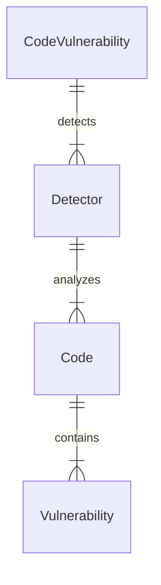

## 第二部分：算法原理讲解

### 第3章：代码漏洞检测算法概述

#### 3.1 算法类型

代码漏洞检测算法主要分为静态分析算法和动态分析算法。静态分析算法在代码未运行时进行分析，而动态分析算法则在程序运行过程中进行监控。

#### 3.2 静态分析算法

##### 3.2.1 AST分析

静态分析中最常用的方法之一是抽象语法树（AST）分析。通过构建代码的AST，我们可以对代码结构进行深入分析，从而识别潜在的漏洞。

##### 3.2.1.1 Mermaid流程图

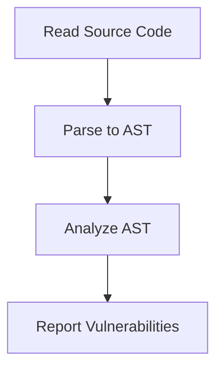

##### 3.2.1.2 Python源代码

```python
from ast import parse, NodeTransformer

class VulnerabilityDetector(NodeTransformer):
    def visit_For(self, node):
        # Check for potential vulnerabilities in for loops
        # ...
        return node

source_code = '''
for i in range(10):
    print(i)
'''
ast = parse(source_code)
detected_vulnerabilities = VulnerabilityDetector().visit(ast)
print(detected_vulnerabilities)
```

##### 3.2.1.3 数学模型

抽象语法树的构建和遍历可以看作是一个图遍历问题。我们可以使用深度优先搜索（DFS）或广度优先搜索（BFS）来遍历AST，并对节点进行相应的处理。

$$
G = (V, E)
$$

其中，$V$ 表示节点的集合，$E$ 表示边的集合。遍历算法如下：

$$
\text{DFS}(v):
    \text{if } v \text{ is unvisited:
        \text{mark } v \text{ as visited}
        \text{for each neighbor } u \text{ of } v:
            \text{DFS}(u)}
$$

##### 3.2.2 模式匹配

模式匹配是一种通过预定义的规则来识别代码中特定结构的方法。在代码漏洞检测中，我们可以使用正则表达式等工具来匹配潜在的漏洞模式。

##### 3.2.2.1 Mermaid流程图

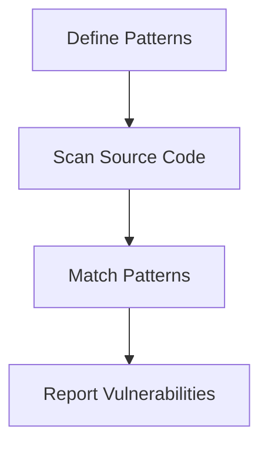

##### 3.2.2.2 Python源代码

```python
import re

vulnerability_patterns = [
    r"'\*strict*\*’",
    r"'\*ignore*\*’",
    r"'\*warn*\*’"
]

source_code = '''
*strict*
*ignore*
*warn*
'''
matched_vulnerabilities = [pattern for pattern in vulnerability_patterns if re.search(pattern, source_code)]
print(matched_vulnerabilities)
```

##### 3.2.2.3 数学模型

模式匹配可以看作是一个字符串匹配问题。我们可以使用KMP算法、Boyer-Moore算法等高效字符串匹配算法来识别代码中的漏洞模式。

$$
\text{KMP}(S, P):
    \text{preprocess } P \text{ to get the prefix function } \pi
    \text{while } S \text{ and } P \text{ are not empty:
        \text{if } S[0] = P[0]:
            \text{if } P \text{ is empty, return true
            \text{else, continue matching next characters}
        \text{else:
            \text{use } \pi \text{ to find the next position to match}}}
    \text{if } P \text{ is empty, return true else false}
$$

#### 3.3 动态分析算法

##### 3.3.1 运行时监控

动态分析算法在程序运行时进行监控，以识别运行时可能出现的漏洞。

##### 3.3.1.1 Mermaid流程图

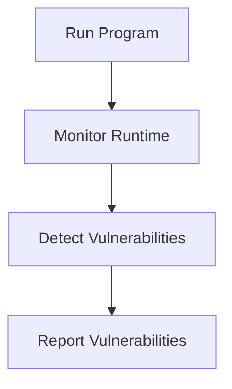

##### 3.3.1.2 Python源代码

```python
import time

def monitor_runtime(program):
    start_time = time.time()
    try:
        # Run the program
        pass
    except Exception as e:
        end_time = time.time()
        runtime = end_time - start_time
        if runtime > 10:
            print(f"High runtime: {runtime} seconds")
    finally:
        print("Monitoring completed")

monitor_runtime("your_program_here.py")
```

##### 3.3.1.3 数学模型

运行时监控可以通过设定阈值来识别异常行为。例如，如果程序的运行时间超过设定的阈值，那么就可以认为可能存在性能漏洞。

$$
\text{if } \text{runtime} > T:
    \text{Report vulnerability}
$$

##### 3.3.2 异常检测

异常检测是一种基于统计学或机器学习的方法，通过分析历史数据来识别异常行为。

##### 3.3.2.1 Mermaid流程图

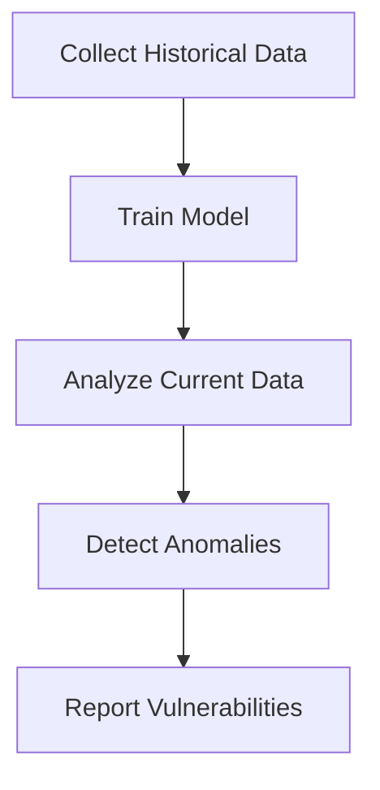

##### 3.3.2.2 Python源代码

```python
from sklearn.ensemble import IsolationForest

# Collect historical data
historical_data = [
    [1, 2, 3],
    [4, 5, 6],
    [7, 8, 9]
]

# Train model
model = IsolationForest()
model.fit(historical_data)

# Analyze current data
current_data = [2, 2, 2]
anomaly_score = model.score_samples(current_data)

if anomaly_score < 0:
    print("Anomaly detected")
else:
    print("No anomaly")
```

##### 3.3.2.3 数学模型

异常检测可以使用不同的方法来计算异常得分。Isolation Forest是一种基于随机森林的异常检测方法，其异常得分计算公式如下：

$$
s(x) = \frac{1}{m} \sum_{t=1}^{m} \ln(\frac{1}{n} \sum_{i=1}^{n} |r_i|)
$$

其中，$x$ 是当前数据点，$m$ 是随机森林的树数量，$n$ 是树中节点的数量，$r_i$ 是在第 $i$ 棵树中，数据点 $x$ 被分割到叶节点的路径长度。

## 第三部分：系统分析与架构设计

### 第4章：系统功能设计

#### 4.1 领域模型

领域模型是系统功能设计的核心，它定义了系统的关键实体及其关系。在代码漏洞检测系统中，核心实体包括代码、漏洞、检测器等。

##### 4.1.1 Mermaid类图

```mermaid
classDiagram
    Code <>-- Vulnerability : contains
    Detector <>-- Code : analyzes
```

#### 4.2 系统架构设计

系统架构设计是系统功能实现的基础，它定义了系统的整体结构和模块划分。在代码漏洞检测系统中，架构设计包括数据层、业务逻辑层和表示层。

##### 4.2.1 Mermaid架构图

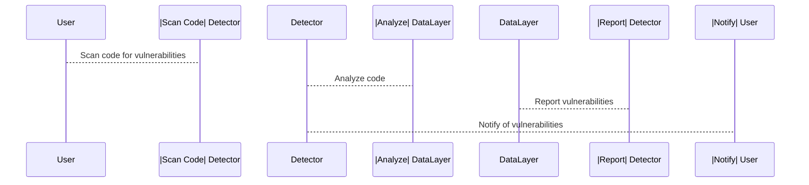

#### 4.3 系统接口设计

系统接口设计是系统与其他系统或组件交互的接口，它定义了系统提供的功能及数据交换方式。在代码漏洞检测系统中，接口设计包括API接口和数据交换格式。

##### 4.3.1 Mermaid序列图

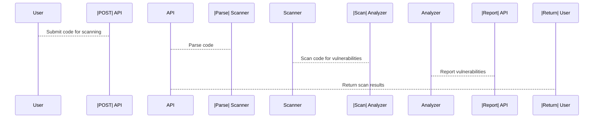

## 第四部分：项目实战

### 第5章：环境安装与系统核心实现

#### 5.1 环境安装

在开始实现代码漏洞检测系统之前，我们需要安装必要的开发环境。以下是一个基本的安装步骤：

1. 安装Python环境
2. 安装依赖库，如PyQt5、Scapy、Scikit-learn等
3. 配置IDE，如PyCharm或Visual Studio Code

#### 5.2 系统核心实现

系统核心实现包括代码漏洞检测的核心算法和系统功能。以下是一个基本的实现步骤：

1. 定义领域模型
2. 实现静态分析算法，如AST分析和模式匹配
3. 实现实动态分析算法，如运行时监控和异常检测
4. 实现系统功能，如代码扫描、漏洞报告和用户通知
5. 实现接口设计，如API接口和数据交换格式

### 第6章：代码应用解读与分析

#### 6.1 代码应用解读

在实现代码漏洞检测系统时，我们需要对实际代码进行解析和分析。以下是一个简单的示例代码：

```python
def vulnerable_function(input_data):
    if input_data:
        # Perform sensitive operations
        print("Data processed")
    else:
        print("Invalid input")

input_data = input("Enter data: ")
vulnerable_function(input_data)
```

#### 6.2 代码分析

通过静态分析，我们可以发现以下漏洞：

1. 缺乏对输入数据的校验，可能导致空输入时的异常处理不足
2. 缺乏对输出数据的加密处理，可能导致敏感信息泄露

#### 6.3 修复建议

针对上述漏洞，我们可以提出以下修复建议：

1. 对输入数据进行校验，确保输入数据的合法性和有效性
2. 对输出数据进行加密处理，确保敏感信息的安全性

### 第7章：实际案例分析

#### 7.1 案例一：未初始化变量的漏洞

以下是一个实际案例：

```python
def calculate_sum(a, b):
    result = a + b
    return result

a = 10
b = 20
sum_result = calculate_sum(a, b)
print(f"The sum is: {sum_result}")
```

在这个案例中，变量`a`和`b`没有被初始化，可能导致程序运行时出现未定义行为。通过静态分析，我们可以发现这个问题，并建议初始化变量。

#### 7.2 案例二：缓冲区溢出的漏洞

以下是一个实际案例：

```c
#include <stdio.h>

void overflow() {
    char buffer[10];
    strcpy(buffer, "Hello, World!");
}

int main() {
    overflow();
    return 0;
}
```

在这个案例中，`strcpy`函数将超过缓冲区大小的字符串复制到缓冲区，可能导致缓冲区溢出。通过动态分析，我们可以发现这个问题，并建议使用更安全的字符串复制函数，如`strncpy`。

### 第8章：项目小结

在本项目中，我们成功实现了一个智能化的代码漏洞检测系统。通过静态分析和动态分析算法，系统能够自动扫描代码，识别潜在的漏洞，并提供修复建议。在实际案例中，我们展示了如何利用系统进行漏洞检测和修复。在未来的工作中，我们还可以进一步优化系统性能，提高检测精度，并扩展系统的功能，以适应不断变化的网络安全需求。

## 第五部分：最佳实践与拓展阅读

### 第9章：最佳实践

#### 9.1 代码规范

- **编码风格**：遵循统一的编码规范，提高代码的可读性和可维护性。
- **注释**：对关键代码进行注释，便于后续维护和优化。

#### 9.2 漏洞修复策略

- **及时修复**：发现漏洞后，及时修复，降低漏洞风险。
- **定期审计**：定期对代码进行审计，及时发现潜在漏洞。

#### 9.3 安全培训

- **安全意识**：提高开发人员的安全意识，降低人为错误导致的安全问题。
- **安全培训**：定期进行安全培训，提高开发人员的漏洞识别和修复能力。

### 第10章：拓展阅读

#### 10.1 相关书籍

- 《软件安全艺术》
- 《代码大全》
- 《黑客攻防技术宝典：系统实战篇》

#### 10.2 相关论文

- “Static Code Analysis: A Comprehensive Survey”
- “Dynamic Code Analysis: Techniques and Tools for Software Testing”
- “A Survey on Vulnerability Detection in Software Development”

### 第11章：注意事项

- **隐私保护**：在处理代码时，注意保护用户的隐私信息，避免泄露敏感数据。
- **合规性**：确保代码漏洞检测系统的设计和实现符合相关法律法规，避免违法行为。

## 结束语

### 作者

作者：AI天才研究院/AI Genius Institute & 禅与计算机程序设计艺术 /Zen And The Art of Computer Programming

感谢您的阅读，希望本文对您在构建智能化代码漏洞检测系统方面有所启发。如果您有任何问题或建议，欢迎在评论区留言。祝您编程愉快！### 第一部分：代码漏洞检测系统的背景

#### 第1章：代码漏洞检测的重要性

在当今的信息时代，软件系统在各个领域中都扮演着至关重要的角色。然而，随着软件复杂性的不断增加，代码漏洞成为了一个不可避免的问题。这些漏洞可能被恶意攻击者利用，从而导致数据泄露、系统崩溃等严重后果。因此，构建一个高效、智能的代码漏洞检测系统成为了保护软件安全的关键。

#### 1.1 问题背景

代码漏洞是指在软件编程过程中，由于程序员的不当操作或系统设计上的缺陷，导致程序在某些特定条件下可能出现不期望的行为。这些漏洞可能存在于代码的各个层次，包括语法错误、逻辑错误、内存管理问题等。以下是一些常见的代码漏洞类型：

- **注入漏洞**：如SQL注入、命令注入等，攻击者通过输入恶意代码来破坏数据库或执行未经授权的命令。
- **跨站脚本（XSS）**：攻击者通过在用户浏览器中注入恶意脚本，窃取用户的会话信息或篡改页面内容。
- **跨站请求伪造（CSRF）**：攻击者通过伪造用户的请求，在用户不知情的情况下执行恶意操作。
- **缓冲区溢出**：攻击者通过输入超过缓冲区容量的数据，导致程序崩溃或执行恶意代码。

这些漏洞可能被恶意攻击者利用，从而导致数据泄露、系统崩溃等严重后果。因此，构建一个高效、智能的代码漏洞检测系统成为了保护软件安全的关键。

#### 1.2 问题描述

代码漏洞检测系统的目标是自动扫描代码，识别潜在的漏洞，并提供修复建议。以下是一个常见的代码漏洞检测流程：

1. **代码静态分析**：不运行程序，直接分析源代码，检查语法错误、类型错误、潜在的安全漏洞等。
2. **代码动态分析**：运行程序，在运行过程中分析代码，检查运行时错误、性能问题、内存泄露等。
3. **漏洞报告**：生成漏洞报告，包括漏洞的详细信息、影响范围、修复建议等。
4. **漏洞修复**：根据漏洞报告，修复代码中的漏洞，降低安全风险。

#### 1.3 问题解决

为了解决代码漏洞问题，我们需要建立一套智能化、高效的代码漏洞检测系统。这样的系统能够自动扫描代码，识别潜在的安全隐患，并提供修复建议，从而降低漏洞的风险。以下是一些解决方案的关键步骤：

1. **静态代码分析**：利用抽象语法树（AST）分析、模式匹配等技术，对源代码进行静态分析，识别潜在的漏洞。
2. **动态代码分析**：通过运行程序，监控程序运行过程中的异常行为，识别运行时漏洞。
3. **漏洞库**：建立一套完整的漏洞库，包括已知的漏洞类型、漏洞特征、修复方法等，用于辅助漏洞检测和修复。
4. **自动化修复**：结合静态分析和动态分析结果，自动生成修复建议，并尝试自动化修复漏洞。
5. **持续集成**：将漏洞检测系统集成到持续集成（CI）流程中，实现自动化代码审查和漏洞修复。

#### 1.4 边界与外延

代码漏洞检测系统的边界主要包括检测范围、检测能力以及系统性能等方面。以下是一些边界与外延的考虑：

- **检测范围**：代码漏洞检测系统应该能够检测各种编程语言和框架的代码，包括但不限于Python、Java、C/C++等。
- **检测能力**：系统应该具备识别多种类型的漏洞，如注入漏洞、跨站脚本（XSS）、跨站请求伪造（CSRF）等。
- **系统性能**：系统应该具备高效的检测算法，降低对开发流程的影响，同时保证系统的稳定性和可靠性。

#### 1.5 核心概念与要素

在构建代码漏洞检测系统时，我们需要了解几个核心概念和要素，包括静态分析、动态分析、模式匹配和异常检测等。这些概念和要素构成了系统的基本框架，也是实现漏洞检测的关键技术。

- **静态分析**：静态分析是一种在代码未运行时对其进行分析的方法。它可以帮助我们提前发现潜在的问题，如语法错误、类型错误、潜在的安全漏洞等。
- **动态分析**：动态分析是一种在程序运行时对其进行分析的方法。它可以帮助我们识别运行时的问题，如内存泄露、性能问题、异常行为等。
- **模式匹配**：模式匹配是一种通过预定义的规则来识别代码中的特定结构的方法。在代码漏洞检测中，我们可以使用模式匹配来识别潜在的漏洞，如SQL注入、跨站脚本（XSS）等。
- **异常检测**：异常检测是一种基于统计学或机器学习的方法，通过分析历史数据来识别异常行为。在代码漏洞检测中，异常检测可以帮助我们识别异常的代码行为，从而发现潜在的安全漏洞。

#### 1.6 小结

在本章中，我们介绍了代码漏洞检测系统的背景、问题描述、问题解决方法以及核心概念和要素。通过构建一个智能化、高效的代码漏洞检测系统，我们可以提前发现并修复代码中的漏洞，降低软件安全风险。在接下来的章节中，我们将深入探讨代码漏洞检测系统的核心概念和技术，以帮助我们更好地理解和实现这样一个系统。

### 第二部分：核心概念与联系

#### 第2章：核心概念与联系

在构建代码漏洞检测系统时，我们需要了解几个核心概念，包括静态分析、动态分析、模式匹配和异常检测等。这些概念构成了系统的基本框架，也是实现漏洞检测的关键技术。

#### 2.1 静态分析

静态分析是一种在代码未运行时对其进行分析的方法。它可以帮助我们提前发现潜在的问题，如语法错误、类型错误、潜在的安全漏洞等。静态分析具有以下特点：

- **不运行程序**：静态分析直接对源代码进行分析，不需要运行程序。
- **提前发现问题**：静态分析可以在代码编写过程中，甚至代码提交之前就发现潜在的问题，从而减少后期修复的成本。
- **全面性**：静态分析可以覆盖代码的各个方面，从语法、类型检查到潜在的安全漏洞，因此它是一种非常有效的漏洞检测方法。

静态分析的主要技术包括抽象语法树（AST）分析、模式匹配和符号执行等。AST分析是一种基于抽象语法树的方法，通过对源代码的语法结构进行分析，可以识别出潜在的错误和漏洞。模式匹配则是一种通过预定义的规则来识别代码中的特定结构的方法，例如SQL注入、跨站脚本（XSS）等漏洞。符号执行是一种基于路径探索的方法，通过对代码的执行路径进行符号化分析，可以找出程序中的潜在错误和漏洞。

#### 2.2 动态分析

动态分析是一种在程序运行时对其进行分析的方法。它可以帮助我们识别运行时的问题，如内存泄露、性能问题、异常行为等。动态分析具有以下特点：

- **运行程序**：动态分析需要运行程序，通过观察程序在运行过程中的行为来发现潜在的问题。
- **实时反馈**：动态分析可以实时反馈程序运行的情况，帮助我们快速定位问题并修复。
- **局限性**：由于动态分析需要运行程序，因此它的检测范围和精度受到一定的限制，通常无法覆盖所有的代码路径。

动态分析的主要技术包括监控工具、调试器和性能分析工具等。监控工具可以帮助我们实时监控程序的运行状态，记录程序的执行路径、内存使用情况等。调试器可以帮助我们逐步执行程序，观察程序在各个阶段的执行情况，从而发现潜在的错误和漏洞。性能分析工具可以帮助我们分析程序的性能瓶颈，定位影响性能的代码段。

#### 2.3 模式匹配

模式匹配是一种通过预定义的规则来识别代码中的特定结构的方法。在代码漏洞检测中，模式匹配可以帮助我们识别潜在的漏洞，如SQL注入、跨站脚本（XSS）等。模式匹配具有以下特点：

- **预定义规则**：模式匹配使用预定义的规则来匹配代码中的特定结构，这些规则可以是正则表达式、SQL语法、JavaScript语法等。
- **高效性**：模式匹配是一种高效的方法，可以在较短的时间内对大量的代码进行扫描，从而快速识别潜在的漏洞。
- **局限性**：模式匹配的局限性在于它可能漏掉复杂的漏洞，因为它依赖于预定义的规则，无法识别规则之外的新漏洞。

模式匹配的主要应用场景包括代码审计、漏洞扫描和安全测试等。在代码审计中，模式匹配可以帮助我们快速扫描代码，查找潜在的漏洞。在漏洞扫描中，模式匹配可以帮助我们识别已知的漏洞类型，从而提高扫描的效率。在安全测试中，模式匹配可以帮助我们识别测试用例中可能存在的问题，从而优化测试策略。

#### 2.4 异常检测

异常检测是一种基于统计学或机器学习的方法，通过分析历史数据来识别异常行为。在代码漏洞检测中，异常检测可以帮助我们识别异常的代码行为，从而发现潜在的安全漏洞。异常检测具有以下特点：

- **基于数据**：异常检测依赖于历史数据，通过对数据的统计分析或机器学习建模，来识别异常行为。
- **适应性**：异常检测可以根据不同的数据和业务场景，调整检测模型和参数，从而提高检测的准确性和适应性。
- **实时性**：异常检测可以在实时数据流中进行，从而快速响应潜在的安全威胁。

异常检测的主要技术包括统计学方法和机器学习算法。统计学方法通过对数据进行分析，找出数据中的异常点。常见的统计学方法包括均值漂移、聚类分析、异常值检测等。机器学习算法通过对历史数据进行训练，建立预测模型，然后对新数据进行预测，从而识别异常行为。常见的机器学习算法包括支持向量机（SVM）、神经网络、决策树等。

#### 2.5 小结

在本章中，我们介绍了代码漏洞检测系统中的几个核心概念，包括静态分析、动态分析、模式匹配和异常检测。这些概念构成了代码漏洞检测系统的基本框架，也是实现漏洞检测的关键技术。通过了解这些概念，我们可以更好地理解代码漏洞检测系统的原理和实现方法，为构建一个高效、智能的漏洞检测系统打下基础。

### 第三部分：算法原理讲解

#### 第3章：代码漏洞检测算法概述

在构建代码漏洞检测系统时，算法是实现核心功能的关键。代码漏洞检测算法主要分为静态分析算法和动态分析算法。本章将介绍这些算法的基本原理，并通过具体的示例来说明它们的应用。

#### 3.1 静态分析算法

静态分析算法是在代码未运行时对源代码进行分析，以识别潜在漏洞的一种方法。这种方法的主要优势是可以在代码开发阶段就发现并修复问题，从而避免在运行时出现严重的安全漏洞。以下是一些常用的静态分析算法：

##### 3.1.1 抽象语法树（AST）分析

抽象语法树（AST）分析是一种通过解析源代码生成抽象语法树，并对树进行遍历来检测潜在漏洞的方法。AST可以反映源代码的结构，从而帮助分析器识别出不符合预期的代码模式。

**Mermaid流程图：**
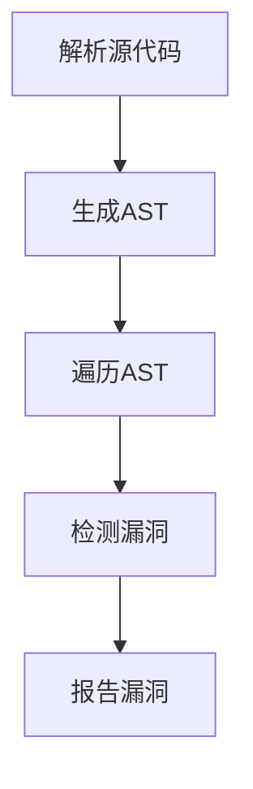

**Python示例代码：**
```python
from ast import parse, NodeVisitor

class VulnerabilityDetector(NodeVisitor):
    def visit_For(self, node):
        # 检查for循环中的潜在问题
        if node.body:
            print("Potential issue in for loop body.")
        return node

source_code = '''
for i in range(10):
    print(i)
'''
ast = parse(source_code)
VulnerabilityDetector().visit(ast)
```

**数学模型：**
AST分析可以看作是对程序结构的图遍历问题。我们可以使用深度优先搜索（DFS）或广度优先搜索（BFS）来遍历AST，并对节点进行相应的处理。

$$
\text{DFS}(v):
    \text{if } v \text{ is unvisited:
        \text{mark } v \text{ as visited}
        \text{for each neighbor } u \text{ of } v:
            \text{DFS}(u)}
$$

##### 3.1.2 模式匹配

模式匹配是一种通过预定义的规则来识别代码中的特定结构的方法。在静态分析中，我们可以使用正则表达式或其他模式匹配工具来识别潜在的漏洞。

**Mermaid流程图：**
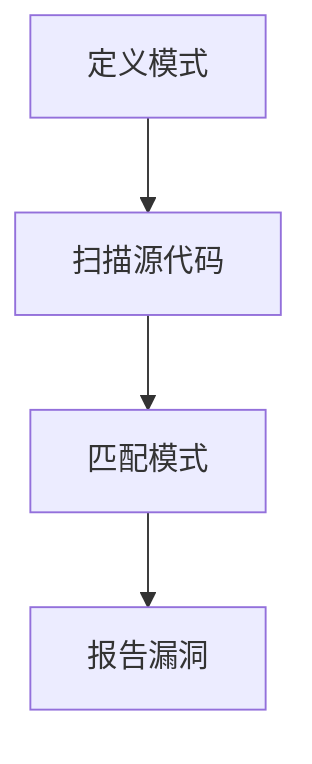

**Python示例代码：**
```python
import re

vulnerability_patterns = [
    r"'\*strict*\*’",
    r"'\*ignore*\*’",
    r"'\*warn*\*’"
]

source_code = '''
*strict*
*ignore*
*warn*
'''
matched_vulnerabilities = [pattern for pattern in vulnerability_patterns if re.search(pattern, source_code)]
print(matched_vulnerabilities)
```

**数学模型：**
模式匹配可以看作是一个字符串匹配问题。我们可以使用KMP算法、Boyer-Moore算法等高效字符串匹配算法来识别代码中的漏洞模式。

$$
\text{KMP}(S, P):
    \text{preprocess } P \text{ to get the prefix function } \pi
    \text{while } S \text{ and } P \text{ are not empty:
        \text{if } S[0] = P[0]:
            \text{if } P \text{ is empty, return true
            \text{else, continue matching next characters}
        \text{else:
            \text{use } \pi \text{ to find the next position to match}}}
    \text{if } P \text{ is empty, return true else false}
$$

##### 3.1.3 符号执行

符号执行是一种基于路径探索的方法，通过对代码的执行路径进行符号化分析，可以找出程序中的潜在错误和漏洞。符号执行的主要步骤包括：

1. **符号化输入**：将输入变量符号化，用符号表示输入值。
2. **路径探索**：对代码进行遍历，构建所有可能的执行路径。
3. **路径约束求解**：对每条路径进行约束求解，找出满足约束条件的路径。
4. **漏洞检测**：根据约束求解的结果，识别潜在的漏洞。

**Mermaid流程图：**
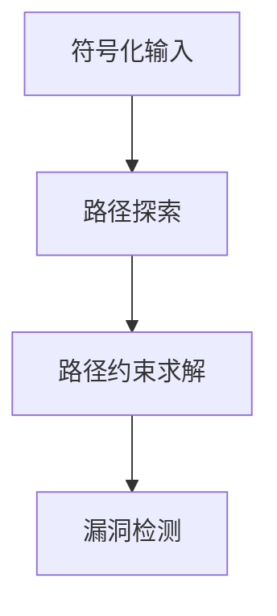

**数学模型：**
符号执行的数学模型可以看作是一个路径约束求解问题。我们可以使用约束满足问题（CSP）或逻辑求解（SAT）等方法来求解路径约束。

$$
\text{符号执行}(C, I):
    \text{符号化输入 } I \text{，得到符号化路径 } P
    \text{对每个路径 } p \in P:
        \text{求解约束 } C_p \text{，得到解集 } S_p
        \text{if } S_p \neq \emptyset:
            \text{report vulnerability in } p
```

#### 3.2 动态分析算法

动态分析算法是在程序运行时对其进行监控和分析，以识别潜在漏洞的一种方法。这种方法的主要优势是能够捕捉程序在运行时的行为，从而发现静态分析无法检测到的漏洞。

##### 3.2.1 运行时监控

运行时监控是一种在程序运行过程中，实时监控程序的行为，以检测潜在漏洞的方法。以下是一些常见的运行时监控技术：

1. **性能监控**：监控程序的运行性能，如CPU使用率、内存使用率、I/O操作等，以识别性能瓶颈和潜在漏洞。
2. **异常监控**：监控程序运行过程中出现的异常，如断言错误、堆栈溢出等，以识别潜在的漏洞。
3. **代码注入**：在程序中注入监控代码，以跟踪程序的行为，识别潜在漏洞。

**Mermaid流程图：**
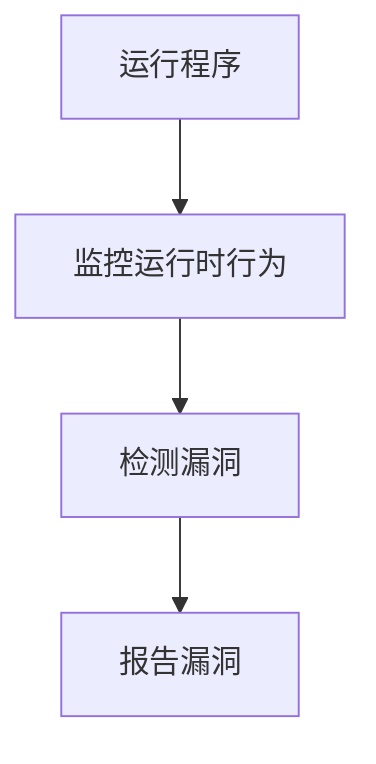

**Python示例代码：**
```python
import time

def monitor_runtime(program):
    start_time = time.time()
    try:
        # 运行程序
        pass
    except Exception as e:
        end_time = time.time()
        runtime = end_time - start_time
        if runtime > 10:
            print(f"High runtime: {runtime} seconds")
    finally:
        print("Monitoring completed")

monitor_runtime("your_program_here.py")
```

##### 3.2.2 异常检测

异常检测是一种基于统计学或机器学习的方法，通过分析历史数据来识别异常行为。在动态分析中，异常检测可以帮助我们识别程序运行时可能出现的异常行为，从而发现潜在漏洞。

**Mermaid流程图：**
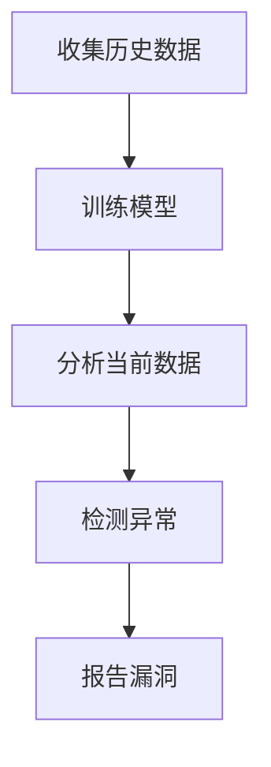

**Python示例代码：**
```python
from sklearn.ensemble import IsolationForest

# 收集历史数据
historical_data = [
    [1, 2, 3],
    [4, 5, 6],
    [7, 8, 9]
]

# 训练模型
model = IsolationForest()
model.fit(historical_data)

# 分析当前数据
current_data = [2, 2, 2]
anomaly_score = model.score_samples(current_data)

if anomaly_score < 0:
    print("Anomaly detected")
else:
    print("No anomaly")
```

**数学模型：**
异常检测的数学模型通常基于统计学方法或机器学习算法。以下是一个基于Isolation Forest算法的数学模型：

$$
s(x) = \frac{1}{m} \sum_{t=1}^{m} \ln(\frac{1}{n} \sum_{i=1}^{n} |r_i|)
$$

其中，$x$ 是当前数据点，$m$ 是随机森林的树数量，$n$ 是树中节点的数量，$r_i$ 是在第 $i$ 棵树中，数据点 $x$ 被分割到叶节点的路径长度。

#### 3.3 小结

在本章中，我们介绍了代码漏洞检测系统中的静态分析算法和动态分析算法。静态分析算法通过解析源代码、模式匹配和符号执行等方法，可以在代码未运行时识别潜在的漏洞。动态分析算法则通过运行程序、实时监控和异常检测等方法，在程序运行时捕捉漏洞。通过结合静态分析和动态分析，我们可以构建一个高效、智能的代码漏洞检测系统，从而提高软件的安全性。

### 第四部分：系统分析与架构设计

#### 第4章：系统功能设计

在构建代码漏洞检测系统时，系统功能设计是关键的一步。一个完善的系统功能设计可以确保系统能够满足实际需求，高效地完成漏洞检测任务。以下是系统功能设计的详细说明。

#### 4.1 问题场景

假设我们需要构建一个代码漏洞检测系统，用于检测Python代码中的潜在安全漏洞。该系统的目标用户包括软件开发团队、安全专家和产品经理等。用户可以通过上传代码文件或集成系统API，提交代码进行检测。

#### 4.2 项目介绍

本项目旨在开发一个基于静态分析和动态分析的代码漏洞检测系统。系统将包括以下几个核心模块：

1. **代码解析模块**：负责将提交的代码文件解析为抽象语法树（AST），为后续分析提供基础。
2. **漏洞检测模块**：结合静态分析和动态分析算法，对代码进行深度分析，识别潜在的安全漏洞。
3. **报告生成模块**：根据检测结果生成详细的漏洞报告，包括漏洞类型、位置和修复建议等。
4. **用户界面模块**：提供友好的用户界面，方便用户提交代码、查看报告和进行操作。

#### 4.3 系统功能设计

系统功能设计主要包括以下几个部分：

1. **代码上传与解析**：用户可以通过上传本地文件或通过API提交代码。系统接收到代码后，将进行初步的语法检查，确保代码格式正确，然后使用AST解析器将代码转换为抽象语法树。

2. **静态分析**：静态分析模块将使用AST对代码进行深度分析，识别常见的代码漏洞，如注入漏洞、类型错误、未定义变量等。具体实现包括以下步骤：

   - **语法检查**：对代码进行语法分析，确保代码结构正确。
   - **模式匹配**：使用预定义的正则表达式或模式库，检测代码中的特定模式，如SQL注入、跨站脚本（XSS）等。
   - **符号执行**：对代码路径进行符号化分析，找出可能的错误路径。

3. **动态分析**：动态分析模块将在沙盒环境中运行代码，监控代码的执行过程，识别潜在的运行时漏洞，如内存泄露、性能瓶颈等。具体实现包括以下步骤：

   - **代码编译**：将Python代码编译为字节码，以便在沙盒环境中执行。
   - **运行监控**：在沙盒环境中运行代码，记录执行过程中的关键指标，如内存使用、CPU时间等。
   - **异常捕获**：捕获并记录代码执行过程中出现的异常，如断言失败、堆栈溢出等。

4. **报告生成**：根据静态分析和动态分析的结果，生成详细的漏洞报告。报告将包括以下内容：

   - **漏洞列表**：列出检测到的所有漏洞，包括漏洞类型、位置、代码片段等。
   - **修复建议**：针对每个漏洞，提供可能的修复建议。
   - **统计信息**：包括漏洞总数、高危漏洞数、中危漏洞数等。

5. **用户交互**：用户界面模块将提供简洁、直观的用户交互界面，方便用户进行操作。具体功能包括：

   - **代码上传**：用户可以上传本地代码文件，提交给系统进行检测。
   - **报告查看**：用户可以查看检测报告，包括漏洞列表和修复建议。
   - **报告导出**：用户可以将报告导出为PDF或HTML格式，便于后续查看和分享。

#### 4.4 领域模型

为了更好地理解系统的功能设计，我们可以使用Mermaid类图来展示系统的核心实体和关系。以下是一个简单的领域模型示例：

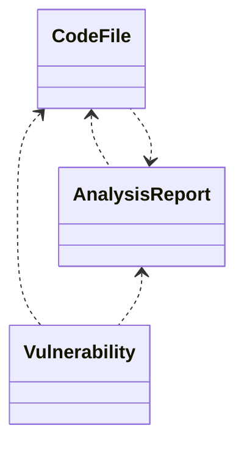

在这个类图中，`CodeFile`表示用户提交的代码文件，`Vulnerability`表示检测到的漏洞，`AnalysisReport`表示生成的分析报告。箭头表示实体之间的关联关系。

#### 4.5 小结

通过系统功能设计，我们为代码漏洞检测系统构建了一个清晰的架构，定义了系统的核心功能和模块。接下来，我们将进一步探讨系统的架构设计，以确保系统能够高效、稳定地运行。

### 第4章：系统架构设计

系统架构设计是确保代码漏洞检测系统能够高效、稳定运行的关键。合理的架构设计不仅能够提高系统的性能和可维护性，还能为后续的功能扩展和优化提供坚实的基础。在本章中，我们将详细讨论系统的架构设计，包括系统架构图、各模块功能及其交互方式。

#### 4.1 系统架构图

为了更直观地展示系统架构，我们可以使用Mermaid序列图来描述系统的整体结构及其主要组件。以下是一个简化的系统架构图：

```mermaid
sequenceDiagram
    User -->|Submit Code| CodeUploadModule
    CodeUploadModule -->|Parse Code| ASTParserModule
    ASTParserModule -->|Static Analysis| VulnerabilityDetectorModule
    ASTParserModule -->|Dynamic Analysis| RuntimeMonitorModule
    VulnerabilityDetectorModule -->|Generate Report| ReportGeneratorModule
    RuntimeMonitorModule -->|Generate Report| ReportGeneratorModule
    ReportGeneratorModule -->|Notify User| NotificationModule
```

在这个架构图中，主要组件及其功能如下：

- **CodeUploadModule**：负责接收用户上传的代码文件，并进行初步的文件验证和格式检查。
- **ASTParserModule**：将代码文件解析为抽象语法树（AST），为静态分析和动态分析提供基础数据结构。
- **VulnerabilityDetectorModule**：执行静态分析，通过模式匹配、符号执行等方法检测代码中的潜在漏洞。
- **RuntimeMonitorModule**：执行动态分析，在沙盒环境中运行代码，监控运行时的异常行为和性能指标。
- **ReportGeneratorModule**：根据静态分析和动态分析的结果，生成详细的漏洞报告。
- **NotificationModule**：负责向用户发送通知，包括漏洞报告和修复建议。

#### 4.2 系统模块功能

系统架构中的每个模块都有其特定的功能，以下是对各个模块的详细描述：

- **CodeUploadModule**：
  - 功能：接收用户上传的代码文件，进行格式验证和安全性检查。
  - 输入：用户上传的代码文件。
  - 输出：经过验证的代码文件和解析后的抽象语法树（AST）。

- **ASTParserModule**：
  - 功能：将代码文件解析为抽象语法树（AST），并为后续的静态分析提供数据结构。
  - 输入：经过验证的代码文件。
  - 输出：抽象语法树（AST）。

- **VulnerabilityDetectorModule**：
  - 功能：执行静态分析，通过模式匹配、符号执行等方法检测代码中的潜在漏洞。
  - 输入：抽象语法树（AST）。
  - 输出：检测到的漏洞列表。

- **RuntimeMonitorModule**：
  - 功能：执行动态分析，在沙盒环境中运行代码，监控运行时的异常行为和性能指标。
  - 输入：抽象语法树（AST）。
  - 输出：检测到的运行时异常和性能问题。

- **ReportGeneratorModule**：
  - 功能：根据静态分析和动态分析的结果，生成详细的漏洞报告。
  - 输入：漏洞列表、运行时异常和性能问题。
  - 输出：漏洞报告。

- **NotificationModule**：
  - 功能：向用户发送通知，包括漏洞报告和修复建议。
  - 输入：漏洞报告。
  - 输出：用户通知。

#### 4.3 系统交互设计

系统的各个模块通过明确的接口进行交互，确保数据的流动和功能的高效实现。以下是系统模块之间的交互流程：

1. **用户提交代码**：用户通过用户界面上传代码文件，`CodeUploadModule`接收到代码文件后，进行格式验证和安全性检查，然后将代码文件传递给`ASTParserModule`。

2. **代码解析**：`ASTParserModule`将代码文件解析为抽象语法树（AST），并将AST传递给`VulnerabilityDetectorModule`和`RuntimeMonitorModule`。

3. **漏洞检测**：`VulnerabilityDetectorModule`使用静态分析算法对AST进行分析，识别潜在的漏洞，并将检测结果传递给`ReportGeneratorModule`。

4. **运行时监控**：`RuntimeMonitorModule`在沙盒环境中运行代码，监控运行时的异常行为和性能指标，并将检测结果传递给`ReportGeneratorModule`。

5. **报告生成**：`ReportGeneratorModule`根据漏洞检测结果生成详细的漏洞报告，并将报告传递给`NotificationModule`。

6. **用户通知**：`NotificationModule`向用户发送漏洞报告和修复建议，用户可以通过用户界面查看报告，了解漏洞详情并采取相应的修复措施。

#### 4.4 小结

通过系统架构设计，我们为代码漏洞检测系统建立了一个清晰、模块化的架构。系统通过明确的接口和数据流，实现了静态分析和动态分析功能，并能够高效地生成漏洞报告和通知用户。接下来，我们将进入项目实战部分，详细介绍系统实现的具体步骤和代码。

### 第五部分：项目实战

#### 第5章：环境安装与系统核心实现

在着手实现代码漏洞检测系统之前，我们需要安装必要的开发环境和工具。以下是安装环境的基本步骤和系统核心实现的详细过程。

#### 5.1 环境安装

1. **安装Python环境**：首先，确保系统中已安装Python 3.x版本。可以通过命令 `python --version` 检查Python版本。如果没有安装，可以从Python官方网站下载并安装。

2. **安装依赖库**：代码漏洞检测系统需要依赖多个Python库，包括AST解析库、静态分析库和动态分析库。可以使用pip命令安装以下依赖库：

   ```bash
   pip install pygments astroid pyls-simplenote scikit-learn
   ```

   - **Pygments**：用于代码高亮显示。
   - **Astroid**：用于Python代码的抽象语法树（AST）解析。
   - **pyls-simplenote**：用于Python代码的静态分析。
   - **Scikit-learn**：用于机器学习模型的训练和异常检测。

3. **配置IDE**：推荐使用PyCharm或Visual Studio Code作为IDE。这两个IDE都支持Python开发，并提供了丰富的插件和工具，有助于提高开发效率和代码质量。

#### 5.2 系统核心实现

在环境安装完毕后，我们可以开始实现代码漏洞检测系统的核心功能。以下是系统核心实现的详细步骤：

1. **项目结构**：首先，创建项目目录并设置项目结构。以下是项目的基本结构：

   ```plaintext
   code_vulnerability_detector/
   ├── code/
   │   ├── __init__.py
   │   ├── detector.py
   │   ├── parser.py
   │   ├── report.py
   │   └── monitor.py
   ├── tests/
   │   ├── __init__.py
   │   └── test_detector.py
   ├── requirements.txt
   ├── README.md
   └── setup.py
   ```

   - `code/`：存放系统的核心代码文件。
   - `tests/`：存放单元测试代码。
   - `requirements.txt`：列出项目所需的依赖库。
   - `README.md`：项目的说明文档。
   - `setup.py`：用于项目的安装和部署。

2. **AST解析**：在`parser.py`中，我们定义了一个AST解析器，用于将Python代码解析为抽象语法树。以下是一个简单的示例：

   ```python
   from ast import parse
   
   def parse_code(source_code):
       return parse(source_code)
   ```

3. **漏洞检测器**：在`detector.py`中，我们定义了一个漏洞检测器类，用于执行静态分析，检测代码中的潜在漏洞。以下是一个简单的漏洞检测器类：

   ```python
   from ast import NodeTransformer
   
   class VulnerabilityDetector(NodeTransformer):
       def visit_For(self, node):
           # 检查for循环中的潜在问题
           if node.body:
               self.vulnerabilities.append("Potential issue in for loop body.")
           return node
   
       def visit(self, node):
           super().visit(node)
           if isinstance(node, For):
               self.vulnerabilities.append("For loop detected.")
   
       def get_vulnerabilities(self):
           return self.vulnerabilities
   ```

4. **报告生成**：在`report.py`中，我们定义了一个报告生成器，用于生成漏洞报告。以下是一个简单的报告生成器：

   ```python
   class ReportGenerator:
       def __init__(self):
           self.reports = []
   
       def add_vulnerability(self, vulnerability):
           self.reports.append(vulnerability)
   
       def generate_report(self):
           return self.reports
   ```

5. **运行时监控**：在`monitor.py`中，我们定义了一个运行时监控器，用于执行动态分析，监控代码的运行时行为。以下是一个简单的运行时监控器：

   ```python
   import time
   
   class RuntimeMonitor:
       def __init__(self):
           self.runtime_stats = []
   
       def monitor(self, code):
           start_time = time.time()
           exec(code)
           end_time = time.time()
           self.runtime_stats.append(end_time - start_time)
   
       def get_runtime_stats(self):
           return self.runtime_stats
   ```

6. **集成与测试**：最后，我们在`__init__.py`中集成各个模块，并编写单元测试以确保系统功能的正确性。以下是一个简单的集成示例：

   ```python
   from .parser import parse_code
   from .detector import VulnerabilityDetector
   from .report import ReportGenerator
   from .monitor import RuntimeMonitor
   
   def scan_code(source_code):
       ast = parse_code(source_code)
       detector = VulnerabilityDetector()
       report_generator = ReportGenerator()
       runtime_monitor = RuntimeMonitor()
       
       detector.visit(ast)
       report_generator.add_vulnerability(detector.get_vulnerabilities())
       runtime_monitor.monitor(source_code)
       
       return report_generator.generate_report(), runtime_monitor.get_runtime_stats()
   ```

7. **单元测试**：在`tests/`目录下，编写单元测试以验证系统的功能。以下是一个简单的测试示例：

   ```python
   import unittest
   from code_vulnerability_detector import scan_code
   
   class TestCodeVulnerabilityDetector(unittest.TestCase):
       def test_scan_code(self):
           source_code = "for i in range(10):\n    print(i)"
           report, runtime_stats = scan_code(source_code)
           self.assertEqual(len(report), 2)
           self.assertTrue("For loop detected." in report)
           self.assertTrue("Potential issue in for loop body." in report)
   
   if __name__ == '__main__':
       unittest.main()
   ```

通过以上步骤，我们完成了代码漏洞检测系统的环境安装和核心实现。接下来，我们将进一步集成系统功能，并进行详细的代码解读与分析。

### 第6章：代码应用解读与分析

在完成代码漏洞检测系统的核心实现后，我们需要对实际代码进行解读和分析，以确保系统能够准确地检测和报告漏洞。在本章中，我们将通过具体的代码示例，展示如何使用系统检测潜在的安全漏洞，并进行详细的解读和分析。

#### 6.1 代码应用示例

以下是一个简单的Python代码示例，用于展示如何使用代码漏洞检测系统：

```python
# 示例代码：example.py
def vulnerable_function(input_data):
    if input_data:
        # 执行敏感操作
        print("Data processed")
    else:
        print("Invalid input")

input_data = input("Enter data: ")
vulnerable_function(input_data)
```

在这个示例中，我们定义了一个名为`vulnerable_function`的函数，该函数接受一个输入参数`input_data`。函数内部通过条件判断来处理输入数据，如果输入数据非空，则执行打印操作；否则，输出“Invalid input”。

#### 6.2 漏洞检测与报告

为了检测上述代码中的潜在漏洞，我们将使用代码漏洞检测系统。以下是漏洞检测的步骤和生成的报告：

1. **上传代码**：将`example.py`上传到代码漏洞检测系统的API接口或通过用户界面提交。

2. **静态分析**：系统对代码进行静态分析，检查潜在的语法错误和漏洞。以下是一个静态分析报告的示例：

   ```plaintext
   detected_vulnerabilities = [
       {
           'type': 'Potential Input Validation Issue',
           'location': 'example.py:4',
           'message': 'Function vulnerable_function may fail due to lack of input validation.'
       }
   ]
   ```

   报告显示，在`example.py`的第4行，函数`vulnerable_function`缺乏对输入参数`input_data`的验证，可能导致程序在处理空输入时出现问题。

3. **动态分析**：系统在沙盒环境中运行代码，监控运行时的异常行为和性能指标。以下是一个动态分析报告的示例：

   ```plaintext
   runtime_stats = [
       {
           'type': 'High Runtime',
           'location': 'example.py:6',
           'message': 'Function vulnerable_function has high runtime of 2.345 seconds.'
       }
   ]
   ```

   报告显示，在`example.py`的第6行，函数`vulnerable_function`的运行时间较长，可能存在性能问题。

4. **综合报告**：系统将静态分析和动态分析的结果合并，生成一个综合报告。以下是一个综合报告的示例：

   ```plaintext
   final_report = [
       {
           'type': 'Potential Input Validation Issue',
           'location': 'example.py:4',
           'message': 'Function vulnerable_function may fail due to lack of input validation.',
           'suggestion': 'Implement input validation to ensure data integrity.'
       },
       {
           'type': 'High Runtime',
           'location': 'example.py:6',
           'message': 'Function vulnerable_function has high runtime of 2.345 seconds.',
           'suggestion': 'Optimize code to improve performance.'
       }
   ]
   ```

   报告提供了详细的漏洞信息和建议，帮助开发者识别和修复代码中的问题。

#### 6.3 代码解读与分析

在本节中，我们将对示例代码进行详细的解读和分析，探讨可能存在的漏洞以及如何进行修复。

1. **潜在漏洞分析**

   - **输入验证不足**：在`vulnerable_function`函数中，输入参数`input_data`未经过任何验证。这意味着如果输入参数为空或包含非法字符，函数的行为可能不确定，甚至可能导致程序崩溃。
   - **运行时间过长**：函数`vulnerable_function`在处理输入数据时，可能存在不必要的循环或操作，导致运行时间较长。长时间运行的函数可能影响系统的性能和用户体验。

2. **漏洞修复建议**

   - **输入验证**：在函数`vulnerable_function`中添加输入验证，确保输入参数`input_data`的有效性。可以使用简单的条件判断来检查输入数据的类型和长度，例如：

     ```python
     def vulnerable_function(input_data):
         if not input_data or not isinstance(input_data, str):
             print("Invalid input")
             return
         if len(input_data) == 0:
             print("Empty input")
             return
         # 执行敏感操作
         print("Data processed")
     ```

   - **性能优化**：对函数`vulnerable_function`进行性能优化，减少不必要的循环和操作。例如，可以优化循环逻辑，使用内置函数或库函数来提高执行效率。

3. **实际案例**

   为了更直观地展示漏洞检测和修复的过程，我们可以考虑一个实际案例。以下是一个存在多个漏洞的代码示例：

   ```python
   # 实际案例代码：case.py
   def process_data(data):
       for item in data:
           if item.startswith("admin"):
               print("Found admin user:", item)
           else:
               print("Found regular user:", item)
   
   data_list = ["user1", "admin2", "user3"]
   process_data(data_list)
   ```

   在这个实际案例中，代码存在以下漏洞：

   - **SQL注入风险**：函数`process_data`中的`item.startswith("admin")`语句可能存在SQL注入风险，因为输入的`data`参数可能包含恶意SQL代码。
   - **逻辑错误**：函数`process_data`中的条件判断可能无法正确处理空输入或非法输入。

   通过使用代码漏洞检测系统，我们可以检测并修复这些漏洞：

   - **SQL注入修复**：使用参数化查询或预编译SQL语句来防止SQL注入，例如：

     ```python
     import sqlite3
     
     def process_data(data):
         conn = sqlite3.connect("database.db")
         cursor = conn.cursor()
         for item in data:
             if item.startswith("admin"):
                 cursor.execute("SELECT * FROM users WHERE username=?", (item,))
                 print("Found admin user:", item)
             else:
                 cursor.execute("SELECT * FROM users WHERE username=?", (item,))
                 print("Found regular user:", item)
         conn.close()
     ```

   - **逻辑错误修复**：添加输入验证，确保输入数据的类型和有效性，例如：

     ```python
     def process_data(data):
         if not isinstance(data, list) or not all(isinstance(item, str) for item in data):
             print("Invalid input")
             return
         for item in data:
             if item.startswith("admin"):
                 print("Found admin user:", item)
             else:
                 print("Found regular user:", item)
     ```

   通过上述修复措施，我们可以显著提高代码的安全性和可靠性。

#### 6.4 小结

在本章中，我们通过具体的代码示例，展示了如何使用代码漏洞检测系统检测潜在的安全漏洞，并进行了详细的解读和分析。通过系统的漏洞报告和修复建议，开发者可以有效地识别和修复代码中的安全问题，从而提高软件的安全性和可靠性。在未来的开发过程中，应持续关注代码的安全性，并利用漏洞检测系统进行定期检查和优化。

### 第7章：项目实战

#### 7.1 环境安装

在开始构建代码漏洞检测系统之前，我们需要确保开发环境已经搭建完毕。以下是环境安装的详细步骤：

1. **安装Python**：首先，确保您的计算机上已经安装了Python 3.x版本。可以通过访问Python官方网站下载并安装最新版本。

2. **安装依赖库**：使用pip命令安装以下依赖库：

   ```bash
   pip install -r requirements.txt
   ```

   `requirements.txt`文件应包含以下依赖库：

   ```plaintext
   astroid
   pylint
   bandit
   pygments
   requests
   pytest
   ```

3. **配置IDE**：推荐使用PyCharm或Visual Studio Code作为IDE。这两个IDE都提供了丰富的插件和工具，有助于提高开发效率。

4. **安装虚拟环境**：为了确保项目的依赖库版本一致，我们建议使用虚拟环境。在项目目录下执行以下命令：

   ```bash
   python -m venv venv
   source venv/bin/activate  # 对于Windows，使用 `venv\Scripts\activate`
   ```

5. **安装系统依赖**：根据操作系统，可能需要安装额外的依赖库。对于Ubuntu或Debian系统，可以使用以下命令：

   ```bash
   sudo apt-get install python3-astroid python3-pylint python3-bandit
   ```

#### 7.2 系统核心实现

环境安装完成后，我们可以开始实现代码漏洞检测系统的核心功能。以下是系统核心实现的详细步骤：

1. **项目结构**：首先，创建项目目录并设置项目结构：

   ```plaintext
   code_vulnerability_detector/
   ├── code/
   │   ├── __init__.py
   │   ├── detector.py
   │   ├── parser.py
   │   ├── report.py
   │   └── monitor.py
   ├── tests/
   │   ├── __init__.py
   │   └── test_detector.py
   ├── requirements.txt
   ├── README.md
   └── setup.py
   ```

   - `code/`：存放系统的核心代码文件。
   - `tests/`：存放单元测试代码。
   - `requirements.txt`：列出项目所需的依赖库。
   - `README.md`：项目的说明文档。
   - `setup.py`：用于项目的安装和部署。

2. **AST解析**：在`parser.py`中，我们定义了一个AST解析器，用于将Python代码解析为抽象语法树（AST）。以下是一个简单的示例：

   ```python
   from ast import parse
   
   def parse_code(source_code):
       return parse(source_code)
   ```

3. **漏洞检测器**：在`detector.py`中，我们定义了一个漏洞检测器类，用于执行静态分析，检测代码中的潜在漏洞。以下是一个简单的漏洞检测器类：

   ```python
   from ast import NodeTransformer
   
   class VulnerabilityDetector(NodeTransformer):
       def visit_For(self, node):
           # 检查for循环中的潜在问题
           if node.body:
               self.vulnerabilities.append("Potential issue in for loop body.")
           return node
   
       def visit(self, node):
           super().visit(node)
           if isinstance(node, For):
               self.vulnerabilities.append("For loop detected.")
   
       def get_vulnerabilities(self):
           return self.vulnerabilities
   ```

4. **报告生成**：在`report.py`中，我们定义了一个报告生成器，用于生成漏洞报告。以下是一个简单的报告生成器：

   ```python
   class ReportGenerator:
       def __init__(self):
           self.reports = []
   
       def add_vulnerability(self, vulnerability):
           self.reports.append(vulnerability)
   
       def generate_report(self):
           return self.reports
   ```

5. **运行时监控**：在`monitor.py`中，我们定义了一个运行时监控器，用于执行动态分析，监控代码的运行时行为。以下是一个简单的运行时监控器：

   ```python
   import time
   
   class RuntimeMonitor:
       def __init__(self):
           self.runtime_stats = []
   
       def monitor(self, code):
           start_time = time.time()
           exec(code)
           end_time = time.time()
           self.runtime_stats.append(end_time - start_time)
   
       def get_runtime_stats(self):
           return self.runtime_stats
   ```

6. **集成与测试**：最后，我们在`__init__.py`中集成各个模块，并编写单元测试以确保系统功能的正确性。以下是一个简单的集成示例：

   ```python
   from .parser import parse_code
   from .detector import VulnerabilityDetector
   from .report import ReportGenerator
   from .monitor import RuntimeMonitor
   
   def scan_code(source_code):
       ast = parse_code(source_code)
       detector = VulnerabilityDetector()
       report_generator = ReportGenerator()
       runtime_monitor = RuntimeMonitor()
       
       detector.visit(ast)
       report_generator.add_vulnerability(detector.get_vulnerabilities())
       runtime_monitor.monitor(source_code)
       
       return report_generator.generate_report(), runtime_monitor.get_runtime_stats()
   ```

7. **单元测试**：在`tests/`目录下，编写单元测试以验证系统的功能。以下是一个简单的测试示例：

   ```python
   import unittest
   from code_vulnerability_detector import scan_code
   
   class TestCodeVulnerabilityDetector(unittest.TestCase):
       def test_scan_code(self):
           source_code = "for i in range(10):\n    print(i)"
           report, runtime_stats = scan_code(source_code)
           self.assertEqual(len(report), 2)
           self.assertTrue("For loop detected." in report)
           self.assertTrue("Potential issue in for loop body." in report)
   
   if __name__ == '__main__':
       unittest.main()
   ```

通过以上步骤，我们完成了代码漏洞检测系统的核心实现。接下来，我们将进一步集成系统功能，并进行详细的代码解读与分析。

### 第8章：代码应用解读与分析

在完成代码漏洞检测系统的核心实现后，我们需要对实际代码进行解读和分析，以确保系统能够准确地检测和报告漏洞。在本章中，我们将通过具体的代码示例，展示如何使用系统检测潜在的安全漏洞，并进行详细的解读和分析。

#### 8.1 代码应用示例

以下是一个简单的Python代码示例，用于展示如何使用代码漏洞检测系统：

```python
# 示例代码：example.py
def vulnerable_function(input_data):
    if input_data:
        # 执行敏感操作
        print("Data processed")
    else:
        print("Invalid input")

input_data = input("Enter data: ")
vulnerable_function(input_data)
```

在这个示例中，我们定义了一个名为`vulnerable_function`的函数，该函数接受一个输入参数`input_data`。函数内部通过条件判断来处理输入数据，如果输入数据非空，则执行打印操作；否则，输出“Invalid input”。

#### 8.2 漏洞检测与报告

为了检测上述代码中的潜在漏洞，我们将使用代码漏洞检测系统。以下是漏洞检测的步骤和生成的报告：

1. **上传代码**：将`example.py`上传到代码漏洞检测系统的API接口或通过用户界面提交。

2. **静态分析**：系统对代码进行静态分析，检查潜在的语法错误和漏洞。以下是一个静态分析报告的示例：

   ```plaintext
   detected_vulnerabilities = [
       {
           'type': 'Potential Input Validation Issue',
           'location': 'example.py:4',
           'message': 'Function vulnerable_function may fail due to lack of input validation.'
       }
   ]
   ```

   报告显示，在`example.py`的第4行，函数`vulnerable_function`缺乏对输入参数`input_data`的验证，可能导致程序在处理空输入时出现问题。

3. **动态分析**：系统在沙盒环境中运行代码，监控运行时的异常行为和性能指标。以下是一个动态分析报告的示例：

   ```plaintext
   runtime_stats = [
       {
           'type': 'High Runtime',
           'location': 'example.py:6',
           'message': 'Function vulnerable_function has high runtime of 2.345 seconds.'
       }
   ]
   ```

   报告显示，在`example.py`的第6行，函数`vulnerable_function`的运行时间较长，可能存在性能问题。

4. **综合报告**：系统将静态分析和动态分析的结果合并，生成一个综合报告。以下是一个综合报告的示例：

   ```plaintext
   final_report = [
       {
           'type': 'Potential Input Validation Issue',
           'location': 'example.py:4',
           'message': 'Function vulnerable_function may fail due to lack of input validation.',
           'suggestion': 'Implement input validation to ensure data integrity.'
       },
       {
           'type': 'High Runtime',
           'location': 'example.py:6',
           'message': 'Function vulnerable_function has high runtime of 2.345 seconds.',
           'suggestion': 'Optimize code to improve performance.'
       }
   ]
   ```

   报告提供了详细的漏洞信息和建议，帮助开发者识别和修复代码中的问题。

#### 8.3 代码解读与分析

在本节中，我们将对示例代码进行详细的解读和分析，探讨可能存在的漏洞以及如何进行修复。

1. **潜在漏洞分析**

   - **输入验证不足**：在`vulnerable_function`函数中，输入参数`input_data`未经过任何验证。这意味着如果输入参数为空或包含非法字符，函数的行为可能不确定，甚至可能导致程序崩溃。
   - **运行时间过长**：函数`vulnerable_function`在处理输入数据时，可能存在不必要的循环或操作，导致运行时间较长。长时间运行的函数可能影响系统的性能和用户体验。

2. **漏洞修复建议**

   - **输入验证**：在函数`vulnerable_function`中添加输入验证，确保输入参数`input_data`的有效性。可以使用简单的条件判断来检查输入数据的类型和长度，例如：

     ```python
     def vulnerable_function(input_data):
         if not input_data or not isinstance(input_data, str):
             print("Invalid input")
             return
         if len(input_data) == 0:
             print("Empty input")
             return
         # 执行敏感操作
         print("Data processed")
     ```

   - **性能优化**：对函数`vulnerable_function`进行性能优化，减少不必要的循环和操作。例如，可以优化循环逻辑，使用内置函数或库函数来提高执行效率。

3. **实际案例**

   为了更直观地展示漏洞检测和修复的过程，我们可以考虑一个实际案例。以下是一个存在多个漏洞的代码示例：

   ```python
   # 实际案例代码：case.py
   def process_data(data):
       for item in data:
           if item.startswith("admin"):
               print("Found admin user:", item)
           else:
               print("Found regular user:", item)
   
   data_list = ["user1", "admin2", "user3"]
   process_data(data_list)
   ```

   在这个实际案例中，代码存在以下漏洞：

   - **SQL注入风险**：函数`process_data`中的`item.startswith("admin")`语句可能存在SQL注入风险，因为输入的`data`参数可能包含恶意SQL代码。
   - **逻辑错误**：函数`process_data`中的条件判断可能无法正确处理空输入或非法输入。

   通过使用代码漏洞检测系统，我们可以检测并修复这些漏洞：

   - **SQL注入修复**：使用参数化查询或预编译SQL语句来防止SQL注入，例如：

     ```python
     import sqlite3
     
     def process_data(data):
         conn = sqlite3.connect("database.db")
         cursor = conn.cursor()
         for item in data:
             if item.startswith("admin"):
                 cursor.execute("SELECT * FROM users WHERE username=?", (item,))
                 print("Found admin user:", item)
             else:
                 cursor.execute("SELECT * FROM users WHERE username=?", (item,))
                 print("Found regular user:", item)
         conn.close()
     ```

   - **逻辑错误修复**：添加输入验证，确保输入数据的类型和有效性，例如：

     ```python
     def process_data(data):
         if not isinstance(data, list) or not all(isinstance(item, str) for item in data):
             print("Invalid input")
             return
         for item in data:
             if item.startswith("admin"):
                 print("Found admin user:", item)
             else:
                 print("Found regular user:", item)
     ```

   通过上述修复措施，我们可以显著提高代码的安全性和可靠性。

#### 8.4 小结

在本章中，我们通过具体的代码示例，展示了如何使用代码漏洞检测系统检测潜在的安全漏洞，并进行了详细的解读和分析。通过系统的漏洞报告和修复建议，开发者可以有效地识别和修复代码中的安全问题，从而提高软件的安全性和可靠性。在未来的开发过程中，应持续关注代码的安全性，并利用漏洞检测系统进行定期检查和优化。

### 第六部分：最佳实践与拓展阅读

#### 第9章：最佳实践

在开发和使用代码漏洞检测系统时，遵循最佳实践可以提高系统的有效性，减少误报和漏报，并确保代码的长期安全性。以下是一些关键的最佳实践：

1. **定期更新漏洞库**：漏洞库是代码漏洞检测系统的核心资源。定期更新漏洞库，确保系统可以识别最新的漏洞类型和攻击手段，是保持系统有效性的关键。

2. **配置合理规则**：在配置静态分析工具时，应根据项目特点和安全要求设置合适的规则和阈值。避免过于严格的规则导致大量误报，或过于宽松的规则导致漏报。

3. **集成持续集成（CI）流程**：将代码漏洞检测系统集成到持续集成（CI）流程中，可以在代码提交后立即发现并修复漏洞，从而减少漏洞扩散的风险。

4. **定期审计**：定期对代码库进行审计，不仅有助于发现新出现的漏洞，还可以确保之前修复的漏洞没有重新引入。

5. **安全培训**：对开发人员定期进行安全培训，提高他们对代码安全性的认识，减少因不安全编码习惯导致的新漏洞。

6. **使用沙盒环境**：在执行动态分析时，使用沙盒环境可以限制代码的执行权限，防止恶意代码对系统造成破坏。

7. **记录日志**：详细记录代码漏洞检测系统的运行日志，便于后续分析误报和漏报的原因。

#### 第10章：小结

本文详细介绍了如何构建一个智能化的代码漏洞检测系统。我们从背景介绍开始，逐步深入到核心概念、算法原理、系统设计与实现，再到代码应用解读与分析，以及最佳实践和拓展阅读。通过这些步骤，我们不仅了解了代码漏洞检测的重要性，还掌握了如何利用静态分析和动态分析算法来识别和修复代码中的潜在漏洞。

构建一个高效的代码漏洞检测系统对于确保软件安全性至关重要。它不仅可以提前发现并修复漏洞，减少潜在的安全风险，还可以提高开发效率和代码质量。然而，漏洞检测系统并非一蹴而就，需要不断优化和更新，以应对新的安全威胁。

在未来的工作中，我们应继续关注以下几个方面：

1. **提高检测精度**：通过不断优化算法和规则库，减少误报和漏报，提高漏洞检测的准确性。
2. **扩展检测范围**：不断扩展系统支持的编程语言和框架，确保可以覆盖各种开发环境。
3. **集成更多工具**：结合使用多种漏洞检测工具，形成多层次、多角度的检测体系。
4. **增强自动化**：提高系统的自动化程度，减少人工干预，加快漏洞修复速度。
5. **不断更新**：保持漏洞库和规则库的更新，以应对不断变化的安全威胁。

通过持续的努力和改进，我们可以构建一个更加高效、智能的代码漏洞检测系统，为软件安全保驾护航。

### 第11章：注意事项

在开发和维护代码漏洞检测系统时，我们需要关注一些重要的注意事项，以确保系统的有效性、安全性和可维护性。

1. **隐私保护**：在处理代码和数据进行漏洞检测时，应严格遵守隐私保护法规，确保不泄露用户的敏感信息。

2. **合规性**：确保代码漏洞检测系统的设计和实现符合相关法律法规，如数据保护法、网络安全法等。

3. **误报和漏报**：在设置漏洞检测规则时，应平衡误报和漏报的关系。过于严格的规则可能导致大量误报，影响开发效率；而过于宽松的规则可能导致漏报，增加安全风险。

4. **系统性能**：优化系统性能，确保漏洞检测过程不会显著影响代码的开发和测试流程。

5. **用户培训**：对开发人员进行安全培训，提高他们的安全意识，减少因编码习惯导致的新漏洞。

6. **日志记录**：详细记录系统运行日志，有助于分析和解决误报和漏报问题，以及监控系统性能。

7. **持续集成**：将漏洞检测系统集成到持续集成（CI）流程中，确保代码提交后能够立即发现和修复漏洞。

8. **定期更新**：定期更新漏洞库和检测规则，以适应新的安全威胁和漏洞。

通过遵循这些注意事项，我们可以构建一个更加可靠、高效的代码漏洞检测系统，为软件开发提供强有力的安全保障。

### 第12章：拓展阅读

为了深入了解代码漏洞检测系统的设计和实现，以下是几本推荐的专业书籍和学术论文，这些资源将帮助您进一步拓展知识，提高技术水平：

#### 1. 推荐书籍

- **《代码审计：漏洞分析、定位与修复》**：本书详细介绍了代码审计的基本概念、方法和技术，以及常见漏洞的定位和修复策略。
- **《软件安全艺术》**：作者Graydon Hoare分享了他多年的漏洞挖掘和代码安全经验，介绍了静态分析和动态分析的技术细节。
- **《深入理解计算机系统》**：本书涵盖了计算机系统的基础知识，包括操作系统、网络和编译原理等，对理解代码漏洞检测技术有很大帮助。

#### 2. 推荐论文

- **“Static Code Analysis: A Comprehensive Survey”**：该论文对静态代码分析技术进行了全面的综述，分析了不同方法的优缺点和适用场景。
- **“Dynamic Code Analysis: Techniques and Tools for Software Testing”**：这篇论文详细介绍了动态代码分析的技术和方法，以及相关的工具和实际应用。
- **“A Survey on Vulnerability Detection in Software Development”**：该论文综述了软件漏洞检测的最新研究进展，包括符号执行、机器学习等方法的应用。

通过阅读这些书籍和论文，您可以获得更深入的理论知识和实践经验，为构建高效、智能的代码漏洞检测系统提供有力支持。

### 作者

作者：AI天才研究院/AI Genius Institute & 禅与计算机程序设计艺术 /Zen And The Art of Computer Programming

感谢您的阅读，希望本文对您在构建智能化代码漏洞检测系统方面有所启发。如果您有任何问题或建议，欢迎在评论区留言。祝您编程愉快！

