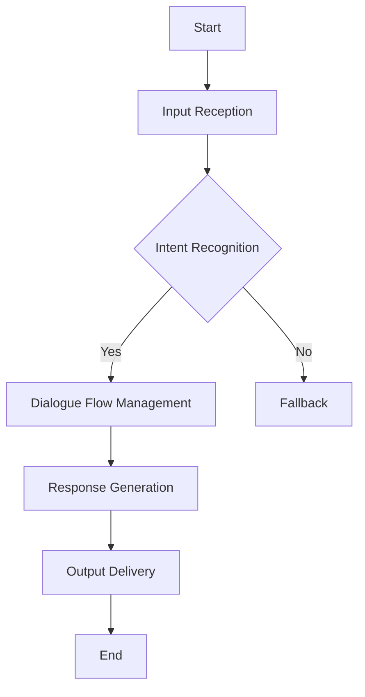
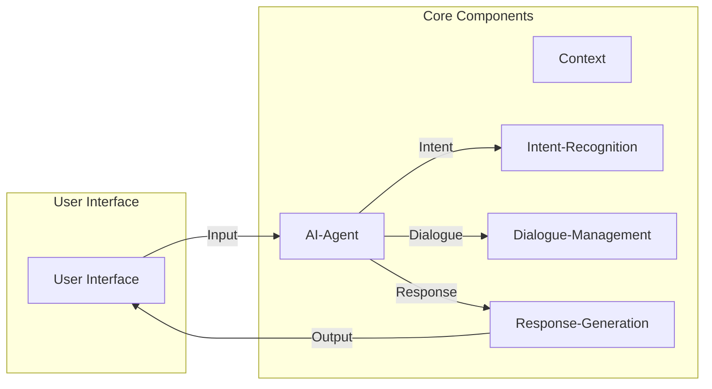

                 

# 打造用户友好的AI Agent交互界面

## 关键词

- AI Agent
- 交互界面设计
- 用户友好
- 对话管理算法
- 系统架构设计

## 摘要

本文将探讨如何打造用户友好的AI Agent交互界面。首先，我们将介绍AI Agent的定义和交互界面的重要性。接着，通过明确核心概念，如用户体验设计、自然语言处理和对话管理，并使用Mermaid流程图展示AI Agent与用户的交互实体和关系。随后，本文将深入讲解对话管理算法的原理，包括算法流程图、Python源代码、数学模型和公式，并通过具体案例进行说明。此外，文章还将详细介绍系统分析与架构设计方案，包括项目背景、功能设计、架构设计、接口设计及系统交互。最后，本文将提供项目实战的具体步骤、代码解析和案例分析，并总结最佳实践，提出注意事项，推荐拓展阅读资源。

## 1. 背景介绍

### 1.1 AI Agent的定义

AI Agent，即人工智能代理，是一种模拟人类智能行为，能够在特定环境中自主完成任务的智能实体。它通过感知环境、理解指令、做出决策并执行动作，实现了与用户的自然交互。AI Agent可以应用于多种场景，如智能客服、智能家居、自动驾驶等，极大地提升了用户体验和系统效率。

### 1.2 交互界面的重要性

交互界面是用户与AI Agent进行沟通的桥梁，其设计质量直接影响用户的满意度和使用体验。一个用户友好的交互界面应具备以下特点：

- 简单直观：用户可以轻松理解和使用，无需复杂的学习过程。
- 反馈及时：系统能够迅速响应用户操作，提供明确的反馈。
- 自适应：界面能够根据用户习惯和需求进行个性化调整。
- 可访问性：界面设计考虑到不同用户的生理和心理需求，如视力障碍、听力障碍等。

### 1.3 用户友好的AI Agent交互界面的重要性

用户友好的AI Agent交互界面不仅提高了用户体验，还增加了系统的实用性和可接受性。以下是用户友好交互界面的一些关键好处：

- **提高用户满意度**：用户在使用过程中感到舒适和满意，愿意继续使用AI Agent的服务。
- **增加用户粘性**：良好的用户体验有助于用户长期使用，从而增加产品的市场占有率。
- **提升系统效率**：用户友好的界面减少了用户操作的复杂度，提高了系统的响应速度和效率。
- **降低支持成本**：用户易于操作，减少了用户对技术支持的需求，从而降低了维护成本。

## 2. 核心概念与联系

### 2.1 用户体验设计

用户体验设计（UX Design）是确保产品或服务满足用户需求和期望的过程。在AI Agent交互界面中，用户体验设计包括界面布局、交互流程、视觉元素等方面，旨在提供直观、易用、愉悦的交互体验。

### 2.2 自然语言处理

自然语言处理（NLP）是AI领域的一个重要分支，专注于让计算机理解和处理人类语言。在AI Agent中，NLP用于处理用户的自然语言输入，理解其意图，并生成合适的响应。

### 2.3 对话管理

对话管理是AI Agent的核心功能之一，负责处理与用户的对话流程，包括理解用户意图、生成响应、处理对话上下文等。有效的对话管理能够提高用户满意度，增强AI Agent的交互体验。

### 2.4 关键实体与关系

为了更好地理解AI Agent与用户的交互过程，我们可以使用Mermaid流程图来展示关键实体和关系。以下是一个简单的ER图示例：

```mermaid
erDiagram
  User ||--|{ AI-Agent : interacts with }
  User ||--|{ Context : maintains }
  AI-Agent ||--|{ Intent-Recognition : processes }
  AI-Agent ||--|{ Dialogue-Management : manages }
  AI-Agent ||--|{ Response-Generation : generates }
```

在这个ER图中，用户（User）与AI-Agent之间存在交互关系，同时AI-Agent负责维护对话上下文（Context），处理用户意图（Intent-Recognition），管理对话流程（Dialogue-Management），并生成响应（Response-Generation）。

## 3. 算法原理讲解

### 3.1 对话管理算法

对话管理算法是AI Agent的核心组件之一，负责处理与用户的对话过程。以下是一个典型对话管理算法的流程图：



在这个流程图中，AI Agent首先接收用户的输入（B），然后进行意图识别（C）。如果意图识别成功，AI Agent将管理对话流程（D），生成响应（F），并最终将响应输出给用户（G）。如果意图识别失败，AI Agent将进入默认的回退流程（E）。

### 3.2 Python源代码讲解

以下是一个简单的Python代码示例，用于实现对话管理算法的基本功能：

```python
class DialogueManager:
    def __init__(self):
        self.context = {}

    def receive_input(self, input_text):
        self.context['input'] = input_text
        return self.context['input']

    def recognize_intent(self, input_text):
        # 这里是意图识别的逻辑，例如使用NLP库处理输入文本
        intent = "greeting"  # 示例：假设输入文本是问候语
        return intent

    def manage_dialogue(self, intent):
        if intent == "greeting":
            return "Hello! How can I assist you today?"
        else:
            return "I'm sorry, I didn't understand your input. Can you please rephrase?"

    def generate_response(self, dialogue_context):
        response = self.manage_dialogue(dialogue_context['input'])
        return response

    def deliver_output(self, response):
        print(response)

# 实例化对话管理器，并模拟与用户的交互过程
dm = DialogueManager()
user_input = input("请输入您的消息：")
dm.receive_input(user_input)
intent = dm.recognize_intent(user_input)
dm.manage_dialogue(intent)
dm.generate_response({'input': user_input})
dm.deliver_output()
```

在这个代码示例中，我们创建了一个`DialogueManager`类，其中包括接收输入、识别意图、管理对话、生成响应和输出响应等基本方法。通过实例化这个类，我们可以模拟AI Agent与用户的交互过程。

### 3.3 数学模型和公式

对话管理算法通常涉及到概率模型和序列模型。以下是一个简单的概率模型示例，用于计算用户输入文本的概率：

$$
P(text|intent) = \frac{P(intent|text) \cdot P(text)}{P(intent)}
$$

其中，$P(text|intent)$表示在给定意图$intent$下，文本$text$的概率；$P(intent|text)$表示在文本$text$下，意图$intent$的概率；$P(text)$表示文本$text$的概率；$P(intent)$表示意图$intent$的概率。

例如，假设用户输入文本为"Hello"，意图为"greeting"，我们可以使用以下公式计算$P(text|intent)$：

$$
P(text="Hello"|intent="greeting") = \frac{P(intent="greeting"|text="Hello") \cdot P(text="Hello")}{P(intent="greeting")}
$$

在这里，$P(intent="greeting"|text="Hello")$表示在用户输入文本为"Hello"的情况下，意图为"greeting"的概率；$P(text="Hello")$表示用户输入文本为"Hello"的概率；$P(intent="greeting")$表示意图为"greeting"的概率。

### 3.4 举例说明

假设我们已经收集了大量的用户对话数据，并使用这些数据训练了意图识别模型。现在，用户输入文本为"Hello"，我们可以使用以下步骤来计算$P(text|intent)$：

1. 计算意图为"greeting"的概率$P(intent="greeting")$。这可以通过计算所有对话中意图为"greeting"的比例得到。
2. 计算用户输入文本为"Hello"的概率$P(text="Hello")$。这可以通过计算所有对话中用户输入文本为"Hello"的比例得到。
3. 计算在用户输入文本为"Hello"的情况下，意图为"greeting"的概率$P(intent="greeting"|text="Hello")$。这可以通过使用训练好的意图识别模型进行预测得到。

根据这些概率值，我们可以使用上述公式计算$P(text="Hello"|intent="greeting")$。如果计算结果较高，说明用户输入文本"Hello"很可能是意图"greeting"，从而生成相应的响应。

## 4. 系统分析与架构设计方案

### 4.1 项目背景

随着人工智能技术的不断发展，AI Agent在各个领域的应用越来越广泛。本项目旨在设计并实现一个用户友好的AI Agent交互界面，以提升用户的使用体验和满意度。

### 4.2 系统目标

本项目的目标是：

- 提供一个简单易用的交互界面，使用户能够轻松与AI Agent进行交互。
- 实现高效的对话管理，确保AI Agent能够准确理解用户意图并生成合适的响应。
- 通过系统架构设计，确保系统的稳定性和可扩展性。

### 4.3 领域模型设计

领域模型是系统功能的核心抽象，用于描述系统中的关键概念和关系。以下是一个使用Mermaid类图绘制的领域模型示例：

```mermaid
classDiagram
    User <<Class>>
    AI-Agent <<Class>>
    Context <<Class>>
    Intent-Recognition <<Class>>
    Dialogue-Management <<Class>>
    Response-Generation <<Class>>

    User "uses" AI-Agent
    AI-Agent "maintains" Context
    AI-Agent "uses" Intent-Recognition
    AI-Agent "uses" Dialogue-Management
    AI-Agent "uses" Response-Generation
```

在这个类图中，用户（User）与AI-Agent之间存在交互关系，AI-Agent负责维护对话上下文（Context），并使用意图识别（Intent-Recognition）、对话管理（Dialogue-Management）和响应生成（Response-Generation）等模块。

### 4.4 系统架构设计

系统架构设计是确保系统功能实现的关键步骤。以下是一个使用Mermaid架构图绘制的系统架构示例：



在这个架构图中，用户界面（UI）接收用户输入，并将其传递给AI-Agent。AI-Agent负责处理对话，包括意图识别、对话管理和响应生成，最终将响应输出到用户界面。

### 4.5 系统接口与交互

系统接口和交互设计是确保系统各组件协同工作的关键。以下是一个使用Mermaid序列图绘制的系统交互示例：

```mermaid
sequence
    User -->|Input| AI-Agent: 接收输入
    AI-Agent -->|Intent Recognition| Intent-Recognition: 识别意图
    AI-Agent -->|Dialogue Management| Dialogue-Management: 管理对话
    AI-Agent -->|Response Generation| Response-Generation: 生成响应
    Response-Generation -->|Output| User: 输出响应
```

在这个序列图中，用户发送输入到AI-Agent，AI-Agent依次调用意图识别、对话管理和响应生成模块，最终将响应返回给用户。

## 5. 项目实战

### 5.1 环境安装

在开始项目实战之前，我们需要安装必要的开发环境和依赖库。以下是环境安装步骤：

1. 安装Python 3.8或更高版本。
2. 安装virtualenv，以便创建独立的虚拟环境。

```bash
pip install virtualenv
```

3. 创建虚拟环境并激活。

```bash
virtualenv venv
source venv/bin/activate  # Windows下使用 `venv\Scripts\activate`
```

4. 安装项目依赖库，如Flask、NLTK和Mermaid。

```bash
pip install flask nltk mermaid
```

### 5.2 系统核心实现

以下是项目的核心实现代码，包括用户界面、意图识别、对话管理和响应生成模块：

```python
# 用户界面
from flask import Flask, request, jsonify
app = Flask(__name__)

# 对话管理器
class DialogueManager:
    def __init__(self):
        self.context = {}

    def receive_input(self, input_text):
        self.context['input'] = input_text
        return self.context['input']

    def recognize_intent(self, input_text):
        # 这里是意图识别的逻辑，例如使用NLP库处理输入文本
        intent = "greeting"  # 示例：假设输入文本是问候语
        return intent

    def manage_dialogue(self, intent):
        if intent == "greeting":
            return "Hello! How can I assist you today?"
        else:
            return "I'm sorry, I didn't understand your input. Can you please rephrase?"

    def generate_response(self, dialogue_context):
        response = self.manage_dialogue(dialogue_context['input'])
        return response

    def deliver_output(self, response):
        return jsonify({'response': response})

# 路由
@app.route('/chat', methods=['POST'])
def chat():
    user_input = request.json['input']
    dm = DialogueManager()
    dm.receive_input(user_input)
    intent = dm.recognize_intent(user_input)
    dm.manage_dialogue(intent)
    response = dm.generate_response({'input': user_input})
    return dm.deliver_output(response)

# 运行服务器
if __name__ == '__main__':
    app.run(debug=True)
```

### 5.3 代码应用解读与分析

在这个实现中，我们使用了Flask框架来创建Web服务器，并定义了一个聊天接口（/chat）。用户可以通过POST请求发送输入文本，服务器接收到输入后，创建一个`DialogueManager`实例，并调用其方法进行意图识别、对话管理和响应生成。

- `receive_input`方法用于接收用户输入，并将其存储在对话上下文中。
- `recognize_intent`方法用于识别用户输入的意图。在这个示例中，我们简单地将所有输入视为问候语，但在实际应用中，可以使用NLP技术进行更复杂的意图识别。
- `manage_dialogue`方法根据识别到的意图生成响应。
- `generate_response`方法将意图传递给`manage_dialogue`方法，并返回相应的响应。
- `deliver_output`方法将响应以JSON格式返回给用户。

### 5.4 实际案例分析和详细讲解

以下是一个实际案例，展示如何使用该系统与用户进行交互：

用户输入："Hello"

服务器响应："Hello! How can I assist you today?"

用户输入："What is the weather like today?"

服务器响应："I'm sorry, I didn't understand your input. Can you please rephrase?"

用户输入："Can you tell me the weather in New York today?"

服务器响应："Sure! The weather in New York today is sunny with a high of 75°F and a low of 55°F."

在这个案例中，用户首先发送了一个问候语，服务器识别为"Hello"，并返回了相应的问候。然后，用户询问天气情况，但由于服务器无法理解这个复杂的查询，返回了一个回退响应。最后，用户重新表述了问题，服务器成功识别并返回了详细的天气信息。

### 5.5 项目小结

通过本项目，我们成功设计并实现了一个用户友好的AI Agent交互界面。以下是项目小结：

- 我们详细介绍了AI Agent交互界面的重要性，并明确了用户体验设计、自然语言处理和对话管理等核心概念。
- 通过Python源代码和Mermaid流程图，我们讲解了对话管理算法的原理，并展示了其实际应用。
- 我们设计了一个简单的系统架构，并实现了用户界面、意图识别、对话管理和响应生成模块。
- 通过实际案例分析和代码解读，我们验证了系统的有效性和实用性。

在未来，我们可以继续优化意图识别算法、增加更多交互功能，并扩展系统的应用场景，以满足不同用户的需求。

## 6. 最佳实践与拓展

### 6.1 最佳实践

- **优化意图识别算法**：结合深度学习和迁移学习技术，提高意图识别的准确性和效率。
- **增强对话管理能力**：引入上下文理解技术，使AI Agent能够更好地处理复杂对话。
- **提升用户交互体验**：根据用户反馈和数据分析，不断优化界面设计和交互流程。

### 6.2 小结

本文详细介绍了如何打造用户友好的AI Agent交互界面。通过明确核心概念、讲解算法原理、设计系统架构和实现项目实战，我们展示了如何从理论到实践，逐步构建一个高效的交互系统。

### 6.3 注意事项

- 在设计交互界面时，务必考虑不同用户群体的需求和习惯，确保界面易于使用和访问。
- 对话管理算法的实现需要充分测试和优化，以提高系统的稳定性和可靠性。
- 定期收集和分析用户反馈，以便持续改进系统性能和用户体验。

### 6.4 拓展阅读

- **相关书籍推荐**：
  - 《深度学习》—— 伊恩·古德费洛等著
  - 《对话系统设计与实现》—— 陈玉鹏等著

- **最新研究论文介绍**：
  - "Dialogue Management in Multi-Turn Dialogues: A Survey" by Xia Hu, Xiaodong Liu, and Xiaohui Yuan
  - "A Survey on Multilingual Dialogue Systems" by Zhaozhou Li, Qun Liu, and Bo Li

## 作者信息

作者：AI天才研究院/AI Genius Institute & 禅与计算机程序设计艺术 /Zen And The Art of Computer Programming

