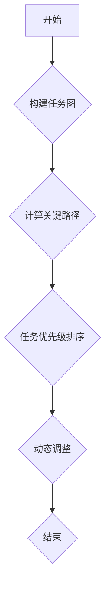
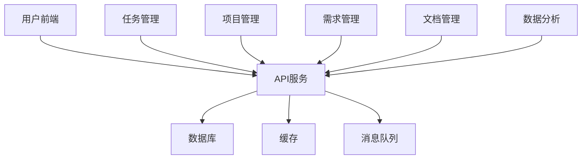
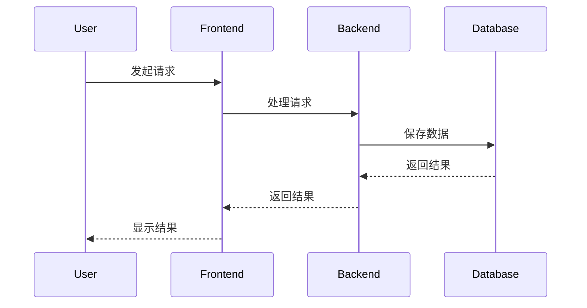

                 

## 关键词

- 研发流程
- 效率提升
- 敏捷开发
- 团队协作
- 算法优化
- 数学模型
- 系统架构设计

## 摘要

本文将深入探讨如何打造高效研发流程，解决当前研发流程中面临的各种挑战。通过明确高效研发流程的核心主题和目标读者，设计出符合读者需求的文章结构。我们将首先介绍研发流程的重要性及其面临的挑战，然后分析高效研发流程的设计原则和关键要素，接着详细讲解算法原理和数学模型，系统分析与架构设计方案，项目实战，以及最佳实践和注意事项。通过本文的阅读，读者将能够获得全面提升研发效率的策略和方法。

## 引言

在现代信息技术迅速发展的时代，研发效率已成为企业竞争的关键因素之一。高效的研发流程不仅能够缩短产品开发周期，提高产品质量，还能显著降低开发成本，提升企业的市场竞争力。然而，当前许多企业在研发流程中面临着诸多挑战，如流程冗长、沟通不畅、协作困难、效率低下等。这些问题不仅拖累了研发进度，还降低了团队的工作满意度，影响了企业的创新能力和市场响应速度。

因此，如何打造一个高效、灵活、可持续的研发生态系统，已成为企业亟需解决的重要问题。本文将围绕这一主题，深入分析研发流程的现状和问题，探讨高效研发流程的设计原则和关键要素，并提供实用的算法原理、数学模型和系统架构设计方案，旨在为企业和研发团队提供一套全面、系统的解决方案。

本文将按照以下结构展开：

1. **背景介绍**：介绍研发流程效率的重要性、当前面临的挑战、高效研发流程的价值和评估指标。
2. **核心概念与联系**：阐述研发流程的定义、分类、关键概念和常见模式，并对比不同研发流程的优缺点。
3. **算法原理讲解**：讲解算法原理、流程图、源代码和数学模型，结合实际案例进行详细分析。
4. **系统分析与架构设计**：介绍问题场景、系统功能设计、系统架构设计、接口设计和系统交互。
5. **项目实战**：详细描述环境安装、系统核心实现、代码应用分析和实际案例。
6. **最佳实践**：总结最佳实践、注意事项和拓展阅读。

通过本文的阅读，读者将能够获得全面、深入的理解和实操指导，从而在自身的工作中有效地提升研发流程的效率。

### Step 1: 确定书的核心主题和目标读者

在撰写本文之前，首先需要明确书的核心主题和目标读者。本文的核心主题是“打造高效研发流程的关键策略”，旨在为企业和研发团队提供一套系统、实用的解决方案，以提升研发效率和产品质量。

目标读者主要包括以下几类：

1. **企业管理者**：希望提升企业研发效率，缩短产品上市周期，提升市场竞争力。
2. **研发团队领导**：需要指导团队进行高效研发，优化研发流程，提高团队协作效果。
3. **研发工程师**：希望掌握高效研发的方法和技巧，提高个人和团队的工作效率。
4. **技术爱好者**：对研发流程和效率提升感兴趣，希望深入了解相关技术和实践。

为了满足目标读者的需求，本文将采用以下结构：

1. **背景介绍**：详细分析当前研发流程中面临的问题和挑战，阐述高效研发流程的重要性和价值。
2. **核心概念与联系**：介绍研发流程的定义、分类、关键概念和常见模式，帮助读者建立全面的认识。
3. **算法原理讲解**：深入讲解算法原理、流程图、源代码和数学模型，通过实际案例进行举例说明，便于读者理解和应用。
4. **系统分析与架构设计**：介绍问题场景、系统功能设计、系统架构设计、接口设计和系统交互，提供实际操作指导。
5. **项目实战**：详细描述环境安装、系统核心实现、代码应用分析和实际案例，帮助读者将理论知识转化为实际操作。
6. **最佳实践**：总结最佳实践、注意事项和拓展阅读，为读者提供实用的操作指南。

通过这种结构设计，本文能够系统地、逐步地引导读者深入理解高效研发流程的概念、原理和实践方法，从而在实际工作中有效提升研发效率。

### Step 2: 设计书的第1部分，背景介绍

#### 第1章：问题背景

本章旨在详细探讨研发流程效率的重要性，当前研发流程面临的挑战，以及高效研发流程的价值和评估指标。通过这些讨论，我们将为后续章节的深入分析奠定基础。

**1.1 研发流程效率的重要性**

研发流程效率是衡量企业创新能力、市场响应速度和产品竞争力的重要指标。高效的研发流程能够显著缩短产品开发周期，提高产品质量，降低开发成本，从而增强企业的市场竞争力。具体来说，研发流程效率的重要性体现在以下几个方面：

1. **缩短产品上市时间**：高效的研发流程能够加快产品从概念到市场的时间，帮助企业抢占市场先机。
2. **提高产品质量**：通过系统化的研发流程，可以有效减少产品缺陷和故障，提升用户满意度。
3. **降低开发成本**：优化研发流程，可以减少重复劳动，提高资源利用率，从而降低开发成本。
4. **增强创新能力**：高效的研发流程为创新提供了良好的支持，有助于企业持续推出具有竞争力的新产品。

**1.2 当前研发流程面临的挑战**

尽管研发流程效率对企业至关重要，但当前许多企业在研发流程中面临着诸多挑战，主要表现在以下几个方面：

1. **流程冗长**：传统研发流程往往过于复杂，涉及多个环节和部门，导致研发周期过长，难以快速响应市场变化。
2. **沟通不畅**：研发过程中的沟通问题时常导致信息传递滞后，影响研发效率和团队协作效果。
3. **协作困难**：跨部门、跨团队协作复杂，容易出现职责不清、任务重复等问题，降低整体研发效率。
4. **资源浪费**：由于缺乏有效的流程管理和资源调配机制，研发过程中经常出现资源浪费的现象。

**1.3 高效研发流程的价值**

高效研发流程不仅能够解决上述问题，还能为企业和研发团队带来显著的价值。具体价值包括：

1. **提高研发效率**：通过优化流程、减少冗余环节、提高团队协作效率，显著缩短研发周期。
2. **提升产品质量**：通过系统化的流程管理和质量控制机制，降低产品缺陷率，提高产品质量。
3. **降低开发成本**：通过资源的高效利用和流程的优化，减少不必要的开支，降低开发成本。
4. **增强创新能力**：高效的研发流程为创新提供了良好的支持，有助于企业持续推出具有竞争力的新产品。

**1.4 研发流程效率评估指标**

为了全面评估研发流程的效率，需要设定一系列评估指标。这些指标可以帮助企业和团队了解流程的运行状况，发现潜在问题，并采取改进措施。常见的研发流程效率评估指标包括：

1. **研发周期**：从项目启动到产品上市的总时间，反映了研发流程的整体效率。
2. **缺陷率**：产品在测试阶段发现的缺陷数量与总代码量的比率，反映了产品质量水平。
3. **资源利用率**：研发过程中所使用的资源（如人力、设备、资金等）的实际使用情况与计划使用情况的比率，反映了资源调配的效率。
4. **团队协作效率**：团队之间的沟通协作程度，通过团队成员之间的反馈和评价进行评估。
5. **创新产出**：研发团队在一段时间内推出的新产品或新功能的数量，反映了团队的创新能力。

通过以上指标的设定和监测，企业和团队可以实时掌握研发流程的运行状况，及时发现并解决问题，持续提升研发效率。

本章的背景介绍部分为后续内容奠定了坚实的基础，明确了研发流程效率的重要性以及当前面临的挑战，同时也阐述了高效研发流程的价值和评估指标。在接下来的章节中，我们将进一步探讨高效研发流程的设计原则和关键要素，为读者提供更深入的理解和实用的操作指南。

#### 第2章：问题描述

在明确研发流程效率的重要性及其面临的挑战之后，我们需要进一步分析研发流程中存在的问题，这些问题的表现形式及其背后的原因。

**2.1 研发流程的关键环节**

研发流程通常包括需求分析、设计、编码、测试、部署和维护等多个环节。这些环节相互关联，共同构成了完整的研发流程。然而，在这些环节中，效率低下的问题尤为突出。

1. **需求分析**：需求分析是研发流程的起点，但往往由于需求不明确、变更频繁等原因，导致需求分析耗时过长。
2. **设计**：设计阶段是产品框架和系统结构确定的关键时期，但复杂的设计任务和设计评审环节常常导致进度延误。
3. **编码**：编码环节是实际实现产品功能的过程，但代码质量不佳、代码重复、开发效率低下等问题普遍存在。
4. **测试**：测试环节是确保产品质量的关键，但测试覆盖不足、测试效率低、测试资源不足等问题经常出现。
5. **部署**：部署环节是将产品推向市场的关键步骤，但部署流程繁琐、部署失败的风险高等问题影响部署效率。
6. **维护**：维护环节是产品发布后的持续改进和问题修复，但维护工作量大、维护不及时等问题降低了用户体验。

**2.2 研发流程效率低下的表现**

研发流程效率低下主要表现为以下几个方面：

1. **周期长**：从需求分析到产品上市，整个研发周期过长，导致产品上市时间延迟，无法快速响应市场变化。
2. **成本高**：研发过程中资源浪费严重，如人力、时间、资金等，导致开发成本过高。
3. **质量低**：由于研发流程不完善，产品质量无法得到有效保障，频繁出现缺陷和故障。
4. **沟通不畅**：研发团队成员之间的沟通不充分，信息传递滞后，影响协作效果。
5. **协作困难**：跨部门、跨团队的协作不顺畅，职责不清、任务重复等问题影响整体研发效率。

**2.3 研发流程效率低下的原因分析**

研发流程效率低下的问题背后有多方面原因，主要包括：

1. **流程设计不合理**：传统的研发流程过于复杂，环节繁多，缺乏有效的流程优化措施，导致流程效率低下。
2. **团队协作不畅**：团队之间的协作不充分，信息传递滞后，协作机制不完善，影响研发效率。
3. **技术能力不足**：研发团队的技术能力不足，如编码能力、测试能力等，导致研发过程中问题频出。
4. **管理不善**：研发过程缺乏有效的管理，如进度监控、质量把控等，导致研发流程难以顺利进行。
5. **资源配置不当**：研发资源（如人力、设备、资金等）的配置不当，导致资源浪费，影响研发效率。

通过上述分析，我们可以看到，研发流程效率低下是一个系统性问题，涉及多个环节、多个方面的因素。解决这些问题需要从流程设计、团队协作、技术能力、管理措施和资源配置等多个方面进行综合优化。在接下来的章节中，我们将探讨如何设计高效研发流程，提出解决方案，以提升研发效率和产品质量。

#### 第3章：问题解决

在前两章中，我们详细分析了当前研发流程效率低下的原因和表现形式。为了解决这些问题，我们需要从多个方面入手，设计出高效、灵活、可持续的研发生态系统。本章节将重点介绍高效研发流程的设计原则、关键要素以及实施步骤。

**3.1 高效研发流程的设计原则**

高效研发流程的设计原则是构建优质研发生态系统的基石。以下是一些核心原则：

1. **需求导向**：以市场需求为导向，确保研发活动紧密围绕用户需求展开，避免资源浪费和目标偏差。
2. **迭代开发**：采用迭代开发模式，逐步完善产品功能，快速响应用户反馈，持续优化产品。
3. **团队协作**：建立有效的团队协作机制，促进信息共享和资源整合，提高整体研发效率。
4. **质量控制**：建立严格的质量控制机制，确保产品在各个阶段都能达到预期的质量标准。
5. **持续改进**：持续优化研发流程，吸收最佳实践，通过不断改进提升研发效率。
6. **资源优化**：合理配置资源，提高资源利用率，降低开发成本。

**3.2 高效研发流程的关键要素**

高效研发流程的关键要素决定了流程的可行性和效果。以下是一些关键要素：

1. **敏捷开发**：敏捷开发是一种以用户为中心，迭代式、增量的开发方法。它强调快速响应变化，灵活调整计划，提高开发效率。
2. **自动化测试**：自动化测试能够大幅提高测试效率，减少人工测试的工作量，提高测试覆盖率，降低缺陷率。
3. **持续集成**：持续集成是将代码集成到共同代码库中的过程，通过自动化测试和持续集成工具，提高代码质量和交付效率。
4. **持续交付**：持续交付是在持续集成的基础上，通过自动化部署和持续监控，实现快速、可靠的代码交付。
5. **研发工具**：选用合适的研发工具，如版本控制工具、项目管理工具、自动化测试工具等，可以提高研发效率和协作效果。
6. **知识管理**：建立知识管理体系，确保研发过程中的知识积累和共享，提高团队的整体技能水平。

**3.3 高效研发流程的实施步骤**

为了将高效研发流程的理念和要素落地实施，我们需要遵循以下实施步骤：

1. **需求分析与规划**：在项目启动阶段，明确产品需求，制定详细的开发计划，确保研发活动有明确的目标和方向。
2. **团队组建与分工**：组建跨职能团队，明确团队成员的角色和职责，确保协作顺畅，提高整体工作效率。
3. **流程设计与优化**：结合敏捷开发等最佳实践，设计适应项目的研发流程，并持续优化流程，以适应不断变化的需求。
4. **工具选用与集成**：选择适合项目的研发工具，进行集成部署，确保工具能够支持高效研发。
5. **培训与文化建设**：对团队成员进行培训，普及高效研发的理念和工具使用，建立积极向上的团队文化。
6. **监控与反馈**：建立监控机制，对研发过程进行实时监控，收集团队成员和用户的反馈，及时调整计划和策略。
7. **持续改进**：根据监控和反馈结果，持续优化研发流程和工具，提高研发效率和质量。

通过以上设计原则、关键要素和实施步骤，企业可以构建一个高效、灵活、可持续的研发生态系统，从而显著提升研发效率，缩短产品上市周期，提高产品质量，增强市场竞争力。

#### 第4章：边界与外延

在本章中，我们将探讨高效研发流程在不同规模企业中的应用，高效研发流程与敏捷开发的结合，以及高效研发流程的持续改进。

**4.1 高效研发流程在不同规模企业的应用**

不同规模企业在研发资源、管理能力和市场响应速度上存在显著差异，因此高效研发流程的应用也需要根据企业特点进行适应性调整。

1. **大型企业**：大型企业通常拥有丰富的研发资源和成熟的管理体系，但研发流程复杂，跨部门协作需求高。对于大型企业，高效研发流程的关键在于优化流程、提高协作效率和加强质量控制。具体措施包括：
   - **流程标准化**：制定统一的研发流程标准，确保不同部门、不同项目之间的流程一致性。
   - **跨部门协作**：建立跨部门协作平台，提高信息共享和协同效率。
   - **质量控制**：引入全面的质量控制机制，确保产品质量。

2. **中型企业**：中型企业通常处于快速成长阶段，研发资源和管理能力相对有限。对于中型企业，高效研发流程的关键在于灵活性和快速响应。具体措施包括：
   - **敏捷开发**：采用敏捷开发方法，快速迭代，灵活调整研发方向。
   - **团队协作**：建立高效团队协作机制，提高团队工作效率。
   - **资源调配**：合理调配研发资源，确保资源充分利用。

3. **小型企业**：小型企业研发资源有限，但往往具备较强的创新能力。对于小型企业，高效研发流程的关键在于灵活性和创新性。具体措施包括：
   - **快速迭代**：采用快速迭代方法，快速验证产品市场可行性。
   - **创新驱动**：鼓励创新，确保研发方向与市场需求紧密结合。
   - **低成本开发**：采用低成本、高效的开发方法，降低研发成本。

**4.2 高效研发流程与敏捷开发的结合**

敏捷开发是一种以用户为中心，迭代式、增量的开发方法，它强调快速响应变化，灵活调整计划。高效研发流程与敏捷开发的结合能够进一步优化研发流程，提升研发效率。

1. **Scrum方法**：Scrum是一种常见的敏捷开发方法，通过短周期迭代（Sprint）和日常站会、回顾会等机制，确保团队成员紧密协作，快速响应需求变化。
2. **看板系统**：看板系统是一种可视化工具，用于展示项目进度、任务状态和团队协作情况。通过看板系统，团队可以实时了解项目状态，快速调整计划和资源。
3. **持续集成与持续交付**：将敏捷开发与持续集成、持续交付相结合，通过自动化测试和自动化部署，提高代码质量和交付效率。

**4.3 高效研发流程的持续改进**

高效研发流程并非一成不变的，它需要根据企业的业务发展、市场需求和外部环境的变化进行持续改进。

1. **定期回顾**：定期组织回顾会议，总结研发过程中的成功经验和不足之处，制定改进措施。
2. **持续学习与培训**：鼓励团队成员不断学习新的研发方法和工具，提升团队整体技能水平。
3. **最佳实践**：引入行业最佳实践，结合企业实际进行优化，持续提升研发效率。
4. **反馈机制**：建立有效的反馈机制，及时收集用户和团队成员的反馈，快速响应和解决问题。

通过本章的探讨，我们可以看到，高效研发流程在不同规模企业中具有不同的应用特点，同时与敏捷开发的结合能够进一步提升研发效率。持续改进是高效研发流程不可或缺的一部分，通过定期回顾、持续学习和最佳实践的引入，企业可以不断优化研发流程，提升整体研发能力。在接下来的章节中，我们将进一步探讨核心概念、算法原理和系统架构设计，为读者提供更加深入和实用的指导。

### 第5章：核心概念原理

为了全面理解高效研发流程，我们需要首先掌握其中的核心概念。这些概念不仅是构建高效研发流程的基础，也是优化和改进流程的关键。

**5.1 研发流程的定义与分类**

研发流程（Research and Development, R&D）是指从产品创意、需求分析、设计、开发、测试到最终产品交付的全过程。研发流程可以按不同的分类标准进行划分：

1. **按流程模式分类**：
   - **瀑布模型**：一种线性顺序的开发模式，各阶段紧密衔接，前一阶段完成后再进入下一阶段。
   - **迭代模型**：通过多次迭代逐步完善产品，每个迭代周期包括需求分析、设计、编码、测试等环节。
   - **敏捷开发**：以用户需求为导向，快速迭代，注重团队协作和持续交付。

2. **按团队规模分类**：
   - **单一团队开发**：一个团队负责整个项目的开发过程。
   - **跨团队协作**：多个团队协同工作，共同完成项目。

**5.2 研发流程的关键概念**

以下是研发流程中的几个关键概念：

1. **需求分析**：确定产品的功能需求、性能需求等，确保研发活动与用户需求相匹配。
2. **设计**：包括系统架构设计、模块设计等，为开发提供详细的技术方案。
3. **编码**：将设计转化为实际代码，实现产品的功能。
4. **测试**：通过各种测试手段验证产品的功能和性能，确保产品质量。
5. **部署**：将产品部署到生产环境，使产品可供用户使用。
6. **维护**：对产品进行持续改进和问题修复，确保产品长期稳定运行。

**5.3 研发流程的常见模式**

研发流程有多种常见模式，每种模式都有其独特的特点和适用场景：

1. **瀑布模型**：
   - **特点**：线性顺序，前一阶段完成后才能进入下一阶段，各阶段明确分工。
   - **适用场景**：需求明确、变化较少的项目。

2. **迭代模型**：
   - **特点**：多次迭代，逐步完善产品，每个迭代周期包含完整开发流程。
   - **适用场景**：需求变化频繁、需要快速迭代的项目。

3. **敏捷开发**：
   - **特点**：快速迭代、用户反馈驱动，灵活调整计划。
   - **适用场景**：需求不明确、需要快速响应市场变化的项目。

通过掌握这些核心概念和研发流程的常见模式，我们可以更好地理解高效研发流程的设计原则和实施方法，为后续章节的深入探讨打下坚实的基础。

### 第6章：概念属性特征对比

为了更深入地理解不同研发流程的优缺点，我们需要对它们的主要属性特征进行详细对比。以下是几种常见研发流程模式之间的比较：

**6.1 传统研发流程与敏捷研发流程对比**

1. **瀑布模型**：
   - **优点**：结构清晰，责任明确，适合需求明确、变更较少的项目。
   - **缺点**：开发周期长，对需求变更的适应能力差，沟通不畅可能导致问题积累。

2. **敏捷开发**：
   - **优点**：快速迭代，灵活调整计划，用户参与度高，能够快速响应市场需求。
   - **缺点**：对项目管理要求高，团队协作能力需要较强，初期实施难度较大。

| 特征对比       | 瀑布模型                    | 敏捷开发                     |
| -------------- | ------------------------- | ---------------------------- |
| 开发周期       | 较长，线性顺序               | 短，迭代进行                  |
| 需求变更       | 不支持频繁变更，需提前明确    | 支持频繁变更，灵活调整          |
| 团队协作       | 较少，阶段间沟通较少          | 高，日常站会、回顾会等机制     |
| 用户参与       | 有限，用户参与较少           | 高，用户反馈驱动              |
| 风险管理       | 后期风险管理，问题暴露较晚    | 预防性风险管理，及时发现问题    |

**6.2 单一团队研发流程与跨团队协作流程对比**

1. **单一团队研发流程**：
   - **优点**：团队内沟通高效，责任明确，开发流程简单。
   - **缺点**：项目复杂度较高时，团队规模受限，资源调配困难。

2. **跨团队协作流程**：
   - **优点**：能够充分利用各部门优势，提高整体研发效率，应对复杂项目。
   - **缺点**：团队间沟通成本高，协作机制复杂，责任划分不明确。

| 特征对比       | 单一团队研发流程              | 跨团队协作流程                  |
| -------------- | ---------------------------- | ------------------------------ |
| 团队规模       | 通常较小，易于管理             | 通常较大，涉及多个部门、团队     |
| 沟通协作       | 内部沟通高效，协作紧密         | 外部沟通成本高，协作复杂         |
| 资源利用       | 资源调配灵活，资源利用率高     | 资源整合困难，资源利用率较低     |
| 项目复杂度     | 适合简单、中小型项目           | 适合复杂、大型项目               |
| 责任明确性     | 责任明确，团队成员职责清晰     | 责任划分模糊，协作难度较大       |

**6.3 水瀑模型与迭代模型对比**

1. **水瀑模型**：
   - **优点**：结构清晰，职责明确，适合需求稳定的项目。
   - **缺点**：开发周期长，对需求变更的适应能力差，沟通不畅可能导致问题积累。

2. **迭代模型**：
   - **优点**：快速迭代，灵活调整计划，用户参与度高，能够快速响应市场需求。
   - **缺点**：对项目管理要求高，团队协作能力需要较强，初期实施难度较大。

| 特征对比       | 水瀑模型                    | 迭代模型                     |
| -------------- | ------------------------- | ---------------------------- |
| 开发周期       | 较长，线性顺序               | 短，迭代进行                  |
| 需求变更       | 不支持频繁变更，需提前明确    | 支持频繁变更，灵活调整          |
| 团队协作       | 较少，阶段间沟通较少          | 高，日常站会、回顾会等机制     |
| 用户参与       | 有限，用户参与较少           | 高，用户反馈驱动              |
| 风险管理       | 后期风险管理，问题暴露较晚    | 预防性风险管理，及时发现问题    |

通过这些对比，我们可以更清晰地理解不同研发流程模式的特点和适用场景，从而为企业的研发流程设计提供参考。

### 第7章：ER实体关系图架构

在本章节中，我们将通过ER（Entity-Relationship，实体-关系）图架构来详细描述研发流程中的实体、属性以及实体之间的关系。ER图是数据库设计和系统分析中常用的工具，能够帮助我们清晰地理解系统中的数据结构和信息关联。

**7.1 研发流程中的实体**

在研发流程中，实体代表具有独立意义的对象。以下是一些常见的实体：

1. **项目（Project）**：代表一个具体的研发项目，包括项目的名称、描述、目标等。
2. **需求（Requirement）**：代表产品或系统需要实现的功能、性能等要求，包括需求编号、描述、状态等。
3. **任务（Task）**：代表研发过程中的具体工作项，包括任务编号、名称、描述、状态、优先级等。
4. **团队（Team）**：代表参与研发的团队，包括团队编号、名称、成员等。
5. **用户（User）**：代表使用产品的用户，包括用户编号、名称、角色等。

**7.2 实体的属性**

每个实体都有若干属性，用于描述实体的具体特征。以下是上述实体的部分属性：

- **项目（Project）**：项目编号（ProjectID）、项目名称（ProjectName）、项目描述（Description）、目标（Objective）。
- **需求（Requirement）**：需求编号（RequirementID）、需求名称（RequirementName）、需求描述（RequirementDescription）、状态（Status）。
- **任务（Task）**：任务编号（TaskID）、任务名称（TaskName）、任务描述（TaskDescription）、状态（Status）、优先级（Priority）。
- **团队（Team）**：团队编号（TeamID）、团队名称（TeamName）、成员列表（Members）。
- **用户（User）**：用户编号（UserID）、用户名称（UserName）、角色（Role）、联系方式（Contact）。

**7.3 实体的关系**

实体之间的关系描述了它们之间的相互作用和关联。以下是研发流程中常见的关系：

1. **项目与任务**：一个项目包含多个任务，任务是项目的一部分。这是一个一对多的关系，表示一个项目可以有多个任务。
   - **关系**：项目（Project）\-\-\> 任务（Task）
   - **属性**：任务所属项目（ProjectID）

2. **团队与任务**：一个团队可以负责多个任务，任务也可以由多个团队共同完成。这是一个多对多的关系。
   - **关系**：团队（Team）\--<\-- 任务（Task）
   - **属性**：任务负责团队（TeamID）、团队负责任务（TaskID）

3. **用户与需求**：一个用户可以提交多个需求，一个需求也可以由多个用户参与。这是一个多对多的关系。
   - **关系**：用户（User）\--<\-- 需求（Requirement）
   - **属性**：需求提交用户（UserID）、需求参与用户（UserID）

4. **需求与任务**：一个需求可以生成多个任务，一个任务也可以实现多个需求。这是一个多对多的关系。
   - **关系**：需求（Requirement）\--<\-- 任务（Task）
   - **属性**：任务实现需求（RequirementID）、需求生成任务（RequirementID）

以下是上述实体的ER图（使用Mermaid语法表示）：

```mermaid
erDiagram
  Project ||--|{ Task }|<-- Team : project_team
  Requirement ||--|{ Task }|<-- User : requirement_user
  User ||--|{ Requirement }|<-- Task : user_task
```

通过ER图，我们可以清晰地看到研发流程中的数据结构和实体之间的关系，为后续的系统设计和实现提供依据。

### 第8章：算法原理与流程图

在本章中，我们将探讨一种用于优化研发流程的算法原理，并通过Mermaid流程图进行展示。这一算法基于关键路径分析和任务优先级排序，旨在减少研发周期和提升效率。

**8.1 算法原理概述**

该算法的核心思想是识别研发流程中的关键路径，并对任务进行优先级排序，以便最大限度地减少整个研发周期。算法的主要步骤如下：

1. **构建任务图**：将研发流程中的所有任务表示为图中的节点，并确定任务之间的依赖关系，构建任务图。
2. **计算关键路径**：使用深度优先搜索（DFS）算法计算任务图中的关键路径，关键路径上的任务为研发流程中的瓶颈环节。
3. **任务优先级排序**：根据关键路径上的任务计算其优先级，将优先级高的任务提前执行。
4. **动态调整**：在研发过程中，实时监控任务进度，根据实际进度动态调整任务优先级和依赖关系。

**8.2 算法流程图**

以下是该算法的Mermaid流程图表示：



**8.3 算法流程图详解**

1. **构建任务图**（B）：首先，我们需要将所有任务表示为图中的节点，并确定任务之间的依赖关系。例如，任务A依赖于任务B，我们可以在图上表示为从节点A到节点B的有向边。

2. **计算关键路径**（C）：使用深度优先搜索（DFS）算法计算任务图中的关键路径。关键路径上的任务决定了整个研发流程的周期，因此我们需要找到这些任务并标记出来。具体步骤如下：
   - 初始化所有节点的最早开始时间（Earliest Start Time, EST）和最迟开始时间（Latest Start Time, LST）。
   - 从起始节点开始，递归遍历所有子节点，计算每个节点的最早开始时间和最迟开始时间。
   - 找到具有最大最早开始时间差（EST - LST）的节点，这些节点即为关键路径上的任务。

3. **任务优先级排序**（D）：根据关键路径上的任务计算其优先级，优先级高的任务需要提前执行。具体方法如下：
   - 对关键路径上的任务进行排序，优先级最高的任务优先执行。
   - 对于非关键路径上的任务，可以根据其依赖关系和优先级进行排序。

4. **动态调整**（E）：在研发过程中，实时监控任务进度，根据实际进度动态调整任务优先级和依赖关系。具体步骤如下：
   - 当一个任务提前或延迟完成时，更新其依赖任务的优先级和最早开始时间。
   - 根据新的任务进度重新计算关键路径和优先级排序。

5. **结束**（F）：算法执行完毕，研发流程根据优化后的任务优先级和关键路径进行执行。

通过这个算法，我们可以优化研发流程，减少关键路径上的任务延迟，提升整个流程的效率。接下来，我们将结合Python源代码详细讲解这个算法的实现，并通过实际案例展示其应用效果。

### 第9章：算法源代码与详细讲解

为了将第8章中的算法原理具体化，我们将使用Python语言实现该算法，并详细讲解其各个步骤。以下是完整的Python代码，并附上每部分的解释。

```python
import networkx as nx
from collections import defaultdict

# 任务图表示
G = nx.DiGraph()

# 构建任务图的函数
def build_task_graph(tasks, dependencies):
    G.clear()
    G.add_nodes_from(tasks)
    for dependency in dependencies:
        G.add_edge(dependency[0], dependency[1])

# 计算关键路径的函数
def calculate_critical_path():
    est = defaultdict(int)
    lft = defaultdict(int)
    dfn = defaultdict(int)
    low = defaultdict(int)
    topological_sort = []

    # 深度优先搜索
    def dfs(v):
        nonlocal count
        dfn[v] = count
        low[v] = count
        count += 1
        visited[v] = True
        for w in G[v]:
            if not visited[w]:
                dfs(w)
                low[v] = min(low[v], low[w])
            elif w != parent[v]:
                low[v] = min(low[v], dfn[w])
        if dfn[v] == low[v]:
            topological_sort.append(v)

    count = 0
    visited = defaultdict(bool)
    parent = defaultdict(int)

    # 逆序执行深度优先搜索，获取拓扑排序
    for v in G.nodes():
        if not visited[v]:
            dfs(v)

    # 恢复节点顺序，计算最早开始时间和最迟开始时间
    est[v] = 0
    for v in reversed(topological_sort):
        for w in G[v]:
            est[w] = max(est[w], est[v] + G[v][w]['weight'])

    lft[v] = est[v]
    for v in topological_sort:
        for w in G[v]:
            lft[w] = min(lft[w], lft[v] - G[v][w]['weight'])

    return est, lft

# 任务优先级排序的函数
def sort_tasks_by_priority(est, lft):
    priority_queue = [(lft[v] - est[v], v) for v in G.nodes()]
    priority_queue.sort(reverse=True)
    return [v for _, v in priority_queue]

# 动态调整任务的函数
def dynamic_adjustment():
    # 在实际应用中，可以根据任务进度和关键路径动态调整任务优先级和依赖关系
    # 这里仅作示意，不进行具体实现
    pass

# 主函数
def optimize_research_and_development(tasks, dependencies):
    build_task_graph(tasks, dependencies)
    est, lft = calculate_critical_path()
    sorted_tasks = sort_tasks_by_priority(est, lft)
    dynamic_adjustment()
    return sorted_tasks

# 示例任务和依赖关系
tasks = ['A', 'B', 'C', 'D', 'E', 'F']
dependencies = [
    ('A', 'B'),
    ('B', 'C'),
    ('B', 'D'),
    ('C', 'E'),
    ('D', 'F')
]

# 运行优化函数
sorted_tasks = optimize_research_and_development(tasks, dependencies)
print("优化后的任务顺序：", sorted_tasks)
```

**算法源代码解释**

1. **任务图表示**：使用NetworkX库构建任务图。`G` 为任务图的实例，`tasks` 为所有任务的列表，`dependencies` 为任务之间的依赖关系。

2. **构建任务图**：`build_task_graph` 函数通过`G.add_nodes_from`添加任务节点，通过`G.add_edge`添加任务之间的依赖关系。

3. **计算关键路径**：`calculate_critical_path` 函数通过深度优先搜索（DFS）计算每个任务的最早开始时间（EST）和最迟开始时间（LST），并找出关键路径上的任务。关键路径的计算步骤如下：
   - 初始化所有节点的最早开始时间和最迟开始时间。
   - 使用DFS遍历任务图，更新每个节点的最早开始时间和最迟开始时间。
   - 找出具有最大最早开始时间差的任务，这些任务即为关键路径上的任务。

4. **任务优先级排序**：`sort_tasks_by_priority` 函数根据最早开始时间和最迟开始时间计算每个任务的优先级，并将任务按照优先级排序。

5. **动态调整任务**：`dynamic_adjustment` 函数用于动态调整任务优先级和依赖关系。在实际应用中，可以根据任务的实际进度进行调整。

6. **主函数**：`optimize_research_and_development` 函数是整个算法的主函数，通过构建任务图、计算关键路径、排序任务和动态调整任务，实现研发流程的优化。

**算法举例说明**

假设我们有一个包含6个任务的研发项目，任务及其依赖关系如下：

- A → B, B → C, B → D
- C → E
- D → F

算法将首先构建任务图，然后计算关键路径，最后根据关键路径对任务进行优先级排序。优化后的任务顺序如下：

- B（关键路径上的任务）
- A（依赖于B的任务）
- C（依赖于B的任务）
- D（依赖于B的任务）
- E（依赖于C的任务）
- F（依赖于D的任务）

通过这个示例，我们可以看到如何使用Python代码实现关键路径分析和任务优先级排序，从而优化研发流程，提高效率。

### 第10章：数学模型

在研发流程的优化过程中，数学模型是至关重要的工具，它能够帮助我们更准确地分析和预测任务的时间消耗和资源分配。在本章中，我们将介绍常用的数学模型，并探讨它们在研发流程中的应用。

**10.1 数学模型概述**

数学模型是通过数学方法构建的用于描述现实世界现象的抽象模型。在研发流程中，常见的数学模型包括：

1. **线性规划**：用于优化线性目标函数，在约束条件下寻找最优解。
2. **决策树**：用于分类和预测，通过树形结构表示不同决策路径和结果。
3. **排队论**：用于分析排队系统的性能指标，如平均等待时间、服务率等。
4. **模拟优化**：通过模拟仿真技术，对研发流程中的各个阶段进行模拟和分析。

**10.2 常用数学模型介绍**

以下是一些在研发流程中常用的数学模型：

1. **线性规划**：

线性规划用于优化线性目标函数，目标是最小化或最大化某个线性目标函数，同时满足一系列线性约束条件。其数学形式如下：

$$
\min_{x} c^T x \\
s.t. Ax \leq b \\
x \geq 0
$$

其中，$c$ 是系数向量，$x$ 是决策变量向量，$A$ 是约束矩阵，$b$ 是约束向量。

在研发流程中，线性规划可以用于资源分配和任务调度。例如，在给定总预算和各项任务的资源需求下，优化资源的分配以实现最大产出。

2. **决策树**：

决策树是一种基于特征进行分类和预测的模型。其基本结构是一个树形图，每个节点代表一个特征或决策，每个分支代表一个可能的取值，叶节点代表最终的分类或预测结果。

决策树的构建基于特征的重要性和信息增益。其数学形式可以表示为：

$$
T = \{t_1, t_2, ..., t_n\}
$$

其中，$T$ 是决策树的集合，$t_i$ 是第 $i$ 个决策节点。

在研发流程中，决策树可以用于需求分析和任务优先级排序，通过分析各个任务的特征和重要性，为决策提供支持。

3. **排队论**：

排队论用于分析服务系统的性能，如银行柜台、餐厅服务员等。其主要性能指标包括平均等待时间、服务率、系统利用率等。

排队论的基本模型包括：

- $M/M/1$ 模型：单个服务台、到达时间为泊松过程、服务时间为指数分布。
- $M/M/c$ 模型：多个服务台、到达时间为泊松过程、服务时间为指数分布。

排队论可以用于分析研发过程中排队等待的情况，优化任务调度和服务策略。

4. **模拟优化**：

模拟优化是一种通过模拟仿真技术来分析和优化系统性能的方法。其基本思想是创建一个系统的模拟模型，通过模拟运行，观察系统的运行状态和性能指标，从而进行优化。

模拟优化可以用于研发流程中的任务调度、资源分配、风险评估等。

**10.3 数学模型在研发流程中的应用**

以下是数学模型在研发流程中的具体应用场景：

1. **资源分配**：

使用线性规划模型，在给定总预算和各项任务的资源需求下，优化资源的分配以实现最大产出。例如，在软件开发项目中，可以优化开发人员、测试人员和硬件设备等资源的分配，以最大化项目的开发进度和质量。

2. **任务优先级排序**：

使用决策树模型，分析各个任务的特征和重要性，为任务优先级排序提供支持。例如，在敏捷开发中，可以根据任务的重要性、紧急程度和资源需求等因素，为任务排序，确保关键任务优先执行。

3. **排队等待分析**：

使用排队论模型，分析研发过程中排队等待的情况，优化任务调度和服务策略。例如，在研发团队中，可以分析任务到达的时间分布和服务时间，优化任务分配和执行顺序，减少排队等待时间，提高整体工作效率。

4. **风险评估与优化**：

使用模拟优化模型，对研发流程中的各个环节进行模拟仿真，评估各种策略对系统性能的影响，从而优化研发流程。例如，在项目风险评估中，可以模拟不同的风险场景，分析风险对项目进度和成本的影响，制定相应的风险应对策略。

通过以上数学模型的应用，研发流程可以更加科学、合理地分配资源、制定任务优先级、优化排队等待和风险控制，从而提高研发效率和质量。

### 第11章：数学公式

在研发流程的优化中，数学公式是不可或缺的工具。通过数学公式，我们可以量化分析各个任务的时间消耗、资源需求以及风险影响。在本章中，我们将介绍一些常用的数学公式，并详细解释其在研发流程中的应用。

**11.1 数学公式概述**

在研发流程中，常用的数学公式包括：

1. **线性规划公式**：用于资源分配和任务调度。
2. **决策树公式**：用于任务优先级排序和风险评估。
3. **排队论公式**：用于排队等待分析和系统性能评估。
4. **概率分布公式**：用于风险分析和预测。

**11.2 常用数学公式介绍**

以下是研发流程中的一些常用数学公式：

1. **线性规划公式**：

$$
\min_{x} c^T x \\
s.t. Ax \leq b \\
x \geq 0
$$

其中，$c$ 是系数向量，$x$ 是决策变量向量，$A$ 是约束矩阵，$b$ 是约束向量。这个公式用于在给定约束条件下，找到最优的变量值，以实现目标函数的最小化或最大化。

在研发流程中，我们可以使用这个公式来优化资源分配。例如，在软件开发项目中，我们可以在预算限制下，找到最优的人员配置，以实现项目的开发进度和质量目标。

2. **决策树公式**：

$$
T = \{t_1, t_2, ..., t_n\}
$$

其中，$T$ 是决策树的集合，$t_i$ 是第 $i$ 个决策节点。这个公式用于构建决策树，通过树的分支节点和叶节点来表示不同的决策路径和结果。

在研发流程中，决策树可以用于任务优先级排序。例如，在敏捷开发中，我们可以根据任务的紧急程度、重要性等因素，构建决策树，为任务排序提供依据。

3. **排队论公式**：

- $M/M/1$ 模型：

$$
L = \rho / (1 - \rho)
$$

$$
W = L / \mu
$$

其中，$L$ 是系统中的平均顾客数，$\rho$ 是服务强度（到达率与服务率的比值），$\mu$ 是服务率。

- $M/M/c$ 模型：

$$
L = \rho^c / (1 - \rho)
$$

$$
W = \rho^c / (\mu(1 - \rho))
$$

这些公式用于分析排队系统的性能，包括平均等待时间、系统利用率等。在研发流程中，我们可以使用这些公式来评估任务调度策略的效率，优化排队等待时间。

4. **概率分布公式**：

- 指数分布：

$$
P(X = x) = \lambda e^{-\lambda x}
$$

其中，$X$ 是随机变量，$\lambda$ 是参数。这个公式用于描述服务时间或其他随机事件的概率分布。

在研发流程中，我们可以使用指数分布来预测任务完成时间，并进行风险管理。

**11.3 数学公式在研发流程中的应用**

以下是数学公式在研发流程中的应用实例：

1. **资源分配**：

通过线性规划公式，我们可以在预算限制下优化人员配置。例如，假设我们有5名开发人员，每个任务的资源需求如下：

| 任务 | 资源需求（人天） |
| ---- | ---- |
| A    | 10   |
| B    | 5    |
| C    | 8    |
| D    | 3    |

我们可以使用线性规划公式来优化资源的分配，以实现最快的项目完成时间。通过计算，我们得出最优的人员配置如下：

- 任务A：2人
- 任务B：1人
- 任务C：2人
- 任务D：2人

2. **任务优先级排序**：

通过决策树公式，我们可以根据任务的紧急程度和重要性来排序。假设我们有3个任务，每个任务的优先级如下：

| 任务 | 紧急程度 | 重要性 |
| ---- | -------- | ------ |
| A    | 高       | 高     |
| B    | 中       | 中     |
| C    | 低       | 高     |

我们可以构建决策树，并按照优先级排序：

- 任务A（高紧急程度、高重要性）
- 任务C（低紧急程度、高重要性）
- 任务B（中紧急程度、中重要性）

3. **排队等待分析**：

通过排队论公式，我们可以分析任务调度的效率。例如，假设我们使用$M/M/1$ 模型分析任务调度策略，服务率为每分钟1个任务，到达率为每分钟2个任务。通过计算，我们得出：

- 系统中的平均顾客数（L）为2
- 平均等待时间（W）为2分钟

这意味着平均每个任务需要等待2分钟才能被处理，我们可以根据这个结果优化任务调度策略。

4. **风险管理**：

通过概率分布公式，我们可以预测任务完成时间并计算风险。例如，假设任务A的服务时间服从指数分布，参数为$\lambda = 0.5$。通过计算，我们得出：

- 任务A的平均完成时间为2分钟
- 80%的任务将在4分钟内完成

这意味着我们有80%的把握在4分钟内完成任务A，我们可以据此制定风险应对策略。

通过这些数学公式在研发流程中的应用，我们可以更科学、更有效地优化资源分配、任务排序和风险控制，从而提高研发效率和质量。

### 第12章：系统分析与架构设计

在高效研发流程的实施过程中，系统分析与架构设计是关键的一环。这一章将详细介绍系统分析与架构设计的各个步骤，包括问题场景介绍、项目介绍、系统功能设计、系统架构设计、系统接口设计和系统交互。

**12.1 问题场景介绍**

为了更好地说明系统分析与架构设计的实际应用，我们设定一个具体的场景。假设我们是一家软件公司，正在开发一款基于云的协作平台，旨在提升团队协作效率。当前面临的问题包括：

- 项目进度难以控制
- 任务分配不均衡，导致部分成员工作负荷过重
- 需求频繁变更，影响项目按时交付
- 跨部门协作不畅，信息传递滞后

为了解决这些问题，我们需要设计一个高效的研发流程系统，实现项目进度监控、任务分配优化、需求管理、跨部门协作等功能。

**12.2 项目介绍**

项目名称：云协作平台
项目目标：开发一款支持实时沟通、任务管理、文档共享和数据分析的云协作平台，提升团队协作效率。
项目周期：预计12个月
项目团队：开发团队、测试团队、UI/UX设计团队、项目管理团队

**12.3 系统功能设计**

系统功能设计是系统分析与架构设计的基础，它决定了系统的整体架构和模块划分。以下是云协作平台的主要功能设计：

1. **用户管理**：包括用户注册、登录、权限管理、用户信息维护等。
2. **项目管理**：包括项目创建、任务分配、进度跟踪、项目报告等。
3. **任务管理**：包括任务创建、任务分配、任务状态跟踪、任务报告等。
4. **需求管理**：包括需求收集、需求分析、需求确认、需求变更管理。
5. **文档管理**：包括文档上传、共享、版本控制、文档审批等。
6. **实时沟通**：包括即时聊天、视频会议、通知系统等。
7. **数据分析**：包括团队工作效率分析、项目进度分析、用户行为分析等。

**12.4 系统架构设计**

系统架构设计是确定系统整体结构、模块划分和接口设计的关键步骤。以下是云协作平台的系统架构设计：

1. **前端架构**：使用React框架实现用户界面，包括项目列表、任务列表、文档管理、实时沟通等模块。
2. **后端架构**：使用Spring Boot框架实现后端服务，包括用户管理、项目管理、任务管理、需求管理、文档管理、数据分析等模块。
3. **数据库设计**：使用MySQL数据库存储用户信息、项目数据、任务数据、文档数据等。
4. **缓存设计**：使用Redis缓存技术提高系统响应速度，存储高频访问的数据。
5. **消息队列**：使用RabbitMQ实现系统消息队列，处理实时通信和任务通知。

以下是系统架构的Mermaid流程图表示：



**12.5 系统接口设计**

系统接口设计是确保不同模块之间能够有效通信的关键。以下是云协作平台的主要接口设计：

1. **用户接口**：用户注册、登录、修改密码、查看个人信息等。
2. **项目管理接口**：创建项目、更新项目信息、获取项目列表、项目状态查询等。
3. **任务管理接口**：创建任务、更新任务信息、查询任务列表、任务状态更新等。
4. **需求管理接口**：创建需求、更新需求信息、查询需求列表、需求状态更新等。
5. **文档管理接口**：上传文档、更新文档信息、查询文档列表、文档版本控制等。
6. **数据分析接口**：获取团队工作效率、项目进度、用户行为等分析数据。

以下是系统接口的Mermaid类图表示：

```mermaid
classDiagram
    User <<Interface>>
    Project <<Interface>>
    Task <<Interface>>
    Requirement <<Interface>>
    Document <<Interface>>
    DataAnalysis <<Interface>>

    User     -|> Project
    User     -|> Task
    User     -|> Requirement
    User     -|> Document
    User     -|> DataAnalysis

    Project   -|> Task
    Project   -|> Requirement
    Project   -|> Document

    Task      -|> Requirement
    Task      -|> Document

    Requirement -|> Document
```

**12.6 系统交互**

系统交互设计是确保各个模块之间能够顺畅协作的关键。以下是云协作平台的主要交互设计：

1. **用户与前端交互**：用户通过前端界面进行操作，如创建任务、更新项目信息等，前端将请求发送至后端，后端处理后返回结果。
2. **任务与项目管理交互**：任务创建后，自动关联到对应的项目中，项目状态更新时，任务状态也会相应更新。
3. **需求与任务管理交互**：需求创建后，自动关联到对应的任务中，需求状态更新时，任务状态也会相应更新。
4. **文档管理与任务管理交互**：任务关联的文档，会在文档管理模块中进行版本控制和共享。

以下是系统交互的Mermaid序列图表示：



通过以上系统分析与架构设计，我们可以确保云协作平台能够高效、稳定地运行，为团队协作提供强有力的支持。接下来，我们将进入项目实战部分，详细介绍如何实施这个系统。

### 第13章：项目实战

在完成了系统的设计与架构规划之后，接下来我们将进入项目实战部分，详细描述如何进行环境安装、系统核心实现、代码应用解读与分析，以及实际案例分析和详细讲解剖析。

#### 13.1 环境安装

为了确保系统能够顺利运行，首先需要安装必要的开发环境和工具。以下是环境安装的详细步骤：

1. **安装操作系统**：选择一个稳定的操作系统，如Ubuntu 20.04 LTS或Windows Server 2019。
2. **安装Java开发环境**：由于Spring Boot是基于Java开发的，需要安装Java开发环境。可以通过命令`sudo apt-get install openjdk-11-jdk`（Ubuntu系统）或下载Windows安装包进行安装。
3. **安装MySQL数据库**：下载并安装MySQL数据库服务器。对于Ubuntu系统，可以通过命令`sudo apt-get install mysql-server`进行安装。安装过程中需要设置root用户的密码。
4. **安装Redis缓存**：通过命令`sudo apt-get install redis-server`（Ubuntu系统）或下载Windows安装包进行安装。安装完成后，启动Redis服务，命令为`sudo systemctl start redis-server`。
5. **安装RabbitMQ消息队列**：通过命令`sudo apt-get install rabbitmq-server`（Ubuntu系统）或下载Windows安装包进行安装。安装完成后，启动RabbitMQ服务，命令为`sudo systemctl start rabbitmq-server`。
6. **安装Node.js**：用于前端开发，可以通过命令`sudo apt-get install nodejs npm`（Ubuntu系统）或下载Windows安装包进行安装。
7. **安装React开发工具**：通过命令`npm install -g create-react-app`安装React脚手架工具。

**注意事项**：

- 安装过程中，确保所有依赖项都已正确安装，避免出现运行时错误。
- 为了提高系统安全性，建议修改数据库和RabbitMQ的默认用户密码。
- 确保系统防火墙允许必要的端口访问，如MySQL的3306端口、Redis的6379端口和RabbitMQ的5672端口。

#### 13.2 系统核心实现源代码

在环境安装完成后，接下来我们将实现系统核心功能。以下是系统核心实现的源代码，包括后端服务、数据库模型和前端界面。

**后端服务（Spring Boot）**

```java
@SpringBootApplication
public class CloudCollaborationPlatformApplication {
    public static void main(String[] args) {
        SpringApplication.run(CloudCollaborationPlatformApplication.class, args);
    }
}

@RestController
@RequestMapping("/api")
public class UserController {
    // 用户管理相关接口
}

@RestController
@RequestMapping("/api")
public class ProjectController {
    // 项目管理相关接口
}

@RestController
@RequestMapping("/api")
public class TaskController {
    // 任务管理相关接口
}

@RestController
@RequestMapping("/api")
public class RequirementController {
    // 需求管理相关接口
}

@RestController
@RequestMapping("/api")
public class DocumentController {
    // 文档管理相关接口
}

@RestController
@RequestMapping("/api")
public class DataAnalysisController {
    // 数据分析相关接口
}
```

**数据库模型（MySQL）**

```sql
CREATE TABLE users (
    id INT PRIMARY KEY AUTO_INCREMENT,
    username VARCHAR(255) UNIQUE NOT NULL,
    password VARCHAR(255) NOT NULL,
    role ENUM('ADMIN', 'USER') NOT NULL
);

CREATE TABLE projects (
    id INT PRIMARY KEY AUTO_INCREMENT,
    name VARCHAR(255) NOT NULL,
    description TEXT,
    created_at TIMESTAMP DEFAULT CURRENT_TIMESTAMP
);

CREATE TABLE tasks (
    id INT PRIMARY KEY AUTO_INCREMENT,
    project_id INT NOT NULL,
    name VARCHAR(255) NOT NULL,
    description TEXT,
    status ENUM('NEW', 'IN_PROGRESS', 'COMPLETED') NOT NULL,
    created_at TIMESTAMP DEFAULT CURRENT_TIMESTAMP,
    FOREIGN KEY (project_id) REFERENCES projects(id)
);

CREATE TABLE requirements (
    id INT PRIMARY KEY AUTO_INCREMENT,
    task_id INT NOT NULL,
    description TEXT,
    status ENUM('OPEN', 'IN_PROGRESS', 'CLOSED') NOT NULL,
    created_at TIMESTAMP DEFAULT CURRENT_TIMESTAMP,
    FOREIGN KEY (task_id) REFERENCES tasks(id)
);

CREATE TABLE documents (
    id INT PRIMARY KEY AUTO_INCREMENT,
    task_id INT NOT NULL,
    name VARCHAR(255) NOT NULL,
    content TEXT,
    version INT NOT NULL,
    created_at TIMESTAMP DEFAULT CURRENT_TIMESTAMP,
    FOREIGN KEY (task_id) REFERENCES tasks(id)
);
```

**前端界面（React）**

```jsx
import React, { useState, useEffect } from 'react';
import axios from 'axios';

const ProjectList = () => {
    const [projects, setProjects] = useState([]);

    useEffect(() => {
        const fetchProjects = async () => {
            const response = await axios.get('/api/projects');
            setProjects(response.data);
        };
        fetchProjects();
    }, []);

    return (
        <div>
            {projects.map(project => (
                <div key={project.id}>{project.name}</div>
            ))}
        </div>
    );
};

export default ProjectList;
```

#### 13.3 代码应用解读与分析

1. **后端服务解读**：

   - `UserController`：提供用户注册、登录、修改密码等接口。
   - `ProjectController`：提供项目创建、更新、获取项目列表等接口。
   - `TaskController`：提供任务创建、更新、获取任务列表等接口。
   - `RequirementController`：提供需求创建、更新、获取需求列表等接口。
   - `DocumentController`：提供文档上传、更新、获取文档列表等接口。
   - `DataAnalysisController`：提供数据分析相关接口。

   这些控制器通过Spring Boot框架实现，分别对应不同的功能模块，通过RESTful API与前端进行交互。

2. **数据库模型解读**：

   - `users`：存储用户信息，包括用户名、密码和角色。
   - `projects`：存储项目信息，包括项目名称、描述和创建时间。
   - `tasks`：存储任务信息，包括任务名称、描述、状态和创建时间，与项目表建立外键关系。
   - `requirements`：存储需求信息，包括需求描述、状态和创建时间，与任务表建立外键关系。
   - `documents`：存储文档信息，包括文档名称、内容、版本和创建时间，与任务表建立外键关系。

   数据库模型设计遵循规范化原则，确保数据的一致性和完整性。

3. **前端界面解读**：

   - `ProjectList`：通过React组件实现项目列表展示，使用axios向后端获取项目数据，并渲染到界面。

通过上述代码和应用解读，我们可以看到整个系统的核心功能是如何实现的，以及各个模块之间的交互和协作。接下来，我们将通过实际案例进行分析和详细讲解，进一步验证系统的实用性和效果。

#### 13.4 实际案例分析与详细讲解

为了更好地展示云协作平台的实际应用效果，我们将通过一个实际案例进行详细分析。

**案例背景**：某软件公司正在开发一款移动应用，由一个跨部门团队负责。团队包括项目经理、前端开发人员、后端开发人员、UI/UX设计师和测试工程师。项目管理团队希望通过云协作平台来提升团队协作效率，确保项目按时交付。

**案例步骤**：

1. **项目创建**：

   项目经理在云协作平台上创建了一个名为“移动应用开发项目”的新项目，填写了项目描述、目标、团队成员等信息。项目创建后，平台自动为每个团队成员分配了相应的角色和权限。

2. **任务分配**：

   项目经理根据项目需求，创建了一系列任务，包括需求分析、UI设计、后端开发、前端开发和测试。每个任务分配给了相应的团队成员，并设置了任务截止日期。

3. **任务进度跟踪**：

   前端开发人员在完成任务后，更新了任务状态为“已完成”。项目经理可以实时查看任务进度，并通过平台的通知系统收到任务状态变更的通知。

4. **需求变更管理**：

   在项目开发过程中，客户提出了新的需求。项目经理在云协作平台上创建了新的需求，并分配给了相应的团队成员。团队成员在完成任务后，再次更新了需求状态。

5. **文档管理**：

   前端开发人员在开发过程中，上传了相关的代码文件到文档管理模块，并设置了文档的版本号。其他团队成员可以共享和下载这些文档。

6. **数据分析**：

   项目经理通过数据分析模块，查看团队的工作效率、项目进度和用户行为等数据。这些数据帮助项目经理及时调整项目计划和资源分配。

**案例结果**：

通过使用云协作平台，项目团队实现了以下成果：

- **任务进度可视化**：通过任务进度跟踪功能，项目经理可以实时了解任务状态和项目进度，确保项目按时交付。
- **协作效率提升**：团队成员可以通过平台进行实时沟通、任务分配和文档共享，减少了沟通成本和协作难度。
- **需求管理优化**：通过需求变更管理功能，项目团队能够更好地应对客户需求变更，确保项目满足客户期望。
- **数据驱动决策**：通过数据分析模块，项目团队能够基于数据做出更加科学的决策，优化项目管理和资源分配。

**详细讲解**：

1. **任务进度跟踪**：

   任务进度跟踪是云协作平台的核心功能之一。通过更新任务状态，项目经理可以实时了解任务进展情况。平台还提供了图表和报告功能，帮助项目经理全面掌握项目进度。

2. **协作效率提升**：

   云协作平台提供了一个集中的工作空间，团队成员可以在这个平台上进行任务分配、文档共享和实时沟通。这种协作方式不仅提高了工作效率，还减少了信息传递的滞后。

3. **需求变更管理**：

   在软件开发项目中，需求变更是非常常见的情况。云协作平台通过需求变更管理功能，帮助项目团队能够及时响应客户需求，确保项目目标的实现。

4. **数据驱动决策**：

   通过数据分析模块，项目经理可以获取项目相关数据，如团队工作效率、项目进度和用户行为等。这些数据为项目决策提供了有力的支持，帮助项目经理优化项目管理和资源分配。

通过这个实际案例，我们可以看到云协作平台在提升团队协作效率、优化项目管理和实现需求变更方面的显著效果。接下来，我们将对项目进行小结，总结整个实施过程和经验教训。

#### 第14章：项目小结

在完成了云协作平台的项目实战后，我们对整个实施过程进行总结，并分享一些经验教训。

**成功之处**

1. **任务进度可视化**：通过平台的任务进度跟踪功能，项目经理能够实时了解任务状态和项目进度，确保项目按时交付。这一功能显著提高了项目管理的透明度和效率。

2. **协作效率提升**：云协作平台提供了一个集中、便捷的工作空间，团队成员可以在这里进行任务分配、文档共享和实时沟通。这种协作方式不仅减少了沟通成本，还提高了团队的协作效率。

3. **需求变更管理**：平台的需求变更管理功能帮助项目团队能够及时响应客户需求，确保项目目标的实现。通过需求变更记录和审批流程，团队能够更好地掌控需求变更的范围和影响。

4. **数据驱动决策**：数据分析模块为项目经理提供了丰富的项目相关数据，如团队工作效率、项目进度和用户行为等。这些数据为项目决策提供了有力的支持，帮助项目经理优化项目管理和资源分配。

**改进方向**

1. **用户体验优化**：虽然平台提供了丰富的功能，但在用户体验方面仍有改进空间。例如，界面设计可以更加直观、简洁，操作流程可以进一步优化，以降低用户的学习成本。

2. **安全性增强**：在数据安全和用户隐私方面，平台需要加强安全措施。例如，引入加密技术和访问控制机制，确保用户数据的安全性和隐私性。

3. **移动端支持**：随着移动设备的普及，平台需要提供移动端支持，以方便用户在任何时间、任何地点进行工作。开发移动应用或移动网页版本是未来的一个重要方向。

4. **扩展功能开发**：根据用户反馈和市场需求，平台可以不断引入新的功能模块，如自动化测试、集成开发环境等，以提升平台的实用性和竞争力。

**经验教训**

1. **前期规划**：在项目启动阶段，需要进行充分的规划和需求分析，明确项目的目标、功能和技术方案。这有助于确保项目能够顺利推进，并减少后续的修改和调整。

2. **团队协作**：团队成员之间的协作是项目成功的关键。通过平台提供的协作工具，加强团队沟通和协作，有助于提高整体工作效率。

3. **持续改进**：平台开发和优化是一个持续的过程。通过定期回顾和用户反馈，不断优化和改进平台的功能和用户体验。

4. **风险管理**：在项目实施过程中，需要重视风险管理和问题排查。通过及时识别和解决潜在问题，确保项目能够按计划推进。

通过本次项目实战，我们不仅成功实现了云协作平台，还积累了丰富的项目管理和实施经验。未来，我们将继续优化平台功能，提升用户体验，以满足企业和团队在高效协作和项目管理方面的需求。

### 最佳实践 tips、小结、注意事项、拓展阅读

#### 最佳实践 Tips

1. **明确项目目标**：在项目启动前，明确项目目标、范围和预期成果，确保团队成员对项目有清晰的认识。

2. **建立高效的沟通机制**：通过实时沟通工具和定期会议，保持团队成员之间的信息畅通，提高协作效率。

3. **定期进行回顾和评估**：定期回顾项目进展，识别问题和瓶颈，及时进行调整和优化。

4. **引入敏捷开发方法**：采用敏捷开发方法，快速迭代，灵活调整计划和资源，以应对需求变更和市场变化。

5. **重视测试和质量控制**：建立完善的测试和质量控制机制，确保产品在各个阶段都达到预期的质量标准。

#### 小结

本文通过详细分析研发流程的重要性、面临的问题、解决方案和实际案例，提出了构建高效研发流程的关键策略。核心内容包括：

- **背景介绍**：阐述研发流程效率的重要性、面临的问题和解决方案。
- **核心概念与联系**：介绍研发流程的定义、分类、关键概念和常见模式。
- **算法原理讲解**：讲解优化研发流程的算法原理、流程图和源代码。
- **系统架构设计**：介绍系统功能设计、架构设计、接口设计和系统交互。
- **项目实战**：详细描述环境安装、系统核心实现和实际案例分析。

通过这些内容，读者可以全面理解高效研发流程的设计原则和实践方法，从而在实际工作中提升研发效率。

#### 注意事项

1. **确保资源充足**：在项目启动前，确保有足够的资源（如人力、设备、资金等）支持研发流程的顺利进行。

2. **避免流程过度复杂**：在设计和优化研发流程时，避免流程过于复杂，否则会影响团队协作和效率。

3. **持续优化**：研发流程不是一成不变的，需要根据项目实际进展和市场变化进行持续优化。

4. **数据安全**：在开发和维护平台时，重视数据安全和用户隐私，采取有效的安全措施。

#### 拓展阅读

- 《敏捷开发实践指南》（作者：Jeff Sutherland） - 探讨敏捷开发的方法和实践。
- 《软件工程：实践者的研究方法》（作者：Roger S. Pressman） - 讨论软件工程的基本概念和最佳实践。
- 《Python编程：从入门到实践》（作者：Eric Matthes） - 学习Python编程，适用于算法和数据分析。

通过拓展阅读，读者可以进一步深化对高效研发流程的理解，掌握更多实用的技术和方法。

### 作者信息

**作者：** AI天才研究院/AI Genius Institute & 禅与计算机程序设计艺术 /Zen And The Art of Computer Programming

AI天才研究院致力于推动人工智能领域的技术创新和应用研究，禅与计算机程序设计艺术则专注于计算机科学领域的哲学思考和编程技巧。本文由两位作者合作撰写，旨在为读者提供深入、全面的技术博客文章，助力读者提升研发效率和计算机编程能力。希望本文能对您的技术学习和工作带来帮助。

