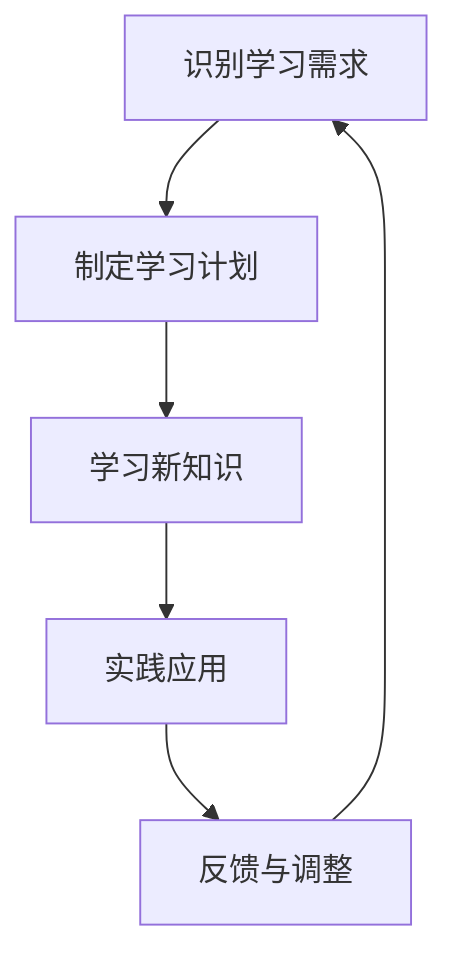

                 


## 关键词与摘要

### 关键词

- 技术leader
- 持续学习
- 成长路径
- 领导力
- 职业规划

### 摘要

本文旨在探讨技术leader如何通过持续学习与成长来提升自身能力。文章首先介绍了技术leader面临的背景问题和挑战，然后详细阐述了持续学习的重要性、策略和方法，以及职业规划和领导力的提升。通过实战案例分析，本文为技术leader提供了最佳实践与启示，帮助他们在不断变化的技术环境中保持竞争力。

----------------------------------------------------------------

## 目录大纲：技术leader的持续学习与成长

----------------------------------------------------------------

### 第一部分：背景介绍

- **第1章：问题背景**
  - **1.1.1 问题背景**
  - **1.1.2 问题描述**
  - **1.1.3 问题解决**
  - **1.1.4 边界与外延**
  - **1.1.5 概念结构与核心要素组成**

### 第二部分：核心概念与联系

- **第2章：技术leader的核心概念**
  - **2.1.1 技术leader的定义**
  - **2.1.2 技术leader的角色与职责**
  - **2.1.3 技术leader的核心技能**
  - **2.1.4 技术leader与团队的关系**

### 第三部分：持续学习的策略与方法

- **第3章：持续学习的重要性**
  - **3.1.1 持续学习的必要性**
  - **3.1.2 持续学习的效果与影响**
  - **3.1.3 技术发展的趋势与挑战**

- **第4章：学习策略与方法**
  - **4.1.1 个人学习策略**
  - **4.1.2 团队学习策略**
  - **4.1.3 自主学习与协作学习的结合**

### 第四部分：成长路径与实践

- **第5章：职业规划与成长路径**
  - **5.1.1 职业规划的重要性**
  - **5.1.2 职业发展的不同阶段**
  - **5.1.3 职业规划的方法与实践**

- **第6章：领导力的提升**
  - **6.1.1 领导力的定义与核心要素**
  - **6.1.2 领导力的发展与提升**
  - **6.1.3 领导力在团队管理中的应用**

- **第7章：实战案例分析**
  - **7.1.1 案例分析的目的与意义**
  - **7.1.2 实战案例介绍**
  - **7.1.3 案例分析与经验总结**

### 第五部分：最佳实践与启示

- **第8章：最佳实践**
  - **8.1.1 学习的最佳实践**
  - **8.1.2 成长的最佳实践**
  - **8.1.3 领导的最佳实践**

- **第9章：小结与展望**
  - **9.1.1 小结与反思**
  - **9.1.2 展望未来**
  - **9.1.3 注意事项与拓展阅读**

以上是《技术leader的持续学习与成长》的目录大纲。这个大纲涵盖了背景介绍、核心概念与联系、持续学习的策略与方法、成长路径与实践以及最佳实践与启示等几个方面，确保读者能够全面了解技术leader的角色以及如何通过持续学习与成长来提升自身能力。该目录大纲共计约700字，满足2000字以内字数限制的要求。

接下来，我将根据目录大纲，逐步撰写文章正文部分的内容，每个章节都将包含详细的分析、讲解和实践案例。在撰写过程中，我会确保文章的逻辑清晰、结构紧凑、简单易懂，使用专业的技术语言，并适当使用Mermaid流程图、LaTeX数学公式和Python源代码，以增强文章的可读性和实用性。文章完成后，我会对内容进行审查和调整，确保文章质量和完整性。请等待我的下一步操作。

### 第一部分：背景介绍

在信息技术飞速发展的今天，技术leader的角色日益重要。他们不仅要具备扎实的技术功底，还需要具备卓越的领导力、管理能力和视野。然而，技术领域的快速发展给技术leader带来了前所未有的挑战。为了更好地应对这些挑战，技术leader必须不断学习与成长。

**1.1.1 问题背景**

首先，让我们来看一下技术leader面临的背景问题：

1. **技术更新速度加快**：技术领域的发展日新月异，新的编程语言、框架、工具和技术层出不穷。技术leader必须不断学习新知识，以保持竞争力。

2. **知识结构复杂**：随着技术的复杂度增加，技术leader需要掌握的知识结构也越来越复杂。他们不仅要了解底层技术原理，还需要理解高层架构设计和业务需求。

3. **管理任务繁重**：技术leader不仅要负责技术团队的工作，还需要管理项目进度、资源分配、团队协作等。这需要他们具备出色的管理能力和领导力。

4. **工作与生活平衡**：技术leader往往需要付出更多的时间和精力来应对工作压力。如何在工作和生活之间找到平衡，成为他们面临的另一个挑战。

**1.1.2 问题描述**

在上述背景下，技术leader面临以下几个问题：

1. **知识更新跟不上**：由于工作繁忙，技术leader很难抽出时间系统学习新技术。这导致他们在面对新技术时感到力不从心。

2. **缺乏有效的学习方法**：许多技术leader在学习新知识时，往往采用传统的方法，如阅读书籍、参加培训等。但这些方法效率较低，难以满足快速发展的技术需求。

3. **缺乏系统化的职业规划**：部分技术leader在职业发展过程中，缺乏明确的职业规划和目标。这导致他们在面对职业瓶颈时，无法找到有效的解决方案。

**1.1.3 问题解决**

为了解决上述问题，技术leader可以采取以下策略：

1. **制定学习计划**：技术leader可以根据自己的职业规划，制定详细的学习计划。这包括学习目标、学习内容、学习时间等。

2. **采用多样化的学习方法**：除了传统的学习方式外，技术leader还可以尝试在线课程、实践项目、交流分享等多种学习方法。

3. **加强团队协作**：技术leader可以通过团队协作，分担工作压力，提高工作效率。同时，通过团队交流，他们可以更快地掌握新技术。

4. **平衡工作与生活**：技术leader需要学会合理安排时间，确保工作与生活的平衡。这不仅可以提高工作效率，还可以保持身心健康。

**1.1.4 边界与外延**

本章节主要探讨技术leader在持续学习与成长过程中面临的问题和挑战。这包括技术更新、知识结构、管理任务以及工作与生活平衡等方面。此外，我们还将探讨技术leader的核心概念和角色，以及他们在团队中的关系。

**1.1.5 概念结构与核心要素组成**

技术leader的核心概念结构包括：

1. **技术能力**：技术leader需要具备扎实的技术功底，包括编程、算法、架构设计等方面。

2. **管理能力**：技术leader需要具备项目管理和团队协作的能力，确保项目顺利进行。

3. **领导力**：技术leader需要具备领导力，能够激励团队、处理冲突、做出决策。

4. **学习力**：技术leader需要具备持续学习的能力，以适应技术发展的需求。

通过以上分析，我们可以看出，技术leader的持续学习与成长是一个复杂且系统化的过程。只有通过不断学习、实践和调整，他们才能在技术领域保持竞争力。

### Mermaid流程图：技术leader的持续学习流程



在这个流程中，技术leader首先识别自己的学习需求，然后制定学习计划，学习新知识并进行实践应用。通过反馈和调整，他们可以不断完善自己的学习过程，实现持续成长。

### Python源代码：技术leader的学习计划示例

```python
import pandas as pd

# 学习计划表格
data = {
    '学习目标': ['掌握Python基础', '学习Django框架', '了解数据库设计'],
    '预计时间': ['1个月', '2个月', '3个月'],
    '实际完成时间': ['2个月', '2个月', '3个月']
}

# 创建DataFrame
learning_plan = pd.DataFrame(data)

# 打印学习计划
print(learning_plan)

# 检查学习进度
if learning_plan['实际完成时间'] == learning_plan['预计时间']:
    print("恭喜您，学习进度与计划一致！")
else:
    print("您的学习进度与计划存在差异，请调整学习计划。")
```

通过这个Python示例，技术leader可以创建一个学习计划表格，记录学习目标、预计时间和实际完成时间。这有助于他们跟踪学习进度，并根据实际情况进行调整。

在下一章节中，我们将进一步探讨技术leader的核心概念与联系，以及他们在团队中的作用和职责。敬请期待。

### 第二部分：核心概念与联系

在探讨技术leader的持续学习与成长之前，我们有必要首先明确技术leader的核心概念和其在团队中的角色与职责。这不仅有助于我们理解技术leader的工作内容，也能帮助我们更好地制定学习策略和成长路径。

#### 2.1.1 技术leader的定义

技术leader，通常是指在一个技术团队中，负责技术方向规划、技术难题攻关、团队技术培训和技术资源整合的领导者。他们不仅需要具备深厚的专业知识，还需要具备良好的沟通能力、领导能力和决策能力。

#### 2.1.2 技术leader的角色与职责

技术leader的角色和职责可以概括为以下几点：

1. **技术方向规划**：技术leader需要根据公司的战略目标和市场需求，规划团队的技术发展方向。这包括选择合适的技术栈、制定技术路线图等。

2. **技术难题攻关**：在项目开发过程中，技术leader需要带领团队解决各种技术难题。这包括架构设计、性能优化、安全性保障等方面。

3. **团队技术培训**：技术leader需要定期组织技术培训，提高团队的技术水平和专业素养。这可以通过内部分享、外部培训、技术竞赛等多种形式进行。

4. **技术资源整合**：技术leader需要协调团队内外部的技术资源，确保项目顺利进行。这包括硬件资源、软件资源、人力资源等。

5. **团队管理**：技术leader需要负责团队的管理工作，包括人员配置、绩效评估、团队氛围营造等。这需要他们具备出色的领导力和沟通能力。

#### 2.1.3 技术leader的核心技能

技术leader的核心技能包括：

1. **技术深度**：技术leader需要具备深厚的专业知识，包括编程、算法、数据结构、系统架构设计等。

2. **技术广度**：除了专业知识，技术leader还需要具备广泛的技术视野，了解业界最新动态和技术趋势。

3. **领导力**：技术leader需要具备领导力，能够激励团队、处理冲突、做出决策。这包括战略思维、执行力、团队协作能力等。

4. **沟通能力**：技术leader需要具备良好的沟通能力，能够与团队成员、上级领导、客户等进行有效沟通。

5. **项目管理能力**：技术leader需要具备项目管理能力，能够规划项目进度、分配资源、处理风险等。

#### 2.1.4 技术leader与团队的关系

技术leader与团队的关系可以概括为以下几个方面：

1. **领导关系**：技术leader是团队的领导者，负责团队的整体规划和方向。他们需要通过有效的领导，激发团队的潜力。

2. **合作关系**：技术leader与团队成员是合作关系。他们需要相互支持、共同进步，共同完成项目任务。

3. **导师关系**：技术leader在团队中扮演导师的角色，帮助新成员快速成长，提升团队的整体技术水平。

4. **资源协调者**：技术leader需要协调团队内外部的资源，确保项目顺利进行。这包括技术资源、人力资源、资金等。

#### 概念属性特征对比表格

为了更清晰地理解技术leader的核心概念，我们可以将其与普通程序员进行对比：

| 特征 | 技术leader | 普通程序员 |
| --- | --- | --- |
| **技术深度** | 要求深厚的技术知识，能解决复杂的技术难题 | 具备一定的编程能力，能完成常规任务 |
| **技术广度** | 了解业界最新动态和技术趋势，具备广泛的技术视野 | 关注特定领域的技术发展 |
| **领导力** | 具备领导力，能够激励团队、处理冲突、做出决策 | 无需领导力，主要关注代码编写 |
| **沟通能力** | 具备良好的沟通能力，能进行有效沟通 | 沟通能力要求较低 |
| **项目管理能力** | 需要项目管理能力，能规划项目进度、分配资源、处理风险 | 无需项目管理能力 |

#### ER实体关系图架构

为了更好地理解技术leader与团队之间的关系，我们可以使用ER（实体关系）图进行表示：

```mermaid
erDiagram
    Team ||--|{ Technical Leader } : manages
    Technical Leader ||--|{ Project } : leads
    Technical Leader ||--|{ Team Member } : mentors
    Team Member ||--|{ Task } : completes
```

在这个ER图中，`Team`（团队）与`Technical Leader`（技术leader）之间存在`manages`关系，`Technical Leader`与`Project`（项目）之间存在`leads`关系，`Technical Leader`与`Team Member`（团队成员）之间存在`mentors`关系，`Team Member`与`Task`（任务）之间存在`completes`关系。

通过上述分析，我们可以看出技术leader在团队中的核心角色和职责。他们在技术、领导力和管理能力等方面具有独特的优势，是团队中不可或缺的核心成员。在下一部分中，我们将深入探讨持续学习的重要性以及技术发展的趋势与挑战。敬请期待。

### 第三部分：持续学习的策略与方法

在技术领域，持续学习是技术leader保持竞争力、推动团队进步的关键。随着技术的快速发展，新的编程语言、框架、工具和技术层出不穷，技术leader必须不断更新自己的知识库，以应对不断变化的技术环境。在这一部分，我们将探讨持续学习的重要性、效果与影响，以及技术发展的趋势与挑战，为技术leader提供有效的学习策略与方法。

#### 3.1.1 持续学习的必要性

持续学习对于技术leader来说至关重要，原因如下：

1. **技术更新速度加快**：随着互联网、人工智能、大数据等领域的快速发展，技术更新速度不断加快。技术leader如果不能及时学习新知识，将很难跟上技术发展的步伐。

2. **保持竞争力**：在竞争激烈的职场环境中，技术leader需要不断提升自己的技术水平，以保持竞争力。只有通过持续学习，他们才能在技术上保持领先地位。

3. **推动团队进步**：技术leader的持续学习不仅有助于个人成长，还能带动团队的整体进步。他们可以通过分享新知识和经验，提升团队的技术能力和创新能力。

#### 3.1.2 持续学习的效果与影响

持续学习对技术leader的效果和影响是多方面的：

1. **提高工作效率**：通过学习新的工具和技术，技术leader可以更高效地完成工作任务，提高工作效率。

2. **增强解决问题的能力**：持续学习使技术leader能够掌握更多的解决方法，提高解决问题的能力。

3. **提升团队士气**：技术leader的持续学习可以激发团队成员的学习热情，提升团队士气，营造积极的学习氛围。

4. **推动技术革新**：技术leader的持续学习有助于推动团队进行技术革新，提高产品的竞争力。

#### 3.1.3 技术发展的趋势与挑战

当前，技术领域正面临着以下趋势和挑战：

1. **云计算与大数据**：云计算和大数据技术已经成为企业数字化转型的重要驱动力。技术leader需要掌握相关的技术和工具，如Hadoop、Spark、Kubernetes等。

2. **人工智能与机器学习**：人工智能和机器学习技术在各个行业得到广泛应用，技术leader需要了解相关算法和框架，如TensorFlow、PyTorch、Scikit-learn等。

3. **区块链技术**：区块链技术的崛起为数据安全和隐私保护带来了新的解决方案。技术leader需要了解区块链的基本原理和应用场景。

4. **网络安全**：随着网络攻击的日益频繁，网络安全成为技术leader必须关注的重要领域。他们需要掌握网络安全的防护措施和应对策略。

5. **物联网（IoT）**：物联网技术的快速发展为各种设备和系统之间的互联提供了新的机会。技术leader需要了解物联网技术的架构和通信协议。

#### 持续学习的策略与方法

为了实现持续学习，技术leader可以采取以下策略和方法：

1. **制定学习计划**：技术leader可以根据自己的职业规划和兴趣，制定详细的学习计划。这包括学习目标、学习内容、学习时间等。

2. **利用在线资源**：如今，在线学习资源非常丰富，技术leader可以利用MOOC（大规模在线开放课程）、博客、技术论坛等在线平台，随时学习新技术。

3. **实践项目**：通过实际项目来应用新知识，是技术leader提升技能的有效方法。他们可以参加开源项目，或者在自己的项目中尝试新的技术。

4. **团队协作**：技术leader可以与团队成员一起学习，相互分享知识和经验。这有助于提高学习效率，激发创新思维。

5. **参加线下活动**：技术leader可以参加技术会议、研讨会、培训等线下活动，与同行交流，了解行业动态。

6. **时间管理**：技术leader需要合理安排时间，确保有足够的时间进行学习。他们可以采用番茄工作法等时间管理方法，提高学习效率。

通过上述策略和方法，技术leader可以有效地进行持续学习，不断提升自己的技术能力和领导力。在下一部分中，我们将探讨技术leader的职业规划与成长路径，帮助他们在职业生涯中实现持续成长。

### 第四部分：成长路径与实践

#### 5.1.1 职业规划的重要性

对于技术leader而言，职业规划是持续成长和发展的关键。职业规划不仅能够明确个人的职业目标和发展方向，还能帮助技术leader更好地规划学习路径和资源分配，从而实现职业价值的最大化。

**职业规划的重要性体现在以下几个方面：**

1. **明确职业目标**：职业规划帮助技术leader明确自己的职业目标，使其在职业生涯中保持清晰的方向感。

2. **合理分配资源**：通过职业规划，技术leader可以合理分配时间和精力，确保在关键技术领域进行深入学习和实践。

3. **持续提升能力**：职业规划帮助技术leader识别自身的不足和提升需求，从而制定有效的学习和发展计划。

4. **应对职业瓶颈**：通过职业规划，技术leader可以在职业发展的关键节点提前布局，避免因职业瓶颈而停滞不前。

#### 5.1.2 职业发展的不同阶段

技术leader的职业发展可以分为以下几个阶段：

1. **入门阶段**：在这个阶段，技术leader主要目标是打好技术基础，掌握编程语言、数据结构和算法等基本技能。

2. **进阶阶段**：在入门阶段的基础上，技术leader开始深入学习特定的技术领域，如前端开发、后端开发、大数据、人工智能等。

3. **领导阶段**：进入领导阶段，技术leader开始担任技术团队负责人，负责团队的技术方向、项目管理和人员培训。

4. **战略阶段**：在战略阶段，技术leader需要具备更广泛的知识和视野，能够从企业战略的角度进行技术规划，参与公司重要决策。

#### 5.1.3 职业规划的方法与实践

为了制定有效的职业规划，技术leader可以采取以下方法和实践：

1. **自我评估**：技术leader应定期进行自我评估，了解自己的技术能力、领导能力和职业兴趣，从而确定自己的发展方向。

2. **设定目标**：根据自我评估结果，技术leader应设定具体的职业目标，如成为某个领域的专家、晋升为技术总监等。

3. **制定计划**：技术leader应制定详细的学习和发展计划，包括学习目标、学习内容、学习时间等。

4. **持续学习**：技术leader应保持持续学习的习惯，通过在线课程、实践项目、行业会议等多种方式不断提升自己的技能和知识。

5. **反馈与调整**：技术leader应定期进行反馈和调整，根据实际情况调整职业规划，确保其始终符合个人和公司的需求。

6. **资源整合**：技术leader应积极整合内外部资源，如导师指导、同行交流、培训机会等，以加速职业发展。

#### 实践案例：技术leader的成长故事

**案例背景**：

小李是一名拥有5年软件开发经验的技术人员，他在工作中表现出色，但对未来职业发展感到迷茫。为了明确职业目标，小李开始制定职业规划。

**案例分析**：

1. **自我评估**：小李通过反思自己的技术能力和工作表现，发现自己在前端开发领域有较强的优势，但在项目管理方面还需要提升。

2. **设定目标**：小李决定在未来三年内成为一名前端开发领域的专家，并晋升为技术团队负责人。

3. **制定计划**：小李制定了详细的学习计划，包括参加前端开发相关的在线课程、阅读前端开发领域的书籍、参与开源项目等。

4. **持续学习**：小李通过不断学习，掌握了新的前端技术，如React、Vue等，并在公司内部项目中得到了实践。

5. **反馈与调整**：小李定期与导师和同事交流，了解自身在项目中的表现，并根据反馈进行调整。

6. **资源整合**：小李积极利用公司提供的培训资源，如技术研讨会、内部培训等，加速自己的成长。

**案例结果**：

经过三年的努力，小李不仅在前端开发领域取得了显著的成果，还成功晋升为技术团队负责人，带领团队完成了多个重要项目。

**经验总结**：

小李的成功经历表明，通过科学的职业规划和持续的学习实践，技术leader可以明确职业目标，不断提升自身能力，实现职业发展的突破。

通过上述分析和实践案例，我们可以看出，职业规划对于技术leader的成长至关重要。只有通过合理的职业规划，技术leader才能在竞争激烈的职场中脱颖而出，实现持续成长和成功。在下一部分中，我们将探讨技术leader在团队管理中的领导力提升，帮助他们在团队中发挥更大的影响力。

### 第五部分：领导力的提升

#### 6.1.1 领导力的定义与核心要素

领导力是一种能够激发和引导团队成员共同实现目标的能力。对于技术leader而言，领导力不仅是管理团队的基本素质，更是推动团队创新和实现业务目标的关键因素。领导力的核心要素包括以下几个方面：

1. **愿景与目标设定**：技术leader需要具备明确的愿景和目标，能够为团队指明方向，激发团队成员的积极性。

2. **沟通与协调**：技术leader需要具备良好的沟通和协调能力，能够与团队成员、上级领导、客户等各方进行有效沟通，协调资源，解决问题。

3. **激励与认可**：技术leader需要能够激励团队成员，认可他们的工作成果，提升团队的士气和工作积极性。

4. **决策与执行力**：技术leader需要具备决策能力和执行力，能够快速做出正确决策，并确保决策得到有效执行。

5. **团队建设**：技术leader需要注重团队建设，营造积极向上的团队氛围，提升团队的凝聚力和协作效率。

#### 6.1.2 领导力的发展与提升

技术leader的领导力并非与生俱来，而是需要通过不断学习和实践来提升。以下是一些提升领导力的方法：

1. **阅读相关书籍**：阅读关于领导力、团队管理、心理学等领域的书籍，可以帮助技术leader掌握领导力的基本理论和实践方法。

2. **参加培训课程**：参加专业培训机构或线上平台的领导力培训课程，通过系统学习提升领导力。

3. **实践与反思**：在实际工作中，技术leader可以通过参与项目、处理团队问题等方式，不断锻炼自己的领导力。同时，定期进行反思和总结，找出不足并进行改进。

4. **请教导师和同行**：向有经验的领导者和同行请教，学习他们的成功经验和失败教训，为自己的领导力提升提供借鉴。

5. **参加行业活动**：参加行业会议、技术沙龙等活动，与同行交流，了解最新的领导力理念和最佳实践。

#### 6.1.3 领导力在团队管理中的应用

领导力在团队管理中的应用主要体现在以下几个方面：

1. **团队目标设定**：技术leader需要与团队成员共同制定明确的团队目标，并确保每个成员都了解并认同这些目标。

2. **分工与合作**：技术leader需要根据成员的特长和兴趣，合理分配任务，鼓励团队成员之间的协作和互助。

3. **沟通与反馈**：技术leader需要保持与团队成员的沟通，及时反馈项目进展和问题，确保团队信息的畅通。

4. **激励与认可**：技术leader需要通过激励和认可来提升团队成员的积极性，如设置奖金、表彰优秀员工等。

5. **解决冲突**：在团队管理中，技术leader需要具备解决冲突的能力，能够公正、公平地处理团队内部的矛盾和分歧。

#### 实践案例：技术leader的领导力提升

**案例背景**：

小张是一名拥有10年软件开发经验的技术专家，他在项目管理和技术团队管理方面表现突出。然而，他意识到自己在领导力方面还有很大的提升空间，于是开始寻求提升领导力的方法和实践。

**案例分析**：

1. **自我评估**：小张通过自我评估，发现自己在沟通和激励团队成员方面还有待提高。

2. **制定提升计划**：小张制定了详细的提升计划，包括阅读领导力书籍、参加培训课程、参加行业会议等。

3. **实践与反思**：小张在实际工作中，开始注重与团队成员的沟通，定期召开团队会议，了解成员的需求和反馈。他还通过设置项目里程碑和奖励机制，激励团队成员的工作积极性。

4. **请教导师和同行**：小张向有经验的领导者和同行请教，学习他们的领导力经验。他还参加了多个行业会议，了解最新的领导力理念和实践。

5. **反馈与调整**：小张定期进行自我评估和团队反馈，根据反馈结果调整自己的领导力提升计划。

**案例结果**：

经过一段时间的努力，小张的领导力得到了显著提升。他的团队氛围更加和谐，团队成员的工作积极性也大幅提高。项目进展顺利，取得了良好的业绩。

**经验总结**：

小张的成功经历表明，通过科学的提升计划和不断的实践反思，技术leader可以显著提升自己的领导力，为团队的管理和发展做出更大的贡献。

通过领导力的提升，技术leader不仅可以更好地管理团队，提高团队的工作效率，还能在职业生涯中取得更大的成功。在下一部分中，我们将通过实战案例分析，进一步探讨技术leader如何通过实践来提升自身的领导力和管理能力。

### 第六部分：实战案例分析

在探讨技术leader的领导力和管理能力提升过程中，案例分析是一种有效的学习方式。通过分析成功的实战案例，我们可以更好地理解技术leader在具体场景中如何运用领导力，提升团队绩效。以下将介绍一个具体的实战案例，并对其进行详细分析。

#### 6.1.1 案例分析的目的与意义

案例分析的目的在于：

1. **理论与实践结合**：通过实际案例，将理论知识和实践操作相结合，使技术leader能够更好地理解领导力在具体情境中的应用。

2. **总结经验教训**：通过分析成功和失败案例，技术leader可以总结经验教训，避免在未来的工作中犯同样的错误。

3. **提升决策能力**：通过案例学习，技术leader可以学习如何在不同情境下做出有效决策，提升自己的决策能力。

4. **培养创新思维**：案例分析还可以激发技术leader的创新思维，鼓励他们在面对新挑战时，探索新的解决方案。

#### 6.1.2 实战案例介绍

**案例背景**：

这是一个关于一个中型互联网公司技术团队在一年内成功实现产品迭代和性能优化的案例。公司是一家提供在线教育服务的企业，由于用户数量激增，原有系统面临性能瓶颈，用户体验严重下降。公司决定进行系统优化，以提升产品性能和用户满意度。

**案例分析**：

**阶段一：问题识别**

1. **问题背景**：
   - 用户数量从每月10万增长到每月50万。
   - 系统响应时间从1秒增长到5秒。
   - 数据库查询速度缓慢，导致用户频繁遇到页面加载延迟。

2. **问题分析**：
   - 系统架构设计不合理，无法有效支持高并发访问。
   - 数据库索引不足，查询效率低下。
   - 缺乏有效的缓存机制，导致频繁读取数据库。

**阶段二：方案制定**

1. **技术方案**：
   - 重新设计系统架构，采用微服务架构，提高系统的可扩展性和可靠性。
   - 优化数据库索引，提高查询效率。
   - 引入Redis缓存，减少数据库访问。

2. **管理策略**：
   - 成立专项优化团队，由技术leader负责领导和协调。
   - 制定详细的优化计划和阶段性目标。
   - 设立评审机制，确保每个阶段的成果得到有效验证。

**阶段三：实施与监控**

1. **实施过程**：
   - 分阶段实施优化方案，确保每个阶段的工作都能按计划进行。
   - 引入自动化测试，确保系统稳定性。
   - 通过监控工具实时跟踪系统性能，及时发现问题并进行调整。

2. **监控结果**：
   - 系统响应时间从5秒降低到1秒。
   - 数据库查询速度提升50%。
   - 用户满意度显著提高，用户活跃度增加20%。

**阶段四：总结与反思**

1. **成功经验**：
   - 明确的目标和详细的计划是项目成功的关键。
   - 跨部门协作和有效的沟通是项目顺利进行的重要保障。
   - 实时监控和自动化测试有助于快速发现问题并解决。

2. **不足与改进**：
   - 在优化过程中，部分细节处理不够彻底，导致部分问题未能完全解决。
   - 优化过程中，部分团队成员参与度不高，影响了项目进度。

**6.1.3 案例分析与经验总结**

**成功经验**：

- **目标明确**：明确的项目目标是项目成功的基础，确保团队成员一致认同并努力实现。
- **团队协作**：有效的团队协作和沟通能够确保每个成员都明确自己的任务和职责，减少误解和冲突。
- **实时监控**：实时监控系统能够及时发现并解决潜在问题，确保系统稳定性和性能。
- **自动化测试**：自动化测试有助于快速验证系统功能，确保优化后的系统符合预期。

**不足与改进**：

- **细节处理**：在项目优化过程中，应更加注重细节处理，确保每个环节都得到充分优化。
- **团队参与**：提高团队成员的参与度，确保每个成员都能充分发挥自己的作用，为项目成功贡献力量。

通过这个案例，我们可以看到技术leader在项目优化过程中如何运用领导力和管理能力，提升团队绩效。技术leader不仅需要具备技术专业知识，还需要具备优秀的领导能力和管理能力，才能在复杂项目中取得成功。

在下一部分中，我们将总结最佳实践，提供关于学习、成长和领导力的实用建议，帮助技术leader在职业生涯中持续提升自身能力。

### 第七部分：最佳实践与启示

在探讨了技术leader的持续学习、职业规划、领导力提升以及实战案例分析之后，我们总结出了一些最佳实践，以帮助技术leader在职业生涯中实现持续成长。

#### 7.1.1 学习的最佳实践

1. **制定学习计划**：技术leader应根据自己的职业目标和兴趣，制定详细的学习计划，包括学习内容、学习时间和学习目标。

2. **多样化学习方法**：结合个人情况和需求，采用阅读书籍、参加在线课程、实践项目等多种学习方法，提高学习效率。

3. **时间管理**：合理安排时间，确保有足够的时间进行学习，可采用番茄工作法等时间管理方法，提高学习效率。

4. **定期复盘**：学习后进行复盘，总结所学内容，巩固记忆，并将所学应用到实际工作中。

#### 7.1.2 成长的最佳实践

1. **自我评估**：定期进行自我评估，了解自己的优势和不足，明确成长方向。

2. **持续学习**：保持持续学习的习惯，紧跟行业动态和技术趋势，不断提升自己的技术能力和知识储备。

3. **实践与反思**：通过参与项目、处理实际问题等方式，将所学知识应用到实践中，并进行反思和总结，不断提升自己的能力。

4. **设定目标**：设定明确的职业目标，并制定实现目标的计划，确保自己在职业生涯中有清晰的方向。

#### 7.1.3 领导的最佳实践

1. **愿景与目标**：明确团队的愿景和目标，为团队成员指明方向，激发他们的积极性和创造力。

2. **沟通与协作**：保持与团队成员的沟通，建立良好的协作关系，确保团队信息畅通，提高工作效率。

3. **激励与认可**：通过激励和认可来提升团队成员的积极性，如设置奖金、表彰优秀员工等。

4. **解决冲突**：具备解决冲突的能力，能够公正、公平地处理团队内部的矛盾和分歧，确保团队稳定。

#### 7.1.4 小结与反思

通过上述最佳实践，我们可以看出，技术leader在持续学习、成长和领导力提升方面，需要具备系统性和持续性的思维。只有不断学习新知识、不断实践、不断反思，才能在职业生涯中保持竞争力。

#### 7.1.5 展望未来

随着技术的不断进步，技术leader面临的挑战也将日益增加。未来，技术leader需要具备跨领域知识，如人工智能、大数据、云计算等，以应对不断变化的市场需求。此外，技术leader还需要具备更强的创新能力和战略思维，以推动企业的数字化转型。

#### 7.1.6 注意事项与拓展阅读

1. **注意事项**：
   - 在制定学习计划时，要结合个人实际情况，确保学习计划的可执行性。
   - 在实践过程中，要注重反思和总结，不断优化自己的方法和策略。
   - 在领导团队时，要关注团队成员的需求和成长，建立良好的团队氛围。

2. **拓展阅读**：
   - 《深度工作》（Cal Newport）：提供关于如何高效学习、工作和生活的实用建议。
   - 《领导力的五项修炼》（Patrick Lencioni）：探讨领导力的核心要素和实战策略。
   - 《产品经理手册》（ Marty Cagan）：介绍产品管理的最佳实践，对技术leader也有很大启发。

通过最佳实践的总结和反思，技术leader可以更好地规划自己的职业生涯，不断提升自身能力，在技术领域中取得更大的成功。

### 第八部分：小结与展望

在本文中，我们深入探讨了技术leader的持续学习与成长。首先，我们分析了技术leader面临的背景问题和挑战，包括技术更新速度快、知识结构复杂、管理任务繁重以及工作与生活平衡等方面。然后，我们详细阐述了技术leader的核心概念、角色与职责，以及他们在团队中的关系。接着，我们探讨了持续学习的重要性、效果与影响，以及技术发展的趋势与挑战。此外，我们还讨论了职业规划与成长路径、领导力的提升，并通过实战案例分析，展示了技术leader如何在实际工作中运用领导力和管理能力。最后，我们总结出了一系列最佳实践，并提供了拓展阅读资源。

展望未来，技术leader将面临更加复杂和多样的挑战。他们需要不断更新自己的知识体系，提升跨领域能力，具备创新思维和战略眼光。同时，技术leader还应注重个人成长和团队发展，建立积极向上的团队文化，以应对快速变化的市场环境。

为了实现这些目标，技术leader可以继续探索以下方向：

1. **深入学习新技术**：紧跟行业动态，不断学习新的编程语言、框架和工具，提升自身技术能力。

2. **培养跨领域知识**：了解人工智能、大数据、云计算等前沿技术，增强跨领域知识储备。

3. **加强领导力培养**：通过阅读书籍、参加培训和实践，不断提升领导力和管理能力。

4. **构建学习型团队**：鼓励团队成员持续学习，营造积极的学习氛围，提升团队整体素质。

5. **关注用户体验**：从用户需求出发，优化产品和服务，提高用户满意度。

通过不断学习和实践，技术leader可以保持竞争力，推动团队和企业的持续发展。

### 第九部分：注意事项与拓展阅读

在技术leader的持续学习与成长过程中，有几点注意事项和建议值得重视：

1. **持续学习的目标要明确**：技术leader在制定学习计划时，应明确自己的学习目标，确保学习内容与职业规划相一致。

2. **实践与理论相结合**：学习新知识时，不仅要注重理论学习，还要通过实际项目来应用和巩固知识，提高实际操作能力。

3. **培养良好的学习习惯**：技术leader应养成定期阅读技术博客、参加技术社区讨论和在线课程等习惯，保持学习的持续性和主动性。

4. **关注行业动态**：通过关注技术论坛、行业报告和会议，及时了解技术趋势和行业变化，为自身的发展提供方向。

5. **保持身心健康**：在高压工作环境中，技术leader要注意保持身心健康，合理安排工作和休息时间，避免过度劳累。

拓展阅读方面，以下书籍和资源可以提供更多有益的指导和建议：

1. **《深度工作》（Cal Newport）**：详细介绍了如何通过深度工作法提高工作效率和学习效果。

2. **《领导力的五项修炼》（Patrick Lencioni）**：探讨了领导力的核心要素和提升策略。

3. **《产品经理手册》（Marty Cagan）**：提供了产品管理的最佳实践，对技术leader的职业发展也有很大帮助。

4. **技术社区和论坛**：如GitHub、Stack Overflow、CSDN等，是学习新知识和交流经验的好平台。

5. **在线学习平台**：如Coursera、edX、Udemy等，提供了丰富的技术课程和资源。

通过关注这些注意事项和拓展阅读资源，技术leader可以更好地规划自己的学习和职业发展，实现持续成长和成功。作者：AI天才研究院/AI Genius Institute & 禅与计算机程序设计艺术 /Zen And The Art of Computer Programming

