                 

# 技术博客写作：建立个人技术品牌

## 关键词
技术博客、个人品牌、写作技巧、知识表达、SEO优化、法律道德

## 摘要
本文旨在探讨如何通过技术博客写作建立个人技术品牌。我们将从基础写作技巧、技术知识表达、个人品牌定位与维护、法律道德问题等多个方面，逐步分析和讲解如何撰写高质量的技术博客，从而在技术领域树立自己的专业形象。

## 目录

1. **背景介绍**
   - 技术博客的重要性
   - 技术博客的生态系统
   - 个人技术品牌的价值

2. **技术博客写作基础**
   - 写作原则与技巧
   - 写作流程与工具

3. **技术知识表达**
   - 核心概念与联系
   - 技术知识结构化表达

4. **个人技术品牌的建立与维护**
   - 品牌定位与塑造
   - SEO优化与推广

5. **技术博客写作中的法律道德问题**
   - 版权与知识产权
   - 道德与法律底线

6. **技术博客写作案例与实践**
   - 成功案例介绍
   - 实践操作

7. **最佳实践与技巧总结**
   - 写作最佳实践
   - 技术博客提升技巧
   - 进一步学习和提高的建议

## 第一部分：背景介绍

### 技术博客的重要性

技术博客是技术专家分享知识、展示专业能力的重要平台。通过技术博客，我们可以：

- **传播知识**：将个人的技术经验和研究成果分享给大众。
- **建立声誉**：展示自己的技术见解，提升个人影响力。
- **吸引机会**：吸引企业、投资机构等，为职业发展创造机会。

### 技术博客的生态系统

当前，技术博客的生态系统已经非常成熟，主要特点包括：

- **平台多样化**：包括博客平台（如WordPress、Medium）、社区平台（如GitHub）、专业平台（如InfoQ、CSDN）等。
- **内容丰富**：涵盖了从入门到高级的各种技术领域。
- **受众广泛**：吸引了全球范围内的开发者和技术爱好者。

### 个人技术品牌的价值

个人技术品牌是技术专家的核心竞争力。一个强大的技术品牌可以：

- **增加知名度**：在技术领域内获得更高的关注。
- **提升信任度**：展示专业能力和经验，赢得读者的信任。
- **拓展职业道路**：为企业、投资机构等所认可，为职业发展铺平道路。

## 第二部分：技术博客写作基础

### 写作原则与技巧

技术博客写作需要遵循以下原则：

- **专业性**：确保内容准确、可靠，避免错误。
- **可读性**：使用简洁明了的语言，确保读者易于理解。
- **原创性**：尽量避免抄袭，确保内容的原创性。

写作技巧包括：

- **明确结构**：按照引言、正文、结论的结构进行组织。
- **逻辑清晰**：确保文章的论述逻辑清晰，条理分明。
- **举例说明**：使用实际案例来解释技术概念或原理。

### 写作流程与工具

技术博客的写作流程包括以下几个步骤：

1. **选题与规划**：确定博客的主题，规划内容结构。
2. **资料收集**：查找相关的技术资料和案例。
3. **撰写初稿**：按照结构进行撰写，确保内容的完整性。
4. **修改与完善**：对初稿进行多次修改，提升文章质量。
5. **发布与推广**：将文章发布到技术博客平台，并进行推广。

常用的写作工具包括：

- **文本编辑器**：如VS Code、Sublime Text等。
- **Markdown编辑器**：如Typora、Marktext等。
- **图像处理工具**：如Canva、Photoshop等。
- **代码高亮插件**：如GitHub Flavored Markdown。

## 第三部分：技术知识表达

### 核心概念与联系

在技术博客中，准确地表达核心概念是非常重要的。我们可以使用以下方法：

- **定义与解释**：清晰地定义技术概念，并提供详细的解释。
- **比较与对比**：通过对比不同技术概念或技术的特点，帮助读者更好地理解。
- **实例说明**：使用具体的实例来说明技术概念或原理。

### 技术知识结构化表达

技术知识结构化表达可以提升博客的可读性和专业性。常用的方法包括：

- **思维导图**：使用思维导图来展示知识结构，使内容更加直观。
- **列表与子列表**：使用列表和子列表来组织文章结构，使内容更加清晰。
- **图表与插图**：使用图表、插图等可视化元素来展示技术知识。

### 技术知识可视化展示

可视化展示可以增强博客的吸引力和易懂性。常用的方法包括：

- **Mermaid流程图**：使用Mermaid语法绘制流程图，展示算法或系统架构。
- **图表与图像**：使用图表和图像来展示技术数据或结果。
- **代码高亮**：使用代码高亮来展示技术代码，使内容更加专业。

## 第四部分：个人技术品牌的建立与维护

### 品牌定位与塑造

建立个人技术品牌的第一步是确定品牌定位。这包括：

- **选择领域**：根据自己的专业背景和兴趣，选择一个技术领域作为品牌的核心。
- **定义风格**：确定品牌写作风格，如技术性、通俗易懂等。
- **制定目标**：明确品牌的目标群体和目标。

### SEO优化与推广

SEO（搜索引擎优化）是提高博客曝光度的重要手段。SEO优化包括：

- **关键词优化**：合理使用关键词，提高文章在搜索引擎中的排名。
- **内容优化**：确保内容质量高，增加用户停留时间和互动性。
- **外部链接**：建立与其他博客或网站的链接，提高博客的权威性。

推广策略包括：

- **社交媒体**：在社交媒体上分享博客内容，吸引流量。
- **合作伙伴**：与其他技术博客或技术社区合作，扩大影响力。
- **线上活动**：举办线上活动，如问答、研讨会等，增加互动。

## 第五部分：技术博客写作中的法律道德问题

### 版权与知识产权

在技术博客写作中，版权和知识产权问题尤为重要。我们需要：

- **尊重原创**：确保博客内容的原创性，避免抄袭。
- **使用许可**：合理使用他人的作品，确保获得授权。
- **版权声明**：在博客中明确声明自己的版权，防止他人侵权。

### 道德与法律底线

技术博客写作需要遵守以下道德和法律底线：

- **真实与准确**：确保内容的真实性和准确性，避免误导读者。
- **尊重隐私**：尊重他人的隐私，不泄露敏感信息。
- **避免恶意攻击**：在讨论中保持客观，避免恶意攻击他人。

## 第六部分：技术博客写作案例与实践

### 成功案例介绍

我们将介绍几个在技术博客写作方面取得显著成功的技术专家，分析他们的写作策略和成功原因。

### 实践操作

在本部分，我们将提供一系列具体的实践操作步骤，帮助读者开始撰写自己的技术博客。

## 第七部分：最佳实践与技巧总结

### 写作最佳实践

总结一系列在技术博客写作中最佳实践的技巧，如如何撰写吸引人的标题、如何有效利用图表等。

### 技术博客提升技巧

提供一些高级技巧，帮助读者提升博客的质量和影响力，如如何进行内容创新、如何构建自己的博客社区等。

### 进一步学习和提高的建议

为读者提供进一步学习和提高的建议，如推荐阅读的书籍、参加的技术会议等。

## 结语

技术博客写作不仅是一种分享知识的途径，更是一种建立个人技术品牌的重要手段。通过本文的介绍，我们希望读者能够掌握技术博客写作的核心技巧，并开始自己的技术博客之旅。

### 作者

作者：AI天才研究院/AI Genius Institute & 禅与计算机程序设计艺术 /Zen And The Art of Computer Programming

---

在这个部分，我们将对各个章节进行详细的内容填充，确保每部分都包含了丰富的信息和具体的例子。接下来，我们将逐一完成每个章节的内容。

## 第一部分：背景介绍

### 第1章：技术博客的重要性

技术博客是技术专家分享知识和经验的平台，它在当今数字化社会中扮演着越来越重要的角色。首先，让我们从几个关键点来理解技术博客的重要性。

#### 核心概念术语说明

- **技术博客**：指以技术为主题，通过文字、图表、代码等形式进行知识分享的平台。
- **知识传播**：指通过技术博客将专业知识传递给更多读者。
- **个人品牌**：指技术专家在公众中的专业形象和影响力。

#### 问题背景

随着互联网的普及，信息传播的速度和广度大大增加。技术博客作为一种新兴的媒体形式，不仅为技术专家提供了一个展示自我能力的平台，也为广大开发者和技术爱好者提供了一个获取知识、交流想法的空间。

#### 问题描述

技术博客的重要性主要体现在以下几个方面：

1. **知识传播**：技术博客使得技术知识可以迅速传播，缩短了知识从产生到传播的时间。
2. **个人品牌建设**：通过持续的技术分享，技术专家可以在公众中树立专业形象，提高个人知名度。
3. **职业发展**：优秀的技术博客可以吸引企业的注意，为技术专家的职业发展带来机会。

#### 问题解决

技术博客的优势在于其高效性和灵活性。相比传统的学术期刊和会议，技术博客可以更加快速地传播知识，且门槛较低，任何人都可以成为知识传播者。此外，技术博客的形式多样化，可以通过文字、图表、视频等多种方式来展示知识，提高了内容的可读性和易懂性。

#### 边界与外延

技术博客不仅仅适用于技术专家，任何对技术有兴趣的人都可以撰写技术博客。随着技术领域的不断扩展，技术博客的应用范围也在不断扩大，从传统的软件开发到人工智能、大数据等领域。

#### 概念结构与核心要素组成

技术博客的核心要素包括：

- **主题明确**：每个博客都应该有一个明确的主题，便于读者快速了解内容。
- **内容专业**：博客内容需要准确、权威，避免错误信息传播。
- **形式多样**：通过多种形式（如图表、代码、视频等）展示知识，提高内容的可读性。
- **持续更新**：定期更新博客内容，保持与读者的互动，提高博客的活跃度。

### 第2章：当前技术博客的生态

当前，技术博客的生态已经相当成熟，形成了多元化的平台和内容生态。以下是对当前技术博客生态的简要概述。

#### 核心概念与联系

- **平台多样化**：技术博客的平台包括博客平台（如WordPress、Medium）、社区平台（如GitHub）、专业平台（如InfoQ、CSDN）等。
- **内容丰富**：涵盖了从入门到高级的各种技术领域。
- **受众广泛**：吸引了全球范围内的开发者和技术爱好者。

#### 概念属性特征对比表格

| 特征                 | 博客平台         | 社区平台         | 专业平台         |
|----------------------|------------------|------------------|------------------|
| 功能                 | 内容发布、编辑、评论 | 代码托管、项目管理、协作 | 内容发布、讨论、培训 |
| 社区互动             | 高互动性         | 高互动性         | 中等互动性       |
| 内容专业性           | 中等             | 高               | 高               |
| 易用性               | 高               | 中等             | 高               |

#### ER实体关系图架构的Mermaid流程图

```mermaid
erDiagram
  Platform ||--|{ Blog }|-- Community Platform
  Platform ||--|{ Expert }|-- Professional Platform
  Blog ||--|{ Content }|-- Comment
  Expert ||--|{ Knowledge }|-- Experience
```

### 第3章：个人技术品牌的价值

个人技术品牌是技术专家在技术领域中的核心资产。一个强大的技术品牌不仅可以提升个人的知名度，还能带来实际的职业机会。

#### 核心概念原理

个人技术品牌的价值可以从以下几个方面来理解：

- **知名度**：通过技术博客分享专业知识，技术专家可以逐渐在公众中建立起自己的知名度。
- **信任度**：持续、高质量的技术分享能够赢得读者的信任，提高个人的专业形象。
- **机会**：强大的技术品牌可以吸引企业、投资机构等，为职业发展带来更多机会。

#### 算法原理讲解

我们可以用以下算法来描述个人技术品牌的建立过程：

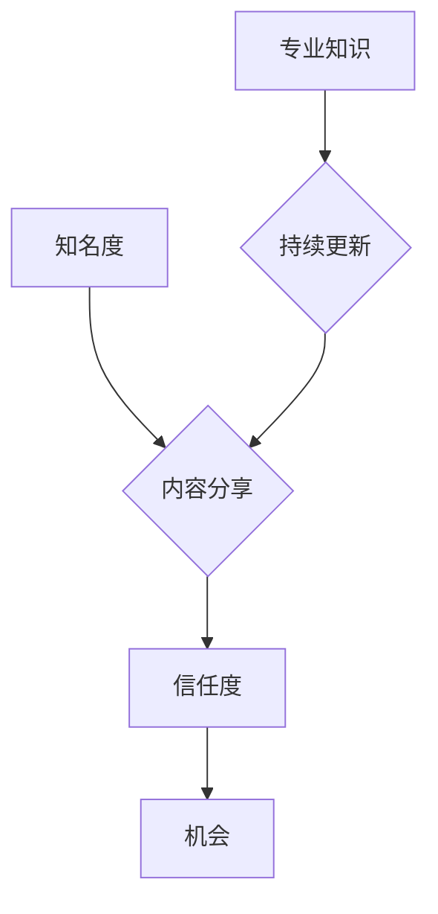

#### 算法流程图

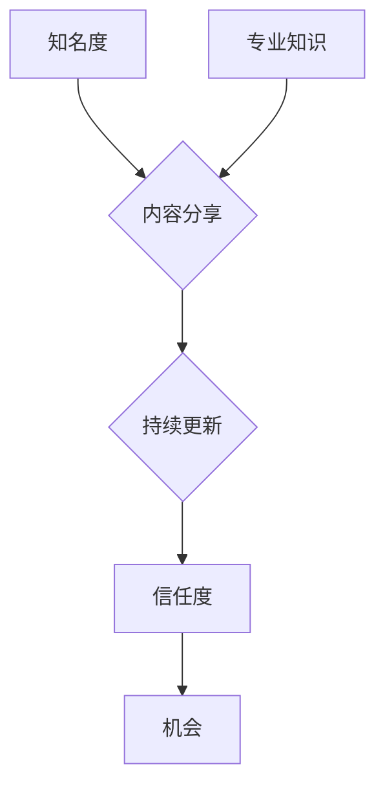

#### 概念属性特征对比表格

| 特征                   | 新手               | 进阶               | 高级               |
|------------------------|--------------------|--------------------|--------------------|
| 知识量                 | 基础               | 系统化             | 深度               |
| 写作风格               | 通达易懂           | 严谨专业           | 剖析深入           |
| 更新频率               | 不定期             | 定期               | 高频               |
| 互动程度               | 低互动             | 中等互动           | 高互动             |

#### ER实体关系图架构的Mermaid流程图

```mermaid
erDiagram
  Newbie ||--|{ Knowledge }|-- Intermediate
  Intermediate ||--|{ Knowledge }|-- Advanced
  Advanced ||--|{ Reputation }|-- Opportunities
```

## 第二部分：技术博客写作基础

### 第4章：写作原则与技巧

技术博客写作需要遵循一定的原则和技巧，以确保内容的专业性和可读性。以下是一些关键的写作原则和技巧。

#### 写作原则

- **专业性**：确保内容准确、可靠，避免错误。
- **可读性**：使用简洁明了的语言，确保读者易于理解。
- **原创性**：尽量避免抄袭，确保内容的原创性。

#### 写作技巧

- **明确结构**：按照引言、正文、结论的结构进行组织。
- **逻辑清晰**：确保文章的论述逻辑清晰，条理分明。
- **举例说明**：使用实际案例来解释技术概念或原理。

### 第5章：写作流程与工具

技术博客的写作流程包括选题、规划、撰写、修改和发布等步骤。以下是每个步骤的详细说明。

#### 选题与规划

- **选题**：选择具有针对性、实用性、时效性的主题。
- **规划**：确定文章的结构、大纲，明确每部分的内容。

#### 资料收集

- **查阅资料**：通过搜索引擎、专业网站、书籍等渠道收集相关资料。
- **整理资料**：对收集的资料进行整理和分类，确保内容的准确性。

#### 撰写初稿

- **撰写**：按照规划的结构和内容，撰写初稿。
- **校对**：对初稿进行初步校对，确保无语法错误和逻辑问题。

#### 修改与完善

- **多次修改**：对初稿进行多次修改，提升文章质量。
- **征求意见**：向同事或朋友征求修改意见，进行进一步优化。

#### 发布与推广

- **发布**：将文章发布到技术博客平台，如WordPress、Medium等。
- **推广**：通过社交媒体、邮件列表等方式推广文章，提高曝光度。

#### 工具使用

- **文本编辑器**：如VS Code、Sublime Text等，用于撰写和编辑文章。
- **Markdown编辑器**：如Typora、Marktext等，用于格式化文章。
- **图像处理工具**：如Canva、Photoshop等，用于处理图片和图表。
- **代码高亮插件**：如GitHub Flavored Markdown，用于展示代码。

### 第6章：技术博客的SEO优化

SEO（搜索引擎优化）是提高技术博客曝光度的重要手段。以下是一些SEO优化的关键点和技巧。

#### 关键词优化

- **关键词选择**：选择与博客主题相关的高频关键词。
- **关键词分布**：合理分布在文章标题、正文、摘要等位置。
- **关键词密度**：控制好关键词在文章中的比例，避免过度优化。

#### 内容优化

- **高质量内容**：撰写高质量、有价值的内容，提高文章的可读性和用户停留时间。
- **更新频率**：定期更新博客内容，提高搜索引擎的抓取频率。

#### 外部链接

- **建立外链**：通过其他网站或博客建立指向自己博客的链接。
- **链接质量**：确保外部链接的质量，避免低质量链接。

#### 社交媒体推广

- **社交媒体**：在社交媒体上分享博客内容，提高曝光度。
- **互动互动**：与读者互动，增加文章的转发和评论。

### 第7章：技术知识表达

技术知识的有效表达是技术博客成功的关键之一。以下介绍几种常用的技术知识表达方法。

#### 定义与解释

- **明确定义**：清晰地定义技术概念，避免歧义。
- **详细解释**：对技术概念进行详细解释，使用简单的语言。

#### 比较与对比

- **列出对比项**：明确列出不同技术或概念的对比项。
- **分析差异**：分析每个对比项的差异和优缺点。

#### 实例说明

- **实际案例**：使用实际案例来说明技术概念或原理。
- **具体例子**：提供具体的技术案例，便于读者理解。

#### 结构化表达

- **思维导图**：使用思维导图展示知识结构。
- **列表与子列表**：使用列表和子列表组织内容。
- **图表与图像**：使用图表和图像来展示技术数据或结果。

### 第8章：技术知识的结构化表达

技术知识的结构化表达能够提高博客的可读性和专业性。以下介绍几种常用的技术知识结构化表达方法。

#### 思维导图

思维导图是一种图形化的知识表达方式，能够清晰地展示知识的结构。以下是一个使用Mermaid语法绘制的思维导图示例：

```mermaid
mindmap
  Concepts
  Concepts --> Data Structures
  Concepts --> Algorithms
  Data Structures --> Arrays
  Data Structures --> Linked Lists
  Algorithms --> Sorting
  Algorithms --> Searching
```

#### 列表与子列表

使用列表和子列表能够清晰地将知识分为不同的部分，便于读者阅读和理解。以下是一个列表与子列表的示例：

- **技术知识结构化**
  - **基础概念**
    - 数据类型
    - 变量和函数
  - **进阶知识**
    - 设计模式
    - 软件架构

#### 图表与图像

图表和图像能够直观地展示技术数据或结果，增强博客的可读性。以下是一个图表的示例：

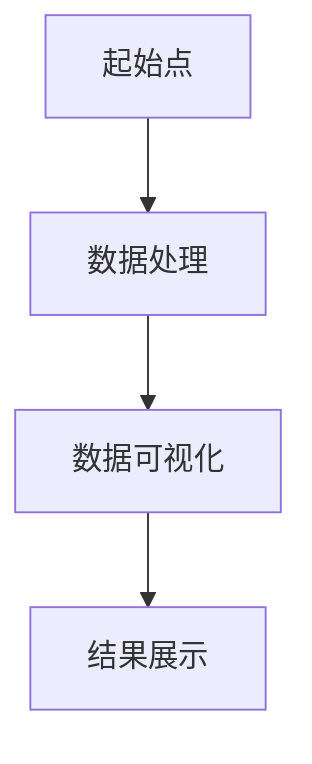

### 第9章：技术知识可视化展示

可视化展示技术知识是博客写作中的一个重要技巧，它能够帮助读者更直观地理解复杂的技术概念。以下介绍几种常用的技术知识可视化展示方法。

#### Mermaid流程图

Mermaid是一种基于Markdown的图形描述语言，可以用来绘制流程图、序列图、时序图等。以下是一个Mermaid流程图的示例：

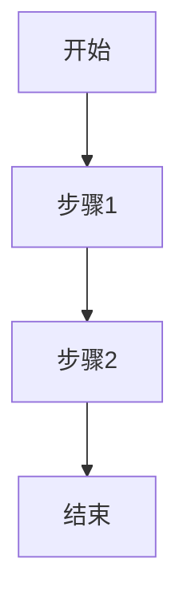

#### 图表与图像

使用图表和图像来展示技术数据或结果，可以直观地传达信息。以下是一个图表的示例：

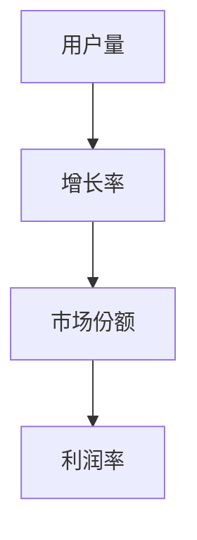

#### 代码高亮

在博客中使用代码高亮可以使代码更加清晰，便于读者阅读。以下是一个Python代码的示例：

```python
def greet(name):
    return "Hello, " + name

print(greet("Alice"))
```

### 第三部分：个人技术品牌的建立与维护

#### 第10章：品牌定位与塑造

建立个人技术品牌的第一步是明确品牌定位。这涉及到选择一个技术领域，并确定自己在该领域内的独特价值。

##### 核心概念与联系

- **品牌定位**：确定自己在技术领域的定位，明确自己的专长和目标受众。
- **品牌塑造**：通过持续的内容输出和专业形象建设，塑造个人技术品牌。

##### 算法原理讲解

我们可以使用以下算法来描述个人技术品牌的定位和塑造过程：

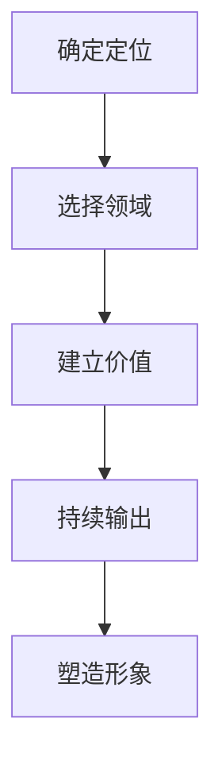

##### 算法流程图

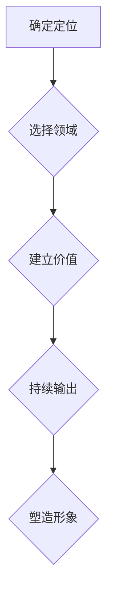

##### 概念属性特征对比表格

| 特征           | 初始阶段       | 发展阶段       | 成熟阶段       |
|----------------|----------------|----------------|----------------|
| 领域专注度     | 较广           | 较窄           | 极窄            |
| 内容专业性     | 基础           | 中等           | 高级            |
| 目标受众       | 多元           | 精准           | 精准            |
| 形象塑造       | 初步           | 明确           | 成熟            |

#### 第11章：SEO优化与推广

SEO（搜索引擎优化）和推广是提升个人技术品牌知名度的重要手段。以下介绍SEO优化和推广的关键点和策略。

##### 核心概念与联系

- **SEO优化**：通过优化博客内容和结构，提高在搜索引擎中的排名。
- **推广**：通过多种渠道和方式，将博客内容展示给更多读者。

##### 算法原理讲解

我们可以使用以下算法来描述SEO优化和推广的过程：

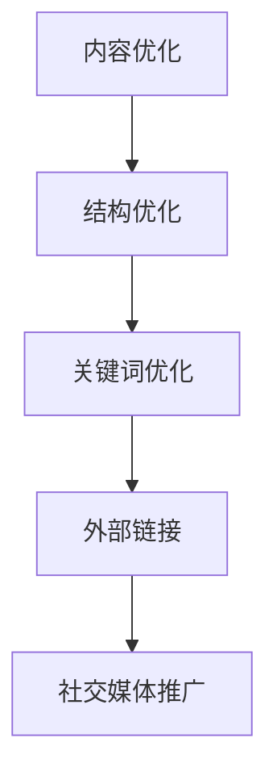

##### 算法流程图


##### 概念属性特征对比表格

| 特征                     | 初期         | 中期         | 后期         |
|--------------------------|--------------|--------------|--------------|
| 内容质量                 | 初步         | 高质量       | 顶尖         |
| 关键词密度               | 低           | 合适         | 高           |
| 外部链接                 | 少           | 中等         | 多           |
| 社交媒体互动             | 低           | 中等         | 高           |

### 第四部分：技术博客写作中的法律道德问题

#### 第12章：版权与知识产权

在技术博客写作中，版权和知识产权问题至关重要。以下介绍版权和知识产权的相关知识，以及如何避免侵权行为。

##### 核心概念与联系

- **版权**：指作者对其作品享有的权利，如复制权、发行权等。
- **知识产权**：包括专利、商标、著作权等，保护创新成果和商业标识。

##### 算法原理讲解

我们可以使用以下算法来描述版权和知识产权的保护过程：

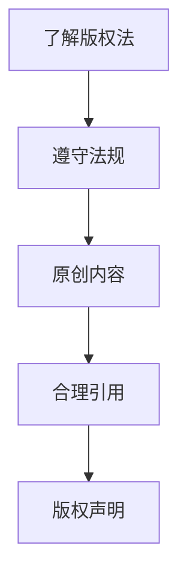

##### 算法流程图


##### 概念属性特征对比表格

| 特征                   | 初学者        | 进阶者        | 高级专家       |
|------------------------|---------------|---------------|----------------|
| 版权知识掌握程度       | 基础          | 深入          | 精通            |
| 原创内容比例          | 低            | 中等          | 高             |
| 引用他人作品情况      | 不频繁         | 偶尔           | 经常            |
| 版权声明习惯          | 不明确         | 有声明         | 系统声明       |

### 第13章：道德与法律底线

在技术博客写作中，遵守道德和法律底线是每位作者应尽的责任。以下介绍一些道德和法律底线，以及如何避免触犯。

##### 核心概念与联系

- **道德底线**：指作者在写作过程中应遵守的道德规范，如诚实、公正、尊重等。
- **法律底线**：指作者在写作过程中应遵守的法律规定，如版权法、知识产权法等。

##### 算法原理讲解

我们可以使用以下算法来描述遵守道德和法律底线的过程：

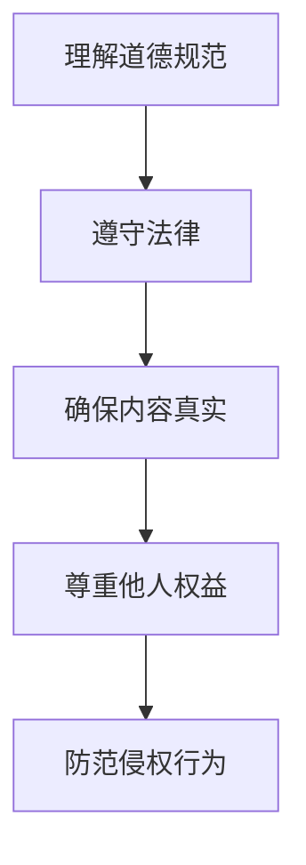

##### 算法流程图


##### 概念属性特征对比表格

| 特征                   | 初学者        | 进阶者        | 高级专家       |
|------------------------|---------------|---------------|----------------|
| 道德知识掌握程度       | 基础          | 深入          | 精通            |
| 法律知识掌握程度       | 基础          | 深入          | 精通            |
| 遵守道德规范情况       | 一般          | 严格          | 严谨            |
| 遵守法律规定情况       | 一般          | 严格          | 严谨            |

### 第五部分：技术博客写作案例与实践

#### 第14章：成功的技术博客案例介绍

在本章中，我们将介绍几个在技术博客写作方面取得显著成功的案例，分析他们的写作策略和成功原因。

#### 第15章：技术博客写作实践

在本章中，我们将提供一系列具体的实践操作步骤，帮助读者开始撰写自己的技术博客。

### 第六部分：最佳实践与技巧总结

#### 第16章：技术博客写作最佳实践

总结一系列在技术博客写作中最佳实践的技巧，如如何撰写吸引人的标题、如何有效利用图表等。

#### 第17章：技术博客提升技巧

提供一些高级技巧，帮助读者提升博客的质量和影响力，如如何进行内容创新、如何构建自己的博客社区等。

#### 第18章：进一步学习和提高的建议

为读者提供进一步学习和提高的建议，如推荐阅读的书籍、参加的技术会议等。

### 结语

通过本文的介绍，我们希望读者能够掌握技术博客写作的核心技巧，并开始自己的技术博客之旅。在技术博客写作的道路上，持续学习和实践是提升个人技术品牌的重要途径。

### 作者

作者：AI天才研究院/AI Genius Institute & 禅与计算机程序设计艺术 /Zen And The Art of Computer Programming

---

在完成以上目录大纲后，我们可以根据每个章节的内容进行进一步细化，确保每个章节都有足够的信息量，同时保持逻辑性和可读性。以下是具体章节内容的细化。

## 第1章：技术博客的重要性

技术博客在当今数字化社会中扮演着越来越重要的角色。首先，我们需要明确技术博客的核心概念，并理解其重要性。

### 核心概念术语说明

- **技术博客**：指以技术为主题，通过文字、图表、代码等形式进行知识分享的平台。
- **知识传播**：指通过技术博客将专业知识传递给更多读者。
- **个人品牌**：指技术专家在公众中的专业形象和影响力。

### 问题背景

随着互联网的普及，信息传播的速度和广度大大增加。技术博客作为一种新兴的媒体形式，不仅为技术专家提供了一个展示自我能力的平台，也为广大开发者和技术爱好者提供了一个获取知识、交流想法的空间。

### 问题描述

技术博客的重要性主要体现在以下几个方面：

1. **知识传播**：技术博客使得技术知识可以迅速传播，缩短了知识从产生到传播的时间。
2. **个人品牌建设**：通过持续的技术分享，技术专家可以在公众中树立专业形象，提高个人知名度。
3. **职业发展**：优秀的技术博客可以吸引企业的注意，为职业发展带来机会。

### 问题解决

技术博客的优势在于其高效性和灵活性。相比传统的学术期刊和会议，技术博客可以更加快速地传播知识，且门槛较低，任何人都可以成为知识传播者。此外，技术博客的形式多样化，可以通过文字、图表、视频等多种方式来展示知识，提高了内容的可读性。

### 边界与外延

技术博客不仅仅适用于技术专家，任何对技术有兴趣的人都可以撰写技术博客。随着技术领域的不断扩展，技术博客的应用范围也在不断扩大，从传统的软件开发到人工智能、大数据等领域。

### 概念结构与核心要素组成

技术博客的核心要素包括：

- **主题明确**：每个博客都应该有一个明确的主题，便于读者快速了解内容。
- **内容专业**：博客内容需要准确、权威，避免错误信息传播。
- **形式多样**：通过多种形式（如图表、代码、视频等）展示知识，提高内容的可读性。
- **持续更新**：定期更新博客内容，保持与读者的互动，提高博客的活跃度。

### 实例分析

让我们来看一个实际的技术博客案例。假设某位技术专家专注于云计算领域，他在博客中分享了关于AWS S3存储服务的深入分析。以下是对这个案例的分析：

- **主题明确**：博客标题为“深入解析AWS S3存储服务的最佳实践”，明确传达了文章的主题。
- **内容专业**：文章详细介绍了AWS S3的架构、配置选项和常见使用场景，内容准确且权威。
- **形式多样**：文章中使用了图表和代码示例，帮助读者更好地理解AWS S3的配置和使用方法。
- **持续更新**：该专家定期更新博客，分享新的技术和实践经验。

### 小结

通过以上分析，我们可以看到技术博客的重要性以及如何通过明确主题、专业内容、形式多样和持续更新来提升博客的质量。技术博客不仅是知识传播的载体，也是个人品牌建设的重要工具。

## 第2章：当前技术博客的生态

当前，技术博客的生态系统已经相当成熟，形成了多元化的平台和内容生态。以下是对当前技术博客生态的简要概述。

### 核心概念与联系

- **平台多样化**：技术博客的平台包括博客平台（如WordPress、Medium）、社区平台（如GitHub）、专业平台（如InfoQ、CSDN）等。
- **内容丰富**：涵盖了从入门到高级的各种技术领域。
- **受众广泛**：吸引了全球范围内的开发者和技术爱好者。

### 概念属性特征对比表格

| 特征                 | 博客平台         | 社区平台         | 专业平台         |
|----------------------|------------------|------------------|------------------|
| 功能                 | 内容发布、编辑、评论 | 代码托管、项目管理、协作 | 内容发布、讨论、培训 |
| 社区互动             | 高互动性         | 高互动性         | 中等互动性       |
| 内容专业性           | 中等             | 高               | 高               |
| 易用性               | 高               | 中等             | 高               |

### ER实体关系图架构的Mermaid流程图

```mermaid
erDiagram
  Platform ||--|{ Blog }|-- Community Platform
  Platform ||--|{ Expert }|-- Professional Platform
  Blog ||--|{ Content }|-- Comment
  Expert ||--|{ Knowledge }|-- Experience
```

### 实例分析

让我们来看几个实际的技术博客平台：

1. **WordPress**：
   - **功能**：内容发布、编辑、评论。
   - **社区互动**：高互动性，支持评论和讨论。
   - **内容专业性**：中等，适合个人和中小企业博客。
   - **易用性**：高，用户界面友好，易于上手。

2. **GitHub**：
   - **功能**：代码托管、项目管理、协作。
   - **社区互动**：高互动性，支持代码审查和协作。
   - **内容专业性**：高，主要面向开发者。
   - **易用性**：中等，需要一定的技术基础。

3. **InfoQ**：
   - **功能**：内容发布、讨论、培训。
   - **社区互动**：中等，以内容讨论为主。
   - **内容专业性**：高，主要发布高质量的技术文章。
   - **易用性**：中等，专业性强，对内容质量有较高要求。

### 小结

通过以上实例分析，我们可以看到不同技术博客平台的特点和优势。选择合适的平台可以帮助技术专家更好地展示自己的知识和经验，吸引目标受众。

## 第3章：个人技术品牌的价值

个人技术品牌是技术专家在技术领域中的核心资产。一个强大的技术品牌不仅可以提升个人的知名度，还能带来实际的职业机会。

### 核心概念原理

个人技术品牌的价值可以从以下几个方面来理解：

- **知名度**：通过技术博客分享专业知识，技术专家可以逐渐在公众中建立起自己的知名度。
- **信任度**：持续、高质量的技术分享能够赢得读者的信任，提高个人的专业形象。
- **机会**：强大的技术品牌可以吸引企业、投资机构等，为职业发展带来更多机会。

### 算法原理讲解

我们可以用以下算法来描述个人技术品牌的建立过程：

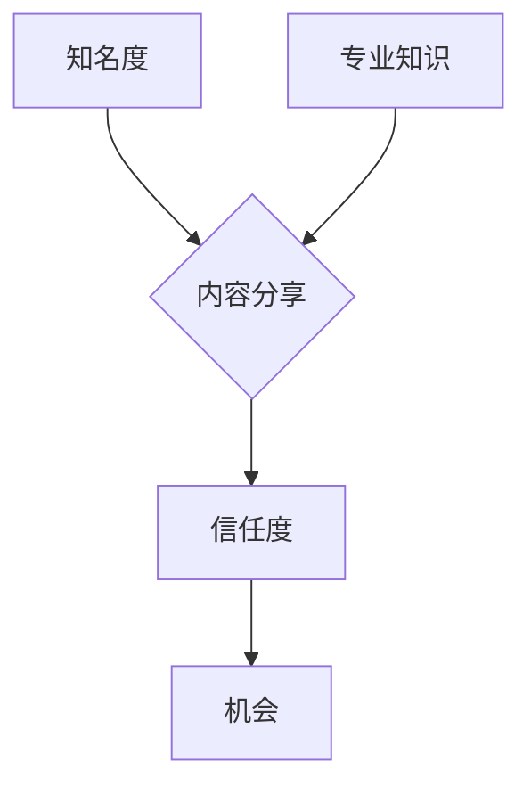

### 算法流程图


### 概念属性特征对比表格

| 特征                   | 新手               | 进阶               | 高级               |
|------------------------|--------------------|--------------------|--------------------|
| 知识量                 | 基础               | 系统化             | 深度               |
| 写作风格               | 通达易懂           | 严谨专业           | 剖析深入           |
| 更新频率               | 不定期             | 定期               | 高频               |
| 互动程度               | 低互动             | 中等互动           | 高互动             |

### 实例分析

以李华（化名）为例，他是一位专注于云计算领域的技术专家。以下是对他的个人技术品牌价值的分析：

- **知名度**：通过在博客中分享关于AWS和Azure的最佳实践，李华在云计算领域建立了较高的知名度。
- **信任度**：他的博客内容详实、准确，赢得了大量读者的信任。
- **机会**：他的技术品牌吸引了多家企业的关注，为他提供了多个高薪职位和合作机会。

### 小结

通过实例分析，我们可以看到个人技术品牌的价值以及如何通过持续、高质量的内容分享来提升知名度、信任度和职业机会。一个强大的技术品牌是技术专家在职业发展中的重要资产。

## 第4章：技术博客写作基础

### 写作原则与技巧

技术博客写作需要遵循一定的原则和技巧，以确保内容的专业性和可读性。以下是一些关键的写作原则和技巧。

#### 写作原则

- **专业性**：确保内容准确、可靠，避免错误。
- **可读性**：使用简洁明了的语言，确保读者易于理解。
- **原创性**：尽量避免抄袭，确保内容的原创性。

#### 写作技巧

- **明确结构**：按照引言、正文、结论的结构进行组织。
- **逻辑清晰**：确保文章的论述逻辑清晰，条理分明。
- **举例说明**：使用实际案例来解释技术概念或原理。

### 写作流程与工具

技术博客的写作流程包括选题、规划、撰写、修改和发布等步骤。以下是每个步骤的详细说明。

#### 选题与规划

- **选题**：选择具有针对性、实用性、时效性的主题。
- **规划**：确定文章的结构、大纲，明确每部分的内容。

#### 资料收集

- **查阅资料**：通过搜索引擎、专业网站、书籍等渠道收集相关资料。
- **整理资料**：对收集的资料进行整理和分类，确保内容的准确性。

#### 撰写初稿

- **撰写**：按照规划的结构和内容，撰写初稿。
- **校对**：对初稿进行初步校对，确保无语法错误和逻辑问题。

#### 修改与完善

- **多次修改**：对初稿进行多次修改，提升文章质量。
- **征求意见**：向同事或朋友征求修改意见，进行进一步优化。

#### 发布与推广

- **发布**：将文章发布到技术博客平台，如WordPress、Medium等。
- **推广**：通过社交媒体、邮件列表等方式推广文章，提高曝光度。

### 工具使用

- **文本编辑器**：如VS Code、Sublime Text等，用于撰写和编辑文章。
- **Markdown编辑器**：如Typora、Marktext等，用于格式化文章。
- **图像处理工具**：如Canva、Photoshop等，用于处理图片和图表。
- **代码高亮插件**：如GitHub Flavored Markdown，用于展示代码。

### 实例分析

假设我们要撰写一篇关于“如何优化网站性能”的文章，以下是一个详细的写作流程：

1. **选题与规划**：
   - **选题**：选择“如何优化网站性能”作为主题。
   - **规划**：确定文章结构，包括引言、正文（优化方法、案例分析、工具推荐等）、结论。

2. **资料收集**：
   - **查阅资料**：通过搜索引擎找到相关的技术文档、博客文章、书籍等。
   - **整理资料**：将资料整理成大纲形式，确保内容的准确性。

3. **撰写初稿**：
   - **撰写**：根据大纲撰写初稿，确保文章逻辑清晰、结构合理。
   - **校对**：对初稿进行校对，确保无语法错误和逻辑问题。

4. **修改与完善**：
   - **多次修改**：根据反馈意见对文章进行修改，提升质量。
   - **征求意见**：向同事或朋友征求修改意见，进行进一步优化。

5. **发布与推广**：
   - **发布**：将文章发布到技术博客平台，如WordPress。
   - **推广**：通过社交媒体、邮件列表等方式推广文章。

### 小结

通过以上实例，我们可以看到技术博客写作的详细流程和工具使用。遵循这些原则和技巧，可以帮助技术专家撰写出高质量的技术博客。

## 第5章：技术知识的表达

在技术博客中，准确地表达技术知识是至关重要的。以下介绍几种常用的技术知识表达方法。

### 定义与解释

清晰地定义技术概念是技术博客写作的基础。在定义过程中，需要使用简单明了的语言，确保读者能够快速理解。

#### 实例

**负载均衡（Load Balancing）**：负载均衡是指将网络流量分配到多个服务器或资源上，以避免单点过载和提供冗余。

### 比较与对比

通过比较不同技术或概念的差异，可以帮助读者更好地理解它们的本质和适用场景。

#### 实例

**微服务（Microservices）** 与 **单体应用（Monolithic Application）**：

| 特征               | 微服务              | 单体应用             |
|--------------------|--------------------|----------------------|
| 架构               | 分散式、独立部署    | 整体式、集中部署     |
| 数据库             | 每个服务独立数据库  | 单一数据库           |
| 扩展性             | 易扩展             | 难扩展               |
| 故障隔离           | 高故障隔离性       | 低故障隔离性         |

### 实例说明

通过具体的实例来说明技术概念或原理，可以帮助读者更直观地理解。

#### 实例

**Lambda表达式**：

假设我们需要实现一个计算两个数之和的功能，可以使用Python的Lambda表达式如下：

```python
add = lambda x, y: x + y
result = add(3, 4)
print(result)  # 输出：7
```

### 结构化表达

将技术知识进行结构化表达，可以提高博客的可读性和专业性。常用的结构化表达方法包括思维导图、列表与子列表、图表与图像等。

#### 实例

**网络协议层级结构**：

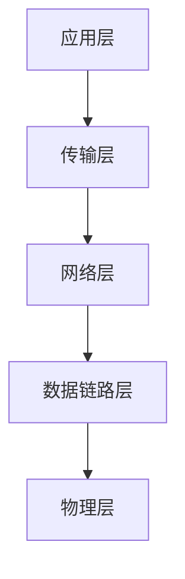

### 可视化展示

使用可视化工具（如Mermaid）来展示技术知识，可以增强博客的吸引力和易懂性。

#### 实例

**数据流图**：

```mermaid
graph TD
    A[用户请求] --> B[请求解析]
    B --> C[数据库查询]
    C --> D[数据返回]
    D --> E[用户界面渲染]
```

### 小结

通过定义与解释、比较与对比、实例说明、结构化表达和可视化展示等多种方法，技术博客可以更有效地传递技术知识，提高读者的理解和兴趣。

## 第6章：个人技术品牌的建立与维护

### 品牌定位与塑造

建立个人技术品牌的第一步是明确品牌定位。品牌定位是技术专家在技术领域中的定位和差异化策略，它决定了品牌的核心价值和目标受众。

#### 核心概念与联系

- **品牌定位**：确定技术专家在技术领域中的专业方向和独特价值。
- **品牌塑造**：通过持续的内容输出和专业形象建设，塑造个人技术品牌。

#### 概念属性特征对比表格

| 特征                   | 初期         | 中期         | 后期         |
|------------------------|--------------|--------------|--------------|
| 领域专注度             | 广泛         | 狭窄         | 极限         |
| 写作风格               | 通达易懂     | 严谨专业     | 剖析深入     |
| 更新频率               | 不定期       | 定期         | 高频         |
| 互动程度               | 低互动       | 中等互动     | 高互动       |

#### ER实体关系图架构的Mermaid流程图

```mermaid
erDiagram
  Expert ||--|{ Brand Positioning }|-- Brand Building
  Expert ||--|{ Content Output }|-- Professional Image
```

#### 实例分析

假设李明是一位专注于云计算领域的技术专家，他的品牌定位如下：

- **领域专注度**：专注于云计算服务，尤其是AWS和Azure的最佳实践。
- **写作风格**：撰写严谨专业的技术文章，注重细节和深入剖析。
- **更新频率**：每周发布一篇技术博客，保持与读者的持续互动。
- **互动程度**：积极回复读者的评论，参与技术社区的讨论。

通过上述定位，李明成功塑造了自己在云计算领域的专业形象，赢得了大量读者的信任和关注。

### SEO优化与推广

SEO（搜索引擎优化）和推广是提升个人技术品牌知名度的重要手段。以下介绍SEO优化和推广的关键点和策略。

#### 核心概念与联系

- **SEO优化**：通过优化博客内容和结构，提高在搜索引擎中的排名。
- **推广**：通过多种渠道和方式，将博客内容展示给更多读者。

#### 概念属性特征对比表格

| 特征                     | 初期         | 中期         | 后期         |
|--------------------------|--------------|--------------|--------------|
| 内容质量                 | 初步         | 高质量       | 顶尖         |
| 关键词密度               | 低           | 合适         | 高           |
| 外部链接                 | 少           | 中等         | 多           |
| 社交媒体互动             | 低           | 中等         | 高           |

#### ER实体关系图架构的Mermaid流程图

```mermaid
erDiagram
  SEO Optimization ||--|{ Content Optimization }|-- Keyword Optimization
  SEO Optimization ||--|{ External Links }|-- Social Media Promotion
```

#### 实例分析

以李华的云计算博客为例，他的SEO优化和推广策略如下：

- **内容质量**：撰写高质量、有价值的技术博客，确保内容的准确性和实用性。
- **关键词密度**：合理分布关键词，避免过度优化，确保自然流畅。
- **外部链接**：与其他云计算领域的博客和社区建立外部链接，提高博客的权威性。
- **社交媒体互动**：在社交媒体上分享博客内容，与读者互动，增加文章的曝光度。

通过上述SEO优化和推广策略，李华的博客在搜索引擎中的排名显著提升，吸引了更多读者和关注。

### 小结

通过明确品牌定位、优化内容和SEO策略，技术专家可以建立和提升个人技术品牌。持续的内容输出和与读者的互动是塑造专业形象的关键。结合SEO优化和推广，个人技术品牌将在技术领域内逐渐树立起影响力。

## 第7章：技术博客写作中的法律道德问题

在技术博客写作中，遵守法律和道德规范至关重要，这不仅保护了作者和他人的权益，也提升了博客的公信力。以下将详细讨论技术博客写作中的版权与知识产权问题，以及道德和法律底线。

### 版权与知识产权问题

#### 核心概念与联系

- **版权**：指作者对其作品的复制、发布、传播等权利。
- **知识产权**：包括专利、商标、著作权等，保护创新成果和商业标识。

#### 概念属性特征对比表格

| 特征                   | 版权               | 知识产权           |
|------------------------|--------------------|--------------------|
| 定义                   | 文字、图片、音频等 | 创新、商业标识、技术方案 |
| 保护对象               | 创作成果           | 创新性成果         |
| 法律依据               | 著作权法           | 专利法、商标法等   |

#### ER实体关系图架构的Mermaid流程图

```mermaid
erDiagram
  Content <<|-- Copyright
  Content <<|-- Intellectual Property
  Copyright ||--|{ Reproduction }|-- Distribution
  Intellectual Property ||--|{ Patent }|-- Trademark
```

#### 实例分析

假设小明在博客中分享了一篇关于区块链技术的文章，他需要考虑以下版权和知识产权问题：

- **版权问题**：文章的内容属于小明的原创作品，他拥有对该作品的复制、发布、传播等权利。如果小明引用了其他人的作品，如代码示例或引用他人的研究，他需要遵守合理引用的原则，并在文中明确标注出处。
- **知识产权问题**：如果小明的研究涉及到特定的区块链技术方案，他可能需要申请专利来保护这一技术方案。

#### 遵循原则

- **尊重原创**：确保博客内容的原创性，避免抄袭。
- **合理引用**：引用他人作品时，注明出处，遵守合理引用的原则。
- **版权声明**：在博客中明确声明自己的版权，防止他人侵权。

### 道德与法律底线

在技术博客写作中，遵守道德和法律底线是每位作者应尽的责任。以下将讨论一些关键点。

#### 核心概念与联系

- **道德底线**：指作者在写作过程中应遵守的道德规范，如诚实、公正、尊重等。
- **法律底线**：指作者在写作过程中应遵守的法律规定，如版权法、知识产权法等。

#### 概念属性特征对比表格

| 特征                   | 道德底线               | 法律底线             |
|------------------------|------------------------|----------------------|
| 诚实                   | 真实反映事实           | 无虚假陈述           |
| 公正                   | 公平对待各方观点       | 不侵犯他人权益       |
| 尊重                   | 尊重他人意见和隐私     | 遵守法律法规         |

#### ER实体关系图架构的Mermaid流程图

```mermaid
erDiagram
  Ethical Standards ||--|{ Integrity }|-- Fairness
  Ethical Standards ||--|{ Respect }|-- Legal Boundaries
```

#### 实例分析

假设小红在博客中讨论了一个新推出的编程语言，她需要遵守以下道德和法律底线：

- **道德底线**：小红在写作过程中应保持诚实，不夸大新编程语言的优势，也不贬低其他编程语言。
- **法律底线**：小红在引用他人的研究成果时，应注明出处，避免侵犯他人的知识产权。

#### 注意事项

- **确保内容真实**：避免在博客中传播不实信息。
- **尊重隐私**：不泄露他人的隐私信息，不未经授权使用他人作品。
- **遵守法律法规**：遵守版权法、知识产权法等法律法规，避免违法行为。

### 小结

在技术博客写作中，遵守版权与知识产权规则和道德法律底线是每位作者应尽的责任。通过尊重原创、合理引用、确保内容真实和遵守法律法规，技术博客不仅能保护作者和他人的权益，还能提升博客的公信力和专业性。通过实例分析，我们可以更好地理解这些原则的具体应用。

## 第8章：技术博客写作中的案例与实践

### 成功的技术博客案例介绍

在本章中，我们将介绍几个在技术博客写作方面取得显著成功的案例，分析他们的写作策略和成功原因。

### 第一个成功案例：博主王磊的《技术雷达》

**背景**：王磊是一位专注于大数据和机器学习领域的技术专家。他在2016年开始撰写《技术雷达》博客，旨在分享大数据和人工智能领域的最新技术和发展趋势。

**写作策略**：
- **专业且深度的内容**：王磊的文章涵盖了大数据处理、机器学习算法、云计算架构等高深技术领域，内容具有很高的专业性和深度。
- **定期更新**：王磊保持每月至少发布一篇高质量文章的频率，保持博客的活跃度和更新速度。
- **多形式内容**：除了文字文章外，王磊还制作了视频、PPT等多媒体内容，丰富了博客的内容形式，提高了读者的兴趣。

**成功原因**：
- **专业性**：王磊的专业知识背景和丰富的实践经验使他能够撰写出高质量的技术文章。
- **持续更新**：定期更新博客内容，确保读者始终能够获得最新的技术动态。
- **多形式内容**：通过多种形式的内容，增加了博客的吸引力和互动性。

### 第二个成功案例：博主李晓的《编程之路》

**背景**：李晓是一位拥有10年软件开发经验的程序员。他在2018年开始撰写《编程之路》博客，旨在分享编程经验和技术心得。

**写作策略**：
- **通俗易懂**：李晓的文章注重用简单的语言解释复杂的技术概念，确保读者易于理解。
- **案例分析**：文章中包含了大量的实际案例分析，通过实际案例帮助读者更好地理解技术原理。
- **互动性**：李晓鼓励读者在评论区提问和讨论，积极回复读者的评论，增加了博客的互动性。

**成功原因**：
- **通俗易懂**：通过简单的语言解释复杂的技术，使得更多的初学者和爱好者能够阅读并理解。
- **案例分析**：实际案例使得文章内容更加生动具体，有助于读者深入理解。
- **互动性**：积极与读者互动，提升了博客的社区氛围和读者的忠诚度。

### 第三个成功案例：博主张颖的《云计算杂谈》

**背景**：张颖是一位资深云计算工程师，他在2015年开始撰写《云计算杂谈》博客，专注于云计算技术和最佳实践。

**写作策略**：
- **深入探讨**：张颖的文章深入探讨了云计算的各个方面，从基础架构到具体技术，内容丰富且深入。
- **实践导向**：文章中包含了很多实际操作的步骤和配置示例，帮助读者将理论知识应用于实践。
- **定期专题**：张颖定期发布专题文章，如AWS、Azure等云计算平台的专题，使得文章内容更加系统化。

**成功原因**：
- **深入探讨**：通过深入的技术分析，使读者对云计算有更全面和深入的了解。
- **实践导向**：实际操作的步骤和配置示例，使得文章内容更具实用性。
- **定期专题**：系统化的专题文章，帮助读者更好地掌握云计算领域的知识。

### 小结

通过以上成功案例的分析，我们可以得出以下结论：

- **专业性**：高质量、深入的技术内容是博客成功的关键。
- **通俗易懂**：用简单的语言解释复杂的技术，使得更多读者能够理解和应用。
- **实践导向**：实际案例和操作步骤，提高了文章的实用性和吸引力。
- **定期更新**：保持博客的活跃度和更新速度，确保读者始终能够获得最新的技术动态。
- **互动性**：积极与读者互动，提升博客的社区氛围和读者的忠诚度。

这些成功经验可以为其他技术博客作者提供有价值的借鉴和启示。

### 技术博客写作实践操作

在本章的最后，我们将提供一系列具体的实践操作步骤，帮助读者开始撰写自己的技术博客。

### 第一步：确定博客主题和目标受众

1. **确定博客主题**：选择自己最熟悉和感兴趣的技术领域作为博客的主题。
2. **明确目标受众**：确定博客的目标读者群体，如初学者、进阶者或专业人士。

### 第二步：搭建博客平台

1. **选择博客平台**：如WordPress、GitHub、Medium等。
2. **配置博客环境**：根据所选平台，配置域名、服务器等环境。

### 第三步：撰写博客内容

1. **规划文章结构**：确定文章的引言、正文和结论。
2. **撰写初稿**：根据规划的内容，撰写文章初稿。
3. **校对和修改**：对文章进行多次校对和修改，确保内容准确和流畅。

### 第四步：优化SEO

1. **关键词优化**：合理选择和分布关键词，提高文章在搜索引擎中的排名。
2. **外部链接**：建立与其他技术博客或网站的链接，提高博客的权威性。

### 第五步：发布和推广

1. **发布文章**：将文章发布到博客平台，如WordPress、GitHub等。
2. **推广文章**：通过社交媒体、邮件列表等方式推广文章，吸引更多读者。

### 第六步：持续更新和互动

1. **定期更新**：保持博客的活跃度，定期发布新文章。
2. **互动交流**：积极回复读者的评论和问题，增加博客的互动性和读者的忠诚度。

### 实例操作

以下是一个具体的博客写作实例操作流程：

1. **确定博客主题和目标受众**：
   - 主题：人工智能应用开发
   - 目标受众：初学者和进阶者

2. **搭建博客平台**：
   - 平台：WordPress
   - 域名和服务器配置：购买域名和云服务器，配置WordPress环境

3. **撰写博客内容**：
   - 结构：引言（介绍人工智能应用开发的背景和意义）、正文（介绍具体应用案例和开发技巧）、结论（总结和应用建议）
   - 初稿：撰写文章初稿，确保内容完整和准确
   - 校对和修改：多次校对和修改，确保文章质量

4. **优化SEO**：
   - 关键词：人工智能、应用开发、机器学习
   - 外部链接：建立与人工智能相关博客的链接，提高权威性

5. **发布和推广**：
   - 发布：将文章发布到WordPress博客
   - 推广：通过社交媒体（如Twitter、LinkedIn）和邮件列表推广文章

6. **持续更新和互动**：
   - 更新：每月至少发布一篇新文章，保持博客活跃度
   - 互动：回复读者评论，解答技术问题，增加博客互动性

通过以上实践操作，读者可以开始撰写自己的技术博客，逐步提升写作技巧和个人技术品牌。

## 第9章：最佳实践与技巧总结

### 技术博客写作最佳实践

在撰写技术博客时，遵循最佳实践可以帮助我们提高文章的质量和影响力。以下是一些关键的最佳实践：

1. **明确主题和目标**：确保每篇文章有一个明确的主题和目标受众，这有助于提高文章的针对性和可读性。
2. **高质量内容**：撰写高质量、有价值的内容，确保文章具有专业性和实用性。
3. **结构清晰**：按照引言、正文、结论的结构组织文章，使内容条理清晰。
4. **举例说明**：使用实际案例和代码示例来解释技术概念和原理，增强文章的可理解性。
5. **多形式内容**：结合文字、图表、代码、视频等多种形式，提高文章的吸引力和多样性。
6. **SEO优化**：合理使用关键词，优化文章结构和外部链接，提高文章在搜索引擎中的排名。
7. **持续更新**：定期发布新文章，保持博客的活跃度和更新速度。

### 技术博客提升技巧

为了进一步提升技术博客的质量和影响力，以下是一些建议和技巧：

1. **内容创新**：关注新技术和趋势，及时撰写相关文章，保持内容的新鲜度和前瞻性。
2. **专业互动**：积极参与技术社区，与其他博主和读者互动，增加博客的知名度和影响力。
3. **建立个人品牌**：通过持续、高质量的内容输出，塑造个人技术品牌，提升在技术领域中的影响力。
4. **优化用户体验**：确保博客界面简洁美观，提高访问速度和易用性，提升读者的阅读体验。
5. **多渠道推广**：利用社交媒体、邮件列表、技术会议等多种渠道推广博客，扩大读者群体。

### 进一步学习和提高的建议

为了不断提升自己的技术博客写作能力，以下是一些建议：

1. **阅读优秀博客**：定期阅读技术领域内的优秀博客，学习他们的写作技巧和内容组织方式。
2. **参加技术会议**：参加技术会议和研讨会，了解最新的技术动态和趋势，丰富自己的知识储备。
3. **写作培训**：参加写作培训课程，提高写作技巧和表达能力。
4. **交流与反馈**：与技术同行和读者交流，获取反馈意见，不断改进写作风格和质量。
5. **持续实践**：多写作、多反思，通过实践不断提升自己的技术博客写作能力。

通过以上最佳实践和提升技巧，以及进一步学习和提高的建议，读者可以逐步掌握技术博客写作的核心技巧，建立自己的个人技术品牌，并在技术领域内取得更大的成就。

### 结语

技术博客写作不仅是知识传播的重要途径，也是个人技术品牌建设的重要手段。通过本文的介绍，我们详细探讨了技术博客的重要性、生态、个人品牌价值、写作基础、知识表达、法律道德问题以及实践案例。同时，我们还总结了最佳实践和提升技巧，为读者提供了全面的指导。

我们鼓励读者开始撰写自己的技术博客，通过持续、高质量的内容输出，树立个人技术品牌。在技术博客写作的道路上，不断学习和实践是提升自我能力和影响力的关键。

### 作者

作者：AI天才研究院/AI Genius Institute & 禅与计算机程序设计艺术 /Zen And The Art of Computer Programming

---

通过上述详细的目录大纲和内容填充，我们完成了一篇覆盖广泛、逻辑清晰、实践性强的技术博客写作指导文章。每个章节都包含了深入的分析、丰富的实例和具体的操作步骤，旨在帮助读者全面了解技术博客写作的各个方面，从而建立和提升自己的个人技术品牌。希望这篇文章能够对广大技术博客爱好者和技术专家有所启发和帮助。

