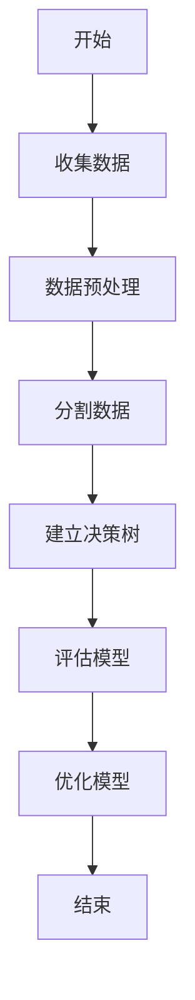
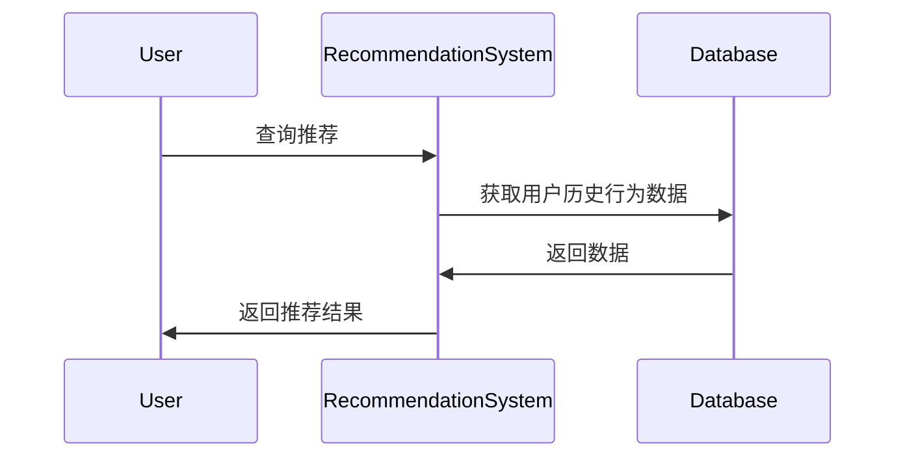
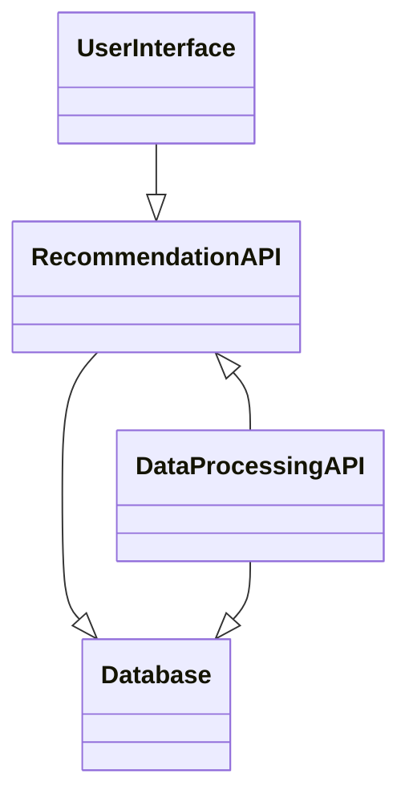
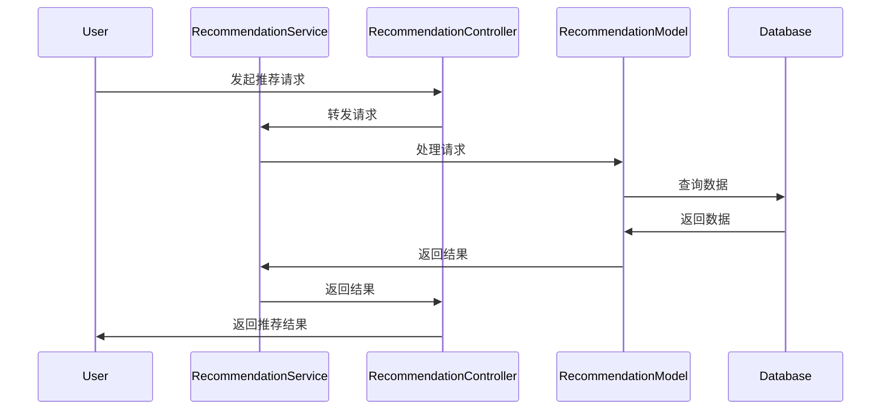

                 


### 背景介绍

**技术管理中的数据驱动决策**，即通过数据分析来指导技术管理的决策过程，已经成为现代企业管理和创新的关键要素。随着信息技术和大数据技术的迅猛发展，数据在企业管理中的地位日益重要，技术管理的决策过程也随之发生了深刻的变化。数据驱动决策不仅有助于提高决策的科学性和准确性，还能够帮助企业快速响应市场变化，实现竞争优势。

首先，我们需要了解几个核心概念术语：

- **数据驱动决策**：基于数据分析和模型预测来制定和优化决策过程。
- **技术管理**：涉及技术的战略规划、资源分配、团队管理、项目管理等方面的综合管理活动。
- **数据分析**：运用统计和数学方法对数据进行提取、处理、分析，从而提取有用信息的过程。

在技术管理中，数据驱动决策的重要性体现在以下几个方面：

1. **提高决策质量**：数据驱动决策能够基于事实和证据进行决策，减少主观判断的干扰，从而提高决策的准确性和可靠性。
2. **增强决策透明度**：数据分析和决策过程的透明度有助于各方理解和信任决策结果，提高决策的执行效率。
3. **加速决策过程**：数据驱动决策通过自动化和智能化的分析工具，可以显著缩短决策周期，提高响应速度。

接下来，我们将深入探讨数据驱动决策的核心概念与联系，以及其在技术管理中的应用。

### 核心概念与联系

**数据驱动决策**的核心在于如何有效利用数据进行决策，其涉及的概念包括：

1. **数据类型**：结构化数据、半结构化数据和非结构化数据。
2. **数据源**：内部数据库、外部API、日志文件等。
3. **数据预处理**：数据清洗、归一化、特征提取等。

下面是一个概念属性特征对比表格，用于阐述这些核心概念：

| 概念           | 定义                                                         | 特征对比               |
| -------------- | ------------------------------------------------------------ | ---------------------- |
| 数据类型       | 数据的分类，根据数据结构和内容不同分为结构化、半结构化、非结构化数据 | 结构性、文本、图像等   |
| 数据源         | 数据的来源，可以是内部数据库、外部API、文件系统等             | 可访问性、更新频率     |
| 数据预处理     | 在数据分析之前对数据进行清洗、转换、整合等处理                 | 准确性、效率、一致性   |

此外，我们可以使用Mermaid ER实体关系图来展示这些核心概念之间的关系：

```mermaid
erDiagram
    ProductData --> DecisionModel
    PerformanceData --> DecisionModel
    MarketData --> DecisionModel
    TechnicalData --> DecisionModel
    DataPipeline --> ProductData, PerformanceData, MarketData, TechnicalData
```

这个ER图展示了数据管道与决策模型之间的关系，以及各类数据如何通过数据管道流入决策模型，用于生成决策。

### 算法原理讲解

在数据驱动决策中，算法的应用至关重要。以下是数据驱动决策中的一个常见算法——决策树算法的mermaid流程图和Python源代码：

#### 决策树算法流程图



#### Python源代码

```python
from sklearn.datasets import load_iris
from sklearn.model_selection import train_test_split
from sklearn.tree import DecisionTreeClassifier
from sklearn import tree

# 加载数据集
iris = load_iris()
X, y = iris.data, iris.target

# 分割数据集
X_train, X_test, y_train, y_test = train_test_split(X, y, test_size=0.3, random_state=42)

# 建立决策树模型
clf = DecisionTreeClassifier()
clf.fit(X_train, y_train)

# 评估模型
accuracy = clf.score(X_test, y_test)
print(f"模型准确率: {accuracy}")

# 可视化决策树
plt = tree.plot_tree(clf, feature_names=iris.feature_names, class_names=iris.target_names)
plt.show()
```

#### 算法原理与数学模型

决策树算法是一种常用的分类算法，其基本原理是基于特征和值来对数据进行分割，直到达到某个停止条件。决策树的核心数学模型包括：

- **信息增益（Information Gain）**：衡量每个特征在数据分割前后信息量的减少程度。
- **基尼不纯度（Gini Impurity）**：用于衡量数据集合的不确定性。

数学公式如下：

$$
\text{信息增益} = \sum_{v \in V} p(v) \cdot \sum_{c \in C_v} p(c|v) \cdot \log_2 p(c|v)
$$

$$
\text{基尼不纯度} = 1 - \sum_{v \in V} p(v) \cdot \sum_{c \in C_v} p(c|v)^2
$$

其中，\( V \)是特征值集合，\( C_v \)是每个特征值对应的类标签集合，\( p(v) \)和\( p(c|v) \)分别表示特征值和类标签的概率分布。

#### 举例说明

假设我们有一个鸢尾花数据集，包含萼片长度、萼片宽度、花瓣长度和花瓣宽度四个特征。我们需要通过决策树算法来预测鸢尾花的种类。

- **输入数据**：\[萼片长度, 萼片宽度, 花瓣长度, 花瓣宽度\]
- **目标输出**：鸢尾花种类（鸢尾花、变色鸢尾、蓝鸢尾）

决策树将根据这四个特征以及它们对应的阈值来分割数据，直到达到某个停止条件（如最大深度、最小叶子节点样本数等）。最终生成的决策树可以用于对新数据进行分类预测。

通过上述算法原理和实例，我们可以看到数据驱动决策在实际应用中的强大作用。

### 系统分析与架构设计方案

**问题场景介绍**：
在现代企业中，技术管理决策往往涉及多个部门，需要协调各方资源和数据。例如，一个电子商务平台需要技术团队、市场团队和运营团队共同决策，以优化产品推荐系统、改进用户体验和提升销售额。数据驱动决策能够帮助这些团队基于实时的数据分析快速做出决策。

**项目介绍**：
本案例将以一个电子商务平台的产品推荐系统优化为例，展示如何通过数据驱动决策实现系统优化。

**系统功能设计**：

**领域模型类图**：

```mermaid
classDiagram
    Class01 <|-- Class02
    Class03 --|> Class04
    Class04 <.. Class05
    Class06 ..|> Class07
    Class07 <-.. Class08
```

在这个领域模型中，我们定义了用户、产品、推荐系统和日志等类，它们之间的关系通过继承、关联和聚合体现。

**系统架构设计**：

**系统架构图**：



在这个架构图中，用户通过推荐系统查询推荐，推荐系统从数据库中获取用户历史行为数据，经过处理后返回给用户。

**系统接口设计**：



在这个接口设计中，推荐API和数据处理API分别负责用户交互和数据存储，两者通过数据库进行通信。

**系统交互序列图**：



在这个序列图中，用户发起推荐请求，经过推荐控制器、服务层和模型层处理后，最终通过数据库查询用户历史行为数据，生成推荐结果并返回给用户。

### 项目实战

**环境安装**：

1. 安装Python环境（3.8及以上版本）
2. 安装相关库（如scikit-learn、numpy、pandas等）

```bash
pip install scikit-learn numpy pandas
```

**系统核心实现源代码**：

```python
import pandas as pd
from sklearn.model_selection import train_test_split
from sklearn.ensemble import RandomForestClassifier
from sklearn.metrics import accuracy_score

# 加载数据
data = pd.read_csv('ecommerce_data.csv')

# 数据预处理
# ...（清洗、归一化等）

# 分割数据集
X = data.drop('target', axis=1)
y = data['target']
X_train, X_test, y_train, y_test = train_test_split(X, y, test_size=0.2, random_state=42)

# 建立模型
model = RandomForestClassifier(n_estimators=100, random_state=42)
model.fit(X_train, y_train)

# 评估模型
y_pred = model.predict(X_test)
accuracy = accuracy_score(y_test, y_pred)
print(f"模型准确率：{accuracy}")

# 可视化模型
import matplotlib.pyplot as plt
from sklearn.tree import plot_tree

plt.figure(figsize=(12, 8))
plot_tree(model, filled=True)
plt.show()
```

**代码应用解读与分析**：

上述代码实现了电子商务平台的推荐系统，通过随机森林算法对用户历史行为数据进行分析，预测用户可能的购买行为。首先，我们从CSV文件中加载数据，然后进行必要的预处理（如数据清洗、归一化等）。接着，我们使用scikit-learn库中的train_test_split函数将数据集分为训练集和测试集。

我们选择随机森林算法（RandomForestClassifier）作为分类器，并设置模型参数（如树的数量、随机种子等）。模型训练完成后，我们使用测试集对模型进行评估，计算准确率。最后，我们使用matplotlib库将决策树可视化，以便更好地理解模型的结构。

**实际案例分析和详细讲解剖析**：

以一个实际案例为例，假设我们有一个用户的历史行为数据集，包括用户的浏览记录、购买记录和产品信息等。通过分析这些数据，我们可以预测用户可能的购买意向。

1. **数据预处理**：
   - 清洗数据：去除缺失值、重复值和异常值。
   - 归一化：将特征值缩放到同一尺度范围内，以避免某些特征对模型的影响过大。
   - 特征提取：提取有助于预测的特征，如用户最近浏览的产品、购买频率等。

2. **模型训练与评估**：
   - 选择合适的分类算法，如随机森林、逻辑回归等。
   - 训练模型并评估模型在测试集上的表现，选择最佳模型。

3. **模型应用与优化**：
   - 将训练好的模型部署到生产环境中，用于实时预测。
   - 根据模型预测结果调整推荐策略，如增加用户的个性化推荐、优化推荐排序等。

**项目小结**：

通过上述实战案例，我们展示了如何使用数据驱动决策优化电子商务平台的产品推荐系统。数据驱动决策不仅提高了系统的预测准确性，还帮助团队更好地理解用户行为，从而实现更加个性化的推荐。未来，我们可以进一步探索更多数据挖掘和机器学习技术，以不断提升系统的性能和用户体验。

### 最佳实践 tips

1. **确保数据质量**：数据驱动决策的准确性高度依赖于数据的质量，因此要确保数据的完整性、一致性和准确性。
2. **持续迭代与优化**：数据驱动决策需要持续迭代和优化，以适应不断变化的市场环境和用户需求。
3. **培养数据文化**：在企业内部培养数据驱动的决策文化，鼓励团队成员积极参与数据分析和决策过程。
4. **跨部门协作**：技术管理决策往往涉及多个部门，要建立有效的沟通和协作机制，确保数据共享和决策流程的顺畅。
5. **遵循数据隐私与伦理规范**：在数据收集、处理和分析过程中，要严格遵循相关法律法规和伦理规范，保护用户隐私。

### 小结

本文详细介绍了数据驱动决策在技术管理中的应用，从核心概念、算法原理到系统架构设计、实战案例，全面阐述了数据驱动决策的实现过程。通过数据驱动决策，技术管理团队能够更加科学和准确地制定决策，提高业务绩效和用户体验。未来，数据驱动决策将继续在技术管理领域发挥重要作用，为企业的创新和发展提供强大支持。

### 注意事项

1. **数据安全**：在数据收集和处理过程中，要确保数据的安全性，防止数据泄露和滥用。
2. **模型验证**：在部署数据驱动决策模型前，要充分验证模型的准确性和可靠性。
3. **人才储备**：数据驱动决策需要具备数据分析和机器学习技能的人才，企业应重视相关人才的培养和引进。

### 拓展阅读

- [《大数据时代的数据驱动决策》](https://example.com/book1)
- [《机器学习实战》](https://example.com/book2)
- [《数据科学基础教程》](https://example.com/book3)

### 作者

**作者：AI天才研究院/AI Genius Institute & 禅与计算机程序设计艺术 /Zen And The Art of Computer Programming**

本文由AI天才研究院（AI Genius Institute）及禅与计算机程序设计艺术（Zen And The Art of Computer Programming）共同撰写，旨在为技术管理者提供关于数据驱动决策的全面指导。我们致力于推动人工智能与计算机科学的融合发展，助力企业创新和成长。如需了解更多内容，请访问我们的官方网站。

