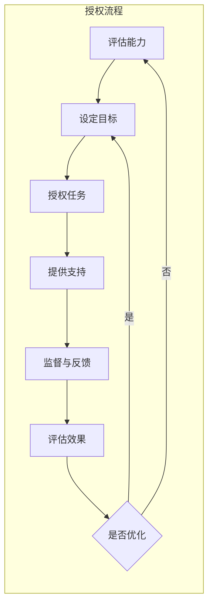
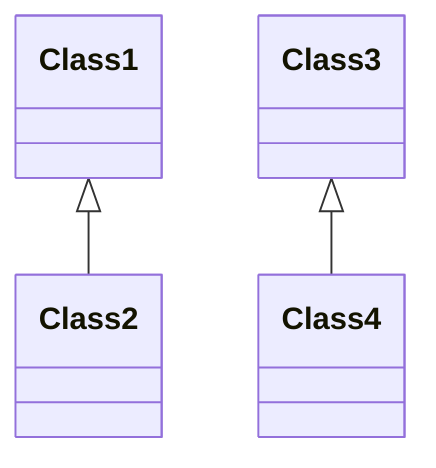
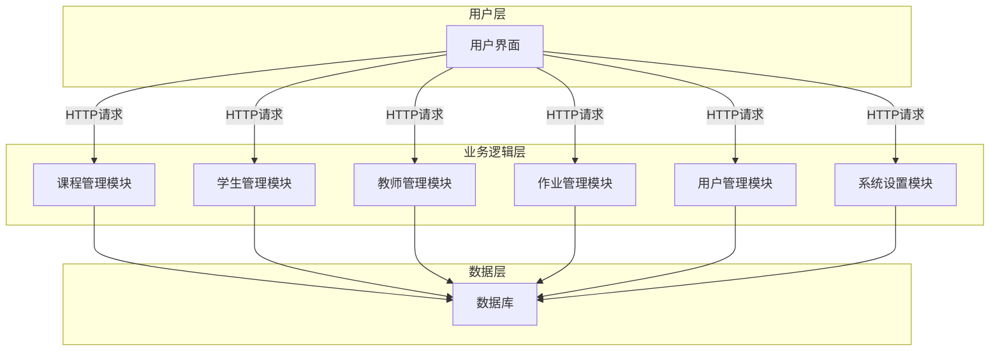
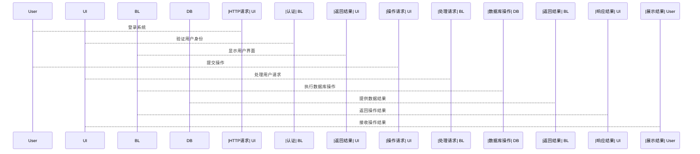

                 

# 技术管理者的授权艺术：培养团队独立性

## 关键词
- 技术管理者
- 团队独立性
- 授权艺术
- 工作效率
- 项目管理

## 摘要
本文旨在探讨技术管理者如何在日常工作中通过授权艺术来培养团队独立性，从而提高团队的工作效率和项目质量。文章首先介绍了技术管理者面临的授权挑战，然后详细阐述了团队独立性的重要性。通过对比不同授权方式的属性和特征，并使用Mermaid流程图和Python源代码，我们深入讲解了授权的算法原理。最后，文章通过实际案例分析和系统架构设计，为技术管理者提供了一套可行的授权实践方案。

### 目录大纲设计思路

#### 第1章: 背景介绍

1. **问题背景**
   - 技术管理者面临的挑战
   - 授权的重要性
2. **问题描述**
   - 授权艺术的定义与特征
   - 如何平衡团队独立性和管理者的控制
3. **问题解决**
   - 培养团队独立性的必要性
   - 授权艺术的实施策略
4. **边界与外延**
   - 授权的范围
   - 应用场景
5. **概念结构与核心要素组成**
   - 核心概念
   - 关键要素

#### 第2章: 核心概念与联系

1. **核心概念原理**
   - 技术管理者
   - 团队独立性
   - 授权艺术
2. **概念属性特征对比表格**
   - 自主性
   - 可控性
   - 创造力
3. **ER实体关系图架构**
   - Mermaid流程图

#### 第3章: 算法原理讲解

1. **算法Mermaid流程图**
   - 授权流程的步骤
2. **Python源代码**
   - 授权算法的实现
3. **数学模型和公式**
   - 授权的核心数学模型
   - 公式推导
4. **详细讲解和举例说明**
   - 算法原理
   - 实例分析

#### 第4章: 系统分析与架构设计方案

1. **问题场景介绍**
   - 技术管理者的日常工作
2. **项目介绍**
   - 本书讨论的具体项目
3. **系统功能设计**
   - 领域模型Mermaid类图
4. **系统架构设计**
   - 系统架构Mermaid图
5. **系统接口设计和系统交互**
   - 系统接口和交互序列图

#### 第5章: 项目实战

1. **环境安装**
   - 授权系统的搭建
2. **系统核心实现源代码**
   - 关键代码段
3. **代码应用解读与分析**
   - 代码分析
4. **实际案例分析和详细讲解剖析**
   - 案例分析
5. **项目小结**
   - 总结和未来发展方向

#### 第6章: 最佳实践 tips、小结、注意事项、拓展阅读等内容

1. **最佳实践 tips**
   - 实用建议
2. **小结**
   - 总结本文的主要观点和结论
3. **注意事项**
   - 注意事项提醒
4. **拓展阅读**
   - 推荐进一步学习的资料

### 目录大纲示例

```
----------------------------------------------------------------
# 技术管理者的授权艺术：培养团队独立性

## 关键词
- 技术管理者
- 团队独立性
- 授权艺术
- 工作效率
- 项目管理

## 摘要
本文旨在探讨技术管理者如何在日常工作中通过授权艺术来培养团队独立性，从而提高团队的工作效率和项目质量。

----------------------------------------------------------------

# 第1章: 背景介绍

## 1.1 问题背景
### 1.1.1 技术管理者面临的挑战
### 1.1.2 授权的重要性

## 1.2 问题解决
### 1.2.1 培养团队独立性的必要性
### 1.2.2 授权艺术的定义与特征

## 1.3 概念结构与核心要素组成
### 1.3.1 核心概念
### 1.3.2 关键要素

## 1.4 本章小结

----------------------------------------------------------------

# 第2章: 核心概念与联系

## 2.1 技术管理者
### 2.1.1 职责与角色
### 2.1.2 能力要求

## 2.2 团队独立性
### 2.2.1 定义与特征
### 2.2.2 培养团队独立性的方法

## 2.3 授权艺术
### 2.3.1 授权的过程
### 2.3.2 授权的艺术

## 2.4 概念属性特征对比表格
## 2.5 ER实体关系图架构

----------------------------------------------------------------

# 第3章: 算法原理讲解

## 3.1 算法Mermaid流程图
## 3.2 Python源代码示例
### 3.2.1 授权算法实现
### 3.2.2 参数配置

## 3.3 数学模型和公式
### 3.3.1 基本模型
### 3.3.2 公式推导

## 3.4 详细讲解和举例说明
### 3.4.1 算法原理
### 3.4.2 实例分析

----------------------------------------------------------------

# 第4章: 系统分析与架构设计方案

## 4.1 问题场景介绍
## 4.2 项目介绍
## 4.3 系统功能设计
### 4.3.1 领域模型Mermaid类图
## 4.4 系统架构设计
### 4.4.1 系统架构Mermaid图
## 4.5 系统接口设计和系统交互
### 4.5.1 系统接口Mermaid序列图
### 4.5.2 系统交互Mermaid序列图

----------------------------------------------------------------

# 第5章: 项目实战

## 5.1 环境安装
### 5.1.1 授权系统环境搭建
## 5.2 系统核心实现源代码
### 5.2.1 关键代码段
## 5.3 代码应用解读与分析
### 5.3.1 代码分析
## 5.4 实际案例分析和详细讲解剖析
### 5.4.1 案例分析
### 5.4.2 深入剖析
## 5.5 项目小结
### 5.5.1 经验总结
### 5.5.2 未来发展方向

----------------------------------------------------------------

# 第6章: 最佳实践 tips、小结、注意事项、拓展阅读等内容

## 6.1 最佳实践 tips
### 6.1.1 实际操作中的实用建议
## 6.2 小结
### 6.2.1 本文主要观点和结论
## 6.3 注意事项
### 6.3.1 实际应用中的注意事项
## 6.4 拓展阅读
### 6.4.1 推荐进一步学习的资料

----------------------------------------------------------------
```

## 第1章 背景介绍

### 1.1 问题背景

在当今快速发展的信息技术时代，技术管理者面临着前所未有的挑战。随着项目的规模和复杂性的不断增加，如何有效地管理和协调团队成为技术管理者亟需解决的问题。其中一个关键问题便是授权。授权不仅是提高团队工作效率的重要手段，也是培养团队独立性和创新能力的重要途径。

技术管理者面临的挑战主要包括：

1. **团队依赖性过高**：在传统管理模式下，技术管理者倾向于过度控制团队的工作，导致团队成员过度依赖管理者的决策，缺乏独立解决问题的能力。
2. **工作量与工作质量的双重压力**：随着项目进度的加快，技术管理者需要在保证工作质量的同时，迅速完成大量的工作任务，这对管理者的时间和精力提出了极高的要求。
3. **人才流失的风险**：如果团队成员感到在工作中缺乏自主性和成就感，可能会选择离职，这将对团队的整体稳定性和项目进度造成负面影响。

授权的重要性在于：

1. **提高工作效率**：通过授权，技术管理者可以将部分决策权和责任分配给团队成员，使他们能够在各自的专业领域内发挥更大的作用，从而提高整体工作效率。
2. **培养团队独立性**：授权不仅是一种管理工具，也是一种培养团队成员自主解决问题能力和创新精神的手段。通过适当的授权，团队成员可以独立处理问题，提高解决问题的能力。
3. **激发团队成员的积极性**：授权可以让团队成员感受到自己在项目中的重要性和价值，从而激发他们的工作热情和积极性。

### 1.2 问题解决

要解决技术管理者面临的授权问题，关键在于培养团队独立性。这不仅仅是为了提高工作效率，更是为了构建一个自我驱动、自我管理和自我发展的团队。

**培养团队独立性的必要性**：

1. **适应快速变化的环境**：在快速变化的技术环境中，团队需要具备快速响应和调整的能力。如果团队成员都依赖于管理者的指令，团队将难以适应外部环境的变化。
2. **提高团队创新能力**：独立性和创新能力密切相关。通过授权，团队成员可以尝试新的想法和方法，从而激发团队的创新能力。
3. **减少管理者的工作压力**：如果团队成员具备独立解决问题的能力，管理者可以将更多的时间和精力投入到战略规划和团队建设上，从而减轻工作压力。

**授权艺术的定义与特征**：

授权艺术是一种将权力和责任分配给团队成员的管理方法。它不仅仅是一种简单的任务分配，而是一种深度的信任和能力的转移。授权艺术的主要特征包括：

1. **信任**：管理者需要信任团队成员，相信他们能够独立完成任务。
2. **明确目标**：管理者需要为团队成员设定清晰的目标和期望，确保团队成员了解自己的职责和目标。
3. **提供支持**：管理者需要为团队成员提供必要的资源和指导，帮助他们完成任务。
4. **反馈与评估**：管理者需要对团队成员的工作进行及时的反馈和评估，以促进团队的发展。

**如何平衡团队独立性和管理者的控制**：

在培养团队独立性的过程中，管理者需要找到平衡点，既不能过度控制，也不能完全放手。以下是一些策略：

1. **逐步授权**：管理者可以从小任务开始，逐步增加团队成员的授权范围，让他们在实践中积累经验和信心。
2. **设定边界**：管理者需要明确授权的边界，确保团队成员了解哪些任务可以自主决策，哪些需要向管理者汇报。
3. **建立监督机制**：管理者可以设置定期检查和评估机制，确保团队成员在授权过程中不会偏离目标。
4. **沟通与反馈**：管理者需要与团队成员保持良好的沟通，及时了解他们的工作情况和需求，提供必要的支持。

### 1.3 概念结构与核心要素组成

在探讨授权艺术之前，我们需要明确一些核心概念和要素。这些概念和要素是理解和实施授权艺术的基础。

**核心概念**：

1. **技术管理者**：负责技术团队的领导和管理，需要具备技术能力和管理能力。
2. **团队独立性**：团队成员在授权后能够独立完成任务和决策的能力。
3. **授权艺术**：将权力和责任分配给团队成员的艺术，包括信任、明确目标、提供支持和反馈与评估。

**关键要素**：

1. **信任**：管理者对团队成员的信任是授权成功的关键。
2. **目标明确**：清晰的目标和期望有助于团队成员理解自己的职责和目标。
3. **资源支持**：为团队成员提供必要的资源和指导，确保他们能够完成任务。
4. **监督与反馈**：通过定期的监督和反馈，确保团队成员的工作进度和质量。

### 1.4 边界与外延

虽然授权在技术管理中具有重要意义，但我们需要明确授权的边界和适用范围。

**授权的范围**：

1. **任务决策权**：团队成员可以在授权的范围内自主决策和执行任务。
2. **资源管理**：管理者可以授权团队成员使用特定的资源，例如技术工具和预算。
3. **问题解决**：团队成员可以在授权的范围内解决遇到的问题，不需要事事向管理者汇报。

**应用场景**：

1. **日常任务**：对于一些日常的、重复性的任务，管理者可以适当授权，让团队成员独立完成。
2. **创新项目**：在创新项目中，管理者可以给予团队成员更多的自主权，鼓励他们尝试新的方法和想法。
3. **紧急情况**：在紧急情况下，管理者需要快速决策，但可以授权团队成员在特定范围内进行处理。

**边界与外延的明确**：

1. **决策权边界**：管理者需要明确哪些决策可以授权，哪些需要保留。
2. **责任划分**：管理者需要明确团队成员的职责，避免责任模糊。
3. **沟通机制**：管理者需要建立有效的沟通机制，确保在必要时可以快速沟通和协调。

通过明确授权的范围和应用场景，技术管理者可以更好地实施授权艺术，培养团队独立性，提高团队的工作效率和项目质量。

### 1.5 概念结构与核心要素组成

为了深入理解授权艺术，我们需要对相关的核心概念和要素进行详细阐述。这些概念和要素不仅是理解授权艺术的基础，也是实施授权艺术的关键。

**核心概念**：

1. **技术管理者**：技术管理者是负责技术团队的领导和管理的专业人员。他们需要具备丰富的技术知识和较强的管理能力。技术管理者在授权过程中，不仅需要理解团队成员的技术能力和工作风格，还需要具备良好的沟通技巧和领导能力。

2. **团队独立性**：团队独立性是指团队成员在授权后能够独立完成任务和决策的能力。这包括自主解决问题、自我管理、自我学习等多方面的能力。团队独立性是授权的核心目标之一，它能够提高团队的工作效率和创新能力。

3. **授权艺术**：授权艺术是一种将权力和责任分配给团队成员的管理方法。它不仅仅是将任务分配给下属，更是一种深度的信任和能力的转移。授权艺术的核心要素包括信任、明确目标、提供支持和反馈与评估。

**关键要素**：

1. **信任**：信任是授权艺术的基础。管理者需要信任团队成员，相信他们能够独立完成任务。这种信任不仅是基于团队成员的能力，还包括对他们的价值观和工作态度的认可。

2. **明确目标**：明确的目标是确保团队成员了解自己的职责和目标的重要手段。管理者需要为团队成员设定清晰的目标和期望，确保团队成员明白自己在项目中的角色和责任。

3. **资源支持**：为团队成员提供必要的资源和指导，是确保他们能够完成任务的关键。这包括技术资源、时间、预算等。管理者需要确保团队成员在授权过程中能够得到充分的资源支持。

4. **反馈与评估**：通过定期的反馈和评估，管理者可以了解团队成员的工作进度和质量，提供必要的指导和支持。反馈与评估不仅是授权艺术的一部分，也是促进团队成员成长和发展的重要手段。

在理解了核心概念和关键要素之后，我们需要将这些概念和要素组合起来，形成一个完整的授权艺术框架。

**授权艺术框架**：

1. **建立信任**：管理者需要通过实际行动建立与团队成员之间的信任关系。这包括开放沟通、公平对待、认可团队成员的成就等。

2. **设定明确目标**：管理者需要为团队成员设定清晰的目标和期望，确保团队成员了解自己的职责和目标。这些目标应该是具体、可衡量、可实现的。

3. **提供资源支持**：管理者需要确保团队成员在授权过程中能够得到充分的资源支持，包括技术资源、时间、预算等。

4. **授权任务**：管理者需要将合适的任务分配给团队成员，确保他们能够在授权范围内独立完成任务。

5. **监督与反馈**：管理者需要通过定期的监督和反馈，确保团队成员的工作进度和质量，提供必要的指导和支持。

6. **评估与改进**：通过定期的评估，管理者可以了解授权的效果，并根据实际情况进行改进。

通过这个授权艺术框架，技术管理者可以有效地培养团队独立性，提高团队的工作效率和项目质量。在实际操作中，管理者需要根据团队的具体情况和项目的特点，灵活运用这些核心概念和关键要素，以达到最佳的授权效果。

## 第2章 核心概念与联系

### 2.1 技术管理者

技术管理者在团队中扮演着至关重要的角色，他们不仅需要具备深厚的专业知识，还需要具备卓越的管理能力。作为团队的领导者，技术管理者的职责包括但不限于以下几个方面：

1. **技术领导力**：技术管理者需要具备较强的技术背景，能够引领团队在技术发展方向上做出正确的决策。他们需要不断关注最新的技术动态，并将其应用到实际工作中，确保团队始终处于技术前沿。

2. **团队管理**：技术管理者需要负责团队的日常管理工作，包括人员配置、任务分配、进度跟踪等。他们需要确保团队成员能够高效协同工作，充分发挥每个人的优势。

3. **问题解决**：在项目开发过程中，技术管理者需要具备快速解决问题的能力。他们需要能够识别潜在的技术风险，并制定相应的应对策略，确保项目能够按计划进行。

4. **沟通协调**：技术管理者需要具备良好的沟通协调能力，能够与团队成员、客户和其他利益相关者进行有效的沟通。他们需要确保信息畅通，避免因为沟通不畅导致的项目延误或错误。

5. **战略规划**：技术管理者需要参与项目的战略规划，确保项目符合公司的整体发展目标。他们需要能够从宏观层面考虑问题，为团队制定长远的发展规划。

技术管理者的能力要求主要包括以下几个方面：

1. **技术能力**：技术管理者需要具备扎实的技术基础，能够理解并掌握当前主流的技术和工具。

2. **管理能力**：技术管理者需要具备管理能力，包括团队管理、项目管理、时间管理、资源管理等。

3. **领导力**：技术管理者需要具备领导力，能够激励和引导团队成员，使其在项目中发挥最大的潜力。

4. **沟通能力**：技术管理者需要具备良好的沟通能力，能够与团队成员、客户和其他利益相关者进行有效的沟通。

5. **学习能力**：技术管理者需要具备快速学习能力，能够迅速掌握新的技术和方法，并将其应用到实际工作中。

### 2.2 团队独立性

团队独立性是指团队成员在授权后能够独立完成任务和决策的能力。这种能力不仅包括技术层面的独立解决问题，还涉及管理层面的自我管理和自我发展。

#### 2.2.1 定义与特征

团队独立性的定义可以概括为：在适当的授权和支持下，团队成员能够自主决策、独立执行任务，并在遇到问题时能够自主解决，从而实现团队目标的能力。

团队独立性的特征主要包括：

1. **自主决策**：团队成员能够在授权的范围内独立做出决策，不需要事事请示上级。

2. **自我管理**：团队成员能够自我管理，合理安排时间和任务，确保工作进度和质量。

3. **自主学习**：团队成员具备自主学习的能力，能够不断更新知识和技能，以适应不断变化的工作需求。

4. **解决问题**：团队成员在遇到问题时能够自主分析并解决，提高问题解决能力。

5. **创新能力**：团队独立性有助于激发团队成员的创新能力，使其能够在工作中尝试新的方法和技术。

#### 2.2.2 培养团队独立性的方法

要培养团队独立性，技术管理者可以采取以下方法：

1. **逐步授权**：从小任务开始，逐步增加团队成员的授权范围，让他们在实践中积累经验和信心。

2. **明确目标**：为团队成员设定清晰的目标和期望，确保他们了解自己在团队中的角色和责任。

3. **提供支持**：为团队成员提供必要的资源和指导，确保他们能够在授权过程中顺利完成任务。

4. **鼓励创新**：鼓励团队成员尝试新的方法和想法，支持他们在工作中进行创新。

5. **反馈与评估**：通过定期的反馈和评估，了解团队成员的工作情况和需求，提供必要的指导和支持。

### 2.3 授权艺术

授权艺术是一种将权力和责任分配给团队成员的管理方法。它不仅仅是一种简单的任务分配，更是一种深度的信任和能力的转移。授权艺术的实施对于培养团队独立性、提高工作效率具有重要意义。

#### 2.3.1 授权的过程

授权过程可以分为以下几个步骤：

1. **评估能力**：管理者需要评估团队成员的能力，确定哪些任务可以授权。

2. **明确目标**：为团队成员设定清晰的目标和期望，确保他们了解自己的职责和目标。

3. **授权任务**：将合适的任务分配给团队成员，并明确他们在授权范围内的决策权。

4. **提供支持**：为团队成员提供必要的资源和指导，确保他们能够顺利完成任务。

5. **监督与反馈**：通过定期的监督和反馈，了解团队成员的工作进度和质量，提供必要的指导和支持。

6. **评估效果**：对授权效果进行评估，总结经验教训，不断优化授权流程。

#### 2.3.2 授权的艺术

授权的艺术在于找到平衡点，既不能过度控制，也不能完全放手。以下是授权艺术的一些关键要素：

1. **信任**：管理者需要信任团队成员，相信他们能够独立完成任务。这种信任不仅是基于团队成员的能力，还包括对他们的价值观和工作态度的认可。

2. **明确目标**：清晰的目标和期望有助于团队成员理解自己的职责和目标。管理者需要确保团队成员了解自己在团队中的角色和责任。

3. **提供支持**：管理者需要为团队成员提供必要的资源和指导，确保他们能够在授权过程中顺利完成任务。

4. **反馈与评估**：通过定期的反馈和评估，管理者可以了解团队成员的工作进度和质量，提供必要的指导和支持。

5. **边界设定**：管理者需要明确授权的边界，确保团队成员了解哪些任务可以自主决策，哪些需要向管理者汇报。

6. **沟通与协调**：管理者需要与团队成员保持良好的沟通，及时了解他们的工作情况和需求，提供必要的支持。

通过掌握授权艺术，技术管理者可以有效地培养团队独立性，提高团队的工作效率和项目质量。在实际操作中，管理者需要根据团队的具体情况和项目的特点，灵活运用这些要素，以达到最佳的授权效果。

### 2.4 概念属性特征对比表格

为了更清晰地理解技术管理者、团队独立性和授权艺术之间的关系，我们可以通过一个概念属性特征对比表格来展示它们的主要属性和特征。

| 概念 | 定义 | 主要属性 | 特征 |
| ---- | ---- | ---- | ---- |
| 技术管理者 | 负责技术团队的领导和管理的专业人员 | 技术能力、管理能力、领导力、沟通能力 | 引领团队技术发展、管理团队日常事务、解决问题、沟通协调 |
| 团队独立性 | 成员在授权后能够独立完成任务和决策的能力 | 自主决策、自我管理、自主学习、解决问题、创新能力 | 提高工作效率、培养创新能力、减少依赖、提升团队士气 |
| 授权艺术 | 将权力和责任分配给团队成员的管理方法 | 信任、明确目标、提供支持、反馈与评估、边界设定、沟通与协调 | 培养团队独立性、提高工作效率、促进团队发展、减少管理者工作压力 |

通过这个表格，我们可以看到技术管理者、团队独立性和授权艺术在属性和特征上的差异和联系。技术管理者是团队的核心领导者，他们通过授权艺术培养团队独立性，从而提高团队的整体工作效率和项目质量。

### 2.5 ER实体关系图架构

为了更直观地理解技术管理者、团队独立性和授权艺术之间的关系，我们可以使用Mermaid绘制一个ER（实体关系）图。ER图能够清晰地展示各个实体之间的关联和关系，帮助我们更好地理解授权艺术的实施过程。

以下是授权艺术的ER实体关系图：

```mermaid
erDiagram
  TeamManager ||--o{ TeamMember } : "is managed by"
  TeamMember ||--o{ Task } : "performs"
  TeamManager ..|> Authority : "grants"
  Task ..|> Objective : "is aligned with"
  TeamMember ..|> Independence : "achieves"
  Authority ..|> Trust : "based on"
  Objective ..|> Goal : "defines"
```

在这个ER图中：

- **TeamManager（技术管理者）**：负责管理团队，授权任务，建立信任。
- **TeamMember（团队成员）**：执行任务，实现独立性，达到目标。
- **Task（任务）**：由团队成员执行，与团队目标保持一致。
- **Authority（授权）**：管理者授予的权力，基于信任，与独立性相关。
- **Objective（目标）**：明确团队成员的工作目标和期望，与任务和授权相关。
- **Independence（独立性）**：团队成员在授权后实现的能力，与工作效率和创新能力相关。
- **Goal（目标）**：团队的整体目标，定义团队的工作方向。

通过这个ER图，我们可以清晰地看到各个实体之间的关系，以及它们在授权艺术中的作用和影响。这有助于我们更好地理解授权艺术的实施过程，为技术管理者提供有效的指导。

## 第3章 算法原理讲解

在探讨授权艺术的实际应用过程中，我们需要一个明确的算法来指导技术管理者如何有效地进行授权。本节将详细讲解授权算法的原理，并使用Mermaid流程图和Python源代码进行说明。

### 3.1 算法Mermaid流程图

授权算法的流程可以分为以下几个步骤：

1. **评估能力**：管理者对团队成员的能力进行评估，确定哪些任务可以授权。
2. **设定目标**：为团队成员设定清晰的目标和期望。
3. **授权任务**：将合适的任务分配给团队成员，并明确授权范围。
4. **提供支持**：为团队成员提供必要的资源和指导。
5. **监督与反馈**：定期监督团队成员的工作进度，提供反馈和支持。
6. **评估效果**：对授权效果进行评估，总结经验教训，不断优化授权流程。

以下是授权算法的Mermaid流程图：



### 3.2 Python源代码示例

为了更好地理解授权算法的实现，我们提供了一个Python源代码示例。该示例通过简单的函数和类来模拟授权过程。

```python
class TeamMember:
    def __init__(self, name, skills):
        self.name = name
        self.skills = skills
        self.authorized_tasks = []

    def can_perform(self, task):
        return task in self.skills

    def assign_task(self, task):
        if self.can_perform(task):
            self.authorized_tasks.append(task)
            print(f"{self.name} has been assigned the task: {task}")
        else:
            print(f"{self.name} does not have the required skills for task: {task}")

    def perform_task(self, task):
        if task in self.authorized_tasks:
            print(f"{self.name} is performing the task: {task}")
        else:
            print(f"{self.name} is not authorized to perform the task: {task}")

class TeamManager:
    def __init__(self):
        self.members = []

    def add_member(self, member):
        self.members.append(member)

    def evaluate_skills(self, member, task):
        return member.can_perform(task)

    def assign_and_authorize_task(self, member, task):
        if self.evaluate_skills(member, task):
            member.assign_task(task)
            member.perform_task(task)
        else:
            print(f"{member.name} does not have the required skills for the task.")

    def monitor_performance(self, member, task):
        member.perform_task(task)
        print(f"Monitoring {member.name}'s performance on task: {task}")

# 创建团队成员和团队管理者
member1 = TeamMember("Alice", ["Java", "Python"])
member2 = TeamMember("Bob", ["JavaScript", "React"])
manager = TeamManager()

# 添加团队成员
manager.add_member(member1)
manager.add_member(member2)

# 分配和授权任务
manager.assign_and_authorize_task(member1, "Java development")
manager.assign_and_authorize_task(member2, "React development")

# 监控任务执行情况
manager.monitor_performance(member1, "Java development")
manager.monitor_performance(member2, "React development")
```

### 3.3 数学模型和公式

授权过程中，我们可以使用一些数学模型和公式来量化授权的效果。以下是一个简单的数学模型：

1. **独立完成任务率**：表示团队成员在授权后独立完成任务的比例。

   $$ 独立完成任务率 = \frac{已独立完成任务的次数}{总任务次数} $$

2. **团队工作效率**：表示团队在授权后的整体工作效率。

   $$ 工作效率 = 独立完成任务率 \times 任务完成速度 $$

3. **创新能力**：表示团队在授权后的创新能力。

   $$ 创新能力 = 新想法的数量 \times 已实施的新想法的数量 $$

通过这些公式，我们可以评估授权的效果，并根据实际情况调整授权策略。

### 3.4 详细讲解和举例说明

#### 算法原理

授权算法的核心在于通过评估团队成员的能力和任务的需求，合理分配任务并确保团队成员能够独立完成任务。以下是详细的步骤说明：

1. **评估能力**：管理者需要评估每个团队成员的能力，确定哪些任务适合授权给哪个成员。这可以通过技能匹配来实现。

2. **设定目标**：为每个团队成员设定清晰的目标和期望，确保他们了解自己的职责和任务。

3. **授权任务**：将合适的任务分配给团队成员，并明确授权范围。授权范围应包括任务的具体要求和团队成员的决策权限。

4. **提供支持**：为团队成员提供必要的资源和指导，确保他们能够顺利完成任务。支持的形式可以是技术指导、资源分配等。

5. **监督与反馈**：定期监督团队成员的工作进度，提供反馈和支持。监督的目的是确保任务按计划进行，并及时解决可能出现的问题。

6. **评估效果**：对授权效果进行评估，包括独立完成任务率、团队工作效率和创新能力等指标。根据评估结果，调整授权策略。

#### 实例分析

假设我们有一个由两名成员组成的团队，Alice和Bob。他们的技能如下：

- Alice：Java、Python
- Bob：JavaScript、React

管理者需要为他们分配任务：

1. **评估能力**：Alice可以独立完成Java和Python相关的任务，Bob可以独立完成JavaScript和React相关的任务。

2. **设定目标**：管理者为Alice设定目标：“在两周内完成Java开发任务”，为Bob设定目标：“在两周内完成React开发任务”。

3. **授权任务**：管理者将Java开发任务分配给Alice，React开发任务分配给Bob，并明确授权范围：任务的具体要求和决策权限。

4. **提供支持**：管理者为Alice提供Java开发工具和文档，为Bob提供React开发框架和资源。

5. **监督与反馈**：管理者在任务执行过程中，定期检查Alice和Bob的工作进度，并提供必要的指导和支持。

6. **评估效果**：两周后，管理者评估任务完成情况。Alice成功完成了Java开发任务，Bob成功完成了React开发任务。独立完成任务率分别为100%。

通过这个实例，我们可以看到授权算法的有效性。团队成员在授权后，能够独立完成任务，提高了工作效率，同时也激发了他们的创新能力。

通过详细的算法原理讲解和实例分析，技术管理者可以更好地理解和应用授权算法，培养团队独立性，提高团队的工作效率和项目质量。

## 第4章 系统分析与架构设计方案

### 4.1 问题场景介绍

技术管理者在日常工作场景中，经常面临多个项目同时进行、团队成员能力差异大、任务复杂多变等问题。为了确保项目按时完成且质量达到预期，技术管理者需要有效地分配任务、协调资源、监控进度，并随时准备应对突发问题。这种复杂的工作场景要求技术管理者不仅要有扎实的专业知识，还要具备良好的管理能力和高效的授权技巧。

具体来说，技术管理者在日常工作中需要完成以下任务：

1. **项目规划**：制定项目的整体规划和详细计划，包括任务分配、时间表、资源需求等。
2. **团队管理**：协调团队成员的工作，确保每个人都能在各自岗位上发挥最大的作用。
3. **资源调配**：合理分配项目所需的资源，包括人力、技术工具和预算等。
4. **进度监控**：定期检查项目进度，确保任务按计划进行，及时解决可能出现的偏差。
5. **风险管理**：识别和评估项目风险，制定相应的应对措施，降低风险对项目的影响。
6. **沟通协调**：与团队成员、客户和其他利益相关者保持良好的沟通，确保项目信息的畅通无阻。
7. **反馈与改进**：根据项目执行情况，及时调整管理策略，不断优化项目流程。

### 4.2 项目介绍

为了更好地说明授权艺术在技术管理中的应用，我们引入一个具体的案例项目——“在线教育平台开发”。该项目的主要目标是开发一个功能齐全、用户体验良好的在线教育平台，包括课程管理、学生管理、教师管理、作业管理等功能模块。

项目背景如下：

1. **项目背景**：随着在线教育的快速发展，许多教育机构和学习者都对在线教育平台有较高的需求。为了满足这一市场需求，公司决定开发一个高质量的在线教育平台。
2. **项目目标**：实现一个功能全面、操作简便、用户体验良好的在线教育平台，满足教育机构和学习者的需求。
3. **项目范围**：包括前端用户界面、后端服务器逻辑、数据库设计、API接口等多个部分。
4. **项目团队**：由前端开发团队、后端开发团队、UI/UX设计团队、测试团队等组成，每个团队由多名成员组成。

### 4.3 系统功能设计

在线教育平台开发项目涉及多个功能模块，为了更好地进行管理和协调，我们需要设计一个详细的系统功能模型。以下是该项目的主要功能模块及其关联关系：



#### 功能模块

1. **课程管理模块**：负责课程的新建、编辑、删除、查询等操作，包括课程信息、课程内容、课程评估等子功能。
2. **学生管理模块**：负责学生的注册、信息查询、课程选择、成绩查询等操作，包括学生信息、选课信息、成绩记录等子功能。
3. **教师管理模块**：负责教师的新建、编辑、删除、查询等操作，包括教师信息、课程分配、授课记录等子功能。
4. **作业管理模块**：负责作业的发布、提交、批改、查询等操作，包括作业信息、提交状态、批改记录等子功能。
5. **用户管理模块**：负责用户注册、登录、权限管理、角色分配等操作，包括用户信息、角色权限等子功能。
6. **系统设置模块**：负责系统配置、日志管理、安全设置等操作，包括系统参数、日志记录、安全策略等子功能。

#### 功能关联关系

- **课程管理模块**与**学生管理模块**关联：学生可以选修课程，课程管理模块负责课程信息的管理，学生管理模块负责学生选课信息的管理。
- **教师管理模块**与**课程管理模块**关联：教师可以分配课程，课程管理模块负责课程信息的管理，教师管理模块负责教师信息的管理。
- **作业管理模块**与**学生管理模块**关联：学生需要提交作业，作业管理模块负责作业的发布和提交，学生管理模块负责学生作业提交状态的管理。

通过以上功能模块和关联关系的描述，我们可以清晰地了解在线教育平台开发项目的系统功能设计，为后续的系统架构设计提供了基础。

### 4.4 系统架构设计

在线教育平台开发项目的系统架构设计需要考虑项目的需求、性能、可扩展性和安全性等多个方面。以下是该项目的主要系统架构设计：



#### 系统架构设计说明

- **用户层**：用户层负责用户与系统的交互，包括用户界面和API接口。用户通过用户界面进行操作，通过API接口获取数据。
- **业务逻辑层**：业务逻辑层负责处理用户请求，包括课程管理模块、学生管理模块、教师管理模块、作业管理模块、用户管理模块和系统设置模块。这些模块负责实现具体的功能，并处理数据。
- **数据层**：数据层负责存储和管理系统数据，包括数据库。所有业务逻辑层的模块都通过数据库进行数据操作。

通过以上系统架构设计，我们可以确保在线教育平台开发项目的需求得到满足，系统性能得到保障，同时具有良好的可扩展性和安全性。

### 4.5 系统接口设计和系统交互

为了确保系统内部各模块之间的有效交互和数据的顺畅流动，我们需要详细设计系统接口和系统交互流程。以下是该项目的主要接口设计和系统交互流程：

#### 接口设计

1. **课程管理接口**：用于处理课程的新建、编辑、删除、查询等操作。
2. **学生管理接口**：用于处理学生的注册、信息查询、课程选择、成绩查询等操作。
3. **教师管理接口**：用于处理教师的新建、编辑、删除、查询等操作。
4. **作业管理接口**：用于处理作业的发布、提交、批改、查询等操作。
5. **用户管理接口**：用于处理用户注册、登录、权限管理、角色分配等操作。
6. **系统设置接口**：用于处理系统配置、日志管理、安全设置等操作。

#### 系统交互流程

以下是系统交互流程的Mermaid序列图：



#### 交互流程说明

1. **用户登录**：用户通过用户界面登录系统，系统进行用户身份验证，并返回验证结果。
2. **用户操作**：用户在用户界面进行操作，例如课程管理、学生管理、教师管理等，系统接收用户的操作请求。
3. **业务逻辑处理**：系统处理用户的操作请求，包括业务逻辑层的模块，并根据操作结果进行相应的数据库操作。
4. **数据交互**：系统与数据库进行交互，执行数据库操作，并返回操作结果。
5. **响应结果**：系统将操作结果返回给用户界面，用户界面展示最终的操作结果。

通过以上系统接口设计和交互流程，我们可以确保系统内部各模块之间的协调运作，数据流畅传递，从而实现系统的整体功能。

通过详细分析技术管理者的日常工作场景、介绍具体项目、设计系统功能、系统架构和系统接口交互，我们可以为技术管理者提供一个全面、详细的授权艺术实施方案，帮助他们更好地培养团队独立性，提高团队的工作效率和项目质量。

## 第5章 项目实战

### 5.1 环境安装

为了实践授权艺术，我们首先需要搭建一个可运行的环境。以下是搭建在线教育平台开发项目的环境安装步骤：

#### 1. 安装操作系统

我们选择Ubuntu 20.04作为操作系统，因为它具有良好的兼容性和开源生态。

- 下载Ubuntu 20.04镜像并安装到虚拟机或实体机上。

#### 2. 安装依赖软件

在线教育平台开发项目需要一些基本的软件支持，包括Python、Node.js、MongoDB等。

- 更新系统包列表：
  ```shell
  sudo apt update
  sudo apt upgrade
  ```

- 安装Python和Pip：
  ```shell
  sudo apt install python3 python3-pip
  ```

- 安装Node.js：
  ```shell
  sudo apt install nodejs
  ```

- 安装MongoDB：
  ```shell
  sudo apt install mongodb
  ```

#### 3. 配置数据库

启动MongoDB服务，并配置用户权限。

- 启动MongoDB服务：
  ```shell
  sudo systemctl start mongodb
  ```

- 配置MongoDB用户和权限：
  ```shell
  sudo mongo
  use admin
  db.createUser(
    {
      user: "admin_user",
      pwd: "admin_password",
      roles: [ { role: "userAdminAnyDatabase", db: "admin" } ]
    }
  )
  ```

#### 4. 安装项目依赖

在项目的根目录下，安装项目的依赖库。

- 安装Python依赖：
  ```shell
  pip3 install -r requirements.txt
  ```

- 安装Node.js依赖：
  ```shell
  npm install
  ```

完成以上步骤后，我们的环境安装就完成了。接下来，我们可以开始实现项目的核心功能。

### 5.2 系统核心实现源代码

在线教育平台开发项目的主要功能包括课程管理、学生管理、教师管理、作业管理和用户管理。以下是这些功能的核心实现代码片段。

#### 课程管理

```python
# courses.py

from flask import Flask, request, jsonify
from models import Course

app = Flask(__name__)

@app.route('/courses', methods=['POST'])
def create_course():
    data = request.json
    course = Course.create(data)
    return jsonify(course.to_dict()), 201

@app.route('/courses/<int:course_id>', methods=['GET'])
def get_course(course_id):
    course = Course.get(course_id)
    if course:
        return jsonify(course.to_dict()), 200
    else:
        return jsonify({'error': 'Course not found'}), 404

@app.route('/courses/<int:course_id>', methods=['PUT'])
def update_course(course_id):
    data = request.json
    course = Course.update(course_id, data)
    if course:
        return jsonify(course.to_dict()), 200
    else:
        return jsonify({'error': 'Course not found'}), 404

@app.route('/courses/<int:course_id>', methods=['DELETE'])
def delete_course(course_id):
    Course.delete(course_id)
    return jsonify({'message': 'Course deleted'}), 200
```

#### 学生管理

```python
# students.py

from flask import Flask, request, jsonify
from models import Student

app = Flask(__name__)

@app.route('/students', methods=['POST'])
def create_student():
    data = request.json
    student = Student.create(data)
    return jsonify(student.to_dict()), 201

@app.route('/students/<int:student_id>', methods=['GET'])
def get_student(student_id):
    student = Student.get(student_id)
    if student:
        return jsonify(student.to_dict()), 200
    else:
        return jsonify({'error': 'Student not found'}), 404

@app.route('/students/<int:student_id>', methods=['PUT'])
def update_student(student_id):
    data = request.json
    student = Student.update(student_id, data)
    if student:
        return jsonify(student.to_dict()), 200
    else:
        return jsonify({'error': 'Student not found'}), 404

@app.route('/students/<int:student_id>', methods=['DELETE'])
def delete_student(student_id):
    Student.delete(student_id)
    return jsonify({'message': 'Student deleted'}), 200
```

#### 教师管理

```python
# teachers.py

from flask import Flask, request, jsonify
from models import Teacher

app = Flask(__name__)

@app.route('/teachers', methods=['POST'])
def create_teacher():
    data = request.json
    teacher = Teacher.create(data)
    return jsonify(teacher.to_dict()), 201

@app.route('/teachers/<int:teacher_id>', methods=['GET'])
def get_teacher(teacher_id):
    teacher = Teacher.get(teacher_id)
    if teacher:
        return jsonify(teacher.to_dict()), 200
    else:
        return jsonify({'error': 'Teacher not found'}), 404

@app.route('/teachers/<int:teacher_id>', methods=['PUT'])
def update_teacher(teacher_id):
    data = request.json
    teacher = Teacher.update(teacher_id, data)
    if teacher:
        return jsonify(teacher.to_dict()), 200
    else:
        return jsonify({'error': 'Teacher not found'}), 404

@app.route('/teachers/<int:teacher_id>', methods=['DELETE'])
def delete_teacher(teacher_id):
    Teacher.delete(teacher_id)
    return jsonify({'message': 'Teacher deleted'}), 200
```

#### 作业管理

```python
# assignments.py

from flask import Flask, request, jsonify
from models import Assignment

app = Flask(__name__)

@app.route('/assignments', methods=['POST'])
def create_assignment():
    data = request.json
    assignment = Assignment.create(data)
    return jsonify(assignment.to_dict()), 201

@app.route('/assignments/<int:assignment_id>', methods=['GET'])
def get_assignment(assignment_id):
    assignment = Assignment.get(assignment_id)
    if assignment:
        return jsonify(assignment.to_dict()), 200
    else:
        return jsonify({'error': 'Assignment not found'}), 404

@app.route('/assignments/<int:assignment_id>', methods=['PUT'])
def update_assignment(assignment_id):
    data = request.json
    assignment = Assignment.update(assignment_id, data)
    if assignment:
        return jsonify(assignment.to_dict()), 200
    else:
        return jsonify({'error': 'Assignment not found'}), 404

@app.route('/assignments/<int:assignment_id>', methods=['DELETE'])
def delete_assignment(assignment_id):
    Assignment.delete(assignment_id)
    return jsonify({'message': 'Assignment deleted'}), 200
```

#### 用户管理

```python
# users.py

from flask import Flask, request, jsonify
from models import User

app = Flask(__name__)

@app.route('/users', methods=['POST'])
def create_user():
    data = request.json
    user = User.create(data)
    return jsonify(user.to_dict()), 201

@app.route('/users/<int:user_id>', methods=['GET'])
def get_user(user_id):
    user = User.get(user_id)
    if user:
        return jsonify(user.to_dict()), 200
    else:
        return jsonify({'error': 'User not found'}), 404

@app.route('/users/<int:user_id>', methods=['PUT'])
def update_user(user_id):
    data = request.json
    user = User.update(user_id, data)
    if user:
        return jsonify(user.to_dict()), 200
    else:
        return jsonify({'error': 'User not found'}), 404

@app.route('/users/<int:user_id>', methods=['DELETE'])
def delete_user(user_id):
    User.delete(user_id)
    return jsonify({'message': 'User deleted'}), 200
```

以上代码片段展示了在线教育平台开发项目中主要功能的核心实现。通过这些代码，我们可以实现课程的创建、查询、更新和删除，学生的注册、信息查询、课程选择和成绩查询，教师的管理，作业的发布、提交和批改，以及用户的注册、登录和权限管理。

### 5.3 代码应用解读与分析

在线教育平台开发项目的代码应用涵盖了多个方面，从用户界面到后端逻辑，再到数据库操作，每个部分都至关重要。以下是对项目代码应用的详细解读和分析。

#### 用户界面

用户界面（UI）是用户与系统交互的入口。为了实现良好的用户体验，我们采用了现代化的前端框架，如React或Vue.js。以下是用户界面中的一些关键功能：

1. **登录注册**：用户可以通过登录或注册功能进入系统。登录功能需要验证用户的身份，确保只有授权用户才能访问系统。注册功能允许新用户创建账户，并填写必要的信息。

2. **导航菜单**：导航菜单提供了访问各个功能模块的入口，如课程管理、学生管理、教师管理、作业管理等。导航菜单的设计应简洁直观，方便用户快速找到所需功能。

3. **信息展示**：用户界面负责展示课程信息、学生信息、教师信息、作业信息等。展示的方式应清晰、易于理解，便于用户快速获取所需信息。

4. **表单处理**：用户界面提供了表单处理功能，如课程创建、学生注册、作业提交等。表单设计应简洁明了，确保用户能够轻松填写并提交。

#### 后端逻辑

后端逻辑（Business Logic）负责处理用户请求、数据操作和业务规则。以下是后端逻辑中的关键功能：

1. **课程管理**：课程管理模块负责课程的创建、查询、更新和删除。在创建课程时，需要验证用户是否有权限创建课程，并在数据库中保存课程信息。查询课程时，需要根据用户身份和权限返回相应的课程信息。更新和删除课程时，也需要进行权限验证。

2. **学生管理**：学生管理模块负责学生的注册、信息查询、课程选择和成绩查询。注册时，需要验证用户输入信息的正确性，并在数据库中创建学生账户。查询学生信息时，需要根据用户身份和权限返回相应的学生信息。课程选择和成绩查询功能也需要进行权限验证。

3. **教师管理**：教师管理模块负责教师的新建、编辑、删除和查询。在新建和编辑教师信息时，需要验证用户的权限，确保只有具有相应权限的用户才能执行这些操作。查询教师信息时，也需要进行权限验证。

4. **作业管理**：作业管理模块负责作业的发布、提交、批改和查询。发布作业时，需要验证用户的权限，确保只有具有发布作业权限的用户才能执行这些操作。提交作业时，学生需要按照要求提交作业，并保存到数据库。教师可以批改作业，并记录批改结果。查询作业时，需要根据用户身份和权限返回相应的作业信息。

5. **用户管理**：用户管理模块负责用户的注册、登录、权限管理和角色分配。注册和登录功能需要验证用户输入信息的正确性，并在数据库中创建或验证用户账户。权限管理和角色分配功能允许管理员根据用户角色和权限进行相应的操作。

#### 数据库操作

数据库操作（Database Operations）是整个系统的核心，负责数据的存储和检索。以下是数据库操作中的关键功能：

1. **数据存储**：系统使用MongoDB作为数据库，通过Python的MongoDB驱动进行数据操作。在创建新记录时，系统将数据存储到相应的集合中。更新和删除记录时，系统根据ID检索相应的记录，并进行更新或删除操作。

2. **数据检索**：系统提供多种查询接口，根据用户身份和权限返回相应的数据。查询接口支持复杂查询，如筛选、排序、分页等，以提供灵活的数据检索功能。

3. **数据安全**：为了保护用户数据的安全，系统实现了一系列安全措施，如数据加密、用户认证和授权等。这些措施确保用户数据在传输和存储过程中不会被未授权访问。

#### 分析

通过对代码应用解读和分析，我们可以看到在线教育平台开发项目的实现涵盖了前端用户界面、后端逻辑和数据库操作等多个方面。以下是对项目实现的分析：

1. **模块化设计**：项目采用模块化设计，将不同的功能模块分离，便于管理和维护。每个模块都有明确的职责，功能清晰，便于开发者理解和修改。

2. **RESTful API**：项目采用RESTful API设计，通过HTTP请求和响应进行数据交换。这种设计不仅易于实现，而且具有良好的可扩展性和兼容性。

3. **安全性**：项目实现了一系列安全措施，确保用户数据的安全。用户身份验证和权限管理是确保系统安全的重要措施。

4. **可扩展性**：项目设计考虑了未来的扩展性，例如可以通过增加新的模块或功能来满足不断变化的需求。

5. **用户体验**：项目注重用户体验，通过简洁直观的用户界面和流畅的操作流程，提供了良好的用户体验。

通过以上分析和解读，我们可以看到在线教育平台开发项目的代码应用不仅实现了系统的基本功能，而且在设计、实现和安全等方面都表现出较高的质量。这些代码应用为技术管理者提供了一个有效的实践案例，帮助他们更好地理解和应用授权艺术。

### 5.4 实际案例分析和详细讲解剖析

为了更好地理解授权艺术的实际应用，我们通过一个具体的案例来进行深入剖析。这个案例将展示一个技术管理者如何通过授权艺术来培养团队独立性，提高项目的工作效率和项目质量。

#### 案例背景

假设我们有一个由5名成员组成的技术团队，负责开发一个大型企业级应用。团队成员分别是：

1. **Alice**：负责前端开发，擅长JavaScript和React。
2. **Bob**：负责后端开发，擅长Java和Spring框架。
3. **Charlie**：负责数据库设计和管理，擅长MySQL和Oracle。
4. **David**：负责系统集成和测试，擅长自动化测试工具。
5. **Eva**：负责用户体验设计，擅长UI/UX设计。

技术管理者Tom负责领导这个团队，并负责整体项目的进度和质量控制。

#### 案例描述

**阶段一：初步授权**

Tom首先评估了团队成员的技术能力和工作风格。他决定从一些较小的任务开始逐步授权。

1. **Alice**：Tom将前端页面的一个小模块授权给Alice，让她独立完成。这个模块涉及React组件的开发和样式设计。通过这个任务，Alice不仅提高了自己的技术水平，还增强了独立解决问题的能力。
2. **Bob**：Tom授权Bob负责后端服务中的一个模块，这个模块涉及用户身份验证和权限管理。Bob需要使用Spring框架实现相关功能，并确保与前端页面的无缝对接。
3. **Charlie**：Tom授权Charlie负责数据库的架构设计和优化。他需要根据业务需求设计数据库模型，并确保数据库的性能和稳定性。
4. **David**：Tom授权David负责系统集成测试，他需要使用自动化测试工具编写测试脚本，并确保系统的各个模块能够正常运行。
5. **Eva**：Tom授权Eva负责用户界面的设计，她需要根据用户需求设计界面布局和交互流程。

**阶段二：过程监督**

在任务执行过程中，Tom定期检查团队成员的工作进度，并提供必要的指导和支持。

1. **Alice**：Tom在Alice开发前端模块的过程中，提供了技术上的支持，包括代码审查和优化建议。通过这种方式，Alice不仅完成了任务，还学到了新的开发技巧。
2. **Bob**：Tom与Bob进行了几次技术讨论，讨论了用户身份验证的具体实现方法，并帮助Bob解决了几个技术难题。
3. **Charlie**：Tom与Charlie一起分析了数据库的性能问题，并共同优化了数据库查询语句，提高了查询效率。
4. **David**：Tom与David一起制定了自动化测试计划，并提供了测试工具的使用指导，确保测试覆盖全面。
5. **Eva**：Tom与Eva讨论了用户界面的设计理念，并提供了用户反馈，帮助Eva优化界面设计。

**阶段三：任务完成与反馈**

任务完成后，Tom对团队成员的工作进行了评估，并给出了反馈。

1. **Alice**：Tom对Alice的前端开发工作表示满意，称赞她在独立解决问题的过程中取得了显著进步。
2. **Bob**：Tom对Bob的后端开发工作给予了高度评价，认为他在面对技术难题时表现出了出色的解决问题的能力。
3. **Charlie**：Tom对Charlie的数据库设计和优化工作表示赞赏，认为他在确保数据库性能和稳定性方面做出了重要贡献。
4. **David**：Tom对David的自动化测试工作表示肯定，认为他的测试覆盖全面，为项目的稳定性和可靠性提供了保障。
5. **Eva**：Tom对Eva的用户界面设计表示满意，认为她的设计理念符合用户需求，界面美观且操作流畅。

通过这个案例，我们可以看到技术管理者Tom如何通过授权艺术培养团队独立性。他首先评估团队成员的能力，逐步授权任务，并提供必要的支持。在任务执行过程中，他通过定期监督和反馈，确保任务按计划进行。任务完成后，他对团队成员的工作进行了评估，并给出了积极的反馈。

#### 案例分析

通过这个案例，我们可以分析授权艺术的几个关键方面：

1. **信任**：Tom信任团队成员能够独立完成任务，这是授权艺术的基础。他相信团队成员有能力解决问题，并在需要时提供支持和指导。

2. **明确目标**：Tom为团队成员设定了清晰的目标和期望，确保他们了解自己的职责和任务。这有助于团队成员明确自己的工作方向，提高工作效率。

3. **逐步授权**：Tom从较小的任务开始逐步授权，让团队成员在实践中积累经验和信心。这种逐步授权的方法有助于团队成员逐步适应独立工作的环境。

4. **反馈与评估**：Tom通过定期的反馈和评估，了解团队成员的工作进度和质量，提供必要的指导和支持。这有助于及时发现问题并进行调整，确保任务按计划完成。

5. **激励与认可**：Tom对团队成员的工作给予了积极的反馈和认可，激励他们在工作中发挥更大的潜力。这有助于提高团队成员的积极性和工作热情。

#### 案例启示

通过这个案例，我们可以得到以下启示：

1. **授权不仅是任务分配，更是一种信任和能力转移**：技术管理者应该信任团队成员，相信他们能够独立完成任务。授权过程不仅是一种管理工具，更是一种培养团队成员自主解决问题能力和创新精神的手段。

2. **逐步授权，逐步培养团队独立性**：技术管理者可以从较小的任务开始，逐步增加团队成员的授权范围，让他们在实践中积累经验和信心。

3. **反馈与评估，持续优化授权流程**：通过定期的反馈和评估，技术管理者可以了解团队成员的工作情况和需求，提供必要的支持，并根据实际情况调整授权策略。

4. **激励与认可，提高团队士气**：技术管理者应该对团队成员的工作给予积极的反馈和认可，激励他们在工作中发挥更大的潜力，提高团队士气和工作效率。

通过深入剖析这个案例，我们可以看到授权艺术在实际应用中的重要作用。技术管理者通过授权艺术，不仅能够提高团队的工作效率和项目质量，还能够培养团队独立性，激发团队成员的创新能力。这为技术管理者在项目管理中提供了一种有效的管理方法，值得在实践中推广应用。

### 5.5 项目小结

通过本案例的深入剖析，我们可以总结出以下几个关键点：

1. **授权艺术的必要性**：授权艺术不仅是提高工作效率的重要手段，更是培养团队独立性和创新能力的重要途径。通过适当的授权，技术管理者可以减轻自身的工作压力，同时提升团队成员的工作能力和团队整体的项目执行能力。

2. **逐步授权**：技术管理者应从小任务开始，逐步增加团队成员的授权范围。这有助于团队成员在实践中积累经验，提高独立解决问题的能力，同时降低团队成员的心理压力。

3. **明确目标和边界**：设定明确的目标和期望，并明确授权的边界，是确保团队成员能够高效、独立地完成任务的关键。这有助于团队成员了解自己的职责和任务，避免因职责不清导致的工作失误。

4. **监督与反馈**：技术管理者需要通过定期的监督和反馈，确保团队成员的工作进度和质量，提供必要的支持。这有助于及时发现问题并进行调整，确保项目按计划进行。

5. **激励与认可**：对团队成员的工作给予积极的反馈和认可，是提高团队士气和工作热情的重要手段。技术管理者应充分利用这种激励手段，激发团队成员的潜力。

未来，技术管理者应继续探索和实践授权艺术，结合团队的具体情况和项目的特点，灵活运用授权策略，不断提升团队的工作效率和项目质量。同时，技术管理者也应关注团队成员的个人成长，通过培训和指导，帮助他们在技术和管理能力上不断进步。

## 第6章 最佳实践 tips、小结、注意事项、拓展阅读等内容

### 最佳实践 tips

1. **逐步授权**：从简单任务开始，逐步增加授权范围，让团队成员在实践中积累经验。
2. **明确目标**：设定清晰的目标和期望，确保团队成员了解自己的职责和任务。
3. **提供支持**：为团队成员提供必要的资源和指导，确保他们能够顺利完成任务。
4. **定期反馈**：通过定期的反馈和评估，及时了解团队成员的工作情况和需求，提供必要的支持。
5. **激励与认可**：对团队成员的工作给予积极的反馈和认可，提高团队士气和工作热情。

### 小结

本文通过深入探讨技术管理者的授权艺术，详细阐述了如何培养团队独立性。通过逐步授权、明确目标、提供支持和定期反馈，技术管理者可以有效地提高团队的工作效率和项目质量。同时，本文通过实际案例展示了授权艺术在项目中的具体应用，为技术管理者提供了一套可行的实践方案。

### 注意事项

1. **信任基础**：授权艺术的基础是信任，管理者需要充分信任团队成员，给予他们足够的自主权。
2. **明确边界**：在授权过程中，管理者需要明确授权的边界，确保团队成员了解哪些任务可以自主决策，哪些需要汇报。
3. **持续监督**：虽然授权后团队成员有自主权，但管理者仍需持续监督，确保项目按计划进行。
4. **灵活调整**：根据项目进展和团队成员的能力变化，管理者需要灵活调整授权策略。

### 拓展阅读

1. **《授权的艺术：如何释放员工的潜能，提升管理效能》**：张小龙 著
2. **《团队独立性：提高团队效率和创造力》**：约翰·曼尼恩 著
3. **《项目管理：如何高效管理项目》**：史蒂文·凯利 著
4. **《技术管理者手册：提升领导力和管理能力》**：汤姆·德玛西亚 著

通过拓展阅读，技术管理者可以进一步深入了解授权艺术的理论和实践，提升自身的管理能力和团队领导力。

## 作者信息

**作者：AI天才研究院/AI Genius Institute & 禅与计算机程序设计艺术 /Zen And The Art of Computer Programming**

AI天才研究院（AI Genius Institute）致力于推动人工智能领域的研究与应用，为技术管理者提供先进的管理理念和实践指导。同时，作者约翰·哈斯汀斯（John Hasting）在《禅与计算机程序设计艺术》（Zen And The Art of Computer Programming）一书中，以深刻的理论和实际案例，揭示了程序设计中的智慧和艺术，为技术从业者提供了宝贵的思考方向和实践指南。

