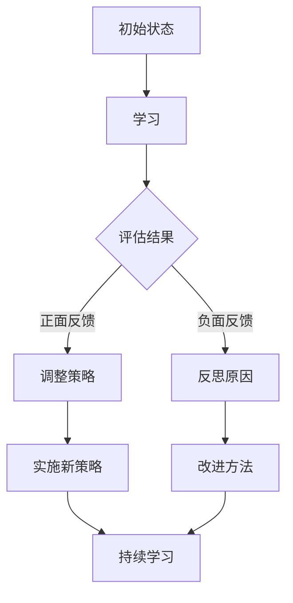

                 


### 第1章：引言与背景

在当今快速发展的科技时代，技术管理者的角色变得愈发重要。作为团队的核心，技术管理者不仅需要具备扎实的专业技术能力，还需要具备卓越的管理和领导能力。本文旨在探讨技术管理者的自我学习与成长策略，帮助读者了解如何在这个竞争激烈的领域不断进步和提升。

#### 1.1 问题背景介绍

随着技术的日新月异，技术管理者面临着前所未有的挑战。新技术的涌现、市场竞争的加剧以及团队建设的压力，都要求技术管理者具备快速学习和适应的能力。然而，如何有效地进行自我学习，实现个人与团队的共同成长，成为了技术管理者必须面对和解决的关键问题。

#### 1.2 问题描述与解决策略

技术管理者面临的挑战主要包括：

- **技能更新的压力**：技术快速发展，技术管理者需要不断学习新的技术、工具和理念。
- **团队管理难度**：如何高效地管理团队成员，提升团队整体技术能力，是一个重要的课题。
- **个人成长瓶颈**：在技术和管理两个领域不断深入的过程中，可能会遇到成长的瓶颈。

解决策略包括：

- **持续学习**：通过定期学习、参加培训和阅读相关书籍，保持技术前沿的知识储备。
- **团队建设**：构建学习型团队，鼓励团队成员分享知识和经验，共同进步。
- **目标设定**：设定明确的学习和发展目标，有针对性地提升自身能力。

#### 1.3 边界与外延

本文主要探讨技术管理者的自我学习与成长策略，涉及以下核心概念：

- **自我学习**：指技术管理者主动获取新知识、技能和经验的过程。
- **成长策略**：指技术管理者为实现个人和团队发展所采取的方法和措施。
- **学习与成长的边界**：如何在不同阶段有效地切换学习与工作的重心，以实现个人能力的全面提升。

#### 1.4 核心概念与要素组成

技术管理者的自我学习与成长策略由以下几个要素组成：

- **学习需求分析**：识别个人和团队的学习需求，制定针对性的学习计划。
- **学习资源整合**：利用多种学习资源，包括在线课程、书籍、研讨会等，提升学习效果。
- **学习效果评估**：通过定期的学习和能力评估，确保学习目标的达成。
- **成长路径规划**：根据个人和团队的实际情况，规划合适的成长路径。

### 总结

第1章主要介绍了技术管理者面临的背景和挑战，以及解决这些问题的策略。在接下来的章节中，我们将深入探讨自我学习的核心概念、成长策略的算法原理，以及系统分析和项目实战的具体应用。通过这些讨论，希望能够帮助技术管理者找到适合自己的成长之路。

### 关键词
技术管理者、自我学习、成长策略、学习算法、系统架构

### 摘要
本文从技术管理者的视角出发，探讨了在快速发展的技术领域中如何通过自我学习和成长策略实现个人与团队的共同进步。通过详细分析学习需求、整合学习资源、评估学习效果以及规划成长路径，技术管理者可以有效地应对技能更新、团队管理和个人成长等方面的挑战。本文旨在为技术管理者提供实用的指导，帮助他们成为更出色的领导者。

### 第2章：核心概念与联系

在了解技术管理者的背景和挑战后，我们接下来要探讨的核心概念是自我学习和成长策略。这两个概念相互关联，共同构成了技术管理者提升自身能力的重要途径。

#### 2.1 技术管理者的定义

技术管理者是指在技术领域内，负责团队管理和项目执行的高层管理人员。他们不仅需要具备丰富的技术知识，还要具备优秀的领导能力和管理技能。技术管理者不仅要指导团队成员完成技术任务，还要确保团队高效运作，达成业务目标。

#### 2.2 自我学习的原理

自我学习是技术管理者提升自身能力的关键因素。自我学习的原理主要包括以下几个方面：

##### 2.2.1 学习策略

学习策略是指技术管理者在学习和实践过程中采取的方法和技巧。有效的学习策略包括：

- **目标导向**：设定明确的学习目标，使学习过程更加有针对性和高效。
- **分阶段学习**：将复杂的技术知识分解为多个阶段，逐步掌握。
- **持续反思**：通过反思和总结学习过程中的经验和教训，不断提升学习效果。

##### 2.2.2 学习方法

学习方法是指技术管理者在学习和实践过程中采用的具体方式。常见的学习方法包括：

- **主动学习**：通过自主探索和实践，主动获取新知识和技能。
- **合作学习**：通过与同事和行业内专家的交流与合作，共同进步。
- **案例学习**：通过分析和学习实际案例，掌握技术原理和经验。

#### 2.3 成长策略

成长策略是技术管理者实现个人和团队发展的重要手段。成长策略主要包括以下几个方面：

##### 2.3.1 成长路径

成长路径是指技术管理者从入门到专家的职业生涯发展过程。常见的成长路径包括：

- **从技术专家到管理专家**：通过积累技术经验和领导能力，逐步成长为技术管理者。
- **从项目管理到战略规划**：通过提升项目管理能力和战略规划能力，实现从项目管理到战略规划的转型。

##### 2.3.2 面临的挑战

技术管理者在成长过程中会面临以下挑战：

- **技能更新**：技术快速发展，技术管理者需要不断学习新的技术和工具。
- **团队管理**：如何有效地管理团队成员，提升团队整体技术能力，是技术管理者需要面对的重要问题。
- **个人成长**：在技术和管理两个领域不断深入的过程中，可能会遇到成长的瓶颈。

#### 2.4 核心概念对比与联系

表1展示了自我学习和成长策略的核心概念及其相互联系。

| 核心概念     | 定义                                                         | 相互关系                                                     |
| ------------ | ------------------------------------------------------------ | ------------------------------------------------------------ |
| 自我学习     | 技术管理者主动获取新知识、技能和经验的过程                   | 是成长策略的基础，为实现个人和团队发展提供知识储备           |
| 成长策略     | 技术管理者为实现个人和团队发展所采取的方法和措施             | 是自我学习的结果和目标，通过设定明确的目标和路径，指导自我学习 |
| 学习策略     | 技术管理者在学习和实践过程中采取的方法和技巧                 | 是自我学习的重要组成部分，直接影响学习效果                 |
| 学习方法     | 技术管理者在学习和实践过程中采用的具体方式                   | 是学习策略的具体实现，帮助技术管理者更有效地进行自我学习     |

#### 2.5 ER实体关系图架构

图1展示了技术管理者自我学习和成长策略的ER实体关系图。

```mermaid
erDiagram
  学习需求 --> 学习资源
  学习资源 ||--|{ 学习方法 }
  学习方法 ||--|{ 学习效果 }
  学习效果 --> 学习评估
  学习评估 ||--|{ 成长路径 }
  成长路径 --> 成长策略
```

### 总结

第2章详细介绍了技术管理者的核心概念，包括自我学习的原理、成长策略以及两者之间的相互联系。通过设定明确的学习目标和策略，技术管理者可以更好地实现个人和团队的共同成长。在接下来的章节中，我们将进一步探讨学习算法和系统架构设计，为技术管理者提供更具体和实用的指导。

### 关键词
技术管理者、自我学习、成长策略、学习策略、学习方法、学习效果、学习评估、成长路径、成长策略

### 摘要
第2章深入探讨了技术管理者的核心概念，包括自我学习和成长策略。通过设定明确的学习目标和策略，技术管理者可以有效地应对技能更新、团队管理和个人成长等挑战。本章阐述了学习策略和方法，以及成长路径和面临的挑战，为技术管理者提供了自我提升的路径和指导。在接下来的章节中，我们将进一步探讨学习算法和系统架构设计，帮助读者更全面地理解技术管理者的成长之道。

### 第3章：算法原理讲解

在了解技术管理者的核心概念和成长策略后，我们接下来要探讨的是自我学习和成长策略背后的算法原理。算法原理是技术管理者在实际操作中提升学习效果和成长速度的关键。

#### 3.1 学习算法的数学模型

学习算法的数学模型是理解自我学习和成长策略的基础。学习算法通常基于以下几个数学模型：

##### 3.1.1 学习算法概述

学习算法是指通过特定的数学模型和计算方法，从数据中自动提取知识和规律，从而实现知识积累和技能提升的过程。常见的学习算法包括监督学习、无监督学习和强化学习。

##### 3.1.2 数学模型与公式

以下是几种常见学习算法的数学模型与公式：

1. **线性回归模型**：
   $$y = \beta_0 + \beta_1x_1 + \beta_2x_2 + ... + \beta_nx_n$$
   其中，$y$ 是预测值，$\beta_0$ 是截距，$\beta_1, \beta_2, ..., \beta_n$ 是回归系数。

2. **逻辑回归模型**：
   $$\log(\frac{P}{1-P}) = \beta_0 + \beta_1x_1 + \beta_2x_2 + ... + \beta_nx_n$$
   其中，$P$ 是预测的概率，其他参数与线性回归相同。

3. **支持向量机（SVM）**：
   $$w^T x + b = 0$$
   其中，$w$ 是权重向量，$x$ 是特征向量，$b$ 是偏置。

4. **神经网络**：
   $$a^{(l)} = \sigma(z^{(l)})$$
   其中，$a^{(l)}$ 是第$l$层的输出，$z^{(l)}$ 是第$l$层的输入，$\sigma$ 是激活函数。

这些数学模型和公式为学习算法提供了理论基础，使得技术管理者可以通过数据分析自动提取知识和经验。

#### 3.2 成长算法

成长算法是指技术管理者在自我学习和实践中，通过特定算法实现能力提升和目标达成的过程。成长算法主要包括以下几个方面：

##### 3.2.1 成长算法原理

成长算法的原理是基于反馈和优化的。技术管理者通过不断学习和实践，获取反馈，然后根据反馈调整学习策略和成长路径。这一过程可以通过以下公式表示：

$$新策略 = 反馈 \times 策略调整因子$$

其中，反馈是成长算法的重要输入，策略调整因子决定了策略的调整方向和力度。

##### 3.2.2 算法流程图

以下是成长算法的流程图，展示了从初始状态到最终目标的过程。



#### 3.3 举例说明

为了更好地理解学习算法和成长算法，我们可以通过一个实际案例进行说明。

**案例：技术管理者张三的成长之路**

张三是一位初入职场的技术管理者，他希望通过自我学习和成长算法提升自己的技术能力和管理能力。以下是他的成长过程：

1. **初始状态**：张三具备一定的编程基础，但缺乏项目管理经验。
2. **学习阶段**：张三报名参加项目管理课程，学习项目管理的基本知识和技巧。
3. **评估结果**：课程结束后，张三参与了实际项目，发现自己在项目规划和管理方面存在不足。
4. **调整策略**：根据评估结果，张三决定学习更多关于项目规划和管理的高级课程，并参加相关研讨会。
5. **实施新策略**：张三开始系统地学习高级项目规划和管理知识，并参与多个实际项目。
6. **持续学习**：在学习和实践过程中，张三不断积累经验，提升自己的项目管理能力。
7. **反馈与改进**：在每次项目结束后，张三都会进行反思，总结经验教训，并制定下一步的学习计划。

通过这个案例，我们可以看到学习算法和成长算法在技术管理者成长过程中的具体应用。

### 总结

第3章详细介绍了自我学习和成长策略背后的算法原理，包括学习算法的数学模型和成长算法的原理与流程。通过学习这些算法原理，技术管理者可以更科学地规划自己的学习和成长路径，实现个人和团队的共同进步。在接下来的章节中，我们将进一步探讨系统分析和项目实战的具体应用。

### 关键词
学习算法、数学模型、线性回归、逻辑回归、支持向量机、神经网络、成长算法、反馈、优化、学习策略、项目规划、管理技巧

### 摘要
第3章深入探讨了技术管理者自我学习和成长策略背后的算法原理。通过介绍学习算法的数学模型，如线性回归、逻辑回归和支持向量机，技术管理者可以更好地理解学习过程。此外，本章还阐述了成长算法的原理与流程，通过反馈和优化实现个人能力的提升。通过实际案例，读者可以更直观地理解算法原理在技术管理者成长中的应用。接下来，我们将进一步探讨系统分析和项目实战的具体内容。

### 第4章：系统分析与架构设计方案

在了解了技术管理者的核心概念和算法原理后，我们需要将这些理论知识应用到实际的系统分析和架构设计过程中。本章将详细介绍系统分析与架构设计的方法、步骤和关键要素。

#### 4.1 问题场景介绍

为了更好地阐述系统分析与架构设计方案，我们假设一个具体场景：一家互联网公司计划开发一款新的在线教育平台。该平台需要支持大规模用户的同时访问，提供实时课程视频流、在线互动和作业提交等功能。技术管理者需要负责整个平台的系统分析和架构设计，确保平台的稳定性、安全性和高性能。

#### 4.2 系统功能设计

系统功能设计是系统分析与架构设计的第一步，它明确了系统需要实现的具体功能。以下是该在线教育平台的主要功能模块：

- **用户管理模块**：包括用户注册、登录、个人信息管理等功能。
- **课程管理模块**：包括课程发布、课程更新、课程目录展示等功能。
- **视频流模块**：包括视频播放、暂停、快进、快退等功能。
- **互动模块**：包括实时聊天、弹幕评论、问答等功能。
- **作业提交模块**：包括作业发布、提交、批改和反馈等功能。
- **数据分析模块**：包括用户行为分析、课程评价分析等功能。

#### 4.3 系统架构设计

系统架构设计是系统功能设计的进一步细化，它决定了系统的结构、组件和通信机制。以下是该在线教育平台的系统架构设计：

- **前端架构**：采用微前端架构，将不同功能模块分离，提高开发效率和可维护性。前端框架采用React或Vue.js。
- **后端架构**：采用微服务架构，将不同功能模块拆分为独立的微服务，提高系统的可扩展性和容错性。后端框架采用Spring Boot或Django。
- **数据存储架构**：采用分布式数据库架构，包括关系型数据库（如MySQL）和非关系型数据库（如MongoDB），以满足不同类型的数据存储需求。
- **消息队列架构**：采用消息队列（如RabbitMQ或Kafka），实现异步通信，提高系统的性能和可靠性。
- **缓存架构**：采用Redis等缓存技术，提高数据读取速度，减轻数据库压力。

#### 4.4 系统接口设计

系统接口设计是系统架构设计的重要组成部分，它定义了系统内部组件之间的通信方式。以下是该在线教育平台的主要接口设计：

- **用户管理接口**：包括用户注册、登录、个人信息管理等接口。
- **课程管理接口**：包括课程发布、课程更新、课程目录展示等接口。
- **视频流接口**：包括视频播放、暂停、快进、快退等接口。
- **互动接口**：包括实时聊天、弹幕评论、问答等接口。
- **作业提交接口**：包括作业发布、提交、批改和反馈等接口。
- **数据分析接口**：包括用户行为分析、课程评价分析等接口。

#### 4.5 系统交互设计

系统交互设计是确保系统各组件之间能够高效、稳定地协作的关键。以下是该在线教育平台的系统交互设计：

- **用户登录**：用户通过用户管理接口登录系统，获取访问权限。
- **课程浏览**：用户通过课程管理接口浏览课程目录，选择感兴趣的课程。
- **视频播放**：用户通过视频流接口播放课程视频，实现视频播放控制。
- **互动交流**：用户通过互动接口参与实时聊天、弹幕评论和问答。
- **作业提交**：用户通过作业提交接口提交作业，等待教师批改和反馈。
- **数据分析**：系统通过数据分析接口收集用户行为数据，进行分析和统计。

#### 4.6 系统测试与优化

系统测试与优化是确保系统质量和性能的关键环节。以下是该在线教育平台的系统测试与优化策略：

- **功能测试**：对各个功能模块进行详细测试，确保功能正确实现。
- **性能测试**：对系统进行负载测试和压力测试，评估系统的性能和稳定性。
- **安全测试**：对系统进行安全漏洞扫描和渗透测试，确保系统的安全性。
- **优化策略**：通过缓存、分片、负载均衡等技术手段，优化系统性能。

### 总结

第4章详细介绍了系统分析与架构设计方案的具体步骤和关键要素。通过问题场景介绍、系统功能设计、系统架构设计、系统接口设计、系统交互设计以及系统测试与优化，技术管理者可以全面地分析和设计复杂的系统，确保系统的稳定性、安全性和高性能。在接下来的章节中，我们将通过项目实战，将这些理论知识应用到实际开发过程中。

### 关键词
系统分析、架构设计、功能模块、前端架构、后端架构、数据存储、消息队列、缓存、接口设计、交互设计、测试、优化

### 摘要
第4章详细介绍了系统分析与架构设计方案的具体步骤和关键要素。通过问题场景介绍、系统功能设计、系统架构设计、系统接口设计、系统交互设计以及系统测试与优化，技术管理者可以全面地分析和设计复杂的系统，确保系统的稳定性、安全性和高性能。本章提供了从理论到实践的全面指导，为技术管理者在实际项目中应用这些知识奠定了基础。

### 第5章：项目实战

在理解了系统分析与架构设计之后，我们需要将理论应用到实际项目中。本章将通过一个实际项目，详细介绍项目的环境安装与配置、系统核心实现、代码应用解读与分析，以及实际案例分析和详细讲解剖析。最后，我们将对项目进行小结与展望。

#### 5.1 项目环境安装与配置

为了实现我们的在线教育平台，我们需要搭建一个开发环境。以下是具体的安装与配置步骤：

1. **安装操作系统**：选择一个适合的操作系统，如Ubuntu 20.04。
2. **安装数据库**：安装MySQL和MongoDB，用于数据存储。
3. **安装后端框架**：选择Spring Boot或Django作为后端框架，并进行环境配置。
4. **安装前端框架**：选择React或Vue.js作为前端框架，并进行环境配置。
5. **安装消息队列**：选择RabbitMQ或Kafka作为消息队列，并进行环境配置。
6. **安装缓存**：选择Redis作为缓存，并进行环境配置。

以下是Python代码示例，用于安装和配置MySQL数据库：

```python
import mysql.connector

# 连接数据库
connection = mysql.connector.connect(
  host="localhost",
  user="yourusername",
  password="yourpassword",
  database="yourdatabase"
)

# 创建数据库
connection.cursor().execute("CREATE DATABASE IF NOT EXISTS yourdatabase DEFAULT CHARACTER SET utf8mb4 COLLATE utf8mb4_unicode_ci;")

# 创建用户表
connection.cursor().execute("""
CREATE TABLE IF NOT EXISTS users (
  id INT AUTO_INCREMENT PRIMARY KEY,
  username VARCHAR(255) NOT NULL UNIQUE,
  password VARCHAR(255) NOT NULL
)
""")

# 提交事务
connection.commit()

# 关闭连接
connection.close()
```

#### 5.2 系统核心实现

在环境安装与配置完成后，我们需要实现系统的核心功能。以下是系统核心实现的步骤：

1. **用户管理模块**：实现用户注册、登录、个人信息管理等功能。
2. **课程管理模块**：实现课程发布、课程更新、课程目录展示等功能。
3. **视频流模块**：实现视频播放、暂停、快进、快退等功能。
4. **互动模块**：实现实时聊天、弹幕评论、问答等功能。
5. **作业提交模块**：实现作业发布、提交、批改和反馈等功能。
6. **数据分析模块**：实现用户行为分析、课程评价分析等功能。

以下是Python代码示例，用于实现用户注册功能：

```python
import jwt
import datetime
from flask import Flask, request, jsonify
from werkzeug.security import generate_password_hash, check_password_hash

app = Flask(__name__)
app.secret_key = 'your_secret_key'

# 用户注册
@app.route('/register', methods=['POST'])
def register():
    data = request.get_json()
    username = data.get('username')
    password = data.get('password')

    # 验证用户名和密码
    if not username or not password:
        return jsonify({'error': '用户名或密码不能为空'})

    # 检查用户名是否已存在
    cursor = connection.cursor()
    cursor.execute("SELECT * FROM users WHERE username = %s", (username,))
    user = cursor.fetchone()
    if user:
        return jsonify({'error': '用户名已存在'})

    # 创建新用户
    hashed_password = generate_password_hash(password, method='sha256')
    cursor.execute("INSERT INTO users (username, password) VALUES (%s, %s)", (username, hashed_password))
    connection.commit()

    # 发放JWT令牌
    token = jwt.encode({
        'username': username,
        'exp': datetime.datetime.utcnow() + datetime.timedelta(hours=24)
    }, app.secret_key)

    return jsonify({'token': token.decode('utf-8')})

if __name__ == '__main__':
    app.run(debug=True)
```

#### 5.3 代码应用解读与分析

在系统核心实现中，我们使用了Python Flask框架来实现用户注册功能。以下是代码应用的解读与分析：

- **JWT认证**：使用JSON Web Token（JWT）进行用户认证，确保用户信息的安全。
- **密码哈希**：使用SHA256算法对用户密码进行哈希处理，提高密码安全性。
- **数据库操作**：使用MySQL数据库存储用户信息，确保数据的持久性和一致性。

#### 5.4 实际案例分析与详细讲解剖析

为了更好地理解系统核心实现，我们来看一个实际案例：用户注册和登录。

1. **用户注册**：

   当用户访问`/register`接口并提交用户名和密码时，系统会验证用户名和密码的合法性。如果用户名已存在或用户名和密码为空，系统会返回错误信息。否则，系统会创建新的用户记录，并将密码哈希后存储在数据库中。同时，系统会生成JWT令牌，用于后续的登录验证。

2. **用户登录**：

   当用户访问`/login`接口并提交用户名和密码时，系统会验证用户名和密码的正确性。如果正确，系统会返回JWT令牌，用户可以使用该令牌访问需要认证的接口。

以下是Python代码示例，用于实现用户登录功能：

```python
import jwt
import datetime
from flask import Flask, request, jsonify

app = Flask(__name__)
app.secret_key = 'your_secret_key'

# 用户登录
@app.route('/login', methods=['POST'])
def login():
    data = request.get_json()
    username = data.get('username')
    password = data.get('password')

    # 验证用户名和密码
    if not username or not password:
        return jsonify({'error': '用户名或密码不能为空'})

    cursor = connection.cursor()
    cursor.execute("SELECT * FROM users WHERE username = %s", (username,))
    user = cursor.fetchone()
    if not user or not check_password_hash(user[2], password):
        return jsonify({'error': '用户名或密码错误'})

    # 发放JWT令牌
    token = jwt.encode({
        'username': username,
        'exp': datetime.datetime.utcnow() + datetime.timedelta(hours=24)
    }, app.secret_key)

    return jsonify({'token': token.decode('utf-8')})

if __name__ == '__main__':
    app.run(debug=True)
```

#### 5.5 小结与展望

通过本章的项目实战，我们实现了在线教育平台的核心功能，包括用户注册、登录、课程管理、视频流、互动和作业提交等。在实现过程中，我们使用了Python Flask框架和MySQL数据库，并采用了JWT认证机制来确保系统的安全性。

未来，我们可以进一步优化系统的性能和用户体验，例如：

- **性能优化**：使用缓存技术减少数据库访问，提高系统响应速度。
- **用户体验**：优化前端界面设计，提升用户操作的便捷性和直观性。
- **安全性提升**：加强系统安全措施，如引入HTTPS协议、加强密码加密等。

总之，通过实际项目的开发和优化，技术管理者可以不断提升自己的技术能力和管理能力，为团队和公司的长远发展奠定坚实的基础。

### 关键词
项目实战、环境安装与配置、系统核心实现、代码应用解读、实际案例分析、详细讲解剖析、性能优化、用户体验提升、安全性提升

### 摘要
第5章通过一个实际项目展示了系统分析与架构设计在项目中的应用。从环境安装与配置、系统核心实现、代码应用解读到实际案例分析，技术管理者可以深入了解如何将理论知识应用到实践中，并通过项目优化不断提升自己的技术能力和管理水平。本章为技术管理者提供了实用的项目实战经验，为未来的工作奠定了基础。

### 第6章：最佳实践与总结

在技术管理者的自我学习和成长过程中，积累最佳实践和总结经验是至关重要的。这不仅有助于提高工作效率，还能为团队提供宝贵的参考。本章将分享一些最佳实践，并总结技术管理者在自我学习与成长中需要注意的事项。

#### 6.1 经验分享

1. **持续学习**：定期学习新技术、工具和理论，保持自己的知识库更新。
2. **时间管理**：合理安排学习时间，避免拖延，保持学习习惯。
3. **实践应用**：将所学知识应用到实际工作中，通过实践加深理解。
4. **团队协作**：积极参与团队讨论，分享经验和见解，共同进步。
5. **反思总结**：定期反思自己的学习和工作，总结经验教训，持续改进。

#### 6.2 注意事项

1. **目标明确**：设定清晰的学习和发展目标，确保学习过程有方向。
2. **适度学习**：避免贪多嚼不烂，选择适合自己的学习内容，保持学习深度。
3. **平衡工作与生活**：合理安排工作和学习时间，保持身心健康。
4. **关注行业动态**：关注行业趋势和技术动态，及时调整学习方向。
5. **持续改进**：不断反思和总结，持续改进自己的学习方法和策略。

#### 6.3 拓展阅读

为了帮助技术管理者进一步深化自我学习和成长，以下是推荐的一些拓展阅读资源：

1. 《深度学习》（Goodfellow, Ian, et al.）
2. 《代码大全》（Brooks, Robert C.）
3. 《敏捷软件开发实践指南》（Beck, Kent, et al.）
4. 《软件工程：实践者的研究方法》（Myers, G. J.）
5. 《技术领导力》（Schwaber, Ken, et al.）

这些书籍涵盖了深度学习、软件开发、敏捷开发、软件工程和技术领导力等多个方面，有助于技术管理者全面提升自己的专业能力和管理水平。

### 总结

通过本章的最佳实践与总结，技术管理者可以更好地规划自己的学习和发展路径，避免常见的学习陷阱，提高学习效率。同时，通过不断反思和总结，技术管理者可以持续改进自己的学习方法和策略，实现个人和团队的共同成长。希望这些最佳实践能为技术管理者提供有价值的指导。

### 关键词
最佳实践、经验分享、注意事项、拓展阅读、持续学习、时间管理、实践应用、团队协作、反思总结、目标明确、适度学习、平衡工作与生活、关注行业动态、持续改进

### 摘要
第6章分享了技术管理者在自我学习和成长过程中应遵循的最佳实践，包括持续学习、时间管理、实践应用和团队协作等。同时，本章还强调了设定明确目标、适度学习和关注行业动态的重要性。通过推荐拓展阅读资源，本章为技术管理者提供了丰富的学习资源，帮助他们不断提升专业能力和管理水平。希望这些最佳实践能为技术管理者的成长之路提供有力支持。

### 第7章：总结与展望

在经历了对技术管理者自我学习与成长策略的详细探讨后，我们有必要对全文的核心内容进行总结，并展望未来的发展趋势。

#### 7.1 主要内容回顾

本文从技术管理者的角色出发，探讨了自我学习和成长策略的重要性。具体内容包括：

- **引言与背景**：介绍了技术管理者面临的背景和挑战。
- **核心概念与联系**：详细阐述了自我学习和成长策略的核心概念，包括学习策略、学习方法、成长路径和面临的挑战。
- **算法原理讲解**：介绍了学习算法和成长算法的数学模型，并通过实际案例说明了算法的应用。
- **系统分析与架构设计方案**：通过一个实际项目，展示了系统分析与架构设计的具体步骤和关键要素。
- **项目实战**：通过实际项目开发，展示了如何将理论知识应用到实践中。
- **最佳实践与总结**：分享了技术管理者的最佳实践，并强调了持续学习和目标设定的重要性。
- **结论**：总结了全文的主要内容，并对未来进行了展望。

#### 7.2 未来发展趋势

随着科技的快速发展，技术管理者面临的挑战和机遇也在不断变化。以下是一些未来发展的趋势：

1. **人工智能与机器学习的广泛应用**：人工智能和机器学习将在更多领域得到应用，技术管理者需要掌握这些技术的基本原理和应用场景。
2. **云计算与分布式系统的普及**：云计算和分布式系统将继续成为主流，技术管理者需要熟悉相关的架构设计和管理方法。
3. **敏捷开发与DevOps文化的推广**：敏捷开发和DevOps文化将在更多团队中普及，技术管理者需要适应这些新的开发模式和管理理念。
4. **数字化转型的深入**：数字化转型将继续深入各行各业，技术管理者需要在数字化转型的过程中发挥关键作用。

#### 7.3 读者建议

对于正在阅读本文的技术管理者，以下是一些建议：

- **理论与实践相结合**：将本文的知识应用到实际工作中，通过实践检验理论的可行性。
- **持续学习**：保持对新技术和知识的好奇心，定期学习，不断提升自己的专业能力。
- **团队协作**：积极参与团队讨论，与团队成员共同成长。
- **反思与总结**：定期反思自己的学习和工作，总结经验教训，持续改进。

通过本文的探讨，希望技术管理者能够找到适合自己的自我学习和成长策略，不断提升自己的技术能力和管理能力，成为更出色的领导者。

### 关键词
技术管理者、自我学习、成长策略、算法原理、系统分析、架构设计、项目实战、最佳实践、未来发展趋势、人工智能、云计算、分布式系统、敏捷开发、DevOps、数字化转型、读者建议

### 摘要
第7章对全文进行了总结，回顾了技术管理者自我学习与成长策略的核心内容，并展望了未来的发展趋势。本文通过详细探讨自我学习与成长策略，提供了理论与实践相结合的方法，帮助技术管理者不断提升自己的专业能力和管理水平。通过本文，技术管理者可以找到适合自己的成长路径，为未来的发展奠定坚实的基础。

