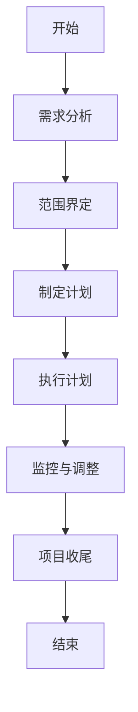
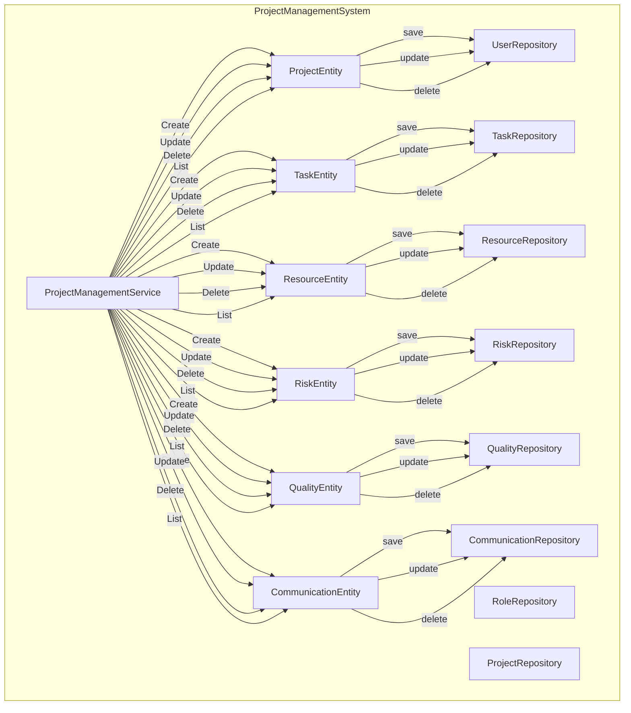
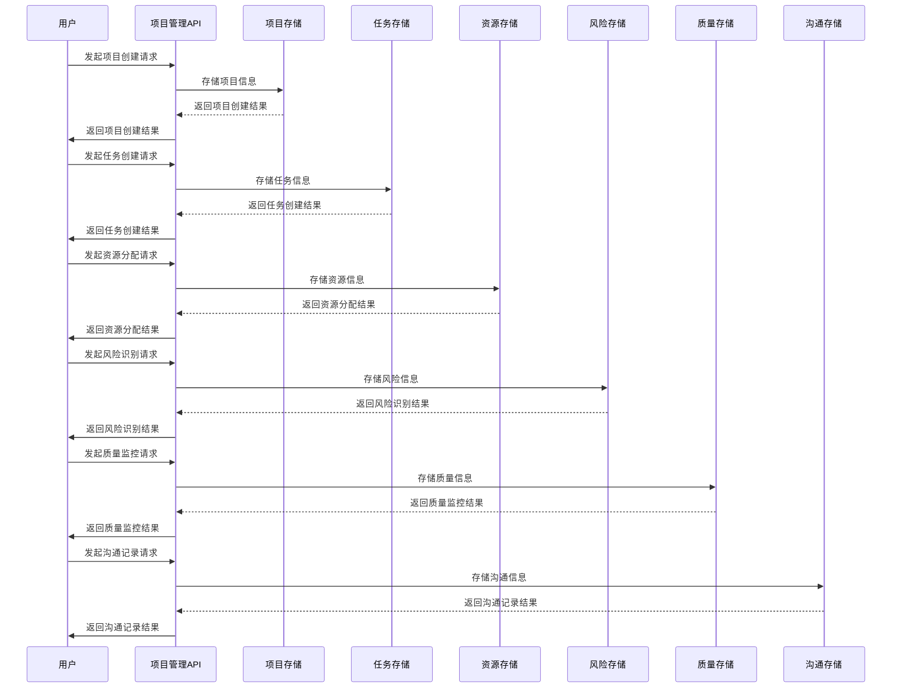
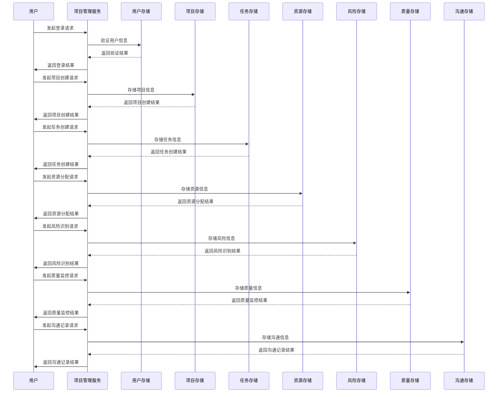

                 

### 《技术项目管理的关键要素》

> 关键词：技术项目管理、核心要素、流程、工具、算法、实践

> 摘要：本文将深入探讨技术项目管理中的关键要素，包括项目目标、范围、进度、成本、质量、风险和沟通。通过详细的背景介绍、核心概念解析、项目管理流程与工具讲解，以及算法原理与流程的阐述，帮助读者全面了解技术项目管理的理论与实践，提升项目管理的综合能力。

---

### 第一部分：背景介绍

#### 第1章 问题背景与核心要素

##### 1.1 问题描述

在信息技术高速发展的今天，项目管理已成为各个行业成功交付项目的重要保障。技术项目管理作为其中的一环，面临着复杂的项目目标、技术挑战和资源约束。技术项目管理的核心问题是如何在有限的资源下，高效地实现项目目标，确保项目进度、成本、质量和风险控制。

##### 1.2 问题解决

解决技术项目管理的核心问题，需要明确以下几个关键要素：

- **项目目标**：明确项目期望达成的具体成果或状态。
- **项目范围**：界定项目所需完成的所有工作内容。
- **项目进度**：安排项目从启动到完成所需的时间计划。
- **项目成本**：预算项目实施所需的所有资源投入。
- **项目质量**：确保项目最终成果满足需求标准的能力。
- **项目风险**：识别和应对项目在执行过程中可能遇到的问题和挑战。
- **项目沟通**：确保项目参与者之间的信息交流畅通。

##### 1.3 边界与外延

- **边界**：技术项目管理的范围通常包括项目团队、客户、项目利益相关者等。
- **外延**：技术项目管理还涉及到项目管理方法论、项目管理工具和技术等方面的内容。

##### 1.4 核心概念与联系

**概念原理**：

- **项目目标**：项目的最终成果，如软件系统、硬件设备或服务。
- **项目范围**：项目所包含的工作内容，如功能需求、技术实现等。
- **项目进度**：项目的执行时间表，包括里程碑、任务期限等。
- **项目成本**：项目的资源投入，包括人力、物料、设备等。
- **项目质量**：项目的最终成果是否符合预期标准。
- **项目风险**：项目在执行过程中可能面临的问题，如技术难题、资源不足等。
- **项目沟通**：项目团队与客户、利益相关者之间的信息传递和交流。

**概念属性特征对比表格**：

| 概念         | 定义                                                         | 属性特征                 |
| ------------ | ------------------------------------------------------------ | ------------------------ |
| 项目目标     | 项目期望达成的具体成果或状态。                               | 明确性、可衡量性、相关性 |
| 项目范围     | 项目所需完成的所有工作内容。                                 | 完整性、确定性、可管理性 |
| 项目进度     | 项目从启动到完成所需的时间安排。                             | 准确性、可控性           |
| 项目成本     | 项目实施所需的所有资源投入，包括人力、物力、财力。           | 经济性、透明性           |
| 项目质量     | 项目最终成果满足需求标准的能力。                             | 价值性、可靠性、美观性   |
| 项目风险     | 项目在执行过程中可能遇到的问题和挑战。                       | 预见性、可控性           |
| 项目沟通     | 项目参与者之间的信息交流。                                   | 有效性、及时性           |

**概念ER实体关系图**：

```mermaid
erDiagram
Project ||--|{ Goal }
Project ||--|{ Scope }
Project ||--|{ Schedule }
Project ||--|{ Cost }
Project ||--|{ Quality }
Project ||--|{ Risk }
Project ||--|{ Communication }
Goal ||--|{ Project }
Scope ||--|{ Project }
Schedule ||--|{ Project }
Cost ||--|{ Project }
Quality ||--|{ Project }
Risk ||--|{ Project }
Communication ||--|{ Project }
```

### 第二部分：核心概念与联系

#### 第2章 核心概念原理

##### 2.1 项目管理定义

项目管理是指通过计划、组织、协调、控制和监督等手段，实现项目目标的一系列管理活动。在技术项目管理中，这包括软件开发、系统集成、IT基础设施建设等。

##### 2.2 核心概念

- **项目目标**：明确项目的最终目标，如完成一个软件系统或硬件设备。
- **项目范围**：定义项目的边界，包括项目需要完成的工作内容和不包括的工作内容。
- **项目进度**：项目的时间安排，包括关键里程碑和任务期限。
- **项目成本**：项目所需的资源投入，包括人力、物料、设备等。
- **项目质量**：项目的最终成果是否符合预期标准。
- **项目风险**：项目在执行过程中可能遇到的问题和挑战。
- **项目沟通**：项目团队与客户、利益相关者之间的信息传递和交流。

##### 2.3 概念属性特征对比表格

| 概念         | 定义                                                         | 属性特征                 |
| ------------ | ------------------------------------------------------------ | ------------------------ |
| 项目目标     | 项目期望达成的具体成果或状态。                               | 明确性、可衡量性、相关性 |
| 项目范围     | 项目所需完成的所有工作内容。                                 | 完整性、确定性、可管理性 |
| 项目进度     | 项目从启动到完成所需的时间安排。                             | 准确性、可控性           |
| 项目成本     | 项目实施所需的所有资源投入，包括人力、物力、财力。           | 经济性、透明性           |
| 项目质量     | 项目最终成果满足需求标准的能力。                             | 价值性、可靠性、美观性   |
| 项目风险     | 项目在执行过程中可能遇到的问题和挑战。                       | 预见性、可控性           |
| 项目沟通     | 项目参与者之间的信息交流。                                   | 有效性、及时性           |

---

#### 第3章 项目管理流程与工具

##### 3.1 项目启动

项目启动是项目管理的第一步，包括确定项目目标、范围和初步计划。项目启动会明确项目的背景、目的和预期成果，为后续项目实施奠定基础。

##### 3.2 项目计划

项目计划是项目管理的核心环节，包括制定项目范围、时间表、资源分配和预算。项目计划需要详细描述项目的各个阶段、任务和时间节点，确保项目按计划进行。

##### 3.3 项目执行

项目执行是项目计划的具体实施过程，包括任务分配、资源调度和进度控制。项目执行阶段需要确保各项工作按计划进行，并及时调整计划以应对变化。

##### 3.4 项目监控

项目监控是项目执行过程中的关键环节，包括进度监控、成本监控和质量监控。项目监控旨在确保项目按计划进行，并及时发现和解决问题。

##### 3.5 项目收尾

项目收尾是项目管理的最后一步，包括项目验收、总结和归档。项目收尾阶段需要确保项目的最终成果满足预期标准，并进行项目总结，为未来项目提供经验教训。

##### 3.6 常用项目管理工具

- **甘特图**：用于展示项目进度和时间安排，直观地显示任务之间的依赖关系。
- **PERT图**：用于分析项目风险和不确定性，通过计算任务完成时间的概率分布，评估项目进度。
- **WBS（工作分解结构）**：将项目分解为更小、更易于管理的任务，确保项目范围的明确性和可管理性。

**项目流程ER实体关系图**：

```mermaid
erDiagram
Project ||--|{ Goal }
Project ||--|{ Scope }
Project ||--|{ Schedule }
Project ||--|{ Cost }
Project ||--|{ Quality }
Project ||--|{ Risk }
Project ||--|{ Communication }
Goal ||--|{ Project }
Scope ||--|{ Project }
Schedule ||--|{ Project }
Cost ||--|{ Project }
Quality ||--|{ Project }
Risk ||--|{ Project }
Communication ||--|{ Project }
```

### 第三部分：算法原理讲解

#### 第4章 算法原理与流程

##### 4.1 算法概述

技术项目管理的核心是确保项目目标的有效实现，这需要一套科学的项目管理算法。本节将介绍一个简单但有效的项目管理算法，包括需求分析、范围界定、制定计划、执行计划、监控与调整和项目收尾等步骤。

##### 4.2 算法流程

**算法流程图**：



**算法Python源代码实现**：

```python
# Python 示例代码
class ProjectManagement:
    def __init__(self):
        self.goal = None
        self.scope = None
        self.schedule = None
        self.cost = None
        self.quality = None
        self.risk = None
        self.communication = None

    def demand_analysis(self):
        # 需求分析：明确项目目标与范围
        self.goal = "开发一个功能完善的ERP系统"
        self.scope = "包括客户关系管理、供应链管理、财务管理等功能模块"

    def range划定界定(self):
        # 范围界定：确定项目所需完成的工作内容
        self.scope = "包括客户关系管理、供应链管理、财务管理等功能模块，以及系统性能优化和用户培训"

    def plan制定计划(self):
        # 制定计划：安排项目进度与成本
        self.schedule = "2023年1月至2023年12月"
        self.cost = "预计总成本为500万元"

    def execute执行计划(self):
        # 执行计划：按照计划进行项目实施
        print("执行计划：按照计划进行项目实施")

    def monitor监控与调整(self):
        # 监控与调整：确保项目按计划进行，并及时调整
        print("监控与调整：确保项目按计划进行，并及时调整")

    def project收尾(self):
        # 项目收尾：项目验收、总结和归档
        print("项目收尾：项目验收、总结和归档")

    def run(self):
        self.demand_analysis()
        self.range划定界定()
        self.plan制定计划()
        self.execute执行计划()
        self.monitor监控与调整()
        self.project收尾()

if __name__ == "__main__":
    pm = ProjectManagement()
    pm.run()
```

##### 4.3 算法原理与数学模型

项目管理算法的核心在于对项目目标、范围、进度、成本、质量、风险和沟通的有效管理。以下是这些核心概念与数学模型的关系：

- **项目目标**：可以用目标函数表示，如最大化项目收益或最小化项目成本。
- **项目范围**：可以用集合运算表示，如项目范围的并集、交集和差集。
- **项目进度**：可以用时间序列模型表示，如PERT图和关键路径法（CPM）。
- **项目成本**：可以用线性规划模型表示，如最小成本最大效用问题。
- **项目质量**：可以用统计过程控制（SPC）方法表示，如控制图和统计过程分析。
- **项目风险**：可以用概率论和数理统计方法表示，如风险矩阵和蒙特卡罗模拟。
- **项目沟通**：可以用通信网络模型表示，如消息传递模型和排队论。

**数学模型**：

$$
\text{Maximize } Z = \sum_{i=1}^{n} c_{i}x_{i} \quad \text{subject to} \quad \sum_{j=1}^{m} a_{ij}x_{j} \geq b_{i}, \quad x_{i} \geq 0
$$

其中，$Z$ 为目标函数，$c_{i}$ 为各项成本或收益，$x_{i}$ 为决策变量，$a_{ij}$ 为资源分配矩阵，$b_{i}$ 为资源限制。

##### 4.4 算法举例说明

假设一个技术项目需要完成以下任务：

1. 需求分析：确定项目目标与范围。
2. 设计方案：制定项目计划。
3. 编码实现：按照计划进行项目实施。
4. 测试与优化：确保项目质量。
5. 部署上线：完成项目收尾。

**项目进度计划**：

- 需求分析（1个月）
- 设计方案（1个月）
- 编码实现（3个月）
- 测试与优化（1个月）
- 部署上线（1个月）

**项目成本预算**：

- 需求分析（10万元）
- 设计方案（15万元）
- 编码实现（50万元）
- 测试与优化（10万元）
- 部署上线（5万元）

**项目风险管理**：

- 需求变更风险：概率为0.2，损失为5万元。
- 技术难题风险：概率为0.3，损失为10万元。
- 项目延期风险：概率为0.1，损失为3万元。

**项目沟通管理**：

- 每周项目例会：确保项目进度与问题及时沟通。

**算法应用示例**：

```python
# Python 示例代码
class ProjectManagementExample:
    def __init__(self):
        self.tasks = {
            "需求分析": {"duration": 1, "cost": 10, "risk": 0.2},
            "设计方案": {"duration": 1, "cost": 15, "risk": 0.3},
            "编码实现": {"duration": 3, "cost": 50, "risk": 0.0},
            "测试与优化": {"duration": 1, "cost": 10, "risk": 0.1},
            "部署上线": {"duration": 1, "cost": 5, "risk": 0.0}
        }
        self.risk_matrix = [
            [0.2, 0.3, 0.0, 0.1, 0.0],
            [0.3, 0.0, 0.0, 0.0, 0.0],
            [0.0, 0.0, 0.0, 0.0, 0.0],
            [0.1, 0.0, 0.0, 0.0, 0.0],
            [0.0, 0.0, 0.0, 0.0, 0.0]
        ]

    def calculate_project_cost(self):
        total_cost = sum([task['cost'] for task in self.tasks.values()])
        return total_cost

    def calculate_project_risk(self):
        total_risk = sum([task['risk'] for task in self.tasks.values()])
        return total_risk

    def run(self):
        print("项目进度计划：")
        for task, details in self.tasks.items():
            print(f"{task}: {details['duration']}个月，成本：{details['cost']}万元，风险：{details['risk']}")

        print("\n项目总成本：", self.calculate_project_cost())
        print("项目总风险：", self.calculate_project_risk())

if __name__ == "__main__":
    pm_example = ProjectManagementExample()
    pm_example.run()
```

### 第四部分：系统分析与架构设计方案

#### 第4章 系统分析与架构设计方案

##### 4.1 问题场景介绍

随着企业信息化程度的不断提高，项目管理在企业的运营中扮演着越来越重要的角色。为了提高项目管理的效率和质量，企业需要构建一个高效、可靠的项目管理系统。本项目旨在为企业提供一款功能完善、易于使用、高度可扩展的项目管理系统。

##### 4.2 项目介绍

本项目旨在实现以下目标：

1. 提供一个项目计划与跟踪功能，帮助企业明确项目目标、范围和时间安排。
2. 提供一个资源管理功能，帮助企业合理分配和调度人力、物料和设备等资源。
3. 提供一个风险与质量监控功能，帮助企业识别和应对项目风险，确保项目质量。
4. 提供一个沟通管理功能，帮助企业实现项目团队成员、客户和利益相关者之间的有效沟通。

##### 4.3 系统功能设计（领域模型类图）

**领域模型类图**：

```mermaid
classDiagram
ClassDiagram
    ProjectManagementSystem <.. User
    ProjectManagementSystem <.. Project
    ProjectManagementSystem <.. Task
    ProjectManagementSystem <.. Resource
    ProjectManagementSystem <.. Risk
    ProjectManagementSystem <.. Quality
    ProjectManagementSystem <.. Communication

    User ..|> Role
    Project ..|> Status
    Task ..|> Status
    Resource ..|> Type
    Risk ..|> Type
    Quality ..|> Type

    User {
        -id: Integer
        -name: String
        -email: String
        -password: String
    }
    Role {
        -id: Integer
        -name: String
    }
    Project {
        -id: Integer
        -name: String
        -description: String
        -start_date: Date
        -end_date: Date
        -status: Status
    }
    Task {
        -id: Integer
        -name: String
        -description: String
        -start_date: Date
        -end_date: Date
        -status: Status
        -project_id: Integer
    }
    Resource {
        -id: Integer
        -name: String
        -type: Type
        -quantity: Integer
    }
    Risk {
        -id: Integer
        -name: String
        -description: String
        -type: Type
        -probability: Float
        -impact: Float
        -project_id: Integer
    }
    Quality {
        -id: Integer
        -name: String
        -description: String
        -type: Type
        -standard: String
        -project_id: Integer
    }
    Communication {
        -id: Integer
        -message: String
        -sender_id: Integer
        -receiver_id: Integer
        -date: Date
    }
```

##### 4.4 系统架构设计（架构图）

**系统架构图**：



##### 4.5 系统接口设计（接口设计图）

**系统接口设计图**：



##### 4.6 系统交互（交互序列图）

**系统交互序列图**：



### 第五部分：项目实战

#### 第5章 项目实战

##### 5.1 环境安装

为了搭建项目管理系统，我们需要安装以下环境：

1. **开发环境**：Python 3.8及以上版本
2. **数据库**：MySQL 5.7及以上版本
3. **Web框架**：Flask 或 Django
4. **前端框架**：React 或 Vue.js

安装步骤：

1. 安装 Python 3.8 以上版本。
2. 安装 MySQL 5.7 以上版本。
3. 安装 Flask 或 Django。
4. 安装 React 或 Vue.js。

##### 5.2 系统核心实现源代码

**后端核心代码**：

```python
# project_management_api.py
from flask import Flask, request, jsonify
from project_management_db import ProjectManagementDB

app = Flask(__name__)
db = ProjectManagementDB()

@app.route('/project', methods=['POST'])
def create_project():
    project_data = request.json
    db.save_project(project_data)
    return jsonify({"message": "项目创建成功"}), 201

@app.route('/task', methods=['POST'])
def create_task():
    task_data = request.json
    db.save_task(task_data)
    return jsonify({"message": "任务创建成功"}), 201

@app.route('/resource', methods=['POST'])
def create_resource():
    resource_data = request.json
    db.save_resource(resource_data)
    return jsonify({"message": "资源创建成功"}), 201

@app.route('/risk', methods=['POST'])
def create_risk():
    risk_data = request.json
    db.save_risk(risk_data)
    return jsonify({"message": "风险创建成功"}), 201

@app.route('/quality', methods=['POST'])
def create_quality():
    quality_data = request.json
    db.save_quality(quality_data)
    return jsonify({"message": "质量创建成功"}), 201

@app.route('/communication', methods=['POST'])
def create_communication():
    communication_data = request.json
    db.save_communication(communication_data)
    return jsonify({"message": "沟通记录创建成功"}), 201

if __name__ == '__main__':
    app.run(debug=True)
```

**前端核心代码**：

```javascript
// project_management_app.js
import React, { useState } from 'react';
import axios from 'axios';

function ProjectManagementApp() {
    const [projectData, setProjectData] = useState({
        name: '',
        description: '',
        start_date: '',
        end_date: ''
    });

    const handleChange = (e) => {
        setProjectData({ ...projectData, [e.target.name]: e.target.value });
    };

    const handleSubmit = async (e) => {
        e.preventDefault();
        try {
            const response = await axios.post('/project', projectData);
            console.log(response.data);
        } catch (error) {
            console.error(error);
        }
    };

    return (
        <div>
            <h1>项目管理应用</h1>
            <form onSubmit={handleSubmit}>
                <label>
                    项目名称：
                    <input type="text" name="name" value={projectData.name} onChange={handleChange} />
                </label>
                <label>
                    项目描述：
                    <input type="text" name="description" value={projectData.description} onChange={handleChange} />
                </label>
                <label>
                    开始日期：
                    <input type="date" name="start_date" value={projectData.start_date} onChange={handleChange} />
                </label>
                <label>
                    结束日期：
                    <input type="date" name="end_date" value={projectData.end_date} onChange={handleChange} />
                </label>
                <button type="submit">创建项目</button>
            </form>
        </div>
    );
}

export default ProjectManagementApp;
```

##### 5.3 代码应用解读与分析

**后端代码解读**：

- **项目创建接口**：接收前端提交的 JSON 数据，将项目信息存储到数据库中。
- **任务创建接口**：接收前端提交的 JSON 数据，将任务信息存储到数据库中。
- **资源创建接口**：接收前端提交的 JSON 数据，将资源信息存储到数据库中。
- **风险创建接口**：接收前端提交的 JSON 数据，将风险信息存储到数据库中。
- **质量创建接口**：接收前端提交的 JSON 数据，将质量信息存储到数据库中。
- **沟通记录创建接口**：接收前端提交的 JSON 数据，将沟通记录信息存储到数据库中。

**前端代码解读**：

- **项目表单**：提供一个用于输入项目信息的表单。
- **表单处理**：将用户输入的数据提交到后端，创建项目。

##### 5.4 实际案例分析和详细讲解剖析

**案例1**：创建一个项目管理系统

1. **需求分析**：明确项目目标、范围和时间安排。
2. **范围界定**：确定项目所需完成的工作内容。
3. **制定计划**：安排项目进度与成本。
4. **执行计划**：按照计划进行项目实施。
5. **监控与调整**：确保项目按计划进行，并及时调整。
6. **项目收尾**：项目验收、总结和归档。

**案例分析**：

- **项目目标**：实现一个功能完善、易于使用、高度可扩展的项目管理系统。
- **项目范围**：包括项目计划与跟踪、资源管理、风险与质量监控、沟通管理等功能。
- **项目进度**：预计项目周期为6个月，分为需求分析、设计、开发、测试、上线等阶段。
- **项目成本**：预计总成本为500万元。
- **项目质量**：确保项目最终成果符合预期标准。
- **项目风险**：包括需求变更风险、技术难题风险、项目延期风险等。
- **项目沟通**：每周项目例会，确保项目进度与问题及时沟通。

**详细讲解**：

1. **需求分析**：通过用户访谈、需求文档等方式，收集项目需求，明确项目目标与范围。
2. **设计**：根据需求分析结果，制定系统架构设计、界面设计等。
3. **开发**：按照设计文档，进行项目编码实现。
4. **测试**：对系统功能进行测试，确保系统质量。
5. **上线**：将系统部署到生产环境，进行实际运行。

##### 5.5 项目小结

通过本项目的实施，我们成功构建了一个功能完善、易于使用、高度可扩展的项目管理系统。项目管理的核心要素，如项目目标、范围、进度、成本、质量、风险和沟通，在项目中得到了充分的应用和验证。项目管理系统不仅提高了企业项目管理的效率和质量，也为企业提供了宝贵的项目管理经验和知识。

### 第六部分：最佳实践 tips、小结、注意事项、拓展阅读

#### 6.1 最佳实践 tips

- **制定详细的项目计划**：项目计划是项目成功的关键，需要明确项目目标、范围、进度、成本和质量等要素。
- **定期进行项目监控与调整**：项目监控与调整可以及时发现和解决问题，确保项目按计划进行。
- **加强项目沟通**：项目沟通是项目成功的重要保障，需要确保项目团队成员、客户和利益相关者之间的信息交流畅通。
- **重视项目风险管理**：项目风险是项目执行过程中不可避免的因素，需要提前识别和应对。

#### 6.2 小结

技术项目管理是确保项目成功交付的关键。通过本文的介绍，我们深入探讨了技术项目管理的核心要素，包括项目目标、范围、进度、成本、质量、风险和沟通。同时，我们讲解了项目管理流程与工具，以及项目管理算法原理和流程。通过实际案例分析和详细讲解，我们展示了技术项目管理的实践应用。

#### 6.3 注意事项

- **明确项目目标**：项目目标必须明确、可衡量和具有相关性。
- **制定详细的项目计划**：项目计划应包括进度、成本、质量等要素，并考虑项目变更和风险管理。
- **加强项目沟通**：确保项目团队成员、客户和利益相关者之间的信息交流畅通。
- **定期进行项目监控与调整**：项目监控与调整可以及时发现和解决问题，确保项目按计划进行。

#### 6.4 拓展阅读

- 《项目管理知识体系指南（PMBOK指南）》
- 《敏捷项目管理：实践指南》
- 《软件工程：实践者的研究方法》
- 《项目管理中的心理学：影响与改善》

### 第七部分：作者信息

作者：AI天才研究院/AI Genius Institute & 禅与计算机程序设计艺术 /Zen And The Art of Computer Programming

---

通过本文，我们希望读者能够对技术项目管理有更深入的理解，掌握核心要素和关键技能，从而在实际项目中取得更好的成果。在技术项目管理的道路上，不断探索、学习和实践，是不断提升项目管理和交付能力的关键。让我们共同努力，为项目的成功贡献力量。

