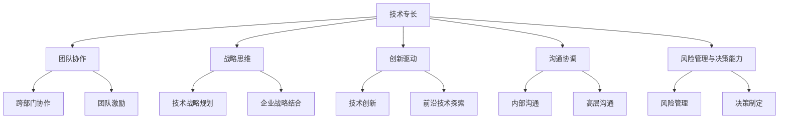

                 

### 前言

在当今快速发展的科技时代，技术领导力已成为企业成功的关键因素之一。无论是初创公司、中型公司还是大型企业，技术领导力都在推动企业创新、提高效率和实现商业目标中发挥着至关重要的作用。然而，不同规模的公司在应用技术领导力时，面临着各自独特的挑战和需求。因此，理解并适应这些差异，是提升企业技术领导力的关键。

本书《技术领导力在不同规模公司中的应用》旨在探讨技术领导力的概念、理论基础以及在不同规模公司中的实际应用。我们希望通过系统性的分析和丰富的案例，为读者提供实用的指导和建议，帮助他们在各自的企业中有效地应用技术领导力。

本书分为三个主要部分。第一部分将介绍技术领导力的基础理论，包括领导力的定义、类型、技术领导力的核心能力以及领导力模型。第二部分将深入探讨初创公司、中型公司和大型公司在应用技术领导力时的不同策略和实践。第三部分将展望技术领导力的未来趋势，探讨新兴技术对领导力的影响以及技术领导力面临的挑战和应对策略。

通过这一步步的分析和探讨，我们希望读者能够对技术领导力有更深刻的理解，并能够在实际工作中运用这些理论，提升企业的竞争力。

### 关键词

技术领导力、初创公司、中型公司、大型公司、应用策略、成功案例、未来趋势。

### 摘要

本书《技术领导力在不同规模公司中的应用》旨在深入探讨技术领导力在不同规模公司中的实践和应用。书中首先介绍了技术领导力的核心概念和理论基础，包括领导力的定义、类型、核心能力和领导力模型。接着，本书分为三部分，分别针对初创公司、中型公司和大型公司，探讨了技术领导力在这些不同规模企业中的具体应用策略和实践。通过详细的分析和丰富的案例，本书提供了实用的指导和建议，帮助读者理解并适应不同规模公司在应用技术领导力时的独特挑战和需求。最后，本书展望了技术领导力的未来趋势，探讨了新兴技术对领导力的影响以及面临的挑战和应对策略。本书不仅适合企业技术管理人员阅读，也为广大的技术领导者提供了宝贵的参考。

### 第一部分：技术领导力基础理论

#### 第1章：技术领导力概述

##### 1.1 领导力的定义与类型

领导力是一个广泛的概念，通常指的是个体或集体引导、激励和影响他人以实现共同目标的能力。根据不同的定义和视角，领导力可以分为多种类型，包括：

- **权威型领导**：依靠职位权力和正式权威来指导他人。
- **民主型领导**：通过参与和讨论来鼓励团队成员共同作出决策。
- **变革型领导**：通过激发团队成员的内在动机，推动变革和创新。
- **交易型领导**：通过奖励和惩罚来激励团队成员。

技术领导力作为一种特殊的领导力类型，不仅仅是技术管理和项目执行，更涉及到技术创新、团队管理和战略规划。技术领导者不仅要具备深厚的专业知识和技能，还需要具备卓越的领导力和管理能力，以推动技术团队和整个企业的成功。

##### 1.2 技术领导力的独特性

技术领导力与其他类型的领导力相比，具有以下独特性：

- **技术专长**：技术领导者通常具有丰富的技术背景和专业知识，能够深入理解技术趋势和前沿技术，指导团队进行技术决策和创新。
- **创新驱动**：技术领导者需要具备创新思维和前瞻性，能够引导团队探索新技术、新方法，推动企业的技术进步。
- **团队协作**：技术领导者需要协调不同职能部门和技术团队，促进跨部门合作，提高团队的整体效能。
- **风险管理**：技术领导者需要具备良好的风险管理和决策能力，能够在技术项目开发过程中应对各种不确定性，确保项目成功。

##### 1.3 技术领导力的核心能力

技术领导力的核心能力包括以下几个方面：

- **战略思维**：技术领导者需要具备长远的战略眼光，能够将技术战略与企业整体战略相结合，推动企业的持续发展。
- **技术领导**：技术领导者需要具备良好的技术指导和培训能力，能够带领团队进行技术创新和项目执行。
- **团队管理**：技术领导者需要具备有效的团队管理技能，能够激发团队成员的潜力，提高团队的整体绩效。
- **沟通协调**：技术领导者需要具备卓越的沟通能力，能够与团队成员、其他部门以及高层管理者进行有效沟通，确保项目的顺利进行。
- **创新激励**：技术领导者需要能够激发团队的创新热情，鼓励团队成员提出新的想法和解决方案，推动企业技术进步。

通过这一章的介绍，我们对技术领导力的定义、类型、独特性和核心能力有了初步的了解。接下来，我们将进一步探讨技术领导力模型，以深入理解技术领导力的理论和实践基础。

#### 第2章：技术领导力模型

##### 2.1 经典领导力模型回顾

在探讨技术领导力模型之前，我们先回顾一些经典的领导力模型。这些模型在不同的背景下被广泛研究和应用，对理解技术领导力具有一定的参考价值。

1. **领导—成员交换理论（LMX理论）**

领导—成员交换理论提出，领导者与成员之间的关系分为几个层次，包括低层次关系和高层次关系。低层次关系主要基于任务完成，而高层次关系则基于信任、尊重和情感联系。技术领导者需要在不同情境下建立合适的领导—成员关系，以最大化团队的效率和创造力。

2. **情境领导模型**

情境领导模型认为，领导者的风格应根据下属的能力和动机来调整。具体来说，有四种领导风格：指导型、支持型、参与型和委托型。技术领导者需要根据团队成员的技术水平和动机，灵活调整领导风格，以实现最佳效果。

3. **变革型领导**

变革型领导强调领导者通过激励和启发下属，推动组织实现变革和创新。变革型领导者通常具备前瞻性思维和强大的个人影响力，能够引领团队走出舒适区，迎接新的挑战。

##### 2.2 技术领导力模型的构建

在了解了经典领导力模型的基础上，我们可以尝试构建一个适用于技术领导力的模型。该模型应考虑技术领导力的独特性和核心能力，包括以下几个方面：

1. **技术专长维度**

技术领导者需要具备深厚的专业知识和技能，能够对技术趋势进行准确判断，并指导团队进行技术创新。

2. **团队协作维度**

技术领导者需要具备卓越的团队管理能力，能够协调不同职能部门和技术团队，促进跨部门合作，提高团队的整体效能。

3. **战略思维维度**

技术领导者需要具备长远的战略眼光，能够将技术战略与企业整体战略相结合，推动企业的持续发展。

4. **创新驱动维度**

技术领导者需要具备创新思维和前瞻性，能够引导团队探索新技术、新方法，推动企业的技术进步。

5. **沟通协调维度**

技术领导者需要具备卓越的沟通能力，能够与团队成员、其他部门以及高层管理者进行有效沟通，确保项目的顺利进行。

6. **风险管理与决策能力维度**

技术领导者需要具备良好的风险管理和决策能力，能够在技术项目开发过程中应对各种不确定性，确保项目成功。

基于上述维度，我们可以构建一个技术领导力模型，如下图所示：

##### 2.3 技术领导力模型的应用

技术领导力模型不仅为技术领导者提供了行为指南，还可以在实际工作中得到应用。以下是技术领导力模型在实际工作中的几个应用场景：

1. **团队组建与培养**

在团队组建过程中，技术领导者可以根据技术专长维度，选择具备相应技术背景和能力的团队成员。在团队培养过程中，技术领导者可以通过团队协作维度和沟通协调维度，提高团队成员的合作意识和沟通能力，从而提高团队的整体效能。

2. **项目规划与执行**

在项目规划阶段，技术领导者可以根据战略思维维度和创新驱动维度，制定具有前瞻性的技术战略，确保项目能够实现预期的商业价值。在项目执行过程中，技术领导者可以通过沟通协调维度和风险管理维度，确保项目按照计划顺利进行，并能够及时应对各种风险和挑战。

3. **企业战略结合**

技术领导者需要将技术战略与企业整体战略相结合，确保技术发展与企业业务目标一致。在这个过程中，技术领导者可以运用战略思维维度和沟通协调维度，确保技术决策与企业发展方向保持一致。

4. **技术创新与突破**

技术领导者需要具备创新思维和前瞻性，能够引导团队探索新技术、新方法，推动企业的技术进步。在这个过程中，技术领导者可以通过创新驱动维度和团队协作维度，激发团队成员的创造力和创新能力。

通过上述应用，技术领导力模型可以帮助技术领导者在实际工作中更加系统和有效地发挥领导作用，推动企业的技术进步和持续发展。

#### 第3章：技术管理知识

##### 3.1 技术管理的基本概念

技术管理是企业管理的重要组成部分，涉及到技术规划、技术项目管理和技术团队管理等方面。技术管理的基本概念包括以下几个方面：

- **技术规划**：技术规划是企业在长期内对技术发展的总体规划和布局。它包括技术方向的选择、技术投资的决策、技术资源的配置等。

- **技术项目管理**：技术项目管理是对技术项目从启动到完成的全程管理，包括项目目标设定、项目计划制定、项目资源调配、项目进度监控和项目风险管理等。

- **技术团队管理**：技术团队管理是对技术团队的日常管理，包括团队组建、团队激励、团队培训、团队绩效评估等。

##### 3.2 技术项目管理

技术项目管理是技术管理中的关键环节，它关系到技术项目的成功与否。技术项目管理的主要内容包括：

- **项目目标设定**：明确技术项目的目标和预期成果，确保项目能够满足企业的业务需求。

- **项目计划制定**：制定详细的项目计划，包括项目范围、项目任务、项目时间表、项目资源需求等。

- **项目资源调配**：合理调配项目所需的资源，包括人力、资金、设备等，确保项目能够顺利进行。

- **项目进度监控**：监控项目进度，确保项目按照计划进行，及时调整计划以应对各种变化。

- **项目风险管理**：识别和评估项目风险，制定相应的风险应对策略，降低风险对项目的影响。

##### 3.3 技术团队管理

技术团队管理是技术管理的核心，它直接影响到技术项目的成功。技术团队管理的主要内容包括：

- **团队组建**：根据项目需求和技术特点，组建合适的团队，确保团队成员具备所需的技术能力和经验。

- **团队激励**：通过激励措施激发团队成员的工作积极性和创造力，提高团队的整体绩效。

- **团队培训**：定期对团队成员进行技术培训和职业发展培训，提高团队成员的技术水平和职业素养。

- **团队绩效评估**：建立科学的绩效评估体系，对团队成员的工作表现进行客观、公正的评价，激励团队成员不断进步。

通过技术管理知识的学习和应用，技术领导者可以更好地规划和管理技术项目，提高技术团队的工作效率和创新能力，从而推动企业的技术进步和持续发展。

### 第二部分：不同规模公司的技术领导力实践

#### 第4章：初创公司的技术领导力

##### 4.1 初创公司的特点与挑战

初创公司通常具有以下几个特点：

- **资源有限**：初创公司通常在资金、人力资源和物资资源方面有限，这要求技术领导者必须具备高效的资源管理能力。
- **市场不确定**：初创公司面临的市场环境通常不确定，技术领导者需要具备较强的市场洞察力和创新思维，以应对市场变化。
- **快速迭代**：初创公司通常采用快速迭代的产品开发模式，技术领导者需要能够快速响应市场需求，进行技术决策和团队协调。
- **团队核心**：在初创公司中，技术团队往往是公司最核心的资产，技术领导者需要建立高效的团队协作机制，激发团队潜力。

在初创公司中，技术领导者面临的挑战主要包括：

- **资源限制**：初创公司在资金和人力资源方面的限制，要求技术领导者必须具备出色的资源管理能力，确保项目的成功。
- **市场风险**：初创公司在市场不确定性下，技术领导者需要具备较强的市场洞察力和风险应对能力，以确保产品能够满足市场需求。
- **团队建设**：初创公司技术团队的建设和稳定，对技术领导者来说是一项重要的挑战，技术领导者需要建立良好的团队文化和协作机制。

##### 4.2 技术领导力在初创公司中的应用

在初创公司中，技术领导力可以发挥以下几方面的作用：

- **资源优化配置**：技术领导者需要根据初创公司的资源状况，进行科学合理的资源分配，确保技术项目能够顺利进行。
- **创新思维**：技术领导者需要具备创新思维，引导团队探索新技术、新方法，以满足市场需求和提升产品竞争力。
- **快速决策**：在初创公司中，技术领导者需要具备快速决策的能力，能够在短时间内做出正确的技术决策，推动项目进展。
- **团队激励**：技术领导者需要建立有效的激励机制，激发团队成员的积极性和创造力，提高团队的整体绩效。

##### 4.3 初创公司技术领导力的成功案例

以下是一个初创公司技术领导力的成功案例：

**案例：一家智能硬件初创公司的技术领导力实践**

- **背景**：这家初创公司成立于2018年，专注于智能硬件产品的研发和销售。公司初期资金有限，团队成员主要来自互联网和硬件行业的优秀人才。
- **挑战**：公司初期面临的主要挑战是市场的不确定性和技术开发的复杂性。技术领导者需要在资源有限的情况下，带领团队完成技术突破，同时确保产品能够满足市场需求。
- **解决方案**：
  1. **资源优化配置**：技术领导者通过精细化管理和资源共享，确保了技术项目在资金和人力资源方面的合理使用。
  2. **创新思维**：技术领导者鼓励团队成员提出新的技术方案，并亲自参与技术讨论，推动团队进行技术创新。
  3. **快速决策**：技术领导者通过建立高效的决策机制，确保技术决策能够在最短时间内完成，从而加快产品开发进度。
  4. **团队激励**：技术领导者通过设立项目奖励、组织技术培训和分享经验，激发团队成员的工作热情和创新潜力。
- **结果**：在公司成立后的两年内，技术领导者成功带领团队推出了多款智能硬件产品，这些产品在市场上获得了良好的口碑和用户反馈，为公司赢得了市场份额。

通过这个案例，我们可以看到，初创公司的技术领导力在资源优化配置、创新思维、快速决策和团队激励等方面发挥了重要作用，这些因素共同推动了初创公司的成功。

#### 第5章：中型公司的技术领导力

##### 5.1 中型公司的成长路径

中型公司通常在创业初期已经取得了一定的成功，并在市场上站稳了脚跟。随着公司规模的扩大，中型公司通常面临以下几个阶段的成长路径：

- **市场拓展**：在初期成功后，中型公司会开始拓展市场，通过增加销售渠道、扩大产品线和拓展新市场，进一步巩固市场地位。
- **技术创新**：中型公司需要不断进行技术创新，以保持产品的竞争力和市场优势。技术创新可以是产品功能的提升、性能的改进，也可以是新型技术的应用。
- **组织优化**：随着公司规模的扩大，中型公司需要进行组织优化，建立更加完善的组织结构和流程，以提高管理效率和团队协作能力。
- **多元化发展**：在一些情况下，中型公司可能会选择多元化发展，进入新的行业或领域，以分散风险和扩大业务范围。

##### 5.2 技术领导力在中型公司中的应用

在中型公司中，技术领导力可以发挥以下几方面的作用：

- **战略规划**：技术领导者需要根据公司的发展目标，制定长期和短期技术战略，确保技术发展与企业整体战略一致。
- **技术创新**：技术领导者需要带领团队进行技术创新，推动新技术的应用和产品的升级，以保持市场竞争力。
- **项目管理**：技术领导者需要具备良好的项目管理能力，确保技术项目按时完成、质量符合要求，并能够适应市场变化。
- **团队管理**：技术领导者需要建立高效的团队管理机制，激发团队成员的创造力和工作效率，提高团队的整体绩效。

##### 5.3 中型公司技术领导力的实践策略

为了在中型公司中有效地应用技术领导力，技术领导者可以采取以下实践策略：

1. **建立明确的战略方向**：技术领导者需要与公司高层管理者密切合作，共同制定技术战略，确保技术发展与企业整体战略一致。
2. **加强技术创新**：技术领导者需要鼓励团队进行技术创新，提供必要的资源和支持，推动新技术在产品中的应用。
3. **优化项目管理流程**：技术领导者需要建立完善的项目管理流程，确保项目能够按时完成，质量符合要求，并能够快速响应市场变化。
4. **提升团队协作能力**：技术领导者需要通过培训和激励措施，提升团队成员的协作能力和技术能力，建立高效的团队协作机制。
5. **持续学习与成长**：技术领导者需要具备持续学习的能力，紧跟技术发展趋势，不断提高自身的技术和管理水平。

通过这些实践策略，中型公司的技术领导者可以有效地推动公司的技术进步和业务发展，提高公司的市场竞争力。

#### 第6章：大型公司的技术领导力

##### 6.1 大型公司的规模与结构

大型公司通常具有庞大的规模和复杂的组织结构，这给技术领导力带来了独特的挑战和机遇。大型公司的规模和结构特点包括：

- **庞大的组织**：大型公司通常拥有数千名甚至数万名员工，涉及多个业务部门、地区分支机构和技术团队。
- **复杂的流程**：大型公司的业务流程和管理流程通常非常复杂，技术领导者需要具备强大的流程管理能力，确保技术项目的顺利进行。
- **跨部门协作**：在大型公司中，技术项目往往涉及多个部门，技术领导者需要具备良好的跨部门协作能力，协调不同部门之间的资源和利益。
- **全球化运营**：一些大型公司具备全球化的运营能力，技术领导者需要处理不同国家和地区的文化差异和业务需求，推动全球技术一体化。

##### 6.2 技术领导力在大型公司中的应用

在大型公司中，技术领导力可以发挥以下几方面的作用：

- **战略规划**：技术领导者需要制定长期和短期技术战略，确保技术发展与企业整体战略一致，并能够推动企业的全球业务发展。
- **技术创新**：技术领导者需要带领团队进行技术创新，推动新技术在产品中的应用，提高产品的竞争力和市场占有率。
- **项目管理**：技术领导者需要具备强大的项目管理能力，确保大型技术项目能够按时完成、质量符合要求，并能够适应快速变化的市场需求。
- **团队管理**：技术领导者需要建立高效的团队管理机制，激发团队成员的创造力和工作效率，提高团队的整体绩效。
- **风险控制**：技术领导者需要具备良好的风险控制能力，识别和评估项目风险，制定相应的风险应对策略，确保项目的成功。

##### 6.3 大型公司技术领导力的挑战与对策

在大型公司中，技术领导者面临的挑战主要包括：

- **复杂性**：大型公司的复杂性和多样性给技术领导力带来了挑战，技术领导者需要具备强大的分析和决策能力，应对复杂的管理问题。
- **跨部门协作**：跨部门协作是大型公司中的常见问题，技术领导者需要建立有效的沟通和协作机制，确保项目能够顺利进行。
- **全球化运营**：全球化运营带来了文化差异和业务需求的多样性，技术领导者需要具备跨文化管理和全球业务协调能力。
- **持续创新**：大型公司通常面临持续创新的压力，技术领导者需要激发团队的创新潜力，推动新技术和产品的开发。

为了应对这些挑战，大型公司的技术领导者可以采取以下对策：

1. **建立清晰的战略方向**：技术领导者需要与公司高层管理者密切合作，共同制定技术战略，确保技术发展与企业整体战略一致。
2. **加强跨部门协作**：技术领导者需要建立跨部门的协作机制，通过定期沟通和协作会议，确保项目能够顺利进行。
3. **培养全球视野**：技术领导者需要具备全球视野，了解不同国家和地区的文化差异和业务需求，推动全球技术一体化。
4. **持续创新和培养人才**：技术领导者需要激发团队的创新潜力，提供培训和发展机会，培养具有全球竞争力的人才。
5. **有效的风险控制**：技术领导者需要建立完善的风险控制体系，识别和评估项目风险，制定相应的风险应对策略，确保项目的成功。

通过这些对策，大型公司的技术领导者可以有效地应对挑战，推动公司的技术进步和业务发展。

### 第三部分：技术领导力的拓展与未来

#### 第7章：技术领导力的未来趋势

##### 7.1 新兴技术对领导力的影响

随着科技的快速发展，新兴技术如人工智能、大数据、区块链等正在深刻改变企业的运营模式和市场环境。这些新兴技术对技术领导力产生了以下几方面的影响：

- **技术创新速度加快**：新兴技术使得技术创新的速度大幅提高，技术领导者需要具备更快的决策能力和执行力，以适应快速变化的市场需求。
- **数据分析能力提升**：大数据和人工智能技术使得企业能够更好地进行数据分析和决策，技术领导者需要具备强大的数据分析能力和数据管理能力。
- **安全风险增加**：随着技术的复杂性和互联性的增加，安全风险也不断上升，技术领导者需要具备良好的安全意识和风险管理能力。
- **全球化业务扩展**：新兴技术使得企业能够更方便地进行全球化扩展，技术领导者需要具备跨文化的管理和协调能力。

##### 7.2 技术领导力的未来发展预测

在未来，技术领导力的趋势将呈现以下特点：

- **跨学科整合**：技术领导者需要具备跨学科的知识和技能，能够整合不同领域的专业知识，推动技术创新。
- **数据驱动决策**：随着数据技术的普及，技术领导者将更加依赖数据分析和决策，数据将成为技术决策的重要依据。
- **创新能力驱动**：技术领导者需要具备强大的创新能力和创业精神，推动企业持续进行技术创新和产品迭代。
- **人才驱动发展**：人才将成为企业最重要的资产，技术领导者需要具备优秀的人才管理和培养能力，吸引和留住顶尖人才。

##### 7.3 技术领导力的创新实践

为了应对未来的挑战和机遇，技术领导者可以采取以下创新实践：

- **数字化转型**：推动企业的数字化转型，采用新兴技术提升企业的运营效率和竞争力。
- **敏捷管理**：采用敏捷管理方法，提高项目的灵活性和响应速度，更好地适应市场变化。
- **开放创新**：推动开放创新，与外部合作伙伴共同开发新技术和新产品，提高企业的创新能力和市场竞争力。
- **人才培养与激励**：建立完善的人才培养和激励机制，吸引和留住顶尖人才，推动企业的持续发展。

#### 第8章：技术领导力的挑战与应对

##### 8.1 技术领导力面临的挑战

技术领导力在发展过程中面临着以下几方面的挑战：

- **技术复杂性增加**：随着技术的快速发展，技术复杂性不断增加，技术领导者需要具备更深入的技术知识和技能。
- **市场竞争加剧**：市场竞争日益激烈，技术领导者需要具备强大的市场洞察力和战略规划能力，以应对激烈的市场竞争。
- **人才短缺**：顶尖技术人才短缺，技术领导者需要具备优秀的人才管理和培养能力，吸引和留住顶尖人才。
- **安全风险**：随着技术的复杂性和互联性的增加，安全风险也不断上升，技术领导者需要具备良好的安全意识和风险管理能力。

##### 8.2 应对策略与实践

为了应对这些挑战，技术领导者可以采取以下策略和实践：

- **持续学习与成长**：技术领导者需要具备持续学习的能力，紧跟技术发展趋势，不断提高自身的技术和管理水平。
- **人才培养与激励**：建立完善的人才培养和激励机制，吸引和留住顶尖人才，推动企业的持续发展。
- **风险管理与控制**：建立完善的风险管理机制，识别和评估项目风险，制定相应的风险应对策略，确保项目的成功。
- **跨部门协作**：建立跨部门的协作机制，通过定期沟通和协作会议，确保项目能够顺利进行。
- **数字化转型**：推动企业的数字化转型，采用新兴技术提升企业的运营效率和竞争力。

##### 8.3 持续学习与个人成长

作为技术领导者，持续学习和个人成长至关重要。以下是一些建议：

- **定期学习**：设定固定的学习时间，定期阅读技术书籍、专业文章和行业报告，紧跟技术发展趋势。
- **参加培训**：参加相关的技术和管理培训课程，提高专业知识和技能。
- **交流与分享**：积极参与技术交流和分享活动，与其他技术领导者和管理者交流经验和观点。
- **实践与反思**：通过实际工作，不断实践和反思，总结经验教训，不断提升自己的能力。

通过持续学习和个人成长，技术领导者可以更好地应对挑战，推动企业的技术进步和业务发展。

### 结尾

本书《技术领导力在不同规模公司中的应用》旨在探讨技术领导力的核心概念、理论基础以及在初创公司、中型公司和大型公司中的实际应用。通过系统性的分析和丰富的案例，我们希望读者能够对技术领导力有更深刻的理解，并能够在实际工作中运用这些理论，提升企业的竞争力。

在技术快速发展的时代，技术领导力已成为企业成功的关键因素。不同规模的公司在应用技术领导力时，面临着各自独特的挑战和需求。理解并适应这些差异，是提升企业技术领导力的关键。

未来，随着新兴技术的不断涌现，技术领导力将面临更多挑战和机遇。技术领导者需要具备持续学习和创新的能力，不断适应新的技术环境，推动企业的持续发展。

让我们共同努力，提升技术领导力，引领企业走向更加辉煌的未来。

### 作者信息

作者：AI天才研究院/AI Genius Institute & 禅与计算机程序设计艺术 /Zen And The Art of Computer Programming

### 拓展阅读

- 《技术领导力：如何成为高效的技术领导者》
- 《敏捷领导力：如何在快速变化的环境中引领团队》
- 《数字化转型：企业如何通过数字化提升竞争力》

### 最佳实践 tips

- **战略规划**：与公司高层密切合作，制定明确的技术战略，确保技术发展与企业整体战略一致。
- **人才培养**：建立完善的人才培养和激励机制，吸引和留住顶尖人才。
- **风险管理**：建立全面的风险管理机制，识别和评估项目风险，制定相应的风险应对策略。
- **持续学习**：定期学习新技术和知识，不断提升自身的技术和管理水平。

### 小结

本书《技术领导力在不同规模公司中的应用》通过深入探讨技术领导力的核心概念、理论基础以及在初创公司、中型公司和大型公司中的实际应用，为读者提供了全面的指导。技术领导力不仅是技术管理和项目执行，更是战略规划、团队管理和创新驱动的综合体现。不同规模的公司在应用技术领导力时，需要根据自身特点采取相应的策略和实践。未来，技术领导者需要具备持续学习和创新的能力，以应对不断变化的技术环境和市场挑战。通过不断优化技术领导力，企业将能够在激烈的市场竞争中脱颖而出，实现持续发展。

