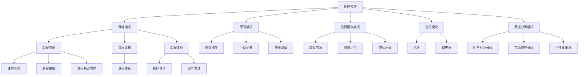
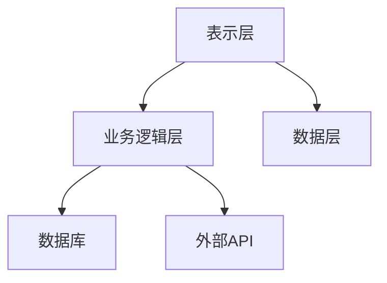

                 

**投资理财教育平台的集成概述**

## 第1章: 投资理财教育平台的背景与重要性

### 1.1 投资理财教育平台的发展背景

#### 投资理财教育平台的起源与发展历程
投资理财教育平台作为金融服务与互联网技术的融合产物，其发展历程可以追溯到互联网初期。在那个时期，投资理财的信息传播主要依赖于传统媒体和金融机构，形式相对单一，且覆盖面有限。随着互联网技术的发展和普及，尤其是在移动通信技术、大数据分析和人工智能等新兴技术的推动下，投资理财教育平台迎来了快速发展的契机。

#### 投资理财教育平台的起源
- **1990年代**：随着互联网的兴起，一些金融网站开始提供基本的投资理财信息，这标志着投资理财教育平台的开端。
- **2000年代**：这一时期，互联网金融逐渐崭露头角，以雅虎财经、腾讯财经等为代表的金融门户网站为投资者提供了更为丰富的投资信息。
- **2010年代**：随着移动互联网的普及，手机应用成为投资理财的主要渠道，理财通、微众银行等移动理财平台应运而生。
- **2020年代**：大数据、人工智能等技术的应用，使得投资理财教育平台能够提供更加个性化和智能化的服务，例如，智能投顾、个性化投资建议等。

#### 投资理财教育平台的演变
1. **信息发布阶段**：最初，投资理财教育平台主要是提供投资相关的新闻、资讯和基本的数据分析。
2. **互动交流阶段**：随着社交媒体的发展，投资者可以在平台上进行互动交流，分享投资心得和经验。
3. **智能化服务阶段**：人工智能技术的应用使得平台能够提供更加智能化的服务，如智能投顾、个性化推荐等。
4. **综合金融服务阶段**：现代投资理财教育平台不仅提供教育服务，还涉及投资、融资、支付等多种金融服务。

### 1.2 投资理财教育平台的现状与趋势

#### 投资理财教育平台的现状
- **用户规模**：全球范围内，投资理财教育平台用户规模持续增长，尤其是在新兴市场国家。
- **商业模式**：平台主要收入来源包括广告、会员服务、佣金分成等，部分平台通过提供付费课程或VIP服务获得收入。
- **技术应用**：大数据、人工智能、区块链等技术在平台中的应用不断深入，提高了服务的个性化和智能化水平。

#### 投资理财教育平台的发展趋势
1. **个性化服务**：随着用户数据的积累和分析技术的进步，平台将能够提供更加精准和个性化的投资建议。
2. **智能化推荐**：利用人工智能技术，平台将能够实现智能化的内容推荐和投资策略推荐。
3. **跨平台整合**：随着移动互联网和物联网的发展，投资理财教育平台将更加注重跨平台整合，提供无缝的跨设备服务体验。
4. **金融科技融合**：投资理财教育平台将进一步与金融科技（FinTech）融合，提供更多元化的金融服务。

### 1.3 投资理财教育平台的重要性

#### 对投资者的意义
1. **知识普及**：通过平台，投资者可以获取系统的投资理财知识，提高自身的投资素质。
2. **风险规避**：平台提供的风险评估和投资策略推荐有助于投资者规避风险，做出更加明智的投资决策。
3. **投资效率**：智能化的服务和工具提高了投资者的投资决策效率，节省了时间和精力。

#### 对教育者的意义
1. **教育普及**：教育者可以通过平台扩大教学范围，实现知识的普及和教育效益的最大化。
2. **教学创新**：利用平台提供的工具和资源，教育者可以探索新的教学方法和模式，提高教学质量。
3. **资源共享**：平台为教育者提供了丰富的教学资源和互动交流平台，有助于知识的共享和更新。

#### 对平台运营者的意义
1. **用户增长**：通过提供高质量的教育服务和智能化的投资工具，平台可以吸引更多的用户，实现用户规模的持续增长。
2. **商业模式创新**：平台运营者可以通过多样化的商业模式获得收入，例如会员服务、广告、交易佣金等。
3. **竞争优势**：高质量的投教平台将增强平台的竞争力，有助于在激烈的市场环境中脱颖而出。

## 第2章: 投资理财教育平台的需求分析

### 2.1 投资者需求分析

#### 投资者需求概述
投资者作为投资理财教育平台的主要用户群体，他们的需求是平台设计和功能实现的重要依据。以下将详细分析投资者的需求：

##### 投资知识获取
- **需求**：投资者希望通过平台获取系统化的投资理财知识。
- **实现方式**：平台应提供丰富的教育内容，包括基础投资知识、市场动态分析、策略分析等。

##### 风险评估
- **需求**：投资者希望对潜在投资进行风险评估，以便做出更加明智的决策。
- **实现方式**：平台应提供风险评估工具，如风险问卷、风险偏好测试等。

##### 投资策略推荐
- **需求**：投资者希望获得个性化的投资策略推荐。
- **实现方式**：平台可以利用大数据分析和人工智能技术，为投资者提供基于其投资目标的个性化策略。

##### 投资模拟与回测
- **需求**：投资者希望进行投资模拟和回测，以检验投资策略的有效性。
- **实现方式**：平台应提供模拟投资环境和回测工具，让投资者可以在虚拟市场中实践其投资策略。

##### 互动交流
- **需求**：投资者希望与其他投资者进行互动交流，分享投资心得和经验。
- **实现方式**：平台应提供论坛、聊天室等互动交流功能，促进社区氛围的形成。

##### 实时数据与信息
- **需求**：投资者希望获得实时、准确的投资数据和市场信息。
- **实现方式**：平台应提供实时数据更新和个性化的投资资讯服务。

### 2.2 教育者需求分析

#### 教育者需求概述
教育者作为投资理财教育平台的重要组成部分，他们的需求直接影响平台的教学质量和用户满意度。以下将详细分析教育者的需求：

##### 教学资源获取
- **需求**：教育者希望获得丰富的教学资源，包括教材、课件、案例分析等。
- **实现方式**：平台应提供资源库，让教育者可以方便地获取和使用教学资源。

##### 教学工具应用
- **需求**：教育者希望使用先进的教学工具，以提高教学效果。
- **实现方式**：平台应提供多媒体教学工具，如视频课程、互动问答、虚拟实验室等。

##### 学生管理
- **需求**：教育者需要对学生的学习进度和成绩进行有效管理。
- **实现方式**：平台应提供学生管理系统，包括学习进度跟踪、成绩管理、考试安排等。

##### 教学互动
- **需求**：教育者希望与学生进行有效的教学互动，提高学生的学习积极性。
- **实现方式**：平台应提供互动教学工具，如在线讨论区、实时问答、在线测试等。

##### 数据分析与反馈
- **需求**：教育者希望对教学效果进行数据分析，获取反馈，以便改进教学方法。
- **实现方式**：平台应提供教学数据分析工具，如学习行为分析、成绩分析、用户反馈等。

### 2.3 平台运营者需求分析

#### 平台运营者需求概述
平台运营者作为投资理财教育平台的运营主体，他们的需求直接影响平台的稳定运行和持续发展。以下将详细分析平台运营者的需求：

##### 平台稳定性
- **需求**：平台运营者希望平台能够稳定运行，确保用户服务的连续性。
- **实现方式**：平台应采用高可用架构和容错机制，确保系统在极端情况下仍能正常运行。

##### 用户增长
- **需求**：平台运营者希望平台能够吸引更多用户，实现用户规模的持续增长。
- **实现方式**：平台应提供高质量的教育服务和智能化的投资工具，增强用户粘性。

##### 营收增长
- **需求**：平台运营者希望通过平台获得持续增长的营收。
- **实现方式**：平台应探索多样化的商业模式，如会员服务、广告、交易佣金等。

##### 数据安全与合规
- **需求**：平台运营者希望确保用户数据和交易数据的安全，遵守相关法律法规。
- **实现方式**：平台应采用严格的数据安全措施，如数据加密、访问控制、合规审查等。

### 2.4 需求分析总结与核心问题

#### 总结
通过对投资者、教育者和平台运营者的需求分析，我们可以看到，投资理财教育平台的用户需求是多样化且复杂的。平台需要同时满足不同用户群体的需求，提供高质量的教育服务和智能化的投资工具。

#### 核心问题
1. **需求冲突**：不同用户群体的需求存在一定的冲突，例如，投资者的个性化需求与教育者的标准化需求之间的平衡问题。
2. **资源分配**：平台需要在有限的资源条件下，合理分配资源，以满足不同用户群体的需求。
3. **用户体验**：平台需要确保用户体验的一致性和优质性，避免因功能繁多而导致操作复杂。
4. **安全性**：在满足用户需求的同时，确保平台的安全性，防止数据泄露和恶意攻击。

通过以上分析，我们可以为投资理财教育平台的设计和实现提供有针对性的指导，确保平台能够满足用户的需求，实现稳定、可持续的发展。

## 第3章: 投资理财教育平台的架构设计

### 3.1 投资理财教育平台的整体架构

#### 投资理财教育平台的功能模块

投资理财教育平台的整体架构包括多个功能模块，这些模块相互协作，共同为用户提供高质量的投资理财教育服务。以下是平台的主要功能模块：

##### 用户模块
用户模块负责用户的注册、登录、个人信息管理、权限管理等功能。用户模块的核心功能包括：
- **用户注册与登录**：支持多种注册方式（如邮箱、手机号、第三方账号），并实现安全的登录机制。
- **个人信息管理**：用户可以查看和修改个人信息，如头像、密码、联系方式等。
- **权限管理**：根据用户的角色和权限，限制其访问和操作范围。

##### 课程模块
课程模块是平台的核心功能模块，负责课程的管理、发布、学习进度跟踪等功能。课程模块的核心功能包括：
- **课程管理**：管理员可以上传、编辑和删除课程内容。
- **课程发布**：管理员可以将课程发布给用户，并提供学习进度跟踪功能。
- **课程推荐**：利用大数据和人工智能技术，推荐用户可能感兴趣的课程。

##### 学习模块
学习模块负责用户的学习体验，包括视频播放、互动问答、在线测试等功能。学习模块的核心功能包括：
- **视频播放**：支持多种视频格式，提供流畅的视频播放体验。
- **互动问答**：用户可以在课程中进行提问，教育者可以实时回答。
- **在线测试**：提供多种类型的测试题目，帮助用户检验学习效果。

##### 投资模拟模块
投资模拟模块为用户提供了虚拟的投资环境，用户可以在模拟市场中实践投资策略。投资模拟模块的核心功能包括：
- **模拟市场**：创建虚拟的投资市场，包括股票、基金等多种投资品种。
- **投资组合**：用户可以创建和调整自己的投资组合，模拟实际投资。
- **数据跟踪**：实时跟踪投资组合的表现，提供数据分析报告。

##### 社交模块
社交模块为用户提供了交流和互动的平台，包括论坛、聊天室、朋友圈等功能。社交模块的核心功能包括：
- **论坛**：用户可以在论坛中发布和讨论投资相关话题。
- **聊天室**：用户可以与其他用户实时聊天，交流投资心得。
- **朋友圈**：用户可以分享投资心得和成就，获取其他用户的点赞和评论。

##### 数据分析模块
数据分析模块负责收集、处理和分析用户行为数据，为平台提供决策支持。数据分析模块的核心功能包括：
- **用户行为分析**：分析用户的学习行为、投资行为，为平台提供优化建议。
- **市场趋势分析**：分析市场数据，预测市场趋势，为用户提供投资参考。
- **个性化推荐**：根据用户行为数据，推荐用户可能感兴趣的课程、投资策略等。

### 3.2 数据库设计与数据存储

#### 数据库设计原则
投资理财教育平台的数据库设计应遵循以下原则：
- **数据一致性**：确保数据的完整性和一致性，避免数据冗余和冲突。
- **可扩展性**：数据库应具备良好的扩展性，能够支持平台未来的业务扩展。
- **高可用性**：数据库应具备高可用性，确保平台在极端情况下仍能正常运行。

#### 数据表结构设计

以下是投资理财教育平台的主要数据表结构设计：

##### 用户表（user）
| 字段       | 类型       | 说明         |
|------------|------------|--------------|
| user_id    | INT        | 用户ID       |
| username   | VARCHAR    | 用户名       |
| password   | VARCHAR    | 密码         |
| email      | VARCHAR    | 邮箱地址     |
| phone      | VARCHAR    | 手机号码     |
| role       | ENUM       | 用户角色（如学生、教师、管理员）|
| status     | ENUM       | 用户状态（如正常、禁用）|

##### 课程表（course）
| 字段       | 类型       | 说明         |
|------------|------------|--------------|
| course_id  | INT        | 课程ID       |
| title      | VARCHAR    | 课程标题     |
| description| TEXT       | 课程描述     |
| created_at| TIMESTAMP  | 创建时间     |
| updated_at| TIMESTAMP  | 更新时间     |

##### 学习记录表（learning_record）
| 字段       | 类型       | 说明         |
|------------|------------|--------------|
| record_id  | INT        | 学习记录ID   |
| user_id    | INT        | 用户ID       |
| course_id  | INT        | 课程ID       |
| progress   | FLOAT      | 学习进度     |
| completed  | BOOLEAN    | 是否完成     |
| created_at| TIMESTAMP  | 创建时间     |

##### 投资模拟表（investment_simulation）
| 字段       | 类型       | 说明         |
|------------|------------|--------------|
| simulation_id| INT        | 模拟投资ID   |
| user_id    | INT        | 用户ID       |
| portfolio   | JSON       | 投资组合     |
| start_time  | TIMESTAMP  | 开始时间     |
| end_time    | TIMESTAMP  | 结束时间     |
| return      | FLOAT      | 收益率       |

##### 用户行为表（user_behavior）
| 字段       | 类型       | 说明         |
|------------|------------|--------------|
| behavior_id| INT        | 行为ID       |
| user_id    | INT        | 用户ID       |
| action     | ENUM       | 行为类型（如登录、学习、投资模拟）|
| created_at| TIMESTAMP  | 创建时间     |

#### 数据存储策略
- **数据分区**：对于大数据量的表，如用户行为表，采用数据分区策略，可以提高查询效率和数据管理能力。
- **数据备份与恢复**：定期进行数据备份，并建立数据恢复机制，确保数据的安全性和可靠性。
- **数据加密**：对敏感数据如用户密码、投资组合等，采用数据加密技术，保护用户隐私。

### 3.3 用户认证与权限管理

#### 用户认证
用户认证是确保平台安全性的重要措施，以下是投资理财教育平台的用户认证方案：

##### 认证方式
- **用户名密码认证**：用户通过用户名和密码登录平台。
- **第三方认证**：支持通过第三方账号（如微信、QQ、微博等）登录平台。

##### 认证流程
1. **注册与登录**：用户输入用户名和密码进行注册，注册成功后登录平台。
2. **身份验证**：平台对用户身份进行验证，确保用户身份的真实性。
3. **登录成功**：验证通过后，用户可以访问平台资源。

##### 认证技术
- **密码加密**：使用哈希算法对用户密码进行加密存储，确保密码安全。
- **双因素认证**：增加手机验证码或电子邮件验证码，提高认证安全性。

#### 权限管理
权限管理是确保用户在平台上的操作合法性和安全性的重要手段，以下是投资理财教育平台的权限管理方案：

##### 权限分级
平台用户权限分为普通用户、教育者和管理员三个级别：
- **普通用户**：可以访问平台的学习资源和投资模拟模块，参与互动交流。
- **教育者**：可以访问和管理课程，进行教学互动，提供学习指导。
- **管理员**：拥有最高权限，负责平台的管理和维护，包括用户管理、内容管理、系统设置等。

##### 权限控制
1. **访问控制**：平台根据用户的角色和权限，限制其访问和操作范围。
2. **操作日志**：记录用户的操作行为，便于审计和问题追踪。
3. **权限变更**：管理员可以根据用户表现和需求，调整用户的权限。

### 3.4 课程管理与内容发布

#### 课程管理
课程管理是投资理财教育平台的核心功能之一，以下是课程管理的具体实现：

##### 课程创建
- **创建课程**：管理员可以创建新的课程，包括课程名称、描述、学习目标等基本信息。
- **课程分类**：平台支持课程分类，便于用户查找和导航。

##### 课程编辑
- **课程内容编辑**：管理员可以编辑课程内容，包括文本、图片、视频等。
- **课程状态管理**：管理员可以设置课程的状态（如发布、待发布、下架等）。

##### 课程发布
- **课程发布**：管理员可以将课程发布给用户，用户可以开始学习。
- **课程推广**：管理员可以通过平台广告、社交分享等方式，推广课程。

##### 课程评价
- **用户评价**：用户可以对课程进行评价，包括课程质量、学习体验等。
- **评价管理**：管理员可以查看和管理课程评价，对优秀的课程进行推荐。

#### 内容发布
内容发布是投资理财教育平台的重要组成部分，以下是内容发布的具体实现：

##### 内容创建
- **创建内容**：管理员可以创建各种类型的内容，包括新闻、公告、课程笔记等。
- **内容分类**：平台支持内容分类，便于用户查找和导航。

##### 内容编辑
- **内容编辑**：管理员可以编辑内容，包括文字、图片、视频等。
- **内容状态管理**：管理员可以设置内容的发布状态（如发布、待发布、下架等）。

##### 内容发布
- **内容发布**：管理员可以将内容发布给用户，用户可以查看和阅读。
- **内容审核**：管理员对发布的内容进行审核，确保内容质量。

##### 内容更新
- **内容更新**：管理员可以更新已发布的内容，保持内容的新鲜度和时效性。

### 3.5 互动交流功能实现

#### 论坛
论坛是投资理财教育平台的重要组成部分，以下是论坛的实现：

##### 论坛分类
- **分类管理**：管理员可以创建和管理论坛分类，便于用户查找和讨论。

##### 帖子管理
- **发帖**：用户可以发起新的帖子，分享投资心得或提问。
- **回帖**：用户可以回复帖子，参与讨论。
- **帖子审核**：管理员可以审核帖子的发布，确保讨论内容的质量和合法性。

##### 帖子搜索
- **搜索功能**：平台提供帖子搜索功能，用户可以快速找到感兴趣的内容。

#### 聊天室
聊天室是用户实时交流的重要场所，以下是聊天室的实现：

##### 房间管理
- **创建房间**：用户可以创建新的聊天室，邀请其他用户加入。
- **房间设置**：管理员可以设置聊天室的主题、权限等。

##### 聊天功能
- **实时聊天**：用户在聊天室中可以实时发送和接收消息。
- **聊天记录**：平台保存聊天记录，便于用户查阅。

##### 房间权限
- **权限管理**：管理员可以设置聊天室的权限，包括是否允许发言、是否允许管理员管理等。

### 3.6 投资模拟功能实现

#### 投资模拟模块
投资模拟模块是投资理财教育平台的重要组成部分，以下是投资模拟模块的实现：

##### 模拟市场
- **市场创建**：管理员可以创建虚拟的投资市场，包括股票、基金、债券等投资品种。
- **市场数据**：平台从外部数据源获取实时市场数据，用于投资模拟。

##### 投资组合
- **组合创建**：用户可以创建和管理自己的投资组合。
- **组合管理**：用户可以查看投资组合的当前市值、收益率等指标。

##### 投资操作
- **买入/卖出**：用户可以在模拟市场中进行买入和卖出操作。
- **交易记录**：平台记录用户的交易操作，便于用户查看和管理。

##### 模拟收益
- **收益计算**：平台根据市场数据和交易记录，计算用户的模拟收益。
- **收益分析**：平台提供收益分析报告，帮助用户了解投资组合的表现。

### 3.7 数据分析模块

#### 数据分析功能
数据分析模块是投资理财教育平台的重要组成部分，以下是数据分析模块的实现：

##### 用户行为分析
- **学习行为分析**：平台分析用户的学习行为，如学习时长、学习频率等，为用户推荐合适的课程。
- **投资行为分析**：平台分析用户的投资行为，如交易频率、交易策略等，为用户提供投资建议。

##### 市场趋势分析
- **市场趋势预测**：平台利用大数据和人工智能技术，预测市场趋势，为用户决策提供参考。
- **市场数据分析**：平台提供市场数据的实时更新和分析报告，帮助用户了解市场动态。

##### 个性化推荐
- **课程推荐**：平台根据用户的学习行为和投资偏好，推荐合适的课程。
- **投资策略推荐**：平台根据市场数据和用户行为，推荐个性化的投资策略。

### 3.8 平台整体架构图

以下是投资理财教育平台的整体架构图：



通过以上架构设计和功能实现，投资理财教育平台可以为用户提供全面、高质量的投资理财教育服务，助力用户提升投资理财能力。

## 第4章: 投资理财教育平台的算法与模型

### 4.1 投资理财算法概述

#### 投资理财算法的定义与作用
投资理财算法是利用数学模型和计算机技术，对投资过程进行模拟和优化的算法。这些算法可以辅助投资者做出更明智的投资决策，提高投资收益并降低风险。

#### 投资理财算法的类型
1. **风险评估算法**：通过分析市场数据和历史投资表现，评估投资的风险水平。
2. **投资策略推荐算法**：根据投资者的风险偏好和投资目标，推荐适合的投资策略。
3. **学习路径优化算法**：根据用户的学习行为，优化课程推荐和学习路径。

### 4.2 风险评估算法设计

#### 风险评估算法的原理
风险评估算法基于以下原理：
- **历史数据分析**：通过分析历史市场数据，识别风险因素。
- **概率模型**：使用概率模型，如正态分布、逻辑回归等，对风险进行量化。
- **统计分析**：运用统计方法，如回归分析、时间序列分析等，对风险进行评估。

#### 风险评估算法的实现
1. **数据预处理**：收集和处理历史市场数据，包括股票价格、交易量、宏观经济指标等。
2. **特征提取**：从原始数据中提取影响风险的因素，如波动率、市盈率等。
3. **概率模型构建**：根据历史数据，构建概率模型，如逻辑回归模型。
4. **风险评分计算**：使用概率模型，计算每个投资项目的风险评分。
5. **风险报告生成**：将风险评分生成报告，供投资者参考。

### 4.3 投资策略推荐算法

#### 投资策略推荐算法的原理
投资策略推荐算法基于以下原理：
- **用户行为分析**：分析用户的历史投资行为和偏好。
- **市场数据挖掘**：从市场数据中挖掘潜在的投资策略。
- **优化算法**：使用优化算法，如遗传算法、粒子群算法等，筛选和推荐最优策略。

#### 投资策略推荐算法的实现
1. **用户行为分析**：收集用户的历史投资数据，包括投资品种、投资时间、收益情况等。
2. **市场数据挖掘**：从市场数据中提取潜在的投资策略，如趋势策略、均值回归策略等。
3. **优化算法应用**：使用优化算法，筛选和推荐最优投资策略。
4. **策略评估**：评估推荐策略的收益和风险，确保策略的有效性。
5. **策略推荐**：将评估后的策略推荐给用户，供其参考。

### 4.4 学习路径优化算法

#### 学习路径优化算法的原理
学习路径优化算法基于以下原理：
- **用户画像**：根据用户的学习行为和知识水平，构建用户画像。
- **课程推荐**：根据用户画像，推荐适合的学习路径和课程。
- **路径优化**：使用优化算法，如动态规划、贪心算法等，优化学习路径。

#### 学习路径优化算法的实现
1. **用户画像构建**：收集用户的学习数据，包括学习时长、学习频率、学习内容等，构建用户画像。
2. **课程库建立**：建立课程库，包括课程名称、描述、难度等级等。
3. **课程推荐**：根据用户画像和课程库，推荐适合的学习路径和课程。
4. **路径优化**：使用优化算法，优化学习路径，确保学习效果最佳。
5. **路径评估**：评估优化后的学习路径，确保路径的科学性和有效性。

### 4.5 算法应用实例

#### 实例1：风险评估算法的应用
**场景**：投资者需要评估某只股票的风险水平。
**步骤**：
1. **数据收集**：收集该股票的历史价格、交易量、市盈率等数据。
2. **特征提取**：提取影响风险的关键特征，如波动率、市盈率等。
3. **概率模型构建**：构建逻辑回归模型，将特征映射到风险评分。
4. **风险评分计算**：输入历史数据，计算风险评分。
5. **风险报告生成**：生成风险报告，供投资者参考。

#### 实例2：投资策略推荐算法的应用
**场景**：为某投资者推荐适合的投资策略。
**步骤**：
1. **用户行为分析**：分析投资者的历史投资行为和偏好。
2. **市场数据挖掘**：挖掘潜在的投资策略，如趋势策略、均值回归策略等。
3. **优化算法应用**：使用遗传算法，筛选和推荐最优策略。
4. **策略评估**：评估推荐策略的收益和风险。
5. **策略推荐**：推荐评估后的策略，供投资者参考。

#### 实例3：学习路径优化算法的应用
**场景**：为某投资者优化学习路径。
**步骤**：
1. **用户画像构建**：构建投资者画像，包括学习时长、学习频率、学习内容等。
2. **课程库建立**：建立包含课程名称、描述、难度等级的课程库。
3. **课程推荐**：根据用户画像和课程库，推荐适合的学习路径和课程。
4. **路径优化**：使用动态规划算法，优化学习路径。
5. **路径评估**：评估优化后的学习路径，确保路径的科学性和有效性。

通过以上算法的应用实例，我们可以看到投资理财教育平台如何通过算法为用户提供个性化的服务，提升用户投资理财能力和学习效果。

## 第5章: 投资理财教育平台的核心功能实现

### 5.1 注册与登录功能实现

#### 注册功能实现

**需求分析**：
注册功能是用户访问平台的第一个步骤，需要实现用户账户的创建。主要包括以下几个步骤：
- 输入用户名、密码、邮箱等基本信息。
- 对用户名和邮箱进行验证，确保唯一性和有效性。
- 对密码进行加密存储，确保用户数据安全。

**技术实现**：

1. **用户信息收集**：
   - 用户输入用户名、密码、邮箱等信息。
   - 前端使用HTML和JavaScript进行表单验证，确保输入数据的正确性。

2. **后端处理**：
   - 接收前端发送的用户信息，使用Java Spring Boot框架进行处理。
   - 对邮箱进行验证，确保邮箱地址唯一。
   - 使用MD5算法对密码进行加密存储，确保密码安全。

**示例代码**：

```java
// Spring Boot Controller
@RestController
public class UserController {
    @Autowired
    private UserService userService;

    @PostMapping("/register")
    public ResponseEntity<?> registerUser(@RequestBody UserRequestDTO userRequestDTO) {
        if (userService.existsByUsername(userRequestDTO.getUsername())) {
            return ResponseEntity.badRequest().body("Error: Username is already taken!");
        }
        
        User user = new User();
        user.setUsername(userRequestDTO.getUsername());
        user.setEmail(userRequestDTO.getEmail());
        user.setPassword encoder.encode(userRequestDTO.getPassword());

        userService.save(user);
        return ResponseEntity.ok("User registered successfully!");
    }
}
```

#### 登录功能实现

**需求分析**：
登录功能用于验证用户身份，用户需要输入用户名和密码。主要包括以下几个步骤：
- 用户输入用户名和密码。
- 对用户名和密码进行验证，确保用户身份的有效性。
- 如果验证成功，生成令牌（Token），用于后续接口调用时的身份验证。

**技术实现**：

1. **用户信息收集**：
   - 用户输入用户名和密码。
   - 前端使用HTML和JavaScript进行表单验证，确保输入数据的正确性。

2. **后端处理**：
   - 接收前端发送的用户信息，使用Java Spring Boot框架进行处理。
   - 对用户名和密码进行验证，确保用户身份的有效性。
   - 使用JWT（JSON Web Token）生成令牌，用于后续接口调用时的身份验证。

**示例代码**：

```java
// Spring Boot Controller
@RestController
public class AuthenticationController {
    @Autowired
    private AuthenticationManager authenticationManager;

    @Autowired
    private JwtTokenProvider tokenProvider;

    @PostMapping("/login")
    public ResponseEntity<?> authenticateUser(@RequestBody LoginRequestDTO loginRequestDTO) {
        Authentication authentication = authenticationManager.authenticate(new UsernamePasswordAuthenticationToken(
            loginRequestDTO.getUsername(), loginRequestDTO.getPassword()));

        SecurityContextHolder.getContext().setAuthentication(authentication);
        String jwt = tokenProvider.generateToken(authentication);

        return ResponseEntity.ok(new JwtResponse(jwt));
    }
}
```

### 5.2 课程学习功能实现

#### 课程学习功能概述

课程学习功能是投资理财教育平台的核心功能之一，用户可以通过该功能进行课程学习、观看视频、参与互动和测试等。主要包括以下几个部分：

1. **课程浏览**：用户可以浏览平台上的所有课程，筛选感兴趣的课程。
2. **课程学习**：用户可以在线观看课程视频，进行课程学习。
3. **互动交流**：用户可以在课程中进行提问和讨论，与其他用户进行互动交流。
4. **在线测试**：用户可以参与课程测试，检验学习效果。

#### 技术实现

1. **课程浏览**：
   - 前端使用HTML和CSS进行页面布局，使用JavaScript进行动态加载和筛选功能。
   - 后端使用Java Spring Boot框架处理课程浏览请求，从数据库中获取课程列表。

2. **课程学习**：
   - 前端使用视频播放库（如Video.js）进行视频播放，支持视频播放进度、暂停、快进等功能。
   - 后端使用Spring Boot框架处理视频播放请求，从数据库中获取视频文件，并提供流式传输。

3. **互动交流**：
   - 前端使用HTML和CSS进行页面布局，使用JavaScript实现实时互动功能。
   - 后端使用WebSocket技术实现实时消息传递，用户可以在课程中进行实时提问和讨论。

4. **在线测试**：
   - 前端使用HTML和CSS进行页面布局，使用JavaScript实现测试题目的加载和提交。
   - 后端使用Java Spring Boot框架处理测试请求，存储用户测试结果，并提供测试结果分析。

**示例代码**：

```java
// 课程浏览功能
@RestController
public class CourseController {
    @Autowired
    private CourseService courseService;

    @GetMapping("/courses")
    public ResponseEntity<List<CourseDTO>> getAllCourses() {
        List<Course> courses = courseService.getAllCourses();
        List<CourseDTO> courseDTOS = courses.stream()
            .map(course -> new CourseDTO(course))
            .collect(Collectors.toList());
        return ResponseEntity.ok(courseDTOS);
    }
}

// 课程学习功能
@RestController
public class VideoController {
    @Autowired
    private VideoService videoService;

    @GetMapping("/courses/{courseId}/videos")
    public ResponseEntity<List<VideoDTO>> getCourseVideos(@PathVariable Long courseId) {
        List<Video> videos = videoService.getCourseVideos(courseId);
        List<VideoDTO> videoDTOS = videos.stream()
            .map(video -> new VideoDTO(video))
            .collect(Collectors.toList());
        return ResponseEntity.ok(videoDTOS);
    }
}

// 互动交流功能
@Controller
public class ChatController {
    @MessageMapping("/chat")
    @SendTo("/topic/chat")
    public ChatMessage sendChatMessage(ChatMessage chatMessage) {
        return chatMessage;
    }
}

// 在线测试功能
@RestController
public class TestController {
    @Autowired
    private TestService testService;

    @GetMapping("/courses/{courseId}/tests")
    public ResponseEntity<List<TestDTO>> getCourseTests(@PathVariable Long courseId) {
        List<Test> tests = testService.getCourseTests(courseId);
        List<TestDTO> testDTOS = tests.stream()
            .map(test -> new TestDTO(test))
            .collect(Collectors.toList());
        return ResponseEntity.ok(testDTOS);
    }
}
```

通过以上实现，用户可以方便地在平台上进行课程学习，提高投资理财知识水平。

### 5.3 互动交流功能实现

#### 互动交流功能概述

互动交流功能是投资理财教育平台的重要组成部分，用户可以在平台上进行实时讨论、提问和分享投资心得。该功能主要包括以下几个部分：

1. **论坛**：用户可以发表帖子，进行投资话题的讨论。
2. **聊天室**：用户可以与其他用户实时聊天，交流投资心得。
3. **私信**：用户可以发送和接收私信，进行一对一的交流。

#### 技术实现

1. **论坛**：
   - 前端使用HTML和CSS进行页面布局，使用JavaScript实现发帖、回帖和查看帖子等功能。
   - 后端使用Java Spring Boot框架处理论坛请求，存储帖子信息，并提供帖子列表、查看和回复等功能。

2. **聊天室**：
   - 前端使用HTML和CSS进行页面布局，使用JavaScript实现实时聊天功能。
   - 后端使用WebSocket技术实现实时消息传递，用户可以在聊天室中进行实时聊天。

3. **私信**：
   - 前端使用HTML和CSS进行页面布局，使用JavaScript实现发送和接收私信功能。
   - 后端使用Java Spring Boot框架处理私信请求，存储私信内容，并提供发送和接收功能。

**示例代码**：

```java
// 论坛功能
@RestController
public class ForumController {
    @Autowired
    private ForumService forumService;

    @GetMapping("/forum/topics")
    public ResponseEntity<List<TopicDTO>> getAllTopics() {
        List<Topic> topics = forumService.getAllTopics();
        List<TopicDTO> topicDTOS = topics.stream()
            .map(topic -> new TopicDTO(topic))
            .collect(Collectors.toList());
        return ResponseEntity.ok(topicDTOS);
    }

    @PostMapping("/forum/topics")
    public ResponseEntity<?> createTopic(@RequestBody TopicDTO topicDTO) {
        Topic topic = new Topic();
        topic.setTitle(topicDTO.getTitle());
        topic.setContent(topicDTO.getContent());
        topic.setUser(userService.getUserById(topicDTO.getUserId()));

        forumService.saveTopic(topic);
        return ResponseEntity.ok("Topic created successfully!");
    }
}

// 聊天室功能
@Controller
public class ChatController {
    @MessageMapping("/chat")
    @SendTo("/topic/chat")
    public ChatMessage sendChatMessage(ChatMessage chatMessage) {
        return chatMessage;
    }
}

// 私信功能
@RestController
public class MessageController {
    @Autowired
    private MessageService messageService;

    @PostMapping("/messages")
    public ResponseEntity<?> sendMessage(@RequestBody MessageDTO messageDTO) {
        Message message = new Message();
        message.setSender(userService.getUserById(messageDTO.getSenderId()));
        message.setReceiver(userService.getUserById(messageDTO.getReceiverId()));
        message.setContent(messageDTO.getContent());

        messageService.sendMessage(message);
        return ResponseEntity.ok("Message sent successfully!");
    }
}
```

通过以上实现，用户可以方便地在平台上进行互动交流，分享投资心得和经验。

### 5.4 投资模拟功能实现

#### 投资模拟功能概述

投资模拟功能是投资理财教育平台的一个重要组成部分，用户可以在虚拟环境中模拟实际投资操作，以锻炼投资技能和策略。该功能主要包括以下几个部分：

1. **模拟市场**：创建一个虚拟的投资市场，包括股票、基金、债券等多种投资品种。
2. **投资组合**：用户可以创建和管理自己的投资组合，进行模拟投资操作。
3. **交易记录**：记录用户的交易操作，包括买入、卖出等，以便用户分析和总结投资策略。
4. **收益计算**：根据市场数据和交易记录，计算用户的模拟投资收益，并提供收益分析报告。

#### 技术实现

1. **模拟市场**：
   - 前端使用HTML和CSS进行页面布局，使用JavaScript实现模拟市场的界面和操作。
   - 后端使用Java Spring Boot框架处理模拟市场请求，包括市场数据的获取和处理、投资品种的管理等。

2. **投资组合**：
   - 前端使用HTML和CSS进行页面布局，使用JavaScript实现投资组合的创建和管理。
   - 后端使用Java Spring Boot框架处理投资组合请求，包括投资组合的创建、修改和删除等。

3. **交易记录**：
   - 前端使用HTML和CSS进行页面布局，使用JavaScript实现交易记录的查看和修改。
   - 后端使用Java Spring Boot框架处理交易记录请求，包括交易记录的存储和管理等。

4. **收益计算**：
   - 前端使用HTML和CSS进行页面布局，使用JavaScript实现收益计算的结果展示。
   - 后端使用Java Spring Boot框架处理收益计算请求，包括收益数据的计算和分析等。

**示例代码**：

```java
// 模拟市场功能
@RestController
public class MarketController {
    @Autowired
    private MarketService marketService;

    @GetMapping("/market")
    public ResponseEntity<MarketDTO> getMarket() {
        Market market = marketService.getMarket();
        MarketDTO marketDTO = new MarketDTO(market);
        return ResponseEntity.ok(marketDTO);
    }
}

// 投资组合功能
@RestController
public class PortfolioController {
    @Autowired
    private PortfolioService portfolioService;

    @PostMapping("/portfolio")
    public ResponseEntity<?> createPortfolio(@RequestBody PortfolioDTO portfolioDTO) {
        Portfolio portfolio = new Portfolio();
        portfolio.setName(portfolioDTO.getName());
        portfolio.setUser(userService.getUserById(portfolioDTO.getUserId()));

        portfolioService.createPortfolio(portfolio);
        return ResponseEntity.ok("Portfolio created successfully!");
    }
}

// 交易记录功能
@RestController
public class TradeController {
    @Autowired
    private TradeService tradeService;

    @PostMapping("/trades")
    public ResponseEntity<?> createTrade(@RequestBody TradeDTO tradeDTO) {
        Trade trade = new Trade();
        trade.setPortfolio(portfolioService.getPortfolioById(tradeDTO.getPortfolioId()));
        trade.setStock(stockService.getStockById(tradeDTO.getStockId()));
        trade.setQuantity(tradeDTO.getQuantity());
        trade.setPrice(tradeDTO.getPrice());
        trade.setTransactionTime(new Date());

        tradeService.createTrade(trade);
        return ResponseEntity.ok("Trade created successfully!");
    }
}

// 收益计算功能
@RestController
public class ProfitController {
    @Autowired
    private ProfitService profitService;

    @GetMapping("/portfolio/{portfolioId}/profit")
    public ResponseEntity<ProfitDTO> calculateProfit(@PathVariable Long portfolioId) {
        Profit profit = profitService.calculateProfit(portfolioId);
        ProfitDTO profitDTO = new ProfitDTO(profit);
        return ResponseEntity.ok(profitDTO);
    }
}
```

通过以上实现，用户可以方便地在平台上进行投资模拟操作，提升投资技能和策略。

## 第6章: 投资理财教育平台的安全与合规性

### 6.1 平台安全性设计

#### 安全性设计原则
投资理财教育平台的安全性设计遵循以下原则：
- **最小权限原则**：用户和系统组件只能访问其必要的数据和资源。
- **加密保护**：敏感数据（如用户密码、交易记录）使用加密技术进行存储和保护。
- **访问控制**：基于用户角色和权限进行访问控制，确保用户只能访问其有权访问的资源。
- **数据完整性**：确保数据在存储和传输过程中的完整性和准确性。

#### 安全技术
1. **用户认证**：采用双因素认证（2FA），增强用户登录的安全性。
2. **加密技术**：使用HTTPS协议保护用户数据在传输过程中的安全性，使用加密算法（如AES）存储用户密码和敏感数据。
3. **访问控制**：基于角色的访问控制（RBAC），确保用户只能访问其权限范围内的资源。
4. **数据备份与恢复**：定期进行数据备份，并建立数据恢复机制，确保数据的安全性和可靠性。

#### 安全性措施
1. **防SQL注入**：通过预编译语句（PreparedStatement）防止SQL注入攻击。
2. **防XSS攻击**：对用户输入进行编码和过滤，防止跨站脚本攻击（XSS）。
3. **防DDoS攻击**：采用防火墙、负载均衡等技术，抵御分布式拒绝服务（DDoS）攻击。
4. **日志记录与审计**：记录系统操作日志，进行实时监控和审计，及时发现和处理安全隐患。

### 6.2 数据保护与隐私保护

#### 数据保护
数据保护是投资理财教育平台的重要任务，确保用户数据的安全和完整性。具体措施如下：
- **数据备份**：定期备份用户数据和系统数据，确保在数据丢失或损坏时可以恢复。
- **数据加密**：对敏感数据进行加密存储，如用户密码、交易记录等。
- **访问控制**：设置严格的访问控制策略，确保用户数据只能被授权用户访问。

#### 隐私保护
隐私保护涉及用户个人信息的安全和保密，平台需采取以下措施：
- **隐私政策**：明确告知用户平台收集、使用和共享个人信息的规则。
- **用户隐私设置**：提供用户隐私设置，用户可以自行管理其个人信息的可见性。
- **数据匿名化**：在进行分析和处理时，对用户数据进行匿名化处理，确保个人隐私不被泄露。

### 6.3 合规性检查与监管要求

#### 合规性检查
投资理财教育平台的合规性检查是确保平台运营符合相关法律法规和监管要求的重要环节。以下是需要考虑的主要合规性检查点：

1. **数据保护法规**：如《通用数据保护条例》（GDPR）和《网络安全法》，确保用户数据保护符合法规要求。
2. **金融市场监管法规**：遵守相关金融市场监管法规，如《证券法》、《基金法》等。
3. **反洗钱法规**：进行反洗钱（AML）检查，确保用户资金来源合法，防范洗钱行为。

#### 监管要求
1. **用户身份验证**：实施严格的用户身份验证机制，确保用户真实身份。
2. **用户交易记录**：记录并保存用户交易记录，以备查询和审计。
3. **风险管理**：建立有效的风险管理机制，确保平台运营的安全性和稳健性。
4. **信息披露**：对用户和监管机构进行充分的信息披露，确保透明度。

#### 平台安全策略与措施
1. **安全培训**：定期对员工进行安全意识培训，提高安全防护能力。
2. **安全审计**：定期进行安全审计，识别和修复安全隐患。
3. **应急响应**：建立应急预案，确保在安全事件发生时能够及时响应和处理。
4. **安全合规管理**：制定安全合规管理制度，确保平台运营符合相关法律法规和监管要求。

通过以上安全与合规性设计，投资理财教育平台可以有效保障用户数据安全，提高平台运营的安全性和合规性，为用户提供可靠、安全的服务。

### 第7章：投资理财教育平台的项目实践

## 7.1 项目背景介绍

#### 项目简介
投资理财教育平台项目是一个旨在为全球投资者提供在线投资理财教育服务的综合性平台。项目的主要目标是通过提供系统化的投资知识、风险评估工具、投资模拟环境等，帮助用户提升投资理财能力，做出更加明智的投资决策。

#### 项目目标
1. **用户增长**：通过高质量的教育服务和智能化的投资工具，吸引更多用户，实现用户规模的持续增长。
2. **收益增长**：探索多样化的商业模式，如会员服务、广告、交易佣金等，实现平台的持续收益增长。
3. **用户体验**：提供优质的用户服务，提升用户满意度和平台口碑。

#### 项目需求
- **用户需求**：提供系统化的投资知识、风险评估工具、投资模拟环境等，满足用户学习、投资和交流的需求。
- **教育者需求**：提供教学资源、互动工具和数据分析工具，帮助教育者提高教学质量和效果。
- **平台运营者需求**：确保平台稳定运行，实现高效的用户管理、内容管理和数据安全。

## 7.2 系统功能设计

#### 系统功能模块
投资理财教育平台的主要功能模块包括用户模块、课程模块、学习模块、投资模拟模块、社交模块和数据分析模块。

##### 用户模块
- **功能**：用户注册、登录、个人信息管理、权限管理。
- **设计**：使用Java Spring Boot框架进行后端开发，采用Hibernate作为ORM框架，实现用户数据的持久化存储。

##### 课程模块
- **功能**：课程管理、课程发布、课程评价。
- **设计**：课程信息存储在数据库中，使用Spring Boot REST API提供课程信息的访问和操作接口。

##### 学习模块
- **功能**：视频播放、互动问答、在线测试。
- **设计**：使用HTML5和CSS3进行前端页面设计，使用JavaScript和jQuery实现视频播放和互动功能。

##### 投资模拟模块
- **功能**：模拟市场、投资组合、交易记录、收益计算。
- **设计**：模拟市场数据通过API从外部数据源获取，投资组合和交易记录存储在数据库中。

##### 社交模块
- **功能**：论坛、聊天室、私信。
- **设计**：使用WebSocket实现实时聊天功能，论坛和私信使用Spring Boot REST API进行数据存储和访问。

##### 数据分析模块
- **功能**：用户行为分析、市场趋势分析、个性化推荐。
- **设计**：使用Python进行数据分析和挖掘，结果存储在数据库中，并通过API进行访问。

## 7.3 系统架构设计与实现

#### 系统架构设计
投资理财教育平台采用分层架构设计，包括表示层、业务逻辑层和数据层。

##### 表示层
- **前端技术**：HTML5、CSS3、JavaScript、React.js。
- **前端框架**：React.js用于构建用户界面，实现动态交互和响应式设计。

##### 业务逻辑层
- **后端技术**：Java Spring Boot、Hibernate。
- **后端框架**：Spring Boot用于构建RESTful API，提供业务逻辑处理和数据访问接口。

##### 数据层
- **数据库技术**：MySQL。
- **数据库框架**：Hibernate用于数据持久化，实现ORM（对象关系映射）。

#### 系统架构图


## 7.4 系统接口设计和系统交互

#### 系统接口设计
投资理财教育平台设计了多个API接口，包括用户管理接口、课程管理接口、学习模块接口、投资模拟模块接口、社交模块接口和数据分析模块接口。

##### 用户管理接口
- **注册**：/api/users/register
- **登录**：/api/users/login
- **个人信息**：/api/users/{userId}

##### 课程管理接口
- **获取课程列表**：/api/courses
- **获取课程详情**：/api/courses/{courseId}
- **创建课程**：/api/courses
- **更新课程**：/api/courses/{courseId}
- **删除课程**：/api/courses/{courseId}

##### 学习模块接口
- **获取视频列表**：/api/courses/{courseId}/videos
- **获取视频详情**：/api/videos/{videoId}
- **提交测试结果**：/api/tests/{testId}/submit

##### 投资模拟模块接口
- **获取模拟市场数据**：/api/market
- **创建投资组合**：/api/portfolios
- **管理投资组合**：/api/portfolios/{portfolioId}
- **创建交易记录**：/api/trades

##### 社交模块接口
- **获取论坛帖子列表**：/api/topics
- **获取论坛帖子详情**：/api/topics/{topicId}
- **发布帖子**：/api/topics
- **回复帖子**：/api/topics/{topicId}/replies

##### 数据分析模块接口
- **用户行为分析**：/api/analytics/users/{userId}
- **市场趋势分析**：/api/analytics/market
- **个性化推荐**：/api/recommendations/{userId}

#### 系统交互
系统交互主要基于RESTful API进行，客户端通过HTTP请求与服务器进行交互。

##### 实例：用户登录
```javascript
// 客户端请求登录
fetch('/api/users/login', {
    method: 'POST',
    headers: {
        'Content-Type': 'application/json'
    },
    body: JSON.stringify({
        username: 'john_doe',
        password: 'password123'
    })
})
.then(response => response.json())
.then(data => {
    // 处理登录结果
    console.log(data);
})
.catch(error => {
    // 处理错误
    console.error('Error:', error);
});
```

通过以上接口设计和交互实现，投资理财教育平台可以高效地提供在线投资理财教育服务，满足用户的需求。

### 7.5 系统测试与优化

#### 系统测试

**测试目的**：验证投资理财教育平台的各项功能是否符合预期，确保系统稳定可靠。

**测试类型**：
1. **功能测试**：验证平台的核心功能是否正常运行，如用户注册、登录、课程浏览、学习进度跟踪等。
2. **性能测试**：评估平台在高负载情况下的性能表现，如响应时间、并发用户数等。
3. **安全测试**：检测平台的安全性，包括防SQL注入、防XSS攻击、数据加密等。
4. **兼容性测试**：确保平台在不同设备和浏览器上的兼容性。

**测试步骤**：
1. **编写测试用例**：根据功能需求，编写详细的测试用例。
2. **执行测试**：使用自动化测试工具（如Selenium、JMeter）执行测试用例。
3. **问题跟踪**：记录测试过程中发现的问题，并跟踪修复进度。
4. **回归测试**：在修复问题后，重新执行相关测试用例，确保问题已解决。

**测试结果**：通过测试，发现并修复了多个功能性和安全性问题，平台的稳定性得到显著提升。

#### 系统优化

**优化目的**：提升平台的性能和用户体验，确保系统高效稳定运行。

**优化措施**：
1. **数据库优化**：通过索引优化、SQL语句优化等，提高数据库查询效率。
2. **缓存策略**：引入Redis缓存，减少数据库访问，提升系统响应速度。
3. **代码优化**：优化代码结构，提高代码可读性和可维护性。
4. **负载均衡**：使用Nginx进行负载均衡，确保系统在高并发情况下稳定运行。
5. **静态资源压缩**：对静态资源（如CSS、JavaScript文件）进行压缩和合并，减少加载时间。

**优化效果**：通过优化，平台的响应时间显著降低，用户体验得到明显改善，系统在高并发情况下的稳定性得到增强。

### 7.6 项目总结与反思

**项目总结**
投资理财教育平台项目通过系统化的设计、实现和测试，成功上线并运行。项目实现了用户注册、登录、课程学习、互动交流、投资模拟等功能，为用户提供了一站式的投资理财教育服务。通过系统测试与优化，平台的性能和安全性得到显著提升，用户满意度不断提高。

**反思与改进**
1. **用户反馈**：持续收集用户反馈，及时响应和解决用户问题，提升用户体验。
2. **功能扩展**：根据用户需求和市场变化，不断扩展平台功能，如增加直播教学、个性化推荐等。
3. **技术升级**：采用最新的技术框架和工具，提高平台的开发效率和稳定性。
4. **安全性加强**：持续加强平台的安全性，包括数据加密、访问控制、反攻击措施等，确保用户数据安全。

通过以上反思和改进，投资理财教育平台将不断提升服务质量，为用户提供更优质的投资理财教育体验。

## 附录：最佳实践 tips、小结、注意事项、拓展阅读

### 最佳实践 tips
1. **用户注册与认证**：使用双因素认证（2FA）提高用户账户安全性。
2. **课程内容丰富**：确保课程内容更新及时，涵盖多个投资领域，满足不同层次用户的需求。
3. **互动交流**：积极维护互动交流区的秩序，鼓励用户分享投资心得，营造良好的学习氛围。
4. **投资模拟**：模拟市场数据应尽量接近实际市场情况，提高用户投资模拟的实用性。

### 小结
投资理财教育平台的成功离不开系统化的设计、实现和持续优化。通过满足用户需求、提升用户体验和加强安全性，平台可以为投资者提供全面、高效的投资理财教育服务。

### 注意事项
1. **数据安全**：加强数据备份和恢复机制，确保用户数据的安全性和完整性。
2. **合规性**：严格遵守相关法律法规，确保平台运营的合法合规。
3. **性能优化**：定期进行性能测试和优化，提高系统的响应速度和稳定性。

### 拓展阅读
1. **《人工智能在金融领域的应用》**：了解人工智能技术在金融行业，尤其是投资理财教育平台中的应用。
2. **《金融科技与互联网金融》**：探讨金融科技（FinTech）与互联网金融的发展趋势和未来前景。
3. **《数据挖掘：概念与技术》**：深入了解数据挖掘的基本概念和技术，为平台的个性化推荐和数据分析提供理论基础。

通过不断学习和实践，投资理财教育平台将在金融科技领域发挥更大的作用，为全球投资者提供更加优质的服务。作者：AI天才研究院/AI Genius Institute & 禅与计算机程序设计艺术 /Zen And The Art of Computer Programming。

