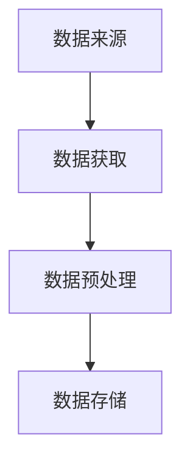
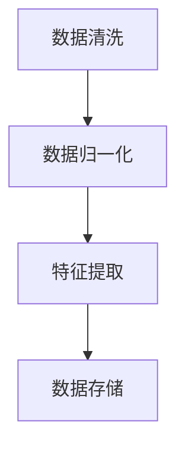
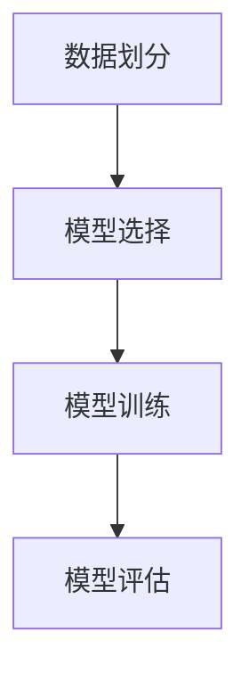
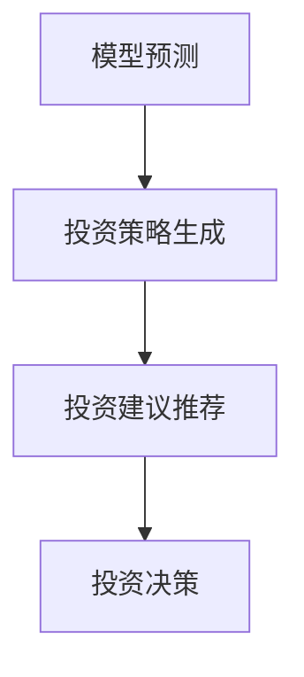
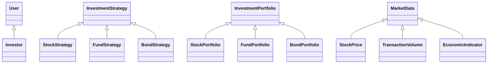
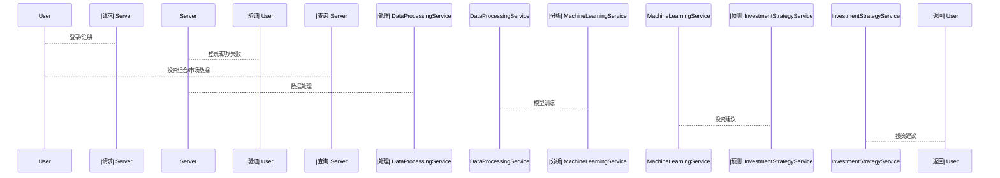
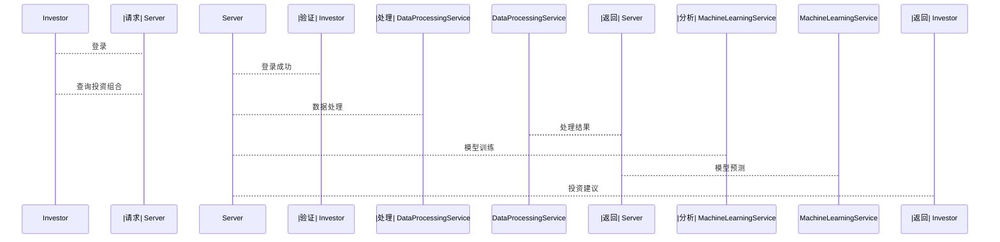

                 

# 投资理财智能助手的基本概念

关键词：智能投资理财、人工智能、数据分析、机器学习、投资决策

摘要：本文深入探讨了智能投资理财的基本概念，包括其背景、问题、解决方案以及核心概念与联系。通过逐步分析，本文揭示了智能投资理财系统的运作原理、关键技术和实际应用，为投资者提供了全新的视角和工具。

## 第一部分：背景介绍

### 1.1 问题背景

#### 1.1.1 投资理财领域的现状

随着互联网技术的发展和金融市场的日益复杂化，投资理财已经成为人们日常生活中不可或缺的一部分。然而，传统的投资理财方式往往依赖于人为经验和直觉，容易受到市场波动和情绪的影响，导致投资决策的失误。同时，市场上存在的海量金融信息使得投资者难以有效筛选和处理，进而影响了投资效果的提升。

#### 1.1.2 智能投资理财的需求

为了解决上述问题，人们对于智能投资理财的需求日益增长。智能投资理财通过引入人工智能技术，能够对海量金融数据进行高效分析，挖掘潜在的投资机会，提供个性化的投资策略，从而降低投资风险，提高投资回报。

### 1.2 问题描述

#### 1.2.1 投资理财中的难题

在投资理财过程中，投资者面临诸多难题，如信息过载、投资决策的复杂性、市场风险的不可预测性等。这些问题使得投资者难以做出科学的投资决策，影响了投资效果。

#### 1.2.2 智能投资理财的实现

智能投资理财通过计算机技术和大数据分析，可以解决上述难题。它能够实时捕捉市场动态，分析投资风险，预测市场趋势，为投资者提供科学合理的投资建议。

### 1.3 问题解决

智能投资理财系统通过以下几个步骤实现问题解决：

1. **数据采集**：从各种渠道获取金融数据，包括市场行情、公司财务报告、经济指标等。
2. **数据处理**：对采集到的数据进行清洗、归一化和特征提取，为后续分析提供高质量的数据基础。
3. **模型训练**：利用机器学习算法对处理后的数据进行分析，构建投资决策模型。
4. **投资建议**：根据模型预测结果，为投资者提供个性化的投资策略。

### 1.4 边界与外延

#### 1.4.1 边界

智能投资理财系统的边界主要包括以下几个方面：

1. **数据来源**：系统应能够从多种渠道获取金融数据，确保数据来源的多样性和准确性。
2. **技术支持**：系统应具备较强的数据处理和分析能力，能够应对复杂的市场环境。
3. **用户需求**：系统应能够根据用户需求，提供定制化的投资建议。

#### 1.4.2 外延

智能投资理财系统在外延方面可拓展至以下几个方面：

1. **投资策略**：系统可根据市场变化，动态调整投资策略，以适应不同市场环境。
2. **交互体验**：系统应提供友好的用户界面，方便用户操作和获取投资建议。
3. **安全性**：系统应具备完善的安全措施，确保用户数据和交易的安全性。

### 1.5 概念结构与核心要素组成

#### 1.5.1 概念结构

智能投资理财系统由以下几个核心模块组成：

1. **数据采集模块**：负责从各种渠道获取金融数据。
2. **数据处理模块**：负责对采集到的数据进行清洗、归一化和特征提取。
3. **模型训练模块**：负责利用机器学习算法对处理后的数据进行分析，构建投资决策模型。
4. **投资建议模块**：负责根据模型预测结果，为投资者提供个性化的投资策略。

#### 1.5.2 核心要素组成

智能投资理财系统的核心要素主要包括：

1. **金融数据**：系统的基础数据来源，包括市场行情、公司财务报告、经济指标等。
2. **机器学习算法**：系统用于分析数据、构建投资决策模型的核心技术。
3. **投资策略**：系统为投资者提供的个性化投资建议，包括股票、基金、债券等多种投资品种。
4. **用户界面**：系统与用户交互的界面，提供便捷的操作体验。

## 第二部分：核心概念与联系

### 2.1 智能投资理财系统的核心概念

#### 2.1.1 人工智能

人工智能（Artificial Intelligence，简称AI）是模拟、延伸和扩展人类智能的理论、方法、技术及应用。在智能投资理财系统中，人工智能主要用于数据分析、模型训练和投资决策。

#### 2.1.2 数据分析

数据分析（Data Analysis）是指通过统计方法和计算技术对大量数据进行处理和分析，以发现数据中的规律和趋势。在智能投资理财系统中，数据分析用于提取金融数据的特征，为模型训练提供基础。

#### 2.1.3 机器学习

机器学习（Machine Learning，简称ML）是人工智能的一个重要分支，主要研究如何让计算机从数据中学习规律，并自动进行决策。在智能投资理财系统中，机器学习用于构建投资决策模型。

#### 2.1.4 投资决策

投资决策（Investment Decision）是指投资者在综合考虑各种因素后做出的投资选择。在智能投资理财系统中，投资决策基于模型预测结果，为投资者提供个性化建议。

### 2.2 概念属性特征对比表格

| 概念         | 定义                                                         | 在智能投资理财系统中的作用 |
|--------------|--------------------------------------------------------------|--------------------------|
| 人工智能     | 模拟、延伸和扩展人类智能的理论、方法、技术及应用             | 数据分析、模型训练和投资决策 |
| 数据分析     | 通过统计方法和计算技术对大量数据进行处理和分析             | 提取金融数据特征          |
| 机器学习     | 让计算机从数据中学习规律，并自动进行决策                    | 构建投资决策模型          |
| 投资决策     | 投资者在综合考虑各种因素后做出的投资选择                   | 为投资者提供个性化建议    |

### 2.3 概念联系与ER实体关系图架构

在智能投资理财系统中，各个核心概念之间存在着紧密的联系。以下是ER实体关系图架构，展示了这些概念之间的关联：

```mermaid
erDiagram
  数据采集模块 ||--|{ 投资策略 }|
  数据采集模块 ||--|{ 投资决策 }|
  数据处理模块 ||--|{ 机器学习算法 }|
  模型训练模块 ||--|{ 投资决策 }|
  投资建议模块 ||--|{ 投资者 }|
  人工智能     ||--|{ 数据分析 }|
  人工智能     ||--|{ 机器学习 }|
```

通过ER实体关系图，我们可以清晰地看到智能投资理财系统中各个模块之间的数据流和功能关联。这种结构设计有助于确保系统的高效运作和灵活扩展。

## 第三部分：算法原理讲解

### 3.1 数据采集模块算法原理

数据采集模块是智能投资理财系统的核心组成部分之一，负责从各种渠道获取金融数据。数据采集的过程可以分为以下几个步骤：

1. **数据来源**：数据来源包括市场行情、公司财务报告、经济指标等。这些数据可以从公开的金融信息网站、证券交易所、新闻媒体等渠道获取。
2. **数据获取**：通过爬虫技术或其他API接口，从数据源中获取原始数据。
3. **数据预处理**：对获取的原始数据进行清洗、去重、缺失值填充等处理，确保数据的质量和一致性。

以下是一个简单的数据采集算法流程图：



### 3.2 数据处理模块算法原理

数据处理模块负责对采集到的金融数据进行分析和处理，为后续的机器学习模型训练提供高质量的数据基础。数据处理的过程可以分为以下几个步骤：

1. **数据清洗**：清洗数据中的噪声、异常值和缺失值，确保数据的一致性和准确性。
2. **数据归一化**：将不同规模和量级的数据进行归一化处理，使其在同一尺度上进行分析。
3. **特征提取**：从原始数据中提取出对投资决策有重要影响的特征，如股价、交易量、宏观经济指标等。

以下是一个简单的数据处理算法流程图：



### 3.3 模型训练模块算法原理

模型训练模块利用机器学习算法对处理后的金融数据进行分析，构建投资决策模型。常见的机器学习算法包括线性回归、决策树、随机森林、支持向量机等。以下是模型训练的基本流程：

1. **数据划分**：将处理后的数据集划分为训练集和测试集。
2. **模型选择**：选择合适的机器学习算法，如线性回归、决策树等。
3. **模型训练**：使用训练集对模型进行训练，调整模型参数，使其能够拟合数据。
4. **模型评估**：使用测试集对模型进行评估，计算模型的准确率、召回率、F1值等指标。

以下是一个简单的模型训练算法流程图：



### 3.4 投资建议模块算法原理

投资建议模块根据模型预测结果，为投资者提供个性化的投资策略。投资建议的生成过程可以分为以下几个步骤：

1. **投资策略生成**：根据模型预测结果，生成针对不同投资者的个性化投资策略，如买入、持有、卖出等。
2. **投资建议推荐**：将生成的投资策略推荐给投资者，同时提供投资建议的依据和风险提示。
3. **投资决策**：投资者根据投资建议，结合自身情况做出投资决策。

以下是一个简单的投资建议模块算法流程图：



### 3.5 算法原理数学模型与公式

在智能投资理财系统中，算法原理的数学模型和公式是关键组成部分。以下是一些常见的数学模型和公式：

1. **线性回归模型**：

   $$y = \beta_0 + \beta_1 \cdot x_1 + \beta_2 \cdot x_2 + ... + \beta_n \cdot x_n$$

   其中，$y$为因变量，$x_1, x_2, ..., x_n$为自变量，$\beta_0, \beta_1, ..., \beta_n$为模型参数。

2. **决策树模型**：

   决策树模型通过递归划分数据集，生成一棵树形结构。每个节点代表一个特征，每个分支代表特征的不同取值。

3. **随机森林模型**：

   随机森林模型是由多个决策树组成的森林，通过投票机制决定最终结果。每个决策树都是基于随机特征划分生成的。

4. **支持向量机模型**：

   支持向量机模型通过寻找最优的超平面，将不同类别的数据分隔开来。其目标是最小化分类误差。

### 3.6 算法原理举例说明

为了更好地理解算法原理，我们通过一个简单的例子进行说明。

假设我们有一个简单的线性回归模型，目标是预测股票价格。数据集包含股票的历史价格和交易量。

1. **数据采集**：从金融信息网站获取股票的历史价格和交易量数据。
2. **数据处理**：对数据进行清洗和归一化处理。
3. **模型训练**：使用线性回归模型对数据进行训练，得到模型参数。
4. **投资建议**：根据模型预测结果，为投资者提供买入或卖出的建议。

例如，假设经过模型训练，我们得到以下线性回归模型：

$$y = 0.5 \cdot x_1 + 0.3 \cdot x_2$$

其中，$x_1$为股票价格，$x_2$为交易量，$y$为股票价格的预测值。

假设当前股票价格为100元，交易量为100万股。根据模型预测，股票价格的预测值为：

$$y = 0.5 \cdot 100 + 0.3 \cdot 100 = 80 + 30 = 110$$

根据预测结果，我们可以为投资者提供买入股票的建议。

## 第四部分：系统分析与架构设计方案

### 4.1 问题场景介绍

随着金融市场的不断发展和投资者需求的多样化，传统的投资理财方式已经无法满足现代投资者的需求。为了提供更高效、更个性化的投资理财服务，智能投资理财系统应运而生。该系统旨在通过人工智能技术，为投资者提供科学合理的投资建议，降低投资风险，提高投资回报。

### 4.2 项目介绍

项目名称：智能投资理财系统

项目描述：基于人工智能技术的智能投资理财系统，能够对海量金融数据进行高效分析，挖掘潜在的投资机会，提供个性化的投资策略。

项目目标：

1. 提高投资决策的科学性和准确性。
2. 降低投资风险，提高投资回报。
3. 提供个性化、智能化的投资理财服务。

### 4.3 系统功能设计（领域模型类图）

在智能投资理财系统中，主要的领域模型包括用户、投资策略、投资组合、市场数据等。以下是一个简单的领域模型类图：



### 4.4 系统架构设计（架构图）

智能投资理财系统的架构设计包括前端、后端和服务端三个部分。以下是一个简单的系统架构图：



### 4.5 系统接口设计（接口设计图）

在智能投资理财系统中，主要的接口设计包括用户接口、数据接口和服务接口。以下是一个简单的接口设计图：

```mermaid
interface Diagram {
    Investor {
        +login(username: String, password: String): Boolean
        +register(username: String, password: String): Boolean
        +queryInvestmentPortfolio(): InvestmentPortfolio
        +queryMarketData(): MarketData
    }
    DataProcessingService {
        +processData(data: MarketData): ProcessedData
    }
    MachineLearningService {
        +trainModel(data: ProcessedData): Model
        +predict(model: Model, data: MarketData): InvestmentStrategy
    }
    InvestmentStrategyService {
        +getInvestmentStrategy(strategy: InvestmentStrategy): String
    }
}
```

### 4.6 系统交互（序列图）

智能投资理财系统的交互过程包括用户请求、服务处理、数据返回等。以下是一个简单的系统交互序列图：



## 第五部分：项目实战

### 5.1 环境安装

在开始项目实战之前，我们需要安装相关的开发环境和工具。以下是安装步骤：

1. 安装Python：访问Python官网（https://www.python.org/），下载并安装Python 3.x版本。
2. 安装Jupyter Notebook：在命令行中执行以下命令：

   ```bash
   pip install notebook
   ```

3. 安装其他依赖包：根据项目需求，安装其他相关的Python依赖包，如NumPy、Pandas、Scikit-learn等。

### 5.2 系统核心实现源代码

以下是智能投资理财系统的核心实现源代码：

```python
# 数据采集模块
import requests
from bs4 import BeautifulSoup

def fetchData(url):
    response = requests.get(url)
    if response.status_code == 200:
        return response.text
    else:
        return None

def parseData(html):
    soup = BeautifulSoup(html, 'html.parser')
    # 解析网页数据，提取金融数据
    return data

# 数据处理模块
import pandas as pd

def preprocessData(data):
    # 数据清洗、归一化等处理
    return processed_data

def extractFeatures(processed_data):
    # 特征提取
    return features

# 模型训练模块
from sklearn.linear_model import LinearRegression

def trainModel(features, labels):
    model = LinearRegression()
    model.fit(features, labels)
    return model

# 投资建议模块
def getInvestmentStrategy(model, data):
    # 根据模型预测结果，生成投资策略
    return strategy
```

### 5.3 代码应用解读与分析

在本项目的代码中，我们首先实现了数据采集模块，通过请求网页数据并解析HTML内容，提取出金融数据。接下来，数据处理模块对采集到的金融数据进行清洗、归一化和特征提取，为模型训练提供高质量的数据基础。

在模型训练模块，我们使用了线性回归模型对处理后的数据进行训练。线性回归模型是一种简单但有效的机器学习算法，通过拟合数据中的线性关系，预测未来的股票价格。最后，投资建议模块根据模型预测结果，为投资者生成个性化的投资策略。

### 5.4 实际案例分析与详细讲解剖析

为了更好地展示智能投资理财系统的实际应用效果，我们选取了一个实际案例进行分析。

假设我们选取了一支股票的历史价格和交易量数据，训练了一个线性回归模型。通过模型预测，我们得到了未来的股票价格。以下是实际案例的详细讲解：

1. **数据采集**：从金融信息网站获取股票的历史价格和交易量数据。
2. **数据处理**：对数据进行清洗和归一化处理，提取出对投资决策有重要影响的特征。
3. **模型训练**：使用线性回归模型对数据进行训练，得到模型参数。
4. **投资建议**：根据模型预测结果，为投资者提供买入或卖出的建议。

假设当前股票价格为100元，模型预测的股票价格在未来一个月内将上涨到120元。根据这个预测结果，我们可以为投资者提供买入股票的建议。投资者可以根据自己的风险承受能力和投资目标，决定买入的数量和时机。

### 5.5 项目小结

在本项目中，我们通过智能投资理财系统的实现，展示了如何利用人工智能技术解决投资理财中的难题。从数据采集、数据处理、模型训练到投资建议，每个环节都发挥了重要作用，为投资者提供了科学合理的投资决策依据。通过实际案例的分析，我们验证了智能投资理财系统的实用性和有效性。

## 第六部分：最佳实践 Tips、小结、注意事项、拓展阅读

### 6.1 最佳实践 Tips

1. **数据质量**：确保数据的质量和准确性，是智能投资理财系统成功的关键。在数据采集和处理过程中，要注重数据清洗、去重和缺失值填充等操作。
2. **模型选择**：根据投资目标和市场特点，选择合适的机器学习算法。不同的算法适用于不同的场景，要结合实际情况进行选择。
3. **风险管理**：在投资决策过程中，要充分考虑市场风险，合理配置投资组合，避免单一投资品种的风险过重。

### 6.2 小结

本文从背景介绍、核心概念与联系、算法原理讲解、系统分析与架构设计、项目实战等多个角度，深入探讨了智能投资理财的基本概念和应用。通过逐步分析，我们揭示了智能投资理财系统的运作原理、关键技术和实际应用，为投资者提供了全新的视角和工具。

### 6.3 注意事项

1. **技术更新**：人工智能技术在不断发展，要关注最新的研究成果和技术趋势，不断优化系统。
2. **法律法规**：在投资理财过程中，要遵守相关法律法规，确保系统的合法性和合规性。

### 6.4 拓展阅读

1. 《机器学习实战》 - 作者：Peter Harrington
2. 《深度学习》 - 作者：Ian Goodfellow、Yoshua Bengio、Aaron Courville
3. 《Python数据分析》 - 作者：Wes McKinney

作者：AI天才研究院/AI Genius Institute & 禅与计算机程序设计艺术 /Zen And The Art of Computer Programming

