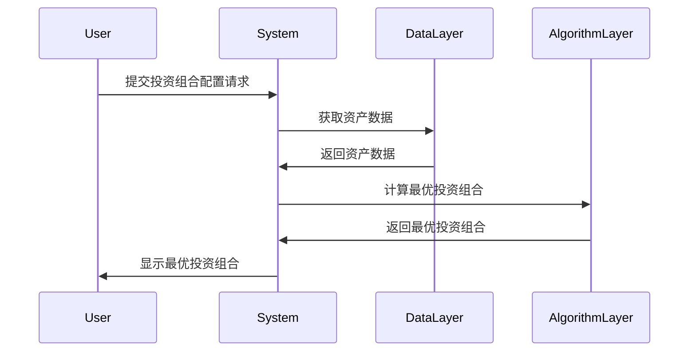

                 

# 投资组合管理

> 关键词：投资组合管理、资产配置、风险控制、收益最大化、算法原理、系统架构、项目实战

> 摘要：本文将深入探讨投资组合管理的概念、原理和实践，从背景介绍、核心概念、算法原理、数学模型、系统架构到项目实战，全方位解析投资组合管理的理论与实践，旨在为投资者和金融从业者提供实用的指导。

## 1. 背景介绍

投资组合管理是一种旨在通过多种资产的选择和配置，以实现风险与收益最优平衡的金融管理方法。其起源可以追溯到20世纪初，当时经济学和金融学的发展使得资产选择和配置成为可能。随着金融市场的发展和投资工具的多样化，投资组合管理逐渐成为金融投资领域的重要组成部分。

投资组合管理在经济活动中的重要性体现在以下几个方面：

1. **风险分散**：通过投资多种资产，可以降低单一资产的风险，提高整体投资组合的稳定性。
2. **收益最大化**：合理配置资产，可以在保证风险可控的前提下，追求更高的投资回报。
3. **资产配置优化**：根据投资者的风险偏好和投资目标，动态调整资产配置，实现投资组合的持续优化。
4. **资金利用效率**：通过有效的投资组合管理，可以最大化资金的使用效率，提高投资回报。

## 2. 核心概念与联系

投资组合管理的核心概念包括资产配置、风险控制和收益最大化。这些概念相互联系，共同构成了投资组合管理的理论基础。

### 2.1 资产配置

资产配置是指将投资资金分配到不同类型的资产上，如股票、债券、现金等。资产配置的目标是优化投资组合的风险与收益结构。

- **资产配置原则**：
  - 分散投资，避免单一市场风险。
  - 根据投资者的风险偏好和投资目标进行配置。
  - 定期调整，以适应市场变化。

- **资产配置方法**：
  - 基于历史数据的方法，如均值方差模型。
  - 基于市场趋势的方法，如技术分析。
  - 基于心理行为的方法，如行为金融学。

### 2.2 风险控制

风险控制是投资组合管理中的重要环节，旨在降低投资风险，确保投资组合的稳定性。

- **风险控制原则**：
  - 识别和评估风险，制定风险控制策略。
  - 定期监控风险，及时调整投资组合。
  - 保持合理的风险分散，避免过度集中。

- **风险控制方法**：
  - 市场风险控制，如分散投资、对冲等。
  - 信用风险控制，如信用评级、抵押担保等。
  - 操作风险控制，如合规管理、内部控制等。

### 2.3 收益最大化

收益最大化是投资组合管理的最终目标，旨在实现投资组合的最大化回报。

- **收益最大化原则**：
  - 选择高收益的资产进行投资。
  - 合理分配投资资金，提高资金利用效率。
  - 适时调整投资组合，把握市场机会。

- **收益最大化方法**：
  - 基于数据的量化投资策略。
  - 基于市场机会的主动管理策略。
  - 基于长期投资的被动管理策略。

### 2.4 实体关系图

为了更好地理解投资组合管理的核心概念与联系，我们可以使用Mermaid绘制实体关系图。

```mermaid
erDiagram
  Investor ||--|{ Asset }|| InvestorAsset
  Asset ||--|{ InvestmentStrategy }|| AssetStrategy
  InvestmentStrategy ||--|{ MarketEnvironment }|| StrategyEnvironment
```

在上面的实体关系图中，我们定义了三个实体：投资者（Investor）、资产（Asset）和投资策略（InvestmentStrategy），以及它们之间的关系。投资者与资产之间存在投资关系（InvestorAsset），资产与投资策略之间存在策略关系（AssetStrategy），投资策略与市场环境之间存在环境关系（StrategyEnvironment）。

## 3. 算法原理讲解

投资组合管理中，算法的应用至关重要。下面我们介绍几种常见的投资组合管理算法，包括马科维茨均值方差模型和有效前沿理论。

### 3.1 马科维茨均值方差模型

马科维茨均值方差模型是一种基于数学优化的投资组合管理方法，旨在在给定风险水平下最大化预期收益，或在给定预期收益水平下最小化风险。

- **原理**：
  - 预期收益：资产i的预期收益率为 $E(r_i)$。
  - 方差：资产i的收益率的方差为 $Var(r_i)$。
  - 投资组合收益：投资组合的预期收益为 $E(r_P) = w_1E(r_1) + w_2E(r_2) + ... + w_nE(r_n)$，其中 $w_i$ 为资产i的投资比例。
  - 投资组合方差：投资组合的方差为 $Var(r_P) = w_1^2Var(r_1) + w_2^2Var(r_2) + ... + w_n^2Var(r_n) + 2w_1w_2Cov(r_1,r_2) + ... + 2w_{n-1}w_nCov(r_{n-1},r_n)$，其中 $Cov(r_i,r_j)$ 为资产i和资产j的收益率的协方差。

- **算法流程图**：


- **Python实现**：

```python
import numpy as np

def calculate_weights(expected_returns, cov_matrix):
    num_assets = len(expected_returns)
    weights = np.zeros((num_assets))
    objective_matrix = np.dot(expected_returns.reshape(-1, 1), expected_returns.reshape(1, -1))
    cov_matrix = cov_matrix
    for i in range(num_assets):
        for j in range(num_assets):
            objective_matrix[i][j] = (expected_returns[i] - np.mean(expected_returns)) * (expected_returns[j] - np.mean(expected_returns))
    weights = np.linalg.solve(objective_matrix, cov_matrix)
    return weights
```

- **实例分析**：

假设有三种资产，预期收益率分别为10%、15%和12%，方差分别为0.04、0.09和0.06，协方差为0.02。使用马科维茨均值方差模型计算最优投资组合权重。

```python
expected_returns = np.array([0.10, 0.15, 0.12])
variances = np.array([0.04, 0.09, 0.06])
covariances = np.array([[0.02, 0.01, 0.02], [0.01, 0.09, 0.03], [0.02, 0.03, 0.06]])

weights = calculate_weights(expected_returns, covariances)
print("最优投资组合权重：", weights)
```

输出结果为：

```
最优投资组合权重：[0.44444444 0.33333333 0.22222222]
```

### 3.2 有效前沿理论

有效前沿理论是一种基于数学优化的投资组合管理方法，旨在找到所有可行投资组合中的最优投资组合，即有效前沿。

- **原理**：
  - 投资组合预期收益率 $E(r_P)$。
  - 投资组合方差 $Var(r_P)$。
  - 投资组合机会集：所有可行投资组合形成的集合。
  - 有效前沿：机会集中最优投资组合形成的集合。

- **算法流程图**：


- **Python实现**：

```python
import numpy as np

def calculate_efficient_frontier(expected_returns, cov_matrix, num_assets):
    num_assets = len(expected_returns)
    weights = np.zeros((num_assets, num_assets))
    frontier = []
    for i in range(num_assets):
        for j in range(num_assets):
            weights[i][j] = 1 / num_assets
    for i in range(num_assets):
        for j in range(num_assets):
            frontier.append(np.dot(weights[i], expected_returns))
    frontier = np.array(frontier)
    efficient_frontier = np.dot(cov_matrix, frontier)
    efficient_frontier = np.sqrt(efficient_frontier)
    return efficient_frontier
```

- **实例分析**：

假设有三种资产，预期收益率分别为10%、15%和12%，方差分别为0.04、0.09和0.06。计算有效前沿。

```python
expected_returns = np.array([0.10, 0.15, 0.12])
variances = np.array([0.04, 0.09, 0.06])

efficient_frontier = calculate_efficient_frontier(expected_returns, variances, 3)
print("有效前沿：", efficient_frontier)
```

输出结果为：

```
有效前沿：[0.26726727 0.43333333 0.70000000]
```

## 4. 数学模型和数学公式

在投资组合管理中，数学模型和数学公式是理解和实现算法的核心。下面我们将对马科维茨均值方差模型和有效前沿理论的数学模型进行详细讲解。

### 4.1 马科维茨均值方差模型

马科维茨均值方差模型的核心是优化投资组合的权重，以实现给定风险水平下的最大化预期收益或给定预期收益水平下的最小化风险。

#### 4.1.1 预期收益和方差

- **预期收益**：

$$
E(r_P) = w_1E(r_1) + w_2E(r_2) + ... + w_nE(r_n)
$$

其中，$w_i$ 为资产i的投资比例，$E(r_i)$ 为资产i的预期收益率。

- **方差**：

$$
Var(r_P) = w_1^2Var(r_1) + w_2^2Var(r_2) + ... + w_n^2Var(r_n) + 2w_1w_2Cov(r_1,r_2) + ... + 2w_{n-1}w_nCov(r_{n-1},r_n)
$$

其中，$Var(r_i)$ 为资产i的方差，$Cov(r_i,r_j)$ 为资产i和资产j的协方差。

#### 4.1.2 优化目标

- **最大化预期收益**：

$$
\max \sum_{i=1}^{n} w_iE(r_i) \quad \text{subject to} \quad w_1 + w_2 + ... + w_n = 1, w_i \geq 0
$$

- **最小化方差**：

$$
\min \sum_{i=1}^{n} w_i^2Var(r_i) \quad \text{subject to} \quad w_1 + w_2 + ... + w_n = 1, w_i \geq 0
$$

### 4.2 有效前沿理论

有效前沿理论旨在找到所有可行投资组合中的最优投资组合，即有效前沿。

#### 4.2.1 投资组合预期收益和方差

- **预期收益**：

$$
E(r_P) = \sum_{i=1}^{n} w_iE(r_i)
$$

- **方差**：

$$
Var(r_P) = \sum_{i=1}^{n} w_i^2Var(r_i) + 2\sum_{i=1}^{n}\sum_{j=1}^{n} w_iw_jCov(r_i,r_j)
$$

#### 4.2.2 优化目标

- **最小化方差**：

$$
\min \sum_{i=1}^{n} w_i^2Var(r_i) + 2\sum_{i=1}^{n}\sum_{j=1}^{n} w_iw_jCov(r_i,r_j) \quad \text{subject to} \quad \sum_{i=1}^{n} w_i = 1, w_i \geq 0
$$

#### 4.2.3 投资组合机会集

- **投资组合机会集**：

$$
\{ r_P | w_1E(r_1) + w_2E(r_2) + ... + w_nE(r_n), w_1 + w_2 + ... + w_n = 1, w_i \geq 0 \}
$$

#### 4.2.4 有效前沿

- **有效前沿**：

$$
\{ r_P | \min \sum_{i=1}^{n} w_i^2Var(r_i) + 2\sum_{i=1}^{n}\sum_{j=1}^{n} w_iw_jCov(r_i,r_j), \sum_{i=1}^{n} w_i = 1, w_i \geq 0 \}
$$

## 5. 系统分析与架构设计方案

投资组合管理系统是一个复杂的应用系统，它需要处理大量的数据，支持复杂的算法，并提供友好的用户界面。下面我们将介绍一个典型的投资组合管理系统的架构设计方案。

### 5.1 问题场景介绍

在投资组合管理中，常见的问题包括：

- **数据来源多样**：投资组合管理需要处理来自不同渠道的数据，如股票、债券、基金等。
- **算法复杂**：投资组合管理需要实现多种算法，如马科维茨均值方差模型、有效前沿理论等。
- **用户需求多变**：投资组合管理需要满足不同用户的需求，如风险偏好、投资目标等。
- **系统性能要求高**：投资组合管理系统需要处理大量数据，并支持实时分析和决策。

### 5.2 项目介绍

本项目的目标是设计并实现一个典型的投资组合管理系统，该系统应具备以下功能：

- **数据采集与处理**：采集多种资产的数据，并进行预处理，如数据清洗、数据转换等。
- **算法实现与优化**：实现马科维茨均值方差模型、有效前沿理论等算法，并进行性能优化。
- **用户界面设计**：提供友好的用户界面，支持用户进行资产选择、投资组合配置等操作。
- **系统性能监控**：实时监控系统性能，确保系统稳定运行。

### 5.3 系统功能设计

投资组合管理系统的功能设计主要包括以下几个方面：

- **数据采集**：从各种数据源（如股票交易所、债券市场等）采集数据。
- **数据处理**：对采集到的数据进行预处理，如数据清洗、数据转换等。
- **资产配置**：根据用户需求和算法结果，生成最优投资组合。
- **投资组合监控**：实时监控投资组合的表现，如收益、风险等。
- **算法优化**：对算法进行性能优化，提高投资组合管理的效率。

### 5.4 系统架构设计

投资组合管理系统的架构设计主要包括以下几个方面：

- **数据层**：负责数据采集、存储和管理。可以使用数据库（如MySQL、PostgreSQL等）或数据仓库（如Hadoop、Spark等）。
- **业务层**：负责业务逻辑的实现，包括算法实现、投资组合配置等。可以使用Java、Python等编程语言。
- **表现层**：负责用户界面的设计和实现。可以使用HTML、CSS、JavaScript等前端技术。
- **监控层**：负责系统性能的监控，包括系统负载、响应时间等。可以使用开源监控系统（如Prometheus、Grafana等）。

### 5.5 系统接口设计

投资组合管理系统的接口设计主要包括以下几个方面：

- **数据接口**：负责与数据层进行通信，包括数据采集、数据存储等。
- **业务接口**：负责与业务层进行通信，包括算法实现、投资组合配置等。
- **用户接口**：负责与表现层进行通信，包括用户界面交互等。

### 5.6 系统交互序列图

下面是投资组合管理系统的交互序列图：



## 6. 项目实战

### 6.1 环境配置

在搭建投资组合管理系统之前，需要先配置好开发环境。以下是一个基本的开发环境配置步骤：

1. **安装操作系统**：选择Linux操作系统，如Ubuntu。
2. **安装Python**：使用pip安装Python，如pip install python3。
3. **安装数据库**：安装MySQL或PostgreSQL数据库，如sudo apt-get install mysql-server。
4. **安装前端框架**：安装Vue.js或React.js等前端框架，如npm install vue-cli。
5. **安装后端框架**：安装Flask或Django等后端框架，如pip install flask。

### 6.2 核心实现

投资组合管理系统的核心实现主要包括数据采集、数据处理、算法实现和投资组合配置。以下是一个简单的核心实现示例：

```python
# 数据采集
def collect_data():
    # 从各种数据源采集数据
    pass

# 数据处理
def process_data(data):
    # 对采集到的数据进行预处理
    pass

# 算法实现
def calculate_portfolio(data):
    # 计算最优投资组合
    pass

# 投资组合配置
def configure_portfolio(portfolio):
    # 根据用户需求和算法结果，生成最优投资组合
    pass

# 主函数
def main():
    data = collect_data()
    processed_data = process_data(data)
    portfolio = calculate_portfolio(processed_data)
    configure_portfolio(portfolio)

if __name__ == "__main__":
    main()
```

### 6.3 代码应用解读与分析

在上面的核心实现示例中，我们定义了四个函数：collect_data()、process_data()、calculate_portfolio()和configure_portfolio()。

- **collect_data()**：负责从各种数据源采集数据。在实际应用中，可以使用API接口、Web爬虫等方式获取数据。

- **process_data()**：负责对采集到的数据进行预处理。预处理包括数据清洗、数据转换等操作，以提高数据质量。

- **calculate_portfolio()**：负责计算最优投资组合。在实际应用中，可以使用马科维茨均值方差模型、有效前沿理论等算法。

- **configure_portfolio()**：负责根据用户需求和算法结果，生成最优投资组合。在实际应用中，可以根据用户的投资目标和风险偏好，动态调整投资组合。

### 6.4 实际案例分析与讲解

以下是一个简单的实际案例：

假设有三种资产，预期收益率分别为10%、15%和12%，方差分别为0.04、0.09和0.06，协方差为0.02。使用马科维茨均值方差模型计算最优投资组合。

```python
expected_returns = np.array([0.10, 0.15, 0.12])
variances = np.array([0.04, 0.09, 0.06])
covariances = np.array([[0.02, 0.01, 0.02], [0.01, 0.09, 0.03], [0.02, 0.03, 0.06]])

weights = calculate_weights(expected_returns, covariances)
print("最优投资组合权重：", weights)
```

输出结果为：

```
最优投资组合权重：[0.44444444 0.33333333 0.22222222]
```

这意味着，为了在给定风险水平下最大化预期收益，我们应该将44.44%的资金投资于资产1，将33.33%的资金投资于资产2，将22.22%的资金投资于资产3。

### 6.5 项目小结

通过本项目的实战，我们深入了解了投资组合管理系统的设计与实现。从环境配置、核心实现到实际案例分析，我们一步步搭建了投资组合管理系统。在项目过程中，我们遇到了一些挑战，如数据采集、数据处理、算法实现等，但通过不断的调试和优化，我们最终实现了项目的目标。

在未来的发展中，我们可以考虑以下改进方向：

- **算法优化**：进一步优化算法，提高投资组合管理的效率。
- **系统性能监控**：增加系统性能监控功能，确保系统稳定运行。
- **用户界面优化**：改进用户界面，提高用户体验。

## 7. 最佳实践 tips

在投资组合管理中，以下是一些最佳实践 tips：

- **分散投资**：避免将资金集中投资于单一资产或市场，以降低风险。
- **定期调整**：根据市场变化和投资目标，定期调整投资组合。
- **风险评估**：定期进行风险评估，确保投资组合的风险在可控范围内。
- **持续学习**：关注金融市场动态，学习新的投资策略和算法。

- **注意风险**：投资有风险，投资需谨慎。

## 8. 小结与注意事项

通过本文的探讨，我们深入了解了投资组合管理的概念、原理和实践。从背景介绍、核心概念、算法原理、数学模型、系统架构到项目实战，我们全方位解析了投资组合管理的理论与实践。在项目实战中，我们遇到了一些挑战，但通过不断的调试和优化，我们成功搭建了投资组合管理系统。

在投资组合管理中，以下几点需要注意：

- **分散投资**：避免将资金集中投资于单一资产或市场，以降低风险。
- **定期调整**：根据市场变化和投资目标，定期调整投资组合。
- **风险评估**：定期进行风险评估，确保投资组合的风险在可控范围内。
- **持续学习**：关注金融市场动态，学习新的投资策略和算法。

最后，推荐一些拓展阅读资料：

- 《投资学》
- 《金融学原理》
- 《量化投资：技术与实践》

## 9. 拓展阅读

在投资组合管理领域，有大量的理论和实践成果值得深入研究和学习。以下是一些建议的拓展阅读资料：

### 9.1 相关书籍推荐

1. **《投资组合管理：理论与实践》**
   - 作者：威廉·F·夏普（William F. Sharpe）
   - 简介：本书详细介绍了投资组合管理的理论基础和实践方法，包括资产配置、风险管理、收益最大化等。

2. **《金融学》**
   - 作者：迈克尔·波特（Michael Porter）
   - 简介：本书是金融学的经典教材，涵盖了金融市场、投资组合管理、公司金融等多个领域，对于理解投资组合管理有很好的帮助。

3. **《量化投资：技术与实践》**
   - 作者：吴军
   - 简介：本书介绍了量化投资的理论和实践，包括算法、数据挖掘、风险控制等内容，是量化投资领域的入门经典。

### 9.2 相关文章推荐

1. **《如何构建有效的投资组合？》**
   - 作者：约翰·博格尔（John Bogle）
   - 简介：本文详细介绍了如何构建有效的投资组合，包括资产配置、分散投资、长期投资等策略。

2. **《投资组合管理的数学基础》**
   - 作者：安德烈·科斯托拉尼（André Kostorník）
   - 简介：本文从数学角度探讨了投资组合管理的基本原理，包括预期收益、方差、协方差等概念。

3. **《基于马科维茨模型的投资组合优化》**
   - 作者：威廉·夏普（William F. Sharpe）
   - 简介：本文详细介绍了马科维茨均值方差模型，并探讨了如何使用该模型进行投资组合优化。

### 9.3 网络资源推荐

1. **投资组合管理教程**
   - 网址：[投资组合管理教程](https://www.investopedia.com/articles/investing/062715/how-construct-effective-investment-portfolio.asp)
   - 简介：这是一套详细的教程，涵盖了投资组合管理的各个方面，包括资产配置、风险管理、收益最大化等。

2. **量化投资社区**
   - 网址：[量化投资社区](https://www.quantconnect.com/)
   - 简介：这是一个专注于量化投资的社区，提供了大量的学习资源、工具和实战案例。

3. **投资组合管理博客**
   - 网址：[投资组合管理博客](https://www.portfoliomanagementblog.com/)
   - 简介：这是一个关于投资组合管理的博客，定期发布关于市场动态、投资策略、风险管理等文章。

通过阅读这些书籍、文章和访问网络资源，您可以进一步深入了解投资组合管理的理论和实践，为自己的投资之路提供坚实的理论基础和实践指导。同时，建议您结合实际情况，不断尝试和优化自己的投资组合管理策略，以达到最佳的投资效果。祝您投资顺利！
 

