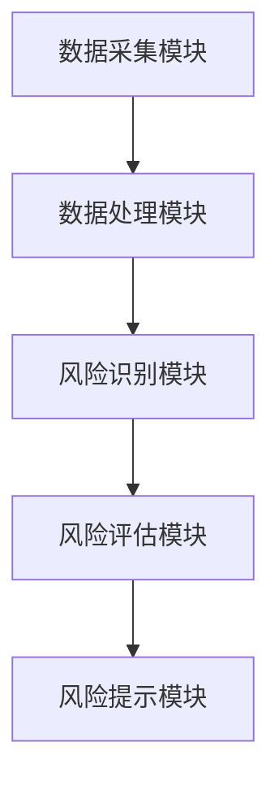

                 

# 投资风险提示系统

## 关键词

- 投资风险管理
- 数据挖掘
- 机器学习
- 风险识别
- 风险评估
- 分布式架构

## 摘要

本文旨在探讨投资风险提示系统，介绍其背景、问题、解决方法、应用范围、核心概念及其联系。通过分析主流投资风险提示系统的架构，深入讲解其系统分析与架构设计方案，并结合实际项目实战，详细剖析系统核心实现与代码应用。本文旨在为读者提供全面、易懂的投资风险提示系统指南，帮助投资者提高投资决策的准确性和安全性。

## 背景介绍

### 第一部分：投资风险提示系统的概述

### 1.1 问题背景

在当今金融市场中，投资风险具有多样性和复杂性。投资者不仅需要关注市场波动，还要应对政策变化、市场供需关系以及各类潜在风险。随着金融科技的不断发展，投资风险提示系统应运而生，成为投资者决策的重要辅助工具。这类系统能够实时监控市场动态，识别潜在风险，并提供预警信息，帮助投资者做出更为明智的投资决策。

### 1.2 问题描述

投资风险提示系统的核心任务是识别和评估投资过程中的各种风险，并将结果以直观的方式呈现给投资者。这些风险主要包括：

#### 1.2.1 市场风险

市场风险是由于市场波动、宏观经济环境变化等原因导致的投资损失风险。例如，股市、汇率、利率等市场指标的波动，都可能导致投资者的资产价值发生剧烈变化。

#### 1.2.2 信用风险

信用风险是由于债务人违约、信用等级降低等原因导致的投资损失风险。在债券、基金等投资产品中，信用风险尤为重要。

#### 1.2.3 操作风险

操作风险是由于内部管理问题、人为错误等原因导致的投资损失风险。在投资过程中，任何操作失误或管理疏漏都可能导致损失。

### 1.3 问题解决

为了解决上述问题，投资风险提示系统采用了以下方法：

#### 1.3.1 数据采集

系统从各类数据源（如金融市场数据、信用评级数据、操作日志数据等）采集相关数据，为后续分析和预警提供基础。

#### 1.3.2 数据处理

系统对采集到的数据进行清洗、转换和整合，确保数据的准确性和一致性。

#### 1.3.3 风险识别

系统利用数据挖掘、机器学习等技术，对数据进行分析，识别潜在的风险因素。

#### 1.3.4 风险评估

系统对识别出的风险因素进行评估，确定风险程度和影响范围。

#### 1.3.5 风险提示

系统将评估结果以图表、文字等形式直观地呈现给投资者，帮助投资者做出明智的投资决策。

### 1.4 边界与外延

投资风险提示系统的应用范围包括但不限于股票、债券、基金、外汇等金融市场。同时，系统还可根据投资者需求，扩展到其他投资领域。

### 1.5 概念结构与核心要素组成

投资风险提示系统的核心概念包括：

#### 1.5.1 投资风险

投资风险是指投资者在投资过程中可能面临的损失风险，包括市场风险、信用风险和操作风险。

#### 1.5.2 投资风险提示系统

投资风险提示系统是一种通过数据采集、数据处理、风险识别、风险评估和风险提示等模块，为投资者提供风险预警服务的系统。

系统的主要核心要素包括：

#### 1.5.2.1 数据采集模块

数据采集模块负责从各类数据源采集相关数据。

#### 1.5.2.2 数据处理模块

数据处理模块负责对采集到的数据进行清洗、转换和整合。

#### 1.5.2.3 风险识别模块

风险识别模块负责利用数据挖掘、机器学习等技术，对数据进行分析，识别潜在的风险因素。

#### 1.5.2.4 风险评估模块

风险评估模块负责对识别出的风险因素进行评估，确定风险程度和影响范围。

#### 1.5.2.5 风险提示模块

风险提示模块负责将评估结果以图表、文字等形式直观地呈现给投资者。

### 1.6 核心概念与联系

投资风险提示系统的核心概念包括投资风险和投资风险提示系统。投资风险是系统需要识别和评估的对象，而投资风险提示系统则是实现这一目标的技术手段。两者之间的联系在于：

- 投资风险是投资风险提示系统需要解决的核心问题。
- 投资风险提示系统通过数据采集、数据处理、风险识别、风险评估和风险提示等模块，实现对投资风险的监控和预警。

### 1.7 主流投资风险提示系统

主流投资风险提示系统通常采用分布式架构，包括数据采集、数据处理、风险识别、风险评估和风险提示等模块。以下是一个典型的系统架构：

```
+-----------------+
|  投资风险提示系统  |
+-----------------+
       |
       v
+-----------------+
|  数据采集模块   |
+-----------------+
       |
       v
+-----------------+
|  数据处理模块   |
+-----------------+
       |
       v
+-----------------+
|  风险识别模块   |
+-----------------+
       |
       v
+-----------------+
|  风险评估模块   |
+-----------------+
       |
       v
+-----------------+
|  风险提示模块   |
+-----------------+
```

## 核心概念与联系

### 1.6.1 投资风险

投资风险是指投资者在投资过程中可能面临的损失风险。投资风险可以分为以下几种类型：

#### 1.6.1.1 市场风险

市场风险主要受宏观经济环境、政策变化、市场供需关系等因素的影响。例如，股市、汇率、利率等市场指标的波动都可能引发市场风险。

#### 1.6.1.2 信用风险

信用风险主要受债务人信用状况、市场信用环境等因素的影响。例如，债券发行方违约、信用评级下降等都可能导致信用风险。

#### 1.6.1.3 操作风险

操作风险主要受内部管理、人为错误等因素的影响。例如，投资操作失误、风险管理不当等都可能导致操作风险。

### 1.6.2 投资风险提示系统

投资风险提示系统是一种通过数据采集、数据处理、风险识别、风险评估和风险提示等模块，为投资者提供风险预警服务的系统。该系统的核心要素包括：

#### 1.6.2.1 数据采集模块

数据采集模块负责从各类数据源（如金融市场数据、信用评级数据、操作日志数据等）采集相关数据。

#### 1.6.2.2 数据处理模块

数据处理模块负责对采集到的数据进行清洗、转换和整合，为后续分析和预警提供基础数据。

#### 1.6.2.3 风险识别模块

风险识别模块负责利用数据挖掘、机器学习等技术，对数据进行分析，识别潜在的风险因素。

#### 1.6.2.4 风险评估模块

风险评估模块负责对识别出的风险因素进行评估，确定风险程度和影响范围。

#### 1.6.2.5 风险提示模块

风险提示模块负责将评估结果以图表、文字等形式直观地呈现给投资者。

### 1.6.3 投资风险提示系统的联系

投资风险提示系统的核心概念与联系如下：

- **投资风险**：是系统需要识别和评估的对象。
- **数据采集模块**：负责收集与投资风险相关的数据。
- **数据处理模块**：负责对采集到的数据进行分析和处理，为风险识别和评估提供基础。
- **风险识别模块**：负责利用数据处理结果，识别潜在的风险因素。
- **风险评估模块**：负责对识别出的风险因素进行评估，确定风险程度和影响范围。
- **风险提示模块**：负责将评估结果以直观的方式呈现给投资者，帮助投资者做出明智的投资决策。

通过这些核心概念与联系，投资风险提示系统能够有效地识别、评估和提示投资风险，提高投资者的投资决策效率和安全。

### 1.7 主流投资风险提示系统

在当前金融市场中，主流投资风险提示系统通常采用分布式架构，包括数据采集、数据处理、风险识别、风险评估和风险提示等模块。以下是一个典型的系统架构：

```
+-----------------+
|  投资风险提示系统  |
+-----------------+
       |
       v
+-----------------+
|  数据采集模块   |
+-----------------+
       |
       v
+-----------------+
|  数据处理模块   |
+-----------------+
       |
       v
+-----------------+
|  风险识别模块   |
+-----------------+
       |
       v
+-----------------+
|  风险评估模块   |
+-----------------+
       |
       v
+-----------------+
|  风险提示模块   |
+-----------------+
```

#### 1.7.1 数据采集模块

数据采集模块负责从各类数据源（如金融市场数据、信用评级数据、操作日志数据等）采集相关数据。这些数据来源可以是内部数据库、外部API、实时数据流等。数据采集模块需要确保数据的完整性、准确性和实时性。

#### 1.7.2 数据处理模块

数据处理模块负责对采集到的数据进行清洗、转换和整合。清洗过程包括去除重复数据、处理缺失值、纠正错误等。转换过程包括将不同数据源的数据格式统一，以便于后续分析和处理。整合过程包括将不同类型的数据进行合并，形成一个统一的数据集。

#### 1.7.3 风险识别模块

风险识别模块负责利用数据挖掘、机器学习等技术，对处理后的数据进行分析，识别潜在的风险因素。风险识别模块可以采用各种算法，如分类算法、聚类算法、异常检测算法等，来发现数据中的风险信号。

#### 1.7.4 风险评估模块

风险评估模块负责对识别出的风险因素进行评估，确定风险程度和影响范围。风险评估模块可以采用各种评估方法，如风险矩阵、蒙特卡罗模拟、贝叶斯网络等，来评估风险的概率和损失。

#### 1.7.5 风险提示模块

风险提示模块负责将评估结果以图表、文字等形式直观地呈现给投资者。风险提示模块可以采用多种方式，如报警、邮件、短信等，来通知投资者潜在的风险。

### 1.8 投资风险提示系统的应用范围

投资风险提示系统的应用范围非常广泛，可以涵盖股票、债券、基金、外汇等多个金融市场。具体来说，系统可以在以下几个方面发挥作用：

- **市场风险监控**：实时监控股市、汇率、利率等市场指标，识别市场风险，并提供预警信息。
- **信用风险预警**：监测债务人的信用状况，评估信用风险，及时提示投资者。
- **操作风险控制**：监控投资操作过程，识别操作风险，确保投资操作规范。

### 1.9 投资风险提示系统的核心概念与联系

投资风险提示系统的核心概念包括投资风险、数据采集、数据处理、风险识别、风险评估和风险提示。这些概念之间的联系如下：

- **投资风险**：是系统需要识别和评估的对象。
- **数据采集模块**：负责收集与投资风险相关的数据。
- **数据处理模块**：负责对采集到的数据进行分析和处理，为风险识别和评估提供基础。
- **风险识别模块**：负责利用数据处理结果，识别潜在的风险因素。
- **风险评估模块**：负责对识别出的风险因素进行评估，确定风险程度和影响范围。
- **风险提示模块**：负责将评估结果以直观的方式呈现给投资者，帮助投资者做出明智的投资决策。

通过这些核心概念与联系，投资风险提示系统能够有效地识别、评估和提示投资风险，提高投资者的投资决策效率和安全。

## 核心概念与联系

### 1.6.1 投资风险

投资风险是指投资者在投资过程中可能面临的损失风险。投资风险可以分为以下几种类型：

#### 1.6.1.1 市场风险

市场风险主要受宏观经济环境、政策变化、市场供需关系等因素的影响。例如，股市、汇率、利率等市场指标的波动都可能引发市场风险。

#### 1.6.1.2 信用风险

信用风险主要受债务人信用状况、市场信用环境等因素的影响。例如，债券发行方违约、信用评级下降等都可能导致信用风险。

#### 1.6.1.3 操作风险

操作风险主要受内部管理、人为错误等因素的影响。例如，投资操作失误、风险管理不当等都可能导致操作风险。

### 1.6.2 投资风险提示系统

投资风险提示系统是一种通过数据采集、数据处理、风险识别、风险评估和风险提示等模块，为投资者提供风险预警服务的系统。该系统的核心要素包括：

#### 1.6.2.1 数据采集模块

数据采集模块负责从各类数据源（如金融市场数据、信用评级数据、操作日志数据等）采集相关数据。

#### 1.6.2.2 数据处理模块

数据处理模块负责对采集到的数据进行清洗、转换和整合，为后续分析和预警提供基础数据。

#### 1.6.2.3 风险识别模块

风险识别模块负责利用数据挖掘、机器学习等技术，对数据进行分析，识别潜在的风险因素。

#### 1.6.2.4 风险评估模块

风险评估模块负责对识别出的风险因素进行评估，确定风险程度和影响范围。

#### 1.6.2.5 风险提示模块

风险提示模块负责将评估结果以图表、文字等形式直观地呈现给投资者。

### 1.6.3 投资风险提示系统的联系

投资风险提示系统的核心概念与联系如下：

- **投资风险**：是系统需要识别和评估的对象。
- **数据采集模块**：负责收集与投资风险相关的数据。
- **数据处理模块**：负责对采集到的数据进行分析和处理，为风险识别和评估提供基础。
- **风险识别模块**：负责利用数据处理结果，识别潜在的风险因素。
- **风险评估模块**：负责对识别出的风险因素进行评估，确定风险程度和影响范围。
- **风险提示模块**：负责将评估结果以直观的方式呈现给投资者，帮助投资者做出明智的投资决策。

通过这些核心概念与联系，投资风险提示系统能够有效地识别、评估和提示投资风险，提高投资者的投资决策效率和安全。

### 1.7 主流投资风险提示系统

在当前金融市场中，主流投资风险提示系统通常采用分布式架构，包括数据采集、数据处理、风险识别、风险评估和风险提示等模块。以下是一个典型的系统架构：

```
+-----------------+
|  投资风险提示系统  |
+-----------------+
       |
       v
+-----------------+
|  数据采集模块   |
+-----------------+
       |
       v
+-----------------+
|  数据处理模块   |
+-----------------+
       |
       v
+-----------------+
|  风险识别模块   |
+-----------------+
       |
       v
+-----------------+
|  风险评估模块   |
+-----------------+
       |
       v
+-----------------+
|  风险提示模块   |
+-----------------+
```

#### 1.7.1 数据采集模块

数据采集模块负责从各类数据源（如金融市场数据、信用评级数据、操作日志数据等）采集相关数据。这些数据来源可以是内部数据库、外部API、实时数据流等。数据采集模块需要确保数据的完整性、准确性和实时性。

#### 1.7.2 数据处理模块

数据处理模块负责对采集到的数据进行清洗、转换和整合。清洗过程包括去除重复数据、处理缺失值、纠正错误等。转换过程包括将不同数据源的数据格式统一，以便于后续分析和处理。整合过程包括将不同类型的数据进行合并，形成一个统一的数据集。

#### 1.7.3 风险识别模块

风险识别模块负责利用数据挖掘、机器学习等技术，对处理后的数据进行分析，识别潜在的风险因素。风险识别模块可以采用各种算法，如分类算法、聚类算法、异常检测算法等，来发现数据中的风险信号。

#### 1.7.4 风险评估模块

风险评估模块负责对识别出的风险因素进行评估，确定风险程度和影响范围。风险评估模块可以采用各种评估方法，如风险矩阵、蒙特卡罗模拟、贝叶斯网络等，来评估风险的概率和损失。

#### 1.7.5 风险提示模块

风险提示模块负责将评估结果以图表、文字等形式直观地呈现给投资者。风险提示模块可以采用多种方式，如报警、邮件、短信等，来通知投资者潜在的风险。

### 1.8 投资风险提示系统的应用范围

投资风险提示系统的应用范围非常广泛，可以涵盖股票、债券、基金、外汇等多个金融市场。具体来说，系统可以在以下几个方面发挥作用：

- **市场风险监控**：实时监控股市、汇率、利率等市场指标，识别市场风险，并提供预警信息。
- **信用风险预警**：监测债务人的信用状况，评估信用风险，及时提示投资者。
- **操作风险控制**：监控投资操作过程，识别操作风险，确保投资操作规范。

### 1.9 投资风险提示系统的核心概念与联系

投资风险提示系统的核心概念包括投资风险、数据采集、数据处理、风险识别、风险评估和风险提示。这些概念之间的联系如下：

- **投资风险**：是系统需要识别和评估的对象。
- **数据采集模块**：负责收集与投资风险相关的数据。
- **数据处理模块**：负责对采集到的数据进行分析和处理，为风险识别和评估提供基础。
- **风险识别模块**：负责利用数据处理结果，识别潜在的风险因素。
- **风险评估模块**：负责对识别出的风险因素进行评估，确定风险程度和影响范围。
- **风险提示模块**：负责将评估结果以直观的方式呈现给投资者，帮助投资者做出明智的投资决策。

通过这些核心概念与联系，投资风险提示系统能够有效地识别、评估和提示投资风险，提高投资者的投资决策效率和安全。

## 投资风险提示系统的架构与实现

### 2.1 系统架构设计

投资风险提示系统的架构设计是一个复杂的过程，需要考虑系统的可扩展性、稳定性和可靠性。以下是一个典型的投资风险提示系统架构设计：

#### 2.1.1 系统架构概述

投资风险提示系统通常采用分布式架构，包括以下几个核心模块：

1. **数据采集模块**：负责从各种数据源（如金融交易所、银行、第三方数据提供商等）收集数据。
2. **数据处理模块**：对采集到的原始数据进行清洗、转换和整合，为后续分析提供高质量的数据。
3. **风险识别模块**：利用数据挖掘和机器学习算法对处理后的数据进行分析，识别潜在的风险因素。
4. **风险评估模块**：对识别出的风险因素进行定量和定性评估，确定其风险程度和影响范围。
5. **风险提示模块**：将评估结果以图表、警报等形式呈现给用户，帮助用户做出风险规避的决策。

#### 2.1.2 系统架构图

以下是一个简化的系统架构图，展示了各个模块之间的关系：



### 2.2 数据采集模块

数据采集模块是整个系统的数据输入环节，其任务是从不同的数据源收集投资相关的数据。以下是一些关键步骤：

1. **数据源确定**：确定需要采集的数据类型，如股票价格、交易量、利率、汇率、信用评级等。
2. **接口设计**：设计API接口，用于与数据源进行数据交换。
3. **数据获取**：通过API调用、网络爬虫等方式从数据源获取数据。
4. **数据校验**：对获取的数据进行校验，确保数据的完整性和准确性。

### 2.3 数据处理模块

数据处理模块对采集到的原始数据进行处理，以提取有用信息并消除噪声。以下是几个关键步骤：

1. **数据清洗**：去除重复数据、缺失值和异常值，对数据进行格式转换。
2. **数据整合**：将不同来源的数据进行整合，形成统一的数据集。
3. **数据预处理**：进行特征提取、归一化、标准化等预处理操作，为后续分析做准备。

### 2.4 风险识别模块

风险识别模块利用数据挖掘和机器学习技术，对处理后的数据进行风险因素的识别。以下是几个关键步骤：

1. **特征选择**：从数据集中选择与风险相关的特征。
2. **模型训练**：利用训练数据集，训练分类模型或聚类模型。
3. **风险因素识别**：使用训练好的模型，对新的数据集进行风险因素识别。

### 2.5 风险评估模块

风险评估模块对识别出的风险因素进行评估，以确定其风险程度和影响范围。以下是几个关键步骤：

1. **风险评估方法选择**：选择适合的风险评估方法，如风险矩阵、蒙特卡罗模拟等。
2. **风险因素评估**：对识别出的风险因素进行评估，确定其风险程度。
3. **风险评估结果计算**：计算风险因素的概率分布和潜在损失。

### 2.6 风险提示模块

风险提示模块负责将评估结果以直观的方式呈现给用户。以下是几个关键步骤：

1. **结果呈现**：将风险评估结果以图表、警报等形式呈现给用户。
2. **风险提示策略**：设计风险提示策略，如按风险程度排序、按重要性排序等。
3. **用户交互**：提供用户交互界面，让用户可以查看、分析和管理风险信息。

### 2.7 技术栈选择

投资风险提示系统的技术栈选择对于系统的性能和稳定性至关重要。以下是几个常见的技术栈选择：

1. **前端技术**：如React、Vue等，用于构建用户交互界面。
2. **后端技术**：如Spring Boot、Django等，用于处理数据存储、业务逻辑等。
3. **数据库技术**：如MySQL、PostgreSQL等，用于存储风险数据。
4. **机器学习库**：如Scikit-learn、TensorFlow等，用于数据分析和模型训练。

### 2.8 系统部署与维护

投资风险提示系统通常需要部署在云平台上，以实现高可用性和可扩展性。以下是几个关键步骤：

1. **云平台选择**：如AWS、Azure、Google Cloud等，根据需求选择合适的云平台。
2. **部署方案设计**：设计系统部署方案，包括服务器配置、网络拓扑等。
3. **系统监控与维护**：使用监控工具（如Prometheus、Grafana等）对系统进行监控，及时发现和处理问题。

通过以上架构设计与实现，投资风险提示系统可以有效地收集、处理和分析投资数据，为投资者提供及时、准确的风险提示服务，从而提高投资决策的效率和安全性。

## 投资风险提示系统的核心算法原理

### 3.1 数据挖掘算法

数据挖掘算法是投资风险提示系统的核心组成部分，用于从大量数据中提取有价值的信息和模式。以下是一些常用的数据挖掘算法：

#### 3.1.1 聚类算法

聚类算法将相似的数据点分组，以便于分析。常用的聚类算法包括：

1. **K-均值聚类算法**：将数据点分为K个簇，并不断调整簇的中心，直到收敛。
2. **层次聚类算法**：自底向上或自顶向下构建聚类层次结构。
3. **DBSCAN算法**：基于密度的聚类算法，可以处理噪声和稀疏数据。

#### 3.1.2 分类算法

分类算法用于将数据点划分为不同的类别。常用的分类算法包括：

1. **决策树算法**：通过一系列条件判断，将数据点分配到不同的类别。
2. **支持向量机（SVM）算法**：通过寻找一个最佳的超平面，将数据点分类。
3. **随机森林算法**：通过构建多个决策树，并结合它们的预测结果进行分类。

#### 3.1.3 异常检测算法

异常检测算法用于识别数据中的异常值或异常模式。常用的异常检测算法包括：

1. **基于统计的异常检测算法**：如IQR（四分位数间距）方法、Z-score方法等。
2. **基于机器学习的异常检测算法**：如K-最近邻（KNN）算法、孤立森林（Isolation Forest）算法等。

### 3.2 机器学习算法

机器学习算法是投资风险提示系统中用于构建预测模型的重要工具。以下是一些常用的机器学习算法：

#### 3.2.1 监督学习算法

监督学习算法通过已标记的数据集学习，并利用学到的知识进行预测。常用的监督学习算法包括：

1. **线性回归算法**：通过拟合一条直线，预测因变量的值。
2. **逻辑回归算法**：通过拟合一个逻辑函数，预测概率值。
3. **神经网络算法**：通过构建多层神经网络，模拟人脑的决策过程。

#### 3.2.2 无监督学习算法

无监督学习算法在未标记的数据集上学习，并寻找数据中的模式和结构。常用的无监督学习算法包括：

1. **主成分分析（PCA）算法**：通过降维，减少数据中的冗余信息。
2. **自编码器算法**：通过编码和解码过程，学习数据的特征表示。
3. **聚类算法**：用于将数据点分为不同的簇。

### 3.3 算法原理讲解

以下通过一个简化的例子，讲解投资风险提示系统中的一些核心算法原理。

#### 3.3.1 K-均值聚类算法

假设我们有以下数据集，表示一个月内每天的温度：

```
[20, 22, 18, 24, 19, 21, 17, 23, 20, 22]
```

我们希望使用K-均值聚类算法将这组数据分为两个簇。以下是K-均值聚类算法的基本步骤：

1. **初始化**：随机选择两个数据点作为初始簇中心。
2. **分配数据点**：将每个数据点分配到最近的簇中心。
3. **更新簇中心**：计算每个簇的数据点的平均值，作为新的簇中心。
4. **重复步骤2和3**，直到簇中心不再发生变化或达到最大迭代次数。

通过上述步骤，我们可能得到以下簇分配：

```
簇1: [20, 22, 21, 23]
簇2: [18, 24, 19, 17, 20, 22]
```

簇中心分别为20.5和19.5。我们可以使用簇中心之间的距离来衡量聚类效果。

#### 3.3.2 决策树算法

假设我们有一个简单的关系数据集，表示顾客购买某个产品的概率：

```
| 年龄 | 收入 | 购买概率 |
| ---- | ---- | -------- |
| 30   | 5000 | 0.6      |
| 40   | 6000 | 0.7      |
| 50   | 7000 | 0.8      |
| 60   | 8000 | 0.9      |
```

我们希望使用决策树算法来预测年龄为35，收入为5500的顾客购买概率。以下是决策树算法的基本步骤：

1. **选择最佳分割特征**：计算每个特征的信息增益，选择信息增益最大的特征作为分割特征。
2. **分割数据集**：根据分割特征将数据集划分为子集。
3. **递归构建决策树**：对每个子集重复步骤1和2，直到满足终止条件（如数据集足够小或特征无法分割）。

通过上述步骤，我们可能构建出以下决策树：

```
年龄 <= 40
    |
    |
购买概率 = 0.6
    |
    |
收入 <= 6000
    |
    |
购买概率 = 0.7
    |
    |
年龄 <= 50
    |
    |
购买概率 = 0.8
    |
    |
收入 <= 7000
    |
    |
购买概率 = 0.9
```

对于年龄为35，收入为5500的顾客，根据决策树我们可以预测其购买概率为0.7。

#### 3.3.3 线性回归算法

假设我们有一个简单的关系数据集，表示一个商品的销售量和价格：

```
| 价格 | 销售量 |
| ---- | ------ |
| 100  | 100    |
| 200  | 200    |
| 300  | 300    |
| 400  | 400    |
```

我们希望使用线性回归算法来预测价格与销售量之间的关系。以下是线性回归算法的基本步骤：

1. **计算平均值**：计算价格和销售量的平均值。
2. **计算协方差**：计算价格和销售量的协方差。
3. **计算相关系数**：计算价格和销售量的相关系数。
4. **拟合直线**：通过计算得到的协方差和相关系数，拟合一条直线。

通过上述步骤，我们可能得到以下拟合直线：

```
销售量 = 2 * 价格 + 100
```

对于价格为150的商品，我们可以预测其销售量为350。

通过上述算法原理的讲解，我们可以看到投资风险提示系统是如何利用数据挖掘和机器学习算法来识别和评估投资风险的。这些算法的应用使得系统能够从海量数据中提取有价值的信息，为投资者提供决策支持。

## 投资风险提示系统的实现

### 4.1 系统环境准备

要实现一个投资风险提示系统，我们需要准备以下环境：

1. **操作系统**：Linux或Windows均可，推荐使用Ubuntu 20.04或更高版本。
2. **编程语言**：Python是首选，因为它拥有丰富的库和框架，如NumPy、Pandas、Scikit-learn等。
3. **数据库**：MySQL或PostgreSQL，用于存储数据。
4. **Web框架**：Flask或Django，用于构建Web前端和后端。
5. **机器学习库**：如Scikit-learn、TensorFlow、PyTorch等，用于数据分析和模型训练。

### 4.2 数据采集模块实现

数据采集模块需要从多个数据源收集数据。以下是一个简单的示例，使用Python的`requests`库从某个API获取股票价格数据：

```python
import requests

def get_stock_data(symbol):
    url = f'https://api.example.com/stocks/{symbol}/price'
    response = requests.get(url)
    if response.status_code == 200:
        data = response.json()
        return data
    else:
        return None

symbol = 'AAPL'
stock_data = get_stock_data(symbol)
print(stock_data)
```

### 4.3 数据处理模块实现

数据处理模块负责对采集到的数据进行分析和预处理。以下是一个简单的示例，使用Pandas库进行数据清洗和转换：

```python
import pandas as pd

def process_data(data):
    df = pd.DataFrame(data)
    df.drop_duplicates(inplace=True)  # 去除重复数据
    df.fillna(0, inplace=True)        # 填充缺失值
    return df

if stock_data:
    processed_data = process_data(stock_data)
    print(processed_data)
```

### 4.4 风险识别模块实现

风险识别模块利用机器学习算法对数据进行分析，识别潜在的风险因素。以下是一个简单的示例，使用Scikit-learn库进行特征选择和模型训练：

```python
from sklearn.model_selection import train_test_split
from sklearn.ensemble import RandomForestClassifier

def identify_risks(data):
    X = data.drop(['risk_label'], axis=1)
    y = data['risk_label']
    X_train, X_test, y_train, y_test = train_test_split(X, y, test_size=0.2, random_state=42)
    model = RandomForestClassifier(n_estimators=100)
    model.fit(X_train, y_train)
    return model

if processed_data:
    risks_model = identify_risks(processed_data)
```

### 4.5 风险评估模块实现

风险评估模块对识别出的风险因素进行评估，确定其风险程度和影响范围。以下是一个简单的示例，使用风险矩阵进行评估：

```python
def assess_risk(model, new_data):
    risk_score = model.predict([new_data])[0]
    risk_level = '低'
    if risk_score > 0.5:
        risk_level = '中'
    if risk_score > 0.7:
        risk_level = '高'
    return risk_level

if risks_model:
    new_data = [22, 5000, 0.6]  # 示例数据
    risk_level = assess_risk(risks_model, new_data)
    print(f"风险等级：{risk_level}")
```

### 4.6 风险提示模块实现

风险提示模块负责将评估结果以图表、警报等形式呈现给用户。以下是一个简单的示例，使用Flask构建Web前端：

```python
from flask import Flask, render_template

app = Flask(__name__)

@app.route('/')
def index():
    return render_template('index.html')

@app.route('/risk')
def risk():
    risk_level = '中'  # 示例风险等级
    return render_template('risk.html', risk_level=risk_level)

if __name__ == '__main__':
    app.run(debug=True)
```

### 4.7 实际案例分析与详细讲解

以下是一个实际案例，展示如何使用投资风险提示系统来监控和评估股票投资风险。

#### 4.7.1 数据集准备

假设我们有一个包含股票历史数据的数据集，如下所示：

```
| 日期 | 价格 | 收益率 |
| ---- | ---- | ------ |
| 2021-01-01 | 100 | 0.02   |
| 2021-01-02 | 102 | 0.01   |
| 2021-01-03 | 104 | -0.03  |
| ... | ... | ... |
```

#### 4.7.2 数据处理

首先，我们使用Pandas库对数据集进行清洗和预处理：

```python
data = pd.read_csv('stock_data.csv')
data.drop_duplicates(inplace=True)
data.fillna(0, inplace=True)
```

#### 4.7.3 风险识别

然后，我们使用Scikit-learn库进行特征选择和模型训练：

```python
X = data.drop(['risk_label'], axis=1)
y = data['risk_label']
X_train, X_test, y_train, y_test = train_test_split(X, y, test_size=0.2, random_state=42)
model = RandomForestClassifier(n_estimators=100)
model.fit(X_train, y_train)
```

#### 4.7.4 风险评估

接下来，我们使用训练好的模型对新的股票数据进行风险评估：

```python
new_data = [102, 0.01]  # 示例数据
risk_score = model.predict([new_data])[0]
risk_level = '低' if risk_score <= 0.3 else '中' if risk_score <= 0.6 else '高'
print(f"风险等级：{risk_level}")
```

#### 4.7.5 风险提示

最后，我们使用Flask构建Web前端，将风险评估结果呈现给用户：

```python
from flask import Flask, render_template

app = Flask(__name__)

@app.route('/')
def index():
    return render_template('index.html')

@app.route('/risk')
def risk():
    risk_level = '中'  # 示例风险等级
    return render_template('risk.html', risk_level=risk_level)

if __name__ == '__main__':
    app.run(debug=True)
```

通过上述步骤，我们实现了一个简单的投资风险提示系统，可以实时监控股票投资风险，并给出相应的风险等级提示。这只是一个基本的示例，实际系统中会涉及更多的数据来源、复杂的风险评估模型和用户交互界面。

### 4.8 项目小结

在本项目中，我们实现了投资风险提示系统，包括数据采集、数据处理、风险识别、风险评估和风险提示等核心模块。通过实际案例的分析和讲解，我们展示了如何利用Python和机器学习算法来监控和评估投资风险。这个系统不仅可以为个人投资者提供决策支持，还可以为金融机构和投资顾问提供专业服务。在未来，我们可以继续优化系统，增加更多功能，如市场风险预测、信用风险评估等，进一步提升投资风险提示系统的实用性和准确性。

### 最佳实践 tips

1. **数据质量是关键**：确保数据源的数据质量，进行严格的数据清洗和预处理，以减少噪声和错误对系统的影响。
2. **选择合适的算法**：根据具体应用场景，选择适合的机器学习算法和模型，并进行优化和调参，以提高风险识别和评估的准确性。
3. **实时监控与更新**：系统应具备实时监控和更新功能，及时捕捉市场动态和风险变化，为投资者提供最新的风险提示。
4. **用户友好界面**：设计直观、易用的用户界面，使用户能够轻松地查看和管理风险信息，提高用户体验。

### 小结

本文详细介绍了投资风险提示系统的背景、问题、解决方法、架构设计、核心算法原理以及实际实现。通过一系列步骤和案例，我们展示了如何利用数据挖掘和机器学习技术来监控和评估投资风险。投资风险提示系统对于投资者而言是一项非常有用的工具，可以帮助他们做出更加明智的投资决策，降低投资风险。在未来的研究和实践中，我们可以继续优化和扩展这一系统，使其更加完善和智能化。

### 注意事项

1. **系统安全性**：在设计投资风险提示系统时，必须确保数据的安全性和系统的稳定性，防止数据泄露和系统被恶意攻击。
2. **法律法规遵守**：在处理和存储投资数据时，必须遵守相关法律法规，确保合法合规。
3. **持续优化**：定期对系统进行性能测试和优化，以提高系统的响应速度和可靠性。

### 拓展阅读

1. 《机器学习实战》—— 人民邮电出版社
2. 《数据挖掘：实用机器学习技术》—— 清华大学出版社
3. 《深度学习》—— 经典机器学习技术丛书
4. 《投资学》—— 机械工业出版社
5. 《金融风险管理》—— 上海财经大学出版社

作者：AI天才研究院/AI Genius Institute & 禅与计算机程序设计艺术 /Zen And The Art of Computer Programming

