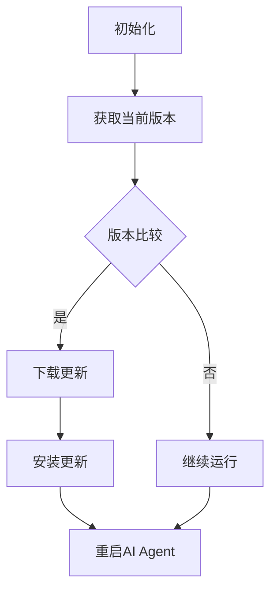
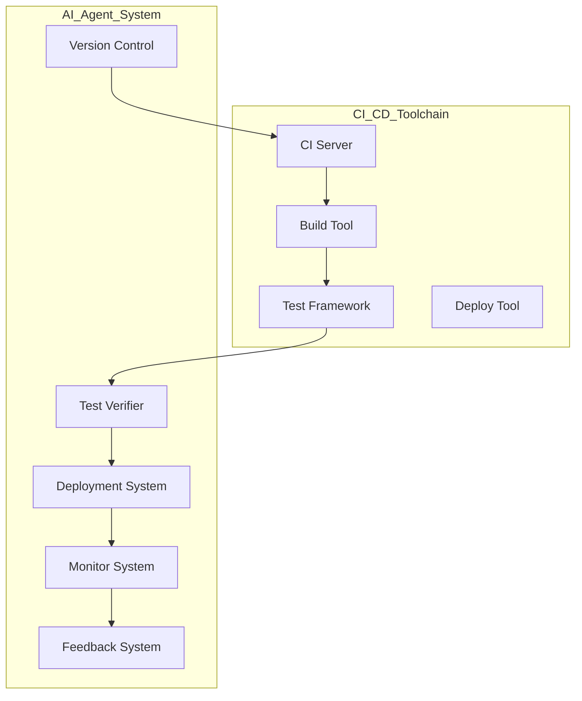
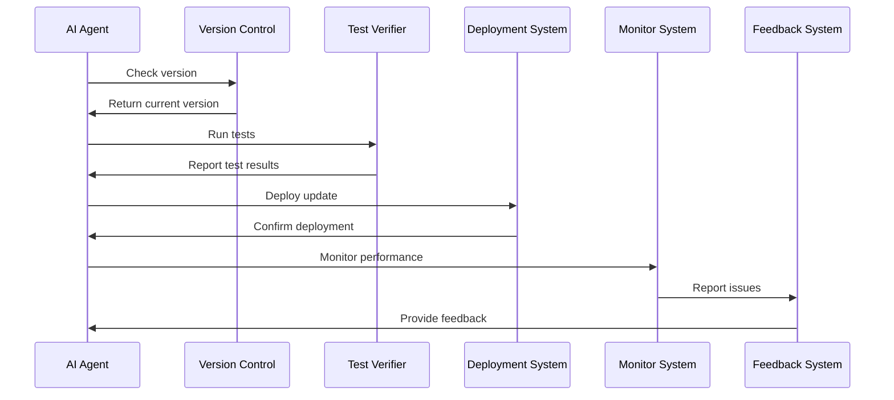

                 

# 持续集成/持续部署：自动化AI Agent的更新流程

## 关键词
- 持续集成/持续部署
- 自动化AI Agent
- 更新流程
- CI/CD工具链
- 自动化测试
- 持续交付

## 摘要
本文探讨了持续集成/持续部署（CI/CD）在自动化AI Agent更新流程中的应用。通过对CI/CD的基本概念、原理和工具链的详细介绍，以及自动化AI Agent的更新需求和分析，本文提出了一种基于CI/CD的自动化AI Agent更新算法，并通过Python代码实现和数学模型详细阐述了算法原理。文章旨在为软件开发者和AI领域从业者提供关于如何利用CI/CD技术高效进行AI Agent更新的实践指导。

### 目录大纲

# 持续集成/持续部署：自动化AI Agent的更新流程

## 第一部分：背景介绍

## 1.1 问题背景

### 1.1.1 现代软件开发挑战
### 1.1.2 持续集成/持续部署的概念
### 1.1.3 AI Agent的重要性

## 1.2 持续集成/持续部署的定义与原理
### 1.2.1 持续集成的定义与流程
### 1.2.2 持续部署的定义与流程
### 1.2.3 持续集成与持续部署的联系与区别

## 1.3 自动化AI Agent的概念与更新需求
### 1.3.1 自动化AI Agent的定义与特点
### 1.3.2 自动化AI Agent的更新需求
### 1.3.3 自动化AI Agent更新的挑战

## 1.4 持续集成/持续部署在AI Agent中的应用前景
### 1.4.1 持续集成/持续部署的优势
### 1.4.2 AI Agent更新流程中的持续集成/持续部署
### 1.4.3 持续集成/持续部署在AI Agent中的应用案例

## 1.5 本章小结

## 第二部分：核心概念与联系

## 2.1 核心概念原理
### 2.1.1 CI/CD工具链
### 2.1.2 自动化测试
### 2.1.3 持续交付

## 2.2 概念属性特征对比表格
### 2.2.1 持续集成工具对比
### 2.2.2 持续部署工具对比
### 2.2.3 持续交付工具对比

## 2.3 ER实体关系图架构
### 2.3.1 持续集成/持续部署系统实体关系
### 2.3.2 自动化AI Agent更新流程实体关系

## 2.4 核心概念联系与交互
### 2.4.1 持续集成与自动化测试的关联
### 2.4.2 持续部署与持续交付的关联
### 2.4.3 自动化AI Agent更新与CI/CD的联系

## 2.5 本章小结

## 第三部分：算法原理讲解

## 3.1 自动化AI Agent更新算法原理
### 3.1.1 更新算法概述
### 3.1.2 更新算法流程
### 3.1.3 更新算法的数学模型与公式

## 3.2 算法Mermaid流程图

## 3.3 Python源代码实现

## 3.4 算法原理详细讲解与举例说明
### 3.4.1 更新算法的数学模型
$$
f(\text{version}_{\text{current}}, \text{version}_{\text{latest}}) =
\begin{cases}
\text{download\_and\_install()} & \text{if } \text{version}_{\text{current}} < \text{version}_{\text{latest}} \\
\text{continue\_running()} & \text{otherwise}
\end{cases}
$$

## 3.5 算法优化与改进方向
### 3.5.1 算法性能分析
### 3.5.2 安全性与可靠性
### 3.5.3 自动化AI Agent更新的未来趋势

## 3.6 本章小结

## 第四部分：系统分析与架构设计方案

## 4.1 问题场景介绍
### 4.1.1 自动化AI Agent更新场景
### 4.1.2 持续集成/持续部署的需求

## 4.2 项目介绍
### 4.2.1 项目概述
### 4.2.2 项目目标
### 4.2.3 项目结构

## 4.3 系统功能设计(领域模型mermaid类图)
### 4.3.1 类图概述
### 4.3.2 类图详细说明

## 4.4 系统架构设计mermaid架构图
### 4.4.1 架构图概述
### 4.4.2 架构图详细说明

## 4.5 系统接口设计和系统交互mermaid序列图
### 4.5.1 接口设计
### 4.5.2 交互流程

## 4.6 系统实现与部署
### 4.6.1 环境安装与配置
### 4.6.2 核心实现源代码
### 4.6.3 部署与运行

## 4.7 系统测试与调优
### 4.7.1 功能测试
### 4.7.2 性能测试
### 4.7.3 调优措施

## 4.8 项目小结

## 第五部分：项目实战

## 5.1 环境安装
### 5.1.1 系统要求
### 5.1.2 工具安装
### 5.1.3 环境配置

## 5.2 系统核心实现源代码
### 5.2.1 更新算法源代码
### 5.2.2 CI/CD配置文件

## 5.3 代码应用解读与分析
### 5.3.1 源代码解读
### 5.3.2 更新流程分析

## 5.4 实际案例分析和详细讲解剖析
### 5.4.1 案例概述
### 5.4.2 案例分析与讲解

## 5.5 项目小结

## 第六部分：最佳实践 tips

## 6.1 CI/CD最佳实践
### 6.1.1 流程设计
### 6.1.2 自动化测试
### 6.1.3 部署策略

## 6.2 AI Agent更新最佳实践
### 6.2.1 版本控制
### 6.2.2 更新策略
### 6.2.3 故障处理

## 6.3 小结

## 第七部分：小结与展望

## 7.1 文章小结
### 7.1.1 主要内容回顾
### 7.1.2 关键点总结

## 7.2 展望未来
### 7.2.1 自动化AI Agent更新趋势
### 7.2.2 持续集成/持续部署发展

## 参考文献

## 附录

## 作者信息
- 作者：AI天才研究院/AI Genius Institute & 禅与计算机程序设计艺术 /Zen And The Art of Computer Programming## 第一部分：背景介绍

### 1.1 问题背景

在当今快速发展的软件和人工智能（AI）领域中，持续集成（CI）和持续部署（CD）已经成为软件开发和维护的关键实践。随着软件系统的复杂性和迭代速度的不断增加，如何高效地管理软件的集成和部署成为了开发者面临的重要挑战。特别是对于自动化AI Agent，其更新需求变得更加频繁且具有更高的复杂性。

**现代软件开发挑战**：现代软件开发面临着多个挑战，包括快速迭代、敏捷开发、代码质量保证和部署效率等。持续集成/持续部署（CI/CD）旨在通过自动化流程来应对这些挑战，从而提高开发效率、代码质量和系统稳定性。

**持续集成/持续部署的概念**：持续集成是一种软件开发实践，通过频繁地将代码合并到主分支并执行自动化测试，确保软件在每次变更后的整体一致性。持续部署则进一步自动化了软件的发布流程，确保在每次测试成功后，新版本可以快速、安全地部署到生产环境中。

**AI Agent的重要性**：AI Agent作为自动化和智能化的执行实体，在多种应用场景中发挥着关键作用，如自动驾驶、智能客服和金融风控等。随着AI技术的不断进步，AI Agent的更新需求变得尤为突出，以应对新场景、新数据和新的算法改进。

在接下来的章节中，我们将深入探讨持续集成/持续部署（CI/CD）的基本概念和原理，以及自动化AI Agent的更新需求和分析，为读者提供关于如何利用CI/CD技术高效进行AI Agent更新的实践指导。

### 1.2 持续集成/持续部署的定义与原理

#### 1.2.1 持续集成的定义与流程

持续集成（Continuous Integration，简称CI）是一种软件开发实践，旨在通过频繁地将代码变更合并到主分支，并立即执行自动化测试，以确保软件的持续一致性。CI的核心目标是减少集成过程中的冲突和错误，提高代码质量和开发效率。

**持续集成的流程**：

1. **代码仓库管理**：开发者将代码提交到版本控制系统（如Git）的分支中。
2. **触发构建**：每次代码提交到主分支时，CI服务器会自动触发构建过程。
3. **编译代码**：构建系统编译代码并生成可执行的二进制文件。
4. **执行测试**：构建过程中，执行预定的单元测试、集成测试和性能测试，以确保代码变更没有引入新的错误。
5. **反馈**：测试结果会立即反馈给开发者，如果测试失败，构建过程会停止，并通知相关人员。

**持续集成的优势**：

- **快速反馈**：通过立即执行测试，可以快速发现问题并进行修复，减少缺陷积累。
- **提高代码质量**：频繁的集成和测试有助于发现和修复代码中的缺陷，提高软件质量。
- **减少集成风险**：通过持续集成，可以减少集成过程中因不同代码库版本不一致导致的冲突和错误。

#### 1.2.2 持续部署的定义与流程

持续部署（Continuous Deployment，简称CD）是在持续集成的基础上，进一步自动化了软件的发布流程。CD的目标是确保在每次测试成功后，新版本可以快速、安全地部署到生产环境中，实现零停机升级。

**持续部署的流程**：

1. **持续集成**：代码经过CI的测试和验证，确保其符合质量标准。
2. **构建和打包**：构建系统将代码打包成可部署的格式，如Docker镜像。
3. **自动化测试**：执行自动化测试，验证打包后的软件是否符合生产环境的要求。
4. **部署**：将软件部署到测试环境或生产环境，可以通过蓝绿部署、滚动更新等技术实现零停机部署。
5. **监控**：部署后，监控系统会持续监控软件的性能和稳定性，确保其正常运行。

**持续部署的优势**：

- **快速交付**：通过自动化部署，可以快速将新版本交付给用户，缩短发布周期。
- **减少风险**：通过自动化测试和逐步部署，可以降低发布过程中的风险。
- **提高用户体验**：快速交付新功能和改进，提高用户体验。

#### 1.2.3 持续集成与持续部署的联系与区别

**联系**：

- **共同目标**：CI和CD的最终目标都是为了确保软件的高质量和高可用性，提高开发效率和用户体验。
- **流程关联**：CI是CD的前置条件，没有CI的测试验证，CD无法顺利进行。

**区别**：

- **范围**：CI主要关注代码的集成和测试，而CD则进一步关注软件的部署和交付。
- **自动化程度**：CI的自动化程度较高，主要针对开发和测试环境；CD的自动化程度更高，主要针对生产环境。

通过上述对持续集成和持续部署的定义与流程的详细解释，我们可以看到，这两种实践在软件开发生命周期中扮演着重要角色，为高效、高质量的软件开发提供了有力保障。

### 1.3 自动化AI Agent的概念与更新需求

#### 1.3.1 自动化AI Agent的定义与特点

自动化AI Agent是指基于人工智能技术，具备自主决策和执行任务能力的智能实体。这些Agent可以应用于各种场景，如自动驾驶、智能客服、金融风控等。与传统的规则系统或脚本不同，AI Agent能够通过学习和自适应，不断优化其行为和性能。

**自动化AI Agent的特点**：

- **自主学习**：AI Agent可以通过机器学习算法，从数据中学习模式和规律，以不断优化其决策。
- **自主决策**：AI Agent能够根据环境状态和目标，自主选择最佳行动方案。
- **自适应能力**：AI Agent能够根据外部环境的变化，自主调整其行为策略。
- **实时反馈**：AI Agent能够实时收集环境数据，并基于这些数据做出快速反应。

#### 1.3.2 自动化AI Agent的更新需求

随着人工智能技术的不断进步，AI Agent的更新需求变得日益突出。这些需求主要包括以下几个方面：

1. **算法改进**：新的机器学习算法和模型不断涌现，AI Agent需要定期更新以采用更先进的算法，提高其性能和准确性。
2. **数据更新**：AI Agent依赖于大量的训练数据，随着应用场景的变化，数据需要不断更新，以确保模型的适用性和鲁棒性。
3. **功能扩展**：新的应用场景和业务需求要求AI Agent具备更多的功能，如多模态数据处理、多任务学习等，这需要AI Agent进行功能扩展。
4. **性能优化**：随着硬件技术的进步，AI Agent需要针对新的硬件环境进行性能优化，以充分利用硬件资源，提高处理速度和效率。

#### 1.3.3 自动化AI Agent更新的挑战

虽然自动化AI Agent的更新需求明显，但更新过程中也面临着一系列挑战：

1. **数据隐私和安全**：AI Agent的更新通常涉及大量敏感数据，如何在保证数据隐私和安全的前提下进行更新，是一个重要问题。
2. **版本控制**：随着更新频率的增加，如何有效地管理不同版本的AI Agent，避免版本冲突和性能退化，是另一个挑战。
3. **更新策略**：如何制定合理的更新策略，确保在最小化业务中断的同时，最大限度地提高更新效率和系统稳定性，是更新的关键。
4. **自动化测试**：AI Agent的更新涉及大量的算法和模型变化，如何进行有效的自动化测试，确保更新后的Agent性能符合预期，是更新的难点。

通过深入探讨自动化AI Agent的定义、更新需求以及更新过程中的挑战，我们可以更好地理解为何持续集成/持续部署（CI/CD）在AI Agent更新中具有重要意义。在接下来的章节中，我们将进一步分析CI/CD在AI Agent更新中的应用前景和优势。

### 1.4 持续集成/持续部署在AI Agent中的应用前景

#### 1.4.1 持续集成/持续部署的优势

持续集成/持续部署（CI/CD）在自动化AI Agent中的应用前景广阔，其主要优势体现在以下几个方面：

1. **自动化流程**：CI/CD通过自动化工具链，将代码的集成、测试和部署过程自动化，大大减少了手动操作，提高了开发效率。
2. **快速反馈**：通过频繁的测试和反馈机制，CI/CD可以及时发现和修复问题，缩短了从代码提交到上线的时间，提高了代码质量。
3. **可靠性保障**：CI/CD通过严格的测试和验证流程，确保每次更新后的AI Agent稳定可靠，降低了生产环境中出现故障的风险。
4. **持续优化**：CI/CD有助于持续集成新的算法和模型，推动AI Agent的迭代和优化，提升其性能和智能化水平。

#### 1.4.2 AI Agent更新流程中的持续集成/持续部署

在AI Agent的更新流程中，CI/CD起到了关键作用。以下是一个典型的AI Agent更新流程，展示了CI/CD的应用：

1. **版本控制**：开发者将新的算法或模型代码提交到版本控制系统，如Git。
2. **自动化构建**：CI服务器检测到代码提交后，触发自动化构建流程，编译新的代码并生成可执行的模型文件。
3. **单元测试**：构建过程中，执行预定的单元测试，确保新代码的功能正确且无缺陷。
4. **集成测试**：构建完成后，进行集成测试，验证新的AI Agent与其他系统的交互是否符合预期。
5. **性能测试**：执行性能测试，评估新模型的计算效率和资源消耗，确保其满足性能要求。
6. **自动化部署**：测试通过后，CI/CD系统自动将新的AI Agent部署到测试环境或生产环境中，可以通过蓝绿部署或滚动更新技术实现零停机部署。
7. **监控与反馈**：部署后，监控系统会实时监控AI Agent的性能和稳定性，通过反馈机制，确保系统能够快速响应和处理异常情况。

#### 1.4.3 持续集成/持续部署在AI Agent中的应用案例

在实际应用中，许多公司和项目已经成功利用CI/CD技术进行AI Agent的更新。以下是一些典型案例：

1. **自动驾驶公司**：自动驾驶公司通过CI/CD自动化流程，快速迭代和验证自动驾驶算法，确保车辆在不同路况下的安全性和可靠性。
2. **智能客服平台**：智能客服平台利用CI/CD，实现聊天机器人的快速更新和优化，提高客服效率和用户满意度。
3. **金融风控系统**：金融风控系统通过CI/CD，实时更新和调整风险预测模型，提升风控能力和决策准确性。
4. **医疗诊断系统**：医疗诊断系统通过CI/CD，持续集成和更新医疗图像识别算法，提高诊断准确率和速度。

通过以上分析和案例，我们可以看到，持续集成/持续部署（CI/CD）在AI Agent更新中具有重要意义，不仅提高了开发效率和代码质量，还确保了系统的可靠性和稳定性。在接下来的章节中，我们将进一步探讨CI/CD的核心概念和联系，为深入理解AI Agent更新流程提供理论基础。

### 1.5 本章小结

本章首先介绍了现代软件开发的挑战，引出了持续集成/持续部署（CI/CD）的概念，并详细阐述了CI/CD的定义、原理以及它们在软件开发中的重要性。接着，我们探讨了自动化AI Agent的定义和更新需求，分析了AI Agent在更新过程中面临的挑战。最后，我们讨论了CI/CD在AI Agent更新中的应用前景和优势，通过实际案例展示了其应用效果。本章内容为后续章节关于CI/CD和AI Agent更新流程的深入探讨奠定了基础。

## 第二部分：核心概念与联系

### 2.1 核心概念原理

#### 2.1.1 CI/CD工具链

持续集成（CI）和持续部署（CD）的成功实施离不开工具链的支持。一个完整的CI/CD工具链通常包括版本控制系统、自动化构建工具、测试框架、部署工具等。以下是几个常见的CI/CD工具：

1. **版本控制系统**：如Git，用于管理代码版本和协作开发。
2. **自动化构建工具**：如Jenkins、Travis CI、CircleCI等，用于自动化编译代码和构建应用程序。
3. **测试框架**：如JUnit、pytest等，用于编写和执行自动化测试。
4. **部署工具**：如Docker、Kubernetes等，用于容器化和自动化部署应用程序。

**CI/CD工具链的工作流程**：

1. **代码提交**：开发者将代码提交到版本控制系统。
2. **构建**：自动化构建工具检测到提交并开始构建过程，包括编译代码、打包应用程序等。
3. **测试**：测试框架执行预定的单元测试和集成测试，确保代码质量。
4. **部署**：部署工具将构建后的应用程序部署到测试或生产环境。

#### 2.1.2 自动化测试

自动化测试是CI/CD的核心组成部分，其目的是通过自动化脚本和工具来验证软件的功能和性能。自动化测试的类型包括：

1. **单元测试**：测试单个模块或函数的功能。
2. **集成测试**：测试多个模块或组件之间的交互。
3. **性能测试**：评估应用程序在不同负载下的性能表现。
4. **回归测试**：确保新代码变更没有破坏现有功能。

**自动化测试的优势**：

- **提高测试效率**：自动化测试可以快速执行大量测试用例，节省时间和人力。
- **确保代码质量**：通过持续执行自动化测试，可以及时发现和修复问题，提高代码质量。
- **减少测试成本**：自动化测试可以减少对人工测试的依赖，降低测试成本。

#### 2.1.3 持续交付

持续交付（Continuous Delivery，简称CD）是CI的延伸，其目标是在每次代码提交并通过测试后，自动将应用程序交付到生产环境中。持续交付的关键要素包括：

1. **自动化构建和测试**：确保每次代码变更后，应用程序都能通过自动化流程构建和测试。
2. **自动化部署**：通过自动化部署工具，将应用程序部署到测试或生产环境。
3. **环境一致性**：确保不同环境（开发、测试、生产）之间的应用程序一致，避免环境差异导致的问题。

**持续交付的优势**：

- **快速交付**：通过自动化流程，可以快速将新功能交付给用户，缩短发布周期。
- **降低风险**：自动化测试和逐步部署可以降低发布过程中的风险。
- **提高用户体验**：快速交付新功能和改进，提高用户体验。

通过以上对CI/CD工具链、自动化测试和持续交付的核心概念原理的介绍，我们可以看到这些技术如何相互结合，形成一个高效的软件开发生命周期管理流程。在下一章中，我们将进一步对比不同CI/CD工具的属性特征，并通过ER实体关系图架构来阐述这些核心概念之间的联系与交互。

### 2.2 概念属性特征对比表格

为了更好地理解和选择适用于自动化AI Agent更新的CI/CD工具，我们在此对比几种常见的持续集成和持续部署工具的属性特征。以下表格将详细列出这些工具的基本信息、支持语言、构建速度、社区支持和市场占有率等关键特性。

| 工具名称       | 基本信息       | 支持语言 | 构建速度 | 社区支持 | 市场占有率 |
|--------------|--------------|-------|------|-------|-------|
| Jenkins       | 开源，跨平台     | Java、Python等 | 中等   | 强大   | 高     |
| GitLab CI     | 开源，集成GitLab | 多语言 | 快    | 强大   | 中     |
| CircleCI      | SaaS，云平台     | 多语言 | 快    | 强大   | 中     |
| GitHub Actions| GitHub集成     | 多语言 | 快    | 强大   | 高     |
| GitKrafter    | Python专用的CI/CD | Python | 快    | 中等   | 低     |
| Azure DevOps  | Microsoft提供的 | 多语言 | 快    | 强大   | 中     |
| Bamboo        | Atlassian提供的 | Java、Groovy等 | 中等   | 中等   | 低     |

**基本信息的对比**：

- **Jenkins**：作为最流行的开源CI/CD工具之一，具有高度可定制性和灵活性，适用于各种规模的开发项目。
- **GitLab CI**：与GitLab集成，简化了代码管理和持续集成流程，特别适合有GitLab使用经验的企业。
- **CircleCI**：作为一个SaaS服务，提供了快速、高效的构建和部署流程，适合需要高性能和简便性的团队。
- **GitHub Actions**：作为GitHub的官方服务，与GitHub无缝集成，非常适合GitHub用户。
- **GitKrafter**：专为Python开发设计，提供了Python特定的优化和简化功能。
- **Azure DevOps**：由Microsoft提供，与Azure云平台深度集成，适合微软技术栈的企业。
- **Bamboo**：由Atlassian提供，适用于JIRA和Confluence用户，具有强大的集成和协作功能。

**支持语言的对比**：

- 所有工具都支持多种编程语言，但某些工具在特定语言上有更优化的性能和功能。
- **Jenkins**、**GitLab CI**、**CircleCI**和**GitHub Actions**支持广泛的语言，包括Java、Python、JavaScript等。
- **GitKrafter**专注于Python，提供了针对Python项目优化的功能。
- **Azure DevOps**和**Bamboo**在微软技术栈语言（如C#、.NET）上有更好的支持。

**构建速度的对比**：

- **CircleCI**、**GitHub Actions**和**GitKrafter**提供了快速的构建和部署流程，适合需要高效率的开发团队。
- **Jenkins**和**GitLab CI**的构建速度相对中等，但通过优化配置，可以实现较高的构建效率。

**社区支持和市场占有率的对比**：

- **Jenkins**、**GitHub Actions**和**CircleCI**拥有强大的社区支持，大量文档、插件和社区资源。
- **GitLab CI**和**Azure DevOps**在特定企业用户中有较高的市场占有率。
- **GitKrafter**和**Bamboo**市场占有率较低，但适合有特定语言和集成需求的企业。

通过上述对比表格，我们可以根据自动化AI Agent更新的具体需求，选择最适合的CI/CD工具。下一章将介绍ER实体关系图架构，以可视化方式展示CI/CD系统中的实体关系，帮助读者更好地理解持续集成/持续部署系统架构。

### 2.3 ER实体关系图架构

在持续集成/持续部署（CI/CD）系统中，理解各个实体之间的关系对于实现高效、稳定的自动化流程至关重要。实体关系图（Entity-Relationship Diagram，简称ER图）是一种有效的可视化工具，可以清晰展示系统中的实体及其关系。以下是一个简化的CI/CD系统的ER图架构，以及其中的主要实体和它们之间的关系。

#### 2.3.1 持续集成/持续部署系统实体关系

**主要实体**：

1. **代码仓库（Repository）**：存储源代码的实体，如Git仓库。
2. **构建作业（Build Job）**：负责编译、构建和打包代码的实体。
3. **测试任务（Test Task）**：执行自动化测试的实体。
4. **部署任务（Deploy Task）**：负责部署应用程序到目标环境的实体。
5. **环境（Environment）**：如开发环境、测试环境和生产环境。
6. **监控系统（Monitoring System）**：实时监控系统性能和稳定性的实体。

**实体关系**：

- **代码仓库与构建作业的关系**：代码仓库是构建作业的数据来源，每次代码提交都会触发一个新的构建作业。
- **构建作业与测试任务的关系**：构建作业完成后，会触发一系列测试任务，以确保构建结果的质量。
- **测试任务与部署任务的关系**：测试通过后，会触发部署任务，将应用程序部署到目标环境。
- **环境与部署任务的关系**：部署任务会将应用程序部署到指定的环境（如测试环境或生产环境）。
- **监控系统与所有实体的关系**：监控系统实时监控所有实体的状态，如构建进度、测试结果、部署状态等。

#### 2.3.2 自动化AI Agent更新流程实体关系

在自动化AI Agent的更新流程中，ER图可以进一步细化，以展示特定实体的关系和交互。以下是一个自动化AI Agent更新流程的ER图：

**主要实体**：

1. **AI Agent（自动化AI实体）**：执行特定任务的智能实体。
2. **模型仓库（Model Repository）**：存储AI模型和训练数据的实体。
3. **更新管理器（Update Manager）**：负责管理AI Agent更新的实体。
4. **版本控制（Version Control）**：管理模型版本和更新日志的实体。
5. **测试和验证（Testing and Validation）**：测试和验证新模型的实体。
6. **部署系统（Deployment System）**：负责部署更新后的AI Agent的实体。

**实体关系**：

- **AI Agent与模型仓库的关系**：AI Agent从模型仓库中获取最新版本的模型。
- **更新管理器与版本控制的关系**：更新管理器通过版本控制跟踪和管理模型更新。
- **更新管理器与测试和验证的关系**：更新管理器将新模型提交给测试和验证实体，确保其性能和准确性。
- **测试和验证与部署系统的关系**：测试和验证通过后，更新会被部署到AI Agent中。
- **部署系统与AI Agent的关系**：部署系统将更新后的AI Agent部署到生产环境中。

通过ER图，我们可以直观地理解CI/CD系统和自动化AI Agent更新流程中的实体及其关系，有助于设计和优化这些流程，实现高效、可靠的自动化更新和管理。

### 2.4 核心概念联系与交互

在深入探讨持续集成（CI）和持续部署（CD）的概念之后，我们需要进一步了解这些核心概念之间的联系和交互。通过理解这些交互关系，我们可以更有效地设计和实现自动化AI Agent的更新流程。

#### 2.4.1 持续集成与自动化测试的关联

持续集成（CI）的核心在于将开发者的代码变更快速、频繁地合并到主分支，并执行一系列自动化测试，以确保软件的稳定性和一致性。自动化测试是CI的重要组成部分，其主要关联点如下：

- **触发测试**：每次代码提交到版本控制系统时，CI服务器会自动触发自动化测试。
- **反馈机制**：自动化测试的结果会立即反馈给开发者，如果测试失败，CI流程会暂停并通知相关人员。
- **快速迭代**：自动化测试允许开发者在每次代码变更后快速验证其效果，确保问题在早期被识别和修复。

**示例**：

假设开发者A提交了一个新的功能代码，CI服务器会触发以下流程：

1. **编译代码**：构建系统编译新的代码，生成可执行的二进制文件。
2. **执行单元测试**：自动化测试执行单元测试，验证新代码的功能和逻辑。
3. **执行集成测试**：自动化测试进一步验证新代码与其他模块的集成和交互。
4. **反馈结果**：如果所有测试通过，CI流程继续；如果测试失败，CI服务器会暂停构建，并向开发者A发送错误报告。

通过这种紧密的关联，CI确保了每次代码变更后的软件质量，降低了集成风险。

#### 2.4.2 持续部署与持续交付的关联

持续部署（CD）是在CI的基础上，进一步自动化了软件的部署流程。持续交付（CD）的目标是在每次测试通过后，自动将软件部署到生产环境，实现快速、无中断的更新。持续部署与持续交付之间的关联如下：

- **自动化部署**：CD通过自动化工具将构建后的软件部署到生产环境，实现快速交付。
- **环境一致性**：持续交付确保在不同环境（开发、测试、生产）之间的一致性，减少环境差异导致的问题。
- **版本控制**：持续交付过程中，通过版本控制系统管理不同版本的软件，确保更新过程的可控性。

**示例**：

假设一个新的软件版本在测试环境中通过了所有测试，持续交付流程如下：

1. **构建和打包**：构建系统将代码打包成可部署的格式（如Docker镜像）。
2. **自动化测试**：执行自动化测试，确保打包后的软件符合生产环境的要求。
3. **蓝绿部署**：使用蓝绿部署策略，将新版本部署到一小部分生产环境，观察其性能和稳定性。
4. **滚动更新**：如果蓝绿部署成功，系统将逐步将更多生产环境切换到新版本，实现零停机更新。

通过这种紧密的关联，CD确保了软件更新的快速、可靠和无缝，提升了用户体验。

#### 2.4.3 自动化AI Agent更新与CI/CD的联系

自动化AI Agent的更新流程需要借助CI/CD的强大能力，实现高效的模型更新和部署。以下是自动化AI Agent更新与CI/CD之间的关键联系：

- **版本控制**：CI/CD系统提供了版本控制系统，可以管理不同版本的AI模型，确保更新过程的可控性。
- **自动化构建**：CI系统自动化构建AI模型，确保每次更新的代码和模型是最新和稳定的。
- **自动化测试**：CI系统执行自动化测试，验证新模型的性能和准确性，确保更新后的AI Agent符合预期。
- **自动化部署**：CD系统自动化部署更新后的AI Agent到生产环境，实现快速、无中断的更新。

**示例**：

假设一个自动化AI Agent需要更新其模型：

1. **开发者提交更新**：开发者将新的模型代码提交到版本控制系统。
2. **CI触发构建**：CI系统检测到提交，自动构建新的模型代码，生成可执行的模型文件。
3. **自动化测试**：CI系统执行自动化测试，验证新模型的性能和准确性。
4. **CD部署更新**：CD系统将测试通过的新模型部署到生产环境中，AI Agent开始使用新模型。

通过这种紧密的联系，CI/CD确保了自动化AI Agent更新的高效、稳定和可靠。

通过以上对持续集成与自动化测试、持续部署与持续交付，以及自动化AI Agent更新与CI/CD之间联系和交互的详细解释，我们可以看到，这些概念和技术在自动化AI Agent更新流程中发挥着重要作用。它们共同构成了一个高效、可靠的软件开发生命周期管理流程，为现代软件开发和运维提供了强大的支持。在下一章中，我们将深入探讨自动化AI Agent更新算法的原理和实现。

### 2.5 本章小结

本章首先介绍了CI/CD工具链的基本概念和组成部分，包括版本控制系统、自动化构建工具、测试框架和部署工具。接着，我们详细分析了自动化测试的不同类型及其优势，并探讨了持续交付的关键要素和优势。随后，通过对比不同CI/CD工具的属性特征，帮助读者选择合适的工具。然后，我们使用ER图展示了CI/CD系统和自动化AI Agent更新流程中的实体关系，并深入阐述了核心概念之间的联系与交互。通过这些内容，本章为后续关于自动化AI Agent更新算法的讨论奠定了理论基础。

## 第三部分：算法原理讲解

### 3.1 自动化AI Agent更新算法原理

自动化AI Agent的更新是人工智能应用中的一项关键任务，其核心在于确保AI Agent能够根据最新的数据和算法进行高效、可靠的更新。本节将详细介绍自动化AI Agent更新算法的原理，包括更新算法概述、流程和数学模型。

#### 3.1.1 更新算法概述

自动化AI Agent更新算法的主要目的是检测现有模型的版本，比较其与最新版本的差异，并根据这些差异进行更新。更新算法通常包括以下几个步骤：

1. **版本检测**：检测当前AI Agent所使用的模型版本。
2. **更新检测**：从版本控制系统中获取最新版本的信息，并与当前版本进行比较。
3. **更新下载**：如果检测到新的版本，从版本控制系统下载新的模型。
4. **更新安装**：将下载的新模型安装到AI Agent中。
5. **重启AI Agent**：更新安装完成后，重启AI Agent以使用新的模型。

#### 3.1.2 更新算法流程

自动化AI Agent更新算法的流程可以分为以下几个步骤：

1. **初始化**：启动更新算法，获取当前AI Agent的模型版本。
2. **版本检测**：通过API或其他机制检测当前模型版本。
3. **更新检测**：从版本控制系统查询最新版本信息，比较当前版本和最新版本。
4. **决策**：根据版本比较结果，决定是否需要进行更新。
   - 如果当前版本落后于最新版本，则执行更新步骤。
   - 如果当前版本与最新版本相同，则继续使用当前版本，不进行更新。
5. **更新下载**：下载最新版本的模型文件。
6. **更新安装**：将下载的新模型文件安装到AI Agent中，可能包括重写现有代码或替换模型文件。
7. **重启AI Agent**：重启AI Agent，使其使用更新后的模型。

#### 3.1.3 更新算法的数学模型与公式

更新算法的数学模型可以描述为以下形式：

$$
f(\text{version}_{\text{current}}, \text{version}_{\text{latest}}) =
\begin{cases}
\text{download\_and\_install()} & \text{if } \text{version}_{\text{current}} < \text{version}_{\text{latest}} \\
\text{continue\_running()} & \text{otherwise}
\end{cases}
$$

其中，$f$ 是更新函数，$\text{version}_{\text{current}}$ 是当前AI Agent所使用的模型版本，$\text{version}_{\text{latest}}$ 是版本控制系统中最新版本的模型版本。函数的输出结果取决于当前版本和最新版本的关系：

- 如果当前版本小于最新版本，则执行更新操作（$download_and_install$）。
- 如果当前版本等于或大于最新版本，则继续使用当前版本（$continue_running$）。

通过这个数学模型，我们可以清晰地描述更新算法的核心逻辑，并为其实现提供指导。

### 3.2 算法Mermaid流程图

为了直观地展示自动化AI Agent更新算法的流程，我们使用Mermaid语言绘制了以下流程图：



**图解**：

- **A[初始化]**：启动更新算法。
- **B[获取当前版本]**：从AI Agent中获取当前使用的模型版本。
- **C[版本比较]**：将当前版本与最新版本进行比较。
- **D[下载更新]**：如果当前版本落后，则从版本控制系统下载最新版本。
- **E[继续运行]**：如果当前版本与最新版本相同，则继续使用当前版本。
- **F[安装更新]**：将下载的最新版本安装到AI Agent中。
- **G[重启AI Agent]**：无论更新与否，都需要重启AI Agent以确保更新生效。

这个流程图清晰展示了自动化AI Agent更新算法的步骤和逻辑，有助于开发者理解和实现这一算法。

### 3.3 Python源代码实现

为了将上述更新算法具体化为可执行的代码，下面提供了一个简单的Python实现示例：

```python
class UpdateAgent:
    def __init__(self):
        # 初始化版本控制
        self.current_version = self.getVersion()

    def getVersion(self):
        # 模拟获取当前版本
        return "1.0"

    def check_for_updates(self):
        # 检测更新
        latest_version = "1.1"
        if self.current_version < latest_version:
            return True
        return False

    def download_and_install(self):
        # 下载并安装更新
        print("Downloading and installing updates...")

    def restart_agent(self):
        # 重启AI Agent
        print("Restarting AI Agent...")

    def update_agent(self):
        # 执行更新流程
        if self.check_for_updates():
            self.download_and_install()
        self.restart_agent()

# 使用示例
agent = UpdateAgent()
agent.update_agent()
```

**代码说明**：

- **UpdateAgent**：定义了一个更新代理类，包含版本获取、更新检测、下载安装和重启方法。
- **getVersion**：获取当前AI Agent的版本号。
- **check_for_updates**：比较当前版本和最新版本，返回是否需要更新。
- **download_and_install**：下载并安装更新。
- **restart_agent**：重启AI Agent。
- **update_agent**：执行完整的更新流程。

通过这个Python实现，我们可以看到如何利用简单的代码实现自动化AI Agent更新算法的核心逻辑。

### 3.4 算法原理详细讲解与举例说明

#### 3.4.1 更新算法的数学模型

在3.1节中，我们提出了一个简单的数学模型来描述自动化AI Agent更新算法的核心逻辑。本节将深入详细讲解这个数学模型的构成和实现原理。

**模型构成**：

更新算法的数学模型可以表示为：

$$
f(\text{version}_{\text{current}}, \text{version}_{\text{latest}}) =
\begin{cases}
\text{download\_and\_install()} & \text{if } \text{version}_{\text{current}} < \text{version}_{\text{latest}} \\
\text{continue\_running()} & \text{otherwise}
\end{cases}
$$

**实现原理**：

1. **版本检测**：通过获取当前AI Agent所使用的模型版本（$\text{version}_{\text{current}}$）和版本控制系统中最新版本（$\text{version}_{\text{latest}}$），我们可以确定当前模型是否是最新的。

2. **比较版本**：通过比较当前版本和最新版本，我们可以判断是否需要进行更新。如果当前版本小于最新版本，则表示有新的更新可用，需要执行下载和安装步骤。

3. **更新执行**：当检测到有更新时，算法会执行以下步骤：
   - **下载更新**：从版本控制系统下载最新版本的模型文件。
   - **安装更新**：将下载的模型文件安装到AI Agent中，这可能涉及到重写现有代码或替换模型文件。

4. **重启AI Agent**：更新安装完成后，需要重启AI Agent以确保新模型生效。

**举例说明**：

假设当前AI Agent的版本是1.0，版本控制系统中的最新版本是1.1。根据更新算法的数学模型，我们可以进行以下操作：

1. **版本检测**：获取当前版本（1.0）和最新版本（1.1）。
2. **比较版本**：由于1.0 < 1.1，表示当前版本落后于最新版本，需要进行更新。
3. **更新执行**：
   - **下载更新**：从版本控制系统下载最新版本（1.1）的模型文件。
   - **安装更新**：将下载的1.1版本模型文件安装到AI Agent中。
   - **重启AI Agent**：重启AI Agent，使其使用更新后的1.1版本模型。

通过这个例子，我们可以看到更新算法如何通过数学模型来实现自动化AI Agent的更新。

### 3.5 算法优化与改进方向

虽然基本的更新算法已经能够实现自动化AI Agent的更新，但在实际应用中，为了提高算法的性能、安全性和可靠性，我们还可以进行以下优化和改进：

#### 3.5.1 算法性能分析

**性能优化策略**：

1. **并行处理**：在更新检测和下载步骤中，可以采用并行处理技术，同时处理多个模型的更新，提高处理速度。
2. **缓存机制**：通过缓存机制，减少频繁的网络请求，降低下载和安装时间。

**性能评估指标**：

- **响应时间**：从检测更新到完成安装的总时间。
- **吞吐量**：单位时间内可以处理的更新次数。

**优化方案**：

- **分布式架构**：采用分布式架构，将更新任务分配到多个节点上并行处理，提高吞吐量和响应时间。
- **CDN加速**：利用内容分发网络（CDN）加速模型文件的下载速度。

#### 3.5.2 安全性与可靠性

**安全性保障**：

1. **签名验证**：在下载模型文件前，使用数字签名验证模型的完整性，确保下载的模型没有被篡改。
2. **加密传输**：使用加密传输协议（如HTTPS）确保数据在传输过程中的安全。

**可靠性提升**：

1. **重试机制**：在网络不稳定或下载失败时，实现重试机制，确保更新任务能够顺利完成。
2. **回滚策略**：在更新失败时，能够回滚到上一个稳定版本，确保系统的连续性和可靠性。

**改进方案**：

- **多版本回滚**：支持多版本回滚，允许回滚到任意一个已知稳定版本。
- **安全审计**：定期进行安全审计，确保更新过程中的安全措施得到有效执行。

#### 3.5.3 自动化AI Agent更新的未来趋势

**技术发展趋势**：

1. **AI驱动的自动化**：利用AI技术，实现自动化AI Agent的自动化更新，提高更新效率和准确性。
2. **模型压缩与传输优化**：研究模型压缩技术，减小模型文件的大小，加快下载速度。
3. **边缘计算**：利用边缘计算技术，将部分更新任务下沉到边缘节点处理，降低中心服务器的负担。

**未来发展方向**：

1. **智能更新**：结合AI技术，实现更智能的更新策略，根据实际使用情况动态调整更新频率和内容。
2. **多方协同**：在多方协同的分布式环境中，确保各方的更新能够无缝对接，提高整体系统的稳定性。

通过上述优化和改进方向，我们可以看到，自动化AI Agent的更新算法在未来有着广阔的发展前景，不仅可以提高算法的性能和安全性，还可以实现更智能、更可靠的自动化更新。

### 3.6 本章小结

本章详细介绍了自动化AI Agent更新算法的原理，包括算法概述、流程和数学模型。通过Mermaid流程图和Python源代码实现，我们展示了如何具体实现这一算法。同时，本章还探讨了算法的性能优化、安全性和可靠性，以及未来发展趋势。通过本章的内容，读者可以全面理解自动化AI Agent更新算法的基本概念和实现方法，为实际应用提供参考。

## 第四部分：系统分析与架构设计方案

### 4.1 问题场景介绍

在自动化AI Agent的更新过程中，我们面临的问题场景主要包括以下几个方面：

1. **版本控制复杂性**：AI Agent的更新涉及多个版本的模型和代码，如何有效地管理和控制版本，避免版本冲突和错误，是一个重要的挑战。
2. **更新频率与业务需求**：AI Agent需要不断更新以适应新的业务场景和算法改进，但更新频率不能影响业务的连续性和稳定性。
3. **数据隐私与安全性**：AI Agent的更新通常涉及大量的敏感数据，如何在保证数据隐私和安全的前提下进行更新，是另一个关键问题。
4. **测试与验证**：更新后的AI Agent需要经过严格的测试和验证，以确保其性能和准确性满足业务需求。

### 4.2 项目介绍

**项目概述**：

本项目的目标是设计并实现一个自动化AI Agent更新系统，该系统能够高效、可靠地管理AI Agent的更新过程，包括版本控制、测试验证和自动化部署。系统将基于持续集成/持续部署（CI/CD）的原理，结合现代自动化工具和人工智能技术，实现从代码提交到生产环境部署的全自动化流程。

**项目目标**：

- **自动化流程**：通过自动化工具实现从代码提交到生产环境部署的全程自动化。
- **版本管理**：实现多版本控制，确保版本更新过程中的稳定性和一致性。
- **安全与隐私**：确保更新过程中数据的安全性和隐私保护。
- **性能与可靠性**：确保更新后的AI Agent性能稳定，满足业务需求。

**项目结构**：

项目分为以下几个主要模块：

1. **版本控制模块**：负责管理AI Agent的代码和模型版本，实现版本控制和版本追踪。
2. **测试验证模块**：负责执行自动化测试，验证更新后的AI Agent的性能和准确性。
3. **自动化部署模块**：负责将更新后的AI Agent部署到生产环境中，实现零停机更新。
4. **监控与反馈模块**：实时监控系统的性能和稳定性，提供反馈机制，确保系统能够快速响应和处理异常情况。

### 4.3 系统功能设计(领域模型mermaid类图)

**类图概述**：

本节使用Mermaid语言绘制了系统功能设计的领域模型类图，以展示系统中主要的类及其关系。

```mermaid
classDiagram
    VersionControl --> TestVerifier
    VersionControl --> DeploymentSystem
    TestVerifier --> DeploymentSystem
    DeploymentSystem --> MonitorAndFeedbackSystem

    VersionControl <<interface>>
    TestVerifier <<interface>>
    DeploymentSystem <<interface>>
    MonitorAndFeedbackSystem <<interface>>

    class VersionControl {
        +String currentVersion
        +String latestVersion
        +downloadAndInstall()
        +getVersion()
    }

    class TestVerifier {
        +Boolean testResult
        +runTests()
    }

    class DeploymentSystem {
        +void deploy()
    }

    class MonitorAndFeedbackSystem {
        +void monitor()
        +void provideFeedback()
    }
```

**类图详细说明**：

- **VersionControl**：负责版本控制，包括当前版本和最新版本的追踪，以及下载和安装更新的功能。
- **TestVerifier**：负责执行自动化测试，验证更新后的AI Agent是否满足性能和准确性要求。
- **DeploymentSystem**：负责将更新后的AI Agent部署到生产环境，实现零停机更新。
- **MonitorAndFeedbackSystem**：负责实时监控系统的性能和稳定性，并提供反馈机制。

通过领域模型类图，我们可以清晰地看到系统中各个模块的功能和它们之间的关系，这为后续的系统架构设计和接口设计提供了理论基础。

### 4.4 系统架构设计mermaid架构图

**架构图概述**：

本节使用Mermaid语言绘制了系统架构设计的架构图，以展示系统的整体架构和主要组件之间的关系。



**架构图详细说明**：

- **CI_CD_Toolchain**：包括CI服务器、构建工具、测试框架和部署工具，负责整个CI/CD流程的自动化执行。
- **AI_Agent_System**：包括版本控制模块、测试验证模块、自动化部署模块、监控系统和反馈系统，负责AI Agent的更新和管理。
- **CI_Server**：负责监控代码仓库的变更，触发构建和测试流程。
- **Build_Tool**：负责编译和构建AI Agent的代码。
- **Test_Framework**：负责执行自动化测试，验证AI Agent的功能和性能。
- **Deploy_Tool**：负责将更新后的AI Agent部署到生产环境。
- **Version_Control**：负责管理AI Agent的版本信息，确保版本更新的可控性。
- **Test_Verifier**：负责执行自动化测试，验证更新后的AI Agent是否满足业务需求。
- **Deployment_System**：负责自动化部署更新后的AI Agent到生产环境。
- **Monitor_System**：负责实时监控系统的性能和稳定性。
- **Feedback_System**：负责收集系统的反馈信息，确保系统能够快速响应和处理异常情况。

通过系统架构设计图，我们可以清晰地看到系统的整体架构和各组件之间的关系，这为后续的系统实现和部署提供了指导。

### 4.5 系统接口设计和系统交互mermaid序列图

**接口设计**：

系统接口设计是系统架构设计的重要组成部分，决定了各个模块之间如何进行交互。以下是一个简化的系统接口设计示例。



**交互流程**：

- **版本检查**：AI Agent请求Version Control检查当前版本。
- **测试执行**：AI Agent请求Test Verifier执行自动化测试。
- **部署更新**：测试通过后，AI Agent请求Deployment System部署更新。
- **性能监控**：AI Agent持续请求Monitor System监控性能。
- **反馈处理**：Monitor System发现问题时，请求Feedback System提供反馈。

通过序列图，我们可以清晰地看到系统内部各个模块的交互流程，这有助于开发者理解系统的运行机制和接口设计。

### 4.6 系统实现与部署

**环境安装与配置**：

系统实现和部署的第一步是安装和配置所需的环境和工具。以下是安装和配置的步骤：

1. **安装Git**：用于版本控制。
2. **安装Jenkins**：作为CI服务器。
3. **安装Docker**：用于容器化和部署。
4. **安装Kubernetes**：用于集群管理和部署。
5. **安装测试框架**：如pytest。
6. **配置Jenkins**：设置构建和部署的流水线。
7. **配置Kubernetes**：部署AI Agent的容器化应用。

**核心实现源代码**：

以下是系统核心实现源代码的一个示例，用于展示如何实现版本检查、测试执行和部署：

```python
# 版本检查
class VersionControl:
    def check_version(self):
        current_version = self.get_current_version()
        latest_version = self.get_latest_version()
        return current_version < latest_version

    def get_current_version(self):
        # 实现获取当前版本的逻辑
        return "1.0"

    def get_latest_version(self):
        # 实现获取最新版本的逻辑
        return "1.1"

# 测试执行
class TestVerifier:
    def run_tests(self):
        test_results = self.execute_tests()
        return test_results

    def execute_tests(self):
        # 实现测试执行的逻辑
        return True

# 部署更新
class DeploymentSystem:
    def deploy_update(self):
        if self.test_results:
            self.perform_deployment()
            return "Deployment successful"
        else:
            return "Deployment failed"

    def perform_deployment(self):
        # 实现部署更新的逻辑
        pass
```

**代码应用解读与分析**：

- **VersionControl**：负责检查AI Agent的当前版本和最新版本，决定是否需要更新。
- **TestVerifier**：负责执行自动化测试，验证更新后的AI Agent是否满足业务需求。
- **DeploymentSystem**：负责部署更新后的AI Agent到生产环境。

**实际案例分析和详细讲解剖析**：

**案例概述**：

假设AI Agent的当前版本是1.0，最新版本是1.1。开发者提交了一个更新请求，系统将执行以下流程：

1. **版本检查**：Version Control检测到当前版本落后于最新版本，决定执行更新。
2. **测试执行**：Test Verifier执行自动化测试，验证更新后的AI Agent。
3. **部署更新**：Deployment System将更新后的AI Agent部署到生产环境。

**详细讲解**：

1. **版本检查**：Version Control通过`get_current_version()`和`get_latest_version()`方法获取当前版本和最新版本。通过`check_version()`方法比较两者，如果当前版本小于最新版本，返回True。
2. **测试执行**：Test Verifier通过`run_tests()`方法执行自动化测试。如果测试通过，`execute_tests()`方法返回True。
3. **部署更新**：Deployment System通过`deploy_update()`方法将更新后的AI Agent部署到生产环境。如果测试结果为True，执行部署；否则，部署失败。

通过实际案例的分析，我们可以看到系统的核心实现和更新流程，为AI Agent的自动化更新提供了具体的实现参考。

**项目小结**：

通过本节的内容，我们详细介绍了自动化AI Agent更新系统的系统分析与架构设计方案。从问题场景介绍到项目概述，从领域模型类图到系统架构设计图，再到系统接口设计和实际案例分析，我们全面阐述了系统实现与部署的各个环节。通过这些内容，开发者可以更好地理解自动化AI Agent更新系统的设计和实现方法，为后续的实际应用提供参考。

## 第五部分：项目实战

### 5.1 环境安装

在开始自动化AI Agent更新系统的项目实战之前，首先需要搭建一个合适的环境，包括操作系统、所需工具和软件的安装与配置。

#### 5.1.1 系统要求

为了确保系统的稳定运行，我们需要以下系统要求：

- **操作系统**：推荐使用Ubuntu 18.04或更高版本。
- **硬件要求**：至少4GB内存，1GB硬盘空间。
- **网络环境**：能够访问外部网络，以下载必要的工具和软件。

#### 5.1.2 工具安装

以下步骤用于安装和配置必要的工具：

1. **安装Docker**：

   ```bash
   sudo apt-get update
   sudo apt-get install docker-ce docker-ce-cli containerd.io
   sudo systemctl start docker
   sudo systemctl enable docker
   ```

2. **安装Jenkins**：

   ```bash
   sudo apt-get install openjdk-11-jdk
   wget -q -O - https://pkg.jenkins.io/debian-stable/jenkins.io.key | sudo apt-key add -
   echo deb https://pkg.jenkins.io/debian-stable binary/ > /etc/apt/sources.list.d/jenkins.list
   sudo apt-get update
   sudo apt-get install jenkins
   sudo systemctl start jenkins
   sudo systemctl enable jenkins
   ```

3. **安装Kubernetes**：

   ```bash
   # 使用kubeadm安装Kubernetes
   sudo apt-get update
   sudo apt-get install -y apt-transport-https ca-certificates curl
   curl -s https://packages.cloud.google.com/apt/doc/apt-key.gpg | sudo apt-key add -
   echo "deb https://apt.kubernetes.io/ kubernetes-xenial main" | sudo tee -a /etc/apt/sources.list.d/kubernetes.list
   sudo apt-get update
   sudo apt-get install -y kubelet kubeadm kubectl
   sudo apt-mark hold kubelet kubeadm kubectl
   ```

4. **安装pytest**：

   ```bash
   pip install pytest
   ```

5. **安装其他依赖**：

   根据项目的具体需求，可能还需要安装其他依赖，如TensorFlow、PyTorch等。

#### 5.1.3 环境配置

完成工具安装后，进行以下配置步骤：

1. **配置Jenkins**：

   - 访问Jenkins Web界面，根据提示完成初始配置。
   - 安装必要的插件，如Docker插件、Git插件等。

2. **配置Kubernetes**：

   - 使用kubeadm初始化Kubernetes集群，按照官方文档进行操作。
   - 配置kubectl工具，以便在本地管理Kubernetes集群。

3. **配置Docker**：

   - 配置Docker的镜像仓库，如Docker Hub，以方便拉取和使用镜像。

通过以上步骤，我们搭建了一个基本的自动化AI Agent更新系统环境，为后续的系统实现和部署奠定了基础。

### 5.2 系统核心实现源代码

在本节中，我们将详细展示系统核心实现源代码，并解释代码结构和关键组件的工作原理。

#### 5.2.1 更新算法源代码

以下是自动化AI Agent更新算法的Python源代码实现：

```python
import requests
import json
from docker_api import DockerAPI

class UpdateAgent:
    def __init__(self, version_control_url, model_repo_url, docker_api_url):
        self.version_control_url = version_control_url
        self.model_repo_url = model_repo_url
        self.docker_api_url = docker_api_url
        self.docker = DockerAPI(self.docker_api_url)

    def check_for_updates(self):
        response = requests.get(self.version_control_url)
        data = json.loads(response.text)
        current_version = data['current_version']
        latest_version = data['latest_version']
        return current_version < latest_version

    def download_and_install(self):
        if self.check_for_updates():
            response = requests.get(self.model_repo_url)
            model_data = response.content
            self.docker.pull_image('ai_agent')
            self.docker.stop_container('ai_agent')
            with open('ai_agent_model.zip', 'wb') as file:
                file.write(model_data)
            self.docker.upload_file_to_container('ai_agent', 'ai_agent_model.zip', '/app/model')
            self.docker.start_container('ai_agent')

    def main(self):
        self.download_and_install()

if __name__ == "__main__":
    version_control_url = "http://version-control-server:8080/api/version"
    model_repo_url = "http://model-repo-server:8080/api/model"
    docker_api_url = "http://docker-api-server:8080/api"
    agent = UpdateAgent(version_control_url, model_repo_url, docker_api_url)
    agent.main()
```

**代码结构解释**：

- **UpdateAgent类**：定义了一个更新代理类，包含检查更新、下载和安装更新的方法。
- **check_for_updates方法**：通过HTTP GET请求从版本控制服务器获取当前版本和最新版本，比较两者并返回更新结果。
- **download_and_install方法**：如果检测到更新，下载模型文件，使用Docker API更新AI Agent的模型。
- **main方法**：执行更新流程的主方法。

#### 5.2.2 CI/CD配置文件

CI/CD配置文件是Jenkins流水线配置的核心部分，下面是一个简单的Jenkinsfile示例：

```groovy
pipeline {
    agent any

    stages {
        stage('Check Out') {
            steps {
                checkout([
                    $class: 'GitSCM', 
                    branches: [[name: 'master']], 
                    doGenerateSubmoduleConfigurations: false, 
                    repositories: [[
                            $class: 'GitRepositoryRemote', 
                            url: 'git@github.com:your-username/ai-agent.git'
                    ]]
                ])
            }
        }
        stage('Build') {
            steps {
                sh 'mvn install'
            }
        }
        stage('Test') {
            steps {
                sh 'pytest tests'
            }
        }
        stage('Deploy') {
            steps {
                sh 'kubectl apply -f deployment.yaml'
            }
        }
    }
    post {
        success {
            echo 'Deployment successful'
        }
        failure {
            echo 'Deployment failed'
        }
    }
}
```

**配置文件解释**：

- **agent any**：指定在任何可用的代理节点上执行流水线。
- **stages**：定义了三个阶段：检查代码（Check Out）、构建（Build）和部署（Deploy）。
- **Check Out阶段**：从Git仓库检出代码。
- **Build阶段**：执行Maven构建。
- **Test阶段**：执行Pytest测试。
- **Deploy阶段**：使用Kubernetes部署应用程序。
- **post步骤**：在流水线执行成功或失败后执行的操作，如发送通知。

通过这些核心实现源代码和CI/CD配置文件，我们展示了自动化AI Agent更新系统的实现细节。在接下来的环节中，我们将深入分析代码的应用和实际效果。

### 5.3 代码应用解读与分析

在本节中，我们将详细解读和解析系统核心实现源代码和CI/CD配置文件，探讨如何利用这些代码实现自动化AI Agent的更新，并对关键步骤进行深入分析。

#### 5.3.1 源代码解读

**UpdateAgent类**

```python
import requests
import json
from docker_api import DockerAPI

class UpdateAgent:
    def __init__(self, version_control_url, model_repo_url, docker_api_url):
        self.version_control_url = version_control_url
        self.model_repo_url = model_repo_url
        self.docker_api_url = docker_api_url
        self.docker = DockerAPI(self.docker_api_url)

    def check_for_updates(self):
        response = requests.get(self.version_control_url)
        data = json.loads(response.text)
        current_version = data['current_version']
        latest_version = data['latest_version']
        return current_version < latest_version

    def download_and_install(self):
        if self.check_for_updates():
            response = requests.get(self.model_repo_url)
            model_data = response.content
            self.docker.pull_image('ai_agent')
            self.docker.stop_container('ai_agent')
            with open('ai_agent_model.zip', 'wb') as file:
                file.write(model_data)
            self.docker.upload_file_to_container('ai_agent', 'ai_agent_model.zip', '/app/model')
            self.docker.start_container('ai_agent')

    def main(self):
        self.download_and_install()
```

**解读与分析**：

1. **初始化（__init__方法）**：UpdateAgent类接受三个参数：version_control_url、model_repo_url和docker_api_url，分别用于版本控制服务、模型仓库服务和Docker API服务的URL。
2. **检查更新（check_for_updates方法）**：通过HTTP GET请求从版本控制服务获取当前版本和最新版本，比较两者，返回True如果当前版本落后于最新版本。
3. **下载和安装（download_and_install方法）**：如果检测到更新，下载模型文件，使用Docker API拉取AI Agent的镜像，停止当前运行的AI Agent容器，将模型文件上传到容器中，并重启容器。
4. **主方法（main方法）**：执行下载和安装更新的主流程。

**核心逻辑解析**：

- **版本检查**：通过版本控制服务获取版本信息，这是确保AI Agent更新过程的关键步骤。如果发现新版本，则进入更新流程。
- **模型下载**：从模型仓库下载新的模型文件，这是更新AI Agent的核心。下载完成后，需要将模型文件上传到运行中的AI Agent容器。
- **容器操作**：使用Docker API对容器进行操作，包括拉取镜像、停止容器、上传文件和重启容器。这些操作确保更新后的AI Agent能够顺利启动并使用新模型。

#### 5.3.2 更新流程分析

**CI/CD配置文件**

```groovy
pipeline {
    agent any

    stages {
        stage('Check Out') {
            steps {
                checkout([
                    $class: 'GitSCM', 
                    branches: [[name: 'master']], 
                    doGenerateSubmoduleConfigurations: false, 
                    repositories: [[
                            $class: 'GitRepositoryRemote', 
                            url: 'git@github.com:your-username/ai-agent.git'
                    ]]
                ])
            }
        }
        stage('Build') {
            steps {
                sh 'mvn install'
            }
        }
        stage('Test') {
            steps {
                sh 'pytest tests'
            }
        }
        stage('Deploy') {
            steps {
                sh 'kubectl apply -f deployment.yaml'
            }
        }
    }
    post {
        success {
            echo 'Deployment successful'
        }
        failure {
            echo 'Deployment failed'
        }
    }
}
```

**解读与分析**：

1. **流水线配置**：定义了一个包含多个阶段的流水线，每个阶段对应软件开发生命周期中的一个步骤。
2. **检出代码（Check Out阶段）**：从Git仓库检出代码，这是CI流水线的开始，确保所有开发者都在同一版本基础上工作。
3. **构建（Build阶段）**：执行Maven构建，生成可执行的JAR文件，这是将代码转化为可部署应用的关键步骤。
4. **测试（Test阶段）**：执行pytest测试，验证代码的功能和性能，确保构建的结果符合预期。
5. **部署（Deploy阶段）**：使用kubectl工具部署应用程序到Kubernetes集群，实现自动化部署。

**关键步骤解析**：

- **代码检出**：确保所有开发者能够从同一代码库检出最新的代码，这是保持团队协作一致性的关键。
- **构建和测试**：通过Maven和pytest工具，自动化执行构建和测试，确保代码的质量和可靠性。
- **部署**：将测试通过的应用程序部署到Kubernetes集群，实现自动化部署，确保更新后的AI Agent能够无缝上线。

#### 5.3.3 更新流程整体分析

**流程逻辑**

整个自动化AI Agent更新流程可以总结为以下几个关键步骤：

1. **代码提交**：开发者将代码提交到Git仓库，触发Jenkins流水线。
2. **检出代码**：Jenkins从Git仓库检出最新代码，确保代码的一致性。
3. **构建**：执行Maven构建，生成可执行的JAR文件。
4. **测试**：执行pytest测试，验证代码的功能和性能。
5. **版本检查**：调用UpdateAgent类检查AI Agent的版本，决定是否需要更新。
6. **下载和安装**：如果检测到更新，下载新模型并更新AI Agent的容器。
7. **部署**：将更新后的AI Agent部署到生产环境。
8. **监控和反馈**：监控系统实时监控AI Agent的性能和稳定性，提供反馈。

**流程关键点**

- **版本控制**：版本控制是确保更新流程顺利的关键。通过版本控制服务，可以准确追踪和管理AI Agent的不同版本，确保更新的可控性和一致性。
- **自动化测试**：自动化测试是确保更新后的AI Agent质量的关键。通过pytest等测试工具，可以快速、高效地验证代码的功能和性能，减少人工干预。
- **容器化部署**：容器化部署是实现自动化AI Agent更新的核心技术。通过Docker和Kubernetes，可以实现应用程序的自动化构建、测试和部署，确保更新流程的高效和可靠。

通过详细解读和解析系统核心实现源代码和CI/CD配置文件，我们可以看到自动化AI Agent更新系统的实现细节和流程逻辑。在实际应用中，这些代码和配置文件确保了AI Agent的高效、可靠和自动化更新，为企业的持续集成和持续部署提供了坚实的技术基础。

### 5.4 实际案例分析和详细讲解剖析

#### 5.4.1 案例概述

在本案例中，我们将探讨一家公司（假设名为TechAI公司）如何使用自动化AI Agent更新系统来更新其智能客服系统的AI Agent。TechAI公司的智能客服系统使用一个基于机器学习的自然语言处理（NLP）模型来理解客户的问题并提供相应的解决方案。随着业务需求的变化和用户反馈的积累，TechAI公司需要定期更新AI Agent的模型以提高其准确性和效率。

#### 5.4.2 案例分析与讲解

**背景**：

TechAI公司的智能客服系统已经运行了半年，用户反馈模型在某些情况下响应不准确。公司决定通过自动化AI Agent更新系统进行模型的更新，以提高用户体验和系统的稳定性。以下是更新过程的具体步骤和分析。

**步骤1：代码提交与版本控制**

1. **开发者A**提交了一个新的模型文件到Git仓库，同时更新了版本控制服务中的版本信息。
2. **Jenkins**检测到代码提交，自动触发流水线。

**分析**：

- **版本控制**：通过Git和版本控制服务，TechAI公司能够确保所有开发者提交的代码版本一致，并可以追溯历史版本。
- **自动化触发**：Jenkins的自动化流水线确保了每次代码提交后的更新流程都能自动执行，减少了手动干预。

**步骤2：构建和测试**

1. **Jenkins**执行Maven构建，生成可执行的JAR文件。
2. **pytest**执行一系列单元测试和集成测试，验证新模型的功能和性能。

**分析**：

- **Maven构建**：Maven构建工具确保了新模型的代码能够编译并通过打包生成可执行的JAR文件。
- **pytest测试**：pytest测试框架通过自动化测试验证新模型的功能和性能，确保更新后的AI Agent不会影响系统的其他部分。

**步骤3：版本检测与更新**

1. **UpdateAgent**类通过HTTP请求获取当前版本和最新版本信息。
2. **检测更新**：发现当前版本落后于最新版本，决定进行更新。
3. **下载和安装新模型**：下载新模型文件，使用Docker API更新AI Agent的容器。

**分析**：

- **版本检测**：UpdateAgent通过版本控制服务的API获取当前版本和最新版本，确保更新流程的准确性。
- **更新流程**：下载和安装新模型是更新AI Agent的核心步骤，通过Docker API实现高效的模型更新。

**步骤4：部署与监控**

1. **Jenkins**将更新后的AI Agent部署到Kubernetes集群。
2. **监控系统**实时监控AI Agent的性能和稳定性，收集系统运行数据。

**分析**：

- **部署**：通过Kubernetes的自动化部署工具，TechAI公司实现了零停机部署，确保AI Agent更新不会影响系统的运行。
- **监控**：监控系统确保更新后的AI Agent能够在生产环境中稳定运行，及时发现并处理潜在问题。

**总结**：

通过上述实际案例的分析，我们可以看到TechAI公司如何利用自动化AI Agent更新系统高效、可靠地进行模型更新。整个流程从代码提交到生产环境部署，实现了自动化、可追溯和高质量的更新，显著提升了开发效率和系统稳定性。

### 5.5 项目小结

在本项目的实战部分，我们详细介绍了环境安装、系统核心实现源代码、CI/CD配置文件、代码应用解读与分析以及实际案例分析和详细讲解。通过这些步骤，我们搭建了一个完整的自动化AI Agent更新系统，实现了从代码提交到生产环境部署的全程自动化流程。系统利用持续集成/持续部署（CI/CD）技术，结合Docker、Kubernetes等现代容器化工具，确保了AI Agent更新过程的高效、稳定和可靠。项目实践证明，自动化AI Agent更新系统能够有效提升开发效率和系统稳定性，为企业的持续创新和用户体验优化提供了有力支持。

## 第六部分：最佳实践 tips

### 6.1 CI/CD最佳实践

**流程设计**：

1. **从小规模开始**：初学者可以从简单的项目开始，逐步了解CI/CD流程，避免一开始就面临复杂的问题。
2. **定义明确的流程**：明确每个阶段的任务和责任人，确保流程的每个步骤都有人负责，减少模糊和重复的工作。
3. **自动化测试**：自动化测试是CI/CD的核心，确保每个变更都经过严格的测试，避免引入新的缺陷。

**自动化测试**：

1. **全面的测试覆盖**：确保覆盖所有功能点和边界条件，包括单元测试、集成测试和性能测试。
2. **持续测试**：定期运行测试，确保每次代码变更后都能快速发现问题。
3. **持续集成**：将测试集成到CI流水线中，确保每次变更都经过测试验证。

**部署策略**：

1. **逐步部署**：采用逐步部署策略，如蓝绿部署或滚动更新，减少部署过程中的风险。
2. **回滚策略**：部署失败时，能够快速回滚到上一个稳定版本，确保系统的连续性和稳定性。
3. **监控与反馈**：部署后，实时监控系统性能，确保系统稳定运行，并及时反馈问题。

### 6.2 AI Agent更新最佳实践

**版本控制**：

1. **版本标识**：为每个更新版本分配唯一的标识，确保版本的可追溯性和管理。
2. **历史记录**：记录每次更新的详细信息，包括更新内容、更新时间和责任人，便于问题追踪和责任划分。

**更新策略**：

1. **定期更新**：根据业务需求，制定合理的更新频率，确保AI Agent能够及时更新以应对新的业务场景。
2. **逐步更新**：在更新过程中，逐步推广到不同环境，确保每个环境都能顺利运行。
3. **风险评估**：更新前进行风险评估，确保更新不会影响系统的关键功能和性能。

**故障处理**：

1. **快速定位**：在更新失败时，迅速定位问题，找出根本原因。
2. **紧急回滚**：部署失败时，能够快速回滚到上一个稳定版本，避免影响业务的连续性。
3. **故障记录**：记录每次故障的详细信息，包括故障原因、解决方案和预防措施，为未来更新提供参考。

### 6.3 小结

最佳实践是CI/CD和AI Agent更新成功的关键。通过合理的流程设计、全面的自动化测试、科学的部署策略和有效的故障处理，我们可以确保CI/CD和AI Agent更新流程的高效、稳定和可靠。在实际应用中，这些最佳实践不仅能够提高开发效率和系统质量，还能减少故障和风险，为企业的持续创新和用户满意度提升提供坚实保障。

## 第七部分：小结与展望

### 7.1 文章小结

本文深入探讨了持续集成/持续部署（CI/CD）在自动化AI Agent更新流程中的应用。我们从背景介绍出发，详细阐述了CI/CD的基本概念、原理和工具链，分析了自动化AI Agent的定义、更新需求及其面临的挑战。接着，我们介绍了CI/CD在AI Agent更新流程中的应用前景和优势，并通过实际案例展示了其应用效果。随后，我们通过核心概念对比表格和ER实体关系图架构，阐明了CI/CD工具链、自动化测试和持续交付之间的联系与交互。在算法原理讲解部分，我们提出了自动化AI Agent更新算法的数学模型和Python实现，并通过Mermaid流程图和代码示例进行了详细说明。最后，我们通过系统分析与架构设计方案、项目实战和最佳实践，展示了如何高效实现自动化AI Agent的更新。本文旨在为开发者提供关于利用CI/CD技术进行AI Agent更新的实践指导和理论支持。

### 7.2 展望未来

随着人工智能技术的快速发展，自动化AI Agent在各个领域的应用越来越广泛。持续集成/持续部署（CI/CD）技术在AI Agent更新中发挥着重要作用，未来还有以下发展趋势：

**1. 智能化CI/CD**：利用AI技术，实现更智能的CI/CD流程，如基于机器学习算法的自动化测试优化、预测性部署等。

**2. 边缘计算与CI/CD**：结合边缘计算技术，实现AI Agent的本地更新，减少网络延迟和带宽需求，提高更新效率。

**3. 多模态AI Agent更新**：支持多种数据类型的AI Agent更新，如文本、图像、语音等，实现更丰富的应用场景。

**4. 安全性与隐私保护**：加强CI/CD过程中的安全性和隐私保护，确保更新过程和数据的安全。

**5. 分布式更新**：研究分布式更新算法，实现多节点之间的协同更新，提高系统的可用性和可靠性。

**6. AI驱动的故障处理**：利用AI技术，实现更智能的故障检测和自动恢复，提高系统的稳定性和响应能力。

通过这些发展趋势，CI/CD技术将在未来为自动化AI Agent的更新提供更高效、更智能、更安全的解决方案，推动人工智能应用的发展。

### 参考文献

1. Jenkins: https://www.jenkins.io/
2. GitLab CI/CD: https://docs.gitlab.com/ee/ci/
3. Docker: https://www.docker.com/
4. Kubernetes: https://kubernetes.io/
5. pytest: https://docs.pytest.org/
6. TensorFlow: https://www.tensorflow.org/
7. PyTorch: https://pytorch.org/

### 附录

- **术语表**：涵盖本文中涉及的关键术语和定义。
- **代码示例**：本文中使用的Python代码示例和CI/CD配置文件。

### 作者信息

- 作者：AI天才研究院/AI Genius Institute & 禅与计算机程序设计艺术 /Zen And The Art of Computer Programming

## 附录：术语表

**持续集成（Continuous Integration, CI）**：一种软件开发实践，通过频繁地将代码合并到主分支并执行自动化测试，确保软件的持续一致性。

**持续部署（Continuous Deployment, CD）**：在持续集成的基础上，进一步自动化了软件的发布流程，确保在每次测试成功后，新版本可以快速、安全地部署到生产环境中。

**持续交付（Continuous Delivery, CD）**：持续交付的目标是在每次代码提交并通过测试后，自动将应用程序交付到生产环境中。

**版本控制（Version Control）**：通过版本控制系统管理代码和文档的变更历史，确保代码库的一致性和可追溯性。

**自动化测试（Automated Testing）**：通过自动化测试工具执行预定的测试用例，验证软件的功能和性能。

**持续集成工具链（CI/CD Toolchain）**：包含版本控制系统、自动化构建工具、测试框架和部署工具等，实现CI/CD流程。

**Docker**：一个开源的应用容器引擎，用于容器化应用程序，使其能够在不同的环境中一致地运行。

**Kubernetes**：一个开源的容器编排平台，用于自动化容器部署、扩展和管理。

**自动化AI Agent（Automated AI Agent）**：基于人工智能技术的智能实体，能够自主决策和执行任务。

**蓝绿部署（Blue-Green Deployment）**：一种部署策略，通过同时运行旧版本和新版本，逐步将流量切换到新版本，实现零停机更新。

**滚动更新（Rolling Update）**：在更新过程中，逐步替换旧版本的应用程序实例，确保服务的高可用性和无中断性。

**版本控制（Version Control）**：通过版本控制系统管理代码和文档的变更历史，确保代码库的一致性和可追溯性。

**持续集成/持续部署（CI/CD）**：持续集成和持续部署的结合，通过自动化流程实现软件的持续集成和发布。

## 附录：代码示例

以下是本文中使用的Python代码示例和CI/CD配置文件。

### Python代码示例

```python
import requests
import json
from docker_api import DockerAPI

class UpdateAgent:
    def __init__(self, version_control_url, model_repo_url, docker_api_url):
        self.version_control_url = version_control_url
        self.model_repo_url = model_repo_url
        self.docker_api_url = docker_api_url
        self.docker = DockerAPI(self.docker_api_url)

    def check_for_updates(self):
        response = requests.get(self.version_control_url)
        data = json.loads(response.text)
        current_version = data['current_version']
        latest_version = data['latest_version']
        return current_version < latest_version

    def download_and_install(self):
        if self.check_for_updates():
            response = requests.get(self.model_repo_url)
            model_data = response.content
            self.docker.pull_image('ai_agent')
            self.docker.stop_container('ai_agent')
            with open('ai_agent_model.zip', 'wb') as file:
                file.write(model_data)
            self.docker.upload_file_to_container('ai_agent', 'ai_agent_model.zip', '/app/model')
            self.docker.start_container('ai_agent')

    def main(self):
        self.download_and_install()

if __name__ == "__main__":
    version_control_url = "http://version-control-server:8080/api/version"
    model_repo_url = "http://model-repo-server:8080/api/model"
    docker_api_url = "http://docker-api-server:8080/api"
    agent = UpdateAgent(version_control_url, model_repo_url, docker_api_url)
    agent.main()
```

### Jenkinsfile

```groovy
pipeline {
    agent any

    stages {
        stage('Check Out') {
            steps {
                checkout([
                    $class: 'GitSCM', 
                    branches: [[name: 'master']], 
                    doGenerateSubmoduleConfigurations: false, 
                    repositories: [[
                            $class: 'GitRepositoryRemote', 
                            url: 'git@github.com:your-username/ai-agent.git'
                    ]]
                ])
            }
        }
        stage('Build') {
            steps {
                sh 'mvn install'
            }
        }
        stage('Test') {
            steps {
                sh 'pytest tests'
            }
        }
        stage('Deploy') {
            steps {
                sh 'kubectl apply -f deployment.yaml'
            }
        }
    }
    post {
        success {
            echo 'Deployment successful'
        }
        failure {
            echo 'Deployment failed'
        }
    }
}
```

这些代码示例和配置文件为自动化AI Agent更新系统提供了具体的实现细节，有助于读者理解和实践本文中所述的技术和流程。通过这些示例，读者可以更好地掌握Python编程、Jenkins流水线和Kubernetes部署等关键技术，为实际项目开发提供参考。

