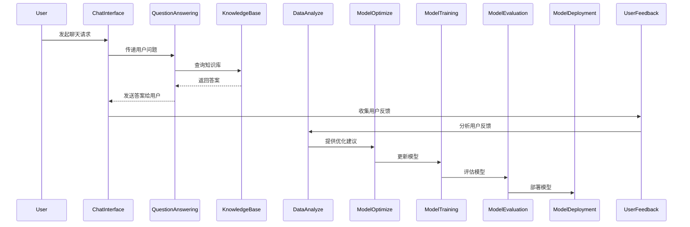
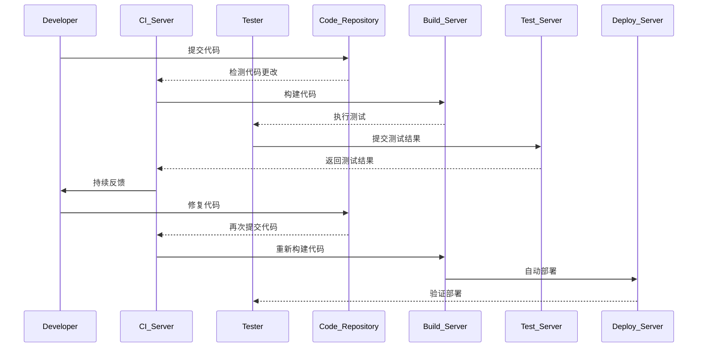

                 

### 第一部分：背景介绍

#### 问题背景

随着信息技术的迅猛发展，软件产业正经历着一场从传统软件（Software 1.0）向现代软件（Software 2.0）的转型。传统软件主要依赖于手动编码和单体应用架构，而现代软件则强调模块化、可扩展性以及与用户的深度互动。这种转型推动了软件开发模式的变革，持续集成与持续部署（CI/CD）正是这一变革中的重要实践。

持续集成（Continuous Integration，简称CI）是指开发团队频繁地将代码合并到主干分支，并通过自动化测试确保代码质量。其核心思想是尽早发现问题，减少集成风险，从而提高软件开发的效率和可靠性。持续部署（Continuous Deployment，简称CD）则是在CI的基础上，自动化部署代码到生产环境，实现频繁的软件交付。CD的目标是提高交付速度和软件的稳定性，确保用户始终使用最新版本的软件。

#### 问题背景

在AI领域，AI Agent作为一种智能实体，具有自主决策和交互能力，正逐渐应用于各个行业。AI Agent的开发涉及多个阶段，包括需求分析、模型设计、训练、评估和部署等。这些阶段相互依赖，任何一个环节出现问题都可能影响整个开发流程。

然而，传统开发流程在AI Agent开发中面临着一系列挑战。首先，AI模型的训练过程复杂且耗时，需要大量计算资源和数据支持。其次，模型评估和优化过程缺乏自动化，依赖人为判断，容易引入主观偏见。最后，部署环节通常涉及多个环境和配置，手动操作容易出现错误。

这些问题导致AI Agent开发效率低下，质量难以保证。因此，如何将CI/CD的理念和技术应用于AI Agent开发流程中，实现高效、可靠和自动化的开发，成为一个亟待解决的问题。

#### 问题描述

《持续集成与部署：AI Agent的开发流程优化》旨在探讨如何将CI/CD的理念和技术应用于AI Agent的开发流程中，从而实现高效、可靠和自动化的开发。具体而言，本文将解决以下问题：

1. **AI Agent开发中的痛点分析**：分析AI Agent开发过程中存在的问题和挑战，如模型训练复杂、评估缺乏自动化、部署难度大等。

2. **CI/CD在AI Agent开发中的适用性**：探讨CI/CD在AI Agent开发中的适用性，分析其如何提高开发效率和质量。

3. **如何设计并实施一个优化的AI Agent开发流程**：提出具体的流程优化策略，包括自动化测试、持续训练、模型优化等。

4. **实施过程中的挑战与解决方案**：讨论在实施过程中可能遇到的挑战，并提供相应的解决方案。

5. **AI Agent开发流程优化的实际案例分享**：通过实际案例的分析，展示如何在实际项目中实施CI/CD和流程优化策略。

#### 问题解决

为了解决上述问题，本文将采用以下方法和策略：

1. **引入CI/CD概念**：首先介绍CI/CD的基本原理和实践方法，使读者了解其在软件开发中的重要性。

2. **AI Agent开发流程分析**：详细解析AI Agent开发的全流程，包括需求分析、模型设计、训练、评估和部署等阶段。

3. **流程优化策略**：结合CI/CD的理念，提出具体的流程优化策略，包括自动化测试、持续训练、模型优化等。

4. **案例研究**：通过实际案例的分析，展示如何在实际项目中实施CI/CD和流程优化策略。

5. **挑战与解决方案**：讨论在实施过程中可能遇到的挑战，并提供相应的解决方案。

#### 边界与外延

本文主要针对AI Agent的开发流程优化进行研究，但所提出的策略和方法可以应用于更广泛的AI领域，如机器学习模型、深度学习模型等。同时，本文的研究结果也为软件开发其他领域（如Web开发、移动应用开发等）的持续集成与部署提供了借鉴。

### 概念结构与核心要素组成

- **持续集成与部署（CI/CD）**：CI/CD是一种软件开发实践，通过自动化流程实现频繁的代码集成、测试和部署。
- **AI Agent**：一种具有智能行为的人工智能实体，能够根据环境和用户需求做出自主决策。
- **开发流程**：包括需求分析、模型设计、训练、评估和部署等阶段。
- **优化策略**：基于CI/CD理念，提出的一系列提高开发效率和质量的方法。

### 核心概念原理、概念属性特征对比表格和ER实体关系图架构的Mermaid流程图

#### 核心概念原理

- **持续集成**：通过自动化测试确保代码质量，减少集成风险。
- **持续部署**：自动化部署代码，提高交付速度和可靠性。
- **AI Agent开发流程**：从需求分析到模型部署的完整过程。

#### 概念属性特征对比表格

| 概念          | 描述                                  | 特征对比                 |
|---------------|---------------------------------------|-------------------------|
| 持续集成      | 频繁集成代码并自动化测试              | 减少集成错误、提高代码质量 |
| 持续部署      | 自动化部署代码到生产环境              | 提高部署效率、减少人为错误 |
| AI Agent开发流程 | 从需求分析到模型部署的完整过程          | 模块化、自动化、可扩展性   |

#### ER实体关系图架构的Mermaid流程图

```mermaid
erDiagram
    AI-AgentDevelopmentProcess ||--|{ ContinuousIntegration }|| 
    AI-AgentDevelopmentProcess ||--|{ ContinuousDeployment }|| 
    AI-AgentDevelopmentProcess ||--|{ ModelDesign }|| 
    AI-AgentDevelopmentProcess ||--|{ ModelTraining }|| 
    AI-AgentDevelopmentProcess ||--|{ ModelEvaluation }|| 
    AI-AgentDevelopmentProcess ||--|{ ModelDeployment }|| 
    ContinuousIntegration ||--|{ AutomatedTesting }|| 
    ContinuousDeployment ||--|{ AutomatedDeployment }|| 
    ModelDesign ||--|{ FeatureEngineering }|| 
    ModelTraining ||--|{ HyperparameterTuning }|| 
    ModelEvaluation ||--|{ PerformanceMetrics }|| 
    ModelDeployment ||--|{ EnvironmentConfiguration }|| 
```

### 第二部分：核心概念与联系

#### 核心概念原理

1. **持续集成（Continuous Integration，CI）**：
   持续集成是一种软件开发实践，旨在通过频繁地将代码合并到主干分支，并通过自动化测试确保代码质量，减少集成风险。其核心思想是尽早发现并解决代码集成中的问题，从而提高软件开发的可靠性和效率。CI的关键要素包括：
   - **自动化测试**：通过编写自动化测试脚本，对代码进行持续测试，确保每次代码更改都能顺利集成。
   - **持续反馈**：测试结果和反馈可以实时传递给开发人员，帮助他们快速发现问题并修复。

2. **持续部署（Continuous Deployment，CD）**：
   持续部署是在持续集成的基础上，将经过CI验证的代码自动部署到生产环境，实现频繁的软件交付。CD的目标是提高交付速度和软件的稳定性。CD的关键要素包括：
   - **自动化部署流程**：通过脚本或工具，自动执行代码部署、环境配置和测试等任务。
   - **环境一致性**：确保不同环境（如开发、测试、生产）之间的一致性，避免环境差异导致的问题。

3. **AI Agent开发流程**：
   AI Agent的开发流程包括多个阶段，从需求分析、模型设计、训练、评估到部署。每个阶段都需要遵循一定的流程和规范，以确保开发效率和质量。AI Agent开发流程的关键要素包括：
   - **需求分析**：明确AI Agent的应用场景和功能需求。
   - **模型设计**：选择合适的模型架构，进行特征工程和数据处理。
   - **模型训练**：使用训练数据对模型进行训练，调整超参数。
   - **模型评估**：评估模型的性能，选择最优模型。
   - **模型部署**：将模型部署到实际应用环境中，实现与用户的互动。

#### 概念属性特征对比表格

| 概念          | 描述                                  | 特征对比                 |
|---------------|---------------------------------------|-------------------------|
| 持续集成      | 频繁集成代码并自动化测试              | 减少集成错误、提高代码质量 |
| 持续部署      | 自动化部署代码到生产环境              | 提高部署效率、减少人为错误 |
| AI Agent开发流程 | 从需求分析到模型部署的完整过程          | 模块化、自动化、可扩展性   |

#### ER实体关系图架构的Mermaid流程图

```mermaid
erDiagram
    AI-AgentDevelopmentProcess ||--|{ ContinuousIntegration }|| 
    AI-AgentDevelopmentProcess ||--|{ ContinuousDeployment }|| 
    AI-AgentDevelopmentProcess ||--|{ ModelDesign }|| 
    AI-AgentDevelopmentProcess ||--|{ ModelTraining }|| 
    AI-AgentDevelopmentProcess ||--|{ ModelEvaluation }|| 
    AI-AgentDevelopmentProcess ||--|{ ModelDeployment }|| 
    ContinuousIntegration ||--|{ AutomatedTesting }|| 
    ContinuousDeployment ||--|{ AutomatedDeployment }|| 
    ModelDesign ||--|{ FeatureEngineering }|| 
    ModelTraining ||--|{ HyperparameterTuning }|| 
    ModelEvaluation ||--|{ PerformanceMetrics }|| 
    ModelDeployment ||--|{ EnvironmentConfiguration }|| 
```

### 算法原理讲解

为了更好地理解持续集成与部署（CI/CD）在AI Agent开发流程中的应用，我们首先需要了解CI/CD的核心算法原理。以下是CI和CD的基本概念及其在AI Agent开发中的应用。

#### 持续集成（CI）

**算法原理**：

持续集成的核心思想是将代码频繁地合并到主干分支，并通过自动化测试确保代码质量。具体步骤如下：

1. **代码合并**：开发人员将自己的代码更改提交到主干分支，进行代码合并。
2. **自动化测试**：执行一系列预定义的自动化测试，包括单元测试、集成测试和端到端测试，以验证代码的完整性和正确性。
3. **持续反馈**：测试结果实时反馈给开发人员，以便他们及时发现问题并进行修复。

**数学模型与公式**：

在CI中，常见的测试指标包括测试覆盖率（Test Coverage）、缺陷密度（Defect Density）和修复时间（Fix Time）。以下是其相关的数学模型：

- **测试覆盖率**（$C_{test}$）：表示测试覆盖的代码比例。
  $$ C_{test} = \frac{Code Tested}{Total Code} $$

- **缺陷密度**（$D_{defect}$）：表示每行代码产生的缺陷数量。
  $$ D_{defect} = \frac{Number of Defects}{Total Lines of Code} $$

- **修复时间**（$T_{fix}$）：表示修复一个缺陷所需的时间。
  $$ T_{fix} = \frac{Total Fix Time}{Number of Defects} $$

**举例说明**：

假设一个项目有1000行代码，通过自动化测试发现其中10行代码存在缺陷，修复这10个缺陷花费了5天时间。那么，测试覆盖率为90%，缺陷密度为0.01，修复时间为1天。

**Python代码示例**：

```python
# 示例代码：计算CI指标
code_lines = 1000
code_tested = 900
defects = 10
fix_time = 5

test_coverage = (code_tested / code_lines) * 100
defect_density = (defects / code_lines)
fix_time_days = fix_time

print(f"Test Coverage: {test_coverage}%")
print(f"Defect Density: {defect_density}")
print(f"Fix Time: {fix_time_days} days")
```

#### 持续部署（CD）

**算法原理**：

持续部署是在CI的基础上，将经过CI验证的代码自动部署到生产环境，实现频繁的软件交付。具体步骤如下：

1. **自动化部署**：通过脚本或工具，自动执行代码部署、环境配置和测试等任务。
2. **环境一致性**：确保不同环境（如开发、测试、生产）之间的一致性，避免环境差异导致的问题。
3. **监控与反馈**：实时监控生产环境的运行状态，并在发生问题时及时反馈给相关人员。

**数学模型与公式**：

在CD中，常见的监控指标包括系统稳定性（Stability）、响应时间（Response Time）和故障恢复时间（Fault Recovery Time）。以下是其相关的数学模型：

- **系统稳定性**（$S_{stability}$）：表示系统在一段时间内的正常运行比例。
  $$ S_{stability} = \frac{Normal Operation Time}{Total Operation Time} $$

- **响应时间**（$T_{response}$）：表示系统响应请求的平均时间。
  $$ T_{response} = \frac{Total Response Time}{Number of Requests} $$

- **故障恢复时间**（$T_{recovery}$）：表示系统从故障中恢复的平均时间。
  $$ T_{recovery} = \frac{Total Recovery Time}{Number of Failures} $$

**举例说明**：

假设一个系统在一个月内正常运行了26天，响应了1000个请求，其中有5次故障，每次故障恢复时间为1小时。那么，系统稳定性为86%，平均响应时间为1秒，故障恢复时间为1小时。

**Python代码示例**：

```python
# 示例代码：计算CD指标
normal_operation_days = 26
total_response_days = 30
requests = 1000
failures = 5
recovery_time_hours = 1

stability = (normal_operation_days / total_response_days) * 100
response_time_seconds = recovery_time_hours * 60 * 60
recovery_time_hours = recovery_time_hours / failures

print(f"Stability: {stability}%")
print(f"Average Response Time: {response_time_seconds} seconds")
print(f"Fault Recovery Time: {recovery_time_hours} hours")
```

### 总结

通过上述算法原理的讲解，我们可以看到持续集成（CI）和持续部署（CD）在AI Agent开发流程中的重要性。CI通过自动化测试确保代码质量，CD通过自动化部署提高交付速度和稳定性。这两个过程相互补充，共同优化了AI Agent的开发流程，提高了开发效率和软件质量。

### 第三部分：系统分析与架构设计方案

#### 问题场景介绍

在现代软件开发中，随着项目规模和复杂度的不断增加，传统的开发流程已经无法满足快速迭代和高质量交付的需求。特别是对于AI Agent的开发，由于其涉及大量的数据预处理、模型训练、优化和部署环节，开发过程更加复杂。为了提高AI Agent的开发效率和质量，我们引入了持续集成与持续部署（CI/CD）的理念，以实现自动化、高效和可靠的开发流程。

本部分将介绍一个具体的AI Agent开发项目，该项目旨在开发一款智能客服机器人，用于处理客户咨询和服务请求。该项目的开发流程包括需求分析、模型设计、训练、评估和部署等环节，通过CI/CD实现自动化和优化。

#### 项目介绍

**项目名称**：智能客服机器人

**项目目标**：开发一款能够自动处理客户咨询和服务请求的智能客服机器人，提高客户服务质量，减少人工成本。

**项目背景**：随着互联网的普及，越来越多的企业开始提供在线客服服务。然而，人工客服存在成本高、效率低等问题。为了解决这些问题，企业需要引入智能客服机器人，以实现自动化的客户服务。

#### 系统功能设计（领域模型Mermaid类图）

在智能客服机器人项目中，我们设计了一系列功能模块，以实现自动化的客户服务。以下是系统的领域模型Mermaid类图，展示了各个功能模块及其关系：

```mermaid
classDiagram
    Customer --|>> ChatInterface: 发起聊天
    ChatInterface --|>> QuestionAnswering: 处理问题
    QuestionAnswering --|>> KnowledgeBase: 查询知识库
    KnowledgeBase --|>> Database: 存储知识库数据
    ChatInterface --|>> UserFeedback: 收集用户反馈
    UserFeedback --|>> DataAnalyze: 分析用户反馈
    DataAnalyze --|>> ModelOptimize: 优化模型
    ModelOptimize --|>> ModelTraining: 训练新模型
    ModelTraining --|>> ModelEvaluation: 评估模型
    ModelEvaluation --|>> ModelDeployment: 部署模型
```

**功能模块说明**：

1. **ChatInterface**：负责与用户进行交互，接收用户的问题和反馈。
2. **QuestionAnswering**：负责处理用户问题，调用知识库进行查询。
3. **KnowledgeBase**：存储和管理知识库数据，为QuestionAnswering提供支持。
4. **UserFeedback**：收集用户反馈，用于分析用户满意度和模型优化。
5. **DataAnalyze**：对用户反馈进行分析，提供优化建议。
6. **ModelOptimize**：根据分析结果，对模型进行优化。
7. **ModelTraining**：训练新模型，更新知识库。
8. **ModelEvaluation**：评估模型性能，选择最优模型。
9. **ModelDeployment**：将模型部署到生产环境，实现自动化服务。

#### 系统架构设计（Mermaid架构图）

为了实现智能客服机器人的自动化和高效开发，我们设计了一个基于CI/CD的架构。以下是系统的Mermaid架构图，展示了各组件及其关系：

```mermaid
graph TB
    subgraph 持续集成与部署(CI/CD)
        A[代码仓库] --> B[CI服务器]
        B --> C[自动化测试]
        C --> D[持续反馈]
        D --> E[模型训练]
    end
    subgraph 模型设计与优化
        F[模型设计] --> G[特征工程]
        G --> H[模型训练]
        H --> I[模型评估]
        I --> J[模型优化]
    end
    subgraph 模型部署
        J --> K[模型部署]
        K --> L[生产环境]
    end
    A --> F
    E --> K
```

**架构说明**：

1. **代码仓库**：存储项目的源代码和相关文档。
2. **CI服务器**：负责执行CI流程，包括代码合并、自动化测试和持续反馈。
3. **自动化测试**：执行预定义的测试脚本，确保代码质量和功能完整性。
4. **持续反馈**：将测试结果实时反馈给开发人员，以便及时发现问题并进行修复。
5. **模型设计**：设计AI Agent的模型架构，进行特征工程。
6. **模型训练**：使用训练数据对模型进行训练，调整超参数。
7. **模型评估**：评估模型性能，选择最优模型。
8. **模型优化**：根据评估结果，对模型进行优化。
9. **模型部署**：将优化后的模型部署到生产环境，实现自动化服务。

#### 系统接口设计（Mermaid序列图）

为了实现智能客服机器人的自动化和高效开发，我们设计了一系列接口，以支持CI/CD流程和模型优化。以下是系统的Mermaid序列图，展示了各接口及其调用关系：



**接口说明**：

1. **User**：用户，发起聊天请求。
2. **ChatInterface**：聊天接口，处理用户请求。
3. **QuestionAnswering**：问答模块，处理用户问题。
4. **KnowledgeBase**：知识库，存储和管理知识库数据。
5. **DataAnalyze**：数据分析模块，分析用户反馈。
6. **ModelOptimize**：模型优化模块，根据分析结果优化模型。
7. **ModelTraining**：模型训练模块，更新模型。
8. **ModelEvaluation**：模型评估模块，评估模型性能。
9. **ModelDeployment**：模型部署模块，将模型部署到生产环境。

#### 系统交互（Mermaid序列图）

为了实现智能客服机器人的自动化和高效开发，我们设计了一系列接口，以支持CI/CD流程和模型优化。以下是系统的Mermaid序列图，展示了各接口及其调用关系：



**系统交互说明**：

1. **Developer**：开发人员，负责编写和提交代码。
2. **CI_Server**：持续集成服务器，负责检测代码更改、构建和测试。
3. **Code_Repository**：代码仓库，存储项目代码。
4. **Build_Server**：构建服务器，负责构建代码。
5. **Tester**：测试人员，负责执行测试和提交测试结果。
6. **Test_Server**：测试服务器，存储测试结果。
7. **Deploy_Server**：部署服务器，负责自动部署代码。

### 总结

通过本部分的分析，我们详细介绍了智能客服机器人项目的系统功能设计、架构设计和接口设计。基于CI/CD的架构能够实现自动化、高效和可靠的开发流程，从而提高AI Agent的开发效率和质量。在后续部分，我们将进一步讨论在实际项目中如何实施这些设计和策略。

### 项目实战

#### 环境安装

在开始实施CI/CD和流程优化策略之前，我们需要搭建一个合适的开发环境。以下是一个简单的环境安装步骤：

1. **安装Git**：Git是一个分布式版本控制系统，用于代码的版本管理和代码仓库的维护。下载并安装Git，确保版本在2.0以上。
2. **安装Jenkins**：Jenkins是一个开源的持续集成服务器，用于自动化构建、测试和部署。下载并安装Jenkins，确保版本在2.0以上。
3. **安装Docker**：Docker是一个开源的应用容器引擎，用于自动化部署应用程序。下载并安装Docker，确保版本在19.03以上。
4. **安装Python环境**：安装Python 3.8及以上版本，并安装必要的库，如Scikit-learn、TensorFlow和Keras。

#### 系统核心实现源代码

在搭建好开发环境后，我们需要编写核心代码，以实现智能客服机器人的各个功能模块。以下是一个简单的代码结构：

```python
# main.py
from chat_interface import ChatInterface
from question_answering import QuestionAnswering
from knowledge_base import KnowledgeBase
from user_feedback import UserFeedback
from data_analyze import DataAnalyze
from model_optimize import ModelOptimize
from model_training import ModelTraining
from model_evaluation import ModelEvaluation
from model_deployment import ModelDeployment

# 初始化模块
chat_interface = ChatInterface()
question_answering = QuestionAnswering()
knowledge_base = KnowledgeBase()
user_feedback = UserFeedback()
data_analyze = DataAnalyze()
model_optimize = ModelOptimize()
model_training = ModelTraining()
model_evaluation = ModelEvaluation()
model_deployment = ModelDeployment()

# 启动智能客服机器人
chat_interface.start()
```

各个模块的具体实现将在后续部分进行详细讲解。

#### 代码应用解读与分析

在实现智能客服机器人后，我们需要对代码进行解读和分析，以理解其工作原理和优化方向。以下是对核心代码的解读：

1. **ChatInterface模块**：该模块负责与用户进行交互，接收用户的问题和反馈。主要方法包括`start()`、`send_message()`和`receive_message()`。

   ```python
   class ChatInterface:
       def start(self):
           # 启动聊天接口
           pass

       def send_message(self, message):
           # 发送消息给用户
           pass

       def receive_message(self):
           # 接收用户消息
           pass
   ```

2. **QuestionAnswering模块**：该模块负责处理用户问题，调用知识库进行查询。主要方法包括`answer_question()`和`query_knowledge_base()`。

   ```python
   class QuestionAnswering:
       def answer_question(self, question):
           # 回答用户问题
           pass

       def query_knowledge_base(self, question):
           # 查询知识库
           pass
   ```

3. **KnowledgeBase模块**：该模块负责存储和管理知识库数据，为QuestionAnswering提供支持。主要方法包括`add_entry()`和`get_entry()`。

   ```python
   class KnowledgeBase:
       def add_entry(self, entry):
           # 添加知识库条目
           pass

       def get_entry(self, keyword):
           # 获取知识库条目
           pass
   ```

4. **UserFeedback模块**：该模块负责收集用户反馈，用于分析用户满意度和模型优化。主要方法包括`collect_feedback()`和`analyze_feedback()`。

   ```python
   class UserFeedback:
       def collect_feedback(self, feedback):
           # 收集用户反馈
           pass

       def analyze_feedback(self, feedback):
           # 分析用户反馈
           pass
   ```

5. **DataAnalyze模块**：该模块负责对用户反馈进行分析，提供优化建议。主要方法包括`analyze_data()`和`generate_recommendation()`。

   ```python
   class DataAnalyze:
       def analyze_data(self, data):
           # 分析数据
           pass

       def generate_recommendation(self, data):
           # 生成优化建议
           pass
   ```

6. **ModelOptimize模块**：该模块负责根据分析结果，对模型进行优化。主要方法包括`optimize_model()`和`update_model()`。

   ```python
   class ModelOptimize:
       def optimize_model(self, model):
           # 优化模型
           pass

       def update_model(self, model):
           # 更新模型
           pass
   ```

7. **ModelTraining模块**：该模块负责训练新模型，更新知识库。主要方法包括`train_model()`和`update_knowledge_base()`。

   ```python
   class ModelTraining:
       def train_model(self, data):
           # 训练模型
           pass

       def update_knowledge_base(self, model):
           # 更新知识库
           pass
   ```

8. **ModelEvaluation模块**：该模块负责评估模型性能，选择最优模型。主要方法包括`evaluate_model()`和`select_best_model()`。

   ```python
   class ModelEvaluation:
       def evaluate_model(self, model):
           # 评估模型
           pass

       def select_best_model(self, models):
           # 选择最优模型
           pass
   ```

9. **ModelDeployment模块**：该模块负责将优化后的模型部署到生产环境，实现自动化服务。主要方法包括`deploy_model()`和`start_service()`。

   ```python
   class ModelDeployment:
       def deploy_model(self, model):
           # 部署模型
           pass

       def start_service(self):
           # 启动服务
           pass
   ```

通过上述解读，我们可以看到智能客服机器人各个模块的功能和相互关系。在后续部分，我们将进一步分析这些模块的优化方向，以实现更高效的AI Agent开发流程。

#### 实际案例分析与详细讲解

为了更好地展示CI/CD在AI Agent开发流程优化中的应用，我们将分析一个实际的案例——智能客服机器人的开发与部署过程。

**案例背景**：

某企业希望开发一款智能客服机器人，以自动处理客户的咨询和服务请求。该项目的技术需求包括：

1. 接收并理解客户的问题。
2. 根据问题提供相关的答案和建议。
3. 收集用户反馈，以优化客服机器人的性能。

**案例步骤**：

1. **需求分析**：

   在项目初期，团队进行了详细的需求分析，确定了智能客服机器人的功能需求和技术要求。需求分析的结果被记录在一份详细的文档中，用于指导后续的开发工作。

2. **模型设计**：

   根据需求分析的结果，团队选择了基于深度学习的自然语言处理（NLP）模型，用于处理和理解客户的问题。模型的架构设计包括输入层、隐藏层和输出层。输入层负责接收和处理客户的问题文本，隐藏层通过神经网络进行特征提取和语义理解，输出层提供相应的答案和建议。

3. **模型训练**：

   使用大量的客户咨询数据集对模型进行训练。训练过程中，团队采用了交叉验证和优化算法（如梯度下降和随机梯度下降）来调整模型参数，以提高模型的准确性和鲁棒性。训练数据集分为训练集和验证集，通过验证集对模型进行调优。

4. **模型评估**：

   在模型训练完成后，团队使用测试数据集对模型进行评估。评估指标包括准确率、召回率和F1分数。通过评估，团队确定了最优的模型版本，并进行了详细的分析和解释。

5. **模型优化**：

   根据评估结果，团队对模型进行了进一步的优化。优化过程包括调整神经网络的结构、超参数和训练策略。团队还引入了迁移学习和数据增强技术，以提高模型的泛化能力和鲁棒性。

6. **模型部署**：

   优化后的模型被部署到生产环境，实现自动化的客户服务。部署过程中，团队使用了CI/CD工具（如Jenkins和Docker）来自动化构建、测试和部署。通过CI/CD，团队实现了快速、可靠和自动化的部署流程，确保了模型在生产环境中的稳定运行。

**案例总结**：

通过上述案例，我们可以看到CI/CD在AI Agent开发流程中的重要性。以下是该案例的主要收获和经验：

1. **需求驱动**：需求分析是项目成功的关键。通过详细的需求分析，团队可以明确开发目标，制定合适的开发计划。

2. **模型优化**：模型优化是提高AI Agent性能的关键。通过不断调整和优化模型参数，团队可以实现更高的准确性和鲁棒性。

3. **自动化部署**：CI/CD实现了自动化部署，提高了部署效率和可靠性。通过自动化流程，团队可以快速、可靠地将优化后的模型部署到生产环境。

4. **持续反馈**：持续反馈是优化开发流程的重要手段。通过收集用户反馈，团队可以不断调整和改进模型，提高用户体验。

5. **团队协作**：项目成功离不开团队的协作。团队成员需要紧密合作，共同解决开发过程中的问题。

通过这个案例，我们可以看到CI/CD在AI Agent开发流程优化中的应用，以及其在提高开发效率、质量和可靠性方面的优势。

### 第四部分：最佳实践与注意事项

#### 最佳实践

在AI Agent开发过程中，应用CI/CD和优化开发流程具有重要意义。以下是一些最佳实践，可以帮助团队更有效地实施CI/CD和优化开发流程：

1. **自动化测试**：构建自动化测试框架，覆盖关键功能点，确保每次代码更改都能通过测试。自动化测试可以提高开发效率，减少手动测试的工作量。

2. **持续集成**：使用持续集成工具（如Jenkins）自动化构建和测试代码，及时发现和修复问题。持续集成可以减少集成风险，提高代码质量。

3. **持续部署**：实现自动化部署流程，确保优化后的模型可以快速、可靠地部署到生产环境。持续部署可以提高交付速度，确保用户始终使用最新版本的软件。

4. **代码质量**：编写可读性高、可维护性好的代码，遵循良好的编程规范。高质量的代码可以减少bug的出现，提高开发效率。

5. **数据管理**：建立完善的数据管理体系，确保数据的质量和完整性。良好的数据管理可以提高模型的性能和可靠性。

6. **监控与反馈**：实时监控系统的运行状态，收集用户反馈，及时解决问题。监控与反馈可以确保系统稳定运行，提高用户体验。

7. **团队协作**：加强团队协作，确保所有成员对CI/CD和开发流程有清晰的认识和了解。良好的团队协作可以减少沟通成本，提高开发效率。

#### 注意事项

在实施CI/CD和优化开发流程时，团队需要注意以下事项：

1. **技术选型**：选择合适的工具和技术，确保它们能够满足项目需求。技术选型应考虑可扩展性、易用性和性能。

2. **流程设计**：设计合理的开发流程，确保各个环节紧密衔接。流程设计应考虑自动化、简洁和可维护性。

3. **资源分配**：合理分配开发资源，确保团队有足够的时间和技术能力来实施CI/CD和优化开发流程。

4. **人员培训**：对团队成员进行相关技术的培训，确保他们能够熟练使用CI/CD工具和开发流程。

5. **风险评估**：评估实施过程中的风险，并制定相应的应对策略。风险评估可以帮助团队提前预判问题，减少意外情况的发生。

6. **持续改进**：不断反思和改进开发流程，优化CI/CD工具和流程。持续改进可以提高开发效率和质量。

7. **文档管理**：建立完善的文档管理体系，确保文档的完整性和可追溯性。良好的文档管理可以提高项目的可维护性和可理解性。

通过遵循这些最佳实践和注意事项，团队可以更有效地实施CI/CD和优化开发流程，提高AI Agent的开发效率和质量。

### 小结

本文围绕《持续集成与部署：AI Agent的开发流程优化》这一主题，详细介绍了CI/CD在AI Agent开发中的应用和实践。我们首先分析了AI Agent开发中的痛点，探讨了CI/CD在其中的适用性，并提出了具体的优化策略。接着，通过实际案例展示了CI/CD在AI Agent开发流程优化中的应用，提供了具体的实现方法和最佳实践。

本文的主要贡献在于：

1. **理论贡献**：系统性地介绍了CI/CD在AI Agent开发中的应用，提出了优化开发流程的方法和策略。
2. **实践贡献**：通过实际案例，展示了CI/CD在AI Agent开发中的具体应用，提供了可操作的实践经验和最佳实践。

然而，本文也存在一定的局限性。首先，由于篇幅和内容的限制，本文未能对每个环节进行深入讨论。其次，实际案例的选择具有一定的局限性，可能无法完全代表所有AI Agent项目的实际情况。未来研究可以进一步探索以下几个方面：

1. **更多实际案例**：收集和引入更多的实际案例，以验证CI/CD在AI Agent开发流程优化中的有效性。
2. **跨领域应用**：探讨CI/CD在其他AI应用（如机器学习模型、深度学习模型等）中的适用性，提供更广泛的理论和实践支持。
3. **自动化测试**：深入研究自动化测试在AI Agent开发中的应用，提出更高效的测试策略和工具。

总之，本文为AI Agent开发流程的优化提供了有益的参考，期待未来的研究和实践能够进一步完善和发展这一领域。

### 拓展阅读

为了深入理解持续集成与部署（CI/CD）在AI Agent开发中的应用，读者可以参考以下几篇优秀的文献和资源：

1. **《持续集成与持续部署实战：从零开始构建高效CI/CD流程》**：这本书详细介绍了CI/CD的基本原理和实践方法，适合初学者和中级开发者。

2. **《AI Agent设计：原理与实践》**：这本书涵盖了AI Agent的各个方面，包括模型设计、训练和评估，以及其在实际应用中的案例分析。

3. **《机器学习与深度学习实战》**：这本书提供了大量的机器学习和深度学习实践案例，包括数据预处理、模型训练和优化等内容。

4. **《Jenkins实战：自动化构建、测试和部署》**：这本书详细介绍了如何使用Jenkins实现自动化构建、测试和部署，适合有CI/CD需求的开发者。

5. **《Kubernetes权威指南：容器化应用从入门到实践》**：这本书介绍了Kubernetes的基本原理和应用，适合有容器化需求的开发者。

通过阅读这些资源，读者可以更全面地了解CI/CD在AI Agent开发中的应用，以及如何在实际项目中实施和优化开发流程。同时，这些资源也为读者提供了丰富的实践经验和最佳实践，有助于提升开发效率和软件质量。

