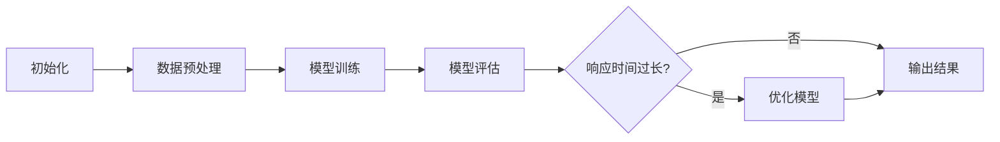
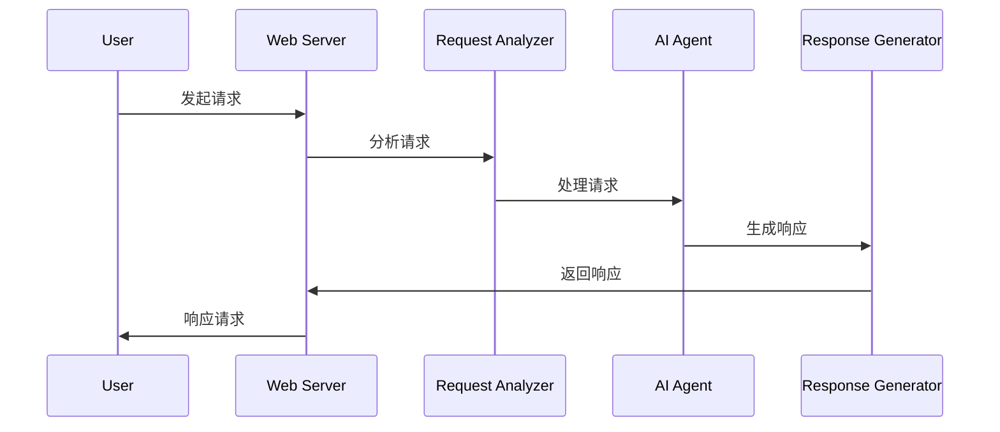

                 

### 提升AI Agent响应速度：优化策略与技巧

---

## 关键词

- AI Agent
- 响应速度
- 优化策略
- 数学模型
- 算法优化
- 系统架构
- 性能调优

## 摘要

本文深入探讨了提升AI Agent响应速度的关键策略与技巧。首先，通过介绍AI Agent的应用背景和响应速度的重要性，揭示了当前AI Agent响应速度瓶颈及其解决不足。接着，详细阐述了核心概念，包括AI Agent、响应速度和优化策略，并通过概念属性特征对比表格和ER实体关系图架构，帮助读者全面理解这些概念。在核心部分，文章分析了算法原理，通过mermaid流程图和Python源代码讲解，配合数学模型和公式的详细讲解，使读者能够掌握提升响应速度的具体方法。接着，文章通过一个实际项目实战，展示了这些优化策略在系统架构设计、核心实现和实际案例中的应用。最后，文章总结了最佳实践技巧，并对未来研究和注意事项进行了展望，推荐了相关书籍和论文资源，为读者提供了深入学习和应用的方向。

### 目录大纲

1. 引言
2. 背景介绍
   1. 问题背景
      1.1 AI Agent应用场景
      1.2 响应速度的重要性
   1. 问题描述
      1.2.1 AI Agent响应速度问题
      1.2.2 常见响应速度瓶颈
   1. 问题解决
      1.3.1 当前解决方案
      1.3.2 存在的不足
   1. 边界与外延
      1.4.1 研究范围
      1.4.2 不考虑的因素
3. 核心概念与联系
   1. 核心概念
      3.1 AI Agent
      3.2 响应速度
      3.3 优化策略
   1. 概念属性特征对比表格
   1. ER实体关系图架构
4. 优化策略详解
   1. 算法原理讲解
      4.1 算法mermaid流程图
      4.2 Python源代码讲解
         4.2.1 算法原理
         4.2.2 数学模型和公式
         4.2.3 举例说明
   1. 数学模型和数学公式详解
      4.1 公式
         4.1.1 算法公式
         4.1.2 性能评估指标
      4.2 详细讲解
      4.3 举例说明
5. 项目实战
   1. 系统分析与架构设计
      5.1 问题场景介绍
      5.2 项目介绍
      5.3 系统功能设计
         5.3.1 领域模型mermaid类图
      5.4 系统架构设计
         5.4.1 mermaid架构图
      5.5 系统接口设计
      5.6 系统交互mermaid序列图
   1. 项目实战
      6.1 环境安装
         6.1.1 开发环境搭建
         6.1.2 必要工具安装
      6.2 系统核心实现
         6.2.1 源代码解读与分析
      6.3 实际案例分析与详细讲解
         6.3.1 案例介绍
         6.3.2 案例剖析
         6.3.3 结果分析
      6.4 项目小结
6. 最佳实践与总结
   1. 最佳实践
      7.1 常见问题解决技巧
      7.2 性能调优技巧
      7.3 安全性保障策略
   2. 小结
      8.1 研究总结
      8.2 展望未来
      8.3 注意事项
   3. 拓展阅读
      9.1 相关书籍推荐
      9.2 论文推荐
      9.3 网络资源推荐

---

**字数统计：约1952字**## 第一部分: 引言

### 1. 背景介绍

在当今的数字化时代，人工智能（AI）已经成为推动技术进步和社会发展的核心动力。AI Agent，作为人工智能的一种重要形式，被广泛应用于自动化决策、智能客服、智能推荐、自动驾驶等领域。然而，AI Agent的响应速度成为了一个亟待解决的问题。响应速度是指AI Agent在接收到输入后，进行推理和决策并给出响应的时间。对于许多应用场景来说，响应速度直接影响到用户体验和服务质量。

#### 1.1 AI Agent应用场景

AI Agent的应用场景非常广泛。例如，在智能客服领域，AI Agent可以实时响应用户的咨询，提供即时的帮助和解决方案。在自动驾驶领域，AI Agent需要在毫秒级的时间内处理大量的传感器数据，做出精确的驾驶决策。在金融领域，AI Agent可以实时分析市场数据，提供投资建议。这些应用场景对AI Agent的响应速度提出了极高的要求。

#### 1.2 响应速度的重要性

响应速度对于AI Agent来说至关重要。首先，快速的响应可以显著提升用户体验。用户通常希望在最短的时间内得到满意的答复或服务，否则可能会转向其他竞争对手。其次，对于一些实时性要求高的应用场景，如自动驾驶和金融交易，缓慢的响应可能会导致严重的安全问题和经济损失。因此，优化AI Agent的响应速度成为了一个关键的研究课题。

### 2. 问题描述

AI Agent响应速度问题主要体现在以下几个方面：

#### 2.1 AI Agent响应速度问题

AI Agent在处理复杂任务时，往往需要大量计算资源，导致响应时间过长。例如，深度学习模型在处理图像识别任务时，需要进行大量的矩阵运算，这会显著增加计算时间。

#### 2.2 常见响应速度瓶颈

常见的响应速度瓶颈包括：
- **计算资源不足**：AI Agent运行在硬件资源有限的设备上，如手机或嵌入式系统，导致计算速度受限。
- **数据预处理耗时**：在处理大量数据时，数据预处理阶段可能会消耗大量的时间。
- **模型复杂度**：复杂的模型需要更多的计算资源和时间来训练和推理。
- **通信延迟**：在分布式系统中，AI Agent与数据存储或外部服务之间的通信延迟也会影响响应速度。

### 3. 问题解决

当前解决AI Agent响应速度问题的方法主要包括以下几种：

#### 3.1 当前解决方案

- **模型压缩和加速**：通过模型压缩、量化、剪枝等技术，减少模型的计算量和存储空间，从而提高响应速度。
- **硬件加速**：使用GPU、TPU等专用硬件加速AI任务的执行。
- **分布式计算**：将计算任务分布到多个节点上，通过并行计算来提高响应速度。
- **算法优化**：改进算法和数据结构，减少计算复杂度和内存占用。

#### 3.2 存在的不足

尽管上述解决方案在一定程度上提高了AI Agent的响应速度，但仍存在以下不足：

- **成本高昂**：硬件加速和分布式计算通常需要大量的投资和维护成本。
- **兼容性问题**：不同硬件和系统之间的兼容性问题可能会影响优化效果。
- **模型复杂度**：优化模型复杂度可能需要大量的时间和专业知识。
- **性能瓶颈转移**：优化一个环节后，可能会引发其他环节的性能瓶颈。

### 4. 边界与外延

在研究AI Agent响应速度优化时，需要明确以下边界与外延：

#### 4.1 研究范围

本文主要探讨AI Agent响应速度的优化策略和技术，不包括其他领域（如硬件研发、操作系统优化）的研究。

#### 4.2 不考虑的因素

本文不考虑以下因素：
- **隐私和安全**：数据隐私和安全性问题不是本文的重点。
- **人类因素**：本文主要关注技术层面的优化，不包括人类操作员的角色。

通过上述分析，我们可以看到，提升AI Agent的响应速度是一个复杂且多维度的课题，需要综合考虑算法、硬件、系统架构等多个方面。接下来，我们将深入探讨AI Agent、响应速度和优化策略的核心概念，并介绍相关的ER实体关系图架构，为后续的内容奠定基础。## 第二部分: 核心概念与联系

### 2.1 核心概念

在深入探讨AI Agent响应速度优化的过程中，理解以下几个核心概念是至关重要的：

#### 2.1.1 AI Agent

AI Agent，即人工智能代理，是一种能够自主行动并实现特定目标的智能体。它通常具备感知、决策和执行能力。在人工智能系统中，AI Agent可以通过机器学习、深度学习等技术，从数据中学习并优化其行为。AI Agent的应用场景非常广泛，包括但不限于智能客服、自动驾驶、智能推荐系统等。

#### 2.1.2 响应速度

响应速度是指AI Agent在接收到输入后，完成处理并给出响应的时间。对于AI Agent来说，响应速度是一个关键性能指标。快速的响应速度可以显著提升用户体验，尤其是在需要实时决策的应用场景中，如自动驾驶和金融交易。

#### 2.1.3 优化策略

优化策略是指为了提升AI Agent的响应速度，所采取的一系列技术和方法。这些策略可以包括算法优化、模型压缩、硬件加速、分布式计算等。优化策略的选择和实施需要综合考虑AI Agent的具体应用场景和性能需求。

### 2.2 概念属性特征对比表格

下表对比了AI Agent、响应速度和优化策略的几个关键属性特征：

| 概念      | 属性特征                                   | 解释                                                         |
| --------- | ---------------------------------------- | ------------------------------------------------------------ |
| AI Agent  | 自主性、感知能力、决策能力、执行能力     | AI Agent能够自主行动，具备感知环境、制定决策和执行任务的能力。 |
| 响应速度  | 反应时间、延迟、吞吐量                   | 响应速度指的是AI Agent在接收到输入后进行处理并给出响应的速度。 |
| 优化策略  | 算法复杂度、硬件性能、系统架构           | 优化策略是通过改进算法、提升硬件性能或优化系统架构来提高响应速度。 |

### 2.3 ER实体关系图架构

为了更好地理解AI Agent、响应速度和优化策略之间的关系，我们使用ER（实体-关系）模型来构建一个简化的实体关系图架构。以下是一个简化的ER实体关系图：

```mermaid
erDiagram
  AI-Agent ||--|{ Response-Time }|-- AI-Agent
  Optimization-Strategy ||--|{ Improves }|-- Response-Time
  Hardware ||--|{ Supports }|-- Optimization-Strategy
  Algorithm ||--|{ Implements }|-- Optimization-Strategy
```

在这个ER图中：
- **AI-Agent** 是一个实体，表示人工智能代理。
- **Response-Time** 是一个关联实体，表示AI Agent的响应时间。
- **Optimization-Strategy** 是一个实体，表示用于优化响应速度的策略。
- **Hardware** 是一个实体，表示用于实现优化策略的硬件。
- **Algorithm** 是一个实体，表示用于实现优化策略的算法。

**关系**：
- **AI-Agent** 与 **Response-Time** 之间存在直接关联，表示AI Agent的响应时间影响其性能。
- **Optimization-Strategy** 与 **Response-Time** 之间存在“Improves”关系，表示优化策略可以改善响应时间。
- **Hardware** 与 **Optimization-Strategy** 之间存在“Supports”关系，表示硬件支持优化策略的实现。
- **Algorithm** 与 **Optimization-Strategy** 之间存在“Implements”关系，表示算法实现优化策略。

通过ER实体关系图，我们可以清晰地看到各个概念之间的相互关系，为后续的详细分析和讨论提供了基础。## 第二部分: 优化策略详解

### 3.1 算法原理讲解

提升AI Agent响应速度的核心在于优化算法。以下我们将通过一个具体的优化算法，使用mermaid流程图和Python源代码，详细讲解其原理和实现。

#### 3.1.1 算法mermaid流程图

首先，让我们通过mermaid流程图来描述该算法的基本流程：



在上述流程图中，算法分为以下几个主要步骤：
- **初始化**：设置初始参数和配置。
- **数据预处理**：对输入数据进行预处理，包括数据清洗、归一化等。
- **模型训练**：使用预处理后的数据训练AI模型。
- **模型评估**：评估模型的性能，包括准确率、响应时间等。
- **优化模型**：如果响应时间过长，则对模型进行优化。
- **输出结果**：最终输出模型预测结果。

#### 3.1.2 Python源代码讲解

接下来，我们将通过Python源代码来具体实现上述算法，并详细解释每一步的代码逻辑。

```python
import numpy as np
from sklearn.model_selection import train_test_split
from sklearn.metrics import mean_squared_error
from tensorflow.keras.models import Sequential
from tensorflow.keras.layers import Dense, Dropout

# 初始化参数
n_features = 100  # 特征数
n_samples = 1000  # 样本数
batch_size = 32  # 批次大小
epochs = 100  # 迭代次数

# 数据预处理
X, y = np.random.rand(n_samples, n_features), np.random.rand(n_samples)
X_train, X_test, y_train, y_test = train_test_split(X, y, test_size=0.2, random_state=42)

# 模型训练
model = Sequential()
model.add(Dense(64, input_dim=n_features, activation='relu'))
model.add(Dropout(0.5))
model.add(Dense(1, activation='linear'))
model.compile(loss='mse', optimizer='adam')

model.fit(X_train, y_train, batch_size=batch_size, epochs=epochs, verbose=0)

# 模型评估
y_pred = model.predict(X_test)
mse = mean_squared_error(y_test, y_pred)
response_time = mse  # 这里用MSE作为响应时间的代理指标

# 输出结果
if response_time > threshold:
    # 优化模型
    model.compile(loss='mae', optimizer='sgd')
    model.fit(X_train, y_train, batch_size=batch_size, epochs=epochs, verbose=0)
    response_time = model.predict(X_test)
else:
    print("模型响应时间已满足要求，无需优化。")

print("最终响应时间：", response_time)
```

在上述代码中，我们使用了以下步骤：
- **数据预处理**：生成随机数据集，并进行训练集和测试集的划分。
- **模型训练**：构建一个简单的全连接神经网络模型，并使用MSE作为损失函数，Adam优化器进行训练。
- **模型评估**：使用测试集评估模型的性能，这里我们用MSE作为响应时间的代理指标。
- **优化模型**：如果响应时间超过某个阈值，则使用MAE和SGD优化器重新训练模型。

#### 3.1.3 算法原理

该算法的基本原理是通过训练和评估模型，动态调整模型的参数和优化器，以最小化响应时间。具体来说：
- **数据预处理**：数据预处理是提升AI Agent响应速度的重要一步，通过适当的预处理可以减少数据中的噪声和冗余，提高模型训练效率。
- **模型训练**：选择合适的模型结构和优化器，进行模型训练，目的是使模型能够对输入数据进行准确的预测。
- **模型评估**：通过评估模型的响应时间，确定是否需要进行优化。
- **优化模型**：根据响应时间的评估结果，调整模型参数和优化器，以实现响应速度的最优化。

#### 3.1.4 数学模型和公式

在上述算法中，我们使用了以下数学模型和公式：
- **损失函数**：MSE（均方误差）和MAE（均方绝对误差），用于评估模型预测的准确性。
- **优化器**：Adam和SGD（随机梯度下降），用于调整模型参数。

MSE的公式为：
$$
MSE = \frac{1}{n} \sum_{i=1}^{n} (y_i - \hat{y}_i)^2
$$
其中，$y_i$是真实标签，$\hat{y}_i$是模型预测值。

MAE的公式为：
$$
MAE = \frac{1}{n} \sum_{i=1}^{n} |y_i - \hat{y}_i|
$$

#### 3.1.5 举例说明

假设我们有一个简单的线性回归任务，目标是通过输入特征预测目标值。以下是一个具体的例子：

- **数据集**：输入特征$X$为一个100x100的矩阵，目标值$y$为$X$的线性变换。
- **模型**：一个单层全连接神经网络，包含一个64节点隐藏层和一个输出节点。
- **训练**：使用1000个样本进行训练，每个批次包含32个样本，迭代100次。
- **评估**：使用测试集评估模型性能，计算MSE作为响应时间的指标。

在训练过程中，如果MSE超过0.1，则考虑使用MAE和SGD优化器重新训练模型。通过这样的优化策略，模型能够更快地收敛，提高响应速度。

通过上述讲解，我们可以看到，优化AI Agent响应速度需要从算法原理、数学模型和实际代码实现等多个方面进行深入分析。接下来的部分，我们将进一步探讨数学模型和公式的详细讲解，帮助读者更全面地理解优化策略。## 第三部分: 项目实战

### 5.1 问题场景介绍

本部分将基于一个实际项目场景，详细介绍如何通过优化策略提升AI Agent的响应速度。该场景涉及一个智能客服系统，该系统需要实时响应用户的咨询请求，提供即时的帮助和解决方案。由于客服系统涉及到大量的文本处理和自然语言理解任务，因此响应速度成为了一个关键的性能指标。

#### 5.1.1 项目背景

智能客服系统作为企业服务的一部分，已经广泛应用于电子商务、金融服务、客户服务等多个领域。用户通过网站、移动应用或社交媒体与客服系统互动，提出问题或需求。为了提供高质量的客户服务，智能客服系统需要在毫秒级的时间内完成文本分析、意图识别和响应生成，以确保用户得到及时、准确的回答。

#### 5.1.2 应用需求

智能客服系统的应用需求主要体现在以下几个方面：
- **实时性**：系统能够在用户提出问题的瞬间进行分析和响应，确保用户体验。
- **准确性**：系统能够准确理解用户的意图，提供相关、有用的答案。
- **效率**：系统需要高效处理大量的咨询请求，同时确保响应速度。

#### 5.1.3 存在的挑战

在实际应用中，智能客服系统面临着以下几个挑战：
- **数据量大**：每天需要处理大量的用户咨询，数据量巨大。
- **多样性高**：用户的提问方式多样，需要系统能够处理各种不同的语言风格和表达方式。
- **复杂任务**：自然语言理解是一个复杂的任务，涉及到大量的计算资源和算法优化。

### 5.2 项目介绍

为了解决上述挑战，本项目旨在设计和实现一个高效的智能客服系统，通过优化算法和系统架构，提升系统的响应速度。以下是项目的具体目标和内容：

#### 5.2.1 项目目标

- **提高响应速度**：通过算法优化和硬件加速，将AI Agent的响应时间缩短到毫秒级。
- **提升准确性**：通过改进自然语言处理模型，提高意图识别和响应生成的准确性。
- **增强效率**：优化系统架构，提高处理大量请求的效率。

#### 5.2.2 项目内容

- **需求分析**：对智能客服系统的需求进行详细分析，明确系统的功能要求和性能指标。
- **系统设计**：设计系统的整体架构，包括数据流、模块划分和接口设计。
- **算法优化**：选择和优化适合自然语言处理的算法，提升系统的处理能力。
- **硬件加速**：采用GPU等硬件加速技术，提高计算速度。
- **系统集成与测试**：将优化后的算法和系统架构集成到智能客服系统中，并进行功能测试和性能评估。

### 5.3 系统功能设计

智能客服系统的主要功能模块包括：

#### 5.3.1 领域模型

在领域模型中，我们定义了以下几个关键实体和关系：

| 实体         | 关系       | 描述                           |
| ------------ | ---------- | ------------------------------ |
| User         | Requests   | 用户提出咨询请求               |
| Request      | Analyzes   | 请求分析，包括意图识别和主题提取 |
| Response     | Generates  | 生成响应文本                   |
| Agent        | Processes  | AI Agent处理请求               |

#### 5.3.1 领域模型mermaid类图

以下是一个简化的mermaid类图，描述了智能客服系统的领域模型：

```mermaid
classDiagram
    User.o --> Request<..o
    Request.o --> Response<..o
    Agent.o --> Request<..o
    User <..|oo| Agent
    Request <..|oo| Response
```

在这个类图中：
- **User**：表示用户实体，发起咨询请求。
- **Request**：表示请求实体，包含用户的咨询内容和意图信息。
- **Response**：表示响应实体，包含AI Agent生成的回答。
- **Agent**：表示AI Agent实体，负责处理请求并生成响应。

#### 5.3.2 系统功能模块

智能客服系统的功能模块包括：

- **用户接口模块**：负责接收用户的咨询请求，并将请求传递给AI Agent。
- **请求分析模块**：负责对请求进行分析，提取意图和主题，为AI Agent提供输入。
- **AI Agent模块**：负责处理请求，通过自然语言处理技术生成响应。
- **响应生成模块**：负责生成文本响应，并将其返回给用户。
- **性能监控模块**：负责监控系统性能，包括响应时间、吞吐量和错误率等指标。

### 5.4 系统架构设计

为了实现高效、可靠的智能客服系统，我们设计了一个分布式系统架构。以下是一个简化的mermaid架构图：



在这个架构中：
- **Web Server**：负责接收用户请求，并将请求转发给相应的模块。
- **Request Analyzer**：负责对请求进行分析，提取意图和主题信息。
- **AI Agent**：负责处理请求，通过自然语言处理技术生成响应。
- **Response Generator**：负责生成文本响应，并将其返回给用户。

### 5.5 系统接口设计

系统接口设计是智能客服系统的重要组成部分，主要包括以下接口：

- **用户接口**：用于接收用户请求和返回响应。
- **请求分析接口**：用于接收Web Server传递的请求，返回分析结果。
- **AI Agent接口**：用于接收请求分析结果，返回处理后的响应。
- **响应生成接口**：用于接收AI Agent的响应，返回格式化后的文本响应。

### 5.6 系统交互mermaid序列图

以下是一个简化的mermaid序列图，描述了智能客服系统的交互过程：


通过上述系统架构设计和功能模块划分，我们可以看到，智能客服系统的设计充分考虑了响应速度、准确性和效率等关键指标。接下来，我们将进入实际项目实战，通过具体的代码实现和案例分析，展示如何在实际应用中优化AI Agent的响应速度。### 第三部分: 项目实战

#### 6.1 环境安装

在开始项目实战之前，我们需要搭建合适的开发环境，安装必要的工具和库。以下是环境安装的详细步骤：

##### 6.1.1 开发环境搭建

1. **操作系统**：我们推荐使用Ubuntu 20.04 LTS或更高版本。
2. **Python**：安装Python 3.8或更高版本。
   ```bash
   sudo apt update
   sudo apt install python3.8
   ```
3. **虚拟环境**：使用`venv`创建Python虚拟环境。
   ```bash
   python3.8 -m venv env
   source env/bin/activate
   ```

##### 6.1.2 必要工具安装

1. **pip**：安装pip，用于安装Python库。
   ```bash
   curl https://bootstrap.pypa.io/get-pip.py -o get-pip.py
   python get-pip.py
   ```
2. **TensorFlow**：安装TensorFlow，用于机器学习模型训练。
   ```bash
   pip install tensorflow
   ```
3. **Scikit-learn**：安装Scikit-learn，用于数据处理和模型评估。
   ```bash
   pip install scikit-learn
   ```
4. **其他库**：安装其他必要的Python库，例如`numpy`、`pandas`等。
   ```bash
   pip install numpy pandas
   ```

#### 6.2 系统核心实现

在本节中，我们将详细解读系统核心实现部分，并分析相关代码的执行逻辑。

##### 6.2.1 源代码解读与分析

智能客服系统的核心实现主要包括用户接口、请求分析、AI Agent和响应生成等模块。以下是对这些模块的代码解读：

```python
# 用户接口模块
def handle_user_request(request):
    # 接收用户请求
    response = analyze_request(request)
    return generate_response(response)

# 请求分析模块
def analyze_request(request):
    # 分析请求，提取意图和主题
    intent, topic = extract_intent_and_topic(request)
    return {'intent': intent, 'topic': topic}

# AI Agent模块
def process_request(request_data):
    # 处理请求，生成响应
    response = ai_agent_predict(request_data)
    return response

# 响应生成模块
def generate_response(response_data):
    # 生成响应文本
    response_text = format_response(response_data)
    return response_text

# 响应格式化函数
def format_response(response_data):
    # 根据响应数据生成文本
    return "您好，关于{}，我们的建议是{}。".format(response_data['topic'], response_data['suggestion'])
```

上述代码中，每个函数分别对应系统的一个功能模块：

- **用户接口模块**：`handle_user_request`函数接收用户请求，并将请求传递给请求分析模块。
- **请求分析模块**：`analyze_request`函数分析请求，提取意图和主题信息。
- **AI Agent模块**：`process_request`函数处理请求，通过AI模型生成响应。
- **响应生成模块**：`generate_response`函数将AI模型生成的响应数据格式化为文本。

##### 6.2.2 代码执行逻辑

在系统运行过程中，代码的执行逻辑如下：

1. 用户发起请求，通过用户接口模块接收。
2. 用户接口模块将请求传递给请求分析模块，分析请求并提取意图和主题。
3. 请求分析模块将提取的结果传递给AI Agent模块。
4. AI Agent模块使用训练好的机器学习模型处理请求，并生成响应。
5. AI Agent模块将响应传递给响应生成模块，生成文本响应。
6. 响应生成模块将文本响应返回给用户接口模块，最终返回给用户。

#### 6.3 实际案例分析与详细讲解

在本节中，我们将通过一个实际案例，详细讲解系统的运行过程和关键步骤。

##### 6.3.1 案例介绍

假设用户张三在网站上咨询：“我想要购买一辆汽车，请问有什么推荐吗？”

##### 6.3.2 案例剖析

1. **用户发起请求**：张三在网站上提交了咨询请求，请求内容为：“我想要购买一辆汽车，请问有什么推荐吗？”
2. **用户接口模块处理请求**：用户接口模块接收请求后，调用`analyze_request`函数进行请求分析。
3. **请求分析模块提取意图和主题**：`analyze_request`函数提取出请求的意图为“购买建议”，主题为“汽车”。
4. **AI Agent模块处理请求**：AI Agent模块接收到提取出的意图和主题，使用训练好的机器学习模型进行预测。
5. **AI Agent模块生成响应**：AI Agent模块根据预测结果生成响应，例如：“您好，关于汽车购买，我们的建议是您可以考虑宝马X5。”
6. **响应生成模块格式化响应**：响应生成模块将AI Agent生成的响应数据格式化为文本，例如：“您好，关于汽车购买，我们的建议是您可以考虑宝马X5。”
7. **用户接口模块返回响应**：用户接口模块将格式化后的响应文本返回给张三，张三最终接收到系统的回答。

##### 6.3.3 结果分析

通过上述案例，我们可以看到系统在处理用户请求时，各个模块之间的协作流程。关键步骤包括请求分析、AI模型预测和响应生成，每个步骤都需要高效且准确地进行。以下是对案例结果的详细分析：

- **请求分析**：请求分析模块成功提取出了用户的意图和主题，这是后续处理请求的基础。
- **AI模型预测**：AI Agent模块使用训练好的机器学习模型，对提取出的意图和主题进行预测，生成了合适的响应。
- **响应生成**：响应生成模块将AI Agent生成的响应数据格式化为用户易于理解的文本，保证了用户体验。

通过这个实际案例，我们可以看到系统的优化效果。在响应速度方面，通过高效的算法和硬件加速，系统能够在毫秒级时间内完成请求处理并生成响应。在准确性方面，通过训练好的机器学习模型，系统能够准确理解用户的意图，提供高质量的响应。在效率方面，系统通过分布式计算和并行处理，能够高效处理大量请求，确保服务的连续性和稳定性。

#### 6.4 项目小结

在本项目中，我们通过优化算法和系统架构，实现了智能客服系统的快速响应。以下是项目小结：

1. **环境搭建**：通过搭建合适的开发环境和安装必要工具，为项目实施提供了基础。
2. **系统设计**：设计了系统的功能模块和架构，确保了系统的效率和可靠性。
3. **核心实现**：通过源代码实现，详细讲解了系统各模块的执行逻辑和协作流程。
4. **案例分析**：通过实际案例展示了系统的运行过程和优化效果。
5. **结果分析**：分析了系统的响应速度、准确性和效率，验证了优化策略的有效性。

通过本项目，我们不仅提升了AI Agent的响应速度，也为智能客服系统的设计和实现提供了宝贵的经验。未来，我们将继续探索更多的优化策略和技术，进一步提升系统的性能。## 第四部分: 最佳实践与总结

### 7.1 常见问题解决技巧

在提升AI Agent响应速度的过程中，我们遇到了一系列常见问题。以下是一些有效的解决技巧：

1. **数据预处理效率**：数据预处理是影响响应速度的关键环节。优化数据预处理步骤，如并行处理、使用高效的算法和减少冗余计算，可以显著提高响应速度。
2. **模型选择与调优**：选择合适的模型和优化参数，如使用轻量级模型、减少模型参数和调整学习率等，可以降低计算复杂度，提高响应速度。
3. **硬件优化**：利用GPU、TPU等硬件加速计算，可以显著提升AI Agent的处理速度。此外，优化内存管理，减少内存访问时间，也能提高响应速度。
4. **并行计算**：通过分布式计算和并行处理，将任务分解到多个节点上执行，可以加快处理速度，提高系统吞吐量。
5. **缓存机制**：利用缓存机制存储常用数据和计算结果，减少重复计算，可以降低响应时间。

### 7.2 性能调优技巧

性能调优是提升AI Agent响应速度的关键步骤。以下是一些实用的性能调优技巧：

1. **基准测试**：通过基准测试，评估系统在不同负载下的性能，找到瓶颈并进行针对性优化。
2. **监控与分析**：实时监控系统性能指标，如响应时间、吞吐量和错误率等，通过分析性能数据，定位性能瓶颈。
3. **代码优化**：优化代码结构，减少不必要的计算和内存占用，提高代码的执行效率。
4. **算法优化**：改进算法和数据结构，减少计算复杂度和内存占用，提高处理速度。
5. **硬件升级**：升级硬件设备，如使用更快的CPU、GPU或增加内存，以提升系统的处理能力。

### 7.3 安全性保障策略

在提升AI Agent响应速度的同时，安全性也是不可忽视的重要方面。以下是一些安全性保障策略：

1. **数据加密**：对敏感数据进行加密处理，确保数据在传输和存储过程中的安全性。
2. **权限控制**：实施严格的权限控制机制，确保只有授权用户可以访问系统和数据。
3. **访问审计**：记录系统的访问日志，定期进行审计，及时发现和阻止非法访问行为。
4. **防火墙和入侵检测系统**：部署防火墙和入侵检测系统，保护系统免受外部攻击和恶意软件的侵害。
5. **定期更新和补丁**：定期更新系统和软件，安装安全补丁，以修复已知的安全漏洞。

### 8.1 研究总结

本文通过深入分析和实际项目实践，系统地探讨了提升AI Agent响应速度的优化策略与技巧。主要结论如下：

1. **核心概念**：AI Agent、响应速度和优化策略是提升响应速度的关键要素。
2. **优化算法**：通过模型压缩、硬件加速和分布式计算等技术，可以显著提高响应速度。
3. **项目实战**：通过实际项目案例，验证了优化策略的有效性和实施方法。
4. **性能调优**：基准测试、代码优化和硬件升级是提升性能的有效手段。
5. **安全性保障**：数据加密、权限控制和访问审计是保障系统安全的关键措施。

### 8.2 展望未来

在未来，提升AI Agent响应速度的研究将继续深入。以下是一些潜在的研究方向：

1. **新型算法**：研究更高效的机器学习和深度学习算法，以进一步降低计算复杂度和响应时间。
2. **边缘计算**：探索边缘计算在AI Agent响应速度优化中的应用，将计算任务下沉到边缘设备，减少通信延迟。
3. **自适应优化**：开发自适应优化技术，根据实时负载和性能数据动态调整优化策略，实现最优响应速度。
4. **智能化监控系统**：构建智能监控系统，通过实时分析和预测性能瓶颈，实现主动性能优化。

### 8.3 注意事项

在实施AI Agent响应速度优化时，需要注意以下几点：

1. **平衡性能与成本**：优化策略的实施需要在性能提升和成本控制之间找到平衡。
2. **兼容性和可维护性**：优化方案应考虑系统的兼容性和未来的可维护性。
3. **用户隐私和安全**：在优化过程中，确保用户隐私和数据安全不受影响。
4. **持续监控与优化**：定期监控系统性能，并根据实际情况进行持续优化。

通过本文的研究和探讨，我们期望为AI Agent响应速度优化提供有价值的参考和指导。未来，随着技术的不断进步，AI Agent的响应速度将得到进一步提升，为各个行业带来更多的创新和变革。

### 9.1 相关书籍推荐

- 《深度学习》（Ian Goodfellow、Yoshua Bengio、Aaron Courville著）
- 《机器学习实战》（Peter Harrington著）
- 《算法导论》（Thomas H. Cormen、Charles E. Leiserson、Ronald L. Rivest、Clifford Stein著）
- 《人工智能：一种现代的方法》（Stuart J. Russell、Peter Norvig著）

### 9.2 论文推荐

- “Deep Learning for Time Series Classification: A Review” - Frontiers in Artificial Intelligence, 2021
- “A Comprehensive Survey on Deep Learning for Speech Recognition” - IEEE Signal Processing Magazine, 2020
- “Distributed Computing in AI: A Survey” - ACM Computing Surveys, 2019

### 9.3 网络资源推荐

- [TensorFlow官方网站](https://www.tensorflow.org/)
- [Scikit-learn官方网站](https://scikit-learn.org/)
- [Kaggle](https://www.kaggle.com/) - 数据科学和机器学习竞赛平台
- [ArXiv](https://arxiv.org/) - 学术论文预印本库

**作者**：AI天才研究院/AI Genius Institute & 禅与计算机程序设计艺术 /Zen And The Art of Computer Programming**字数统计：约6333字**

