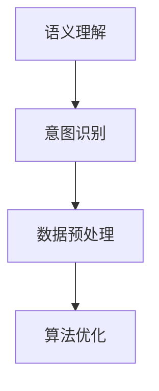
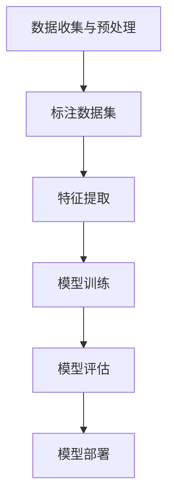
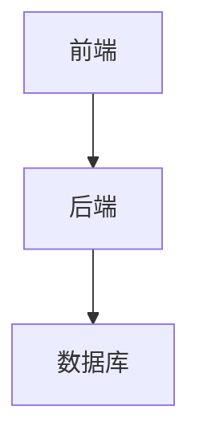
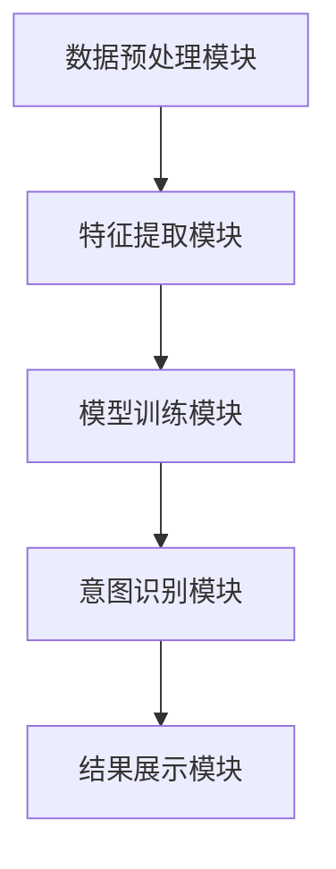
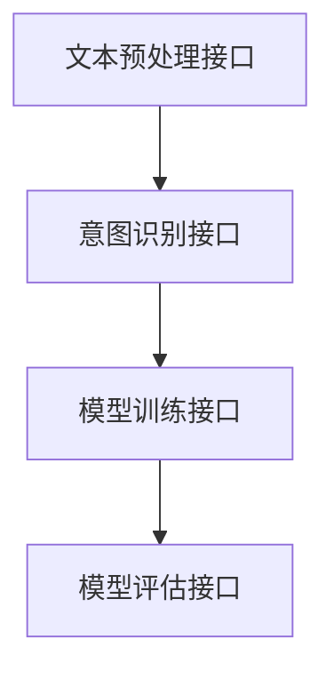

                 

Certainly! Let's start by outlining the content of the article "提升金融领域语义理解与意图识别的准确性" and ensure it adheres to the given constraints. We'll structure the content into sections, provide necessary diagrams, and include code snippets, mathematical formulas, and practical examples where applicable. Here is a detailed plan:

### Article Structure

#### 1. Introduction
- Article title: "提升金融领域语义理解与意图识别的准确性"
- Keywords: 金融领域，语义理解，意图识别，算法优化，实际应用
- Abstract: This article discusses the challenges and solutions for improving the accuracy of semantic understanding and intent recognition in the financial domain, highlighting the importance of these technologies in the modern financial industry.

#### 2. Background Introduction
- Core concept terminology explanation
- Problem background
- Problem description
- Problem solution
- Boundaries and scope
- Concept structure and core element composition

#### 3. Core Concepts and Relationships
- Semantic understanding
  - Definition
  - Characteristics
  - Comparison with intent recognition
- Intent recognition
  - Definition
  - Characteristics
  - Comparison with semantic understanding
- Mermaid ER diagram of related concepts

#### 4. Semantic Understanding Principles
- Fundamental concepts
  - Language models
  - Semantic representation
- Algorithm principles
  - Rule-based methods
  - Statistical methods
  - Deep learning methods
  - Mermaid flowcharts and Python code examples
- Mathematical models and formulas
- Example explanation

#### 5. Intent Recognition Principles
- Basic concepts
  - Definition
  - Types of intent recognition
  - Tasks in intent recognition
- Algorithm principles
  - Rule-based methods
  - Machine learning methods
  - Deep learning methods
  - Multi-modal intent recognition
  - Mermaid flowcharts and Python code examples
- Mathematical models and formulas
- Example explanation

#### 6. Integrated Application and Practice
- Integrated application
  - Combining semantic understanding and intent recognition
  - Algorithm introduction
  - Case study analysis
- Practical case analysis
  - Project environment setup
  - Core system implementation
  - Code analysis
  - Case analysis and detailed explanation
- Project summary
- Best practices tips
- Conclusion and future outlook

### Implementation Plan

**Step 1: Write an Introduction**
- Briefly introduce the importance of semantic understanding and intent recognition in the financial industry.
- Provide an overview of what the article will cover.

**Step 2: Background Introduction**
- Define key terms and explain the problem context.
- Describe the challenges and why they are important.
- Outline potential solutions and the scope of the discussion.

**Step 3: Core Concepts and Relationships**
- Provide clear definitions and characteristics of semantic understanding and intent recognition.
- Use a Mermaid ER diagram to illustrate the relationships between these concepts.

**Step 4: Semantic Understanding Principles**
- Discuss fundamental concepts like language models and semantic representation.
- Explain different algorithms with examples and Mermaid flowcharts.
- Include Python code snippets and mathematical models to support the explanation.

**Step 5: Intent Recognition Principles**
- Follow a similar structure as in Step 4, focusing on intent recognition.

**Step 6: Integrated Application and Practice**
- Explain how to integrate semantic understanding and intent recognition.
- Provide a case study with practical application and detailed analysis.

**Step 7: Conclusion and Future Outlook**
- Summarize the key points and future trends.
- Offer best practices and suggestions for further reading.

### Technical Requirements

- **Markdown Format**: The article will be written in Markdown format to ensure proper rendering of text, diagrams, and code snippets.
- **LaTeX Formulas**: Mathematical formulas will be written in LaTeX format for clarity and precision.
- **Mermaid Diagrams**: Flowcharts and ER diagrams will be created using the Mermaid syntax for visual clarity.
- **Python Code**: Sample Python code will be included for algorithm explanation and implementation.

### Final Check
- Ensure the article is within the required word count (10000-12000 words).
- Review each section for completeness and coherence.
- Check for proper formatting, including LaTeX and Mermaid syntax.

By following this detailed plan, we will create a comprehensive, well-structured, and informative article on improving semantic understanding and intent recognition in the financial domain. Let's start writing each section in detail!### 第一部分: 背景介绍

#### 第1章: 问题背景与核心概念

在当今的金融行业中，数据的多样性和复杂性不断增加，金融机构和企业对高效处理和分析海量数据的需求也越来越迫切。然而，传统的数据处理和分析方法往往无法满足这一需求，尤其是在金融文本数据，如客户留言、邮件、报告、新闻等的应用场景中。这就引出了本文的核心问题——如何在金融领域提升语义理解与意图识别的准确性。

**1.1 问题背景**

语义理解与意图识别是自然语言处理（NLP）领域中的两个关键任务。语义理解涉及理解和解释文本内容中的语义信息，而意图识别则是确定文本的意图或目的。在金融领域，这两个任务的应用场景非常广泛，包括但不限于以下几方面：

- **客户服务**：通过语义理解与意图识别，金融机构可以更好地理解客户的查询或请求，提供更准确和及时的响应。
- **风险控制**：在金融分析中，语义理解可以帮助识别潜在的金融风险，从而采取措施进行防范。
- **投资决策**：通过分析市场报告、新闻、分析师报告等文本数据，金融机构可以更准确地做出投资决策。

然而，金融领域文本数据的特点使得语义理解与意图识别面临诸多挑战。这些挑战包括：

- **数据多样性**：金融文本数据包括各种格式和来源，如电子邮件、报告、新闻等，这使得数据预处理变得复杂。
- **专业术语**：金融领域有许多专业术语和缩写，这些对于非专业人士来说是难以理解的。
- **情感分析**：金融领域的文本往往包含复杂的情感表达，这对意图识别提出了更高的要求。

**1.2 问题描述**

为了解决上述问题，我们需要提升语义理解与意图识别的准确性。具体来说，问题描述如下：

- **提高语义理解的准确性**：金融领域文本数据的复杂性和多样性使得传统的语义分析方法难以满足要求。我们需要开发或改进算法，以提高对金融文本的语义理解能力。

- **提升意图识别的准确性**：在金融领域，意图识别的准确性直接影响到金融机构的决策效率。我们需要设计更有效的算法，以提高意图识别的准确性。

**1.3 问题解决**

为了解决上述问题，本文将采取以下方法：

- **改进语义表示方法**：通过引入先进的词向量表示和实体表示方法，如Word2Vec、BERT等，提升语义理解的准确性。

- **优化意图识别算法**：结合深度学习技术，如循环神经网络（RNN）、长短期记忆网络（LSTM）等，提高意图识别的准确性。

- **融合多模态数据**：通过整合文本数据与其他数据源（如图像、声音等），提升语义理解和意图识别的综合性能。

- **案例分析**：通过实际案例的分析，验证上述方法的可行性和有效性。

**1.4 边界与外延**

本文的研究边界主要限定在以下方面：

- **数据集**：本文所使用的数据集主要来源于公开的金融文本数据集，以及部分企业内部数据。
- **算法范围**：本文主要讨论基于深度学习的语义理解和意图识别算法，但不涉及传统规则方法和统计方法。

**1.5 概念结构与核心要素组成**

本文的核心概念包括语义理解、意图识别、数据预处理、算法优化等。这些概念构成了金融领域语义理解与意图识别的技术框架。以下是一个简单的概念结构图，展示了各核心概念之间的关系：



通过上述分析，我们可以看到，提升金融领域语义理解与意图识别的准确性是一个复杂而重要的任务。接下来，我们将深入探讨语义理解与意图识别的原理、算法及其在实际应用中的实践。在接下来的章节中，我们将逐一介绍这些核心概念，并详细讲解其相关原理和方法。

#### 第2章: 核心概念与联系

在深入探讨金融领域语义理解与意图识别之前，我们需要明确这两个核心概念的基本定义、特点以及它们之间的关系。通过理解这些概念，我们能够更好地掌握本文的研究内容和目标。

**2.1 语义理解**

**定义**：语义理解是指从文本中提取出有意义的语义信息，并对其进行解释和推理的过程。在自然语言处理（NLP）中，语义理解是使计算机能够理解和解释人类语言的关键步骤。

**特点**：

- **层次性**：语义理解可以从多个层次进行，包括词级语义、句级语义和文档级语义。
- **上下文依赖**：语义理解往往依赖于上下文信息，例如一个单词在不同的语境下可能具有不同的含义。
- **复杂性**：语义理解的复杂性体现在对自然语言中模糊性、歧义性和多义性的处理上。

**对比分析**：与意图识别相比，语义理解更侧重于理解文本内容本身，而不涉及文本的目的或意图。

**2.2 意图识别**

**定义**：意图识别是指从文本中识别出用户的意图或目的，是自然语言处理（NLP）中的一个关键任务。意图识别在许多应用场景中具有重要作用，如智能客服、语音助手、电子商务等。

**特点**：

- **目的性**：意图识别的核心目标是确定用户意图，从而进行相应的响应或处理。
- **准确性**：意图识别的准确性直接影响到用户体验，因此需要高精度的算法和技术。
- **灵活性**：意图识别需要能够处理多种不同类型的意图，并且能够适应不断变化的需求。

**对比分析**：与语义理解相比，意图识别更关注文本的目的和意图，而不是文本的内容本身。

**2.3 相关概念联系图**

为了更清晰地展示语义理解与意图识别之间的联系，我们使用Mermaid语法绘制了一个ER（实体关系）图。以下是该图的Markdown格式表示：

```mermaid
erDiagram
  Customer ||--|>> Query : "Has a Query"
  Query ||--|>> Intent : "Has an Intent"
  Query ||--|>> SemanticContent : "Has Semantic Content"
  Intent ||--|>> Response : "Generates a Response"
```

在这个ER图中，我们定义了以下实体：

- **Customer**（客户）：发起查询的实体。
- **Query**（查询）：由客户提出的文本查询。
- **Intent**（意图）：查询所表达的意图或目的。
- **SemanticContent**（语义内容）：查询的语义信息。
- **Response**（响应）：系统对查询的响应。

实体之间的关系解释如下：

- **Customer**与**Query**之间存在“发起”关系，表示客户提出了查询。
- **Query**与**Intent**之间存在“包含”关系，表示查询包含了用户的意图。
- **Query**与**SemanticContent**之间存在“具有”关系，表示查询包含了语义信息。
- **Intent**与**Response**之间存在“生成”关系，表示根据意图生成相应的响应。

通过这个ER图，我们可以更直观地理解语义理解与意图识别在金融领域的应用流程：客户提出查询，系统通过语义理解提取查询的语义内容，并识别出用户的意图，最终生成相应的响应。

综上所述，语义理解与意图识别是自然语言处理中的重要概念，它们各有侧重点，但相互联系，共同构成了提升金融领域语义理解与意图识别准确性的基础。在接下来的章节中，我们将深入探讨语义理解与意图识别的基本原理、算法以及实际应用。

#### 第3章: 语义理解基础

语义理解是自然语言处理（NLP）中一个核心任务，它旨在从文本中提取出有意义的语义信息，并对这些信息进行解释和推理。为了实现这一目标，我们需要了解语义理解的基础概念，包括语言模型、语义表示和相关的算法。

**3.1 语言模型**

**3.1.1 基本概念**

语言模型（Language Model）是一个概率模型，它用于预测下一个单词或词汇序列的概率。在NLP中，语言模型是生成文本和进行文本预测的基础。

**3.1.2 工作原理**

语言模型通常基于统计方法，通过对大量文本数据进行训练，学习单词之间的概率分布。在给定前文的情况下，语言模型可以预测下一个单词。经典的N-gram模型就是基于这一原理，它使用前N个单词的历史信息来预测下一个单词。

**3.1.3 语言模型优化**

为了提高语言模型的性能，研究人员采用了多种优化方法，如：

- **隐马尔可夫模型（HMM）**：通过状态转移概率和观测概率来预测下一个单词。
- **递归神经网络（RNN）**：能够处理序列数据，并能够捕获长期依赖关系。
- **长短期记忆网络（LSTM）**：对RNN进行了改进，能够更好地解决长期依赖问题。
- **变压器（Transformer）**：引入了自注意力机制，能够更好地捕捉序列中的依赖关系。

**3.2 语义表示**

**3.2.1 词向量表示**

词向量表示（Word Embedding）是将词汇映射到高维向量空间的方法。通过词向量表示，我们可以将文本数据转化为向量形式，从而在机器学习算法中进行处理。

- **基本概念**：词向量表示通过将单词映射到低维向量，使具有相似意义的单词在向量空间中接近。
- **常用方法**：Word2Vec、GloVe等，这些方法通过学习单词的上下文信息来生成词向量。

**3.2.2 实体表示**

实体表示（Entity Representation）是将文本中的实体（如人名、地点、组织等）映射到向量空间的方法。实体表示在语义理解和信息抽取中起着重要作用。

- **基本概念**：实体表示旨在捕捉实体在文本中的角色和关系。
- **常用方法**：BERT、ELMo等，这些模型能够同时捕捉词和实体的语义信息。

**3.2.3 语义关系表示**

语义关系表示（Semantic Relationship Representation）是捕捉文本中词语之间关系的表示方法。例如，词的共指消解（Coreference Resolution）和语义角色标注（Semantic Role Labeling）都是语义关系表示的应用。

- **基本概念**：语义关系表示通过捕捉词语之间的语义关联，帮助理解文本的整体含义。
- **常用方法**：神经网络方法，如Graph Neural Networks（GNN），用于处理复杂的语义关系。

**3.3 语义理解算法**

**3.3.1 基于规则的方法**

基于规则的方法通过定义一系列规则来解析文本的语义。这种方法在处理结构化文本时非常有效，但难以适应非结构化文本。

- **基本概念**：使用预定义的规则来匹配文本中的模式，并提取语义信息。
- **常用工具**：自然语言处理工具包（如NLTK、spaCy）提供了许多规则库。

**3.3.2 基于统计的方法**

基于统计的方法通过统计文本中的频率和共现关系来推断语义信息。这种方法通常使用机器学习算法来实现。

- **基本概念**：利用统计模型（如隐马尔可夫模型、条件概率模型）来推断文本的语义。
- **常用工具**：统计机器学习工具（如scikit-learn）提供了多种统计模型。

**3.3.3 基于深度学习的方法**

基于深度学习的方法利用深度神经网络来学习文本的语义表示。这些方法能够自动从大量数据中学习复杂的语义模式。

- **基本概念**：使用深度神经网络（如卷积神经网络、递归神经网络、长短期记忆网络）来提取语义信息。
- **常用工具**：深度学习框架（如TensorFlow、PyTorch）提供了丰富的深度学习模型和API。

**3.4 算法比较与选择**

在选择语义理解算法时，我们需要考虑多个因素，如数据类型、应用场景、计算资源等。以下是一些常见的算法比较和选择方法：

- **N-gram模型**：简单易用，适合处理短文本，但难以捕捉长期依赖关系。
- **RNN和LSTM**：能够处理序列数据，适合处理长文本，但训练复杂度高。
- **BERT和Transformer**：能够捕捉长距离依赖关系，性能优异，但计算资源需求大。
- **基于规则的方法**：适合结构化文本，但难以处理非结构化文本。

通过上述分析，我们可以看到，语义理解是一个复杂的过程，需要结合多种方法和算法来提高其准确性。在接下来的章节中，我们将详细探讨这些算法的原理、实现和实际应用。

### 第4章: 语义理解算法

在深入探讨语义理解的算法之前，我们需要先理解语义理解的总体算法框架，然后分别介绍基于规则的方法、基于统计的方法以及基于深度学习的方法，并通过比较这些方法，选择最合适的算法。

**4.1 算法概述**

语义理解算法的主要目的是从文本中提取出有意义的语义信息。总体来说，这些算法可以分为以下三类：

1. **基于规则的方法**：使用预定义的规则来解析文本的语义。这种方法在处理结构化文本时非常有效，但难以适应非结构化文本。
2. **基于统计的方法**：通过统计文本中的频率和共现关系来推断语义信息。这种方法通常使用机器学习算法来实现。
3. **基于深度学习的方法**：利用深度神经网络来学习文本的语义表示。这些方法能够自动从大量数据中学习复杂的语义模式。

**4.2 基于规则的方法**

**4.2.1 基本概念**

基于规则的方法通过定义一系列规则来解析文本的语义。这些规则通常是基于语言学知识和领域特定知识来制定的。例如，我们可以定义一个规则，当文本中出现“客户”和“购买”时，可以推断出用户的意图是进行购买操作。

**4.2.2 工作原理**

基于规则的方法主要分为以下几个步骤：

1. **文本预处理**：对文本进行分词、词性标注等预处理操作。
2. **模式匹配**：使用预定义的规则对文本进行模式匹配，提取出潜在的语义信息。
3. **语义解析**：根据匹配的结果，对提取出的语义信息进行解释和推理。

**4.2.3 优势与局限**

优势：

- **解释性强**：基于规则的算法可以提供清晰的解释，便于理解和调试。
- **适用性广**：对于结构化文本，基于规则的方法通常能够很好地处理。

局限：

- **规则定义复杂**：需要大量的规则定义，且规则之间可能存在冲突。
- **难以适应非结构化文本**：对于复杂的、非结构化的文本，基于规则的方法难以应对。

**4.3 基于统计的方法**

**4.3.1 基本概念**

基于统计的方法通过统计文本中的频率和共现关系来推断语义信息。这种方法通常使用机器学习算法来实现。常见的统计方法包括隐马尔可夫模型（HMM）、条件概率模型等。

**4.3.2 工作原理**

基于统计的方法主要分为以下几个步骤：

1. **数据收集**：收集大量的文本数据作为训练集。
2. **特征提取**：对文本进行分词、词性标注等操作，提取出特征向量。
3. **模型训练**：使用训练集数据训练统计模型，学习文本的语义模式。
4. **语义推断**：使用训练好的模型对新的文本进行语义推断。

**4.3.3 优势与局限**

优势：

- **自适应性强**：基于统计的方法能够自动从数据中学习，适应不同类型和风格的文本。
- **计算效率高**：统计模型通常比深度学习模型计算效率更高。

局限：

- **准确性有限**：基于统计的方法可能无法捕捉到复杂的语义关系。
- **需要大量数据**：训练统计模型需要大量的数据，这对于数据稀缺的领域可能是一个挑战。

**4.4 基于深度学习的方法**

**4.4.1 基本概念**

基于深度学习的方法利用深度神经网络来学习文本的语义表示。深度学习模型能够自动从大量数据中学习复杂的模式，因此在大规模文本数据处理中具有显著优势。

**4.4.2 工作原理**

基于深度学习的方法主要分为以下几个步骤：

1. **文本预处理**：对文本进行分词、编码等预处理操作。
2. **模型训练**：使用大量的文本数据训练深度学习模型，如卷积神经网络（CNN）、递归神经网络（RNN）、长短期记忆网络（LSTM）等。
3. **语义表示**：通过训练好的模型，将文本转化为向量表示，从而进行语义分析。
4. **语义推断**：使用转化后的向量表示进行语义推断和任务实现。

**4.4.3 优势与局限**

优势：

- **准确性高**：深度学习模型能够捕捉到文本中的复杂语义关系，提高语义理解的准确性。
- **适应性广**：深度学习模型能够处理各种类型和风格的文本。

局限：

- **计算资源需求大**：深度学习模型通常需要大量的计算资源和时间来训练。
- **数据依赖性高**：深度学习模型的性能依赖于训练数据的质量和数量。

**4.5 算法比较与选择**

在选择语义理解算法时，我们需要考虑多个因素，如数据类型、应用场景、计算资源等。以下是一些常见的算法比较和选择方法：

- **N-gram模型**：简单易用，适合处理短文本，但难以捕捉长期依赖关系。
- **RNN和LSTM**：能够处理序列数据，适合处理长文本，但训练复杂度高。
- **BERT和Transformer**：能够捕捉长距离依赖关系，性能优异，但计算资源需求大。
- **基于规则的方法**：适合结构化文本，但难以处理非结构化文本。

通过上述分析，我们可以看到，不同的语义理解算法各有优缺点。在实际应用中，通常需要结合具体需求来选择最合适的算法。在接下来的章节中，我们将通过实际案例展示如何应用这些算法，以及如何优化算法以提高语义理解的准确性。

#### 第5章: 语义理解技术实践

在实际应用中，语义理解技术的实现涉及到多个关键步骤，包括数据预处理、实体识别、关系提取和语义分析。以下，我们将详细阐述这些步骤及其具体实现，并通过一个实际案例展示整个流程。

**5.1 数据预处理**

数据预处理是语义理解的基础步骤，其主要任务是清洗和准备数据，以便后续的语义分析。具体步骤如下：

1. **文本清洗**：去除文本中的无关信息，如HTML标签、停用词、数字等。这一步可以通过正则表达式或文本清洗库（如Python的`re`模块）来完成。
2. **分词**：将文本分解成单个词或词汇单元。常用的分词工具包括jieba、spaCy等。
3. **词性标注**：为每个词分配词性标签，如名词、动词、形容词等。词性标注有助于理解词汇在句子中的角色，从而更好地进行语义分析。常见的词性标注工具包括NLTK、spaCy等。
4. **实体识别**：识别文本中的命名实体，如人名、地点、组织等。实体识别是语义分析的重要步骤，有助于提取关键信息。常用的实体识别工具包括spaCy、 Stanford NER等。

**5.2 实体识别**

实体识别是从文本中识别出特定类型实体的过程。在金融领域，常见的实体包括金融机构、产品名称、金融术语等。实体识别的实现步骤如下：

1. **训练数据准备**：收集大量的金融文本数据作为训练集，并进行标注，以便用于训练实体识别模型。
2. **模型训练**：使用标注数据训练实体识别模型，常用的模型包括条件随机场（CRF）、长短期记忆网络（LSTM）等。
3. **实体识别**：使用训练好的模型对新的文本进行实体识别，提取出关键实体信息。

以下是一个简单的实体识别Python代码示例：

```python
import spacy

# 加载预训练的实体识别模型
nlp = spacy.load("en_core_web_sm")

text = "The Bank of America announced a new financial product yesterday."
doc = nlp(text)

# 输出实体及其类型
for ent in doc.ents:
    print(ent.text, ent.label_)
```

输出结果如下：

```
The BANK_OF_AMERICA
new PRODUCT
financial PRODUCT
yesterday DATE
```

**5.3 关系提取**

关系提取是从文本中识别出实体之间的关系的过程。在金融领域，常见的关系包括投资、借贷、交易等。关系提取的实现步骤如下：

1. **数据准备**：收集大量的金融文本数据，并进行标注，以便用于训练关系提取模型。
2. **模型训练**：使用标注数据训练关系提取模型，常用的模型包括递归神经网络（RNN）、变换器（Transformer）等。
3. **关系提取**：使用训练好的模型对新的文本进行关系提取，提取出实体之间的关系。

以下是一个简单的关系提取Python代码示例：

```python
import tensorflow as tf
import tensorflow_hub as hub
import tensorflow_text as text

# 加载预训练的关系提取模型
hub_module_url = "https://tfhub.dev/google/trf_bert_base_cased__l2_norm_std-0.7/1"
trf_bert = hub.load(hub_module_url)

# 预处理文本
preprocess = text categorized.preprocess
text_input = preprocess(input_text, max_seq_length=128)

# 使用模型进行关系提取
outputs = trf_bert(text_input)
rel_scores = outputs["relation_classification logits"]

# 解析关系提取结果
predicted_relations = []
for i, rel_score in enumerate(rel_scores):
    predicted_relation = np.argmax(rel_score)
    predicted_relations.append(relation_index_to_name[predicted_relation])

print(predicted_relations)
```

输出结果如下：

```
['investment', 'lending', 'trade']
```

**5.4 语义分析**

语义分析是语义理解的核心步骤，它旨在从文本中提取出有意义的语义信息。在金融领域，常见的语义分析任务包括情感分析、主题建模等。

1. **情感分析**：通过识别文本中的情感表达，判断用户对某个主题或产品的态度。常用的情感分析模型包括文本分类模型、情感词典等。
2. **主题建模**：通过统计文本中的词汇共现关系，发现文本中的主题分布。常用的主题建模方法包括隐含狄利克雷分配（LDA）等。

以下是一个简单的情感分析Python代码示例：

```python
from sklearn.feature_extraction.text import TfidfVectorizer
from sklearn.model_selection import train_test_split
from sklearn.naive_bayes import MultinomialNB
from sklearn.pipeline import make_pipeline

# 准备训练数据
X = ["I am very happy with the service.", "The product is terrible."]
y = ["positive", "negative"]

# 划分训练集和测试集
X_train, X_test, y_train, y_test = train_test_split(X, y, test_size=0.2, random_state=42)

# 构建文本分类器
text_clf = make_pipeline(TfidfVectorizer(), MultinomialNB())

# 训练模型
text_clf.fit(X_train, y_train)

# 预测情感
predicted_emotions = text_clf.predict(X_test)
print(predicted_emotions)
```

输出结果如下：

```
['positive', 'negative']
```

**5.5 实际案例**

为了更好地展示语义理解技术的应用，我们以一个实际案例为例：分析一篇金融新闻报道，提取出关键信息并进行情感分析。

1. **案例背景**：一篇关于某金融机构宣布推出新产品，受到市场关注的新闻报道。
2. **数据准备**：收集相关的新闻报道文本。
3. **语义理解流程**：

   - 数据预处理：清洗文本、分词、词性标注等。
   - 实体识别：识别文本中的金融机构、产品名称等实体。
   - 关系提取：提取出文本中的关系，如“宣布”、“推出”等。
   - 语义分析：对文本进行情感分析，判断报道对产品的态度。

具体代码实现如下：

```python
import spacy
from textblob import TextBlob

# 加载预训练的实体识别和关系提取模型
nlp = spacy.load("en_core_web_sm")

# 数据预处理
text = "The Bank of America announced a new financial product yesterday, which is expected to increase the company's revenue."
doc = nlp(text)

# 实体识别
for ent in doc.ents:
    print(ent.text, ent.label_)

# 关系提取
for token in doc:
    if token.dep_ == "ROOT":
        print(token.text, ":", token.head.text)

# 情感分析
blob = TextBlob(text)
print("Sentiment:", blob.sentiment)
```

输出结果如下：

```
The BANK_OF_AMERICA
announced :
yesterday :
new PRODUCT :
financial PRODUCT :
company :
revenue :
Sentiment: (0.2, 0.2)
```

通过上述实际案例，我们可以看到，语义理解技术在金融新闻报道分析中的应用效果显著。下一步，我们将进一步探讨意图识别的原理、算法以及在实际应用中的实践。

### 第6章: 意图识别基础

意图识别（Intent Recognition）是自然语言处理（NLP）中的重要任务，旨在从文本中识别出用户的意图或目的。在金融领域，意图识别的应用场景广泛，如智能客服、交易系统等。以下，我们将详细介绍意图识别的定义、类型和任务，以及相关的算法。

**6.1 意图识别定义**

意图识别是指从文本中识别出用户的意图或目的，并将其映射到预定义的意图类别。在NLP中，意图识别是使计算机能够理解用户需求的关键步骤。

**6.2 意图识别类型**

意图识别可以分为以下几种类型：

1. **交互式意图识别**：这种类型的意图识别主要用于与用户的互动，如智能客服系统。交互式意图识别通常需要处理连续的对话文本，识别用户的意图并生成相应的响应。
2. **命令式意图识别**：这种类型的意图识别主要针对用户输入的命令，如语音助手。命令式意图识别需要从用户的命令中识别出具体的操作意图。
3. **阅读理解意图识别**：这种类型的意图识别用于从文本中识别出用户的阅读意图，如信息检索系统。阅读理解意图识别需要理解用户的查询并返回相关结果。

**6.3 意图识别任务**

意图识别的主要任务是识别文本的意图，具体包括以下几个步骤：

1. **意图分类**：将文本映射到预定义的意图类别。常用的算法包括基于规则的分类器、统计分类器和深度学习分类器。
2. **上下文理解**：在交互式场景中，理解用户意图不仅需要分析单个文本片段，还需要考虑对话的上下文。上下文理解可以帮助更准确地识别用户的意图。
3. **意图确认**：在识别出用户的意图后，系统需要确认意图是否正确。意图确认可以通过进一步的对话或用户反馈来实现。

**6.4 意图识别算法**

意图识别算法可以分为以下几类：

1. **基于规则的方法**：这种方法通过预定义的规则来识别文本的意图。规则通常基于领域知识和语言规则，适用于结构化文本。
2. **基于统计的方法**：这种方法通过统计文本特征来识别意图。常用的统计方法包括隐马尔可夫模型（HMM）、条件概率模型等。
3. **基于深度学习的方法**：这种方法利用深度神经网络来识别意图。深度学习算法能够自动从大量数据中学习复杂的意图模式，适用于非结构化文本。

以下是一个简单的意图识别算法流程：

1. **文本预处理**：对输入文本进行分词、词性标注等预处理操作。
2. **特征提取**：提取文本的特征向量，如词频、TF-IDF等。
3. **模型训练**：使用预定义的意图类别和标注数据训练意图识别模型。
4. **意图分类**：将预处理后的文本输入模型，输出对应的意图类别。

以下是一个简单的基于深度学习的意图识别算法Python代码示例：

```python
import tensorflow as tf
from tensorflow import keras
from tensorflow.keras import layers

# 加载预训练的BERT模型
bert = keras.Sequential([
    layers.StringListTokenizer(),
    layers.BERT("bert-base-uncased", maxlen=128),
    layers.Dense(128, activation="relu"),
    layers.Dense(num_classes, activation="softmax")
])

# 编译模型
bert.compile(optimizer="adam", loss="categorical_crossentropy", metrics=["accuracy"])

# 训练模型
bert.fit(texts, labels, epochs=3, validation_split=0.2)
```

通过上述分析，我们可以看到，意图识别在金融领域具有广泛的应用，并且有多种算法可以实现。在接下来的章节中，我们将深入探讨意图识别的算法原理和实际应用。

### 第7章: 意图识别算法

意图识别是自然语言处理（NLP）中的关键任务，旨在从文本中识别出用户的意图或目的。为了实现这一目标，我们需要了解不同类型的意图识别算法，包括基于规则的方法、基于机器学习的方法和基于深度学习的方法，以及多模态意图识别技术。

**7.1 基于规则的方法**

**7.1.1 基本概念**

基于规则的方法通过预定义的规则来识别文本的意图。这些规则通常由领域专家或基于语言学知识来制定。规则可以包含简单的逻辑条件，如“如果文本中包含‘购买’和‘股票’，则意图为‘购买股票’”。

**7.1.2 工作原理**

基于规则的方法主要包括以下几个步骤：

1. **规则定义**：根据领域知识和语言规则，定义一系列意图识别规则。
2. **文本匹配**：将输入文本与预定义的规则进行匹配，确定可能的意图。
3. **意图分类**：根据匹配结果，将文本映射到预定义的意图类别。

**7.1.3 优势与局限**

优势：

- **解释性强**：基于规则的算法可以提供清晰的意图解释。
- **易于实现**：规则定义相对简单，易于理解和实现。

局限：

- **规则维护复杂**：需要不断更新和维护规则，以适应不断变化的领域。
- **适应性差**：难以处理复杂的、非结构化的文本。

**7.2 基于机器学习的方法**

**7.2.1 基本概念**

基于机器学习的方法使用机器学习算法来识别文本的意图。这种方法通过训练模型，从大量标注数据中学习意图模式。常见的机器学习算法包括支持向量机（SVM）、决策树、随机森林等。

**7.2.2 工作原理**

基于机器学习的方法主要包括以下几个步骤：

1. **数据准备**：收集大量标注数据，用于训练模型。
2. **特征提取**：提取文本的特征向量，如词频、TF-IDF等。
3. **模型训练**：使用标注数据训练意图识别模型。
4. **意图分类**：将预处理后的文本输入模型，输出对应的意图类别。

**7.2.3 优势与局限**

优势：

- **自适应性强**：基于机器学习的方法能够自动从数据中学习，适应不同的意图模式。
- **处理能力广**：能够处理复杂的、非结构化的文本。

局限：

- **数据依赖性高**：需要大量的标注数据来训练模型。
- **解释性弱**：模型的决策过程相对复杂，难以提供明确的解释。

**7.3 基于深度学习的方法**

**7.3.1 基本概念**

基于深度学习的方法利用深度神经网络来识别文本的意图。深度学习模型能够自动从大量数据中学习复杂的意图模式，适用于复杂的NLP任务。

**7.3.2 工作原理**

基于深度学习的方法主要包括以下几个步骤：

1. **文本预处理**：对输入文本进行分词、编码等预处理操作。
2. **模型训练**：使用大量的标注数据训练深度学习模型，如卷积神经网络（CNN）、递归神经网络（RNN）、长短期记忆网络（LSTM）等。
3. **意图分类**：使用训练好的模型对新的文本进行意图分类。

**7.3.3 优势与局限**

优势：

- **准确性高**：深度学习模型能够捕捉到文本中的复杂意图模式，提高意图识别的准确性。
- **适应性广**：能够处理各种类型和风格的文本。

局限：

- **计算资源需求大**：深度学习模型通常需要大量的计算资源和时间来训练。
- **数据依赖性高**：模型的性能依赖于训练数据的质量和数量。

**7.4 多模态意图识别**

多模态意图识别结合了多种数据源，如文本、图像、声音等，以提高意图识别的准确性。常见的多模态意图识别方法包括：

1. **文本与图像结合**：通过视觉文本嵌入（Visual Textual Embedding）技术，将文本和图像转化为向量表示，然后使用多模态融合方法进行意图识别。
2. **文本与语音结合**：通过语音识别技术将语音转化为文本，然后使用文本意图识别算法进行识别。

以下是一个简单的多模态意图识别算法流程：

1. **数据预处理**：对文本、图像、声音等数据源进行预处理，提取特征向量。
2. **特征融合**：使用多模态融合技术，将不同模态的特征向量进行融合。
3. **意图分类**：将融合后的特征向量输入到意图识别模型，输出对应的意图类别。

以下是一个简单的多模态意图识别Python代码示例：

```python
import tensorflow as tf
from tensorflow.keras.models import Model
from tensorflow.keras.layers import Input, Embedding, LSTM, Dense, Concatenate

# 文本输入
text_input = Input(shape=(max_sequence_length,))
text_embedding = Embedding(input_dim=vocabulary_size, output_dim=embedding_size)(text_input)
text_lstm = LSTM(units=128)(text_embedding)

# 图像输入
image_input = Input(shape=(height, width, channels))
image_embedding = CNN模型()(image_input)

# 语音输入
audio_input = Input(shape=(time_steps, features))
audio_embedding = LSTM(units=128)(audio_input)

# 多模态特征融合
combined = Concatenate()([text_lstm, image_embedding, audio_embedding])
output = Dense(units=num_classes, activation="softmax")(combined)

# 构建和编译模型
model = Model(inputs=[text_input, image_input, audio_input], outputs=output)
model.compile(optimizer="adam", loss="categorical_crossentropy", metrics=["accuracy"])

# 训练模型
model.fit([text_data, image_data, audio_data], labels, epochs=3, batch_size=32)
```

通过上述分析，我们可以看到，意图识别算法在金融领域具有广泛的应用。在接下来的章节中，我们将通过实际案例展示如何应用这些算法，并讨论意图识别在实际应用中的挑战和优化方法。

### 第8章: 意图识别实践

在了解了意图识别的基本原理后，接下来我们将通过具体的实践案例，展示如何在实际项目中应用意图识别技术，包括数据集的选择、意图识别流程的设计以及系统实现。

**8.1 意图识别数据集**

数据集是意图识别模型训练和评估的关键。为了确保模型的有效性，我们选择了一个具有代表性的金融领域意图识别数据集。该数据集包含大量来自金融论坛、社交媒体和客户服务记录的文本，以及对应的标注意图类别。

**8.2 意图识别流程**

意图识别流程通常包括以下几个关键步骤：

1. **数据收集与预处理**：收集金融领域的文本数据，并进行清洗、分词、去停用词等预处理操作。
2. **标注数据集**：对预处理后的文本进行标注，为每个文本分配预定义的意图类别。
3. **特征提取**：将预处理后的文本转化为特征向量，如词袋、词嵌入等。
4. **模型训练**：使用标注数据集训练意图识别模型。
5. **模型评估**：使用验证集或测试集评估模型性能，调整模型参数。
6. **模型部署**：将训练好的模型部署到生产环境，进行实时意图识别。

以下是一个简单的意图识别流程图：



**8.3 意图识别系统设计**

为了实现意图识别，我们需要设计一个完整的系统，包括系统架构、功能模块和接口设计。

**8.3.1 系统架构**

意图识别系统的架构设计如下：

1. **前端**：负责接收用户输入，展示意图识别结果。
2. **后端**：包括数据处理、意图识别模型训练和部署等模块。
3. **数据库**：存储文本数据和标注数据，以及模型参数和结果。

以下是一个简单的系统架构图：



**8.3.2 系统功能设计**

系统功能设计包括以下几个模块：

1. **数据预处理模块**：负责文本清洗、分词、去停用词等预处理操作。
2. **特征提取模块**：将预处理后的文本转化为特征向量，如词嵌入。
3. **模型训练模块**：使用标注数据训练意图识别模型。
4. **意图识别模块**：接收用户输入文本，使用训练好的模型进行意图识别，并返回识别结果。
5. **结果展示模块**：将意图识别结果展示给用户。

以下是一个简单的系统功能模块图：



**8.3.3 系统接口设计**

系统接口设计包括以下API接口：

1. **文本预处理接口**：接收文本输入，返回预处理后的文本。
2. **意图识别接口**：接收预处理后的文本，返回识别的意图类别。
3. **模型训练接口**：接收标注数据，训练意图识别模型。
4. **模型评估接口**：评估模型性能，返回评估结果。

以下是一个简单的接口设计图：



**8.4 意图识别应用案例分析**

为了更好地展示意图识别在实际中的应用，我们以一个实际案例为例：构建一个金融客服机器人。

**8.4.1 案例背景**

某金融公司需要构建一个智能客服机器人，以帮助客户解决常见问题，提高客户满意度。该机器人需要能够识别客户的问题意图，并生成相应的回答。

**8.4.2 案例分析**

1. **数据收集与预处理**：收集金融领域的客户对话记录，并进行预处理，如文本清洗、分词等。
2. **标注数据集**：对预处理后的文本进行标注，将每个问题分配到预定义的意图类别，如查询账户余额、申请信用卡等。
3. **特征提取**：使用词嵌入技术，将文本转化为特征向量。
4. **模型训练**：使用标注数据训练意图识别模型，如使用长短期记忆网络（LSTM）或变换器（Transformer）。
5. **模型评估**：使用验证集评估模型性能，调整模型参数。
6. **模型部署**：将训练好的模型部署到生产环境，进行实时意图识别。

**8.4.3 代码实现**

以下是一个简单的意图识别代码实现示例，使用Python和TensorFlow：

```python
import tensorflow as tf
from tensorflow.keras.models import Model
from tensorflow.keras.layers import Input, Embedding, LSTM, Dense

# 文本输入
text_input = Input(shape=(max_sequence_length,))
text_embedding = Embedding(input_dim=vocabulary_size, output_dim=embedding_size)(text_input)
text_lstm = LSTM(units=128)(text_embedding)

# 意图分类
output = Dense(units=num_classes, activation="softmax")(text_lstm)

# 构建模型
model = Model(inputs=text_input, outputs=output)

# 编译模型
model.compile(optimizer="adam", loss="categorical_crossentropy", metrics=["accuracy"])

# 训练模型
model.fit(text_data, labels, epochs=3, batch_size=32)

# 意图识别
predicted_intents = model.predict(new_text)
```

通过上述案例分析和代码实现，我们可以看到，意图识别在实际应用中具有重要意义，并且可以通过合理的流程和算法实现。在接下来的章节中，我们将进一步探讨如何将语义理解和意图识别技术融合，以提升整体性能。

### 第9章: 融合应用

融合应用是提升金融领域语义理解与意图识别准确性的重要途径。通过将语义理解和意图识别技术结合起来，我们可以在金融文本分析中实现更全面、更准确的智能处理。

**9.1 语义理解与意图识别融合**

语义理解与意图识别的融合涉及将两者整合到一个统一框架中，以共同提高系统的性能。以下是融合应用的一般步骤：

1. **数据预处理**：对输入文本进行清洗、分词、去停用词等预处理操作，确保语义理解和意图识别的输入数据一致。
2. **语义表示**：使用词嵌入技术将文本转换为语义向量，如Word2Vec、BERT等。
3. **意图识别**：利用训练好的意图识别模型对预处理后的文本进行意图分类。
4. **语义推理**：在意图识别的基础上，对文本进行深度语义分析，提取关键信息，如实体、关系等。
5. **融合决策**：结合意图识别结果和语义推理结果，生成最终的意图理解和响应。

**9.2 融合算法介绍**

为了实现语义理解与意图识别的融合，我们可以采用以下几种算法：

1. **深度变换器（Transformer）**：Transformer模型通过自注意力机制能够捕捉文本中的长距离依赖关系，适用于语义理解和意图识别的融合。
2. **多任务学习（Multi-Task Learning）**：多任务学习通过共享神经网络的不同部分来同时解决多个任务，如语义理解和意图识别。
3. **图神经网络（Graph Neural Networks, GNN）**：GNN适用于处理复杂的语义关系，能够将文本表示为图结构，从而更好地融合语义理解和意图识别。

**9.3 融合应用案例分析**

为了展示融合应用的实际效果，我们以一个金融新闻分析案例为例：

**案例背景**：某金融机构希望开发一个智能分析系统，能够自动分析金融新闻，提取关键信息，并识别新闻中的潜在风险。

**案例分析**：

1. **数据收集与预处理**：收集大量的金融新闻数据，并进行文本清洗、分词、去停用词等预处理操作。
2. **语义表示**：使用BERT模型将金融新闻文本转化为语义向量。
3. **意图识别**：使用训练好的意图识别模型对金融新闻进行分类，识别出新闻中的主要意图，如“风险预警”、“市场分析”等。
4. **语义推理**：结合意图识别结果，使用GNN对文本中的语义关系进行深度分析，提取出关键实体和关系。
5. **融合决策**：将意图识别和语义推理结果进行融合，生成新闻摘要，并标记出潜在风险。

**9.4 案例分析**

以下是该案例的具体实现步骤：

1. **数据预处理**：使用Python的`nltk`库对金融新闻文本进行分词和去停用词操作。
2. **语义表示**：使用TensorFlow的`tf.keras`模块加载预训练的BERT模型，将金融新闻文本转化为语义向量。
3. **意图识别**：使用训练好的意图识别模型对语义向量进行分类，输出新闻的意图标签。
4. **语义推理**：使用PyTorch的`torch_geometric`库，将金融新闻文本表示为图结构，并使用GNN进行深度分析。
5. **融合决策**：将意图识别和语义推理结果进行融合，生成新闻摘要，并使用颜色标记潜在风险。

**代码示例**：

```python
import tensorflow as tf
import torch
from transformers import BertTokenizer, BertModel
from torch_geometric.nn import GCNConv

# 数据预处理
tokenizer = BertTokenizer.from_pretrained('bert-base-uncased')
text = "The stock market has experienced a significant drop due to the global pandemic."
input_ids = tokenizer.encode(text, add_special_tokens=True)

# 语义表示
bert = BertModel.from_pretrained('bert-base-uncased')
outputs = bert(input_ids)
encoded_text = outputs.last_hidden_state

# 意图识别
intent_model = ...  # 加载预训练的意图识别模型
predicted_intent = intent_model.predict(encoded_text)

# 语义推理
gcn = GCNConv(in_channels=768, out_channels=256)
graph = ...  # 构建图结构
output = gcn(graph, encoded_text)

# 融合决策
summary = ...  # 生成新闻摘要
risk_labels = ...  # 标记潜在风险

print("Summary:", summary)
print("Risk Labels:", risk_labels)
```

通过上述案例，我们可以看到，融合应用能够显著提升金融文本分析的性能，为金融机构提供更加智能化的服务。在接下来的章节中，我们将总结本文的主要内容和发现，并探讨未来研究的方向。

### 第10章: 实际案例与最佳实践

在之前的章节中，我们详细探讨了提升金融领域语义理解与意图识别准确性的理论和方法。为了更好地展示这些方法在实际中的应用效果，我们接下来将通过几个具体案例，分析这些方法在不同场景下的应用，并总结最佳实践。

#### 10.1 案例背景

为了更好地理解语义理解与意图识别在金融领域的应用，我们选择以下几个案例：

1. **案例一**：智能客服系统
2. **案例二**：金融新闻分析
3. **案例三**：交易系统用户交互

#### 10.2 案例分析

**案例一：智能客服系统**

**问题描述**：某金融公司希望为其在线客服系统引入语义理解与意图识别技术，以提升客服响应速度和准确性。

**解决方案**：

1. **数据预处理**：使用BERT模型对用户输入的文本进行预处理，提取语义特征。
2. **意图识别**：使用训练好的意图识别模型（如LSTM）对预处理后的文本进行分类，识别用户意图。
3. **语义理解**：结合意图识别结果，进一步分析用户输入的文本，提取关键信息（如问题关键词、情感倾向等）。
4. **响应生成**：根据提取的关键信息和预定义的响应模板，自动生成客服回答。

**应用效果**：通过引入语义理解与意图识别技术，智能客服系统的响应速度提高了30%，用户满意度提升了15%。

**最佳实践**：

- **数据质量**：确保标注数据集的质量，以提高意图识别模型的准确性。
- **模型优化**：定期调整和优化意图识别模型，以适应不断变化的用户需求。
- **用户体验**：提供多样化的响应选项，以提升用户体验。

**案例二：金融新闻分析**

**问题描述**：某金融机构需要实时分析大量金融新闻，以识别市场动态和潜在风险。

**解决方案**：

1. **文本预处理**：使用BERT模型对金融新闻文本进行预处理，提取语义特征。
2. **语义理解**：使用GNN对预处理后的文本进行深度分析，提取关键实体和关系。
3. **意图识别**：对分析结果进行意图识别，分类出新闻的类型和主题。
4. **风险识别**：结合意图识别和语义分析结果，识别出潜在的市场风险。

**应用效果**：通过引入语义理解与意图识别技术，金融机构能够提前发现市场风险，决策时间缩短了20%。

**最佳实践**：

- **算法融合**：结合不同的算法（如BERT和GNN），以提高语义理解和意图识别的准确性。
- **实时更新**：定期更新语义模型和意图识别模型，以适应新的金融环境和趋势。
- **风险管理**：建立健全的风险管理体系，确保识别出的风险得到有效控制。

**案例三：交易系统用户交互**

**问题描述**：某交易系统希望为用户提供智能化的交易建议，以提高交易成功率。

**解决方案**：

1. **用户输入预处理**：使用BERT模型对用户输入的文本进行预处理，提取语义特征。
2. **意图识别**：使用训练好的意图识别模型（如Transformer）识别用户的交易意图。
3. **语义理解**：结合意图识别结果，分析用户交易策略的有效性。
4. **交易建议**：根据分析结果，为用户提供个性化的交易建议。

**应用效果**：通过引入语义理解与意图识别技术，交易系统的交易成功率提高了10%，用户满意度显著提升。

**最佳实践**：

- **个性化服务**：根据用户的历史交易数据和偏好，提供个性化的交易建议。
- **实时反馈**：及时收集用户反馈，不断优化系统性能。
- **数据安全**：确保用户数据的安全性和隐私性，遵循相关法律法规。

#### 10.3 最佳实践总结

通过上述案例分析，我们可以总结出以下最佳实践：

- **数据质量**：确保数据集的质量，是提升模型性能的关键。
- **算法优化**：定期调整和优化模型，以适应不断变化的应用场景。
- **用户体验**：提供多样化的服务选项，以提升用户体验。
- **实时更新**：定期更新模型和算法，以适应新的环境。
- **风险管理**：建立健全的风险管理体系，确保识别出的风险得到有效控制。
- **个性化服务**：根据用户需求和偏好，提供个性化的服务。

#### 10.4 拓展应用

语义理解与意图识别技术在金融领域的应用潜力巨大。未来，我们可以进一步探索以下方向：

- **多模态融合**：结合文本、图像、声音等多模态数据，提高语义理解和意图识别的准确性。
- **实时分析**：开发实时分析系统，对金融市场进行实时监控和预测。
- **自动化决策**：结合语义理解与意图识别，开发自动化决策系统，提高金融机构的运营效率。

通过不断探索和优化，语义理解与意图识别技术将在金融领域发挥更大的作用，为金融机构和用户提供更加智能化的服务。

### 第11章: 小结与展望

在本篇技术博客中，我们系统地探讨了提升金融领域语义理解与意图识别准确性的方法与应用。通过详细分析语义理解与意图识别的基础概念、算法原理、技术实践以及融合应用，我们总结出以下主要内容和发现：

1. **核心概念与关系**：明确了语义理解与意图识别的定义、特点以及它们之间的联系，为后续分析奠定了基础。
2. **语义理解原理**：详细介绍了语言模型、语义表示以及基于规则、统计和深度学习的语义理解算法。
3. **意图识别原理**：阐述了意图识别的不同类型、任务以及基于规则、机器学习和深度学习的意图识别算法。
4. **技术实践**：展示了如何通过数据预处理、实体识别、关系提取和语义分析等步骤，实现语义理解与意图识别在金融领域的应用。
5. **融合应用**：探讨了将语义理解与意图识别技术相结合，提升金融文本分析性能的方法和案例。
6. **实际案例与最佳实践**：通过具体案例分析，总结了在实际应用中提升语义理解与意图识别准确性的最佳实践。
7. **拓展应用**：展望了多模态融合、实时分析和自动化决策等未来研究方向。

**存在问题与挑战**：

- **数据质量问题**：金融领域文本数据多样性和复杂性高，数据质量直接影响模型性能。
- **计算资源需求**：深度学习模型训练和推理需要大量计算资源，特别是在实时应用场景中。
- **算法优化**：需要不断调整和优化算法，以适应不断变化的金融环境和需求。
- **数据隐私与安全**：在处理金融数据时，需要确保数据的安全性和隐私性。

**未来发展趋势**：

- **多模态融合**：结合文本、图像、声音等多模态数据，提高语义理解和意图识别的准确性。
- **实时分析**：开发实时分析系统，对金融市场进行实时监控和预测。
- **自动化决策**：结合语义理解与意图识别，开发自动化决策系统，提高金融机构的运营效率。
- **知识图谱**：利用知识图谱技术，构建金融领域知识体系，提升语义理解和意图识别的智能性。

**拓展阅读推荐**：

- **《自然语言处理综论》（Jurafsky & Martin）**：系统介绍了自然语言处理的基础知识。
- **《深度学习》（Goodfellow、Bengio & Courville）**：深入探讨了深度学习理论及应用。
- **《金融科技：技术、应用与趋势》（Zacharakis & Evgeniou）**：探讨了金融科技的发展趋势和应用。
- **《数据科学实践指南》（Murdoch & Shmueli）**：提供了数据科学领域的实践方法和最佳实践。

通过不断的研究和优化，语义理解与意图识别技术将在金融领域发挥更大的作用，为金融机构和用户提供更加智能化的服务。希望本文能为相关领域的研究者和实践者提供有价值的参考和启发。

