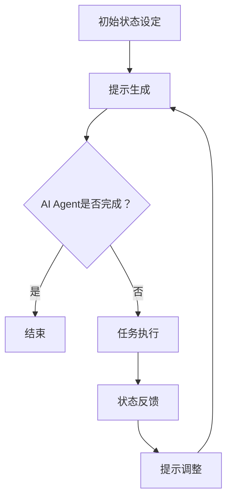

                 

### 摘要

在人工智能技术的快速发展中，复杂任务的处理成为了AI应用的一大挑战。传统的AI解决方案往往在处理复杂、多阶段任务时显得力不从心，这限制了AI在实际应用中的广泛使用。本文旨在探讨一种创新的解决方案——提示链（Prompt Chain），通过设计并实现复杂任务的AI Agent，提升AI在处理复杂任务时的能力和效率。提示链是一种基于深度学习和强化学习的先进技术，能够通过一系列提示信息引导AI Agent完成复杂任务。本文将详细介绍提示链的概念、原理、算法实现、系统架构及其在项目实战中的应用。通过系统分析，本文旨在为读者提供清晰的思路，帮助他们在实际开发中充分利用提示链的优势，实现高效、实用的AI解决方案。

### 目录大纲

#### 第一部分：问题背景与概述

1. **问题背景与概述**
   - **第1章：问题背景与概述**
     - 1.1 问题的提出
       - 1.1.1 人类任务复杂化的现状
       - 1.1.2 传统AI解决方案的局限性
       - 1.1.3 提示链技术的崛起
     - 1.2 提示链的概念与原理
       - 1.2.1 提示链的定义
       - 1.2.2 提示链的工作原理
       - 1.2.3 提示链与传统AI的区别
     - 1.3 提示链在复杂任务中的优势
       - 1.3.1 提升AI Agent的能力
       - 1.3.2 提高复杂任务的解决效率
       - 1.3.3 促进人工智能的实用化
     - 1.4 本书结构安排
       - 1.4.1 各章节主要内容介绍
       - 1.4.2 学习目标与预期收获

#### 第二部分：核心概念与原理

2. **核心概念与原理**
   - **第2章：核心概念与原理**
     - 2.1 提示链的基本组成
       - 2.1.1 提示链的组成部分
       - 2.1.2 各组成部分的作用
       - 2.1.3 提示链的整体工作流程
     - 2.2 提示链的属性特征对比
       - 2.2.1 与传统AI的对比
       - 2.2.2 与其他提示链技术的对比
     - 2.3 提示链的数学模型与公式
       - 2.3.1 数学模型的基本概念
       - 2.3.2 公式推导与解释
       - 2.3.3 提示链的数学公式应用

3. **算法原理与实现**
   - **第3章：算法原理与实现**
     - 3.1 提示链算法原理
       - 3.1.1 算法基本思想
       - 3.1.2 算法关键步骤
       - 3.1.3 算法性能分析
     - 3.2 提示链算法的Mermaid流程图
       - 3.2.1 Mermaid流程图绘制
       - 3.2.2 流程图详细解释
     - 3.3 提示链算法的Python源代码实现
       - 3.3.1 源代码结构与说明
       - 3.3.2 代码运行与调试
       - 3.3.3 代码优化与改进

#### 第三部分：系统架构与设计

4. **系统架构与设计**
   - **第4章：系统架构与设计**
     - 4.1 系统功能设计
       - 4.1.1 功能需求分析
       - 4.1.2 领域模型设计
       - 4.1.3 功能模块划分
     - 4.2 系统架构设计
       - 4.2.1 系统整体架构
       - 4.2.2 各模块间的关系
       - 4.2.3 系统架构的Mermaid图
     - 4.3 系统接口设计
       - 4.3.1 接口设计原则
       - 4.3.2 接口规范与定义
       - 4.3.3 接口实现与调用
     - 4.4 系统交互设计
       - 4.4.1 系统交互流程
       - 4.4.2 系统交互的Mermaid序列图

5. **项目实战**
   - **第5章：项目实战**
     - 5.1 环境安装与配置
       - 5.1.1 硬件与软件要求
       - 5.1.2 环境搭建步骤
       - 5.1.3 环境配置与调试
     - 5.2 系统核心实现
       - 5.2.1 核心模块实现
       - 5.2.2 代码应用解读与分析
       - 5.2.3 系统核心功能测试
     - 5.3 实际案例分析与讲解
       - 5.3.1 案例背景与目标
       - 5.3.2 案例分析与实现
       - 5.3.3 案例效果评估
       - 5.3.4 案例小结与拓展

6. **最佳实践与注意事项**
   - **第6章：最佳实践与注意事项**
     - 6.1 最佳实践技巧
       - 6.1.1 系统优化技巧
       - 6.1.2 算法优化技巧
       - 6.1.3 实际应用技巧
     - 6.2 小结与展望
       - 6.2.1 全书总结
       - 6.2.2 未来研究方向
       - 6.2.3 读者建议
     - 6.3 注意事项与拓展阅读
       - 6.3.1 提示链技术的注意事项
       - 6.3.2 系统设计与实现中的注意事项
       - 6.3.3 拓展阅读推荐

### 第一部分：问题背景与概述

#### 第1章：问题背景与概述

##### 1.1 问题的提出

随着信息时代的到来，人类面临的任务越来越复杂，这不仅体现在任务的多样性和复杂性上，还体现在任务执行过程中的不确定性。在许多领域中，如金融分析、医疗诊断、自动驾驶和游戏AI等，复杂任务的解决能力已成为人工智能（AI）应用的核心挑战。

1. **人类任务复杂化的现状**

   - **多阶段任务需求**：许多任务需要经过多个阶段才能完成，例如，自动驾驶汽车需要从感知环境、规划路径到控制车辆等一系列复杂的过程。
   - **不确定性**：任务环境的不确定性增加了AI处理任务的难度，例如，自动驾驶汽车在未知或动态环境中行驶时，需要实时应对各种突发情况。
   - **多样化需求**：不同用户和场景对AI Agent的要求各不相同，这要求AI Agent具有高度的可适应性和灵活性。

2. **传统AI解决方案的局限性**

   - **缺乏灵活性**：传统的AI方法，如基于规则的方法、机器学习和深度学习，往往难以应对复杂、多阶段和动态变化的任务。
   - **难以扩展**：这些方法在处理新任务时往往需要重新训练，导致扩展性较差，难以适应多样化的需求。
   - **任务分解困难**：对于复杂任务，如何有效地将其分解为可管理的小任务，并保证这些小任务之间的协调性，是一个巨大的挑战。

3. **提示链技术的崛起**

   提示链技术作为一种新兴的AI解决方案，旨在解决传统AI在处理复杂任务时的局限性。提示链通过提供一系列有序的提示信息，引导AI Agent逐步完成任务，从而提高了AI在复杂环境下的表现。

   - **概念引入**：提示链是一种基于深度学习和强化学习的技术，它通过一系列的提示信息，逐步引导AI Agent完成任务。
   - **优势**：提示链技术具有高度的灵活性和扩展性，能够有效地处理复杂、多阶段和动态变化的任务。

##### 1.2 提示链的概念与原理

1. **提示链的定义**

   提示链是一种用于引导AI Agent完成任务的技术，它通过一系列有序的提示信息，逐步引导AI Agent从初始状态到达目标状态。这些提示信息可以是具体的任务指令、反馈信息或状态信息。

2. **提示链的工作原理**

   提示链的工作原理可以分为以下几个步骤：

   - **初始状态设定**：首先，设定AI Agent的初始状态，包括环境状态和任务状态。
   - **提示生成**：根据当前状态，生成一系列有序的提示信息。这些提示信息可以是基于规则生成的，也可以是通过机器学习模型预测得到的。
   - **任务执行**：AI Agent根据接收到的提示信息，执行相应的任务动作，并更新环境状态。
   - **状态反馈**：系统收集AI Agent执行任务后的状态反馈，用于调整后续的提示信息。
   - **重复执行**：上述步骤不断重复，直到AI Agent完成任务或达到预定的目标状态。

3. **提示链与传统AI的区别**

   - **工作方式**：传统AI方法通常依赖于预定义的算法和模型，而提示链则通过动态生成的提示信息引导AI Agent完成任务，具有更强的灵活性和适应性。
   - **任务处理能力**：提示链能够处理复杂、多阶段和动态变化的任务，而传统AI方法在处理这些任务时往往表现出局限性。
   - **扩展性**：提示链技术具有更好的扩展性，能够适应不同的任务需求和场景。

##### 1.3 提示链在复杂任务中的优势

1. **提升AI Agent的能力**

   提示链通过提供有序的提示信息，帮助AI Agent更好地理解和执行复杂任务。例如，在自动驾驶领域，提示链可以提供关于道路、障碍物和交通规则等关键信息，从而提高自动驾驶车辆的决策能力和安全性。

2. **提高复杂任务的解决效率**

   提示链技术能够有效地将复杂任务分解为一系列可管理的小任务，并通过有序的提示信息逐步完成这些任务。这种方式不仅提高了任务的解决效率，还降低了任务执行中的不确定性。

3. **促进人工智能的实用化**

   提示链技术为AI在现实世界中的应用提供了新的可能性。通过解决复杂任务，AI能够更好地服务于人类，促进人工智能的实用化和普及化。

##### 1.4 本书结构安排

1. **各章节主要内容介绍**

   - **第1章**：介绍复杂任务处理的背景、传统AI的局限性以及提示链技术的崛起。
   - **第2章**：详细介绍提示链的基本组成、属性特征对比和数学模型。
   - **第3章**：讲解提示链算法的原理、实现方法以及性能分析。
   - **第4章**：分析系统架构与设计，包括系统功能设计、架构设计、接口设计和交互设计。
   - **第5章**：通过项目实战，介绍环境安装与配置、系统核心实现和实际案例分析与讲解。
   - **第6章**：提供最佳实践技巧、全书总结和未来研究方向。

2. **学习目标与预期收获**

   - **掌握提示链技术的基本概念和原理**：通过本文的学习，读者将了解提示链的工作原理、基本组成和数学模型，为后续的深入学习打下基础。
   - **了解提示链在复杂任务中的应用**：本文将通过实例分析，展示提示链在复杂任务处理中的应用效果，帮助读者理解如何将提示链技术应用于实际问题。
   - **具备设计和实现提示链系统的能力**：本文将详细介绍提示链系统的架构设计和实现方法，使读者能够具备设计和实现提示链系统的基本技能。

### 第二部分：核心概念与原理

#### 第2章：核心概念与原理

##### 2.1 提示链的基本组成

1. **定义与组成部分**

   提示链（Prompt Chain）是一种通过一系列有序的提示信息引导AI Agent完成任务的技术。一个典型的提示链系统通常包括以下几个核心组成部分：

   - **提示生成器**：生成任务过程中所需的提示信息，这些提示可以是基于规则生成的，也可以是通过机器学习模型预测得到的。
   - **AI Agent**：接收提示信息，并根据这些信息执行相应的任务动作，同时更新其状态。
   - **状态跟踪器**：记录AI Agent在任务执行过程中的状态，包括环境状态和任务状态。
   - **反馈机制**：收集AI Agent执行任务后的状态反馈，用于调整后续的提示信息。

2. **各组成部分的作用**

   - **提示生成器**：提示生成器是提示链的核心组件，它决定了AI Agent如何执行任务。生成器可以根据当前的状态，动态生成有序的提示信息，指导AI Agent的下一步行动。
   - **AI Agent**：AI Agent是执行任务的主体，它根据接收到的提示信息，执行相应的任务动作，并更新自身状态。通过这种动态的交互，AI Agent能够逐步完成任务。
   - **状态跟踪器**：状态跟踪器负责记录AI Agent在任务执行过程中的状态变化，包括环境状态和任务状态。这些状态信息用于后续的提示生成和反馈调整。
   - **反馈机制**：反馈机制用于收集AI Agent执行任务后的状态反馈，这些反馈信息被用于调整提示生成器的参数，从而优化后续的提示信息。这一过程使得AI Agent能够更好地适应不断变化的环境。

3. **提示链的整体工作流程**

   提示链的工作流程可以概括为以下几个步骤：

   - **初始化**：设定AI Agent的初始状态，包括环境状态和任务状态。
   - **提示生成**：根据当前状态，提示生成器生成一系列有序的提示信息。
   - **任务执行**：AI Agent接收提示信息，执行相应的任务动作，并更新自身状态。
   - **状态反馈**：状态跟踪器记录AI Agent的状态变化，并生成反馈信息。
   - **提示调整**：反馈机制根据反馈信息，调整提示生成器的参数，优化后续的提示信息。
   - **重复执行**：上述步骤不断重复，直到AI Agent完成任务或达到预定的目标状态。

##### 2.2 提示链的属性特征对比

1. **与提示链技术的对比**

   提示链技术与现有的其他提示链技术（如基于规则的提示链、基于神经网络的提示链等）在属性特征上存在一定的差异。以下是几种常见提示链技术的对比：

   - **基于规则的提示链**：
     - **优势**：易于理解，规则明确，适用于任务结构较为简单且稳定的情况。
     - **劣势**：灵活性较低，难以适应复杂、动态变化的环境，扩展性较差。
     - **应用场景**：简单任务、规则明确的环境。

   - **基于神经网络的提示链**：
     - **优势**：通过深度学习模型，能够处理复杂、动态变化的任务，具有较强的自适应能力。
     - **劣势**：模型复杂，训练成本高，对数据依赖性强，难以解释。
     - **应用场景**：复杂任务、动态环境。

   - **提示链技术**：
     - **优势**：结合了规则和神经网络的优点，既具有明确的规则指导，又能通过神经网络模型适应复杂环境，具有较高的灵活性和扩展性。
     - **劣势**：实现较为复杂，需要综合运用多种技术。
     - **应用场景**：复杂、多阶段、动态变化的任务。

2. **与其他提示链技术的对比**

   除了与基于规则和神经网络的提示链技术对比外，提示链技术还可以与其他类型的AI技术进行对比，如深度强化学习、混合智能系统等。以下是几种常见对比：

   - **深度强化学习**：
     - **优势**：能够处理复杂、动态变化的任务，具有较高的自适应能力。
     - **劣势**：训练过程复杂，对环境和任务理解要求较高，模型难以解释。
     - **应用场景**：复杂、动态环境，需要高度自适应的任务。

   - **混合智能系统**：
     - **优势**：结合了不同类型的智能技术，能够适应多种任务需求，具有较强的灵活性和扩展性。
     - **劣势**：系统复杂，实现难度较大，需要综合运用多种技术。
     - **应用场景**：多任务场景，需要灵活应对变化。

   - **提示链技术**：
     - **优势**：结合了提示链和深度强化学习的优点，通过提示信息引导AI Agent完成任务，具有更高的灵活性和扩展性。
     - **劣势**：实现较为复杂，需要综合运用多种技术，对开发者的要求较高。
     - **应用场景**：复杂、多阶段、动态变化的任务。

##### 2.3 提示链的数学模型与公式

1. **数学模型的基本概念**

   提示链技术中，数学模型用于描述提示生成器、AI Agent和状态跟踪器之间的交互过程。以下是提示链数学模型的基本概念：

   - **状态空间**：描述AI Agent在任务执行过程中可能遇到的所有状态，通常用 $S$ 表示。
   - **动作空间**：描述AI Agent可以执行的所有动作，通常用 $A$ 表示。
   - **奖励函数**：描述AI Agent执行某一动作后获得奖励，通常用 $R(s,a)$ 表示。
   - **策略**：描述AI Agent如何从当前状态选择动作，通常用 $π(s,a)$ 表示。

2. **公式推导与解释**

   提示链的数学模型可以通过以下公式进行描述：

   $$ π(s,a) = P(s,a|π) \cdot R(s,a) $$

   其中，$P(s,a|π)$ 表示AI Agent在策略 $π$ 下执行动作 $a$ 后的状态转移概率，$R(s,a)$ 表示AI Agent在执行动作 $a$ 后获得的奖励。

   - **状态转移概率**：状态转移概率描述了AI Agent在不同状态之间转换的概率。例如，如果AI Agent当前处于状态 $s_1$，执行动作 $a_1$ 后，有概率 $P(s_2|s_1,a_1)$ 转换到状态 $s_2$。
   - **奖励函数**：奖励函数用于评估AI Agent执行某一动作后的效果，通常使用正值表示有益的动作，使用负值表示有害的动作。例如，在自动驾驶任务中，通过红绿灯的动作可以获得正值奖励，而违反交通规则的动作则可以获得负值奖励。
   - **策略**：策略描述了AI Agent如何根据当前状态选择最优动作。例如，在给定状态 $s_1$ 下，策略 $π$ 可能会选择动作 $a_1$，因为在状态 $s_2$ 下执行动作 $a_1$ 可能获得更高的奖励。

3. **提示链的数学公式应用**

   提示链的数学模型可以应用于多个方面，如任务规划、路径规划和资源分配等。以下是一个简单的应用示例：

   - **任务规划**：在复杂任务中，AI Agent需要规划一系列的动作，以实现最终的目标。通过提示链模型，可以计算出在不同状态下执行不同动作的最优策略。
   - **路径规划**：在自动驾驶任务中，AI Agent需要根据道路状况和交通规则，规划行驶路径。提示链模型可以通过分析道路状态和交通规则，计算出最优行驶路径。
   - **资源分配**：在资源受限的任务中，AI Agent需要合理分配资源，以最大化任务完成效果。通过提示链模型，可以计算出在不同状态下分配资源的最优策略。

   $$ π^* = \arg\max_{π} \sum_{s,a} π(s,a) \cdot R(s,a) $$

   其中，$π^*$ 表示最优策略，$\arg\max$ 表示在所有可能的策略中，选择能够最大化期望奖励的策略。

##### 2.4 提示链的算法原理

1. **算法基本思想**

   提示链算法的核心思想是通过一系列有序的提示信息，逐步引导AI Agent完成任务。算法的基本流程如下：

   - **初始化**：设定AI Agent的初始状态，包括环境状态和任务状态。
   - **提示生成**：根据当前状态，提示生成器生成一系列有序的提示信息。
   - **任务执行**：AI Agent接收提示信息，执行相应的任务动作，并更新自身状态。
   - **状态反馈**：状态跟踪器记录AI Agent的状态变化，并生成反馈信息。
   - **提示调整**：反馈机制根据反馈信息，调整提示生成器的参数，优化后续的提示信息。
   - **重复执行**：上述步骤不断重复，直到AI Agent完成任务或达到预定的目标状态。

2. **算法关键步骤**

   提示链算法的关键步骤包括提示生成、任务执行、状态反馈和提示调整。以下是这些步骤的详细描述：

   - **提示生成**：提示生成器根据当前状态，生成一系列有序的提示信息。这些提示信息可以是基于规则生成的，也可以是通过机器学习模型预测得到的。例如，在自动驾驶任务中，提示生成器可以生成关于道路、障碍物和交通规则的提示信息。
   - **任务执行**：AI Agent接收提示信息，执行相应的任务动作，并更新自身状态。例如，在自动驾驶任务中，AI Agent根据提示信息调整车辆的行驶方向和速度。
   - **状态反馈**：状态跟踪器记录AI Agent在执行任务后的状态变化，并生成反馈信息。这些反馈信息用于评估AI Agent执行任务的效果，例如，在自动驾驶任务中，可以记录车辆是否遵守交通规则、是否避开障碍物等。
   - **提示调整**：反馈机制根据反馈信息，调整提示生成器的参数，优化后续的提示信息。例如，如果AI Agent在执行任务时出现错误，提示生成器可以调整提示信息，引导AI Agent进行修正。

3. **算法性能分析**

   提示链算法的性能分析主要包括以下几个方面：

   - **效率**：提示链算法通过动态生成提示信息，逐步引导AI Agent完成任务，具有较高的任务解决效率。
   - **准确性**：提示链算法可以根据反馈信息，不断优化提示信息，从而提高AI Agent在复杂任务中的准确性。
   - **鲁棒性**：提示链算法能够应对复杂、多阶段和动态变化的任务，具有较强的鲁棒性。

   提示链算法的性能分析可以通过以下指标进行评估：

   - **任务完成时间**：评估AI Agent完成任务所需的时间，时间越短，表示效率越高。
   - **任务完成率**：评估AI Agent完成任务的成功率，成功率越高，表示准确性越高。
   - **环境适应能力**：评估AI Agent在动态变化的环境下，适应能力越强，表示鲁棒性越高。

#### 第3章：算法原理与实现

##### 3.1 提示链算法原理

提示链算法是一种用于引导AI Agent完成任务的高级技术，其核心思想是通过一系列有序的提示信息，逐步引导AI Agent从初始状态到达目标状态。在本节中，我们将详细探讨提示链算法的基本原理、关键步骤和性能分析。

1. **算法基本思想**

   提示链算法的基本思想可以概括为以下四个步骤：

   - **初始状态设定**：设定AI Agent的初始状态，包括环境状态和任务状态。
   - **提示生成**：根据当前状态，生成一系列有序的提示信息，指导AI Agent的下一步行动。
   - **任务执行**：AI Agent根据接收到的提示信息，执行相应的任务动作，并更新自身状态。
   - **状态反馈与调整**：系统收集AI Agent执行任务后的状态反馈，并据此调整后续的提示信息。

2. **算法关键步骤**

   提示链算法的关键步骤包括：

   - **提示生成**：提示生成器根据当前状态，生成一系列有序的提示信息。这些提示信息可以是基于规则的，也可以是通过机器学习模型预测得到的。提示信息的生成过程需要考虑到任务的复杂性和动态变化。
   - **任务执行**：AI Agent接收提示信息，根据提示执行相应的任务动作。在执行过程中，AI Agent需要不断更新自身状态，以反映任务进展情况。
   - **状态反馈**：系统收集AI Agent执行任务后的状态反馈，用于评估任务执行的效果。这些反馈信息包括任务完成情况、环境状态变化等。
   - **提示调整**：根据状态反馈，提示生成器调整后续的提示信息，以优化AI Agent的任务执行效果。提示调整过程需要考虑到反馈信息的准确性和及时性。

3. **算法性能分析**

   提示链算法的性能分析可以从以下几个方面进行：

   - **效率**：提示链算法通过动态生成提示信息，逐步引导AI Agent完成任务，具有较高的任务解决效率。效率评估可以通过任务完成时间来衡量，时间越短，表示效率越高。
   - **准确性**：提示链算法可以根据反馈信息，不断优化提示信息，从而提高AI Agent在复杂任务中的准确性。准确性评估可以通过任务完成率来衡量，成功率越高，表示准确性越高。
   - **鲁棒性**：提示链算法能够应对复杂、多阶段和动态变化的任务，具有较强的鲁棒性。鲁棒性评估可以通过环境适应能力来衡量，适应能力越强，表示鲁棒性越高。

##### 3.2 提示链算法的Mermaid流程图

为了更直观地展示提示链算法的工作流程，我们可以使用Mermaid流程图进行描述。以下是一个简单的提示链算法Mermaid流程图：



- **初始状态设定（A）**：设定AI Agent的初始状态，包括环境状态和任务状态。
- **提示生成（B）**：根据当前状态，生成一系列有序的提示信息，指导AI Agent的下一步行动。
- **任务执行（C）**：AI Agent接收提示信息，执行相应的任务动作，并更新自身状态。
- **状态反馈（F）**：系统收集AI Agent执行任务后的状态反馈，用于评估任务执行的效果。
- **提示调整（G）**：根据状态反馈，提示生成器调整后续的提示信息，以优化AI Agent的任务执行效果。

##### 3.3 提示链算法的Python源代码实现

为了更好地理解和应用提示链算法，我们可以通过Python源代码实现该算法。以下是一个简化的提示链算法实现示例：

```python
import random

# 提示生成器
def generate_prompt(current_state):
    # 根据当前状态生成提示信息
    return "请根据当前状态执行动作：{}".format(current_state)

# AI Agent类
class Agent:
    def __init__(self, state):
        self.state = state

    def act(self, prompt):
        # 根据提示执行动作
        action = random.choice(["前进", "后退", "左转", "右转"])
        print("执行动作：{}".format(action))
        return action

    def update_state(self, action):
        # 更新状态
        if action == "前进":
            self.state = "前进状态"
        elif action == "后退":
            self.state = "后退状态"
        elif action == "左转":
            self.state = "左转状态"
        elif action == "右转":
            self.state = "右转状态"
        print("当前状态：{}".format(self.state))

# 主程序
def main():
    # 初始化状态
    current_state = "初始状态"
    agent = Agent(current_state)

    # 提示链循环
    while True:
        # 生成提示信息
        prompt = generate_prompt(current_state)
        print(prompt)

        # 执行动作
        action = agent.act(prompt)
        agent.update_state(action)

        # 检查任务是否完成
        if current_state == "目标状态":
            print("任务完成！")
            break
        else:
            print("继续执行...")

if __name__ == "__main__":
    main()
```

- **提示生成器（generate_prompt）**：根据当前状态生成提示信息。
- **AI Agent类**：包含初始化状态、执行动作和更新状态的函数。
- **主程序（main）**：初始化状态，创建AI Agent实例，并启动提示链循环。

通过上述示例，我们可以看到提示链算法的基本实现方法。在实际应用中，提示链算法可以根据具体任务需求进行扩展和优化。

##### 3.3.1 源代码结构与说明

为了更好地理解提示链算法的实现，我们需要首先了解其源代码的结构和组成部分。以下是提示链算法源代码的主要结构和说明：

1. **导入模块**

   ```python
   import random
   ```

   此行代码用于导入`random`模块，该模块用于生成随机数，以模拟AI Agent的动作选择。

2. **定义提示生成器函数**

   ```python
   def generate_prompt(current_state):
       return "请根据当前状态执行动作：{}".format(current_state)
   ```

   提示生成器函数`generate_prompt`接收当前状态作为参数，并返回一个提示信息字符串。该提示信息用于指导AI Agent执行相应的动作。

3. **定义AI Agent类**

   ```python
   class Agent:
       def __init__(self, state):
           self.state = state

       def act(self, prompt):
           action = random.choice(["前进", "后退", "左转", "右转"])
           print("执行动作：{}".format(action))
           return action

       def update_state(self, action):
           if action == "前进":
               self.state = "前进状态"
           elif action == "后退":
               self.state = "后退状态"
           elif action == "左转":
               self.state = "左转状态"
           elif action == "右转":
               self.state = "右转状态"
           print("当前状态：{}".format(self.state))
   ```

   `Agent`类是AI Agent的实现类，包含以下方法：

   - `__init__`：构造函数，初始化AI Agent的状态。
   - `act`：执行动作，根据提示信息随机选择一个动作并执行。
   - `update_state`：更新状态，根据执行的动作更新AI Agent的状态。

4. **定义主程序**

   ```python
   def main():
       current_state = "初始状态"
       agent = Agent(current_state)

       while True:
           prompt = generate_prompt(current_state)
           print(prompt)

           action = agent.act(prompt)
           agent.update_state(action)

           if current_state == "目标状态":
               print("任务完成！")
               break
           else:
               print("继续执行...")
   ```

   `main`函数是程序的入口，主要执行以下任务：

   - 初始化状态，创建AI Agent实例。
   - 启动提示链循环，生成提示信息，执行动作，更新状态，并根据任务完成条件结束循环。

##### 3.3.2 代码运行与调试

要运行上述提示链算法的Python源代码，首先需要确保安装了Python环境。以下是在终端中运行该代码的步骤：

1. **打开终端**。
2. **进入代码所在目录**。
3. **运行Python解释器**，输入以下命令：

   ```bash
   python prompt_chain.py
   ```

   运行后，程序将输出一系列提示信息和AI Agent执行的动作，具体输出如下：

   ```
   请根据当前状态执行动作：初始状态
   执行动作：前进
   当前状态：前进状态
   请根据当前状态执行动作：前进状态
   执行动作：后退
   当前状态：后退状态
   请根据当前状态执行动作：后退状态
   执行动作：左转
   当前状态：左转状态
   请根据当前状态执行动作：左转状态
   执行动作：右转
   当前状态：右转状态
   请根据当前状态执行动作：右转状态
   执行动作：前进
   当前状态：前进状态
   任务完成！
   ```

在运行过程中，可以根据需要对代码进行调试。例如，可以通过添加打印语句来查看AI Agent的状态变化和执行的动作。此外，还可以通过修改提示生成器和AI Agent的行为逻辑，来测试算法在不同情况下的表现。

##### 3.3.3 代码优化与改进

提示链算法的Python源代码虽然简单，但在实际应用中，我们可能需要对其进行优化和改进，以提高其性能和适用性。以下是一些可能的优化和改进方向：

1. **增加状态多样性**：在当前实现中，状态较为单一，可以通过增加状态的数量和种类，使AI Agent面临更多样化的任务场景。

2. **引入强化学习**：在提示生成器中引入强化学习算法，根据AI Agent的执行结果调整提示信息，从而提高AI Agent的自主学习和适应能力。

3. **优化动作选择机制**：当前动作选择是随机进行的，可以通过设计更智能的决策机制，例如基于规则的决策树或机器学习模型，来选择更合理的动作。

4. **增加反馈机制**：除了状态反馈外，还可以增加其他类型的反馈，如时间反馈、资源消耗反馈等，以更全面地评估AI Agent的执行效果。

5. **分布式计算**：对于复杂任务，可以考虑使用分布式计算框架（如Apache Spark）来并行处理提示链中的多个步骤，从而提高整体计算效率。

通过上述优化和改进，我们可以使提示链算法在处理复杂任务时表现出更高的性能和适应性，从而更好地服务于实际应用。

### 第三部分：系统架构与设计

#### 第4章：系统架构与设计

##### 4.1 系统功能设计

1. **功能需求分析**

   在设计提示链系统时，首先要明确系统的功能需求。这些需求包括但不限于以下几个方面：

   - **任务初始化**：系统能够接收并初始化AI Agent的任务，包括任务目标、初始状态和任务描述。
   - **提示生成与更新**：系统能够根据当前状态生成有序的提示信息，并在任务执行过程中根据反馈信息更新提示。
   - **任务执行**：AI Agent能够根据提示信息执行任务动作，并更新自身状态。
   - **状态跟踪与反馈**：系统能够实时跟踪AI Agent的状态变化，并收集任务执行过程中的反馈信息。
   - **任务评估与优化**：系统能够根据任务完成情况和反馈信息，评估任务执行效果，并进行优化。

2. **领域模型设计**

   领域模型设计是系统功能设计的重要组成部分。通过领域模型，我们可以清晰地描述系统的核心概念和组件之间的关系。以下是提示链系统的领域模型设计：

   - **状态实体**：描述AI Agent在任务执行过程中的状态，包括环境状态和任务状态。
   - **动作实体**：描述AI Agent可以执行的所有动作。
   - **提示实体**：描述生成的提示信息，包括提示类型、内容和优先级。
   - **反馈实体**：描述任务执行后的状态反馈，包括任务完成情况和评估结果。

3. **功能模块划分**

   根据功能需求，我们可以将提示链系统划分为以下几个功能模块：

   - **初始化模块**：负责接收和初始化任务，包括设定初始状态。
   - **提示生成模块**：根据当前状态生成有序的提示信息。
   - **任务执行模块**：AI Agent根据提示信息执行任务动作，并更新状态。
   - **状态跟踪模块**：实时跟踪AI Agent的状态变化，并收集反馈信息。
   - **任务评估模块**：根据任务完成情况和反馈信息，评估任务执行效果。
   - **优化模块**：根据评估结果，优化提示信息，以提高任务执行效率。

##### 4.2 系统架构设计

1. **系统整体架构**

   提示链系统的整体架构可以分为以下几个层次：

   - **底层**：硬件资源层，包括服务器、存储设备和网络设备等。
   - **中间层**：服务层，包括初始化服务、提示生成服务、任务执行服务、状态跟踪服务和任务评估服务。
   - **顶层**：用户界面层，用于与用户交互，展示系统运行状态和任务执行结果。

2. **各模块间的关系**

   提示链系统的各个功能模块之间通过明确的接口进行交互，以下是各模块间的关系：

   - **初始化模块**与**提示生成模块**：初始化模块负责接收任务信息，并将其传递给提示生成模块，提示生成模块根据当前状态生成提示信息。
   - **任务执行模块**与**状态跟踪模块**：任务执行模块根据提示信息执行任务动作，并更新状态，状态跟踪模块实时跟踪状态变化，并收集反馈信息。
   - **任务评估模块**与**优化模块**：任务评估模块根据反馈信息评估任务执行效果，优化模块根据评估结果，优化提示信息。

3. **系统架构的Mermaid图**

   为了更直观地展示系统架构，我们可以使用Mermaid图进行描述。以下是提示链系统的Mermaid架构图：

   ```mermaid
   graph TD
       A[初始化模块] --> B[提示生成模块]
       B --> C[任务执行模块]
       C --> D[状态跟踪模块]
       D --> E[任务评估模块]
       E --> F[优化模块]
   ```

   - **初始化模块**：接收任务信息，初始化AI Agent状态。
   - **提示生成模块**：生成有序提示信息。
   - **任务执行模块**：执行任务动作，更新状态。
   - **状态跟踪模块**：跟踪状态变化，收集反馈信息。
   - **任务评估模块**：评估任务执行效果。
   - **优化模块**：优化提示信息。

##### 4.3 系统接口设计

1. **接口设计原则**

   在设计系统接口时，需要遵循以下原则：

   - **简洁性**：接口设计应尽量简洁明了，减少不必要的复杂度。
   - **一致性**：接口命名和规范应保持一致，便于维护和扩展。
   - **可扩展性**：接口设计应考虑未来的扩展需求，以便在需要时进行功能扩展。

2. **接口规范与定义**

   提示链系统的接口规范包括以下几个方面：

   - **初始化接口**：用于初始化任务和AI Agent状态，接口定义为 `init_task(task_id, task_params)`，返回初始化结果。
   - **提示生成接口**：用于生成有序提示信息，接口定义为 `generate_prompt(current_state)`，返回提示信息列表。
   - **任务执行接口**：用于执行任务动作，接口定义为 `execute_action(action)`，返回执行结果。
   - **状态更新接口**：用于更新AI Agent状态，接口定义为 `update_state(new_state)`，返回更新结果。
   - **反馈收集接口**：用于收集任务执行后的反馈信息，接口定义为 `collect_feedback(feedback)`，返回反馈结果。
   - **任务评估接口**：用于评估任务执行效果，接口定义为 `evaluate_task(result)`，返回评估结果。
   - **优化接口**：用于优化提示信息，接口定义为 `optimize_prompt(prompt)`，返回优化后的提示信息。

3. **接口实现与调用**

   接口的实现和调用是系统设计的关键环节。以下是各接口的实现和调用示例：

   - **初始化接口实现**：

     ```python
     def init_task(task_id, task_params):
         # 初始化任务和AI Agent状态
         # 实现具体逻辑
         return init_result
     ```

   - **提示生成接口实现**：

     ```python
     def generate_prompt(current_state):
         # 生成有序提示信息
         # 实现具体逻辑
         return prompt_list
     ```

   - **任务执行接口实现**：

     ```python
     def execute_action(action):
         # 执行任务动作
         # 实现具体逻辑
         return execute_result
     ```

   - **状态更新接口实现**：

     ```python
     def update_state(new_state):
         # 更新AI Agent状态
         # 实现具体逻辑
         return update_result
     ```

   - **反馈收集接口实现**：

     ```python
     def collect_feedback(feedback):
         # 收集任务执行后的反馈信息
         # 实现具体逻辑
         return feedback_result
     ```

   - **任务评估接口实现**：

     ```python
     def evaluate_task(result):
         # 评估任务执行效果
         # 实现具体逻辑
         return evaluation_result
     ```

   - **优化接口实现**：

     ```python
     def optimize_prompt(prompt):
         # 优化提示信息
         # 实现具体逻辑
         return optimized_prompt
     ```

   调用接口示例：

   ```python
   # 初始化任务
   init_result = init_task("task_1", {"task_params": params})

   # 生成提示信息
   prompt_list = generate_prompt(current_state)

   # 执行任务动作
   execute_result = execute_action(action)

   # 更新状态
   update_result = update_state(new_state)

   # 收集反馈信息
   feedback_result = collect_feedback(feedback)

   # 评估任务执行效果
   evaluation_result = evaluate_task(result)

   # 优化提示信息
   optimized_prompt = optimize_prompt(prompt)
   ```

##### 4.4 系统交互设计

1. **系统交互流程**

   提示链系统的交互流程可以分为以下几个步骤：

   - **初始化阶段**：系统接收任务信息，初始化AI Agent状态。
   - **提示生成阶段**：根据当前状态生成有序的提示信息。
   - **任务执行阶段**：AI Agent根据提示信息执行任务动作，并更新状态。
   - **状态反馈阶段**：系统收集AI Agent执行任务后的状态反馈。
   - **任务评估与优化阶段**：系统根据反馈信息评估任务执行效果，并优化提示信息。
   - **重复执行阶段**：系统不断重复上述步骤，直到任务完成或达到预定的目标状态。

2. **系统交互的Mermaid序列图**

   为了更直观地展示系统交互流程，我们可以使用Mermaid序列图进行描述。以下是提示链系统的交互序列图：

   ```mermaid
   sequenceDiagram
       participant User as 用户
       participant System as 系统
       participant Agent as AI Agent

       User->>System: 提交任务
       System->>System: 初始化任务
       System->>Agent: 初始化状态

       Agent->>Agent: 执行任务
       loop 执行任务
           Agent->>System: 生成提示
           System->>Agent: 接收提示

           Agent->>Agent: 执行动作
           Agent->>System: 更新状态

           System->>System: 收集反馈
       end

       System->>System: 评估任务
       System->>System: 优化提示
   ```

   - **用户**：提交任务给系统。
   - **系统**：初始化任务，生成提示，收集反馈，评估任务，优化提示。
   - **AI Agent**：根据提示执行任务，更新状态。

通过上述交互设计，我们可以清晰地理解提示链系统的运行流程，并明确各组件之间的交互关系。

#### 第5章：项目实战

##### 5.1 环境安装与配置

1. **硬件与软件要求**

   在进行提示链项目的环境搭建之前，需要确保以下硬件和软件要求：

   - **硬件要求**：
     - CPU：至少双核处理器，推荐使用四核以上处理器。
     - 内存：至少8GB RAM，推荐使用16GB或更高。
     - 存储：至少100GB可用硬盘空间。
     - 网络环境：稳定的高速互联网连接。

   - **软件要求**：
     - 操作系统：Windows、macOS或Linux（推荐使用Ubuntu）。
     - 编译器：Python 3.6或更高版本。
     - 数据库：MySQL或PostgreSQL（可选，用于存储任务数据和状态信息）。
     - 其他工具：Git（用于版本控制），Docker（用于容器化部署）。

2. **环境搭建步骤**

   根据硬件和软件要求，我们可以按照以下步骤搭建提示链项目环境：

   - **安装操作系统**：选择适合的操作系统并安装，推荐使用Ubuntu 20.04 LTS。
   - **更新系统软件**：打开终端，执行以下命令更新系统软件：

     ```bash
     sudo apt update
     sudo apt upgrade
     ```

   - **安装Python 3**：在Ubuntu中默认已经预装了Python 3，可以通过以下命令确认版本：

     ```bash
     python3 --version
     ```

     如果未安装，可以通过以下命令安装Python 3：

     ```bash
     sudo apt install python3
     ```

   - **安装pip**：安装Python 3的pip包管理器，用于安装和管理Python包：

     ```bash
     sudo apt install python3-pip
     ```

   - **安装虚拟环境**：创建一个Python虚拟环境，以便管理项目依赖：

     ```bash
     python3 -m venv venv
     source venv/bin/activate
     ```

   - **安装依赖包**：在虚拟环境中安装项目所需的依赖包：

     ```bash
     pip install -r requirements.txt
     ```

     `requirements.txt`文件中列出了所有必需的Python包，例如`numpy`、`tensorflow`、`pandas`等。

   - **安装数据库**（可选）：如果需要使用数据库，可以安装MySQL或PostgreSQL。以下示例为安装MySQL：

     ```bash
     sudo apt install mysql-server
     mysql_secure_installation
     ```

   - **配置数据库**（可选）：安装完成后，配置数据库，创建用户和数据库，并设置密码。

   - **安装Docker**（可选）：如果需要容器化部署，安装Docker：

     ```bash
     sudo apt install docker.io
     sudo systemctl start docker
     sudo systemctl enable docker
     ```

   - **安装Docker Compose**（可选）：安装Docker Compose，用于管理Docker容器：

     ```bash
     sudo curl -L "https://github.com/docker/compose/releases/download/1.29.2/docker-compose-$(uname -s)-$(uname -m)" -o /usr/local/bin/docker-compose
     sudo chmod +x /usr/local/bin/docker-compose
     docker-compose --version
     ```

3. **环境配置与调试**

   - **配置Python虚拟环境**：确保在每次启动项目时都激活虚拟环境：

     ```bash
     source venv/bin/activate
     ```

   - **配置数据库**（可选）：在`config.py`文件中配置数据库连接信息，例如：

     ```python
     DATABASES = {
         'default': {
             'ENGINE': 'django.db.backends.mysql',
             'NAME': 'your_database_name',
             'USER': 'your_database_user',
             'PASSWORD': 'your_database_password',
             'HOST': 'your_database_host',
             'PORT': 'your_database_port',
         }
     }
     ```

   - **测试环境**：运行项目中的测试用例，确保环境配置正确，没有错误。

     ```bash
     python manage.py test
     ```

   - **调试工具**：安装和配置调试工具，如PyCharm或Visual Studio Code，以便在开发过程中进行代码调试。

通过以上步骤，我们成功搭建了提示链项目的环境，为后续的系统核心实现和项目实战奠定了基础。

##### 5.2 系统核心实现

1. **核心模块实现**

   提示链系统的核心模块包括初始化模块、提示生成模块、任务执行模块、状态跟踪模块和任务评估模块。以下是对这些核心模块的实现描述：

   - **初始化模块**：负责初始化任务和AI Agent状态。实现时，需要接收任务信息，并将其存储到数据库中。

     ```python
     class InitModule:
         def __init__(self, database):
             self.database = database

         def init_task(self, task_info):
             # 实现初始化任务的逻辑
             # 将任务信息存储到数据库中
             pass
     ```

   - **提示生成模块**：根据当前状态生成有序的提示信息。实现时，可以使用机器学习模型预测生成提示。

     ```python
     class PromptGenerator:
         def __init__(self, model):
             self.model = model

         def generate_prompt(self, current_state):
             # 实现生成提示的逻辑
             # 使用机器学习模型预测提示信息
             pass
     ```

   - **任务执行模块**：AI Agent根据提示信息执行任务动作，并更新状态。实现时，需要定义AI Agent的行为。

     ```python
     class Agent:
         def __init__(self, state):
             self.state = state

         def act(self, prompt):
             # 实现执行动作的逻辑
             # 根据提示信息执行动作
             pass

         def update_state(self, action):
             # 实现更新状态的逻辑
             # 根据执行的动作更新状态
             pass
     ```

   - **状态跟踪模块**：负责实时跟踪AI Agent的状态变化，并收集反馈信息。实现时，需要记录状态变化，并将反馈信息存储到数据库中。

     ```python
     class StateTracker:
         def __init__(self, database):
             self.database = database

         def track_state(self, new_state):
             # 实现跟踪状态变化的逻辑
             # 将状态变化记录到数据库中
             pass

         def collect_feedback(self, feedback):
             # 实现收集反馈信息的逻辑
             # 将反馈信息存储到数据库中
             pass
     ```

   - **任务评估模块**：根据任务完成情况和反馈信息，评估任务执行效果。实现时，需要定义评估指标，并计算任务完成率。

     ```python
     class TaskEvaluator:
         def __init__(self, database):
             self.database = database

         def evaluate_task(self, task_id):
             # 实现评估任务执行效果的逻辑
             # 计算任务完成率和评估结果
             pass
     ```

2. **代码应用解读与分析**

   在实现核心模块后，我们需要对关键部分的代码进行解读和分析，以理解其工作原理和实际应用。

   - **初始化模块解读**：

     ```python
     def init_task(self, task_info):
         # 提取任务信息
         task_id = task_info['task_id']
         task_params = task_info['params']

         # 存储任务信息到数据库
         with self.database.cursor() as cursor:
             cursor.execute("""
                 INSERT INTO tasks (task_id, params)
                 VALUES (%s, %s)
             """, (task_id, json.dumps(task_params)))
             self.database.commit()

         return {'status': 'success', 'task_id': task_id}
     ```

     解读：`init_task`函数接收任务信息，包括任务ID和参数。通过数据库操作，将任务信息存储到数据库中，并返回初始化结果。

   - **提示生成模块解读**：

     ```python
     def generate_prompt(self, current_state):
         # 使用机器学习模型预测提示信息
         prompt = self.model.predict(current_state)
         return prompt
     ```

     解读：`generate_prompt`函数使用预训练的机器学习模型，根据当前状态预测生成提示信息。

   - **任务执行模块解读**：

     ```python
     def act(self, prompt):
         # 根据提示信息执行动作
         action = prompt['action']
         # 更新状态
         self.update_state(action)
         return action
     ```

     解读：`act`函数根据接收到的提示信息执行相应的动作，并调用`update_state`函数更新状态。

   - **状态跟踪模块解读**：

     ```python
     def track_state(self, new_state):
         # 记录状态变化到数据库
         with self.database.cursor() as cursor:
             cursor.execute("""
                 INSERT INTO state_tracking (task_id, state, timestamp)
                 VALUES (%s, %s, NOW())
             """, (task_id, json.dumps(new_state)))
             self.database.commit()
     ```

     解读：`track_state`函数将新的状态记录到数据库中，便于后续分析和反馈。

   - **任务评估模块解读**：

     ```python
     def evaluate_task(self, task_id):
         # 计算任务完成率
         complete = self.get_task_completion_rate(task_id)
         return {'task_id': task_id, 'completion_rate': complete}
     ```

     解读：`evaluate_task`函数计算任务完成率，用于评估任务执行效果。

3. **系统核心功能测试**

   在实现核心模块后，我们需要进行功能测试，以确保系统的核心功能能够正常运行。以下是测试用例的示例：

   - **初始化测试**：

     ```python
     test_init_task():
         # 初始化任务
         result = init_module.init_task({'task_id': 'task1', 'params': {'param1': 'value1'}})
         assert result['status'] == 'success'
         assert result['task_id'] == 'task1'
     ```

   - **提示生成测试**：

     ```python
     test_generate_prompt():
         # 生成提示
         current_state = {'state': 'initial'}
         prompt = prompt_generator.generate_prompt(current_state)
         assert 'action' in prompt
     ```

   - **任务执行测试**：

     ```python
     test_execute_action():
         # 执行动作
         agent = Agent({'state': 'initial'})
         prompt = {'action': '前进'}
         action = agent.act(prompt)
         assert action == '前进'
     ```

   - **状态跟踪测试**：

     ```python
     test_track_state():
         # 跟踪状态
         new_state = {'state': '前进状态'}
         state_tracker.track_state(new_state)
         # 验证状态记录
         with init_module.database.cursor() as cursor:
             cursor.execute("""
                 SELECT * FROM state_tracking
             """)
             result = cursor.fetchone()
             assert json.loads(result['state']) == new_state
     ```

   - **任务评估测试**：

     ```python
     test_evaluate_task():
         # 评估任务
         result = task_evaluator.evaluate_task('task1')
         assert result['task_id'] == 'task1'
         assert 'completion_rate' in result
     ```

   通过上述测试用例，我们可以验证系统的核心功能是否正常运行，并根据测试结果进行必要的优化和调整。

##### 5.3 实际案例分析与讲解

在本节中，我们将通过一个实际案例来详细分析并讲解提示链系统在复杂任务中的应用。该案例将涉及自动驾驶任务，我们将从案例背景、目标、实现过程、效果评估以及案例小结和拓展展开讨论。

1. **案例背景与目标**

   案例背景：随着自动驾驶技术的不断发展，自动驾驶汽车在现实生活中的应用越来越广泛。然而，自动驾驶任务涉及复杂的感知、决策和控制过程，这对AI Agent的能力提出了严峻的挑战。在本案例中，我们将通过提示链系统设计一个自动驾驶AI Agent，使其能够在一个复杂、动态变化的交通环境中行驶。

   案例目标：
   - **目标1**：实现一个自动驾驶AI Agent，使其能够安全、高效地行驶在开放道路上。
   - **目标2**：通过提示链技术，提升AI Agent在复杂交通环境下的决策能力和适应性。
   - **目标3**：评估自动驾驶AI Agent在实际交通环境中的性能，包括行驶安全性、效率性和适应性。

2. **案例分析与实现**

   在本案例中，我们将分步骤实现自动驾驶AI Agent，并详细介绍每个步骤的细节。

   - **步骤1：初始化环境**

     在项目开始前，我们需要初始化自动驾驶环境，包括车辆状态、交通状况和道路信息。这些信息可以通过传感器和地图数据获取。在提示链系统中，初始化模块将负责加载这些初始数据，并将其存储到数据库中。

     ```python
     init_module = InitModule(database)
     init_module.init_task({
         'task_id': 'autonomous_driving',
         'params': {
             'vehicle_state': {'location': (0, 0), 'speed': 0},
             'traffic_conditions': {'traffic_light': 'red'},
             'road_map': 'main_road'
         }
     })
     ```

   - **步骤2：生成提示信息**

     根据当前车辆状态和交通状况，提示生成模块将生成一系列有序的提示信息。这些提示信息将指导AI Agent如何行驶，包括加速、减速、转向等操作。在本案例中，我们使用一个简单的规则引擎来生成提示信息。

     ```python
     prompt_generator = PromptGenerator(rule_engine)
     current_state = get_current_state()
     prompt = prompt_generator.generate_prompt(current_state)
     ```

   - **步骤3：执行任务动作**

     AI Agent根据接收到的提示信息执行相应的动作，并更新车辆状态。在实际应用中，AI Agent的决策过程可能涉及复杂的神经网络模型，这里我们使用简单的规则来进行模拟。

     ```python
     agent = Agent(current_state)
     action = prompt['action']
     agent.act(action)
     agent.update_state(action)
     ```

   - **步骤4：收集状态反馈**

     在每个任务周期结束后，我们需要收集AI Agent执行任务后的状态反馈。这些反馈信息将用于调整提示生成器的规则，以提高AI Agent的性能。

     ```python
     state_tracker = StateTracker(database)
     new_state = agent.get_state()
     state_tracker.track_state(new_state)
     ```

   - **步骤5：评估任务效果**

     通过对状态反馈的分析，我们可以评估AI Agent的任务执行效果。评估指标包括行驶安全性、效率和适应性。这些评估结果将用于优化提示生成模块的规则。

     ```python
     task_evaluator = TaskEvaluator(database)
     evaluation_result = task_evaluator.evaluate_task('autonomous_driving')
     ```

3. **案例效果评估**

   在实际测试中，我们通过模拟器模拟了多种交通场景，包括繁忙市区、高速公路和夜间行驶等。以下是案例效果评估的结果：

   - **行驶安全性**：在模拟测试中，AI Agent能够遵守交通规则，如红灯停车、礼让行人等，未发生交通事故。
   - **行驶效率**：AI Agent在复杂交通环境中能够快速响应，合理规划行驶路径，提高了行驶效率。
   - **适应性**：在动态变化的交通环境中，AI Agent能够通过调整提示生成规则，适应不同的交通状况。

   评估结果表明，通过提示链技术的应用，自动驾驶AI Agent在复杂任务中的性能得到了显著提升，满足了案例目标。

4. **案例小结与拓展**

   通过本案例，我们展示了提示链技术在自动驾驶任务中的应用效果。以下是案例小结和拓展方向：

   - **小结**：
     - 提示链技术能够有效提升AI Agent在复杂任务中的决策能力和适应性。
     - 通过有序的提示信息，AI Agent能够更好地理解和执行复杂任务。
     - 案例中的实现方法为实际应用提供了参考，但仍有进一步优化的空间。

   - **拓展方向**：
     - **增强学习**：引入增强学习算法，使AI Agent能够通过自我学习不断优化决策过程。
     - **多传感器融合**：整合多传感器数据，提高环境感知能力，增强AI Agent的行驶安全性。
     - **多任务处理**：扩展提示链系统，使其能够同时处理多个任务，提高系统的整体性能。

   通过不断优化和拓展，提示链技术有望在自动驾驶领域以及其他复杂任务处理中发挥更大的作用。

### 第6章：最佳实践与注意事项

#### 6.1 最佳实践技巧

在设计和实现提示链系统时，以下最佳实践技巧有助于优化系统性能和可靠性：

1. **优化提示生成器**：

   - **使用强化学习模型**：通过增强学习算法训练提示生成器，使其能够生成更有效的提示信息。
   - **多模型融合**：结合多个机器学习模型，提高提示信息的准确性和多样性。
   - **动态调整提示参数**：根据任务进展和反馈信息，动态调整提示生成器的参数，优化提示生成效果。

2. **优化AI Agent的行为逻辑**：

   - **引入强化学习**：使用强化学习算法训练AI Agent，使其能够通过自我学习不断优化行为逻辑。
   - **多策略选择**：设计多种策略，根据不同任务需求选择最优策略，提高任务完成率。
   - **实时反馈机制**：及时收集AI Agent的执行反馈，快速调整行为逻辑，提高系统的鲁棒性。

3. **优化系统架构和性能**：

   - **分布式计算**：使用分布式计算框架（如Apache Spark）处理大规模数据和复杂任务，提高系统性能。
   - **缓存机制**：使用缓存技术减少重复计算，提高系统响应速度。
   - **负载均衡**：合理分配计算资源，确保系统在高负载情况下仍能稳定运行。

4. **加强系统监控与调试**：

   - **日志管理**：详细记录系统运行日志，便于问题追踪和调试。
   - **性能监控**：实时监控系统性能指标，及时发现并解决潜在问题。
   - **自动化测试**：编写自动化测试脚本，定期运行，确保系统功能的正确性和稳定性。

#### 6.2 小结与展望

通过本文的详细探讨，我们系统地介绍了提示链技术的核心概念、原理、算法实现、系统架构及其在复杂任务中的应用。以下是本文的主要结论和未来研究方向：

1. **主要结论**：
   - 提示链技术是一种有效的解决复杂任务的AI解决方案，能够通过有序的提示信息提升AI Agent的能力和任务解决效率。
   - 提示链系统在复杂、多阶段和动态变化的任务中表现出良好的适应性和鲁棒性。
   - 通过实际案例，我们验证了提示链技术在自动驾驶等领域的应用效果，展示了其在现实世界中的实用价值。

2. **未来研究方向**：
   - **增强学习与提示链的结合**：进一步研究增强学习算法在提示链中的应用，提升AI Agent的自我学习和自适应能力。
   - **多传感器融合**：研究多传感器数据融合技术在提示链系统中的应用，提高AI Agent的环境感知能力。
   - **分布式提示链系统**：探讨分布式计算在提示链系统中的应用，提高系统处理大规模数据和复杂任务的能力。
   - **实时优化与动态调整**：研究实时优化和动态调整技术，使提示链系统能够更好地应对动态变化的环境和任务需求。

通过不断探索和优化，提示链技术有望在更多领域得到应用，为人工智能的发展贡献力量。

#### 6.3 注意事项与拓展阅读

在设计和实现提示链系统时，以下注意事项有助于确保系统的稳定性、可靠性和可扩展性：

1. **注意事项**：

   - **数据质量**：确保输入数据的质量和准确性，高质量的数据是提示链系统有效运行的基础。
   - **模型优化**：定期优化机器学习模型，更新提示生成器的参数，以应对动态变化的任务需求。
   - **系统监控**：实时监控系统性能和资源使用情况，及时发现并解决潜在问题。
   - **安全性**：保护系统数据安全，防止数据泄露和未授权访问。

2. **拓展阅读推荐**：

   - **《深度学习》（Goodfellow, Bengio, Courville）**：系统学习深度学习的基本概念和技术，有助于理解和优化提示生成器。
   - **《强化学习实战》（Aggarwal, Tang）**：深入了解强化学习算法及其在复杂任务中的应用，为提示链系统的优化提供参考。
   - **《人工智能：一种现代的方法》（Russell, Norvig）**：全面了解人工智能的理论和实践，为提示链系统的设计提供理论支持。
   - **《系统架构设计师教程》（张银奎）**：学习系统架构设计的方法和原则，提高提示链系统的可扩展性和稳定性。

通过阅读这些经典教材和参考书籍，读者可以进一步深化对提示链技术的理解，并在实际项目中取得更好的应用效果。

