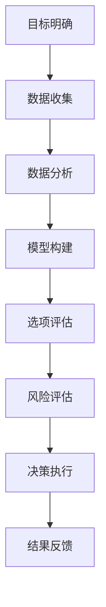
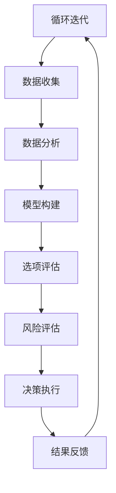
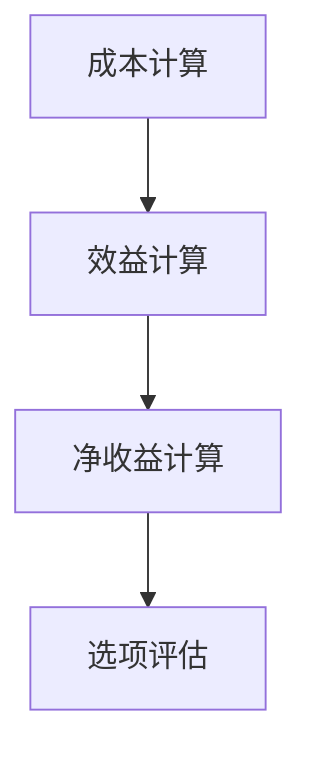
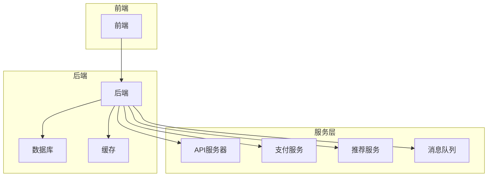
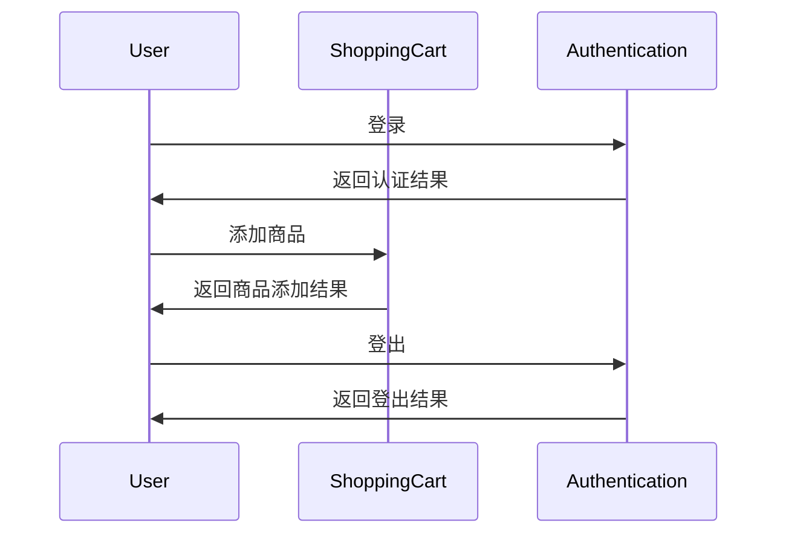

                 

### 引言与背景介绍

#### 1.1 书籍引言

欢迎来到《提高技术决策的质量与效率》。在这本书中，我们将深入探讨技术决策的重要性，以及如何通过科学的方法和工具来提升决策的质量和效率。我们的目标是帮助读者理解技术决策的核心概念，掌握有效的决策流程，最终在实际项目中实现高质量的决策。

本书面向的是那些希望提升技术决策能力的程序员、软件架构师、CTO以及相关技术管理者。无论您是在初创公司还是大型企业中工作，无论您是负责项目规划还是技术选型，本书都希望能够为您提供有价值的指导。

技术决策不仅仅关乎技术本身，更关乎业务的成功。一个错误的技术决策可能导致项目失败、资源浪费，甚至影响整个公司的战略方向。因此，提高技术决策的质量和效率是每一个技术从业者的必备技能。

#### 1.2 问题背景

当前，技术领域发展迅速，新技术层出不穷，技术决策的复杂性也随之增加。在这种情况下，技术决策面临着诸多挑战：

- **信息过载**：海量的技术信息和数据使得决策者难以筛选出有价值的信息。
- **不确定性**：技术趋势的不确定性增加了决策的难度，很难预见未来的变化。
- **时间压力**：在激烈的市场竞争中，决策者往往需要在有限的时间内做出关键决策。
- **资源限制**：有限的预算、人力和技术资源对决策的执行和效果产生了制约。

面对这些挑战，提高技术决策的质量和效率变得尤为重要。高质量的技术决策能够帮助团队在复杂的环境中保持竞争力，而高效的决策流程则能够确保决策能够在合理的时间内得到执行。

#### 1.3 问题描述

技术决策质量与效率的提升主要涉及以下几个方面：

- **决策质量**：决策的正确性和可靠性，能否准确满足业务需求，是否具有前瞻性和可持续性。
- **决策效率**：决策的速度和执行力，能否在有限的时间和资源内做出决策并迅速实施。

要提升技术决策的质量与效率，我们需要明确以下几个核心要素：

- **明确目标**：确保决策与业务目标和战略相一致。
- **数据支持**：基于充分的数据分析进行决策，减少盲目性和主观性。
- **模型和方法**：使用科学的方法和工具来评估不同选项的优缺点。
- **沟通协作**：团队内部和跨部门之间的有效沟通与协作，确保决策得到广泛的支持和执行。

#### 1.4 解决方案框架

为了提升技术决策的质量与效率，我们提出以下解决方案框架：

1. **明确决策流程**：建立一套标准化的决策流程，确保每个决策步骤都得到充分考虑。
2. **构建知识库**：积累和整理与决策相关的知识、经验和案例，为决策提供参考。
3. **使用工具和方法**：借助数据分析和决策支持工具，提高决策的准确性和效率。
4. **培训与反馈**：定期对团队成员进行培训，提高他们的决策能力和技术视野，同时通过反馈机制不断优化决策流程。

#### 1.5 边界与外延

本书主要关注技术决策的基本原理和实践方法，涉及的内容包括决策流程、数据支持、模型和方法等。同时，我们也会讨论决策过程中可能遇到的一些挑战和解决方案。

然而，本书并不涉及具体的技术实现细节，例如编程语言、开发框架等。我们旨在提供一种通用的决策框架和方法论，适用于各种技术场景。

此外，技术决策是一个动态的过程，需要不断地调整和优化。因此，本书提供的内容和方法仅供参考，实际应用时需要结合具体情况进行灵活调整。

### 核心概念与原理

#### 2.1 核心概念与联系

在技术决策中，理解以下几个核心概念是非常关键的：

1. **目标明确**：明确决策的目标是决策的基础。目标应具体、可衡量，并与业务战略保持一致。
2. **数据驱动**：数据是决策的重要依据。数据的质量和完整性直接影响决策的准确性。
3. **模型和方法**：不同的模型和方法可以帮助评估不同选项的优缺点，提高决策的科学性。
4. **风险评估**：对决策可能带来的风险进行评估，确保决策的可接受性。
5. **协作与沟通**：团队内部和跨部门之间的协作与沟通是决策成功的关键。

以下是一个概念联系表，展示了这些核心概念之间的关系：

| 概念 | 关系 |
| --- | --- |
| 目标明确 | 决策的起点和终点 |
| 数据驱动 | 支持决策的依据 |
| 模型和方法 | 评估选项的工具 |
| 风险评估 | 确保决策的可接受性 |
| 协作与沟通 | 确保决策得到有效执行 |

此外，我们可以使用Mermaid流程图来进一步展示技术决策的基本流程：



#### 2.2 决策过程原理

技术决策的过程可以概括为以下几个步骤：

1. **目标设定**：明确决策的目标，确保与业务战略相一致。
2. **数据收集**：收集与决策相关的数据，包括历史数据、市场数据、用户反馈等。
3. **数据分析**：对收集到的数据进行分析，提取有价值的信息和洞察。
4. **模型构建**：根据数据分析结果，构建适合的决策模型。
5. **选项评估**：评估不同选项的优缺点，选择最优选项。
6. **风险评估**：对决策可能带来的风险进行评估，确保决策的可接受性。
7. **决策执行**：执行决策，实施具体的行动计划。
8. **结果反馈**：对决策执行的结果进行评估和反馈，为后续决策提供参考。

以下是一个使用Mermaid绘制的决策过程流程图：



#### 2.3 决策模型与算法

在技术决策中，常用的模型和算法包括：

1. **成本效益分析（CBA）**：评估不同选项的成本和效益，选择效益最高的选项。
2. **决策树**：使用树形结构表示决策和结果，帮助分析不同决策路径的影响。
3. **线性回归**：通过建立线性模型，预测决策结果。
4. **机器学习算法**：如决策树、随机森林、神经网络等，用于复杂的数据分析和预测。

以下是一个使用Mermaid绘制的成本效益分析（CBA）流程图：



此外，我们可以使用Python代码来展示一个简单的线性回归算法：

```python
import numpy as np
from sklearn.linear_model import LinearRegression

# 数据集
X = np.array([[1], [2], [3], [4], [5]])
y = np.array([1, 2, 2.5, 4, 5])

# 创建线性回归模型
model = LinearRegression()

# 训练模型
model.fit(X, y)

# 打印模型参数
print("斜率:", model.coef_)
print("截距:", model.intercept_)

# 预测
X_new = np.array([[6]])
y_pred = model.predict(X_new)
print("预测结果:", y_pred)
```

#### 2.4 数学模型和公式

在技术决策中，数学模型和公式扮演着重要的角色。以下是一些常见的数学模型和公式：

1. **成本效益分析（CBA）**：
   - 成本（C）：C = C1 + C2 + ... + Cn
   - 效益（B）：B = B1 + B2 + ... + Bn
   - 净收益（N）：N = B - C

2. **线性回归**：
   - 模型公式：y = b0 + b1*x
   - 拟合参数：b0（截距），b1（斜率）

3. **决策树**：
   - 决策规则：根据不同的条件，选择不同的分支

以下是一个使用LaTeX格式的数学公式示例：

```latex
\[
\begin{aligned}
C &= C_1 + C_2 + ... + C_n \\
B &= B_1 + B_2 + ... + B_n \\
N &= B - C \\
y &= b_0 + b_1x
\end{aligned}
\]
```

通过以上核心概念、决策过程、模型算法和数学公式的讲解，我们为读者提供了一个全面的技术决策理论基础。接下来，我们将进一步探讨如何在实际项目中应用这些概念和原理，实现高质量的技术决策。在下一部分中，我们将介绍系统分析与架构设计，帮助读者理解技术决策在实际项目中的应用场景和实现方法。

---

通过上述章节的介绍，我们为读者搭建了一个技术决策的框架，从引言到核心概念，再到实际应用，逐步深入探讨如何提高技术决策的质量与效率。在接下来的章节中，我们将继续探讨技术决策的深层次内容，通过系统分析与架构设计，为读者提供更具体的实施路径。

### 系统分析与架构设计

在了解了技术决策的基本概念和原理之后，接下来我们将进入系统分析与架构设计的环节。这一部分将帮助我们理解技术决策在实际项目中的应用，并设计出高效、可扩展的解决方案。

#### 3.1 问题场景介绍

为了更好地理解技术决策的应用，我们首先需要明确一个实际的应用场景。假设我们正在开发一个电子商务平台，需要做出一系列技术决策，包括数据存储方案、用户行为分析、系统性能优化等。这些决策将直接影响平台的用户体验、业务增长和运营效率。

#### 3.2 系统功能设计

在电子商务平台中，系统功能的设计是确保平台能够满足业务需求和用户期望的基础。以下是一些关键的功能模块：

- **用户注册与登录**：实现用户身份验证和数据加密。
- **商品信息管理**：包括商品展示、库存管理、价格调整等。
- **购物车与订单管理**：处理用户购物流程，生成订单并管理订单状态。
- **支付系统**：与第三方支付平台集成，确保支付过程的安全和便捷。
- **用户行为分析**：记录用户行为，分析用户偏好，优化推荐系统。

为了更好地展示系统功能，我们可以使用Mermaid类图来描述这些模块及其关系：

```mermaid
classDiagram
    User -> UserRegistration
    User -> UserLogin
    Product -> ProductManagement
    Cart -> ShoppingCart
    Order -> OrderManagement
    Payment -> PaymentGateway
    Analytics -> UserBehaviorAnalysis
    UserRegistration <.. User
    UserLogin <.. User
    ProductManagement <.. Product
    ShoppingCart <.. Cart
    OrderManagement <.. Order
    PaymentGateway <.. Payment
    UserBehaviorAnalysis <.. Analytics
```

#### 3.3 系统架构设计

系统架构设计是确保系统能够在高并发、大数据量的情况下稳定运行的关键。以下是电子商务平台的一个简化架构设计：

- **前端**：负责用户交互，包括网站和移动应用。
- **后端**：处理业务逻辑和数据存储，包括API服务器、数据库、缓存等。
- **数据层**：存储用户数据、商品数据等。
- **服务层**：提供特定功能的服务，如支付服务、推荐服务、消息队列等。
- **基础设施**：包括服务器、网络、存储等硬件资源。

以下是一个使用Mermaid绘制的系统架构图：



#### 3.4 系统接口设计

在系统架构中，接口设计是确保不同模块之间能够有效通信的关键。以下是一些关键接口的设计：

- **用户认证接口**：用于用户注册、登录和权限验证。
- **商品管理接口**：用于商品信息的增删改查。
- **购物车接口**：用于添加商品到购物车、更新购物车状态等。
- **订单管理接口**：用于创建订单、更新订单状态等。
- **支付接口**：与第三方支付平台集成，处理支付请求和结果通知。

以下是用户认证接口的一个简单设计示例：

```python
class UserAuthenticationInterface:
    def register_user(self, username, password):
        # 注册用户
        pass
    
    def login_user(self, username, password):
        # 用户登录
        pass
    
    def verify_permission(self, user, action):
        # 权限验证
        pass
```

#### 3.5 系统交互设计

系统交互设计描述了不同模块之间的交互流程和逻辑。以下是一个使用Mermaid绘制的用户购物车交互序列图：



通过上述系统分析与架构设计的介绍，我们为读者提供了一个从功能设计到架构设计，再到接口设计和交互设计的完整系统实现过程。这一部分内容为后续的项目实战打下了坚实的基础。在下一部分中，我们将进入项目实战环节，通过实际案例展示如何应用这些概念和原理，实现高质量的技术决策。

---

在系统分析与架构设计的环节，我们通过具体的应用场景和系统架构，展示了如何设计一个高效、可扩展的电子商务平台。这一部分内容为实际项目中的技术决策提供了理论和实践基础。接下来，我们将通过项目实战，进一步展示如何在实际环境中应用这些概念和工具，实现高质量的技术决策。

### 项目实战

在本部分，我们将通过一个实际案例，展示如何在一个电子商务平台项目中应用前面介绍的技术决策原理和系统架构设计，实现高质量的技术决策。

#### 4.1 环境安装

为了演示项目实战，我们首先需要搭建一个完整的开发环境。以下是环境搭建的步骤：

1. **安装操作系统**：选择一个稳定且适合开发的操作系统，如Ubuntu 20.04。
2. **安装开发工具**：安装代码编辑器（如Visual Studio Code），集成开发环境（如PyCharm），以及版本控制系统（如Git）。
3. **安装数据库**：选择并安装一个适合的数据库系统，如MySQL或PostgreSQL。
4. **安装依赖库**：安装Python及其相关依赖库，如Numpy、Pandas、Scikit-learn等。

以下是一个简单的安装命令示例：

```bash
sudo apt update
sudo apt install python3 python3-pip
pip3 install mysqlclient numpy pandas scikit-learn
```

#### 4.2 系统核心实现

在搭建好开发环境后，我们可以开始实现系统的核心功能。以下是一个简单的用户注册和登录功能实现：

```python
# 用户注册
def register_user(username, password):
    # 这里可以使用数据库存储用户信息
    print(f"用户{username}注册成功！")

# 用户登录
def login_user(username, password):
    # 这里可以进行用户认证
    print(f"用户{username}登录成功！")

# 主函数
def main():
    while True:
        action = input("请输入操作（1：注册，2：登录，3：退出）：")
        if action == "1":
            username = input("请输入用户名：")
            password = input("请输入密码：")
            register_user(username, password)
        elif action == "2":
            username = input("请输入用户名：")
            password = input("请输入密码：")
            login_user(username, password)
        elif action == "3":
            print("感谢使用，再见！")
            break
        else:
            print("无效操作，请重新输入。")

if __name__ == "__main__":
    main()
```

#### 4.3 实际案例分析

在这个电子商务平台项目中，我们面临以下实际案例：

1. **商品推荐系统**：如何根据用户行为数据推荐商品？
2. **支付系统集成**：如何与第三方支付平台（如支付宝、微信支付）集成，实现支付功能？
3. **订单管理系统**：如何处理订单的创建、支付、发货、售后等流程？

以下是对这些案例的详细分析：

1. **商品推荐系统**：

   - **数据收集**：收集用户浏览、搜索、购买等行为数据。
   - **数据分析**：分析用户行为数据，提取用户偏好和特征。
   - **模型构建**：使用协同过滤、基于内容的推荐等技术构建推荐模型。
   - **推荐算法**：根据用户特征和商品特征，为用户推荐商品。

2. **支付系统集成**：

   - **接口设计**：设计支付接口，包括支付请求、支付结果通知等。
   - **安全认证**：确保支付过程的安全，使用HTTPS、SSL等安全协议。
   - **支付流程**：实现支付流程，包括支付页面的展示、支付请求的处理、支付结果的反馈等。

3. **订单管理系统**：

   - **流程设计**：设计订单处理流程，包括订单创建、支付、发货、售后等环节。
   - **状态管理**：管理订单的状态，如待支付、已支付、已发货、已收货等。
   - **数据处理**：处理订单相关的数据，包括订单信息、支付信息、物流信息等。

#### 4.4 详细讲解剖析

以下是针对商品推荐系统的详细讲解：

1. **数据收集**：

   - **用户行为数据**：包括用户浏览、搜索、购买等行为数据。
   - **商品特征数据**：包括商品类别、价格、库存等信息。

2. **数据分析**：

   - **用户行为分析**：分析用户行为数据，提取用户偏好和特征。
   - **商品特征分析**：分析商品特征数据，提取商品属性和标签。

3. **模型构建**：

   - **协同过滤**：使用用户行为数据构建用户-商品矩阵，采用矩阵分解、基于模型的协同过滤等方法进行模型训练。
   - **基于内容推荐**：使用商品特征数据，构建基于内容的推荐模型，如文本匹配、词向量等。

4. **推荐算法**：

   - **算法选择**：根据项目需求和数据特点，选择合适的推荐算法。
   - **算法优化**：对推荐算法进行优化，提高推荐质量和效率。

   以下是一个简单的协同过滤算法示例：

   ```python
   from sklearn.metrics.pairwise import cosine_similarity
   import numpy as np

   # 假设用户行为数据为用户-商品评分矩阵
   user_item_matrix = np.array([
       [1, 0, 1, 0],
       [0, 1, 0, 1],
       [1, 1, 0, 1],
       [0, 1, 0, 0]
   ])

   # 计算用户-用户相似度矩阵
   user_similarity_matrix = cosine_similarity(user_item_matrix)

   # 计算推荐结果
   user_similar_indices = np.argsort(user_similarity_matrix[0])[::-1]
   recommended_items = []
   for user_index in user_similar_indices:
       if user_item_matrix[0][user_index] == 0:
           recommended_items.append(user_index)

   print("推荐商品：", recommended_items)
   ```

#### 4.5 项目小结

通过上述项目实战，我们展示了如何在一个电子商务平台项目中应用技术决策原理和系统架构设计。以下是项目的总结：

1. **技术选型**：根据业务需求和项目特点，选择合适的技术和工具。
2. **数据分析和模型构建**：通过数据分析，提取用户和商品特征，构建推荐模型。
3. **系统设计与实现**：设计并实现系统的核心功能，确保系统的高效、可扩展。
4. **项目优化**：对系统进行优化，提高系统的性能和用户体验。

通过这一项目实战，我们不仅实现了高质量的技术决策，还积累了宝贵的项目经验和知识。在未来的项目中，我们可以继续应用这些经验和知识，不断提升技术决策的质量和效率。

---

通过项目实战，我们深入探讨了技术决策在实际项目中的应用过程，从环境搭建、核心实现到实际案例分析，再到项目小结，每一步都体现了技术决策的重要性。接下来，我们将进一步总结最佳实践，以帮助读者在未来的技术决策中更加得心应手。

### 最佳实践与拓展

在技术决策过程中，积累经验和最佳实践是至关重要的。以下是一些实际应用中的最佳实践建议，以及需要注意的问题和相关的拓展阅读资源。

#### 5.1 最佳实践 tips

1. **数据驱动决策**：确保所有决策都有充分的数据支持，避免盲目决策。
2. **标准化流程**：建立标准化的决策流程，确保每个决策步骤都得到充分评估。
3. **跨部门协作**：技术决策往往涉及多个部门和角色，确保跨部门之间的沟通与协作。
4. **持续学习**：技术领域不断发展，定期学习新技术和最佳实践，保持技术视野的更新。
5. **风险评估**：在决策过程中，对可能的风险进行充分评估，并制定应对策略。

#### 5.2 小结

本文从引言到实战，系统地探讨了如何提高技术决策的质量与效率。我们介绍了技术决策的重要性，明确了决策质量与效率的核心要素，讲解了决策过程原理、模型与算法，以及系统分析与架构设计。通过实际项目实战，我们展示了技术决策的具体应用过程。

技术决策是一个动态、不断优化的过程。本文提供的方法和工具仅为起点，读者在实际应用中需要根据具体情况进行调整和改进。通过不断实践和总结，我们可以逐步提升技术决策的质量和效率，为业务的成功提供有力支持。

#### 5.3 注意事项

1. **数据安全**：在数据收集和分析过程中，确保数据的安全性，遵守相关法律法规。
2. **系统性能**：在设计系统架构时，关注系统的性能和可扩展性，避免后期出现瓶颈。
3. **风险评估**：在决策过程中，对风险进行充分评估，确保决策的可接受性。
4. **团队协作**：技术决策不仅仅是技术问题，还需要团队的合作和协作，确保决策得到广泛支持。

#### 5.4 拓展阅读

- **《数据驱动决策》**：作者：托马斯·H·德威特
- **《决策分析》**：作者：迈克尔·D·贝特曼
- **《Python数据分析》**：作者：Wes McKinney
- **《系统架构设计师教程》**：作者：张亚峰
- **《人工智能实战》**：作者：周志华

通过拓展阅读，读者可以进一步深入了解技术决策的相关理论和实践方法，为自己的技术决策能力提供更多支持和指导。

---

至此，我们完成了《提高技术决策的质量与效率》这篇文章的撰写。通过逐步分析和深入讲解，我们为读者提供了一套完整的技术决策方法论。希望这篇文章能够帮助您在实际工作中做出更高质量的技术决策，提升团队的整体竞争力。最后，感谢您阅读本文，祝您在技术领域取得更大的成就！

### 作者信息

**作者：AI天才研究院/AI Genius Institute & 禅与计算机程序设计艺术 /Zen And The Art of Computer Programming**

