                 

```markdown
----------------------------------------------------------------
# 敏捷开发与Scrum实践指南

## 关键词
敏捷开发，Scrum，团队协作，项目管理，迭代，用户反馈，敏捷方法论

## 摘要
本文将深入探讨敏捷开发和Scrum实践的核心概念、方法与流程。通过详细的分析和实例，读者将了解如何有效地应用这些方法来提升项目管理和团队协作的效率，从而实现产品的高质量和快速迭代。

## 第一部分：敏捷开发概述

### 第1章：敏捷开发的历史与理论基础

**背景介绍**
敏捷开发起源于对传统项目管理方法不满的软件开发者的探索。它们希望找到一种更快、更灵活的开发方式来适应不断变化的市场需求。

**核心概念与联系**
敏捷开发的核心价值观包括个体与互动、可工作的软件、客户合作、响应变化等。其基本原则强调简单性、透明度和可持续性。

**概念属性特征对比表格**
| 特征             | 传统开发       | 敏捷开发       |
|------------------|----------------|----------------|
| 项目管理         | 预测性         | 演进性         |
| 团队协作         | 独立任务       | 整体协作       |
| 用户反馈         | 后期收集       | 早期且持续     |
| 变更适应性       | 低             | 高             |

**ER实体关系图架构的Mermaid流程图**
```mermaid
erDiagram
    Project ||--|{ Team }||>
    Team ||--|{ Member }||>
    Member ||--|{ Role }||>
```

### 第2章：敏捷开发的核心理念

**背景介绍**
敏捷开发的核心理念是围绕如何更好地满足客户需求而设计的。

**核心概念与联系**
核心理念包括用户故事、迭代开发、持续集成等。用户故事以客户的语言描述需求，迭代开发则是一种分阶段实现功能的方法，持续集成则确保代码质量的持续提升。

**概念属性特征对比表格**
| 特征             | 传统开发       | 敏捷开发       |
|------------------|----------------|----------------|
| 需求收集         | 完整 upfront   | 增量式         |
| 开发周期         | 长期           | 短期           |
| 质量保证         | 后期           | 整个开发周期   |

**ER实体关系图架构的Mermaid流程图**
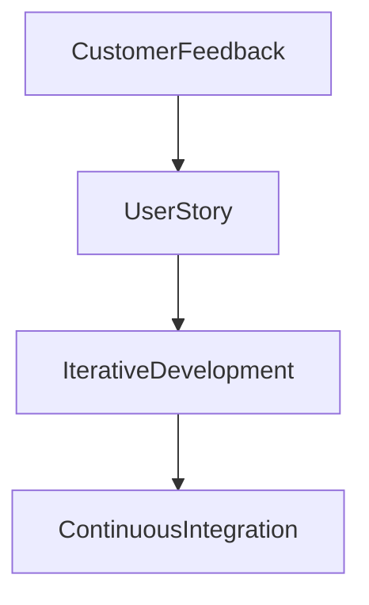

### 第3章：敏捷开发的流程与方法

**背景介绍**
敏捷开发的流程和方法旨在提高项目的灵活性、透明度和响应速度。

**核心概念与联系**
敏捷开发常用的流程包括Scrum、Kanban等，方法包括用户故事地图、迭代规划、每日站立会议等。

**概念属性特征对比表格**
| 流程/方法           | 描述                                                         | 优点                     | 缺点                   |
|---------------------|--------------------------------------------------------------|--------------------------|------------------------|
| Scrum               | 固定迭代周期，强调角色分工和透明度                            | 易于管理，高效协作       | 严格的迭代时间限制     |
| Kanban             | 流动式工作流程，专注于工作流优化                             | 灵活响应变化，持续改进   | 需要持续关注工作流     |
| User Story Mapping | 创建用户故事层级图，以更好地理解用户需求                       | 增强团队与用户的沟通    | 需要团队有较强的理解力 |

**ER实体关系图架构的Mermaid流程图**
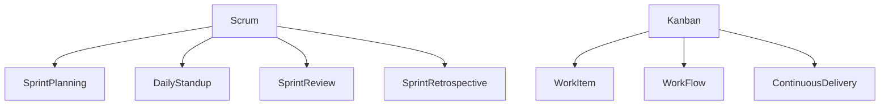

## 第二部分：Scrum框架的深入讲解

### 第4章：Scrum框架的基本概念

**背景介绍**
Scrum是一种基于迭代和增量开发的敏捷流程，以其灵活性和高效性被广泛采用。

**核心概念与联系**
Scrum的核心概念包括产品待办列表、Sprint、Scrum Master、产品负责人等。

**概念属性特征对比表格**
| 概念               | 描述                                                         | 关联角色                 |
|--------------------|--------------------------------------------------------------|--------------------------|
| Product Backlog     | 存放所有需求的列表，按优先级排序                             | 产品负责人               |
| Sprint             | 固定时间周期的迭代开发，通常是2-4周                          | 整个团队                 |
| Scrum Master       | 负责确保Scrum流程的有效执行，帮助团队解决问题                 | 整个团队                 |
| Product Owner      | 负责产品待办列表的管理，代表客户的利益                        | 整个团队                 |

**ER实体关系图架构的Mermaid流程图**
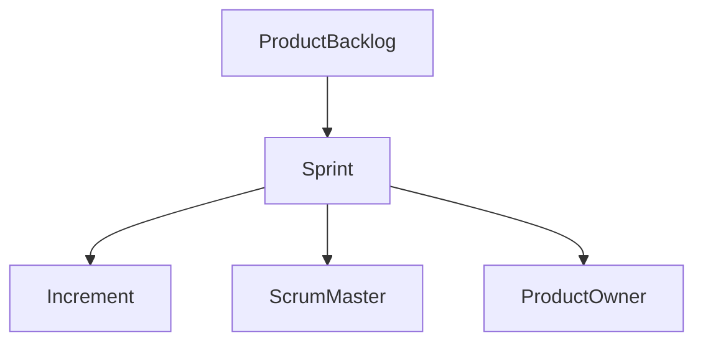

### 第5章：Scrum的实践步骤

**背景介绍**
Scrum的实践步骤是确保团队能够有效地工作并实现项目目标的关键。

**核心概念与联系**
Scrum的实践步骤包括Sprint计划会议、每日站立会议、Sprint评审会议和Sprint回顾会议。

**概念属性特征对比表格**
| 步骤               | 描述                                                         | 关键参与者               |
|--------------------|--------------------------------------------------------------|--------------------------|
| Sprint Planning     | 团队与产品负责人一起确定Sprint的目标和要完成的工作             | 整个团队、产品负责人     |
| Daily Standup       | 每日早晨进行，团队分享进度、问题和计划                       | 整个团队                 |
| Sprint Review       | Sprint结束时，团队展示已完成的工作，收集反馈并进行演示       | 整个团队、利益相关者     |
| Sprint Retrospective | Sprint结束时，团队讨论哪些做得好，哪些需要改进               | 整个团队、Scrum Master  |

**ER实体关系图架构的Mermaid流程图**
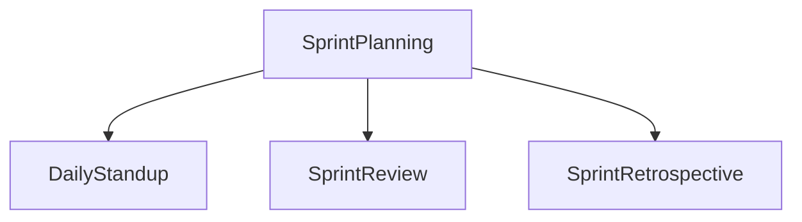

### 第6章：Scrum中的角色与责任

**背景介绍**
Scrum中的角色具有明确的职责和责任，以确保项目的成功。

**核心概念与联系**
Scrum中的角色包括产品负责人、Scrum Master和开发团队。

**概念属性特征对比表格**
| 角色               | 描述                                                         | 主要责任               |
|--------------------|--------------------------------------------------------------|------------------------|
| Product Owner      | 负责产品的愿景和优先级，管理产品待办列表                      | 确保产品最大化价值     |
| Scrum Master       | 确保Scrum流程的遵循，帮助团队解决问题和消除障碍              | 促进团队高效协作     |
| Development Team   | 负责实现Sprint中的工作项，自我管理，追求高质量的交付          | 完成任务，持续改进   |

**ER实体关系图架构的Mermaid流程图**
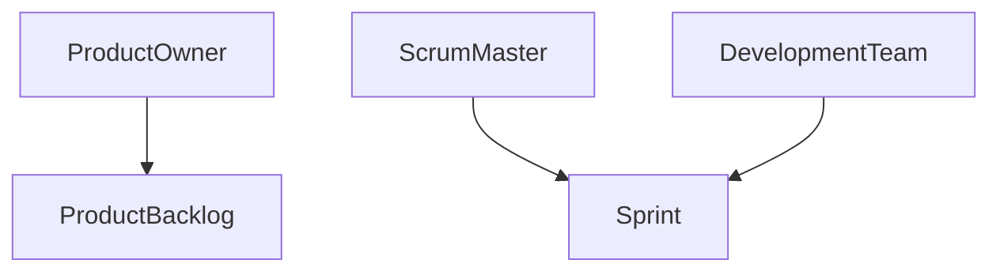

### 第7章：Scrum中的产品待办列表

**背景介绍**
产品待办列表是Scrum中用于规划和管理项目工作的关键工具。

**核心概念与联系**
产品待办列表包括用户故事、任务和验收标准。

**概念属性特征对比表格**
| 项目项           | 描述                                                         | 重要性               |
|------------------|--------------------------------------------------------------|----------------------|
| User Story       | 描述用户需求的故事，通常以用户的语言编写                       | 用户视角的关键输入   |
| Task             | 将用户故事分解为具体可执行的任务                             | 实现用户故事的步骤   |
| Acceptance Criteria | 定义用户故事完成的标准，确保团队和客户对交付结果有一致的理解 | 验收和质量保证的基础 |

**ER实体关系图架构的Mermaid流程图**
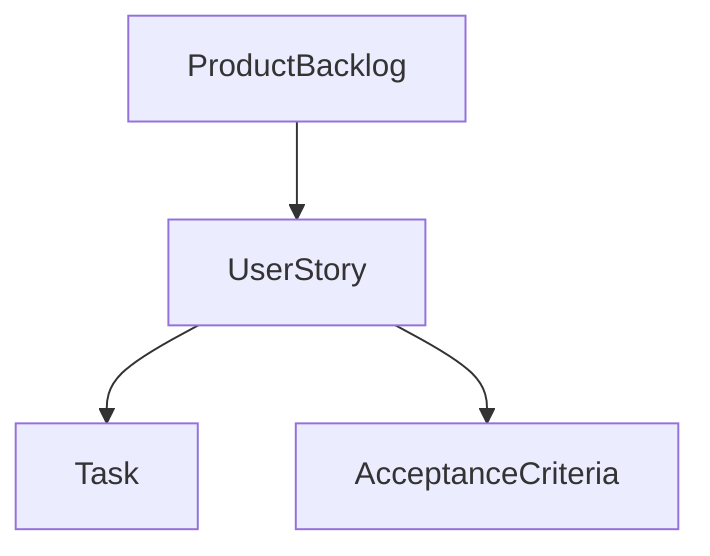

### 第8章：Scrum中的迭代与回顾

**背景介绍**
迭代是Scrum的核心组成部分，回顾则是持续改进的关键实践。

**核心概念与联系**
迭代是一个固定的时间段，团队在这个时间段内完成一系列工作。回顾是对迭代过程进行反思和改进的机会。

**概念属性特征对比表格**
| 步骤               | 描述                                                         | 重要性               |
|--------------------|--------------------------------------------------------------|----------------------|
| Iteration          | 固定时间段内的开发周期，通常为2-4周                           | 确保持续交付         |
| Retrospective      | 迭代结束时进行的会议，团队讨论哪些做得好，哪些需要改进         | 持续改进的基础      |

**ER实体关系图架构的Mermaid流程图**
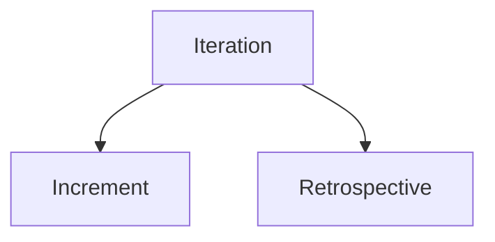

## 第三部分：敏捷开发与Scrum的最佳实践

### 第9章：敏捷开发与Scrum的成功案例

**背景介绍**
成功案例展示了敏捷开发与Scrum在不同组织中的应用效果。

**核心概念与联系**
成功案例包括Netflix、NASA等，它们通过敏捷实践实现了高效的团队协作和快速的产品迭代。

**概念属性特征对比表格**
| 组织               | 应用效果                                       | 敏捷实践               |
|--------------------|------------------------------------------------|------------------------|
| Netflix             | 快速迭代，灵活响应市场变化                       | Scrum，用户故事地图   |
| NASA               | 确保复杂项目的高质量和高可靠性                   | Kanban，持续集成      |

**ER实体关系图架构的Mermaid流程图**
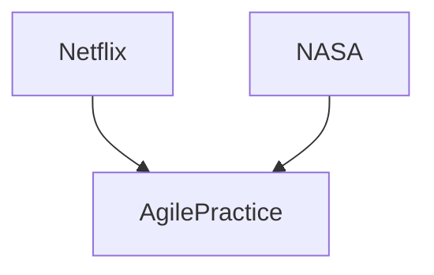

### 第10章：面对挑战的敏捷开发策略

**背景介绍**
敏捷开发在面对复杂性和不确定性时可能遇到挑战。

**核心概念与联系**
策略包括建立信任、提高沟通效率和灵活调整计划。

**概念属性特征对比表格**
| 策略               | 描述                                                         | 重要性               |
|--------------------|--------------------------------------------------------------|----------------------|
| Building Trust      | 促进团队成员间的信任，提高协作效率                           | 关键成功因素         |
| Effective Communication | 确保信息流畅传递，减少误解和错误                           | 项目成功的基石      |
| Flexible Planning    | 接受变化，灵活调整计划以应对不确定性和需求变化             | 保持项目的敏捷性    |

**ER实体关系图架构的Mermaid流程图**
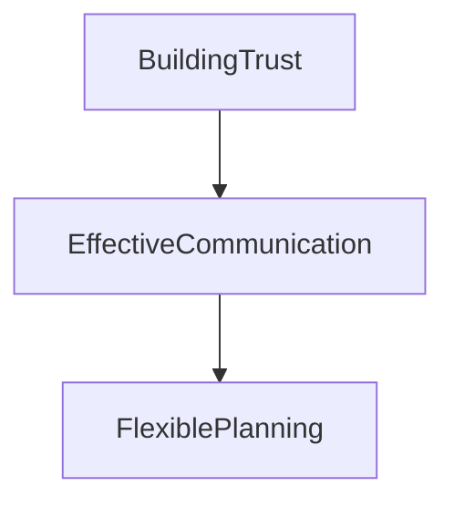

### 第11章：敏捷开发与Scrum的文化构建

**背景介绍**
敏捷开发与Scrum的成功不仅仅依赖于流程和工具，更依赖于团队文化的建设。

**核心概念与联系**
文化构建包括鼓励自我管理、自主学习和持续反思。

**概念属性特征对比表格**
| 文化要素           | 描述                                                         | 重要性               |
|--------------------|--------------------------------------------------------------|----------------------|
| Self-management     | 鼓励团队成员自我管理，提高责任感和主动性                       | 团队高效运作的关键   |
| Autonomous Learning | 鼓励团队成员自主学习新技能和知识，提升团队整体能力             | 持续发展的动力      |
| Continuous Reflection | 鼓励团队成员定期反思，从经验中学习，不断改进工作方式           | 团队成长的核心      |

**ER实体关系图架构的Mermaid流程图**
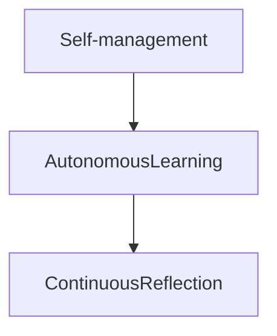

### 第12章：敏捷开发与Scrum的未来趋势

**背景介绍**
随着技术的发展，敏捷开发与Scrum也在不断演化。

**核心概念与联系**
未来趋势包括更灵活的敏捷实践、更广泛的应用场景和与人工智能的融合。

**概念属性特征对比表格**
| 未来趋势           | 描述                                                         | 可能的影响               |
|--------------------|--------------------------------------------------------------|--------------------------|
| Flexible Agile Practices | 更灵活的敏捷实践，适应不同类型的项目和团队需求                     | 提高敏捷实践的有效性     |
| Wider Application Scenarios | 敏捷开发与Scrum在更多行业和领域的应用，如医疗、金融等           | 推动敏捷方法的普及      |
| AI Integration | 敏捷开发与Scrum与人工智能的结合，利用AI优化流程、提高效率       | 引发敏捷开发的革命性变化 |

**ER实体关系图架构的Mermaid流程图**
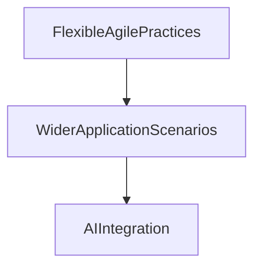

## 第四部分：敏捷开发与Scrum的实际应用

### 第13章：敏捷开发与Scrum在软件工程中的应用

**背景介绍**
敏捷开发与Scrum在软件工程中被广泛应用，以实现更高效的开发流程。

**核心概念与联系**
应用包括迭代开发、持续集成、用户故事地图等。

**概念属性特征对比表格**
| 应用               | 描述                                                         | 优势                     |
|--------------------|--------------------------------------------------------------|--------------------------|
| Iterative Development | 分阶段开发，逐步完善产品                                     | 快速响应需求变化         |
| Continuous Integration | 集成和测试代码的持续过程，确保代码质量                         | 防止整合问题             |
| User Story Mapping | 创建用户故事地图，以更好地理解用户需求                         | 增强团队与用户的沟通    |

**ER实体关系图架构的Mermaid流程图**
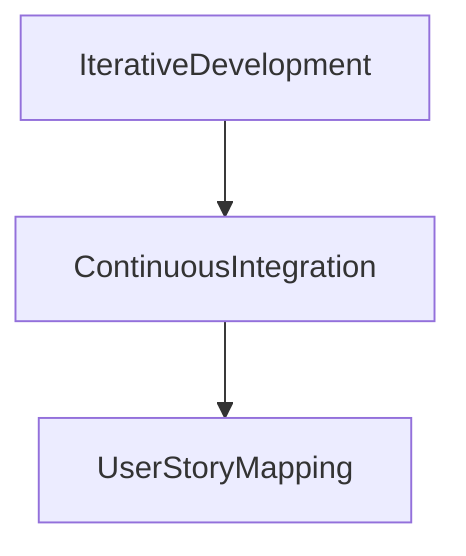

### 第14章：敏捷开发与Scrum在项目管理中的应用

**背景介绍**
敏捷开发与Scrum在项目管理中提供了更灵活和高效的管理方法。

**核心概念与联系**
应用包括Sprint规划、每日站立会议、迭代回顾等。

**概念属性特征对比表格**
| 应用               | 描述                                                         | 优势                     |
|--------------------|--------------------------------------------------------------|--------------------------|
| Sprint Planning     | 团队与产品负责人一起确定Sprint的目标和要完成的工作             | 提高项目规划的质量       |
| Daily Standup       | 每日早晨进行，团队分享进度、问题和计划                       | 促进团队协作和信息透明  |
| Sprint Review       | Sprint结束时，团队展示已完成的工作，收集反馈并进行演示       | 提高产品的质量和用户满意度 |
| Sprint Retrospective | Sprint结束时，团队讨论哪些做得好，哪些需要改进               | 持续改进项目过程       |

**ER实体关系图架构的Mermaid流程图**
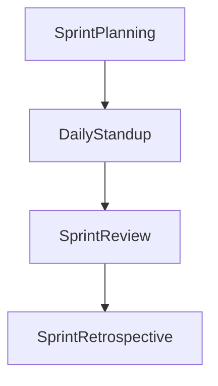

### 第15章：敏捷开发与Scrum在敏捷转型中的实践

**背景介绍**
许多组织在转型过程中采用敏捷开发与Scrum来提高效率和团队协作。

**核心概念与联系**
实践包括团队组建、流程重构、文化转变等。

**概念属性特征对比表格**
| 实践               | 描述                                                         | 关键步骤               |
|--------------------|--------------------------------------------------------------|------------------------|
| Team Formation     | 建立多职能团队，以促进跨职能协作                             | 明确角色和职责         |
| Process Refactoring | 重构现有流程，使其更符合敏捷原则                             | 分析现有流程，设计新流程 |
| Cultural Shift     | 改变组织文化，鼓励透明、协作和持续改进                       | 培训和教育             |

**ER实体关系图架构的Mermaid流程图**
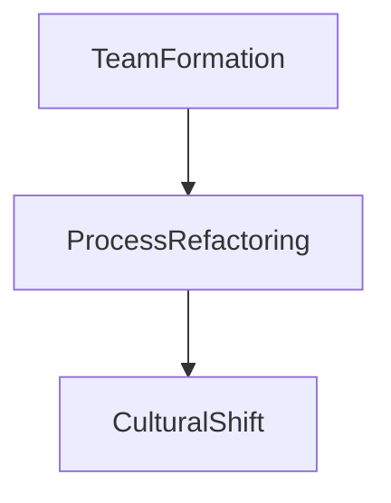

### 第16章：敏捷开发与Scrum的综合案例分析

**背景介绍**
通过综合案例分析，可以更好地理解敏捷开发与Scrum在实际项目中的应用。

**核心概念与联系**
案例包括成功和挑战，展示了敏捷实践的多样性和灵活性。

**概念属性特征对比表格**
| 案例类型           | 描述                                                         | 教训和收获               |
|--------------------|--------------------------------------------------------------|--------------------------|
| Success Case       | 敏捷实践成功的案例，展示了高效团队协作和快速迭代的优势         | 成功经验和最佳实践       |
| Challenge Case     | 面临挑战的案例，展示了敏捷实践在复杂环境下的适应能力和改进空间 | 风险管理和问题解决       |

**ER实体关系图架构的Mermaid流程图**
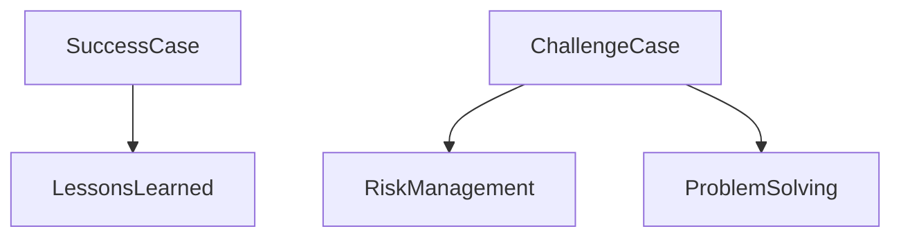

## 第五部分：敏捷开发与Scrum的拓展学习

### 第17章：敏捷开发与Scrum相关资源与工具

**背景介绍**
敏捷开发与Scrum有着丰富的资源与工具，可以帮助团队更好地实践。

**核心概念与联系**
资源包括书籍、在线课程、工具等。

**概念属性特征对比表格**
| 资源/工具         | 描述                                                         | 优点                     |
|-------------------|--------------------------------------------------------------|--------------------------|
| Books             | 敏捷开发与Scrum的相关书籍，提供深入的理论和实践指导           | 知识的深度和广度         |
| Online Courses    | 在线课程，涵盖从基础到高级的敏捷开发与Scrum知识             | 便捷性和灵活性           |
| Tools             | 敏捷工具，如Jira、Trello、Asana等，用于项目管理和团队协作     | 提高工作效率             |

**ER实体关系图架构的Mermaid流程图**
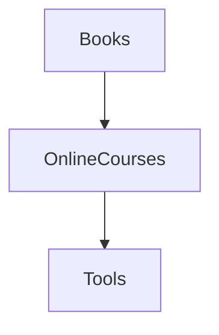

### 第18章：敏捷开发与Scrum的未来发展方向

**背景介绍**
敏捷开发与Scrum将继续发展，以适应不断变化的技术环境。

**核心概念与联系**
发展方向包括与人工智能的结合、持续集成和持续交付等。

**概念属性特征对比表格**
| 发展方向         | 描述                                                         | 可能的影响               |
|------------------|--------------------------------------------------------------|--------------------------|
| AI Integration   | 敏捷开发与Scrum与人工智能的结合，利用AI优化流程和决策         | 提高敏捷实践的智能化水平 |
| Continuous Integration | 持续集成和持续交付的深化和实践，提高软件交付的速度和质量 | 确保代码质量和交付效率   |
| DevOps Adoption | 敏捷开发与DevOps的融合，促进开发和运维的紧密协作           | 提高系统的整体效率      |

**ER实体关系图架构的Mermaid流程图**
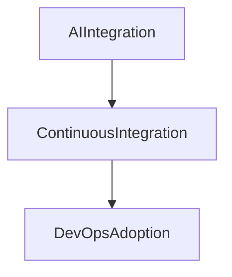

## 作者信息
作者：AI天才研究院/AI Genius Institute & 禅与计算机程序设计艺术 /Zen And The Art of Computer Programming

----------------------------------------------------------------
```

**注意：**以上内容是一个目录大纲，并不是完整的文章内容。每个章节和部分都需要进一步填充详细的背景介绍、核心概念、算法原理讲解、数学公式、系统设计与项目实战等内容。此外，每个章节的ER实体关系图架构的Mermaid流程图也需要根据实际内容进行设计。文章的撰写需要确保逻辑清晰、结构紧凑，同时要遵循markdown格式要求，并在末尾附上作者信息。文章的字数要求在10000～12000字左右。完成后的文章将是一篇专业、深入且具有实用价值的技术博客。

