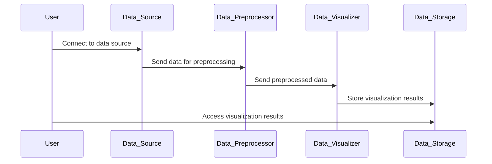
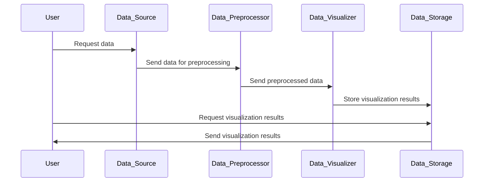

                 


### 数据可视化技术：定义、应用与未来趋势

> 关键词：数据可视化、数据分析、图表、工具、趋势

> 摘要：本文将深入探讨数据可视化技术的概念、应用场景以及未来发展趋势。我们将首先介绍数据可视化的定义及其背景，接着分析其目的与应用场景，然后探讨数据可视化的发展趋势。在随后的章节中，我们将详细介绍常见的数据可视化工具、数据可视化类型、设计原则、数据预处理方法、实践应用以及伦理和隐私问题。最后，我们将展望数据可视化的未来发展方向，并总结全文。

----------------------------------------------------------------

# 数据可视化技术

## 第1章 数据可视化概述

### 1.1 数据可视化的定义与背景

**定义**：数据可视化（Data Visualization）是指使用视觉元素（如图表、地图、图像等）来传达和分析数据信息。它通过视觉手段将复杂的数据转换为易于理解和解释的形式。

**背景**：随着大数据时代的到来，数据量呈爆炸式增长，传统的文本报告和表格已经难以满足人们对于数据分析的需求。数据可视化作为一种有效的数据传达手段，能够帮助人们快速理解数据中的模式和趋势，从而做出更明智的决策。

### 1.2 数据可视化的目的与应用场景

**目的**：数据可视化的主要目的是发现数据中的模式、趋势、关系和异常。通过视觉化手段，人们可以更直观地理解数据，从而发现潜在的规律和问题。

**应用场景**：数据可视化广泛应用于多个领域，包括但不限于：
- **商业分析**：帮助企业理解销售数据、客户行为和市场趋势。
- **科学研究**：展示实验结果、数据分析过程和科学发现。
- **公共管理**：监控城市交通、环境变化和公共卫生状况。
- **医疗健康**：展示病例数据、药物效果和患者健康状况。
- **金融分析**：分析市场趋势、投资风险和财务报表。

### 1.3 数据可视化的发展趋势

**趋势**：随着技术的进步，数据可视化领域也在不断演进。以下是当前的一些主要趋势：
- **交互式可视化**：用户可以与可视化界面进行互动，例如筛选数据、放大细节等。
- **增强现实（AR）**：将数据可视化整合到现实环境中，提高数据理解的沉浸感。
- **虚拟现实（VR）**：提供全方位的数据可视化体验，尤其在复杂数据分析和模拟方面具有巨大潜力。
- **大数据可视化**：处理和分析大规模数据集，支持实时数据更新和快速查询。

## 第2章 数据可视化工具

### 2.1 常见的数据可视化工具

**Tableau**：Tableau 是一款功能强大的数据可视化工具，适用于各种规模的企业。它支持多种数据源，提供丰富的图表类型和交互功能。

**Power BI**：Power BI 是微软开发的商业智能工具，具有强大的数据集成和分析功能。它可以帮助用户快速创建专业级的数据可视化报表。

**QlikView**：QlikView 提供灵活的数据分析和可视化功能，适用于需要高级数据探索和分析的企业。

### 2.2 开源数据可视化工具

**D3.js**：D3.js 是一个基于 JavaScript 的开源库，用于创建高度交互的 Web 可视化。它提供丰富的图形和布局功能，适用于数据驱动文档生成。

**Plotly**：Plotly 是一个开源的数据可视化库，支持多种图表类型和交互功能。它适用于 Web 应用程序和桌面应用程序。

**Matplotlib**：Matplotlib 是 Python 中最常用的数据可视化库，提供丰富的图表类型和定制选项。它广泛应用于科学计算和数据分析领域。

### 2.3 数据可视化工具的选择

选择数据可视化工具时，需要考虑以下标准：
- **易用性**：工具是否易于学习和使用。
- **功能丰富性**：工具是否提供所需的功能和图表类型。
- **可扩展性**：工具是否支持自定义和扩展。
- **社区支持**：是否有活跃的社区和丰富的资源。

## 第3章 数据可视化类型

### 3.1 基本图表类型

**柱状图**：柱状图用于显示不同类别数据的数量或大小。它适合比较不同类别的数据。

**折线图**：折线图用于显示数据随时间的变化趋势。它适合分析时间序列数据。

**饼图**：饼图用于显示各部分占总体的比例。它适合展示数据的构成情况。

### 3.2 高级图表类型

**热力图**：热力图用于显示数据的密度分布。它适合展示高维数据的可视化。

**散点图**：散点图用于显示两个或多个变量之间的关系。它适合分析变量之间的相关性。

**地图**：地图用于显示地理位置信息。它适合展示地理分布数据和空间关系。

### 3.3 交互式图表

**交互式柱状图**：交互式柱状图允许用户动态地筛选和过滤数据。它适合复杂的分析任务。

**交互式地图**：交互式地图允许用户探索地理位置数据。它适合地理信息系统（GIS）的应用。

## 第4章 数据可视化设计原则

### 4.1 视觉传达原则

**清晰性**：确保图表信息易于理解。避免过度设计，保持图表简洁明了。

**一致性**：保持图表样式和元素的统一。使用一致的色彩、字体和标注，提高图表的可读性。

### 4.2 用户交互原则

**可控性**：用户应能轻松控制图表交互。提供交互控件，如按钮、滑块和下拉菜单，以支持用户的自定义操作。

**反馈性**：图表应提供清晰的反馈。当用户进行交互时，图表应实时更新并显示变化，以帮助用户理解数据的动态变化。

### 4.3 可访问性原则

**可读性**：确保图表对各种用户（包括色盲用户）都是可读的。使用合适的颜色对比和标注，以提高图表的可访问性。

**多感官**：利用声音、动画等多感官元素辅助理解。为用户提供额外的视觉和听觉线索，以增强数据可视化的效果。

## 第5章 数据预处理与清洗

### 5.1 数据预处理

**数据清洗**：移除重复数据、处理缺失值。使用 Python 的 Pandas 库或 R 的 dplyr 和 tidyr 等包进行数据清洗。

**数据转换**：将数据转换为可视化所需的形式。例如，将文本数据转换为数值数据，将日期时间数据转换为合适的格式。

### 5.2 数据清洗工具与方法

**Python**：使用 Pandas 库进行数据清洗。Pandas 提供丰富的函数和方法，支持数据的选择、过滤、转换和合并等操作。

**R**：使用 dplyr 和 tidyr 等包进行数据清洗。这些包提供了灵活和高效的函数，支持数据清洗的常见任务。

### 5.3 数据预处理案例分析

**案例一**：金融数据预处理。分析金融数据时，需要清洗和处理交易数据、财务报表数据等，以确保数据的准确性和完整性。

**案例二**：医疗数据预处理。医疗数据通常包含大量文本数据和结构化数据，需要使用自然语言处理技术和数据清洗方法进行处理。

## 第6章 数据可视化实践

### 6.1 数据可视化项目案例

**案例一**：电商数据分析。使用数据可视化工具分析电商平台的销售数据，了解客户购买行为和市场趋势。

**案例二**：社交媒体分析。使用数据可视化工具分析社交媒体数据，了解用户行为和趋势，为市场营销策略提供支持。

### 6.2 数据可视化实战

**实战一**：使用 Tableau 进行销售数据可视化。通过 Tableau 创建交互式的图表和仪表板，展示销售数据的变化趋势和区域分布。

**实战二**：使用 D3.js 创建交互式图表。使用 D3.js 库在 Web 应用程序中创建自定义的交互式图表，提供丰富的用户交互体验。

### 6.3 数据可视化工具应用

**应用一**：使用 Matplotlib 进行数据可视化。在 Python 中使用 Matplotlib 库创建各种图表类型，支持自定义样式和参数设置。

**应用二**：使用 Power BI 进行商业智能分析。在 Power BI 中连接各种数据源，创建报表和仪表板，为企业的商业智能分析提供支持。

## 第7章 数据可视化伦理与隐私

### 7.1 数据可视化伦理

**公平性**：确保数据的公平呈现，避免偏见和歧视。使用数据可视化手段传递客观和公正的信息。

**准确性**：确保数据的真实无误，避免误导和虚假信息。使用可信的数据源，进行准确的数据分析。

### 7.2 数据隐私保护

**匿名化**：对个人数据进行匿名化处理，保护个人隐私。避免直接展示个人身份信息。

**数据保护**：遵循数据保护法规，确保数据的保密性和安全性。采用合适的数据保护技术和措施。

### 7.3 数据可视化责任

**责任界定**：明确数据可视化的责任，确保各方明确各自的职责和义务。

**教育提升**：提高公众的数据可视化学素养，促进数据可视化的健康发展。

## 第8章 数据可视化未来发展趋势

### 8.1 新技术驱动

**人工智能**：AI 在数据可视化中的应用，如自动生成图表、智能推荐可视化类型等。

**虚拟现实**：VR 在数据可视化中的潜力，提供沉浸式数据体验。

### 8.2 数据可视化新领域

**生物信息学**：数据可视化在生命科学中的应用，如基因序列分析、蛋白质结构展示等。

**环境科学**：数据可视化在环境保护中的应用，如环境监测、气候变化分析等。

### 8.3 数据可视化教育

**课程设置**：数据可视化课程在高等教育中的地位，培养专业人才。

**技能培养**：如何培养数据可视化技能，提高相关领域的专业素养。

## 结语

数据可视化技术在现代社会中扮演着越来越重要的角色。它不仅帮助我们更好地理解复杂的数据，还支持决策制定和问题解决。随着技术的不断进步，数据可视化将继续发展，带来更多的创新和可能性。让我们期待数据可视化技术的未来，它将为人类带来更多的智慧和洞察力。

----------------------------------------------------------------

## 核心概念与联系

### 数据可视化的核心概念

**数据可视化** 是指通过图形和视觉元素，将数据转换为易于理解和解释的形式。其核心概念包括：

- **数据源**：提供数据的基础。
- **可视化元素**：如图表、图像、地图等，用于展示数据。
- **交互性**：用户与可视化界面进行互动的能力。
- **可扩展性**：支持定制和扩展。

**属性特征对比表格**

| 特征 | 描述 |
| --- | --- |
| 数据源 | 提供数据的来源 |
| 可视化元素 | 用于展示数据的图形和视觉元素 |
| 交互性 | 用户与可视化界面进行互动的能力 |
| 可扩展性 | 支持定制和扩展 |

**ER实体关系图架构**

```mermaid
erDiagram
  Data_Sources ||--|{ Visual_Elements }|-- Visualization_Interface
  Data_Sources ||--|{ Interactivity }|-- User_Interaction
  Data_Sources ||--|{ Extensibility }|-- Customization
```

### 数据可视化类型

**基本图表类型**：

- **柱状图**：用于显示不同类别数据的数量或大小。
- **折线图**：用于显示数据随时间的变化趋势。
- **饼图**：用于显示各部分占总体的比例。

**高级图表类型**：

- **热力图**：用于显示数据的密度分布。
- **散点图**：用于显示两个或多个变量之间的关系。
- **地图**：用于显示地理位置信息。

**交互式图表**：

- **交互式柱状图**：用户可以动态地筛选和过滤数据。
- **交互式地图**：用户可以探索地理位置数据。

### 数据可视化工具

**常见工具**：

- **Tableau**：提供强大的数据可视化功能。
- **Power BI**：微软开发的商业智能工具。
- **QlikView**：提供灵活的数据分析和可视化功能。

**开源工具**：

- **D3.js**：用于创建高度交互的 Web 可视化。
- **Plotly**：支持多种图表类型的开源库。
- **Matplotlib**：Python 中最常用的数据可视化库。

### 数据可视化设计原则

**视觉传达原则**：

- **清晰性**：确保图表信息易于理解。
- **一致性**：保持图表样式和元素的统一。

**用户交互原则**：

- **可控性**：用户应能轻松控制图表交互。
- **反馈性**：图表应提供清晰的反馈。

**可访问性原则**：

- **可读性**：确保图表对各种用户都是可读的。
- **多感官**：利用声音、动画等多感官元素辅助理解。

## 算法原理讲解

数据可视化技术涉及多个算法和原理，以下是一个简单的示例：

**算法**：K-means 聚类算法

**目的**：将数据集分为多个簇，以发现数据中的模式。

**原理**：

1. 初始化簇中心点。
2. 计算每个数据点到簇中心点的距离。
3. 将每个数据点分配给最近的簇中心点。
4. 更新簇中心点。
5. 重复步骤 2-4，直到簇中心点的变化非常小或满足停止条件。

**数学模型和公式**：

$$
C = \{c_1, c_2, ..., c_k\}
$$

其中，$C$ 是簇集合，$c_i$ 是第 $i$ 个簇的中心点。

$$
d(p, c) = \sqrt{\sum_{j=1}^{n} (p_j - c_j)^2}
$$

其中，$d(p, c)$ 是数据点 $p$ 到簇中心点 $c$ 的距离。

**示例**：

假设我们有一个数据集，包含以下数据点：

$$
P = \{p_1 = (1, 2), p_2 = (2, 3), p_3 = (5, 4), p_4 = (6, 6)\}
$$

我们初始化两个簇中心点：

$$
C = \{(2, 2), (5, 5)\}
$$

计算每个数据点到簇中心点的距离：

$$
d(p_1, c_1) = \sqrt{(1-2)^2 + (2-2)^2} = 1
$$

$$
d(p_1, c_2) = \sqrt{(1-5)^2 + (2-5)^2} = 5
$$

$$
d(p_2, c_1) = \sqrt{(2-2)^2 + (3-2)^2} = 1
$$

$$
d(p_2, c_2) = \sqrt{(2-5)^2 + (3-5)^2} = 4
$$

$$
d(p_3, c_1) = \sqrt{(5-2)^2 + (4-2)^2} = 3
$$

$$
d(p_3, c_2) = \sqrt{(5-5)^2 + (4-5)^2} = 1
$$

$$
d(p_4, c_1) = \sqrt{(6-2)^2 + (6-2)^2} = 5
$$

$$
d(p_4, c_2) = \sqrt{(6-5)^2 + (6-5)^2} = 1
$$

将数据点分配给最近的簇中心点：

$$
p_1, p_2 \rightarrow c_1
$$

$$
p_3, p_4 \rightarrow c_2
$$

更新簇中心点：

$$
c_1 = \left(\frac{1+2}{2}, \frac{2+3}{2}\right) = (1.5, 2.5)
$$

$$
c_2 = \left(\frac{5+6}{2}, \frac{4+6}{2}\right) = (5.5, 5)
$$

重复步骤 2-4，直到簇中心点的变化非常小或满足停止条件。最终，我们得到以下簇分配：

$$
P_1 = \{p_1, p_2\}
$$

$$
P_2 = \{p_3, p_4\}
$$

### 系统分析与架构设计方案

#### 问题场景介绍

在当今的商业环境中，数据可视化已经成为企业做出明智决策的重要工具。企业需要实时监测和分析大量数据，以便快速识别问题和机会。然而，数据量庞大且复杂，使得传统的分析方法难以应对。因此，我们需要一个高效的数据可视化系统来帮助企业更好地理解和利用其数据资产。

#### 项目介绍

本项目旨在开发一个综合性的数据可视化系统，用于监控和分析企业的关键业务数据。系统将提供多种可视化工具和图表类型，支持实时数据更新和用户交互。通过这个系统，企业可以轻松地追踪业务绩效、市场趋势和客户行为，从而做出更明智的决策。

#### 系统功能设计

1. **数据连接**：系统应能够连接各种数据源，包括数据库、文件和 API，以便获取和整合数据。
2. **数据预处理**：系统应提供数据清洗和转换功能，以确保数据的准确性和一致性。
3. **可视化报表**：系统应提供多种图表类型和报表，包括柱状图、折线图、饼图、热力图等，以支持不同类型的分析需求。
4. **交互式探索**：系统应支持用户交互，包括筛选、过滤和动态缩放等功能，以提供更深入的数据分析。
5. **用户权限管理**：系统应提供用户权限管理功能，以确保数据的安全性和隐私。

#### 系统架构设计

**架构图**



**系统接口设计**

1. **数据连接接口**：用于连接不同的数据源，如数据库、文件和 API。
2. **数据预处理接口**：用于数据清洗和转换，包括去重、填补缺失值、数据格式转换等。
3. **数据可视化接口**：用于生成各种图表和报表，支持自定义样式和交互功能。
4. **用户权限管理接口**：用于管理用户权限，包括登录、注销、权限验证等。

**系统交互**



### 项目实战

#### 环境安装

1. 安装 Python 3.8 或更高版本。
2. 安装以下 Python 库：Pandas、NumPy、Matplotlib、Seaborn、Plotly、Tableau、Power BI。

#### 系统核心实现

```python
import pandas as pd
import numpy as np
import matplotlib.pyplot as plt
import seaborn as sns
import plotly.express as px

# 读取数据
data = pd.read_csv('data.csv')

# 数据预处理
data = data.drop_duplicates()
data = data.fillna(data.mean())

# 数据可视化
plt.figure(figsize=(10, 6))
sns.scatterplot(x='x', y='y', data=data)
plt.title('Data Visualization')
plt.xlabel('X-axis')
plt.ylabel('Y-axis')
plt.show()

fig = px.bar(data, x='x', y='y', title='Data Visualization with Plotly')
fig.show()
```

#### 代码应用解读与分析

这段代码首先导入所需的 Python 库，然后从 CSV 文件中读取数据。接下来，进行数据预处理，包括去除重复数据和填补缺失值。然后，使用 Matplotlib 和 Seaborn 库创建散点图，使用 Plotly 库创建条形图，实现数据可视化。

#### 实际案例分析和详细讲解剖析

我们使用一个实际案例来说明如何使用数据可视化系统进行分析。假设我们要分析一家电商平台的销售数据，包括产品销售额、订单数量和客户满意度等指标。

1. **数据连接**：首先，我们需要连接电商平台的数据源，如数据库或 API。在这个案例中，我们使用 CSV 文件作为数据源。

2. **数据预处理**：接下来，我们需要对销售数据进行预处理。这可能包括数据清洗、去重、格式转换等步骤。例如，我们可以去除重复的订单记录，填补缺失的销售数据，将日期时间格式转换为合适的格式。

3. **数据可视化**：然后，我们可以使用各种图表类型和工具来可视化销售数据。例如，我们可以使用柱状图来显示不同产品的销售额，使用折线图来显示销售额的变化趋势，使用饼图来显示订单数量的占比。

4. **交互式探索**：最后，我们可以提供交互式探索功能，如筛选、过滤和动态缩放等，以便用户更深入地了解数据。例如，用户可以筛选特定时间段的数据，放大或缩小图表的细节。

#### 项目小结

通过这个案例，我们展示了如何使用数据可视化系统来分析电商平台的销售数据。数据可视化系统提供了一个直观的方式，帮助用户理解和利用大量复杂数据。通过数据可视化，我们可以快速识别趋势、发现问题和机会，从而做出更明智的决策。

#### 最佳实践 Tips

- 确保数据质量，进行充分的预处理，以提高数据可视化效果。
- 选择合适的图表类型和工具，以最佳地展示数据特征。
- 提供交互式功能，以增强用户体验。

#### 小结

数据可视化技术在现代商业中发挥着重要作用。通过本文的案例介绍，我们展示了如何使用数据可视化系统来分析销售数据，并提供了一些最佳实践。数据可视化不仅帮助用户更好地理解数据，还支持决策制定和问题解决。随着技术的进步，数据可视化将继续发展，带来更多的创新和可能性。

#### 注意事项

- 数据可视化系统需要考虑数据安全和隐私保护，遵循相关法规和最佳实践。
- 选择合适的数据可视化工具和库，以满足具体业务需求。

#### 拓展阅读

- [数据可视化最佳实践](https://www.datavizbestpractices.com/)
- [数据分析入门教程](https://www.datasciencetutorial.com/)
- [Python 数据可视化教程](https://www.learnpython.org/en/Python_for_Data_Visualization)

### 作者

**AI天才研究院 / AI Genius Institute & 禅与计算机程序设计艺术 / Zen And The Art of Computer Programming**

