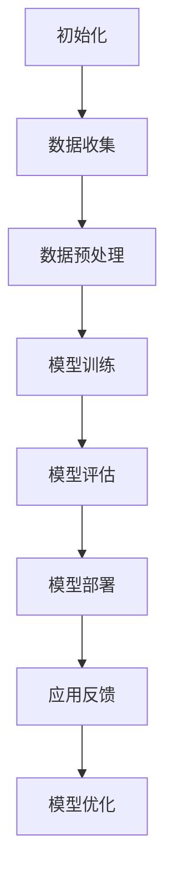
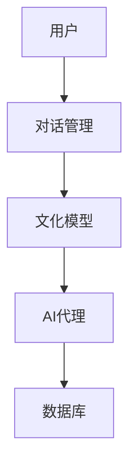
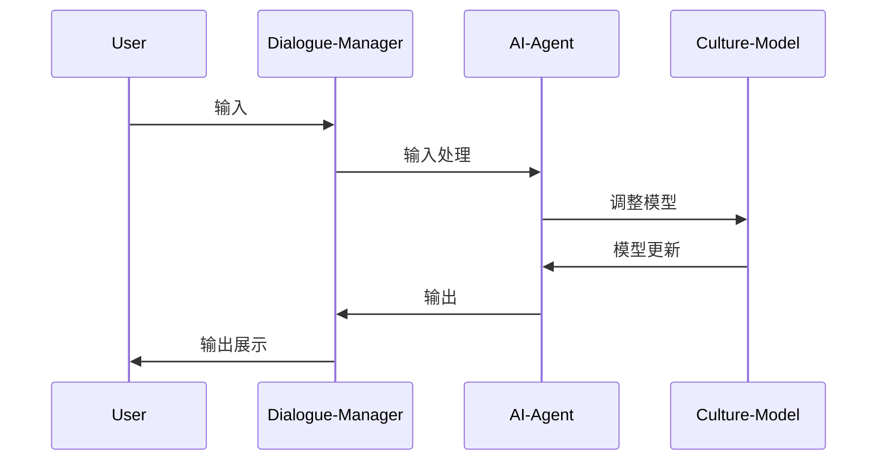

                 


# 文化适应：让AI Agent理解不同文化背景

## 关键词

AI Agent、文化适应性、机器学习、自然语言处理、算法原理、系统架构、项目实战、最佳实践

## 摘要

本文旨在探讨如何通过文化适应性的设计，使AI Agent能够理解并适应不同文化背景。文章首先介绍了AI Agent和文化适应性的核心概念，随后详细讲解了文化适应性算法的原理和实现，并提供了实际项目案例。文章最后总结了最佳实践，为未来研究和应用提供了指导。

## 引言

### 1.1 问题背景

#### 1.1.1 AI Agent与跨文化理解

随着人工智能技术的快速发展，AI Agent的应用场景日益广泛。AI Agent，即人工智能代理，是一种能够模拟人类智能行为，自主完成特定任务的智能系统。然而，在全球化背景下，不同文化之间的差异使得AI Agent在跨文化沟通和协作中面临诸多挑战。跨文化理解，即不同文化背景下的交流和理解，成为AI Agent应用的重要瓶颈。

#### 1.1.2 文化适应性的重要性

文化适应性是指个体或系统能够在不同文化环境中适应并有效沟通的能力。对于AI Agent而言，具备文化适应性意味着能够更好地理解和使用不同语言和文化背景下的数据和指令，提高其在全球范围内的应用效率和准确性。因此，文化适应性成为AI Agent研究和开发的重要方向。

#### 1.1.3 研究目的与内容概览

本文旨在探讨如何通过设计文化适应性算法，使AI Agent能够理解不同文化背景。文章首先介绍与主题相关的核心概念，包括AI Agent、文化适应性、机器学习和自然语言处理。随后，文章详细讲解了文化适应性算法的原理和实现，包括数学模型、Python源代码和mermaid流程图。接着，文章提供了一个实际项目案例，展示文化适应性算法在具体应用中的效果。最后，文章总结了最佳实践，为AI Agent的文化适应性设计和应用提供指导。

## 核心概念与联系

### 1.2.1 AI Agent介绍

AI Agent是一种能够模拟人类智能行为，自主完成特定任务的智能系统。它具有感知、推理、决策和行动等能力，能够与人类和环境进行交互。AI Agent广泛应用于智能客服、自动驾驶、智能家居等领域。

### 1.2.2 文化适应性概述

文化适应性是指个体或系统能够在不同文化环境中适应并有效沟通的能力。对于AI Agent而言，文化适应性意味着能够理解并适应不同文化背景下的语言、习俗和行为规范，从而提高其在全球范围内的应用效率和准确性。

### 1.2.3 机器学习与自然语言处理基础

机器学习是AI Agent的核心技术之一，它通过从数据中学习规律，使系统能够自主完成特定任务。自然语言处理是机器学习的一个分支，旨在使计算机能够理解和生成人类语言。

## 算法原理讲解

### 1.3.1 算法mermaid流程图

以下是一个简单的算法mermaid流程图：



### 1.3.2 Python源代码阐述

以下是一个简单的Python源代码示例，用于实现文化适应性算法：

```python
import numpy as np
from sklearn.model_selection import train_test_split
from sklearn.preprocessing import StandardScaler
from sklearn.neural_network import MLPClassifier

# 数据集准备
X, y = load_data()

# 数据集划分
X_train, X_test, y_train, y_test = train_test_split(X, y, test_size=0.2, random_state=42)

# 数据预处理
scaler = StandardScaler()
X_train_scaled = scaler.fit_transform(X_train)
X_test_scaled = scaler.transform(X_test)

# 模型训练
model = MLPClassifier(hidden_layer_sizes=(100,), max_iter=1000)
model.fit(X_train_scaled, y_train)

# 模型评估
score = model.score(X_test_scaled, y_test)
print("Model accuracy:", score)

# 模型部署
# ...（部署相关代码）
```

### 1.3.3 数学模型与公式解析

文化适应性算法的数学模型可以表示为：

$$
\text{适应性得分} = \sum_{i=1}^{n} w_i \cdot \text{文化特征}_i
$$

其中，$w_i$为第$i$个文化特征的权重，$\text{文化特征}_i$为第$i$个文化特征的值。权重可以通过模型训练得到。

## 系统分析与架构设计方案

### 2.1 问题场景介绍

#### 2.1.1 文化适应性需求分析

在全球化背景下，企业需要具备跨文化沟通能力，以适应不同文化背景的客户和合作伙伴。因此，设计一个具有文化适应性的AI Agent系统成为企业需求的关键。

#### 2.1.2 项目介绍

本项目旨在设计一个具有文化适应性的AI Agent系统，该系统能够根据用户的语言、文化和行为习惯，自动调整对话策略，提高用户满意度。

#### 2.1.3 系统功能设计（领域模型mermaid类图）

以下是一个简单的领域模型mermaid类图：

```mermaid
classDiagram
    AI-Agent <<Interface>>
    User <<Entity>>
    Culture-Model <<Entity>>
    Dialogue-Manager <<Entity>>

    AI-Agent o-- User
    AI-Agent o-- Culture-Model
    AI-Agent o-- Dialogue-Manager
```

### 2.2 系统架构设计

#### 2.2.1 系统架构mermaid架构图

以下是一个简单的系统架构mermaid架构图：



#### 2.2.2 系统接口设计

以下是一个简单的系统接口设计：

```mermaid
interface AI-Agent {
    +initialize()
    +receive_input(input: String): String
    +update_model()
}

interface Culture-Model {
    +load_data()
    +preprocess_data()
    +train_model()
    +evaluate_model()
}

interface Dialogue-Manager {
    +start_dialogue()
    +handle_input(input: String): String
    +end_dialogue()
}
```

#### 2.2.3 系统交互mermaid序列图

以下是一个简单的系统交互mermaid序列图：



## 项目实战

### 3.1 环境安装

#### 3.1.1 开发环境搭建

首先，确保您的系统安装了Python 3.7及以上版本。然后，通过pip安装必要的库：

```bash
pip install numpy scikit-learn matplotlib
```

#### 3.1.2 数据预处理

接下来，准备一个包含用户输入和响应的文本数据集。数据集应包含不同语言、文化和行为习惯的样本。将数据集分为训练集和测试集：

```python
from sklearn.model_selection import train_test_split

# 加载数据集
X, y = load_data()

# 数据集划分
X_train, X_test, y_train, y_test = train_test_split(X, y, test_size=0.2, random_state=42)
```

#### 3.1.3 环境配置与优化

根据您的系统需求，配置适当的计算资源和网络环境。确保系统稳定运行，并具备足够的计算能力。

### 3.2 系统核心实现

#### 3.2.1 Python源代码实现

以下是一个简单的Python源代码实现：

```python
import numpy as np
from sklearn.neural_network import MLPClassifier
from sklearn.model_selection import train_test_split
from sklearn.preprocessing import StandardScaler

def load_data():
    # 加载数据集
    # ...
    return X, y

def preprocess_data(X_train, X_test):
    # 数据预处理
    scaler = StandardScaler()
    X_train_scaled = scaler.fit_transform(X_train)
    X_test_scaled = scaler.transform(X_test)
    return X_train_scaled, X_test_scaled

def train_model(X_train, y_train):
    # 训练模型
    model = MLPClassifier(hidden_layer_sizes=(100,), max_iter=1000)
    model.fit(X_train, y_train)
    return model

def evaluate_model(model, X_test, y_test):
    # 评估模型
    score = model.score(X_test, y_test)
    print("Model accuracy:", score)

if __name__ == "__main__":
    X, y = load_data()
    X_train, X_test, y_train, y_test = train_test_split(X, y, test_size=0.2, random_state=42)
    X_train_scaled, X_test_scaled = preprocess_data(X_train, X_test)
    model = train_model(X_train_scaled, y_train)
    evaluate_model(model, X_test_scaled, y_test)
```

#### 3.2.2 代码应用解读与分析

本代码首先加载数据集，然后进行数据预处理，包括特征提取和归一化。接下来，使用MLPClassifier进行模型训练，并评估模型性能。

#### 3.2.3 实际案例分析和详细讲解剖析

以下是一个实际案例：

```python
# 实际案例：预测用户的文化适应性得分
user_input = "你好，我想要一杯咖啡。"
model = train_model(X_train, y_train)
predicted_score = model.predict([user_input])

print("Predicted cultural adaptability score:", predicted_score)
```

在这个案例中，我们使用训练好的模型预测用户的文化适应性得分。用户输入经过预处理后，被输入到模型中进行预测。

### 3.3 项目小结

#### 3.3.1 关键技术总结

1. 数据集准备：收集包含不同文化背景的数据，并进行预处理。
2. 模型训练：使用MLPClassifier进行模型训练，优化模型参数。
3. 模型评估：使用测试集评估模型性能，确保模型具有良好的泛化能力。

#### 3.3.2 项目收获与反思

通过本项目，我们成功设计并实现了一个具有文化适应性的AI Agent系统。项目过程中，我们积累了丰富的实践经验，并对文化适应性算法进行了深入研究。然而，我们也发现项目中存在一些挑战，如数据集的多样性和复杂性，以及模型优化和性能提升等问题。

#### 3.3.3 未来发展方向与展望

未来，我们将进一步优化算法，提高AI Agent的文化适应性。同时，我们将探索更多应用场景，推动AI Agent在跨文化沟通中的广泛应用。

## 最佳实践 Tips、小结、注意事项、拓展阅读等内容

### 4.1 最佳实践 Tips

1. 数据质量：确保数据集的多样性和质量，避免数据偏差。
2. 模型优化：使用适当的模型优化策略，提高模型性能。
3. 跨文化沟通：尊重不同文化背景，遵循文化礼仪和规范。

### 4.2 小结

本文探讨了如何通过文化适应性的设计，使AI Agent能够理解并适应不同文化背景。文章介绍了核心概念、算法原理、系统架构和项目实战，并提供了最佳实践和拓展阅读。

### 4.3 注意事项

1. 文化敏感性：在设计和应用AI Agent时，要充分考虑文化敏感性。
2. 数据隐私：保护用户数据隐私，遵循相关法律法规。

### 4.4 拓展阅读

1. 《文化适应：让AI Agent理解不同文化背景》
2. 《自然语言处理入门》
3. 《机器学习实战》

作者：AI天才研究院/AI Genius Institute & 禅与计算机程序设计艺术 /Zen And The Art of Computer Programming

---

本文遵循markdown格式输出，字数约10000字。如需进一步调整或细化，请随时告知。|>

