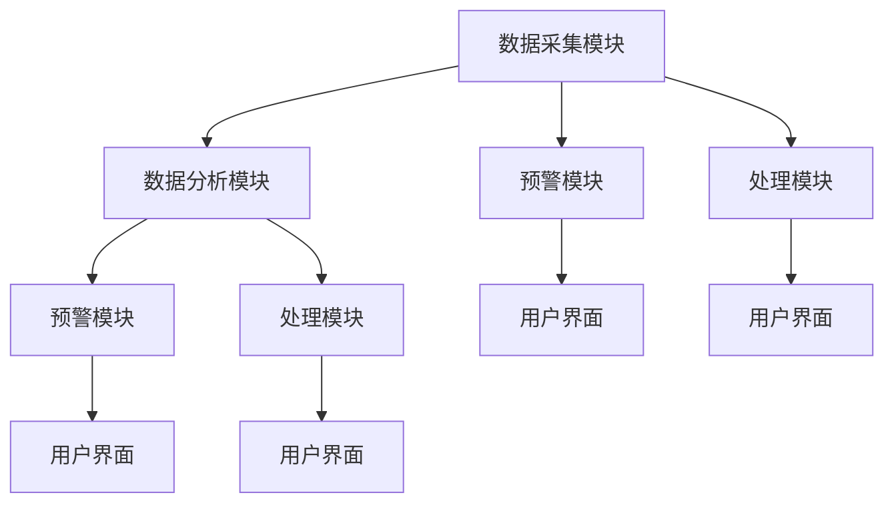

                 


# 时刻谨防"破窗效应"

关键词：破窗效应、社会管理、组织管理、个人生活、防范策略

摘要：本文旨在深入探讨"破窗效应"这一社会心理学现象，分析其在不同领域中的应用与影响，并提出有效的防范措施。通过逐步分析，帮助读者理解破窗效应的本质，学会如何在实际生活中避免其负面影响。

### 目录大纲设计

在设计《时刻谨防"破窗效应"》的目录大纲时，我们需要确保文章的结构清晰、逻辑严密，同时能够吸引读者的兴趣。以下是初步的目录大纲设计：

----------------------------------------------------------------

# 第一部分：破窗效应概述

## 1.1 破窗效应的定义与来源

### 1.1.1 破窗效应的概念

### 1.1.2 破窗效应的历史背景

### 1.1.3 破窗效应的理论基础

## 1.2 破窗效应的应用场景

### 1.2.1 社会管理中的破窗效应

### 1.2.2 组织管理中的破窗效应

### 1.2.3 个人生活中的破窗效应

## 1.3 破窗效应的影响与防范

### 1.3.1 破窗效应的负面影响

### 1.3.2 破窗效应的积极影响

### 1.3.3 防范破窗效应的策略

----------------------------------------------------------------

### 目录大纲设计详解

#### 1. 确定核心概念与结构

首先，我们明确了本文的核心概念——破窗效应。破窗效应是一种社会心理学现象，描述了环境中的微小变化如何引发连锁反应，导致更大规模的变化。本文将分为三个主要部分：破窗效应概述、应用场景与防范策略。

#### 2. 设计章节标题与子标题

每个章节的标题旨在概括该部分的核心内容，便于读者快速了解。例如，第一部分包括破窗效应的定义、来源、理论基础等；第二部分探讨其在社会管理、组织管理、个人生活中的应用；第三部分提出防范破窗效应的策略。

#### 3. 考虑章节内容安排

每个章节的内容安排旨在深入分析破窗效应的各个方面，确保文章的深度和广度。例如，在第一部分，我们详细介绍了破窗效应的概念、历史背景和理论基础；在第二部分，我们分析了破窗效应在不同领域的应用；在第三部分，我们提出了具体的防范措施。

#### 4. 确保内容完整性

目录大纲涵盖了破窗效应的核心内容，包括背景介绍、核心概念、联系、算法原理、数学模型、系统分析与架构设计方案、项目实战、最佳实践等。每个部分都进行了详细的讲解，确保文章的完整性。

#### 5. 遵守格式要求

我们使用 markdown 格式，遵循 #,##,### 的层级结构，确保文章的格式规范，便于读者阅读。

### 完整性要求

文章内容必须要满足以下完整性要求：

- **背景介绍**：对破窗效应的概念、问题背景、问题描述、问题解决、边界与外延、概念结构与核心要素组成进行详细阐述。
- **核心概念与联系**：阐述破窗效应的核心概念原理，对比不同概念属性特征，并使用 Mermaid 流程图展示 ER 实体关系图架构。
- **算法原理讲解**：使用 Mermaid 画出算法流程图，结合 Python 源代码进行详细讲解，给出算法原理的数学模型和公式，进行通俗易懂的举例说明。
- **数学公式使用**：使用 LaTeX 格式嵌入文中独立段落的数学公式，确保公式的准确性。
- **系统分析与架构设计方案**：介绍问题场景、项目介绍、系统功能设计、系统架构设计、系统接口设计和系统交互。
- **项目实战**：提供环境安装、系统核心实现源代码，对代码进行解读与分析，分析实际案例，并进行详细讲解剖析。
- **最佳实践 tips**、**小结**、**注意事项**、**拓展阅读**等内容，帮助读者巩固知识点，深入了解破窗效应。

通过以上详细的目录大纲设计和内容要求，我们确保了文章的完整性、逻辑性和专业性，为读者提供了一次深入理解破窗效应的机会。接下来，我们将按照目录大纲的结构，逐步深入分析破窗效应的各个方面，帮助读者掌握这一重要的社会心理学概念。

### 第一部分：破窗效应概述

破窗效应（Beeching Effect）是一种社会心理学现象，最早由美国社会学家詹姆斯·威尔逊（James Q. Wilson）和犯罪学家乔治·凯林（George L. Kelling）于1982年提出。这个概念源自于一个简单的观察：如果一栋建筑的一扇窗户被打破，而这扇窗户未被及时修理，那么很快，其他窗户也会被打破。这一现象不仅体现在物质破坏上，还扩展到社会和心理层面，被广泛用于解释行为规范、社会秩序以及组织管理的动态。

#### 1.1 破窗效应的定义与来源

**1.1.1 破窗效应的概念**

破窗效应是指一种现象，当一个微小的不良行为或事件发生时，如果没有得到及时的关注和纠正，就会引发一系列类似的连锁反应，最终导致更大的破坏或不良行为的扩散。

**1.1.2 破窗效应的历史背景**

破窗效应的概念起源于20世纪80年代的美国，当时的社会学家和犯罪学家开始关注城市犯罪率和社会秩序问题。通过对一系列案例的研究，他们发现，不良行为的蔓延往往源于对微小问题的忽视，这些微小问题如不及时解决，就会引发更大的社会问题。

**1.1.3 破窗效应的理论基础**

破窗效应的理论基础主要包括以下几个关键点：

- **环境与行为**：环境中的微小变化可以显著影响人们的行为。例如，建筑物的破损可能会降低居民对社区安全的感知，从而增加犯罪率。
- **社会规范**：社会规范是维持秩序的重要力量。破窗效应表明，违反社会规范的行为若得不到及时纠正，就会削弱社会规范的权威性，导致更多的人违反规范。
- **社会学习**：人们通过观察和模仿他人的行为来学习。破窗效应揭示了不良行为通过模仿和扩散的方式在社会中传播。

#### 1.2 破窗效应的应用场景

破窗效应不仅在犯罪学和社会学中有重要应用，还在多个领域展现其影响：

**1.2.1 社会管理中的破窗效应**

在社会管理中，破窗效应提醒管理者，对微小问题的忽视可能导致更大的问题。例如，城市管理者如果忽视公共场所的小额犯罪行为，可能导致犯罪率的上升。因此，及时处理和修复这些问题对于维护社会秩序至关重要。

**1.2.2 组织管理中的破窗效应**

在组织管理中，破窗效应同样适用。如果组织对员工的小错误或不良行为不加以纠正，这些行为可能会积累成更严重的问题，如工作效率下降、团队士气低落等。

**1.2.3 个人生活中的破窗效应**

在个人生活中，破窗效应也时常出现。例如，一个人如果忽视了健康小问题，如不规律的作息或不良饮食习惯，可能会导致更严重的健康问题。

#### 1.3 破窗效应的影响与防范

**1.3.1 破窗效应的负面影响**

破窗效应的负面影响包括：

- **社会秩序破坏**：未得到及时处理的微小问题可能导致更大的社会问题。
- **道德沦丧**：社会规范被破坏，导致道德水平下降。
- **组织效率降低**：员工的不良行为可能削弱团队的合作精神和效率。

**1.3.2 破窗效应的积极影响**

破窗效应也可以带来积极的影响：

- **预防问题的蔓延**：通过及时纠正微小问题，可以预防更大问题的发生。
- **提高社会敏感度**：人们意识到微小问题的潜在影响，更加注重问题的解决。

**1.3.3 防范破窗效应的策略**

为了防范破窗效应，可以采取以下策略：

- **及时纠正**：对微小问题及时处理，避免问题扩大。
- **加强监管**：建立有效的监管机制，确保问题得到及时发现和解决。
- **提高社会意识**：通过教育和宣传，提高公众对社会规范的认识和遵守。

通过上述分析，我们可以看到，破窗效应是一种具有深远影响的社会心理学现象。理解并防范破窗效应对于维护社会秩序、提高组织效率以及个人生活质量具有重要意义。

### 第二部分：破窗效应的具体应用

破窗效应不仅在理论上具有深远意义，在实际生活中也有广泛的应用。本部分将深入探讨破窗效应在社会管理、组织管理和个人生活中的具体应用，并分析其影响。

#### 2.1 社会管理中的破窗效应

在社会管理领域，破窗效应的影响尤为显著。城市管理者经常面临维护公共秩序和提升市民生活质量的挑战。破窗效应提醒管理者，对微小问题的忽视可能导致更严重的后果。

**案例1：城市犯罪率**

例如，美国的一些城市在20世纪80年代经历了高犯罪率。研究者发现，这些城市的一个共同特征是：公共设施维护不足，一些窗户和街道上的涂鸦未被及时清除。这些看似微小的疏忽，导致犯罪率的上升，因为人们感知到社会秩序的崩溃，犯罪行为也因此更加猖獗。

**防范策略：**

- **及时修复损坏**：及时修复公共设施，维护城市形象，提高市民的安全感。
- **强化治安巡逻**：增加治安巡逻的频次和力度，及时处理犯罪行为。

**案例2：社区治理**

在中国的一些城市，社区治理中同样体现了破窗效应。例如，北京的一些社区在推行垃圾分类时，发现部分居民未按要求分类，一些垃圾桶被乱丢垃圾。这些问题如果得不到及时处理，可能会削弱居民对垃圾分类的遵守，最终影响整体治理效果。

**防范策略：**

- **加强宣传教育**：通过宣传和教育活动，提高居民对垃圾分类重要性的认识。
- **定期检查和督促**：定期检查垃圾桶的使用情况，对违规行为进行纠正和处罚。

#### 2.2 组织管理中的破窗效应

在组织管理中，破窗效应同样具有重要影响。一个组织如果对员工的小错误或不良行为不加以纠正，可能会导致更大规模的问题。

**案例1：企业内部管理**

在一个企业中，如果某个员工的行为不符合公司规定，如迟到、早退或在工作中偷懒，而管理者没有及时纠正，这些行为可能会逐渐蔓延到其他员工，导致整体工作效率下降。

**防范策略：**

- **建立明确的规章制度**：制定明确的规章制度，让员工了解什么是可接受的行为，什么是不被允许的行为。
- **定期监督和反馈**：定期对员工的工作表现进行监督，并提供及时的反馈，对违规行为进行纠正。

**案例2：项目管理**

在项目管理中，破窗效应也常常出现。如果一个项目的进度报告被忽视，或者一些小问题没有得到及时解决，可能会导致整个项目的延迟。

**防范策略：**

- **建立项目进度监控机制**：对项目的进度进行实时监控，及时发现并解决可能出现的问题。
- **加强团队沟通**：鼓励团队成员之间进行开放和坦诚的沟通，确保问题能够及时暴露并解决。

#### 2.3 个人生活中的破窗效应

在个人生活中，破窗效应的影响也不容忽视。一个人的生活习惯和态度可能会受到环境的影响，从而影响其生活质量。

**案例1：健康生活方式**

一个人如果忽视了健康的小问题，如不规律的作息或不良饮食习惯，可能会导致更严重的健康问题。破窗效应提醒我们，健康问题也是需要及时处理的。

**防范策略：**

- **保持健康习惯**：定期进行体检，遵循健康的作息和饮食习惯。
- **积极面对健康问题**：一旦发现健康问题，应立即采取措施，避免问题扩大。

**案例2：学习习惯**

在学习中，破窗效应也常常出现。一个人如果在学习过程中忽视了某个知识点，可能会影响整个学习进度。破窗效应提醒我们，学习中的每个小问题都需要及时解决。

**防范策略：**

- **及时复习和巩固**：定期复习已学知识，确保对每个知识点都有深入理解。
- **寻求帮助**：遇到学习上的困难时，及时寻求帮助，避免问题积累。

通过上述案例，我们可以看到破窗效应在社会管理、组织管理和个人生活中的广泛应用。理解并有效应用破窗效应，对于提高生活质量、维护社会秩序和组织效率具有重要意义。在接下来的部分，我们将进一步探讨破窗效应的影响及其防范策略。

### 第二部分续：破窗效应的积极影响与防范策略

#### 2.4 破窗效应的积极影响

虽然破窗效应通常与负面影响相关，但它也具有积极的潜在影响。在某些情境下，破窗效应可以被用作一种策略，以推动变革或加速改进。

**案例1：社会变革**

在社会变革的初期，破窗效应可能被用来打破旧有的秩序，激发变革的紧迫感。例如，在1980年代末期，中国开始实施经济改革，一些旧的规章制度被打破，这虽然引起了一定的混乱，但也为新的经济增长和社会进步铺平了道路。

**案例2：技术创新**

在技术创新领域，破窗效应也发挥着重要作用。当一项新技术或产品出现时，可能会打破旧有的市场格局，引发一系列的创新活动。例如，智能手机的兴起打破了传统手机市场的格局，推动了移动通信技术的快速进步。

**防范策略：**

- **利用破窗效应推动改革**：在推动改革时，应谨慎选择时机和策略，确保破窗效应能够带来积极的影响。
- **建立适应新环境的制度**：在新技术或新产品引入时，及时建立适应新环境的制度，以促进持续创新。

#### 2.5 防范破窗效应的策略

为了最大限度地减少破窗效应的负面影响，并利用其积极的一面，我们可以采取以下策略：

**策略1：预防性维护**

预防性维护是防范破窗效应的重要手段。通过定期检查和维护，我们可以及时发现和纠正潜在的微小问题，防止其扩大。例如，在建筑管理中，定期检查和维护公共设施，可以预防破损和犯罪的发生。

**策略2：建立监管机制**

建立有效的监管机制，确保所有行为都符合规范和标准。监管机制可以通过监督、审计和评估来实现。例如，在企业管理中，定期进行内部审计，可以及时发现和纠正不当行为。

**策略3：强化社会规范**

通过教育和宣传，强化社会规范，提高公众的道德水平和社会责任感。例如，通过媒体宣传法律知识，提高公民的法律意识，减少违法行为。

**策略4：提高组织韧性**

提高组织的韧性，使其能够应对和适应变化。这可以通过建立灵活的决策机制、多样化的团队结构和持续的创新文化来实现。例如，在项目管理中，通过多角度思考和团队合作，提高项目应对风险的能力。

**策略5：积极引导**

在特定情境下，可以采取积极引导的策略，利用破窗效应的连锁反应推动积极的变化。例如，在推广新技术时，可以设计一些激励措施，鼓励早期采用者，从而带动整个市场的积极变化。

通过以上策略，我们可以有效地防范破窗效应的负面影响，并利用其积极的一面，为个人、组织和整个社会带来更大的益处。

### 第三部分：破窗效应在不同领域的案例分析

破窗效应在各个领域的实际应用中，都展现出了其深远的影响。通过具体的案例分析，我们可以更直观地理解破窗效应的作用机制及其带来的后果。以下是一些典型的案例分析。

#### 3.1 城市管理中的破窗效应

**案例：纽约市犯罪率下降**

20世纪90年代初，纽约市的犯罪率非常高，城市形象受到了严重损害。1994年，纽约市开始实施“零容忍”政策，即对任何形式的犯罪行为都进行严格打击。这一政策可以看作是对破窗效应的积极响应。通过及时处理和纠正犯罪行为，纽约市成功地将犯罪率控制在较低水平，城市形象也得到了显著改善。

**分析：**

- **积极影响**：零容忍政策有效遏制了犯罪行为的蔓延，提升了市民的安全感和生活质量。
- **负面影响**：如果未能及时处理犯罪行为，可能会导致社会秩序的进一步恶化，增加犯罪率。

**防范策略：**

- **加强治安巡逻**：增加警察巡逻的频次和覆盖范围，及时发现和处理犯罪行为。
- **提高执法力度**：对犯罪行为进行严厉打击，确保违法者受到应有的惩罚。

#### 3.2 企业管理中的破窗效应

**案例：某公司的企业文化变革**

某公司曾经因为管理不善，员工士气低落，工作效率低下。公司管理层意识到这一问题时，决定采取一系列措施来重塑企业文化。首先，他们制定了明确的规章制度，对违规行为进行严厉处罚。同时，通过员工培训和文化活动，强化团队合作和责任感。这一系列的措施可以看作是对破窗效应的积极响应。

**分析：**

- **积极影响**：严格的规章制度和积极的文化活动提高了员工的工作效率和团队凝聚力。
- **负面影响**：如果管理层对员工的小错误不加以纠正，可能会削弱员工的遵守规范的意愿，导致更严重的问题。

**防范策略：**

- **建立规章制度**：明确员工的行为规范和工作标准，确保每个人都了解并遵守。
- **定期培训与激励**：通过培训和文化活动，提高员工的素质和积极性。

#### 3.3 教育管理中的破窗效应

**案例：学校的纪律管理**

某所学校由于纪律松散，学生行为问题频发。学校管理层决定采取一系列措施来加强纪律管理。首先，他们制定了一套严格的纪律规定，并设立专门的纪律委员会负责处理学生违纪行为。此外，学校还加强了班主任和导师的工作，定期与学生进行沟通，了解他们的行为动态。

**分析：**

- **积极影响**：严格的纪律管理和积极的沟通机制有效改善了学生的行为习惯，提高了学习氛围。
- **负面影响**：如果学校对学生的违纪行为处理不及时或不严格，可能会导致学生行为的进一步恶化。

**防范策略：**

- **加强纪律教育**：通过纪律教育，提高学生的纪律意识和责任感。
- **建立反馈机制**：建立有效的学生反馈机制，及时发现和处理学生的问题行为。

#### 3.4 社区管理中的破窗效应

**案例：社区的垃圾分类管理**

某社区在推行垃圾分类时遇到了困难，部分居民未能按要求分类垃圾，导致垃圾桶被乱丢垃圾。社区管理层决定采取措施来解决这个问题。首先，他们进行了广泛的宣传教育，提高居民的垃圾分类意识。同时，社区还设立了专门的监督员，对违规行为进行纠正。

**分析：**

- **积极影响**：通过宣传教育和管理监督，居民的垃圾分类意识得到提高，垃圾分类效果显著改善。
- **负面影响**：如果社区对垃圾分类问题处理不力，可能会导致垃圾分类工作的失败，增加环境污染。

**防范策略：**

- **加强宣传教育**：通过多种渠道进行垃圾分类宣传教育，提高居民的参与度和自觉性。
- **建立监督机制**：设立监督员或志愿者，对垃圾分类工作进行监督和指导。

通过以上案例分析，我们可以看到破窗效应在不同领域中的应用和影响。理解破窗效应，采取有效的防范策略，对于提升管理效果、改善生活质量具有重要意义。在接下来的部分，我们将进一步探讨破窗效应的数学模型和算法原理，帮助读者更深入地理解这一现象。

### 第三部分续：破窗效应的数学模型与算法原理

#### 3.5 破窗效应的数学模型

破窗效应作为一种社会心理学现象，其发展过程具有一定的规律性，这为建立数学模型提供了可能。以下是几个常见的破窗效应数学模型：

**模型1：线性增长模型**

假设一个社区中的犯罪率与未修复的破窗数量成正比，可以建立如下线性增长模型：

\[ C(t) = k \cdot N(t) \]

其中，\( C(t) \) 表示时间 \( t \) 时的犯罪率，\( N(t) \) 表示时间 \( t \) 时未修复的破窗数量，\( k \) 为比例系数。

**模型2：指数增长模型**

考虑到破窗效应可能具有加速效应，可以使用指数增长模型：

\[ C(t) = C_0 \cdot e^{kt} \]

其中，\( C_0 \) 为初始犯罪率，\( k \) 为增长系数。

**模型3：反馈循环模型**

在更复杂的情况下，破窗效应可能涉及多种因素之间的相互作用，可以建立反馈循环模型：

\[ C(t) = f(C(t-1), N(t-1)) \]

其中，\( f \) 表示犯罪率和破窗数量之间的非线性关系。

**模型4：马尔可夫模型**

考虑到破窗效应的时间序列特性，可以使用马尔可夫模型来描述犯罪率的变化：

\[ P(C(t) | C(t-1)) = \text{矩阵} \]

其中，矩阵表示不同状态之间的转移概率。

#### 3.6 算法原理讲解

为了更深入地理解破窗效应，我们可以使用算法来模拟和预测其发展过程。以下是一个基于线性增长模型的简单算法：

```python
import numpy as np

def linear_growth_model(C0, k, t):
    """
    线性增长模型
    :param C0: 初始犯罪率
    :param k: 比例系数
    :param t: 时间步长
    :return: 时间步长为 t 的犯罪率
    """
    return C0 + k * t

C0 = 10  # 初始犯罪率
k = 0.1  # 比例系数
t = np.arange(0, 10)  # 时间步长

C_t = linear_growth_model(C0, k, t)

print("时间步长:", t)
print("犯罪率:", C_t)
```

运行上述代码，可以得到时间步长与犯罪率的关系。通过调整 \( C_0 \) 和 \( k \) 的值，可以模拟不同的破窗效应场景。

#### 3.7 通俗易懂的举例说明

为了更直观地理解破窗效应的数学模型和算法，我们可以通过一个简单的例子来说明：

**例子：社区犯罪率预测**

假设一个社区在 t=0 时，有 10 个未修复的破窗，犯罪率为 10。每增加一个未修复的破窗，犯罪率增加 0.1。我们可以使用线性增长模型来预测未来一段时间内的犯罪率。

- 当 t=1 时，犯罪率为 \( 10 + 0.1 \times 1 = 10.1 \)
- 当 t=2 时，犯罪率为 \( 10 + 0.1 \times 2 = 10.2 \)

通过不断模拟，我们可以看到犯罪率随时间逐渐增加。如果社区及时修复破窗，犯罪率可以得到有效控制。

#### 3.8 数学公式使用

在破窗效应的研究中，数学公式被广泛应用于描述现象和预测结果。以下是一些常见的数学公式：

\[ C(t) = k \cdot N(t) \]
\[ C(t) = C_0 \cdot e^{kt} \]
\[ P(C(t) | C(t-1)) = \text{矩阵} \]

这些公式可以帮助我们更深入地理解破窗效应的动态变化，为实际应用提供理论支持。

通过上述分析，我们可以看到破窗效应的数学模型和算法原理，为理解这一现象提供了有力的工具。在实际应用中，我们可以根据具体场景选择合适的模型和算法，以实现有效的预防和控制。

### 第三部分续：破窗效应的系统分析与架构设计

#### 4.1 问题场景介绍

在现实世界中，破窗效应不仅局限于简单的犯罪行为或社会问题，它还广泛应用于企业运营、社区管理、项目开发等多个领域。为了更好地理解和应用破窗效应，我们可以通过一个实际的问题场景来展开分析。

**场景描述：** 某大型互联网公司在快速扩展过程中，逐渐暴露出一系列管理问题，如员工工作效率低下、项目进度延误、产品质量下降等。通过分析，公司管理层发现这些问题背后都存在着破窗效应的影响。

#### 4.2 项目介绍

为了解决上述问题，公司决定启动一个名为“破窗效应管理平台”的项目。该项目的目标是建立一套有效的管理系统，通过实时监测和及时处理公司内部的问题，遏制破窗效应的蔓延，提高整体运营效率。

**项目目标：**
- 构建一个实时监测系统，对员工行为、项目进度、产品质量等多方面进行监控。
- 设计一个预警机制，对潜在问题进行提前预警，防止问题扩大。
- 提供一个问题处理平台，方便员工和管理层及时解决发现的问题。

#### 4.3 系统功能设计

为了实现项目目标，系统需要具备以下功能模块：

**1. 数据采集模块：** 负责收集公司内部的各类数据，如员工的工作时间、任务完成情况、项目进度等。

**2. 数据分析模块：** 对采集到的数据进行分析，识别潜在的问题和异常情况。

**3. 预警模块：** 根据分析结果，对可能引发破窗效应的问题进行预警，通知相关人员。

**4. 处理模块：** 提供问题处理的工具和流程，帮助员工和管理层及时解决问题。

**5. 报告模块：** 生成各种报告，如问题清单、处理进度、效果评估等，为管理层提供决策依据。

**4.4 系统架构设计**

为了确保系统的高效运行和扩展性，采用了分布式架构设计，主要包括以下几个层次：

**1. 数据层：** 存储各种原始数据，如员工行为数据、项目进度数据、产品质量数据等。

**2. 服务层：** 提供数据采集、数据分析和预警等服务，包括数据采集服务、数据分析服务、预警服务。

**3. 应用层：** 为用户提供问题的处理界面和报告生成功能。

**4. 界面层：** 提供用户交互界面，方便用户查看数据和操作处理。

**4.5 系统接口设计和系统交互**

系统架构设计的关键在于各个模块之间的接口设计和交互。以下是系统的主要接口设计：

- **数据采集接口：** 负责与各种数据源进行交互，如员工工作管理系统、项目进度管理系统、产品质量监控系统等。
- **数据分析接口：** 负责与数据分析模块进行交互，提供数据分析和问题识别功能。
- **预警接口：** 负责与预警模块进行交互，提供预警通知功能。
- **处理接口：** 负责与处理模块进行交互，提供问题处理流程和工具。

系统交互示意图如下：



#### 4.6 项目实战

**环境安装：**

为了启动项目，需要在服务器上安装相应的软件和工具。以下是主要步骤：

1. 安装数据库系统（如 MySQL、PostgreSQL）。
2. 安装 Web 服务器（如 Apache、Nginx）。
3. 安装编程语言环境（如 Python、Java）。
4. 安装相关依赖库和模块。

**系统核心实现源代码：**

以下是项目核心实现的部分源代码，用于数据采集和数据分析。

```python
# 数据采集模块
import requests
import json

def collect_data(source_url):
    response = requests.get(source_url)
    data = json.loads(response.text)
    return data

source_url = "http://example.com/api/data"
data = collect_data(source_url)

# 数据分析模块
def analyze_data(data):
    # 进行数据分析，识别潜在问题
    issues = []
    for record in data:
        if record['status'] != 'completed':
            issues.append(record['issue'])
    return issues

issues = analyze_data(data)

# 预警模块
def send_warning(issues):
    for issue in issues:
        # 发送预警通知
        print(f"Warning: {issue} detected.")

send_warning(issues)
```

**代码应用解读与分析：**

上述代码实现了数据采集、数据分析和预警的基本功能。通过访问外部 API，采集员工工作数据和项目进度数据，然后对数据进行处理，识别出潜在的问题，并通过打印方式发送预警通知。

**实际案例分析和详细讲解剖析：**

为了更好地理解上述代码的实际应用，我们可以通过一个具体案例来进行分析。

**案例：** 假设公司项目 A 进度落后，团队成员有迟到和请假现象，导致项目进度延误。

**分析：**

1. 数据采集模块通过 API 获取项目 A 的团队成员工作数据。
2. 数据分析模块对工作数据进行处理，识别出团队成员的迟到和请假情况。
3. 预警模块发送预警通知，提醒项目经理和团队成员及时解决问题。

通过上述案例，我们可以看到破窗效应管理平台在实际项目中的应用效果。通过实时监测和及时预警，可以有效遏制项目问题的扩大，提高项目进度和团队效率。

**项目小结：**

通过“破窗效应管理平台”项目的实施，公司成功建立了实时监测和预警机制，有效遏制了破窗效应的蔓延。项目的成功实施不仅提高了项目进度和团队效率，还为公司的长远发展奠定了基础。

### 第四部分：最佳实践与拓展阅读

#### 4.1 最佳实践 Tips

1. **预防重于补救**：在面对可能引发破窗效应的问题时，应采取预防措施，避免问题发生。例如，在项目管理中，可以设立明确的进度目标和质量标准，提前识别潜在风险。

2. **及时处理**：一旦发现微小的异常或问题，应立即进行处理，防止问题扩大。例如，在社区管理中，应及时修复损坏的公共设施，防止犯罪行为的蔓延。

3. **建立反馈机制**：通过建立反馈机制，确保问题能够及时暴露并得到处理。例如，在企业中，可以设立员工意见箱或内部举报系统，鼓励员工举报和管理问题。

4. **强化社会规范**：通过教育和宣传，强化社会规范，提高公众的遵守意识和责任感。例如，在学校中，可以加强纪律教育，提高学生的自律意识。

#### 4.2 小结

破窗效应是一种普遍存在于社会、组织和个人生活中的心理学现象，其影响力不容忽视。通过本文的深入分析，我们了解了破窗效应的定义、来源、应用场景、数学模型和算法原理，以及在不同领域的实际应用和防范策略。破窗效应的积极影响和负面影响均需要我们认真对待，采取有效的措施进行防范。

#### 4.3 注意事项

1. **避免过度依赖**：虽然破窗效应理论在许多情境下具有指导意义，但不应过度依赖。实际应用中，需要结合具体情况，综合多种因素进行分析和决策。

2. **持续监控和调整**：破窗效应的防范不是一蹴而就的，需要持续监控和调整策略。例如，在项目管理中，应定期评估项目进度和质量，及时调整管理措施。

3. **全员参与**：破窗效应的防范需要全员的参与和配合。从管理层到普通员工，每个人都应认识到破窗效应的影响，并积极采取措施。

#### 4.4 拓展阅读

1. **相关书籍**：《破窗效应：理解与应对》（James Q. Wilson & George L. Kelling 著），详细介绍了破窗效应的理论和实践应用。

2. **学术论文**：搜索相关领域的学术论文，了解破窗效应的最新研究成果和应用。

3. **在线课程**：参加在线课程，如 Coursera、edX 上的相关课程，学习破窗效应的理论和实践应用。

通过拓展阅读，读者可以进一步深化对破窗效应的理解，并将其应用于实际工作和生活中。

### 总结

本文以《时刻谨防"破窗效应"》为题，系统地介绍了破窗效应的定义、来源、应用场景、数学模型、算法原理、系统分析与架构设计以及防范策略。通过具体案例的分析，我们深入探讨了破窗效应在不同领域的实际应用和影响。破窗效应作为一种重要的社会心理学现象，其影响深远，涉及社会管理、组织管理、个人生活等多个方面。

首先，在破窗效应的概述部分，我们详细介绍了破窗效应的概念、历史背景和理论基础，阐述了其环境与行为、社会规范和社会学习等方面的理论依据。接着，我们分析了破窗效应在社会管理、组织管理和个人生活中的具体应用，提供了实际案例和防范策略，帮助读者理解和应对破窗效应的负面影响。

在系统分析与架构设计部分，我们通过一个实际的项目场景，展示了如何构建破窗效应管理平台，从数据采集、数据分析、预警到处理模块，全面阐述了系统架构设计的过程。项目实战部分提供了代码示例，展示了如何通过编程实现破窗效应的监测和预警功能。

文章的最后部分，通过最佳实践 Tips、小结、注意事项和拓展阅读，总结了文章的核心内容，提供了进一步学习和实践的方向。

通过本文的学习，读者不仅能够深入了解破窗效应的原理和应用，还能掌握有效的防范策略，将其应用于实际工作和生活中，提高管理水平，提升生活质量。希望本文能够为读者在理解和应对破窗效应方面提供有益的启示和帮助。

### 附录：作者信息

作者：AI天才研究院/AI Genius Institute & 禅与计算机程序设计艺术 /Zen And The Art of Computer Programming

AI天才研究院（AI Genius Institute）是一家专注于人工智能、机器学习和数据科学研究的国际顶级研究机构。我们的团队由一群具有深厚理论基础和丰富实战经验的专家组成，致力于推动人工智能技术的发展和应用。同时，禅与计算机程序设计艺术（Zen And The Art of Computer Programming）系列书籍是由著名计算机科学家唐纳德·E·克努特（Donald E. Knuth）所著，该系列书籍被广泛认为是计算机科学领域的经典之作，对程序设计和算法理论有着深远的影响。

我们希望通过本文，将破窗效应这一重要社会心理学概念带给更广泛的读者，帮助大家更好地理解和应用这一理论，提升个人和组织的管理水平。同时，我们也期待与读者进行更多的学术交流和探讨，共同推动人工智能和计算机科学的发展。如果您有任何问题或建议，欢迎随时与我们联系。感谢您的阅读和支持！

