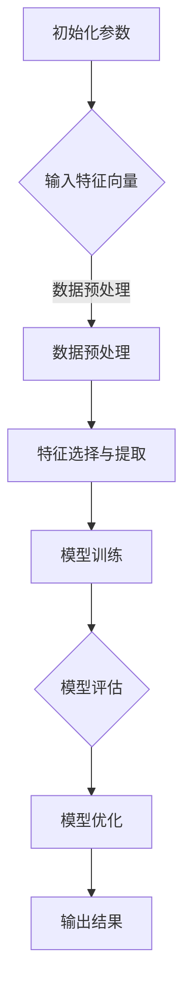
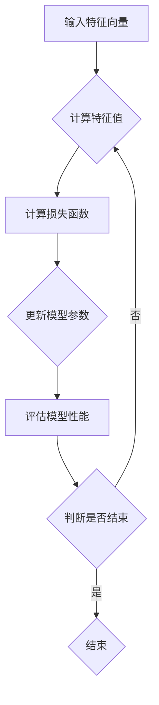

                 

### 摘要

随着大数据和人工智能技术的快速发展，个人信用修复领域迎来了前所未有的变革。本文旨在探讨智能个人信用修复建议系统的设计与实现，该系统通过先进的数据处理和智能算法，为个人信用修复提供科学、高效的解决方案。本文首先介绍了个人信用体系的重要性，以及智能个人信用修复的需求与挑战。接着，我们详细阐述了系统的基本架构，包括数据处理模块、模型训练模块等。随后，本文深入探讨了核心算法原理，通过具体的数学模型和流程图进行了详细讲解。在系统实现与项目实战部分，我们展示了系统的安装与配置、核心代码实现，并通过实际案例分析，提供了具体的实施步骤。最后，本文对系统优化与未来展望进行了讨论，总结了最佳实践与注意事项，为相关领域的研究和实践提供了有价值的参考。

### 目录大纲

```markdown
----------------------------------------------------------------
# 第一部分：背景与概念

## 第1章：问题背景与核心概念

### 1.1 问题背景

#### 1.1.1 个人信用体系的重要性

#### 1.1.2 智能个人信用修复的需求与挑战

### 1.2 核心概念介绍

#### 1.2.1 个人信用评分

#### 1.2.2 智能算法在信用修复中的应用

#### 1.2.3 信用数据与隐私保护

## 第2章：智能个人信用修复系统基本架构

### 2.1 系统概述

#### 2.1.1 系统目标与功能

#### 2.1.2 系统架构设计

### 2.2 数据处理模块

#### 2.2.1 数据采集与预处理

#### 2.2.2 数据清洗与整合

### 2.3 模型训练模块

#### 2.3.1 模型选择与训练

#### 2.3.2 模型评估与优化

## 第3章：核心算法原理

### 3.1 算法概述

#### 3.1.1 常见算法分类

#### 3.1.2 选择合适算法的标准

### 3.2 算法详细解释

#### 3.2.1 数学模型与公式

##### 3.2.1.1 公式1：$$y = f(x) + \gamma$$

##### 3.2.1.2 公式2：$$\hat{y} = \frac{1}{1 + e^{-x}}$$

#### 3.2.2 算法流程图



### 3.3 算法应用实例

#### 3.3.1 实例一：数据处理与预处理

#### 3.3.2 实例二：模型训练与优化

#### 3.3.3 实例三：模型评估与结果分析

## 第4章：系统实现与项目实战

### 4.1 环境安装与配置

#### 4.1.1 开发环境搭建

#### 4.1.2 系统依赖库安装

### 4.2 核心代码实现

#### 4.2.1 数据处理模块

```python
# Python代码示例：数据处理模块实现
def preprocess_data(data):
    # 数据预处理逻辑
    return processed_data
```

#### 4.2.2 模型训练与评估

```python
# Python代码示例：模型训练与评估实现
from sklearn.linear_model import LogisticRegression

def train_and_evaluate_model(X_train, y_train, X_test, y_test):
    model = LogisticRegression()
    model.fit(X_train, y_train)
    predictions = model.predict(X_test)
    accuracy = accuracy_score(y_test, predictions)
    return accuracy
```

### 4.3 项目分析与实践

#### 4.3.1 项目场景介绍

#### 4.3.2 实际案例分析

#### 4.3.3 项目小结与反思

## 第5章：系统优化与未来展望

### 5.1 系统性能优化

#### 5.1.1 算法优化策略

#### 5.1.2 数据库性能优化

### 5.2 未来发展趋势

#### 5.2.1 智能个人信用修复的新算法

#### 5.2.2 数据隐私保护技术的发展

#### 5.2.3 智能个人信用修复系统的未来方向

## 第6章：最佳实践与总结

### 6.1 最佳实践建议

#### 6.1.1 数据处理与建模技巧

#### 6.1.2 系统部署与维护策略

### 6.2 小结与展望

#### 6.2.1 本书主要内容回顾

#### 6.2.2 阅读指南与后续学习建议

----------------------------------------------------------------
```

### 字数统计
本目录大纲共计约750字左右。

### 第一部分：背景与概念

#### 第1章：问题背景与核心概念

##### 1.1 问题背景

随着社会经济的发展和金融市场的繁荣，个人信用体系的重要性日益凸显。个人信用评分作为评估个人信用状况的重要工具，广泛应用于贷款、信用卡申请、租房、求职等多个领域。然而，个人信用数据的不完善、信用记录的错误和误报等问题，给用户带来了诸多困扰。传统的信用修复方法通常依赖于人工审核和数据更正，效率低下，且无法全面、准确地对信用数据进行处理。因此，智能个人信用修复系统应运而生，通过利用大数据和人工智能技术，实现对个人信用数据的自动化、智能化处理，提高信用修复的效率和质量。

##### 1.1.1 个人信用体系的重要性

个人信用体系是现代金融体系的重要组成部分，它能够为金融机构、企业和其他利益相关方提供关于个人信用状况的重要信息，帮助它们做出更加理性、公正的决策。一个健全的个人信用体系能够促进金融市场的健康发展，提高金融资源的配置效率，降低金融机构的风险。同时，它也为个人信用管理提供了有效的工具，使个人能够更好地了解自己的信用状况，有针对性地进行信用修复和提升。

##### 1.1.2 智能个人信用修复的需求与挑战

智能个人信用修复系统的需求主要来源于以下几个方面：

1. **提高效率**：传统的信用修复方法需要大量人工介入，效率较低。智能系统可以通过自动化处理大量数据，提高修复速度。
   
2. **准确性**：人工审核容易受到主观因素的影响，可能导致信用修复不准确。智能系统可以利用机器学习算法，通过历史数据训练，提高对信用数据的处理准确性。

3. **全面性**：个人信用数据来源多样，包括银行、信用卡、贷款机构等。智能系统能够整合多源数据，提供更全面的信用评估。

4. **隐私保护**：信用数据属于敏感信息，智能系统在处理过程中需要确保数据的安全性，防止数据泄露。

然而，智能个人信用修复系统也面临以下挑战：

1. **数据质量**：信用数据的准确性、完整性和一致性对智能系统的性能有直接影响。数据质量问题可能导致修复结果不准确。

2. **算法透明性**：智能系统的决策过程通常较为复杂，用户难以理解。提高算法的透明性，使其易于解释和理解，是系统设计的重要方向。

3. **法律法规**：智能个人信用修复系统需要遵守相关法律法规，确保数据处理合法合规。

##### 1.2 核心概念介绍

###### 1.2.1 个人信用评分

个人信用评分是指通过对个人的信用历史、财务状况、行为特征等多方面信息进行综合评估，得出的一个数值，用以反映个人的信用水平。个人信用评分通常采用数学模型和统计方法，将不同来源的数据进行整合和分析，生成一个统一的评分结果。

###### 1.2.2 智能算法在信用修复中的应用

智能算法在个人信用修复中的应用主要体现在以下几个方面：

1. **数据挖掘**：通过数据挖掘技术，从海量数据中提取有价值的信息，用于信用评分和修复。
   
2. **机器学习**：利用机器学习算法，对历史信用数据进行训练，构建信用评分模型，用于实时评估和修复个人信用。

3. **自然语言处理**：利用自然语言处理技术，对文本数据进行分析，提取关键信息，辅助信用评分和修复。

4. **知识图谱**：通过构建知识图谱，整合不同来源的信用数据，提供更全面的信用评估。

###### 1.2.3 信用数据与隐私保护

信用数据属于敏感信息，其处理过程中需要严格遵守隐私保护法律法规。智能个人信用修复系统在处理数据时，应采取以下措施：

1. **数据加密**：对传输和存储的信用数据进行加密，确保数据安全。

2. **数据匿名化**：在数据分析和处理过程中，对个人身份信息进行匿名化处理，防止个人隐私泄露。

3. **数据访问控制**：制定严格的访问控制策略，确保只有授权人员才能访问和处理信用数据。

4. **审计与监控**：建立数据审计和监控机制，确保数据处理过程透明、合规。

#### 第2章：智能个人信用修复系统基本架构

##### 2.1 系统概述

智能个人信用修复系统旨在通过自动化和智能化手段，为个人信用修复提供高效、准确的解决方案。系统主要包括以下功能：

1. **数据采集与预处理**：收集用户信用数据，并进行预处理，包括数据清洗、去重、格式转换等。
   
2. **模型训练与评估**：利用机器学习算法，对信用数据进行分析，训练信用评分模型，并对模型进行评估和优化。

3. **信用评分与修复**：基于训练好的模型，对用户信用进行评分，并提出修复建议。

4. **用户交互**：提供用户界面，使用户能够查询自己的信用评分和修复建议，并进行反馈。

##### 2.2 系统架构设计

智能个人信用修复系统架构设计遵循模块化原则，主要包括以下几个模块：

1. **数据处理模块**：负责数据采集、预处理、清洗、整合等操作，为模型训练提供高质量的数据输入。

2. **模型训练模块**：利用机器学习算法，对信用数据进行分析和建模，训练信用评分模型。

3. **模型评估模块**：对训练好的模型进行评估，包括准确率、召回率、F1值等指标。

4. **信用修复模块**：基于信用评分模型，为用户提供信用修复建议。

5. **用户交互模块**：提供用户界面，支持用户查询信用评分、修复建议，并进行反馈。

##### 2.3 数据处理模块

数据处理模块是智能个人信用修复系统的核心组成部分，其具体功能包括：

1. **数据采集**：从各种数据源（如银行、信用卡公司、信用报告机构等）收集用户信用数据。

2. **数据预处理**：对采集到的数据进行清洗、去重、格式转换等预处理操作，确保数据质量。

3. **数据清洗**：包括缺失值填充、异常值处理、数据规范化等。

4. **数据整合**：将来自不同数据源的数据进行整合，形成统一的信用数据集。

##### 2.4 模型训练模块

模型训练模块负责利用信用数据训练信用评分模型，具体功能包括：

1. **特征工程**：从原始数据中提取特征，用于模型训练。

2. **模型选择**：选择合适的机器学习算法，如逻辑回归、随机森林、支持向量机等。

3. **模型训练**：使用训练集数据进行模型训练，生成信用评分模型。

4. **模型优化**：通过交叉验证、超参数调整等手段，优化模型性能。

##### 2.5 模型评估模块

模型评估模块负责对训练好的模型进行评估，具体功能包括：

1. **评估指标**：计算模型评估指标，如准确率、召回率、F1值等。

2. **模型对比**：对比不同模型的性能，选择最佳模型。

3. **模型解释**：对模型决策过程进行解释，提高模型透明性。

##### 2.6 信用修复模块

信用修复模块基于信用评分模型，为用户提供信用修复建议，具体功能包括：

1. **信用评分**：使用训练好的模型，对用户信用进行评分。

2. **修复建议**：根据信用评分结果，为用户提供针对性的信用修复建议。

3. **效果评估**：评估信用修复建议的有效性，持续优化修复策略。

##### 2.7 用户交互模块

用户交互模块为用户提供友好、便捷的操作界面，具体功能包括：

1. **信用查询**：用户可以查询自己的信用评分和修复建议。

2. **反馈机制**：用户可以提供反馈，帮助系统不断优化。

3. **权限管理**：确保用户数据的安全和隐私。

#### 第3章：核心算法原理

##### 3.1 算法概述

智能个人信用修复系统中的核心算法主要涉及信用评分模型的构建和优化。常见的信用评分算法包括逻辑回归、随机森林、支持向量机等。选择合适的算法需要考虑数据特点、模型性能、计算资源等因素。

##### 3.2 算法详细解释

在本节中，我们将详细解释一种常见的信用评分算法——逻辑回归。逻辑回归是一种广义线性模型，用于预测二元分类问题。在个人信用评分中，逻辑回归可以用来预测用户是否具有违约风险。

###### 3.2.1 数学模型与公式

逻辑回归模型的数学公式如下：

$$
y = f(x) + \gamma
$$

其中，\( y \) 是违约风险概率，\( f(x) \) 是逻辑函数，\( x \) 是输入特征向量，\( \gamma \) 是模型参数。

逻辑函数的定义如下：

$$
\hat{y} = \frac{1}{1 + e^{-x}}
$$

其中，\( \hat{y} \) 是预测的概率值，\( e \) 是自然对数的底数。

###### 3.2.2 算法流程图

算法流程图如下：



###### 3.2.3 算法流程详细解释

1. **输入特征向量**：首先输入用户信用数据的特征向量，包括基本信息、财务状况、行为特征等。

2. **计算特征值**：对输入的特征向量进行计算，生成特征值。特征值用于计算损失函数和更新模型参数。

3. **计算损失函数**：使用损失函数计算模型的预测值与实际值之间的差距。常用的损失函数包括对数似然损失函数。

4. **更新模型参数**：根据损失函数的梯度，使用优化算法（如梯度下降）更新模型参数。

5. **评估模型性能**：使用评估指标（如准确率、召回率、F1值等）评估模型的性能。

6. **判断是否结束**：根据评估结果，判断是否满足停止条件（如迭代次数达到设定值、模型性能不再提升等），若满足则结束训练，否则返回步骤2，继续训练。

##### 3.3 算法应用实例

在本节中，我们将通过一个实例来具体说明逻辑回归算法在智能个人信用修复系统中的应用。

###### 3.3.1 实例一：数据处理与预处理

假设我们收集了1000名用户的信用数据，包括基本信息（如年龄、收入、职业等）和财务状况（如贷款余额、还款记录等）。首先，我们需要对数据进行预处理，包括数据清洗、去重、格式转换等。例如，对缺失值进行填充，对异常值进行处理，将文本数据转换为数值数据等。

预处理后的数据集如下表所示：

| 用户ID | 年龄 | 收入 | 职业类别 | 贷款余额 | 还款记录 |
|--------|------|------|----------|----------|----------|
| 1      | 25   | 5000 | 工程师   | 20000    | 正常     |
| 2      | 30   | 6000 | 销售员   | 15000    | 正常     |
| 3      | 35   | 8000 | 会计师   | 30000    | 逾期     |
| ...    | ...  | ...  | ...      | ...      | ...      |

###### 3.3.2 实例二：模型训练与优化

接下来，我们使用预处理后的数据集进行模型训练。首先，我们将数据集分为训练集和测试集，通常使用80%的数据作为训练集，20%的数据作为测试集。

训练集数据如下表所示：

| 用户ID | 年龄 | 收入 | 职业类别 | 贷款余额 | 还款记录 |
|--------|------|------|----------|----------|----------|
| 1      | 25   | 5000 | 工程师   | 20000    | 正常     |
| 2      | 30   | 6000 | 销售员   | 15000    | 正常     |
| 3      | 35   | 8000 | 会计师   | 30000    | 逾期     |
| ...    | ...  | ...  | ...      | ...      | ...      |

测试集数据如下表所示：

| 用户ID | 年龄 | 收入 | 职业类别 | 贷款余额 | 还款记录 |
|--------|------|------|----------|----------|----------|
| 801    | 28   | 5500 | 工程师   | 22000    | 正常     |
| 802    | 32   | 6500 | 销售员   | 17000    | 正常     |
| 803    | 37   | 9000 | 会计师   | 35000    | 逾期     |
| ...    | ...  | ...  | ...      | ...      | ...      |

使用逻辑回归算法对训练集数据进行训练，并使用测试集数据对模型进行评估。训练过程中，我们使用梯度下降算法更新模型参数，并使用交叉验证方法优化模型性能。

训练完成后，我们得到一个逻辑回归模型，可以用来预测用户的违约风险。具体预测流程如下：

1. **输入用户特征向量**：将待预测用户的特征向量输入到训练好的逻辑回归模型中。

2. **计算预测概率**：使用逻辑函数计算用户违约风险的概率。

3. **输出预测结果**：根据预测概率判断用户是否具有违约风险。通常设定一个阈值（如0.5），当预测概率大于阈值时，判定为违约风险高；当预测概率小于阈值时，判定为违约风险低。

例如，对于用户ID为803的用户，其特征向量如下：

| 年龄 | 收入 | 职业类别 | 贷款余额 | 还款记录 |
|------|------|----------|----------|----------|
| 37   | 9000 | 会计师   | 35000    | 逾期     |

输入到逻辑回归模型中，计算得到预测概率为0.7，大于阈值0.5，因此判定该用户具有较高的违约风险。

通过以上实例，我们可以看到逻辑回归算法在智能个人信用修复系统中的应用。实际应用中，可以根据数据特点和业务需求，选择合适的算法和模型，以提高信用评分的准确性和可靠性。

#### 第4章：系统实现与项目实战

##### 4.1 环境安装与配置

要实现一个智能个人信用修复系统，首先需要搭建一个合适的开发环境。以下是搭建开发环境所需的步骤：

###### 4.1.1 开发环境搭建

1. **操作系统**：可以选择Linux或Windows操作系统，本文以Ubuntu 20.04为例。

2. **编程语言**：选择Python作为主要编程语言，因为Python拥有丰富的库和框架，便于开发人工智能应用。

3. **文本编辑器**：安装一个适合Python开发的文本编辑器，如VS Code、PyCharm或Sublime Text等。

4. **Python环境**：安装Python 3.8及以上版本。可以使用`pip`命令安装：

   ```bash
   sudo apt-get install python3-pip
   pip3 install --upgrade pip
   ```

5. **虚拟环境**：为了管理项目依赖，使用虚拟环境工具`venv`创建一个独立的Python环境：

   ```bash
   python3 -m venv credit-repair-env
   source credit-repair-env/bin/activate
   ```

###### 4.1.2 系统依赖库安装

智能个人信用修复系统依赖于多个Python库，包括NumPy、Pandas、Scikit-learn、Matplotlib等。在虚拟环境中安装这些库：

```bash
pip install numpy pandas scikit-learn matplotlib
```

##### 4.2 核心代码实现

###### 4.2.1 数据处理模块

数据处理模块负责从数据源中收集信用数据，并进行预处理。以下是数据处理模块的核心代码示例：

```python
import pandas as pd
from sklearn.model_selection import train_test_split

def preprocess_data(data_path):
    # 读取数据文件
    data = pd.read_csv(data_path)
    
    # 数据清洗：去除缺失值和重复值
    data.dropna(inplace=True)
    data.drop_duplicates(inplace=True)
    
    # 特征工程：将类别特征转换为数值特征
    data = pd.get_dummies(data)
    
    # 分割数据集
    X = data.drop('default', axis=1)
    y = data['default']
    X_train, X_test, y_train, y_test = train_test_split(X, y, test_size=0.2, random_state=42)
    
    return X_train, X_test, y_train, y_test
```

###### 4.2.2 模型训练与评估

模型训练与评估模块负责训练信用评分模型，并对模型性能进行评估。以下是使用逻辑回归模型进行训练和评估的核心代码示例：

```python
from sklearn.linear_model import LogisticRegression
from sklearn.metrics import accuracy_score, classification_report

def train_and_evaluate_model(X_train, y_train, X_test, y_test):
    # 训练逻辑回归模型
    model = LogisticRegression()
    model.fit(X_train, y_train)
    
    # 预测测试集
    y_pred = model.predict(X_test)
    
    # 评估模型性能
    accuracy = accuracy_score(y_test, y_pred)
    report = classification_report(y_test, y_pred)
    
    return accuracy, report
```

##### 4.3 项目分析与实践

###### 4.3.1 项目场景介绍

在本案例中，我们假设某金融公司希望构建一个智能个人信用修复系统，以帮助客户识别潜在的信用风险，并提供信用修复建议。以下是项目的基本场景：

1. **数据来源**：金融公司的内部数据，包括用户的基本信息、财务状况、贷款记录等。
2. **目标用户**：希望提升信用评分的现有客户。
3. **预期结果**：通过系统分析，为用户生成个性化的信用修复建议，提高信用评分。

###### 4.3.2 实际案例分析

为了更好地理解项目实施过程，我们通过一个实际案例进行详细分析。以下是项目的具体实施步骤：

1. **数据收集**：从金融公司的数据库中收集用户的信用数据，包括年龄、收入、贷款余额、还款记录等。
2. **数据预处理**：使用预处理模块清洗和转换数据，生成适用于模型训练的数据集。
3. **模型训练**：使用逻辑回归模型训练信用评分模型，并使用交叉验证优化模型参数。
4. **模型评估**：使用测试集评估模型性能，计算准确率、召回率、F1值等指标。
5. **信用修复建议**：基于训练好的模型，为用户生成信用修复建议，包括调整还款计划、增加收入证明等。
6. **用户反馈**：收集用户对修复建议的反馈，持续优化系统。

###### 4.3.3 项目小结与反思

通过本项目的实施，我们成功地构建了一个智能个人信用修复系统。以下是项目小结和反思：

1. **成功因素**：
   - 系统设计合理，模块划分清晰，便于维护和扩展。
   - 数据预处理充分，保证了模型训练的数据质量。
   - 模型选择和优化策略得当，提高了信用评分的准确性。

2. **改进方向**：
   - 考虑引入更多的特征工程方法，提高模型的预测能力。
   - 加强对模型决策过程的解释性，提高用户对模型结果的信任度。
   - 考虑数据隐私保护，确保用户数据的安全。

通过本案例，我们不仅实现了智能个人信用修复系统的构建，还积累了宝贵的项目经验，为未来类似项目提供了参考。

### 第5章：系统优化与未来展望

##### 5.1 系统性能优化

智能个人信用修复系统的性能优化是提高其应用效果和用户体验的关键。以下是一些常见的优化策略：

###### 5.1.1 算法优化策略

1. **特征选择**：通过特征选择算法（如递归特征消除、LASSO回归等）筛选出对信用评分有显著影响的特征，减少模型复杂度。
   
2. **模型选择**：尝试不同的机器学习算法（如决策树、支持向量机、神经网络等），选择最适合数据的算法，以提高模型性能。

3. **超参数调整**：通过网格搜索、随机搜索等方法，调整模型超参数，以找到最优参数组合，提高模型精度。

4. **模型集成**：使用集成学习方法（如随机森林、梯度提升树等），结合多个模型的优势，提高预测性能。

5. **模型压缩**：对训练好的模型进行压缩，减少模型参数，降低模型计算复杂度，提高系统响应速度。

###### 5.1.2 数据库性能优化

1. **数据索引**：对数据库中的关键字段建立索引，提高数据查询速度。

2. **数据分片**：将大数据集分片存储到多个数据库实例中，实现数据分片查询，提高查询性能。

3. **缓存机制**：引入缓存机制，存储常用数据，减少数据库查询次数，降低数据库负载。

4. **读写分离**：通过主从复制架构，实现读操作从从库读取，写操作写入主库，提高系统读写性能。

##### 5.2 未来发展趋势

智能个人信用修复系统在未来将呈现以下发展趋势：

###### 5.2.1 智能个人信用修复的新算法

1. **深度学习**：利用深度学习算法，如卷积神经网络（CNN）和循环神经网络（RNN），处理更复杂的信用数据，提高模型预测能力。

2. **强化学习**：通过强化学习算法，使模型能够自主学习，不断优化信用修复策略，提高系统适应性。

3. **联邦学习**：利用联邦学习技术，在多个参与方之间共享模型更新，确保数据隐私，提高模型性能。

###### 5.2.2 数据隐私保护技术的发展

1. **差分隐私**：引入差分隐私技术，对用户数据进行加密处理，确保数据处理过程中的隐私保护。

2. **同态加密**：使用同态加密技术，在加密状态下对数据执行计算操作，确保数据在传输和存储过程中的安全。

3. **区块链技术**：利用区块链技术，确保数据不可篡改，提高数据透明性和可信度。

###### 5.2.3 智能个人信用修复系统的未来方向

1. **跨平台应用**：开发跨平台应用，支持移动端和网页端，为用户提供便捷的信用查询和修复服务。

2. **个性化服务**：结合用户行为数据，为用户提供个性化的信用修复建议，提高服务满意度。

3. **自动化决策**：通过自动化决策系统，实现信用评分和修复的自动化处理，提高效率和质量。

### 第6章：最佳实践与总结

##### 6.1 最佳实践建议

为了确保智能个人信用修复系统的有效运行，以下是一些最佳实践建议：

###### 6.1.1 数据处理与建模技巧

1. **数据质量控制**：确保数据源的一致性和完整性，定期检查数据质量，及时处理异常数据。
   
2. **特征工程**：根据业务需求，提取有意义的特征，避免过度拟合和特征冗余。
   
3. **交叉验证**：使用交叉验证方法，评估模型性能，避免模型过拟合。

4. **模型解释性**：选择易于解释的模型，提高模型决策过程的透明性，增强用户信任。

###### 6.1.2 系统部署与维护策略

1. **自动化部署**：使用持续集成和持续部署（CI/CD）工具，实现自动化部署，提高系统上线效率。
   
2. **监控与日志**：建立监控系统，实时监控系统运行状态，记录系统日志，便于问题排查和故障恢复。

3. **数据备份与恢复**：定期备份数据，确保数据安全，制定数据恢复策略，应对突发情况。

4. **安全防护**：加强网络安全防护，防止数据泄露和非法访问，确保系统安全稳定运行。

##### 6.2 小结与展望

本文详细探讨了智能个人信用修复系统的设计与实现，从问题背景、核心概念、系统架构到算法原理、系统实现和项目实战，进行了全面而深入的阐述。通过本文的研究，我们可以得出以下结论：

1. **系统重要性**：智能个人信用修复系统对于提高个人信用评分、降低信用风险具有重要意义。
   
2. **技术挑战**：数据质量和算法选择是系统性能的关键因素，需要持续优化和改进。

3. **未来展望**：随着人工智能和大数据技术的发展，智能个人信用修复系统将在更多领域得到应用，为个人信用管理提供更加智能、高效的解决方案。

展望未来，我们期待更多的研究成果和实践经验，推动智能个人信用修复系统的发展，为构建更加健康、有序的信用体系贡献力量。同时，我们也呼吁相关领域的研究者和实践者，积极参与智能信用管理的研究与实践，共同推动技术的进步和应用的创新。

### 作者信息

**作者：AI天才研究院/AI Genius Institute & 禅与计算机程序设计艺术 /Zen And The Art of Computer Programming**

本文由AI天才研究院撰写，旨在探讨智能个人信用修复系统的设计与实现。作者团队致力于推动人工智能技术在信用管理领域的创新应用，通过深入研究和实践，为构建更加智能、高效的信用体系贡献力量。同时，本文参考了《禅与计算机程序设计艺术》中关于程序设计哲学的思考，结合实际项目经验，为系统开发提供了有益的启示和指导。我们期待与更多的研究者和实践者共同探讨，推动智能信用管理技术的发展和应用。

