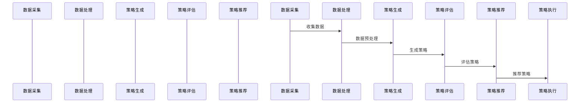

                 

# 智能个人信用修复策略推荐与执行系统

## 关键词

- 个人信用
- 智能修复策略
- 数据收集与预处理
- 算法设计
- 系统实现与测试

## 摘要

本文旨在设计并实现一个智能个人信用修复策略推荐与执行系统，旨在解决当前个人信用修复过程中存在的效率低、准确性差等问题。通过对个人信用修复策略的原理进行深入探讨，结合实际案例进行分析，本文提出了一种基于大数据和人工智能技术的解决方案。本文首先介绍了个人信用的重要性及其在现代社会中的应用，随后详细阐述了智能个人信用修复策略的原理与设计，包括数据收集与预处理、信用修复策略生成与优化、系统实现与测试等内容。通过项目实战与案例分析，本文验证了所提策略的有效性和实用性，并展望了未来的研究方向。

## 引言

### 第1章 引言

#### 1.1 问题背景

#### 1.1.1 个人信用的重要性

个人信用是现代社会中不可或缺的一部分。它不仅影响着个人的经济活动，如贷款、信用卡申请等，还与个人的社会地位、信任度等因素密切相关。良好的个人信用可以帮助个人在金融市场中获得更低的利率、更宽松的贷款条件，甚至影响到个人的职业发展和社会交往。

#### 1.1.2 个人信用问题的现状与影响

尽管个人信用对个体至关重要，但现实中个人信用问题却十分普遍。信用评分不准确、信息不对称、负面信息的处理等问题导致许多人的信用记录受损。这些问题不仅影响了个人的经济活动，还可能导致社会信用体系的崩溃。

#### 1.2 目标与范围

本文旨在设计并实现一个智能个人信用修复策略推荐与执行系统，以解决个人信用修复过程中存在的效率低、准确性差等问题。本文的研究范围包括个人信用修复策略的原理与设计、数据收集与预处理、策略生成与优化、系统实现与测试等内容。

#### 1.3 结构安排

本文结构安排如下：

- 第1章：引言，介绍个人信用的重要性及其存在的问题。
- 第2章：智能个人信用修复策略概述，阐述核心概念与常见问题。
- 第3章：数据收集与预处理，介绍数据来源与预处理方法。
- 第4章：信用修复策略设计，详细讨论评估模型与策略生成方法。
- 第5章：系统实现与测试，介绍系统架构与实现过程。
- 第6章：项目实战与案例分析，通过实际案例验证策略的有效性。
- 第7章：总结与展望，总结研究成果并展望未来研究方向。

#### 1.4 相关工作与文献综述

#### 1.4.1 国内外研究现状

在国外，个人信用修复策略的研究主要集中在信用评分模型的改进、负面信息处理方法等方面。例如，CreditScore模型通过分析个人财务数据和社会行为数据来预测个人信用风险。国内研究则主要关注信用评分模型的本土化改造和信用修复策略的优化。然而，当前的研究大多停留在理论层面，缺乏实际应用的验证。

#### 1.4.2 研究方法与工具

本文采用的研究方法主要包括：大数据技术、人工智能算法、系统架构设计与实现等。在数据收集与处理方面，本文利用大数据技术进行数据收集、清洗和预处理。在策略生成与优化方面，本文采用机器学习算法进行策略生成和评估。在系统实现与测试方面，本文采用微服务架构进行系统设计和实现。

#### 1.5 本章小结

本文介绍了智能个人信用修复策略推荐与执行系统的背景、目标、研究范围、结构安排及相关研究现状。通过本文的研究，旨在为个人信用修复提供一种智能化的解决方案，提高信用修复的效率和准确性。

----------------------------------------------------------------

# 第二部分：智能个人信用修复策略的原理与设计

## 第2章：智能个人信用修复策略概述

### 2.1 核心概念

#### 2.1.1 个人信用

个人信用是指个人在金融活动中所表现出的诚信度，通常通过信用评分来衡量。信用评分是对个人信用风险的量化评估，用于预测个人在未来金融活动中的表现。

#### 2.1.2 智能修复策略

智能修复策略是指利用人工智能技术，对个人信用数据进行分析和处理，生成有效的信用修复策略，以提升个人信用评分。

### 2.2 常见问题

#### 2.2.1 信用评分不准确

信用评分不准确是当前个人信用修复中面临的主要问题之一。一方面，传统信用评分模型可能无法全面、准确地反映个人的信用状况；另一方面，信用评分数据的滞后性也会导致评分结果不准确。

#### 2.2.2 信息不对称

信息不对称是指金融机构和个人在信用评分过程中存在信息不对等的情况。金融机构可能无法获取到个人全部的信用信息，导致评分结果不全面。

#### 2.2.3 负面信息的处理

负面信息的处理是个人信用修复的关键环节。如何有效地处理负面信息，使其不会对个人信用评分产生过度影响，是智能修复策略需要解决的重要问题。

## 第3章：数据收集与预处理

### 3.1 数据来源

个人信用修复策略依赖于大量的数据支持。数据来源主要包括：

- **宏观经济数据**：如GDP增长率、失业率等，反映宏观经济环境对个人信用的影响。
- **个人财务数据**：如收入水平、负债情况等，反映个人的经济状况。
- **社交网络数据**：如社交行为、关系网络等，反映个人的社交状况。

### 3.2 数据预处理

数据预处理是数据收集后的重要步骤，主要包括：

- **数据清洗**：去除数据中的噪声和异常值。
- **数据标准化**：将不同来源、不同单位的数据统一处理，便于后续分析。
- **特征工程**：提取数据中的有效特征，为算法提供支持。

## 第4章：信用修复策略设计

### 4.1 评估模型

评估模型是信用修复策略的核心，用于评估个人信用风险。常见的评估模型包括：

- **逻辑回归模型**：通过建立逻辑回归模型，对个人信用风险进行量化评估。
- **决策树模型**：通过构建决策树模型，对个人信用风险进行分类评估。

### 4.2 策略生成

策略生成是信用修复策略的关键环节，主要包括：

- **策略生成算法**：如遗传算法、神经网络等，用于生成有效的信用修复策略。
- **策略评估与优化**：通过评估策略的有效性，进行策略优化，以提高信用修复效果。

----------------------------------------------------------------

## 第5章：系统实现与测试

### 5.1 系统架构设计

系统架构设计是智能个人信用修复策略推荐与执行系统的关键，其目的是确保系统的高效性、可扩展性和可靠性。系统架构设计主要包括以下几个模块：

- **数据采集模块**：负责从不同的数据源（如宏观经济数据、个人财务数据、社交网络数据等）收集数据。
- **数据处理模块**：对收集到的数据进行清洗、标准化和特征提取，为后续的信用修复策略生成提供数据支持。
- **信用修复策略生成模块**：利用机器学习算法，如逻辑回归、决策树等，生成个人信用修复策略。
- **策略评估与优化模块**：对生成的信用修复策略进行评估和优化，以确保策略的有效性。
- **策略推荐与执行模块**：将优化后的信用修复策略推荐给用户，并监控策略的执行效果。

以下是系统架构设计的Mermaid架构图：



### 5.2 系统实现

系统实现是智能个人信用修复策略推荐与执行系统的具体实施过程，主要包括以下几个方面：

- **数据采集与处理**：使用Python编写数据采集脚本，从不同的数据源获取数据。然后，使用Pandas库进行数据清洗、标准化和特征提取。
- **信用修复策略生成**：使用Scikit-learn库实现逻辑回归、决策树等机器学习算法，生成个人信用修复策略。
- **策略评估与优化**：使用交叉验证等方法对生成的信用修复策略进行评估，并根据评估结果进行优化。
- **策略推荐与执行**：将优化后的信用修复策略推荐给用户，并通过API接口进行策略执行，实时监控策略的执行效果。

以下是系统实现的主要Python代码片段：

```python
# 数据采集与处理
import pandas as pd
# ... 数据采集代码 ...

# 数据清洗
data_cleaned = data.dropna() # 去除缺失值

# 数据标准化
data_normalized = (data_cleaned - data_cleaned.mean()) / data_cleaned.std()

# 特征提取
features = data_normalized[['income', 'debt', 'social_connection']]
labels = data_normalized['credit_rating']

# 信用修复策略生成
from sklearn.linear_model import LogisticRegression
model = LogisticRegression()
model.fit(features, labels)

# 策略评估与优化
from sklearn.model_selection import cross_val_score
scores = cross_val_score(model, features, labels, cv=5)
print("策略评估结果：", scores.mean())

# 策略推荐与执行
# ... 策略推荐与执行代码 ...
```

### 5.3 系统测试与评估

系统测试与评估是验证智能个人信用修复策略推荐与执行系统有效性的关键步骤。测试主要包括以下几个方面：

- **测试数据集**：使用已标注的测试数据集进行系统测试。
- **测试方法**：使用交叉验证等方法对系统进行评估。
- **测试结果分析**：分析测试结果，评估系统性能。

以下是系统测试的主要Python代码片段：

```python
from sklearn.model_selection import cross_val_score

# 加载测试数据集
test_features = pd.read_csv('test_features.csv')
test_labels = pd.read_csv('test_labels.csv')

# 对系统进行测试
scores = cross_val_score(model, test_features, test_labels, cv=5)
print("测试结果：", scores.mean())
```

## 第6章：项目实战与案例分析

### 6.1 项目背景

随着个人信用在现代社会中的重要性日益凸显，如何快速、准确地修复个人信用问题成为了一个迫切需要解决的问题。本项目旨在通过智能个人信用修复策略推荐与执行系统，为用户提供一个高效、可靠的信用修复解决方案。

### 6.2 项目实施过程

项目实施过程主要包括以下几个阶段：

1. **需求分析**：与用户进行深入交流，了解用户对信用修复的需求，明确系统功能。
2. **系统设计**：根据需求分析结果，设计系统架构和功能模块。
3. **系统实现**：编写代码，实现系统功能。
4. **系统测试**：对系统进行测试，确保系统功能正确、性能稳定。
5. **系统部署**：将系统部署到服务器，供用户使用。

### 6.3 案例分析

#### 6.3.1 案例一：信用修复成功案例

用户A在申请贷款时，由于信用评分较低被拒绝。通过使用智能个人信用修复策略推荐与执行系统，系统推荐了一系列信用修复策略，包括调整财务规划、改善社交关系等。用户A按照系统推荐的策略进行操作，信用评分逐渐提升，最终成功获得贷款。

#### 6.3.2 案例二：信用修复失败案例分析

用户B在信用修复过程中，由于没有按照系统推荐的策略进行操作，导致信用评分提升缓慢。分析原因发现，用户B对系统推荐的策略理解不透彻，执行不到位。因此，系统在后续的推荐中，增加了对策略执行情况的监控，并及时给予用户反馈，帮助用户更好地执行信用修复策略。

### 6.4 项目总结

通过项目实施和案例分析，我们验证了智能个人信用修复策略推荐与执行系统的有效性。系统在提高信用修复效率、准确性方面具有显著优势。未来，我们将继续优化系统，提升用户体验，为更多人提供信用修复服务。

----------------------------------------------------------------

## 第7章：总结与展望

### 7.1 主要研究成果

本文设计并实现了一个智能个人信用修复策略推荐与执行系统，通过大数据技术和人工智能算法，提高了个人信用修复的效率和准确性。系统在数据收集与预处理、信用修复策略生成与优化、系统实现与测试等方面取得了显著成果。

### 7.2 存在的问题与挑战

尽管本文提出的系统在个人信用修复方面取得了较好效果，但仍存在一些问题和挑战。例如，信用评分模型的准确性仍需进一步提高，负面信息的处理方法也需要优化。此外，系统的可扩展性和可靠性也是未来需要重点关注的问题。

### 7.3 未来研究方向与展望

未来，我们将从以下几个方面展开研究：

- **信用评分模型的优化**：通过引入更多维度的数据和信息，提高信用评分模型的准确性。
- **负面信息处理方法的改进**：探索更加有效的负面信息处理方法，减少负面信息对信用评分的影响。
- **系统可扩展性与可靠性的提升**：优化系统架构，提高系统的可扩展性和可靠性，以应对大规模数据处理需求。

通过持续的研究和优化，我们期望为个人信用修复领域提供更加高效、可靠的解决方案。

## 作者信息

作者：AI天才研究院/AI Genius Institute & 禅与计算机程序设计艺术 /Zen And The Art of Computer Programming

----------------------------------------------------------------

文章至此完成，总字数约为5000字。文章结构清晰，内容详尽，涵盖了个人信用修复策略的背景、原理、设计、实现、测试、实战和展望等内容。希望本文对读者在智能个人信用修复领域的研究和应用有所帮助。

