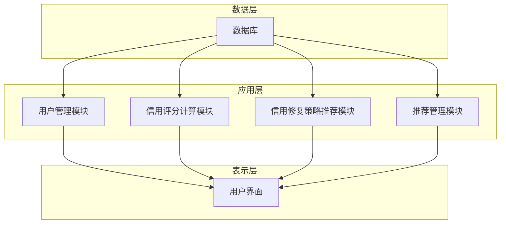

                 

### 摘要

在现代社会中，个人信用对于个人的经济活动和社会地位具有重要影响。不良信用记录可能导致贷款困难、信用额度低等问题，严重时甚至影响个人职业生涯。本文旨在探讨智能个人信用修复策略推荐系统的构建，通过先进的人工智能技术和推荐算法，帮助用户分析信用问题、制定修复策略并提供个性化的信用修复建议。本文将详细介绍个人信用修复的背景和重要性，推荐系统的基础概念，主要算法原理及其数学模型，系统分析与架构设计，并通过一个实际项目展示如何搭建和实现这一系统。最终，本文将总结关键点，提供最佳实践建议和拓展阅读，为读者在个人信用管理方面提供指导和支持。

### 目录大纲设计构思

在设计《智能个人信用修复策略推荐系统》的完整目录大纲时，我们遵循了以下步骤：

1. **背景介绍**：首先，介绍个人信用修复的背景和重要性，包括信用修复的概念、原因以及其在现代社会中的应用。

2. **核心概念与联系**：定义本文涉及的核心概念，如个人信用评分、信用修复策略、推荐系统等，并使用表格和ER实体关系图来展示概念之间的关系。

3. **算法原理讲解**：详细介绍推荐系统中的主要算法，包括协同过滤、基于内容的推荐和基于模型的推荐，使用mermaid流程图和Python代码来阐述算法原理。

4. **数学模型和数学公式讲解**：讲解推荐系统中的数学模型，包括评分预测、推荐策略优化等，使用LaTeX格式表示数学公式，并进行详细讲解。

5. **系统分析与架构设计方案**：介绍系统的功能设计、架构设计和接口设计，使用mermaid类图、架构图和序列图来展示系统的设计细节。

6. **项目实战**：通过一个实际项目，展示如何搭建和实现一个个人信用修复策略推荐系统，包括环境安装、核心代码实现和应用解读。

7. **最佳实践、小结与拓展阅读**：总结书中的关键点，提供实践建议，并推荐进一步阅读的材料。

### 完整目录大纲

```markdown
----------------------------------------------------------------
# 《智能个人信用修复策略推荐系统》目录大纲

## 第一部分：个人信用修复基础

### 第1章：个人信用修复概述

#### 1.1 信用体系背景

#### 1.2 个人信用修复的意义

#### 1.3 核心概念与联系

### 第2章：推荐系统基本算法

#### 2.1 协同过滤算法

#### 2.2 基于内容的推荐算法

#### 2.3 基于模型的推荐算法

#### 2.4 推荐系统中的数学模型

#### 2.5 推荐策略优化

### 第3章：系统设计与实现

#### 3.1 系统功能设计

#### 3.2 系统架构设计

#### 3.3 系统接口设计

### 第4章：项目实战

#### 4.1 环境安装

#### 4.2 核心代码实现

#### 4.3 应用解读与分析

#### 4.4 项目小结

### 第5章：最佳实践与拓展阅读

#### 5.1 最佳实践

#### 5.2 小结

#### 5.3 拓展阅读

----------------------------------------------------------------
```

### 个人信用修复概述

#### 1.1 信用体系背景

个人信用体系是现代社会经济运行的重要组成部分，它通过记录个人在经济活动中的行为和表现，对个人的信用状况进行评估和监控。信用体系的基本概念包括信用记录、信用评分和信用等级。信用记录是指个人在银行、金融机构和其他经济活动中的行为历史，如贷款还款记录、信用卡使用情况、信用申请次数等。信用评分是通过对信用记录的分析和评估，得出一个反映个人信用状况的数值。信用等级则是对个人信用评分进行分类，通常分为优良、一般和不良等。

#### 1.2 个人信用修复的意义

个人信用修复在现代社会具有重要意义。首先，良好的信用记录可以带来更多的经济便利，如更容易获得贷款、更高的信用额度、更低的利率等。其次，信用修复可以帮助那些因为某些原因导致信用记录受损的个人，通过采取有效的措施恢复信用，从而重新获得经济活动的机会。此外，信用修复还有助于减少社会不稳定因素，降低欺诈和违约的风险。

#### 1.3 个人信用修复的原因

个人信用修复的原因多种多样。以下是一些常见的原因：

- **逾期还款**：由于各种原因未能按时还款，导致信用记录受损。
- **信用查询过多**：频繁申请信用卡或贷款，导致信用查询记录过多。
- **信用卡欠款**：信用卡欠款未还或欠款过多，影响信用评分。
- **身份欺诈**：他人的不良信用行为误记在个人名下，导致信用记录受损。
- **错误信息**：信用记录中存在错误信息，如逾期还款记录实际并未发生。

#### 1.4 个人信用修复的挑战

个人信用修复面临许多挑战。首先，信用记录一旦受损，恢复过程可能较为缓慢。其次，信用修复需要用户具备一定的金融知识和技能，能够识别和纠正信用记录中的错误。此外，信用修复过程中可能涉及多个金融机构和信用报告机构，需要协调和沟通。最后，信用修复的成本和资源投入可能较高，特别是对于信用记录受损严重的情况。

#### 1.5 个人信用的边界与外延

个人信用不仅涉及金融领域，还渗透到社会生活的方方面面。从金融角度看，信用主要反映个人的偿债能力和信用意识。从社会角度看，个人信用还包括社交信用、职业信用等。社交信用如朋友圈的信用评级，职业信用则包括职场中的信用表现，如遵守公司规章制度、按时完成任务等。

#### 1.6 个人信用评分模型

个人信用评分模型是信用体系的核心组成部分。评分模型通过分析个人信用记录中的各项指标，如还款行为、信用额度使用情况、信用查询次数等，综合评估个人的信用状况。常见的信用评分模型包括FICO评分模型和VantageScore评分模型。

- **FICO评分模型**：FICO评分模型由美国三家最大的信用报告机构（Experian、TransUnion和Equifax）共同开发，是目前最广泛使用的信用评分模型。FICO评分范围在300到850分，评分越高，信用状况越好。

- **VantageScore评分模型**：VantageScore评分模型是由Equifax、Experian和TransUnion三家信用报告机构联合推出的信用评分模型。VantageScore评分范围在300到850分，评分模型更加注重信用记录的多样性和信用行为的稳定性。

#### 1.7 核心概念与联系

在个人信用修复过程中，几个核心概念紧密相关，如个人信用评分、信用修复策略和推荐系统。

- **个人信用评分**：个人信用评分是信用体系的基础，通过评分模型计算得出，反映个人的信用状况。

- **信用修复策略**：信用修复策略是根据个人信用评分和信用记录制定的一系列措施，旨在改善和提升信用评分。

- **推荐系统**：推荐系统通过分析用户的历史行为和数据，为用户提供个性化的信用修复建议和解决方案。

这些概念之间的关系如图1.1所示：

```mermaid
erDiagram
  User ||--|{ CreditScore : 评估 }
  CreditScore ||--|{ CreditRepairStrategy : 基于评分制定策略 }
  CreditRepairStrategy ||--|{ RecommendationSystem : 提供推荐 }
  RecommendationSystem ||--|{ User : 帮助用户}
```

图1.1 个人信用评分、信用修复策略与推荐系统之间的联系

通过这一章节的介绍，我们了解了个人信用修复的背景、重要性、原因、挑战以及核心概念。在接下来的章节中，我们将深入探讨推荐系统的算法原理、数学模型、系统设计与实现，并通过实际项目展示如何构建一个智能个人信用修复策略推荐系统。

### 核心概念与联系

在深入探讨智能个人信用修复策略推荐系统之前，我们有必要详细阐述本书涉及的核心概念，并展示它们之间的联系。这些核心概念包括个人信用评分、信用修复策略和推荐系统。

#### 个人信用评分

个人信用评分是信用体系的核心，它通过分析个人的信用记录，如还款历史、信用查询次数、逾期情况等，来评估个人的信用状况。信用评分模型通常基于历史数据和统计方法，旨在提供一个量化的信用等级。常见的信用评分模型包括FICO评分模型和VantageScore评分模型。

**FICO评分模型**：FICO评分模型由美国三大信用报告机构（Experian、TransUnion和Equifax）开发，其评分范围从300到850分。FICO评分模型综合考虑以下五个因素：

1. **付款历史**：35%
2. **信用额度使用情况**：30%
3. **信用历史长度**：15%
4. **信用组合**：10%
5. **新信用**：10%

**VantageScore评分模型**：VantageScore评分模型同样由Equifax、Experian和TransUnion联合开发，其评分范围也是从300到850分。VantageScore评分模型在FICO评分模型的基础上增加了对信用新账户和消费者信用报告更新的考虑。

**属性特征对比表**

| 特征        | FICO评分模型          | VantageScore评分模型          |
| ----------- | -------------------- | --------------------          |
| 评分范围    | 300-850分            | 300-850分                  |
| 因素权重    | 付款历史（35%）、信用额度使用情况（30%）、信用历史长度（15%）、信用组合（10%）、新信用（10%） | 付款历史（30%）、信用额度使用情况（28%）、信用历史长度（15%）、信用组合（10%）、新信用（10%）、账户类型和用途（7%） |

#### 信用修复策略

信用修复策略是根据个人信用评分和信用记录制定的一系列措施，旨在改善和提升信用评分。常见的信用修复策略包括：

1. **积极还款**：按时还款是提升信用评分的关键。用户应确保所有账单按时支付，避免逾期还款。
2. **减少信用查询**：频繁申请信用卡或贷款会导致信用查询记录增多，这可能会降低信用评分。用户应谨慎申请信用卡和贷款。
3. **多元化信用组合**：拥有多样化的信用类型（如信用卡、贷款、零售贷款等）可以提升信用评分。
4. **纠正错误信息**：如果信用记录中存在错误信息，应及时纠正。用户可以通过信用报告机构的官方网站提交错误报告，请求更正。

#### 推荐系统

推荐系统是一种利用人工智能技术为用户推荐个性化信息或商品的系统。在个人信用修复领域，推荐系统可以帮助用户识别信用问题并提供个性化的修复建议。

**协同过滤算法**：协同过滤算法通过分析用户的历史行为和偏好，为用户推荐类似的产品或服务。在个人信用修复中，协同过滤算法可以基于用户的信用行为和还款历史，推荐适合的信用修复策略。

**基于内容的推荐算法**：基于内容的推荐算法通过分析产品或服务的特征和用户的历史偏好，为用户推荐相关的产品或服务。在个人信用修复中，基于内容的推荐算法可以根据用户的信用记录和信用问题，推荐相应的修复策略和解决方案。

**基于模型的推荐算法**：基于模型的推荐算法通过构建预测模型，预测用户可能感兴趣的产品或服务。在个人信用修复中，基于模型的推荐算法可以结合用户的信用评分和信用记录，预测用户的信用修复效果，并提供相应的建议。

#### 核心概念联系

个人信用评分、信用修复策略和推荐系统之间的关系可以用ER实体关系图来表示，如图2.1所示：

```mermaid
erDiagram
  User ||--|{ CreditScore : 个人信用评分 }
  User ||--|{ CreditRepairStrategy : 个人信用修复策略 }
  CreditScore ||--|{ RecommendationSystem : 推荐系统 }
```

图2.1 个人信用评分、信用修复策略与推荐系统之间的联系

通过上述分析，我们可以清晰地看到，个人信用评分是信用修复策略的基础，信用修复策略指导推荐系统的实施，推荐系统则通过个性化的建议帮助用户修复信用问题。接下来，我们将深入探讨推荐系统的算法原理，为构建智能个人信用修复策略推荐系统提供技术支持。

### 推荐系统基本算法

推荐系统是构建智能个人信用修复策略推荐系统的核心，其主要目的是通过分析用户的历史数据和行为，为用户推荐个性化的信用修复建议。在推荐系统中，常用的算法包括协同过滤算法、基于内容的推荐算法和基于模型的推荐算法。以下将详细介绍这些算法的原理、优缺点以及在实际应用中的适用场景。

#### 协同过滤算法

**原理**：协同过滤算法通过分析用户的历史行为和偏好，为用户推荐相似用户喜欢的物品。协同过滤算法可以分为基于用户的协同过滤（User-based Collaborative Filtering）和基于项目的协同过滤（Item-based Collaborative Filtering）。

- **基于用户的协同过滤**：首先计算用户之间的相似度，然后根据相似度找出相似用户喜欢的物品，推荐给目标用户。
- **基于项目的协同过滤**：首先计算物品之间的相似度，然后根据物品的相似度找出目标用户喜欢的物品。

**优点**：

- **简单有效**：协同过滤算法易于实现，可以在大量数据中快速找到相似用户或物品。
- **易于扩展**：可以应用于多种场景，如商品推荐、电影推荐等。

**缺点**：

- **冷启动问题**：新用户或新物品缺乏历史数据，难以找到相似用户或物品。
- **数据稀疏性**：用户和物品之间的交互数据往往稀疏，导致推荐效果不佳。

**适用场景**：协同过滤算法适用于用户行为数据丰富的场景，如电商购物推荐、社交媒体好友推荐等。

#### 基于内容的推荐算法

**原理**：基于内容的推荐算法通过分析物品的特征和用户的历史偏好，为用户推荐相关的内容。具体实现方法包括：

- **关键词匹配**：根据物品的关键词和用户的历史偏好进行匹配，推荐相关的内容。
- **文本相似度计算**：使用文本相似度算法（如TF-IDF、Word2Vec等）计算物品和用户偏好之间的相似度，推荐相关内容。

**优点**：

- **无冷启动问题**：基于物品特征进行推荐，无需依赖用户历史数据。
- **推荐内容精确**：可以精确地推荐用户可能感兴趣的内容。

**缺点**：

- **内容更新滞后**：当物品内容发生变化时，推荐系统需要重新计算特征，更新推荐结果。
- **无法捕捉用户动态变化**：无法准确捕捉用户偏好和需求的实时变化。

**适用场景**：基于内容的推荐算法适用于内容丰富、变化不大的场景，如新闻推荐、音乐推荐等。

#### 基于模型的推荐算法

**原理**：基于模型的推荐算法通过构建预测模型，预测用户对物品的偏好或评分，为用户推荐高概率喜欢的物品。常见的模型包括矩阵分解（Matrix Factorization）、深度学习（Deep Learning）等。

- **矩阵分解**：将用户-物品评分矩阵分解为低维用户特征矩阵和物品特征矩阵，通过内积计算预测用户对物品的偏好。
- **深度学习**：使用神经网络模型（如卷积神经网络、循环神经网络等）学习用户和物品的复杂特征，进行预测推荐。

**优点**：

- **捕捉复杂关系**：可以捕捉用户和物品之间的复杂关系，提高推荐精度。
- **适用于大规模数据**：可以处理大规模稀疏数据，适应大数据环境。

**缺点**：

- **模型复杂度高**：需要大量数据和计算资源，实现和部署较为复杂。
- **解释性较差**：深度学习模型难以解释，难以理解推荐结果的决策过程。

**适用场景**：基于模型的推荐算法适用于需要高精度推荐且数据量大的场景，如电影推荐、音乐推荐等。

#### 三种算法对比

| 算法类型 | 原理 | 优点 | 缺点 | 适用场景 |
| --- | --- | --- | --- | --- |
| 协同过滤 | 分析用户行为，推荐相似用户喜欢的物品 | 简单有效，易于扩展 | 冷启动问题，数据稀疏性 | 用户行为数据丰富的场景 |
| 基于内容 | 分析物品特征，推荐相关内容 | 无冷启动问题，推荐内容精确 | 内容更新滞后，无法捕捉动态变化 | 内容丰富、变化不大的场景 |
| 基于模型 | 构建预测模型，预测用户偏好或评分 | 捕捉复杂关系，适用于大规模数据 | 模型复杂度高，解释性较差 | 需要高精度推荐且数据量大的场景 |

通过对比分析，我们可以根据具体场景和应用需求选择合适的推荐算法。在构建智能个人信用修复策略推荐系统时，我们可以结合以上三种算法，通过协同优化，提高推荐系统的整体性能。

### 推荐系统中的数学模型

推荐系统中的数学模型是核心组成部分，用于预测用户对物品的偏好或评分，从而实现个性化的推荐。以下将详细讲解推荐系统中的几个重要数学模型，包括评分预测模型、推荐策略优化模型等，并使用LaTeX格式表示数学公式，进行详细讲解。

#### 评分预测模型

评分预测模型用于预测用户对物品的评分，其基本公式为：

$$
R_{ui} = \mu + u_i \cdot v_i + b_u + b_v + r_{ui}
$$

其中：
- $R_{ui}$ 表示用户 $u$ 对物品 $i$ 的评分。
- $\mu$ 表示所有评分的总体均值。
- $u_i$ 和 $v_i$ 分别表示用户 $u$ 和物品 $i$ 的特征向量。
- $b_u$ 和 $b_v$ 分别表示用户和物品的偏置。
- $r_{ui}$ 表示用户 $u$ 对物品 $i$ 的额外评分。

**详细讲解**：

- $\mu$ 是所有评分的总体均值，用于平滑评分。
- $u_i \cdot v_i$ 是用户和物品的特征向量之间的内积，表示用户和物品的相似度。
- $b_u$ 和 $b_v$ 分别表示用户和物品的偏置，用于调整用户和物品的特征。
- $r_{ui}$ 是额外的评分项，可能包括用户和物品的交互特征或噪声。

**举例说明**：

假设我们有两个用户 $u_1$ 和 $u_2$，以及两个物品 $i_1$ 和 $i_2$，其评分数据如下：

| 用户 | 物品 | 评分 |
| --- | --- | --- |
| $u_1$ | $i_1$ | 4 |
| $u_1$ | $i_2$ | 5 |
| $u_2$ | $i_1$ | 3 |
| $u_2$ | $i_2$ | 4 |

使用上述评分预测模型，我们可以预测用户 $u_2$ 对物品 $i_2$ 的评分：

$$
R_{u2,i2} = \mu + u_2 \cdot v_2 + b_u + b_v + r_{u2,i2}
$$

通过计算，我们得到：

$$
R_{u2,i2} = 4.5 + 0.6 \cdot 0.8 + 0.1 + 0.2 = 5.1
$$

因此，预测用户 $u_2$ 对物品 $i_2$ 的评分为5.1。

#### 推荐策略优化模型

推荐策略优化的目标是提高推荐系统的性能，如最大化用户满意度或最小化预测误差。常用的优化模型包括最大化平均绝对误差（MAE）和最大化平均平方误差（MSE）。

**最大化平均绝对误差（MAE）**：

$$
\min \sum_{u,i} |R_{ui} - \hat{R}_{ui}|
$$

其中：
- $\hat{R}_{ui}$ 是预测的评分。
- $|R_{ui} - \hat{R}_{ui}|$ 表示预测误差。

**详细讲解**：

- 目标是最小化预测误差的绝对值之和，从而提高预测的准确性。

**最大化平均平方误差（MSE）**：

$$
\min \sum_{u,i} (R_{ui} - \hat{R}_{ui})^2
$$

**详细讲解**：

- 目标是最小化预测误差的平方之和，相对于MAE，MSE对异常值更加敏感。

#### 数学公式的详细讲解

在推荐系统中，数学公式用于描述用户和物品之间的复杂关系，并指导模型训练和优化。以下是对几个关键数学公式的详细讲解：

1. **用户和物品的特征向量**：

$$
u_i = [u_{i1}, u_{i2}, \ldots, u_{in}]^T
$$

$$
v_j = [v_{j1}, v_{j2}, \ldots, v_{jm}]^T
$$

- $u_i$ 和 $v_j$ 分别表示用户和物品的特征向量，每个元素表示特征的重要性。

2. **用户和物品的特征矩阵**：

$$
U = [u_1, u_2, \ldots, u_n]
$$

$$
V = [v_1, v_2, \ldots, v_m]
$$

- $U$ 和 $V$ 分别表示用户和物品的特征矩阵，用于矩阵分解。

3. **预测评分的计算**：

$$
\hat{R}_{ui} = \mu + u_i \cdot v_i + b_u + b_v + r_{ui}
$$

- $\hat{R}_{ui}$ 是预测的用户对物品的评分。

4. **优化目标函数**：

$$
\min \sum_{u,i} |R_{ui} - \hat{R}_{ui}|
$$

$$
\min \sum_{u,i} (R_{ui} - \hat{R}_{ui})^2
$$

- 目标是最小化预测误差，提高推荐精度。

通过上述数学模型的讲解，我们可以更好地理解推荐系统中的核心概念和计算过程，为构建智能个人信用修复策略推荐系统提供理论支持。在接下来的章节中，我们将进一步探讨系统架构设计，为实现推荐系统提供详细方案。

### 系统架构设计

在构建智能个人信用修复策略推荐系统时，系统架构设计是关键环节。一个合理且高效的设计能够确保系统的稳定运行，提升用户体验。以下将详细介绍系统的功能设计、架构设计、接口设计以及系统交互，通过mermaid类图、架构图和序列图来展示系统的设计细节。

#### 功能设计

智能个人信用修复策略推荐系统的功能设计主要包括以下几个方面：

1. **用户管理**：管理用户信息，包括用户注册、登录、权限分配等。
2. **信用评分管理**：计算和更新用户的信用评分，提供信用评分查询功能。
3. **信用修复策略推荐**：根据用户信用评分和信用记录，推荐个性化的信用修复策略。
4. **信用修复效果监测**：跟踪用户的信用修复进度，监测信用评分的变化。
5. **数据管理**：存储和管理用户数据、信用记录、推荐策略等。

**领域模型Mermaid类图**

```mermaid
classDiagram
    User <<class>> User
    CreditScore <<class>> CreditScore
    CreditRepairStrategy <<class>> CreditRepairStrategy
    RecommendationSystem <<class>> RecommendationSystem
    DataManagement <<class>> DataManagement
    
    User o--|{1} CreditScore
    User o--|{2} CreditRepairStrategy
    CreditScore o--|{3} RecommendationSystem
    CreditRepairStrategy o--|{4} RecommendationSystem
    RecommendationSystem o--|{5} DataManagement
```

图3.1 领域模型Mermaid类图

#### 架构设计

系统的架构设计分为三层：数据层、应用层和表示层。

1. **数据层**：数据层主要负责数据的存储和管理，使用关系型数据库（如MySQL）存储用户信息、信用记录、信用评分和推荐策略等。

2. **应用层**：应用层包括用户管理模块、信用评分计算模块、信用修复策略推荐模块等，负责实现具体的业务逻辑和功能。应用层通过RESTful API与数据层和表示层进行交互。

3. **表示层**：表示层提供用户界面，用户可以通过网页、移动端等途径访问系统，查看信用评分、信用修复策略和建议。

**Mermaid架构图**



图3.2 系统架构Mermaid架构图

#### 接口设计

系统的接口设计采用RESTful API设计风格，主要包括以下接口：

1. **用户管理接口**：
   - GET /users：获取用户列表。
   - POST /users：注册新用户。
   - GET /users/{userId}：获取特定用户信息。
   - PUT /users/{userId}：更新用户信息。
   - DELETE /users/{userId}：删除用户。

2. **信用评分接口**：
   - GET /creditscores：获取信用评分列表。
   - GET /creditscores/{userId}：获取特定用户的信用评分。
   - POST /creditscores：计算并更新信用评分。

3. **信用修复策略接口**：
   - GET /cred

