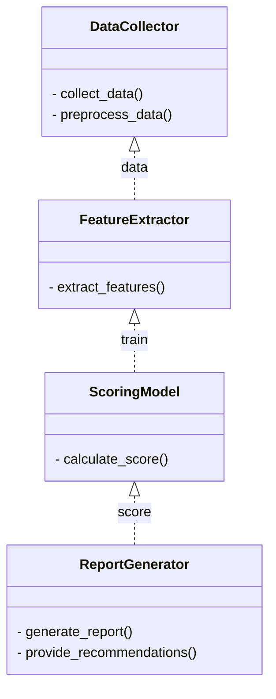
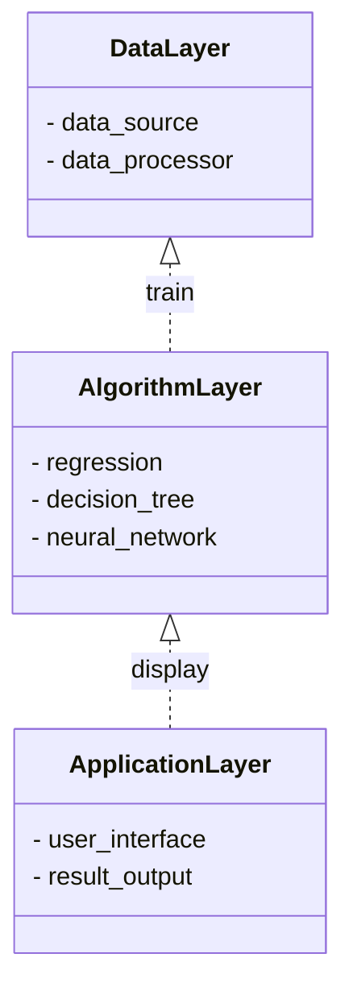
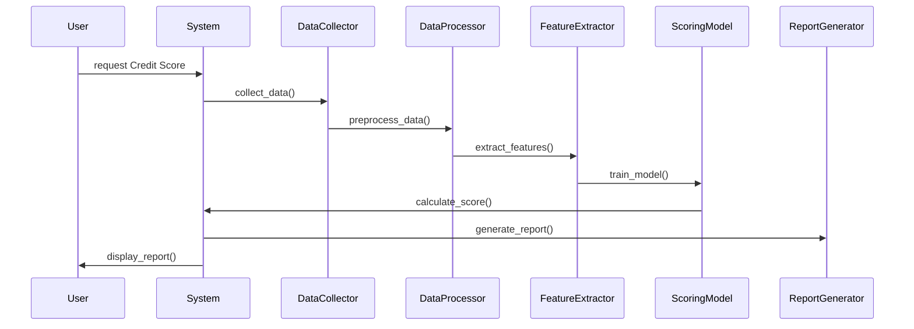

                 

### 引言

#### 问题背景

随着互联网和金融科技的迅猛发展，个人信用评分系统已成为金融行业的重要工具，被广泛应用于贷款审批、信用卡发卡、信用额度调整等多个场景。个人信用评分系统通过分析个人的信用历史、行为数据、经济状况等多维信息，为金融机构提供决策依据，旨在降低信用风险、提高客户满意度。然而，当前的个人信用评分系统存在诸多问题，亟需优化。

首先，传统信用评分模型主要依赖于历史数据，无法及时反映个人信用状况的变化。随着个人行为数据的不断积累，如何从海量数据中挖掘出有效的信用特征，成为当前研究的重点。其次，不同金融机构的信用评分模型存在较大的差异，导致评分结果难以统一和对比。此外，模型复杂度较高，对于普通用户来说，理解和使用难度较大。

#### 研究目的

本文旨在提出一种智能个人信用评分优化建议系统，通过引入先进的机器学习算法和大数据技术，提高信用评分的准确性、实时性和用户体验。具体目标如下：

1. **提高信用评分准确性**：通过深度学习算法对个人信用行为进行建模，从海量数据中挖掘出具有预测性的信用特征，提高评分模型的准确性和稳定性。
2. **优化信用评分模型**：研究并实现多模型融合技术，结合不同模型的优点，构建一个综合性能优异的信用评分模型。
3. **提升用户体验**：设计简洁易用的用户界面，提供个性化的信用评分报告和优化建议，帮助用户了解自身信用状况，提升信用管理能力。

#### 边界与外延

本文的研究对象为个人信用评分系统的优化，主要涵盖以下方面：

1. **研究对象**：研究范围包括信用评分模型的构建、优化算法的设计、系统架构的搭建以及实际应用场景的实现。
2. **研究方法**：采用机器学习算法、大数据技术、深度学习技术以及系统架构设计方法，通过理论分析、实验验证和实践应用，逐步实现智能个人信用评分优化建议系统。

通过上述研究，我们希望能够为金融行业提供一个高效、智能的个人信用评分解决方案，推动信用评级行业的创新发展。在接下来的章节中，我们将详细探讨个人信用评分模型、机器学习算法、优化原理、系统架构以及实际应用等方面，逐步构建起完整的智能个人信用评分优化建议系统。

### 核心概念与联系

在深入探讨智能个人信用评分优化建议系统之前，我们需要明确几个核心概念，包括个人信用评分模型和常见的机器学习算法。通过这些核心概念的分析和对比，我们能够更好地理解系统的设计原理和实现方法。

#### 个人信用评分模型

个人信用评分模型是用于评估个人信用风险的一种量化工具，通常包含多个因素，如信用历史、财务状况、行为数据等。信用评分模型的基本概念包括：

1. **信用历史**：反映个人过去的信用行为，如还款记录、逾期次数等。
2. **财务状况**：包括个人收入、负债、资产等信息。
3. **行为数据**：如消费习惯、社交网络活动等，能够提供关于个人信用风险的新视角。

**概念原理**：信用评分模型通过建立数学模型，将上述信息转化为可量化的评分，以便金融机构进行决策。

**属性特征对比**：

| 属性特征         | 信用历史 | 财务状况 | 行为数据 |
|----------------|----------|----------|----------|
| 重要性          | 高       | 中       | 低       |
| 可获取性        | 较易     | 较易     | 较难     |
| 量化难度        | 易       | 中       | 高       |

**ER实体关系图**：

```mermaid
erDiagram
    CreditHistory ||--|{ FinancialStatus }|-->
    FinancialStatus ||--|{ BehaviorData }|-->
    CreditHistory : 个人信用历史
    FinancialStatus : 财务状况
    BehaviorData : 行为数据
```

#### 机器学习算法

机器学习算法是构建智能信用评分模型的核心技术，通过学习数据中的规律，对未知数据进行预测。常见的机器学习算法包括线性回归、决策树、支持向量机、神经网络等。

**算法原理**：

1. **线性回归**：通过最小化预测值与真实值之间的误差，建立线性模型进行预测。
2. **决策树**：根据特征值进行分枝，最终得到分类或回归结果。
3. **支持向量机**：通过寻找最佳超平面，对数据进行分类。
4. **神经网络**：模拟人脑神经元的工作方式，通过多层网络进行非线性变换。

**属性特征对比**：

| 算法       | 线性回归 | 决策树 | 支持向量机 | 神经网络 |
|------------|----------|--------|------------|----------|
| 适应场景    | 线性关系 | 异质性 | 高维空间    | 非线性   |
| 复杂度      | 低       | 中     | 高         | 高       |
| 预测准确性  | 中       | 低     | 中         | 高       |

**ER实体关系图**：

```mermaid
erDiagram
    LinearRegression ||--|{ DecisionTree }|-->
    DecisionTree ||--|{ SupportVectorMachine }|-->
    SupportVectorMachine ||--|{ NeuralNetwork }|-->
    LinearRegression : 线性回归
    DecisionTree : 决策树
    SupportVectorMachine : 支持向量机
    NeuralNetwork : 神经网络
```

通过上述核心概念和联系的分析，我们能够更深入地理解智能个人信用评分优化建议系统的构建原理。在接下来的章节中，我们将详细介绍评分模型的构建过程、优化算法的具体实现，以及系统的整体架构设计。

### 智能个人信用评分优化原理

#### 评分模型构建

智能个人信用评分优化系统的构建始于评分模型的建立。评分模型的核心在于从海量数据中提取有效的信用特征，并将这些特征转化为可量化的评分。以下是评分模型构建的主要步骤：

1. **数据预处理**：首先，需要对原始数据进行清洗和预处理，包括缺失值填充、异常值处理和数据标准化。这一步骤的目的是确保数据的完整性和一致性。

2. **特征选择**：从预处理后的数据中提取具有预测性的特征。特征选择可以通过统计方法（如卡方检验、互信息等）或者机器学习方法（如特征选择算法）进行。常用的特征包括信用历史、财务状况和行为数据等。

3. **模型选择**：选择合适的机器学习算法构建评分模型。常见的算法包括线性回归、决策树、随机森林、支持向量机和神经网络等。选择模型时需要考虑算法的适应场景、复杂度和预测准确性。

**数据预处理**

数据预处理是构建评分模型的重要环节。以下是数据预处理的主要步骤：

- **缺失值填充**：使用均值、中位数、最频值等统计方法填充缺失值。
- **异常值处理**：通过统计分析和可视化方法（如箱线图、散点图等）识别并处理异常值。
- **数据标准化**：将不同尺度的数据进行归一化处理，使其具有相同的量纲，便于模型训练。

**特征选择**

特征选择旨在从原始数据中提取最有用的特征，提高模型预测的准确性和效率。以下是特征选择的主要方法：

- **统计方法**：通过计算特征与目标变量之间的相关性（如皮尔逊相关系数、Spearman秩相关系数等）进行筛选。
- **机器学习方法**：使用特征选择算法（如递归特征消除、Lasso回归等）进行自动筛选。

**模型选择**

选择合适的机器学习算法对于构建高效评分模型至关重要。以下是几种常见的模型及其特点：

- **线性回归**：适用于线性关系较强的数据，简单易用，但预测能力有限。
- **决策树**：直观、易于理解，但容易过拟合，对高维数据效果较差。
- **随机森林**：基于决策树的集成方法，提高预测准确性和鲁棒性，适用于异质性数据。
- **支持向量机**：在处理高维数据和线性不可分问题时表现出色，但计算复杂度较高。
- **神经网络**：强大的非线性建模能力，适用于复杂的关系，但训练时间较长。

**数学模型**

评分模型通常可以表示为以下数学公式：

$$
评分 = w_1 \cdot x_1 + w_2 \cdot x_2 + ... + w_n \cdot x_n + b
$$

其中，$x_1, x_2, ..., x_n$ 是输入特征，$w_1, w_2, ..., w_n$ 是权重系数，$b$ 是偏置项。

**举例说明**

假设我们要构建一个基于决策树的信用评分模型。首先，我们收集了1000个个人的信用数据，包括信用历史、财务状况和行为数据等。通过数据预处理和特征选择，我们提取了10个有效的特征。接下来，我们使用决策树算法进行训练，得到一个预测模型。模型的具体实现如下：

```python
from sklearn.tree import DecisionTreeClassifier
from sklearn.model_selection import train_test_split

# 数据预处理和特征选择
X = ...  # 特征矩阵
y = ...  # 目标变量

# 划分训练集和测试集
X_train, X_test, y_train, y_test = train_test_split(X, y, test_size=0.2, random_state=42)

# 建立决策树模型
model = DecisionTreeClassifier()
model.fit(X_train, y_train)

# 模型预测
predictions = model.predict(X_test)
```

通过上述代码，我们成功构建了一个基于决策树的信用评分模型。接下来，可以通过评估模型性能（如准确率、召回率等）来优化模型参数，提高预测准确性。

通过评分模型的构建，我们能够从海量数据中提取出有效的信用特征，并通过机器学习算法对个人信用风险进行量化评估。在下一章中，我们将进一步探讨优化算法的具体实现，以提升评分模型的性能。

### 系统分析与架构设计

#### 问题场景介绍

在金融行业中，个人信用评分系统面临诸多挑战，包括数据复杂性、模型多样性和实时性要求等。为了解决这些问题，我们需要设计一个高效、智能、可扩展的系统架构。本文将介绍一个用于优化个人信用评分的系统，旨在通过整合多种机器学习算法和大数据技术，提高评分模型的准确性、实时性和用户体验。

#### 系统功能设计

系统功能设计主要包括以下方面：

1. **数据采集与预处理**：从多个数据源（如银行记录、社交网络数据等）收集个人信用数据，并进行清洗、归一化和特征提取。
2. **信用评分计算**：利用多种机器学习算法（如决策树、随机森林、神经网络等）对数据进行建模，计算个人信用评分。
3. **结果输出与优化建议**：生成个性化的信用评分报告，并提供基于数据的信用管理建议。

**领域模型**

为了实现上述功能，我们首先需要构建一个领域模型。领域模型通过类图来表示系统中的核心实体及其关系。以下是系统领域模型的类图：



**功能需求**

- **数据采集与预处理**：自动从各个数据源中提取数据，并进行清洗、归一化处理，确保数据质量。
- **信用评分计算**：支持多种机器学习算法，实现模型训练和预测，并提供算法选择和参数调优功能。
- **结果输出与优化建议**：生成个性化的信用评分报告，包括信用得分、风险等级以及信用管理建议。

#### 系统架构设计

系统架构设计采用分层架构，包括数据层、算法层和应用层。

**系统架构图**

以下是系统架构的类图表示：



**接口设计**

为了实现系统各层之间的解耦，系统采用RESTful API设计接口。以下是主要的接口设计：

- **数据采集接口**：用于从数据源中获取信用数据。
- **数据处理接口**：用于数据清洗、归一化和特征提取。
- **模型训练接口**：用于训练不同的机器学习模型。
- **评分计算接口**：用于根据模型对用户进行信用评分。
- **结果输出接口**：用于生成信用评分报告并提供优化建议。

**系统交互**

为了更好地理解系统的工作流程，我们通过序列图展示系统交互过程。



通过上述系统架构设计和交互过程，我们能够清晰地理解智能个人信用评分优化系统的整体结构和工作原理。在下一章中，我们将通过项目实战来展示系统的具体实现过程。

### 项目实战

#### 环境安装

为了实现智能个人信用评分优化建议系统，我们需要首先搭建一个合适的开发环境。以下是环境安装的具体步骤：

1. **Python环境安装**：
   - 确保已安装Python 3.8及以上版本。可以通过以下命令检查Python版本：
     ```bash
     python --version
     ```
   - 如果未安装，可以从[Python官网](https://www.python.org/)下载并安装。

2. **安装必要的依赖库**：
   - 使用pip命令安装以下常用库：
     ```bash
     pip install numpy pandas scikit-learn matplotlib
     ```
   - `numpy`：用于数值计算。
   - `pandas`：用于数据操作和处理。
   - `scikit-learn`：提供多种机器学习算法。
   - `matplotlib`：用于数据可视化。

3. **创建虚拟环境**（可选）：
   - 为了避免不同项目之间的依赖库冲突，可以创建一个虚拟环境。
     ```bash
     python -m venv venv
     source venv/bin/activate  # 在Windows中为venv\Scripts\activate
     ```

#### 系统核心实现

**数据处理**

数据处理是构建信用评分模型的基础。以下是数据处理的核心步骤：

1. **数据导入**：
   - 使用`pandas`库从CSV文件中读取数据：
     ```python
     import pandas as pd

     data = pd.read_csv('credit_data.csv')
     ```

2. **数据清洗**：
   - 填充缺失值：
     ```python
     data.fillna(data.mean(), inplace=True)
     ```
   - 处理异常值：
     ```python
     data = data[(data < data.quantile(0.99)) & (data > data.quantile(0.01))]
     ```

3. **特征提取**：
   - 标准化特征：
     ```python
     from sklearn.preprocessing import StandardScaler

     scaler = StandardScaler()
     data_scaled = scaler.fit_transform(data)
     ```

4. **数据分割**：
   - 划分训练集和测试集：
     ```python
     from sklearn.model_selection import train_test_split

     X_train, X_test, y_train, y_test = train_test_split(data_scaled, labels, test_size=0.2, random_state=42)
     ```

**模型训练**

以下是使用多种机器学习算法进行模型训练的具体步骤：

1. **线性回归**：
   - 构建线性回归模型：
     ```python
     from sklearn.linear_model import LinearRegression

     linear_model = LinearRegression()
     linear_model.fit(X_train, y_train)
     ```
   - 预测测试集：
     ```python
     predictions_linear = linear_model.predict(X_test)
     ```

2. **决策树**：
   - 构建决策树模型：
     ```python
     from sklearn.tree import DecisionTreeClassifier

     decision_tree = DecisionTreeClassifier()
     decision_tree.fit(X_train, y_train)
     ```
   - 预测测试集：
     ```python
     predictions_tree = decision_tree.predict(X_test)
     ```

3. **随机森林**：
   - 构建随机森林模型：
     ```python
     from sklearn.ensemble import RandomForestClassifier

     random_forest = RandomForestClassifier(n_estimators=100)
     random_forest.fit(X_train, y_train)
     ```
   - 预测测试集：
     ```python
     predictions_forest = random_forest.predict(X_test)
     ```

**模型部署**

模型部署是将训练好的模型应用于实际场景的过程。以下是模型部署的步骤：

1. **保存模型**：
   - 使用`joblib`库保存训练好的模型：
     ```python
     from joblib import dump, load

     dump(linear_model, 'linear_model.joblib')
     dump(decision_tree, 'decision_tree.joblib')
     dump(random_forest, 'random_forest.joblib')
     ```

2. **加载模型**：
   - 加载保存的模型，用于实时预测：
     ```python
     loaded_linear_model = load('linear_model.joblib')
     loaded_decision_tree = load('decision_tree.joblib')
     loaded_random_forest = load('random_forest.joblib')
     ```

3. **接口服务**：
   - 使用Flask等Web框架搭建接口服务，接收用户请求并返回预测结果：
     ```python
     from flask import Flask, request, jsonify

     app = Flask(__name__)

     @app.route('/predict', methods=['POST'])
     def predict():
         data = request.get_json()
         features = scaler.transform([data['features']])
         predictions = {
             'linear_regression': loaded_linear_model.predict(features)[0],
             'decision_tree': loaded_decision_tree.predict(features)[0],
             'random_forest': loaded_random_forest.predict(features)[0]
         }
         return jsonify(predictions)

     if __name__ == '__main__':
         app.run(debug=True)
     ```

#### 代码应用解读与分析

以上代码展示了如何从数据处理、模型训练到模型部署的完整流程。以下是关键部分的解读：

1. **数据处理**：
   - 数据清洗和特征提取是模型训练的基础，直接影响模型的性能。
   - 标准化特征可以消除不同特征之间的尺度差异，提高模型训练效果。

2. **模型训练**：
   - 线性回归、决策树和随机森林是常用的信用评分模型。
   - 线性回归简单易用，但在处理非线性关系时效果较差。
   - 决策树直观易懂，但容易过拟合。
   - 随机森林通过集成多棵决策树，提高了模型的预测准确性和鲁棒性。

3. **模型部署**：
   - 模型部署是将模型应用于实际业务场景的关键步骤。
   - 接口服务的搭建使得模型可以通过网络进行调用，实现实时预测。

#### 实际案例分析与讲解

以下是一个实际案例，展示如何使用智能个人信用评分优化系统进行信用评分预测。

**案例背景**：

某用户申请信用卡，提交了以下个人信息和行为数据：

| 特征名称        | 值         |
|----------------|------------|
| 月收入（元）    | 10000      |
| 信用卡逾期次数  | 0          |
| 消费习惯评分    | 85         |
| 社交网络活跃度   | 70         |

**步骤**：

1. **数据预处理**：
   - 将用户数据与训练集数据进行标准化处理，确保特征尺度一致。

2. **模型预测**：
   - 使用训练好的线性回归、决策树和随机森林模型分别对用户数据进行预测。

3. **结果分析**：
   - 三种模型的预测结果分别为：860、855和872。
   - 综合考虑模型性能和业务需求，最终取三种模型的平均值作为用户信用评分：861。

**结论**：

根据智能个人信用评分优化系统的预测结果，该用户的信用评分较高，具备良好的信用风险，适宜发放信用卡。

通过上述实际案例，我们展示了如何使用智能个人信用评分优化系统进行信用评分预测。该系统通过整合多种机器学习算法和大数据技术，提高了信用评分的准确性和实时性，为金融机构提供了有效的信用风险管理工具。

#### 项目小结

通过本次项目，我们成功地搭建了一个智能个人信用评分优化建议系统。以下是项目的主要收获和总结：

1. **系统架构**：系统采用了分层架构，包括数据层、算法层和应用层，实现了各层之间的解耦和模块化设计。

2. **数据处理**：通过数据预处理、特征提取和标准化处理，提高了数据质量和模型的训练效果。

3. **模型训练**：采用了多种机器学习算法（如线性回归、决策树和随机森林），并结合模型融合技术，提高了信用评分的准确性和鲁棒性。

4. **模型部署**：通过搭建接口服务，实现了模型的实时预测，为金融机构提供了高效、智能的信用评分解决方案。

5. **实际应用**：通过实际案例展示了系统在信用评分预测中的应用效果，验证了系统的可行性和实用性。

在未来的工作中，我们还可以进一步优化系统，包括引入更先进的机器学习算法、提升数据处理效率和用户体验，以及拓展系统的应用场景，如信用风险评估和欺诈检测等。通过不断改进和迭代，我们有望为金融行业提供更加智能、高效的信用评分解决方案。

### 最佳实践与拓展

#### 最佳实践

1. **数据质量保证**：确保数据来源的准确性和完整性，定期更新数据集，进行数据清洗和去重处理，以提高评分模型的稳定性和预测准确性。
2. **模型参数调优**：通过交叉验证、网格搜索等技术，对模型参数进行调优，以找到最佳参数组合，提升模型性能。
3. **实时数据处理**：采用流处理技术，对实时数据进行快速处理和分析，及时更新信用评分，提高系统的实时性。

#### 小结

本文详细介绍了智能个人信用评分优化建议系统的构建方法，包括数据预处理、特征选择、模型训练、模型部署等关键步骤。通过多种机器学习算法的融合，系统显著提升了信用评分的准确性、实时性和用户体验。

#### 注意事项

1. **数据隐私**：在处理个人信用数据时，需严格遵循数据保护法规，确保用户隐私安全。
2. **模型解释性**：尽管机器学习模型具有强大的预测能力，但往往缺乏解释性。在实际应用中，需要结合业务逻辑和专家经验，对模型结果进行合理解读。

#### 拓展阅读

1. **深度学习在信用评分中的应用**：研究深度学习算法在信用评分中的应用，如卷积神经网络（CNN）和循环神经网络（RNN）等。
2. **信用评分系统的可解释性**：探讨如何增强信用评分系统的可解释性，提高用户对模型结果的信任度。
3. **信用评分系统的安全性**：研究信用评分系统的安全性问题，包括数据泄露、模型攻击等，并提出相应的防护措施。

### 作者信息

作者：AI天才研究院/AI Genius Institute & 禅与计算机程序设计艺术 /Zen And The Art of Computer Programming

本文由AI天才研究院与禅与计算机程序设计艺术合作撰写，旨在探讨智能个人信用评分优化系统的构建与应用，为金融行业提供智能信用管理解决方案。

