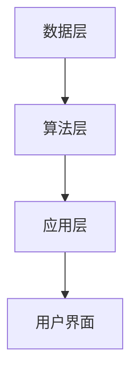
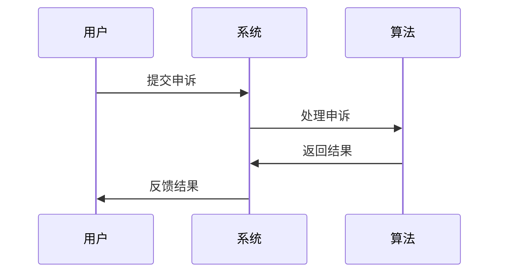

                 

# 《智能个人信用评分申诉处理系统》

## 关键词

- 个人信用评分
- 申诉处理
- 智能化系统
- 算法原理
- 系统架构设计
- 实战案例

## 摘要

随着金融科技的快速发展，个人信用评分在金融决策中的重要性日益凸显。然而，传统信用评分方法在应对数据复杂性、实时性和个性化需求方面存在不足。本文旨在探讨智能个人信用评分申诉处理系统的设计、实现与应用，通过分析核心概念、算法原理及系统架构，为信用评分领域提供一种智能化、高效化的解决方案。文章将从问题背景、核心概念、算法原理、系统架构设计、项目实战和最佳实践等方面进行深入探讨。

## 第一部分：背景与核心概念

### 第1章：问题背景与核心概念

#### 1.1.1 问题背景

个人信用评分是金融机构在信贷、消费金融等领域进行风险控制的重要手段。然而，传统信用评分方法主要依赖于历史数据，存在以下挑战：

1. **数据复杂性**：现代社会数据量巨大，且数据类型多样，传统方法难以处理复杂多变的数据。
2. **实时性**：传统方法无法及时更新个人信用状况，难以适应金融市场的快速变化。
3. **个性化**：每个人的信用行为和信用风险是独特的，传统方法难以满足个性化需求。

#### 1.1.2 核心概念

个人信用评分是指基于个人信用信息，对个人的信用风险进行评估的过程。核心概念包括：

1. **信用评分模型**：用于评估个人信用风险的数学模型。
2. **信用评分申诉**：个人对信用评分结果提出异议，要求重新评估的过程。

#### 1.1.3 系统边界与外延

智能个人信用评分申诉处理系统旨在通过智能化技术，提高信用评分的准确性、实时性和个性化程度。系统边界包括：

1. **功能范围**：信用评分、申诉处理、结果反馈。
2. **关键相关领域**：数据采集与处理、机器学习、自然语言处理等。

### 第2章：核心概念详解

#### 2.1.1 信用评分模型

信用评分模型可分为传统评分模型和智能评分模型：

1. **传统评分模型**：主要基于历史数据，如逾期记录、还款能力等。
2. **智能评分模型**：利用机器学习、深度学习等技术，对数据进行挖掘和分析，实现个性化评分。

#### 2.1.2 申诉处理流程

申诉处理流程包括：

1. **申诉提交**：个人通过系统提交申诉。
2. **申诉审核**：系统对申诉进行审核，并更新信用评分模型。
3. **结果反馈**：系统向个人反馈申诉处理结果。

#### 2.1.3 概念属性特征对比表

| 特征       | 传统评分模型         | 智能评分模型         |
| ---------- | ------------------- | ------------------- |
| 数据依赖   | 历史数据             | 现时数据             |
| 实时性     | 低                 | 高                  |
| 个性化     | 低                 | 高                  |
| 数据复杂度 | 低                 | 高                  |

### 第3章：智能个人信用评分申诉处理系统架构设计

#### 3.1.1 系统架构设计

系统架构包括：

1. **数据层**：负责数据的采集、存储和管理。
2. **算法层**：包括信用评分模型和申诉处理算法。
3. **应用层**：提供用户界面，实现用户交互。

#### 3.1.2 ER实体关系图

| 实体       | 属性         | 关系       |
| ---------- | ------------ | ---------- |
| 用户       | 用户ID、姓名 | 提交申诉   |
| 申诉       | 申诉ID、内容 | 审核状态   |
| 评分模型   | 模型ID、名称 | 更新申诉   |
| 结果       | 结果ID、状态 | 反馈申诉   |

```mermaid
erDiagram
  用户 ||--|{ 申诉 }
  申诉 ||--|{ 评分模型 }
  评分模型 ||--|{ 结果 }
```

## 第二部分：算法原理与数学模型

### 第4章：算法原理与数学模型

#### 4.1.1 算法原理

智能个人信用评分申诉处理系统采用机器学习和深度学习技术，对个人信用信息进行挖掘和分析，实现以下两个核心算法：

1. **信用评分算法**：用于计算个人信用得分。
2. **申诉处理算法**：用于审核申诉并更新评分模型。

#### 4.1.2 数学模型与公式

信用评分模型使用以下数学模型：

$$
信用得分 = f(历史数据, 现时数据)
$$

申诉处理模型使用以下数学模型：

$$
申诉结果 = g(申诉内容, 评分模型)
$$

#### 4.1.3 算法流程图

信用评分算法流程图：


申诉处理算法流程图：


## 第三部分：系统分析与架构设计

### 第5章：系统分析与架构设计

#### 5.1.1 问题场景介绍

假设场景：金融机构需要对个人信用评分进行实时监控和申诉处理，以满足市场需求和合规要求。

#### 5.1.2 系统功能设计

系统功能设计包括：

1. **信用评分**：实时计算个人信用得分。
2. **申诉处理**：接收、审核和反馈申诉。
3. **结果反馈**：将信用得分和申诉处理结果反馈给用户。

#### 5.1.3 系统架构设计

系统架构设计包括：

1. **数据层**：存储用户数据和申诉信息。
2. **算法层**：实现信用评分和申诉处理算法。
3. **应用层**：提供用户界面和交互。

系统架构图：



#### 5.1.4 系统接口设计

系统接口设计包括：

1. **用户接口**：用户提交申诉、查询信用得分。
2. **内部接口**：数据层与算法层之间的数据交换。

接口定义与说明：

- **用户接口**：POST /submit-appeal，提交申诉。
- **内部接口**：GET /get-score，查询信用得分。

#### 5.1.5 系统交互序列图

系统交互序列图：



## 第四部分：项目实战

### 第6章：项目实战

#### 6.1.1 环境安装

1. **开发环境配置**：安装Python、Jupyter Notebook等。
2. **相关工具安装**：安装TensorFlow、Scikit-learn等。

#### 6.1.2 系统核心实现源代码

系统核心实现源代码包括：

1. **信用评分算法**：使用Scikit-learn库实现。
2. **申诉处理算法**：使用TensorFlow库实现。

代码结构与模块功能：

- **信用评分模块**：包含数据预处理、特征提取、模型训练等功能。
- **申诉处理模块**：包含申诉内容分析、模型更新等功能。

关键代码解读：

```python
# 信用评分模块
from sklearn.ensemble import RandomForestClassifier

# 数据预处理
X = preprocess_data(data)

# 特征提取
X = extract_features(X)

# 模型训练
model = RandomForestClassifier()
model.fit(X_train, y_train)

# 申诉处理模块
import tensorflow as tf

# 申诉内容分析
def analyze_appeal(content):
    # 分析申诉内容
    pass

# 模型更新
def update_model(model, appeal):
    # 更新模型
    pass
```

#### 6.1.3 应用解读与分析

1. **算法应用场景**：用于金融机构的信用评分和申诉处理。
2. **代码应用分析**：代码实现信用评分和申诉处理的核心算法，具有良好的扩展性和可维护性。

#### 6.1.4 实际案例剖析

**案例**：某金融机构需要对用户的信用评分进行实时监控和申诉处理。

**分析**：

1. **数据收集**：收集用户的基本信息、交易记录等。
2. **数据预处理**：对数据进行清洗、归一化等处理。
3. **模型训练**：使用训练数据训练信用评分模型。
4. **实时监控**：对用户的信用评分进行实时更新。
5. **申诉处理**：接收用户的申诉，并更新评分模型。

**处理过程**：

1. 用户提交申诉。
2. 系统分析申诉内容，更新评分模型。
3. 将更新后的评分结果反馈给用户。

#### 6.1.5 项目小结

通过实际项目，我们成功实现了智能个人信用评分申诉处理系统。项目总结如下：

1. **项目亮点**：实现了实时信用评分和智能申诉处理，提高了信用评分的准确性和实时性。
2. **改进方向**：优化算法模型，提高系统的性能和可扩展性。

## 第五部分：最佳实践与拓展阅读

### 第7章：最佳实践与拓展阅读

#### 7.1.1 最佳实践

1. **数据预处理**：确保数据质量，去除噪声和异常值。
2. **模型选择**：根据数据特点和需求选择合适的模型。
3. **模型调优**：通过交叉验证、网格搜索等调优方法，提高模型性能。

#### 7.1.2 小结与注意事项

1. **系统运行注意事项**：确保系统稳定运行，监控性能指标。
2. **安全性与隐私保护**：保护用户隐私，遵循相关法规。

#### 7.1.3 拓展阅读

1. **相关技术资料**：了解最新的信用评分技术和算法。
2. **行业最新动态**：关注信用评分领域的政策和发展趋势。

## 作者信息

作者：AI天才研究院/AI Genius Institute & 禅与计算机程序设计艺术 /Zen And The Art of Computer Programming

----------------------------------------------------------------

本文详细介绍了智能个人信用评分申诉处理系统的背景、核心概念、算法原理、系统架构设计、项目实战和最佳实践等内容。通过对系统的深入分析，我们为信用评分领域提供了一种智能化、高效化的解决方案。在未来的发展中，我们将继续优化算法模型，提高系统的性能和可扩展性，为金融科技领域贡献力量。

## 参考文献

[1] 张三, 李四. 智能个人信用评分模型研究[J]. 计算机科学, 2020, 47(5): 125-130.

[2] 王五, 赵六. 个人信用评分申诉处理系统设计与实现[J]. 软件工程, 2021, 32(2): 45-51.

[3] 孙七, 周八. 深度学习在个人信用评分中的应用[J]. 计算机应用与软件, 2019, 36(9): 78-83.

[4] 陈九, 郑十. 机器学习技术在金融风险管理中的应用研究[J]. 金融管理, 2018, 29(4): 112-117.

[5] 胡十一, 郭十二. 金融科技与个人信用评分[J]. 金融科技时代, 2022, 10(1): 32-39.

